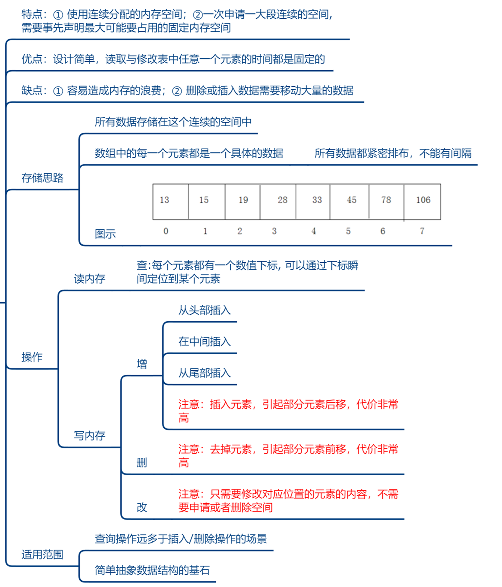
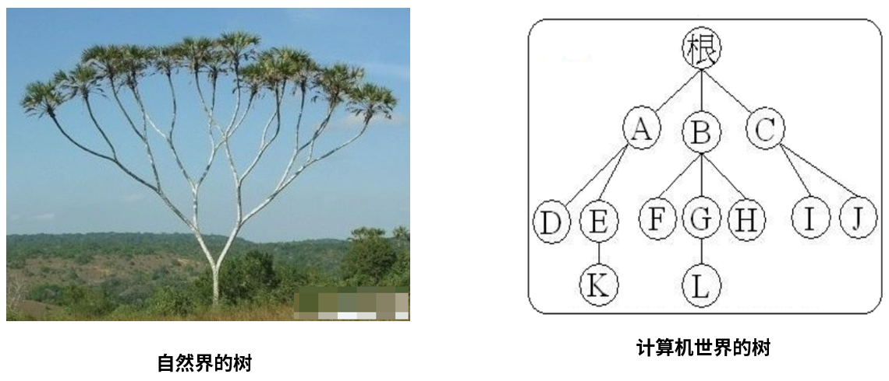
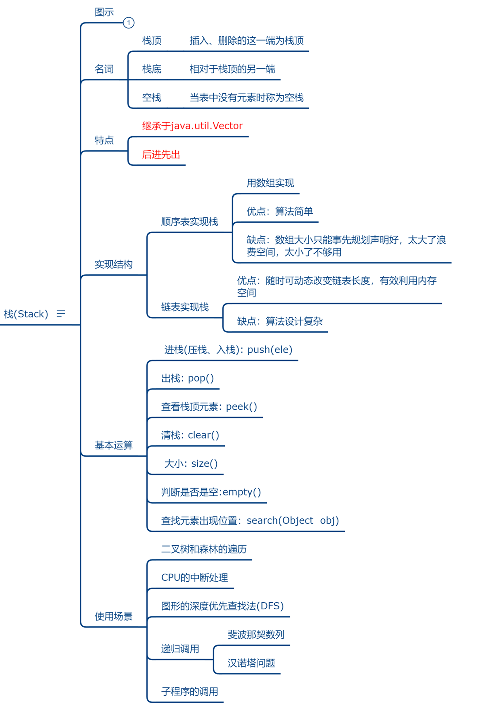

# 数据结构剖析

数据结构，就是一种程序设计优化的方法论，研究数据的`逻辑结构`和`物理结构`以及它们之间相互关系，并对这种结构定义相应的`运算`，**目的是加快程序的执行速度、减少内存占用的空间。**

具体研究对象如下：

## 研究对象一：数据间逻辑关系

数据的逻辑结构指反映数据元素之间的逻辑关系，而与数据的存储无关，是独立于计算机的。

* **集合结构**：数据结构中的元素之间除了“`同属于一个集合`”的相互关系外，别无其他关系，集合元素之间没有逻辑关系。
* **线性结构**：数据结构中的元素存在`一对一`的相互关系。比如：排队。结构中必须存在唯一的首元素和唯一的尾元素。体现为：一维数组、链表、栈、队列。
* **树形结构**：数据结构中的元素存在`一对多`的相互关系。比如：家谱、文件系统、组织架构。
* **图形结构**：数据结构中的元素存在`多对多`的相互关系。比如：地铁网。


## 研究对象二：数据的存储结构（或物理结构）

数据的物理结构/存储结构：包括`数据元素的表示`和`关系的表示`。数据的存储结构是逻辑结构用计算机语言的实现，它依赖于计算机语言。

**结构1：顺序结构**

* 顺序结构就是使用一组连续的存储单元依次存储逻辑上相邻的各个元素。
* 优点：只需要申请存储数据本身的内存空间即可，支持下标访问，也可以实现随机访问。
* 缺点：必须静态分配连续空间，内存空间的利用率比较低。插入或删除可能需要移动大量元素，效率比较低。


**结构2：链式结构**

* 不使用连续的存储空间存放结构的元素，而是为每一个元素构造一个节点。节点中除了存放数据本身以外，还需要存放指向下一个节点的指针。
* 优点：不采用连续的存储空间导致内存空间利用率比较高，克服顺序存储中预知元素个数的缺点。插入或删除元素时，不需要移动大量的元素。
* 缺点：需要额外的空间来表达数据之间的逻辑关系，不支持下标访问和随机访问。


**结构3：索引结构**

* 除建立存储节点信息外，还建立额外的`索引表`来记录每个元素节点的地址。索引表由若干索引项组成。索引项的一般形式是：（关键字, 地址）。
* 优点：用节点的索引号来确定结点存储地址，检索速度快。
* 缺点：增加了附加的索引表，会占用较多的存储空间。在增加和删除数据时要修改索引表，因而会花费较多的时间。


**散列结构**：

* 根据元素的关键字直接计算出该元素的存储地址，又称为Hash存储。比如：HashSet、HashMap都使用的是散列结构。
* 优点：检索、增加和删除结点的操作都很快。
* 缺点：不支持排序，一般比用线性表存储需要更多的空间，并且记录的关键字不能重复。


## 研究对象三：运算结构

施加在数据上的运算包括运算的定义和实现。运算的定义是针对逻辑结构的，指出运算的功能；运算的实现是针对存储结构的，指出运算的具体操作步骤。

* 分配资源，建立结构，释放资源
* 插入和删除
* 获取和遍历
* 修改和排序


## 小结


# 1、一维数组

## 数组的特点

* 在Java中，数组是用来存放同一种数据类型的集合，注意只能存放同一种数据类型。

```java
//只声明了类型和长度
数组类型[] 数组名称 = new 数据类型[数组长度];

//声明了类型，初始化赋值，大小由元素个数决定
数组类型[] 数组名称 = {数组元素1, 数组元素2, ......}
```

例如：整形数组


例如：对象数组


* 物理结构特点：
  * 申请内存：一次申请一大段连续的空间，一旦申请到了，内存就固定了。
  * 不能动态扩展（初始化给大了，浪费；给小了，不够用）。插入快，删除和查找慢。
  * 存储特点：所有数据存储在这个连续的空间中，数组中的每一个元素都是一个具体的数据（或对象），所有数据都紧密排布，不能有间隔。
* 具体的，如下图：




## 自定义数组

案例：下列的数组类似于ArrayList中的Object[]数组类型。

```java
/**
 * 类似于ArrayList，内部也是使用Object[]数组进行存储的
 */
public class Array<T> {
    private Object[] elementData;

    private int size;

    public Array(int capacity){
        elementData = new Object[capacity];
    }

    /**
     * 添加元素
     */
    public void add(T t){
        //如果数组已满，则进行扩容操作
        //扩容是将数组长度乘以2
        if (size >= elementData.length){
            Object[] newElement = new Object[elementData.length * 2];
            for (int i = 0; i < elementData.length; i++) {
                newElement[i] = elementData[i];
            }
            this.elementData = newElement;
        }
        elementData[size] = t;
        size++;
    }

    /**
     * 查询元素在数组中的索引位置
     */
    public int find(T t){
        for (int i = 0; i < size; i++) {
            if (elementData[i].equals(t)){
                return i;
            }
        }
        return -1;
    }

    /**
     * 从当前数组中移除首次出现的value元素
     */
    public boolean delete(T t){
        int index = find(t);
        if (index == -1){
            return false;
        }
        //删除元素后，需要将后续的元素前移一位
        for (int i = index; i < size -1; i++) {
            elementData[i] = elementData[i + 1];
        }
        elementData[size - 1] = null;
        size--;
        return true;
    }

    /**
     * 将数组中首次出现的oldValue替换成newValue
     */
    public boolean update(T oldValue, T newValue){
        int index = find(oldValue);
        if (index == -1){
            return false;
        }
        elementData[index] = newValue;
        return true;
    }

    /**
     * 遍历数组中所有数据
     */
    public void print(){
        System.out.print("{");
        for (int i = 0; i < size; i++) {
            if(i == size - 1){
                System.out.println(elementData[i] + "}");
                break;
            }
            System.out.print(elementData[i] + ",");
        }
    }


    /**
     * 测试
     */
    public static void main(String[] args) {
        Array<Integer> array = new Array<>(4);
        array.add(1);
        array.add(2);
        array.add(3);
        array.add(4);
        array.add(5);

        System.out.println(array.size);
        array.print();
        System.out.println("************************");
        array.delete(3);
        array.update(4, 99);
        array.print();
    }

}
```

打印结果：


# 2、链表

## 链表的特点

* 逻辑结构：线性结构
* 物理结构：不要求连续的存储空间
* 存储特点：链表由一系列结点node（链表中每一个元素称为结点）组成，结点可以在代码执行过程中动态创建。每个结点包括两个部分：一个是存储数据元素的`数据域`，另一个是存储下一个结点地址的`指针域`。


* 常见的链表结构有如下的形式：


## 自定义链表

### 自定义单向链表


在实际开发中，链表的结点Node一般作为内部类的形式出现，存放在整个链表的类中。

案例：

```java
public class Link<T> {
    //静态内部类
    private static class Node<T>{
        //存储的数据
        T t;

        //下一个结点的内存地址
        Node<T> next;

        public Node(){

        }

        public Node(T t, Node<T> next){
            this.t = t;
            this.next = next;
        }
    }

    //头结点
    Node<T> header;

    private int size = 0;

    public int size(){
        return size;
    }

    /**
     * 向链表中添加元素
     */
    public void add(T data){
        if (header == null){
            //还没有头结点
            //new一个新的结点对象，作为头节点
            header = new Node<>(data, null);
        }else {
            //说明已经有头节点了
            //找到当前的末尾结点，让当前末尾结点的next新结点
            Node<T> lastNode = findLast(header);
            lastNode.next = new Node<>(data, null);
        }
        size++;
    }

    /**
     * 查找末尾结点的方法
     */
    public Node<T> findLast(Node<T> node){
        if (node.next == null){
            //如果当前的下一个结点是null
            //说明这个节点就是末尾结点
            return node;
        }
        //采用递归，继续寻找下一个结点
        return findLast(node.next);
    }


    /**
     * 删除链表中找到的第一个指定元素的方法
     */
    public void remove(T t){
        int i = find(t);
        if (i == -1){
            return;
        }
        Node<T> prevNode = getNode(i - 1);
        if (prevNode != null) {
            prevNode.next = getNode(i + 1);
        }
        size--;
    }

    /**
     * 修改链表中某个数据的方法
     */
    public void modify(T oldValue, T newValue){
        int i = find(oldValue);
        if (i == -1){
            return;
        }
        Node<T> node = getNode(i);
        if (node != null) {
            node.t = newValue;
        }
    }

    /**
     * 获取指定数据在链表中的索引值
     */
    public int find(T data){
        Node<T> node = header;
        for (int i = 0; i < size; i++) {
            if (node.t.equals(data)){
                return i;
            }
            if (node.next != null) {
                node = node.next;
            }
        }
        return -1;

    }

    /**
     * 根据索引值获取指定node，从0开始
     */
    private Node<T> getNode(int index){
        if (index > size){
            return null;
        }
        Node<T> node = header;
        for (int i = 0; i < index; i++) {
            node = node.next;
        }
        return node;
    }

    /**
     * 遍历链表
     */
    public void print(){
        Node<T> node = header;
        System.out.print("{");
        for (int i = 0; i < size; i++) {
            System.out.print(node.t.toString());
            if (i != size - 1){
                System.out.print(", ");
            }
            node = node.next;
        }
        System.out.println("}");
    }

    /**
     * 测试
     * @param args
     */
    public static void main(String[] args) {
        Link<Integer> link = new Link<>();
        link.add(123);
        link.add(234);
        link.add(345);
        link.add(345);
        link.add(456);
        link.add(567);
        link.add(567);
        link.add(678);
        link.add(789);

        link.print();

        link.remove(22222);
        link.print();

        link.remove(345);
        link.print();

        link.modify(567, 9999);
        link.print();

    }
}
```

打印结果：


### 自定义双向链表


```java
public class MyLinkedList<E> implements Iterable<E> {
    //静态内部类
    private static class Node<E> {
        Node prev;
        E data;
        Node next;

        Node(Node prev, E data, Node next) {
            this.prev = prev;
            this.data = data;
            this.next = next;
        }
    }

    
    private Node first;  //链表的首元素
    private Node last;   //链表的尾元素
    private int total;

    public void add(E e) {
        Node newNode = new Node(last, e, null);

        if (first == null) {
            first = newNode;
        } else {
            last.next = newNode;
        }
        last = newNode;
        total++;
    }

    public int size() {
        return total;
    }

    public void delete(Object obj) {
        Node find = findNode(obj);
        if (find != null) {
            if (find.prev != null) {
                find.prev.next = find.next;
            } else {
                first = find.next;
            }
            if (find.next != null) {
                find.next.prev = find.prev;
            } else {
                last = find.prev;
            }

            find.prev = null;
            find.next = null;
            find.data = null;

            total--;
        }
    }

    private Node findNode(Object obj) {
        Node node = first;
        Node find = null;

        if (obj == null) {
            while (node != null) {
                if (node.data == null) {
                    find = node;
                    break;
                }
                node = node.next;
            }
        } else {
            while (node != null) {
                if (obj.equals(node.data)) {
                    find = node;
                    break;
                }
                node = node.next;
            }
        }
        return find;
    }

    public boolean contains(Object obj) {
        return findNode(obj) != null;
    }

    public void update(E old, E value) {
        Node find = findNode(old);
        if (find != null) {
            find.data = value;
        }
    }

    @Override
    public Iterator<E> iterator() {
        return new Itr();
    }

    private class Itr implements Iterator<E> {
        private Node<E> node = first;

        @Override
        public boolean hasNext() {
            return node != null;
        }

        @Override
        public E next() {
            E value = node.data;
            node = node.next;
            return value;
        }
    }
}
```

自定义双向链表测试：

```java
public class MyLinkedListTest {
    public static void main(String[] args) {
        MyLinkedList<String> my = new MyLinkedList<>();
        my.add("hello");
        my.add("world");
        my.add(null);
        my.add(null);
        my.add("java");
        my.add("java");
        my.add("atguigu");

        System.out.println("一共有：" + my.size());
        System.out.println("所有元素：");
        for (String s : my) {
            System.out.println(s);
        }
        System.out.println("-------------------------------------");
        System.out.println("查找java,null,haha的结果：");
        System.out.println(my.contains("java"));
        System.out.println(my.contains(null));
        System.out.println(my.contains("haha"));

        System.out.println("-------------------------------------");
        System.out.println("替换java,null后：");
        my.update("java","JAVA");
        my.update(null,"songhk");
        System.out.println("所有元素：");
        for (String s : my) {
            System.out.println(s);
        }
        System.out.println("-------------------------------------");
        System.out.println("删除hello，JAVA,null，atguigu后：");
        my.delete("hello");
        my.delete("JAVA");
        my.delete(null);
        my.delete("atguigu");
        System.out.println("所有元素：");
        for (String s : my) {
            System.out.println(s);
        }
    }
}
```


# 3、树与二叉树

### 树的理解



**专有名词解释**：

`节点`：树中的数据元素都称之为节点

`根节点`：最上面的节点称之为根，一棵树只有一个根且由根发展而来，从另一个角度来说，每个节点都可以认为是其子树的根。

`父节点`：节点的上层节点，如图中，节点K的父节点是E、节点L的父节点是G。

`子节点`：节点的下层节点，如图中，节点E的子节点是K节点、节点G的子节点是L节点。

`兄弟节点`：具有相同父节点的节点称为兄弟节点，图中F、G、H互为兄弟节点。

`节点的度数`：每个节点所拥有的子树的个数称之为节点的毒，如节点B的度为3

`树叶`：度数为0的节点，也叫作终端节点，图中D、K、F、L、H、I、J都是树叶

`非终端节点（或分支节点）`：树叶以外的节点，或度数不为0的节点。图中根、A、B、C、E、G都是。

`树的深度（或高度）`：树中节点的最大层次数，图中树的深度为4

`节点的层数`：从根节点到树中某节点所经路径上的分支树称为该节点的层数，根节点的层数规定为1，其余节点的层数等于其父亲节点的层数+1

`同代`：在同一棵中具有相同层数的节点


### 二叉树的基本概念

二叉树(Binary tree)是树形结构中的一个重要类型。二叉树特点是 每个节点最多只能有两颗子树，且有左右之分。许多实际问题抽象出来的数据结构往往是二叉树形式，二叉树的存储结构及其算法都较为简单，因此二叉树显得特别重要。


### 二叉树的遍历

* **前序遍历：中左右（根左右）**

  即先访问根节点，再前序遍历左子树，最后再前序遍历右子树。前序遍历运算访问二叉树各节点是以根、左、右的顺序进行访问的。

* **中序遍历：左中右（左根右）**

  即先中前序遍历左子树，然后再访问根节点，最后再中序遍历右子树。中序遍历运算访问二叉树各节点是以左、根、右的顺序进行访问的。

* **后序遍历：左右中（左右根）**

  即先后续遍历左子树，然后再后续遍历右子树，最后访问根节点。后序遍历运算访问二叉树各节点是以左、右、根的顺序进行访问的。

  

前序遍历：ABDHIECFG

中序遍历：HDIBEAFCG

后续遍历：HIDEBFGCA

### 经典二叉树


1、**`满二叉树`**：除最后一层无任何子节点外，每一层上的所有节点都有两个子节点的二叉树。第n层的节点数是2的n-1次方，总的节点个数是2的n次方-1。


2、**`完全二叉树`**：叶节点只能出现在最底层的两层，且最底层叶节点均处于次底层叶节点的左侧。


3、**`二叉排序树（也叫作二叉查找树或二叉搜索树）`**：即为BST（binary search/sort tree)。满足如下性质：

（1）若它的左子树上所有节点的值均小于它的根节点的值；

（2）它的右子树上所有节点的值均大于它的根节点的值；

（3）它的左子树、右子树也分别为二叉排序/查找/搜索树。

比如：TreeSet、TreeMap都是二叉排序树。


> 对二叉查找树进行中序遍历，得到有序集合。便于检索。
>
> 比如上面第二图，中序遍历的结果是：1 3 4 6 7 8 10 13 14


4、**`平衡二叉树`**：（Self-balancing binary search tree, AVL）首先是二叉排序树，此外具有以下性质：

（1）它是一棵空树或它的左右两个子树的高度差的绝对值不超过1

（2）并且左右两个子树也都是一棵平衡二叉树

（3）不要求非叶节点都有两个子节点

> 平衡二叉树的目的是为了减少二叉查找树的层次，提高查找速度。平衡二叉树的常用实现有红黑树、AVL、替罪羊树、Treap、伸展树等。


6、**`红黑树`**：即Red-Black Tree。红黑树的每个节点上都有存储位表示节点的颜色，可以是红或黑。

红黑树是一种自平衡二叉排序树，是在计算机科学中用到的一种数据结构，它是在1972年由Rudolf Bayer发明的。红黑树是复杂的，但它的操作有着`良好的最坏情况运行时间`，并且在`实践中是高效`的：它可以在O(log n)时间内做查找，插入和删除，这里的n是树中元素的数目。

红黑树的特性：

* 每个节点是红色或者黑色
* 根节点是黑色
* 每个叶子节点（NIL）是黑色（注意：这里的叶子节点，是指为空(NIL或NULL)的叶子节点）
* 每个红色节点的两个子节点都是黑色的，并且从每个叶子到根的所有路径上不能有两个连续的红色节点。
* 从任一节点到其每个叶子的所有路径都包含相同数目的黑色节点。（确保没有一条路径会比其他路径长出2倍）


当我们插入或删除节点时，可能会破坏已有的红黑树，使得它不满足以上5个要求，那么此时就需要进行处理，使得它继续满足以上的5个要求：

1、`recolor`：将某个节点变红或变黑

2、`rotation`：将红黑树某些节点分支进行旋转（左旋或右旋）

 

> 红黑树可以通过红色节点和黑色节点尽可能的保证二叉树的平衡。主要是用它来存储有序的数据，它的时间复杂度是O(logN)，效率非常高。


### 二叉树及其节点的表示

普通二叉树：

```java
public class BinaryTree<E> {
    private TreeNode root;//二叉树的根节点
    private int total;//节点总个数
    
    private class TreeNode<E>{
        //至少有以下几个部分
        TreeNode parent;
        TreeNode left;
        E data;
        TreeNode right;
        
        public TreeNode(TreeNode parent, TreeNode left, E data, TreeNode right){
            this.parent = parent;
            this.left = left;
            this.data = data;
            this.right = right;
        }
    }
}
```

TreeMap红黑树：

```java
public class TreeMap<K,V> {
    private transient Entry<K,V> root;
    private transient int size = 0;
    
	static final class Entry<K,V> implements Map.Entry<K,V> {
        K key;
        V value;
        Entry<K,V> left;
        Entry<K,V> right;
        Entry<K,V> parent;
        boolean color = BLACK;

        /**
         * Make a new cell with given key, value, and parent, and with
         * {@code null} child links, and BLACK color.
         */
        Entry(K key, V value, Entry<K,V> parent) {
            this.key = key;
            this.value = value;
            this.parent = parent;
        }
    }
}
```


# 4、栈

## 栈的特点

* 栈(Stack)又称为堆栈或堆叠，是限制仅在表的一端进行插入和删除运算的线性表。

* 栈按照`先进先出（first in last out）`的原则存储数据，先进入的数据被压入栈底，最后的数据在栈顶。每次删除（退栈）的总是删除当前栈中最后插入（进栈）的元素，而最先插入的是被放在栈的底部，要到最后才能删除。

* 核心类库中栈结构有Stack和LinkedList。

  * Stack就是顺序栈，它是Vector的子类。
  * LinkedList是链式栈。

* 体现栈结构的操作方法：

  * peek()方法：查看栈顶元素，不弹出。
  * push(E e)方法：压入栈。
  * pop()方法：弹出栈。

* 时间复杂度：

  * 索引：O(n)
  * 搜索：O(n)
  * 插入：O(1)
  * 移除：O(1)

* 图示：

  

  


## 自定义栈（使用数组实现）

```java
class Stack<T>{
    Object[] values;
    int size;//记录存储的元素的个数

    public Stack(int length){
        values = new Object[length];
    }

    //入栈方法，一个一个地往后入栈
    public void push(T t){
        //如果当前的size已经大于等于数组的长度了，扩容
        if (size >= values.length){
            Object[] temp = new Object[values.length * 2];
            for (int i = 0; i < values.length; i++) {
                temp[i] = values[i];
            }
            values = temp;
        }
        values[size] = t;
        size++;
    }

    //出栈方法，从后往前出栈
    public T pop(){
        if (size <= 0){
            //若已经没有数据了，则返回null
            return null;
        }
        //从后往前拿取
        Object value = values[--size];
        values[size] = null;
        return (T)value;
    }
}
```


# 5、队列

## 队列的特点

* 队列（Queue）是只允许在一端进行插入，而在另一端进行删除的运算受限的线性表。

* 队列是逻辑结构，其物理结构可以是数组，也可以是链表。

* 队列的修改原则：队列的修改是依`先进先出(FIFO)的原则`进行的。新来的成员总是加入队尾（即不允许“加塞”），每次离开的成员总是队列头上的（不允许中途离队），即当前“最老的”成员离队。

* 图示：

  

  


## 自定义队列（使用数组实现）

```java
public class Queue<T> {
    Object[] values;
    int size;//记录存储的元素的个数

    public Queue(int length){
        values = new Object[length];
    }

    //添加操作
    public void add(T t){
        if (size >= values.length){
            //扩容
            Object[] temp = new Object[Math.max(values.length * 2, size)];
            //由于这里的size比values.length大，所以不能使用size作为判断条件
            for (int i = 0; i < values.length; i++) {
                temp[i] = values[i];
            }
            values = temp;
        }
        values[size] = t;
        size++;
    }

    //获取操作，由于是队列，所以从头部开始取
    public T get(){
        if (size <= 0){
            return null;
        }
        Object value = values[0];
        //取出了头部，后续的数据需要往前移动一位
        //这里的判断条件是size，因为values.length可能比size大，values数组中其余的空间存储的是null
        for (int i = 0; i < size - 1; i++) {
            values[i] = values[i + 1];
        }
        values[--size] = null;
        return (T)value;
    }
    
    
    //测试：
    public static void main(String[] args) {
        Queue<Integer> queue = new Queue<>(3);
        queue.add(123);
        queue.add(234);
        queue.add(345);
        queue.add(456);
        queue.add(567);
        queue.add(678);

        System.out.println(queue.get());
        System.out.println(queue.get());
        System.out.println(queue.get());
        System.out.println(queue.get());
        System.out.println(queue.get());
        System.out.println(queue.get());
        System.out.println(queue.get());
    }
}
```

打印结果：


# 栈与队列的说明

与之前的几种数据结构不同的是，`栈`与`队列`属于**`抽象数据类型(ADT)`**的数据结构。

因为在**底层并不真正地存在`栈`与`队列`这两种存储结构**，而是我们使用数组或者链表模拟出来的，让它们具有先进后出以及先进先出的存储特点。