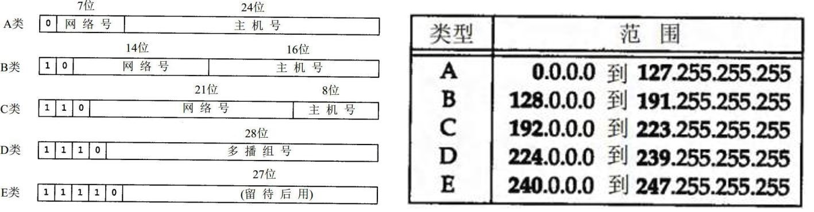

# 网络编程概述

Java是Internet上的语言，它从语言级上提供了对网络应用程序的支持，程序员能够很容易开发常见的网络应用程序。

Java提供的网络类库，可以实现无痛的网络连接，联网的底层细节被隐藏在Java的本机安装系统里，由JVM进行控制。并且Java实现了一个跨平台的网络库，`程序员面对的是一个同一个的网络编程环境`。

## 1、软件架构

* **C/S架构**：全称为Client/Server结构，是指客户端和服务器结构。常见程序有QQ、美团app、360安全卫士等软件。


* **B/S结构**：全称为Browser/Server结构，是指浏览器和服务器结构。常见浏览器有IE、谷歌、火狐等。


两种结构各有优势，但是无论哪种架构，都离不开网络的支持。**网络编程**，就是在一定的协议下，实现两台计算机的通信的程序。

## 2、网络基础

* **计算机网络**：

  把分布在不同地理区域的计算机与专门的外部设备用通信线路互连成一个规模大、功能强的网络系统，从而使众多的计算机可以方便地互相传递信息、共享硬件、软件、数据信息等资源。

* **网络编程的目的**：直接或间接地通过网络协议与其他计算机实现数据交换，进行通讯。

* **网络编程中有三个主要的问题**：

  * 问题1：如何准确地定位网络上一台或多台主机
  * 问题2：如何定位主机上的特定的应用
  * 问题3：找到主机后，如何可靠、高效地进行数据传输


# 网络通信要素

## 1、如何实现网络中的主机互相通信

* 通信双方地址
  * IP
  * 端口号
* 一定的规则：不同的硬件、操作系统之间的通信，所有的这一切都需要一种规则。而我们就把这种规则称为协议，即网络通信协议。

**生活类比**


## 2、通信要素一：IP地址和域名

### 2.1、IP地址

**IP地址：指互联网协议地址（Internet Protocol Address）**，俗称IP。IP地址用来给忘了中的一台计算机设备做唯一的编号。假如我们把“个人电脑”比作“一台电话”的话，那么“IP地址”就相当于“电话号码”。

IP地址分类方式一：

* **`IPv4`**：是一个32位的二进制数，通常被分为4个字节，表示成`a, b, c, d`的形式，以点分`十进制`表示，例如`192.168.65,100`。其中a、b、c、d都是0~255之间的十进制整数。

  * 

  * 这种方式最多可以表示42亿个。其中，30亿都在北美，亚洲4亿，中国2.9亿。2011年初已经用尽。

  * **`IP地址 = 网络地址 + 主机地址`**

    * 网络地址：标识计算机或网络设备所在的网段

    * 主机地址：标识特定主机或网络设备

      

      其中，E类用于科研。

* **`IPv6`**：由于互联网的蓬勃发展，IP地址的需求量越来越大，但是网络地址资源有限，使得IP的分配越来越紧张。

  为了扩大地址空间，拟通过IPv6重新定义地址空间，采用128位地址长度，共16个字节，写成8个无符号整数，每个整数用四个十六进制位表示，数之间用冒号（:）分开。比如：

  `ABCD:EF01:2345:6789:ABCD:EF01:2345:6789`，按保守方法估算IPv6实际可分配的地址，整个地球的每平方面积上仍可分配1000多个地址，这样就解决了网络地址资源数量不够的问题。

**IP地址分类方式之二：**

公网地址（万维网使用）和私有地址（局域网使用）。192.168.开头的就是私有地址，范围即为192.168.0.0 - 192.168.255.255，专门为组织机构内部使用。

**常用命令**：

* 查看本机IP地址，在控制台输入：

```java
ipconfig
```

* 检查网络是否连通，在控制台输入：

```
ping 空格 IP地址
ping 220.181.57.216
```

**特殊的IP地址**：

* 本地回环地址（hostAddress）：`127.0.0.1`
* 本机名（hostName)：`localhost`


### 2.2、域名

Internet上的主机有两种方式表示地址：

* 域名（hostName）：www.atguigu.com
* IP地址（hostAddress)：202.108.35.210

**域名解析**：因为IP地址数字不方便记忆，因此出现了域名。域名容易记忆，当在连接网络时输入一个主机的域名后，域名服务器（DNS，Domain Name System，域名系统）负责将域名转化为IP地址，这样才能和主机建立连接。

简单理解：


## 3、通信要素二：端口号

网络的通信，本质上是两个进程（应用程序）的通信。每台计算机都有很多的进程，那么在网络通信中，如何区分这些进程呢？

如果说**IP地址**可以唯一标识网络中的设备，那么**端口号**就可以唯一标识设备中的进程（应用程序）。

不同的进程，设置不同的端口号。

* **端口号：用两个字节表示的整数，它的取值范围是0~65535。**
  * 公认端口：0~1023。被预先定义的服务通信占用，如：HTTP(80)，FTP（21），TeInet（23）
  * 注册端口：1024~49151。分配给用户进程或应用程序。如Tomcat（8080)，MySQL（3306），Oracle（1521）。
  * 动态/私有端口：49152~65535。

如果端口号被另外一个服务或应用被占用，会导致当前程序启动失败。

也就是说，需要进行通信，就需要知道和对方的哪一个进程进行通信，端口号就是进程的标识符。


## 4、通信要素三：网络通信协议

通过计算机网络可以使多台计算机实现连接，位于同一个网络中的计算机在连接和通信时需要遵守一定的规则，这就好比在道路中行驶的汽车一定要遵守交通规则一样。

* `网络通信协议`：在计算机网络中，这些连接和通信的规则被称为网络通信协议，它对数据的传输格式、传输速率、传输步骤、出错控制等做了统一规定，通信双方必须同时遵守才能完成数据交换。

**新的问题：网络协议涉及内容太多、太复杂。如何解决？**

计算机网络通信涉及内容很多，比如指定源地址和目标地址，加密解密，压缩解压缩，差错控制，流量控制，路由控制，如何实现如此复杂的网络协议呢？`通信协议分层思想`。

在制定协议时，把复杂成分分解成一些简单的成分，再将它们复合起来。最常用的复合方式是层次方式，即**`同层间可以通信、上一层可以调用下一层，而与再下一层不发生关系`**。各层互不影响，利于系统的开发和扩展。

这里有两套参考模型

* OSI参考模型：模型过于理想化，未能在因特网上进行广泛推广
* **TCP/IP参考模型（或TCP/IP协议）**：事实上的国际标准


上图中，OSI参考模型过于理想化，未能广泛推广；TCP/IP协议是事实上的`国际标准`。

* **TCP/IP协议**：传输控制协议/因特网互连协议，TCP/IP以其中两个主要协议：传输控制协议（TCP）和网络互联协议（IP）而得名，实际上是一组协议，包括多个具有不同功能且互为关联的协议。是Internet最基本、最广泛的协议。


**TCP/IP协议中的四层介绍：**

* **`应用层`**：应用层决定了向用户提供应用服务时通信的活动。主要协议有：HTTP协议、FTP协议、SNMP（简单网络管理协议）、SMTP（简单邮件传输协议）和POP3（Post Office Protocol3，邮局协议的第三个版本）等。
* **`传输层`**：主要使网络程序进行通信，在进行网络通信时，可以采用TCP协议，也可以采用UDP协议。TCP（Transmission Control Protocol）协议，即传输控制协议，是一种面向连接的、可靠的、基于字节流的传输层通信协议。UDP（User Datagram Protocol，用户数据报协议）：是一种无连接的传输层协议、提供面向事务的简单不可靠的数据传送服务。
* **`网络层`**：网络层是整个TCP/IP协议的核心，支持网间互连的数据通信。它主要用于将传输的数据进行分组，将分组数据发送到目标计算机或者网络。而IP协议是一种非常重要的协议。IP（internet protocal）又称为互联网协议。IP的责任就是把数据从源传送到目的地。它在源地址和目的地址之间传送一种称之为数据包的东西，它还提供对数据大小的重新组装功能，以适应不同网络对包大小的要求。

* **`物理+数据链路层`**：链路层是用于定义物理传输通道，通常是对某些网络连接设备的驱动协议，例如针对光纤、网线提供的驱动。


## 5、 谈传输层协议：TCP与UDP协议

通信的协议还是比较复杂的，`java.net` 包中包含的类和接口，它们提供低层次的通信细节。我们可以直接使用这些类和接口，来专注于网络程序开发，而不用考虑通信的细节。

`java.net` 包中提供了两种常见的网络协议的支持：

- **UDP**：用户数据报协议(User Datagram Protocol)。
- **TCP**：传输控制协议 (Transmission Control Protocol)。

### 5.1 TCP协议与UDP协议

**TCP协议：**

- TCP协议进行通信的两个应用进程：客户端、服务端。
- 使用TCP协议前，须先`建立TCP连接`，形成基于字节流的传输数据通道
- 传输前，采用“三次握手”方式，点对点通信，是`可靠的`
  - TCP协议使用`重发机制`，当一个通信实体发送一个消息给另一个通信实体后，需要收到另一个通信实体确认信息，如果没有收到另一个通信实体确认信息，则会再次重复刚才发送的消息。
- 在连接中可进行`大数据量的传输`
- 传输完毕，需`释放已建立的连接，效率低`

**UDP协议：**

- UDP协议进行通信的两个应用进程：发送端、接收端。
- 将数据、源、目的封装成数据包（传输的基本单位），`不需要建立连接`
- 发送不管对方是否准备好，接收方收到也不确认，不能保证数据的完整性，故是`不可靠的`
- 每个数据报的大小限制在`64K`内
- 发送数据结束时`无需释放资源，开销小，通信效率高`
- 适用场景：音频、视频和普通数据的传输。例如视频会议

> TCP生活案例：打电话
>
> UDP生活案例：发送短信、发电报

### 5.2 三次握手

TCP协议中，在发送数据的准备阶段，客户端与服务器之间的三次交互，以保证连接的可靠。

- 第一次握手，客户端向服务器端发起TCP连接的请求
- 第二次握手，服务器端发送针对客户端TCP连接请求的确认
- 第三次握手，客户端发送确认的确认


> 1、客户端会随机一个初始序列号seq=x，设置SYN=1 ，表示这是SYN握手报文。然后就可以把这个 SYN 报文发送给服务端了，表示向服务端发起连接，之后客户端处于`同步已发送`状态。
>
> 2、服务端收到客户端的 SYN 报文后，也随机一个初始序列号(seq=y)，设置ack=x+1，表示收到了客户端的x之前的数据，希望客户端下次发送的数据从x+1开始。
> 设置 SYN=1 和 ACK=1。表示这是一个SYN握手和ACK确认应答报文。最后把该报文发给客户端，该报文也不包含应用层数据，之后服务端处于`同步已接收`状态。
>
> 3、客户端收到服务端报文后，还要向服务端回应最后一个应答报文，将ACK置为 1 ，表示这是一个应答报文
> ack=y+1 ，表示收到了服务器的y之前的数据，希望服务器下次发送的数据从y+1开始。
> 最后把报文发送给服务端，这次报文可以携带数据，之后客户端处于 连接已建立 状态。服务器收到客户端的应答报文后，也进入`连接已建立`状态。

完成三次握手，连接建立后，客户端和服务器就可以开始进行数据传输了。由于这种面向连接的特性，TCP协议可以保证传输数据的安全，所以应用十分广泛，例如下载文件、浏览网页等。

### 5.3 四次挥手

TCP协议中，在发送数据结束后，释放连接时需要经过四次挥手。

* 第一次挥手：客户端向服务器端提出结束连接，`让服务器做最后的准备工作`。此时，客户端处于半关闭状态，即表示不再向服务器发送数据了，但是还可以接受数据。
* 第二次挥手：服务器接收到客户端释放连接的请求后，`会将最后的数据发给客户端`。并告知上层的应用进程不再接收数据。
* 第三次挥手：服务器发送完数据后，会给客户端`发送一个释放连接的报文`。那么客户端接收后就知道可以正式释放连接了。
* 第四次挥手：客户端接收到服务器最后的释放连接报文后，要`回复一个彻底断开的报文`。这样服务器收到后才会彻底释放连接。这里客户端，发送完最后的报文后，会等待2MSL，因为有可能服务器没有收到最后的报文，那么服务器迟迟没收到，就会再次给客户端发送释放连接的报文，此时客户端在等待时间范围内接收到，会重新发送最后的报文，并重新计时。如果等待2MSL后，没有收到，那么彻底断开。


> 1、客户端打算断开连接，向服务器发送FIN报文(FIN标记位被设置为1，1表示为FIN，0表示不是)，FIN报文中会指定一个序列号，之后客户端进入FIN_WAIT_1状态。也就是客户端发出连接释放报文段(FIN报文)，指定序列号seq = u，主动关闭TCP连接，等待服务器的确认。
>
> 2、服务器收到连接释放报文段(FIN报文)后，就向客户端发送ACK应答报文，以客户端的FIN报文的序列号 seq+1 作为ACK应答报文段的确认序列号ack = seq+1 = u + 1。接着服务器进入CLOSE_WAIT(等待关闭)状态，此时的TCP处于半关闭状态(下面会说什么是半关闭状态)，客户端到服务器的连接释放。客户端收到来自服务器的ACK应答报文段后，进入FIN_WAIT_2状态。
>
> 3、服务器也打算断开连接，向客户端发送连接释放(FIN)报文段，之后服务器进入LASK_ACK(最后确认)状态，等待客户端的确认。服务器的连接释放(FIN)报文段的FIN=1，ACK=1，序列号seq=m，确认序列号ack=u+1。
>
> 4、客户端收到来自服务器的连接释放(FIN)报文段后，会向服务器发送一个ACK应答报文段，以连接释放(FIN)报文段的确认序号 ack 作为ACK应答报文段的序列号 seq，以连接释放(FIN)报文段的序列号 seq+1作为确认序号ack。
>
> 之后客户端进入TIME_WAIT(时间等待)状态，服务器收到ACK应答报文段后，服务器就进入CLOSE(关闭)状态，到此服务器的连接已经完成关闭。客户端处于TIME_WAIT状态时，此时的TCP还未释放掉，需要等待2MSL后，客户端才进入CLOSE状态。


# 网络编程API

## 1、InetAddress类

**作用：**`InetAddress类的一个实例，就代表一个具体的`**`ip地址。`**

它有两个子类：`Inet4Address`、`Inet6Address`。

**创建对象方式**：

InetAddress类没有提供公共的构造器，而是提供了如下几个静态方法来获取InetAddress实例：

* **`public static InetAddress getLocalHost()`**：获取本机的ip地址对应的InetAddress对象。
* **`public static InetAddress getByName(String host)`**：根据String类型的ip地址或对应的域名来获取InetAddress对象。

案例：

```java
@Test
public void test() throws UnknownHostException {
    InetAddress localHost = InetAddress.getLocalHost();
    System.out.println(localHost);
    //根据指定的ip地址或者域名获取对应的InetAddress对象
    InetAddress inet = InetAddress.getByName("www.baidu.com");
    System.out.println(inet);
}
```

打印结果：


**常用方法**：

* **`public String getHostAddress()`**：返回InetAddress对象所表示的IP地址字符串
* **`public String getHostName()`**：获取此IP地址的主机名，有域名则返回域名，没有则返回ip地址
* **`public boolean isReachable(int timeout)`**：测试是否可以达到该地址，timeout设置的是超时时长

案例：

```java
@Test
public void test2() throws IOException {
    InetAddress baiDu = InetAddress.getByName("www.baidu.com");
    InetAddress localHost = InetAddress.getLocalHost();

    System.out.println(baiDu.getHostAddress());
    System.out.println(baiDu.getHostName());
    System.out.println(baiDu.isReachable(300));

    System.out.println("********************************");

    System.out.println(localHost.getHostAddress());
    System.out.println(localHost.getHostName());
    System.out.println(localHost.isReachable(300));
}
```

打印结果：


## 2、Socket类

* 网络上具有唯一标识的IP地址和端口号组合在一起构成唯一能识别的标识符套接字（Socket）。
* 利用套接字（Socket）开发网络应用程序早已被广泛的采用，以至于成为事实上的标准。网络通信其实就是Socket间的通信。
* 通信的两端都要有Socket，是两台机器间通信的端点。
* Socket允许程序把网络当成一个流，数据在两个Socket间就通过IO传输。
* 一般主动发起通信的应用程序属客户端，等待通信请求的为服务端。
* Socket分类：
  * **流套接字（stream socket）**：使用`TCP`提供可依赖的字节流服务
    * **`ServerSocket`**：此类实现TCP**服务器套**接字。服务器套接字等待请求通过网络传入。
    * **`Socket`**：此类实现TCP**客户端**套接字（也可以直接叫做套接字）。套接字是两台机器间通信的端点。
  * **数据报套接字（datagram socket）**：使用UDP提供“尽力而为”的数据报服务
    * **`DatagramSocket`**：此类表示用来发送和接收UDP数据报包的套接字

即：

> Socket就是用来网络通信编程的类。


# TCP网络编程

## 通信模型

Java语言的基于套接字TCP编程分为服务端编程和客户端编程，其通信模型如图所示：


## 相关API

### 1. ServerSocket类

**构造器：**

* **`ServerSocket(int port)`**：创建绑定到特定端口号的服务器套接字。

**常用方法：**

* **`Socket accept()`**：侦听并接收到此套接字的连接。该方法是**阻塞方法**，会一直阻塞当前线程直到接收到该端口号的连接请求。返回的是`Socket`类对象，获取到的`Socket`对象可以用来进行通信。

### 2、Socket类

**构造器：**

* **`public Socket(InetAddress address, int port)`**：创建一个流套接字并将其连接到指定IP地址的指定端口号。
* **`public Socket(String host, int port)`**：创建一个流套接字并将其连接到指定主机上的指定端口号。

**常用方法：**

* **`public InputStream getInputStream()`**：返回此套接字的输入流，可以用于接收消息。
* **`public OutputStream getOutputStream()`**：返回此套接字的输出流，可以用于发送消息。
* `public InetAddress getInetAddress()`：此套接字连接到的远程IP地址，如果套接字未连接，则返回null。
* `public InetAddress getLocalAddress()`：获取套接字绑定的本地地址。
* `public int getPort()`：返回此套接字连接到的远程端口号，如果尚未连接套接字，则返回0。
* `public int getLocalPort()`：返回此套接字绑定到的本地端口。如果尚未绑定套接字，则返回-1。
* **`public void close()`**：关闭此套接字。套接字被关闭后，便不可在以后的网络连接中使用（即无法重新连接或重新绑定）。需要创建新的套接字对象。关闭此套接字也将会关闭该套接字的InputStream和OutputStream流。
* `public void shutdownInput()`：如果在套接字上调用shutdownInput()后从套接字输入流读取内容，则流将返回EOF（文件结束符）。即不能再从此套接字的输入流中接收任何数据。
* `public void shutdownOutput()`：禁用此套接字的输出流。对于TCP套接字，任何以前写入的数据都将被发送，并且后跟TCP的正常连接终止序列。如果在套接字上调用shutdownOutput()后写入套接字输出流，则该流将抛出IOException。即不能通过此套接字的输出流发送任何数据。


**注意**：先后调用Socket的shutdownInput()和shutdownOutput()方法，仅仅关闭了输入流和输出流，并不等于调用Socket的close()方法。在通信结束后，仍然要调用Socket的close()方法，因为只有该方法才会释放Socket占用的资源，比如占用的本地端口号等。

## 开发步骤

**客户端程序包含以下四个基本的步骤：**

* `创建Socket`：根据指定服务器的IP地址或端口号构造Socket类对象。若服务器端响应，则建立客户端到服务器的通信线路。若链接失败，会出现异常。
* `打开链接到Socket的输入/输出流`：使用getInputStream()方法获得输入流，使用getOutputStream()方法获得输出流，进行数据传输。
* `按照一定的协议对Socket进行读/写操作`：通过输入流读取服务器放入线路的信息（但不能读取自己放入线路的信息），通过输出流将信息写入线路。
* `关闭Socket`：断开客户端到服务器的连接，释放线路。

**服务器端程序包含以下四个基本的步骤：**

* `调用ServerSocket(int port)`：创建一个服务器端套接字，并绑定到指定端口上。用于监听客户端的请求。
* `调用accept()`：监听连接请求，如果客户端请求连接，则接受连接，返回通信套接字对象。
* `调用该Socket类对象的getOutputStream()和getInputStream()`：获取输出流和输入流，开始网络数据的发送和接收。
* `关闭Socket对象`：客户端访问结束，关闭通信套接字。

## 使用案例

#### **案例**

**客户端发送内容给服务端，服务端将内容打印到控制台上**

**实现代码：**

客户端

```java
//客户端
@Test
public void send() {
    Socket socket = null;
    OutputStream os = null;
    try {
        //创建一个Socket，需要传入服务器端的ip地址和端口号，这里的ip地址使用了本地的ip地址
        InetAddress inetAddress = InetAddress.getByName("192.168.1.8");
        int port = 8989;
        socket = new Socket(inetAddress, port);
        
        //发送数据
        //获取输出流，该输出流就是用来向服务器端输出数据的
        os = socket.getOutputStream();
        os.write("你好，我是客户端".getBytes());
    } catch (IOException e) {
        throw new RuntimeException(e);
    }finally {
        //关闭Socket、关闭流，Socket关闭会自动关闭流
        try {
            if (socket != null) {
                socket.close();
            }
        } catch (IOException e) {
            throw new RuntimeException(e);
        }
    }

}
```

服务器端

```java
//服务器端
@Test
public void server(){
    ServerSocket serverSocket = null;
    Socket socket = null;
    InputStream is = null;
    ByteArrayOutputStream baos = new ByteArrayOutputStream();
    try {
        //创建一个ServerSocket，需要传入端口号，不需要传入ip地址，因为服务器端是等待客户端向其发送请求
        int port = 8989;
        serverSocket = new ServerSocket(port);

        //调用accept()，接收客户端的Socket
        //accept()方法是阻塞式方法，会一直阻塞直到客户端发起与服务器端相同端口号的连接
        socket = serverSocket.accept();
        
        System.out.println("服务端已开启！");
        
        //接收数据，获取输入流，该输入流就是接收客户端输出数据的
        is = socket.getInputStream();
        int len;
        byte[] deBuff = new byte[1024];
        StringBuilder str = new StringBuilder();
        while ((len = is.read(deBuff)) != -1){
            str.append(new String(deBuff, 0, len));
        }
        System.out.println(str.toString());
        
        System.out.println("数据接收完毕！");
    } catch (IOException e) {
        throw new RuntimeException(e);
    } finally {
        try {
            //关闭两个Socket，Socket关闭流自动关闭
            if (socket != null) {
                socket.close();
            }
            if (serverSocket != null) {
                serverSocket.close();
            }
        } catch (IOException e) {
            throw new RuntimeException(e);
        }
    }

}
```

打印结果：


**注意**：必须先打开服务器端，执行到accept()方法，等待客户端发送接收请求，然后才能打开客户端发送连接请求。


### **可能存在的问题**

#### 问题1

**问题代码：**

将服务器端中接收数据的byte[]数组长度修改成5：

```java
//服务器端
@Test
public void server(){
    ServerSocket serverSocket = null;
    Socket socket = null;
    InputStream is = null;
    try {
        //创建一个ServerSocket，需要传入端口号
        int port = 8989;
        serverSocket = new ServerSocket(port);

        //调用accept()，接收客户端的Socket
        //accept()方法是阻塞式方法，会一直阻塞直到客户端发起与服务器端相同端口号的连接
        socket = serverSocket.accept();
        System.out.println("服务端已开启！");
        //接收数据
        is = socket.getInputStream();
        int len;
        
        //将接收数据的byte数组设置成5长度
        byte[] deBuff = new byte[5];
        StringBuilder str = new StringBuilder();
        while ((len = is.read(deBuff)) != -1){
            str.append(new String(deBuff, 0, len));
        }
        System.out.println(str.toString());
        System.out.println("数据接收完毕！");
    } catch (IOException e) {
        throw new RuntimeException(e);
    } finally {
        try {
            //关闭两个Socket，Socket关闭流自动关闭
            if (socket != null) {
                socket.close();
            }
            if (serverSocket != null) {
                serverSocket.close();
            }
        } catch (IOException e) {
            throw new RuntimeException(e);
        }
    }

}
```

**打印结果：**


我们可以发现，原本文字是“你好，我是客户端”出现了乱码的现象。


**问题原因：**

当我们传输字节型数据的时候，传输的中文字符使用utf-8字符集传输时是占用3个字节的，接收端使用5个字节一组的方式进行接收，就有可能会将3个字节的数据拆分开来显示，所以我们显示的时候会出现乱码。

所以，我们之前在学习IO的时候，也学习到过，字节流不要去传输字符型文件，因为字符型数据打印出来时可能会显示乱码，但是，对于复制文件来说，字符型文件就可以使用字节流进行复制。


##### 优化

**引入一个流：**

**`ByteArrayOutputStream`**

这个流是**字节数组输出流**，它内部维护了一个**`byte数组`**，而不需要打印到指定文件中，而是将数据写入内存中，这样一来，就会将字节输入流的所有字节数据，全部写入到byte数组中，就不会出现因为字符转换为字节后，字节被拆分而造成的乱码现象。

**流构造器：**

* **`ByteArrayOutputStream()`**：该流不需要指定打印文件地址，因为write()使用的是内部的byte[]数组接收

**使用方式案例代码：**

将服务器端接收数据的方式进行修改：

```java
//服务器端
@Test
public void server(){
    ServerSocket serverSocket = null;
    Socket socket = null;
    InputStream is = null;
    
    //创建ByteArrayOutputStream对象，用于获取接收到的字符型数据
    ByteArrayOutputStream baos = new ByteArrayOutputStream();
    
    try {
        //创建一个ServerSocket，需要传入端口号
        int port = 8989;
        serverSocket = new ServerSocket(port);

        //调用accept()，接收客户端的Socket
        //accept()方法是阻塞式方法，会一直阻塞直到客户端发起与服务器端相同端口号的连接
        socket = serverSocket.accept();
        System.out.println("服务端已开启！");
        
        //接收数据
        is = socket.getInputStream();
        int len;
        byte[] deBuff = new byte[5];
        
        while ((len = is.read(deBuff)) != -1){
            //将接收到的字节型数组写入到内部的byte[]数组中
            baos.write(deBuff, 0, len);
        }
        
        System.out.println(baos.toString());
        System.out.println("数据接收完毕！");
    } catch (IOException e) {
        throw new RuntimeException(e);
    } finally {
        try {
            //关闭Socket与流
            if (socket != null) {
                socket.close();
            }
            if (serverSocket != null) {
                serverSocket.close();
            }
            baos.close();
        } catch (IOException e) {
            throw new RuntimeException(e);
        }
    }

}
```

**打印结果：**


此时，就不会因为字符被拆分成三个字节，字节因不在同一组byte数组中而造成的乱码现象。


#### 问题2

让我们来看看一个案例：从客户端发送文件给服务端，服务端保存到本地。并返回“发送成功”给客户端，并关闭相应的连接。

**客户端代码**：

```java
/**
 * 客户端
 */
@Test
public void test(){
    Socket socket = null;
    FileInputStream fis = null;
    ByteArrayOutputStream baos = new ByteArrayOutputStream();
    try {
        //创建Socket套接字，指定服务器端ip地址和端口号
        socket = new Socket("127.0.0.1",8989);
        
        //使用套接字获取输出流，输出给服务器端
        OutputStream os = socket.getOutputStream();
        
        //由于需要获取文件的数据，所以创建文件输入流获取文件字节信息
        fis = new FileInputStream(new File("test.txt"));
        
        //输出信息
        int len;
        byte[] buffer = new byte[1024];
        while ((len = fis.read(buffer)) != -1){
            //将文件字节信息输出给服务器端
            os.write(buffer, 0, len);
        }
        System.out.println("数据发送完毕");
        
        //接收来自于服务器端的数据
        InputStream is = socket.getInputStream();
        while((len = is.read(buffer)) != -1){
            baos.write(buffer, 0, len);
        }
        System.out.println(baos.toString());
        System.out.println("已成功接收来自于服务器端的数据");
    } catch (IOException e) {
        throw new RuntimeException(e);
    } finally {
        try {
            if (socket != null) {
                socket.close();
            }
            if (fis != null) {
                fis.close();
            }
            baos.close();
        } catch (IOException e) {
            throw new RuntimeException(e);
        }
    }
}
```

**服务端代码：**

```java
/**
 * 服务端
 */
@Test
public void test2(){

    ServerSocket serverSocket = null;
    Socket socket = null;
    FileOutputStream fos = null;
    try {
        //创建服务器端套接字，指定端口号
        serverSocket = new ServerSocket(8989);
        
        //调用accept()方法，监听客户端的连接请求
        socket = serverSocket.accept();
        
        //获取InputStream对象，获取客户端发送的数据
        InputStream is = socket.getInputStream();
        
        //创建FileOutputStream流，将获取到的数据保存到文件中
        fos = new FileOutputStream(new File("从客户端获取到的文件.txt"));
        int len;
        byte[] buffer = new byte[1024];
        while ((len = is.read(buffer)) != -1){
            fos.write(buffer, 0, len);
        }
        System.out.println("已成功接收来自于客户端的数据");
        
        //保存到本地后，服务器端返回“发送成功”给客户端
        OutputStream os = socket.getOutputStream();
        os.write("服务端成功发送数据给客户端".getBytes());

        System.out.println("客户端已成功发送数据");
    } catch (IOException e) {
        throw new RuntimeException(e);
    } finally {
        try {
            //关闭流和套接字
            if (socket != null) {
                socket.close();
            }
            if (serverSocket != null) {
                serverSocket.close();
            }
            if (fos != null) {
                fos.close();
            }
        } catch (IOException e) {
            throw new RuntimeException(e);
        }
    }
}
```

而后，先后启动服务端和客户端，**服务端的打印结果：**


**客户端的打印结果：**


我们可以发现，客户端已经发送完毕了文件，但是服务端并没有结束`while`循环，而是再等待接收来自于客户端的数据。


**问题原因：**

因为服务端不知道客户端是否已经停止发送数据，这里的`while((len = is.read(buffer)) != -1)`其实无法判断出客户端是否已经停止发送数据。

之前案例中跳出了循环，是因为客户端`close()`关闭了，关闭自然停止发送数据，服务端也就跳出了循环。但是在这个案例中无法跳出循环，因为客户端没有`close()`关闭，而是在等待服务器端发送数据。这里出现了类似于死锁的情况。服务端卡在了while循环中，而客户端在等待服务端发送数据。

##### 优化

客户端调用**`shutdownOutput()`**方法，来告诉服务端自己已经停止输出数据，从而让服务端跳出while循环。

**客户端代码实现：**

```java
/**
 * 客户端
 */
@Test
public void test(){
    Socket socket = null;
    FileInputStream fis = null;
    ByteArrayOutputStream baos = new ByteArrayOutputStream();
    try {
        //创建Socket套接字，指定服务器端ip地址和端口号
        socket = new Socket("127.0.0.1",8989);
        //使用套接字获取输出流，输出给服务器端
        OutputStream os = socket.getOutputStream();
        //由于需要获取文件的数据，所以创建文件输入流获取文件字节信息
        fis = new FileInputStream(new File("test.txt"));
        int len;
        byte[] buffer = new byte[1024];
        while ((len = fis.read(buffer)) != -1){
            //将文件字节信息输出给服务器端
            os.write(buffer, 0, len);
        }
        System.out.println("数据发送完毕");
        
        //表明客户端不再继续发送数据
        socket.shutdownOutput();
        
        //接收来自于服务器端的数据
        InputStream is = socket.getInputStream();
        while((len = is.read(buffer)) != -1){
            baos.write(buffer, 0, len);
        }
        System.out.println(baos.toString());
        System.out.println("已成功接收来自于服务器端的数据");
    } catch (IOException e) {
        throw new RuntimeException(e);
    } finally {
        try {
            if (socket != null) {
                socket.close();
            }
            if (fis != null) {
                fis.close();
            }
            baos.close();
        } catch (IOException e) {
            throw new RuntimeException(e);
        }
    }
}
```

**服务端打印结果：**


**客户端打印结果：**


## TCP网络编程经典案例：聊天室的实现

聊天室中，实际上是多个客户端之间进行聊天，服务端的作用就是将客户端的的信息接收到，并将信息分发给聊天室里的所有人。类似于群聊。

例如：聊天室里面有A，B，C三个用户，A在聊天室中说了一句话，那么服务端就需要将这一句话分发给A，B，C这三个角色。

大致图：


服务端

```java
public class TestChatServer {
	//这个集合用来存储所有在线的客户端
	static ArrayList<Socket> online = new  ArrayList<Socket>();
	
	public static void main(String[] args)throws Exception {
		//1、启动服务器，绑定端口号
		ServerSocket server = new ServerSocket(8989);
		
		//2、接收n多的客户端同时连接
		while(true){
			Socket accept = server.accept();
			
			online.add(accept);//把新连接的客户端添加到online列表中
			
			MessageHandler mh = new MessageHandler(accept);
			mh.start();//
		}
	}
	
	static class MessageHandler extends Thread{
		private Socket socket;
		private String ip;
		
		public MessageHandler(Socket socket) {
			super();
			this.socket = socket;
		}

		public void run(){
			try {
				ip = socket.getInetAddress().getHostAddress();
				
				//插入：给其他客户端转发“我上线了”
				sendToOther(ip+"上线了");
				
				//(1)接收该客户端的发送的消息
				InputStream input = socket.getInputStream();
				InputStreamReader reader = new InputStreamReader(input);
				BufferedReader br = new BufferedReader(reader);
				
				String str;
				while((str = br.readLine())!=null){
					//(2)给其他在线客户端转发
					sendToOther(ip+":"+str);
				}
				
				sendToOther(ip+"下线了");
			} catch (IOException e) {
				try {
					sendToOther(ip+"掉线了");
				} catch (IOException e1) {
					e1.printStackTrace();
				}
			}finally{
				//从在线人员中移除我
				online.remove(socket);
			}
		}
		
		//封装一个方法：给其他客户端转发xxx消息
		public void sendToOther(String message) throws IOException{
			//遍历所有的在线客户端，一一转发
			for (Socket on : online) {
				OutputStream every = on.getOutputStream();
				//为什么用PrintStream？目的用它的println方法，按行打印
				PrintStream ps = new PrintStream(every);
				
				ps.println(message);
			}
		}
	}
}
```

客户端

```java
public class TestChatClient {
	public static void main(String[] args)throws Exception {
		//1、连接服务器
		Socket socket = new Socket("127.0.0.1",8989);
		
		//2、开启两个线程
		//(1)一个线程负责看别人聊，即接收服务器转发的消息
		Receive receive = new Receive(socket);
		receive.start();
		
		//(2)一个线程负责发送自己的话
		Send send = new Send(socket);
		send.start();
		
		send.join();//等我发送线程结束了，才结束整个程序
		
		socket.close();
	}
}
class Send extends Thread{
	private Socket socket;
	
	public Send(Socket socket) {
		super();
		this.socket = socket;
	}

	public void run(){
		try {
			OutputStream outputStream = socket.getOutputStream();
			//按行打印
			PrintStream ps = new PrintStream(outputStream);
			
			Scanner input = new Scanner(System.in);
			
			//从键盘不断的输入自己的话，给服务器发送，由服务器给其他人转发
			while(true){
				System.out.print("自己的话：");
				String str = input.nextLine();
				if("bye".equals(str)){
					break;
				}
				ps.println(str);
			}
			
			input.close();
		} catch (IOException e) {
			e.printStackTrace();
		}
	}
	
}
class Receive extends Thread{
	private Socket socket;
	
	public Receive(Socket socket) {
		super();
		this.socket = socket;
	}
	
	public void run(){
		try {
			InputStream inputStream = socket.getInputStream();
			Scanner input = new Scanner(inputStream);
			
			while(input.hasNextLine()){
				String line = input.nextLine();
				System.out.println(line);
			}
		} catch (IOException e) {
			e.printStackTrace();
		}
	}
}
```


# UDP网络编程

UDP(User Datagram Protocol，用户数据报协议)：是一个无连接的传输层协议、提供面向事务的简单不可靠的信息传送服务，类似于短信。

## 1、通信模型

UDP协议是一种**`面向非连接`**的协议，面向非连接指的是在正式通信前不必与对方先建立连接，不管对方状态就直接发送，至于对方是否可以接收到这些数据内容，UDP协议无法控制，因此说，UDP协议是一种**不可靠的**协议。

无连接的好处就是快，省内存空间和流量，因为维护连接需要创建大量的数据结构。UDP会尽最大努力交付数据，但不保证可靠交付，没有TCP的确认机制、重传机制，如果因为网络原因没有传送到对端，UDP也不会给应用层返回错误信息。

UDP协议是面向数据报文的信息传送服务。UDP在发送端没有缓冲区，对于应用层交付下来的报文在添加了首部之后就直接交付给ip层，不会进行合并，也不会进行拆分，而是**一次交付一个完整的报文**。比如我们要发送100个字节的报文，我们调用一次`send()`方法就会发送100字节，接收方也需要用`receive()`方法一次性接收100字节，不能使用循环每次获取10个字节，获取10次这样的做法。

UDP协议没有拥塞控制，所以当网络出现的拥塞不会导致主机发送数据的效率降低。虽然UDP的接收端有缓冲区，但是这个缓冲区只负责接收，并不会保证UDP报文的到达顺序是否和发送的顺序一致。因为网络传输的时候，由于网络拥塞的存在是很大的可能导致先发的报文比后发的报文晚到达。如果此时缓冲区满了，后面到达的报文将直接被丢弃。这个对实时应用来说很重要，比如：视频通话、直播等应用。

因此UDP适用于**一次只传送少量数据、对可靠性要求不高的应用环境**，**数据报大小限制在`64k`以下。**


类`DatagramSocket`和`DatagramPacket`实现了基于UDP协议网络程序。

UDP数据报通过数据报套接字DatagramSocket发送和接收，系统不保证UDP数据报一定能够安全送到目的地，也不能确定什么时候可以抵达。

DatagramPacket对象封装了UDP数据报，在数据报中包含了发送端的IP地址和端口号以及接收端的IP地址和端口号。

UDP协议中每个数据报都给出了完整的地址信息，因此无须建立发送方和接收方的连接。如同发快递包裹一样。

## 2、相关API

### DatagramSocket类

**常用方法**：

* **`public DatagramSocket()`**：创建数据报套接字，该构造器一般用于**发送端**，无法设置端口号。

* **`public DatagramSocket(int port)`**：创建数据报套接字，将其绑定到本机上的指定端口。该构造器一般用于**接收端**。
* **`public void close()`**：关闭此数据报套接字。
* **`public void sent(DatagramPacket p)`**：从此套接字发送数据报包。DatagramPacket中要包含的信息：将要发送的数据、长度、远程主机的IP地址和远程主机的端口号。
* **`public void receive(DatagramPacket p)`**：套接字接收数据报包。当此方法返回时，DatagramPacket的缓冲区填充了接收的数据。数据报包也包含发送方的IP地址和发送方机器上的端口号。此方法在接收到数据报前一直**阻塞**。数据报包对象的`length`字段包含所接收信息的长度。如果信息比包的长度长，该信息将被截短。
* `public InetAddress getLocalAddress()`：获取套接字绑定的本地地址。
* `public int getLocalPort()`：返回此套接字绑定的本地主机上的端口号。
* `public InetAddress getInetAddress()`：返回此套接字连接的地址。如果套接字未连接，则返回null。
* `public int getPort()`：返回此套接字的端口。如果套接字未连接，则返回-1。

### DatagramPacket类

**常用方法**：

* **`public DatagramPacket(byte[] buf[,int offset], int length)`**：构造DatagramPacket对象。该方法用来创建**接收端**的DatagramPacket对象，接收长度为`length`的数据包，将接收到的数据存放到`byte[]`数组中。其中的offset，表示从索引offset开始接收，也可以省略。
* **`public DatagramPacket(byte[] buf[, int offset], int length, InetAddress address, int port)`**：该方法用来创建**发送端**的DatagramPacket对象。将需要发送的数据放在buf数组中，需要指明接收端的IP地址和端口号。
* `public InetAddress getAddress()`：返回某台机器的IP地址，此数据报将要发往该机器或者从该机器接收到的数据。

* public int getPort()：返回某台远程主机的端口号，此数据报将要发往该主机或者是从该主机接收到的。
* **`public byte[] getData()`**：返回数据缓冲区。返回的是接收到的或将要发送的数据从缓冲区的偏移量offset处开始，持续length长度，这里返回的不一定是数据的实际长度，而是在创建DatagramPacket时设置的byte数组长度，有可能大于实际的数据长度。
* **`public int getLength()`**：返回将要发送或接收到的数据的实际长度。


## 3、开发步骤

**发送端程序包含以下四个基本的步骤**：

1. `创建DatagramSocket`：默认使用系统随机分配的端口号。
2. `创建DatagramPacket`：将要发送的数据用字节数组表示，并指示要发送的数据长度，接收方的IP地址和端口号。
3. `调用该DatagramSocket类的send()方法`：发送数据报DatagramPacket对象。
4. `关闭DatagramSocket对象`：发送端程序结束，关闭通信套接字。

**接收端程序包含以下四个基本的步骤**：

1. `创建DatagramSocket`：指定监听的端口号。
2. `创建DatagramPacket`：指定接收数据用的字节数组，起到临时数据缓冲区的效果，并指定最大可以接收的数据长度。
3. `调用该DatagramSocket类对象的receive()方法`：接收数据报DatagramPacket对象。
4. `调用该DatagramPacket对象的getData()和getLength()方法`：获取接收到的数据和数据的实际长度。
5. `关闭DatagramSocket`：接收端程序结束，关闭通信套接字。


## 演示发送和接收消息

基于UDP协议的网络编程仍需要在通信实例的两端各建立一个Socket，但这两个Socket之间并没有虚拟链路，这两个Socket只是发送、接收数据报的对象，Java提供了DatagramSocket对象作为基于UDP协议的Socket，使用DatagramPacket代表DatagramSocket发送、接收的数据报。

**发送端**：

```java
/**
 * 发送端
 */
@Test
public void sender() throws Exception {
    //1、创建DatagramSocket实例
    DatagramSocket socket = new DatagramSocket();

    //2、创建DatagramPacket实例
    //若是发送数据，则需要将目的地的ip地址和端口号封装到DatagramPacket实例中，以及要发送的数据
    InetAddress inetAddress = InetAddress.getByName("127.0.0.1");
    int port = 9090;
    byte[] bytes = "我是发送端".getBytes("utf-8");
    DatagramPacket packet = new DatagramPacket(bytes, 0, bytes.length, inetAddress, port);

    //3、发送数据
    socket.send(packet);
    socket.close();
}
```

**接收端**：

```java
/**
 * 接收端
 */
@Test
public void receiver() throws Exception{
    //1、创建DatagramSocket实例
    //对于接收端来说，需要指定端口号
    int port = 9090;
    DatagramSocket socket = new DatagramSocket(port);

    //2、创建DatagramPacket实例
    //由于是接收数据，所以只需要获取接受的数据即可，不需要ip地址和端口号
    //由于数据报大小最多是64kb，所以这里创建的byte[]数组就使用64kb的大小
    byte[] buffer = new byte[1024 * 64];
    DatagramPacket packet = new DatagramPacket(buffer, 0, buffer.length);

    //3、接收数据
    socket.receive(packet);

    //4、获取接收到的数据信息，并打印
    //packet.getData()可以获取接收到的信息数据，packet.getLength()可以获取信息实际的长度
    System.out.println(new String(packet.getData(), 0, packet.getLength()));
    socket.close();
}
```


# URL编程

### 1、 URL类

- URL(Uniform Resource Locator)：统一资源定位符，它表示 Internet 上某一资源的地址。

- 通过 URL 我们可以访问 Internet 上的各种网络资源，比如最常见的 www，ftp 站点。浏览器通过解析给定的 URL 可以在网络上查找相应的文件或其他资源。 

- URL的基本结构由5部分组成：

```http
<传输协议>://<主机名>:<端口号>/<文件名>#片段名?参数列表
```

- 例如: http://192.168.1.100:8080/helloworld/index.jsp#a?username=shkstart&password=123

  - 片段名：即锚点，例如看小说，直接定位到章节
  - 参数列表格式：参数名=参数值&参数名=参数值....

- 为了表示URL，java.net 中实现了类 URL。我们可以通过下面的构造器来初始化一个 URL 对象：

  - public URL (String spec)：通过一个表示URL地址的字符串可以构造一个URL对象。例如：

    ```http
    URL url = new URL("http://www. atguigu.com/"); 
    ```

  - public URL(URL context, String spec)：通过基 URL 和相对 URL 构造一个 URL 对象。例如：

    ```http
    URL downloadUrl = new URL(url, “download.html")
    ```

    public URL(String protocol, String host, String file); 例如：

    ```http
    URL url = new URL("http", "www.atguigu.com", “download. html");
    ```

  - public URL(String protocol, String host, int port, String file); 例如: 

    ```java
    URL gamelan = new URL("http", "www.atguigu.com", 80, “download.html");
    ```

- URL类的构造器都声明抛出非运行时异常，必须要对这一异常进行处理，通常是用 try-catch 语句进行捕获。


### 2、 URL类常用方法

一个URL对象生成后，其属性是不能被改变的，但可以通过它给定的方法来获取这些属性：

- public String getProtocol( )   获取该URL的协议名

- public String getHost( )      获取该URL的主机名

- public String getPort( )      获取该URL的端口号

- public String getPath( )      获取该URL的文件路径

- public String getFile( )       获取该URL的文件名

- public String getQuery(  )    获取该URL的查询名

```java
URL url = new URL("http://localhost:8080/examples/myTest.txt");
System.out.println("getProtocol() :"+url.getProtocol());
System.out.println("getHost() :"+url.getHost());
System.out.println("getPort() :"+url.getPort());
System.out.println("getPath() :"+url.getPath());
System.out.println("getFile() :"+url.getFile());
System.out.println("getQuery() :"+url.getQuery());
```

###  3、 针对HTTP协议的URLConnection类

- URL的方法 openStream()：能从网络上读取数据
- 若希望输出数据，例如向服务器端的 CGI （公共网关接口-Common Gateway Interface-的简称，是用户浏览器和服务器端的应用程序进行连接的接口）程序发送一些数据，则必须先与URL建立连接，然后才能对其进行读写，此时需要使用 URLConnection 。
- URLConnection：表示到URL所引用的远程对象的连接。当与一个URL建立连接时，首先要在一个 URL 对象上通过方法 openConnection() 生成对应的 URLConnection 对象。如果连接过程失败，将产生IOException. 
  - URL netchinaren = new URL ("http://www.atguigu.com/index.shtml"); 
  - URLConnectonn u = netchinaren.openConnection( ); 

- 通过URLConnection对象获取的输入流和输出流，即可以与现有的CGI程序进行交互。
  - public Object getContent( ) throws IOException

  - public int getContentLength( )
  - public String getContentType( )
  - public long getDate( )
  - public long getLastModified( )
  - **public InputStream getInputStream ( ) throws IOException**
  - public OutputSteram getOutputStream( )throws IOException

### 4、 小结

- 位于网络中的计算机具有唯一的IP地址，这样不同的主机可以互相区分。

- 客户端－服务器是一种最常见的网络应用程序模型。服务器是一个为其客户端提供某种特定服务的硬件或软件。客户机是一个用户应用程序，用于访问某台服务器提供的服务。端口号是对一个服务的访问场所，它用于区分同一物理计算机上的多个服务。套接字用于连接客户端和服务器，客户端和服务器之间的每个通信会话使用一个不同的套接字。TCP协议用于实现面向连接的会话。

- Java 中有关网络方面的功能都定义在 java.net 程序包中。Java 用 InetAddress 对象表示 IP 地址，该对象里有两个字段：主机名(String) 和 IP 地址(int)。

- 类 Socket 和 ServerSocket 实现了基于TCP协议的客户端－服务器程序。Socket是客户端和服务器之间的一个连接，连接创建的细节被隐藏了。这个连接提供了一个安全的数据传输通道，这是因为 TCP 协议可以解决数据在传送过程中的丢失、损坏、重复、乱序以及网络拥挤等问题，它保证数据可靠的传送。

- 类 URL 和 URLConnection 提供了最高级网络应用。URL 的网络资源的位置来同一表示 Internet 上各种网络资源。通过URL对象可以创建当前应用程序和 URL 表示的网络资源之间的连接，这样当前程序就可以读取网络资源数据，或者把自己的数据传送到网络上去。

