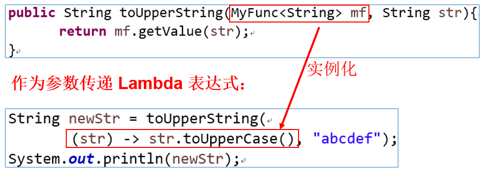

# Lambda表达式的使用

## 一、Lambda表达式使用举例

Lambda是一个**匿名函数**，我们可以把Lambda表达式理解为是**一段可以传递的代码**（将代码像数据一样进行传递）。使用它可以写出更简洁、更灵活的代码。作为一种更紧凑的代码风格，使Java的语言表达能力得到了提升。

* **`从匿名类到Lambda的转换举例1:`**

  **匿名内部类**

  ```java
  Runnable r1 = new Runnable() {
  	@Override
  	public void run() {
  		System.out.println("Hello World!");
  	}
  }
  ```

  **Lambda表达式**

  ```java
  Runnable r1 = () -> System.out.println("Hello World!");
  ```

* **`从匿名类到Lambda的转换举例2：`**

  **匿名内部类**

  ```java
  Comparator<Integer> comparator = new Comparator<Integer>() {
  	@Override
  	public int compare(Integer o1, Integer o2){
  		return Integer.compare(o1, o2);
  	}
  };
  ```

  **Lambda表达式**

  ```java
  Comparator<Integer> comparator = (o1, o2) -> Integer.compare(o1, o2);
  ```

  **方法引用**

  ```java
  Comparator<Integer> comparator = Integer::compare;
  ```

以上几种代码实现方式，均表示同一种含义。


## 二、语法

Lambda表达式：在Java8语言中引入的一种新的语法元素和操作符。这个操作符为"`->`"，该操作符被称为`Lambda操作符`或`箭头操作符`。它将Lambda分为两个部分：

* **`->左侧`**：指定了Lambda表达式需要的参数列表，也就是对应着重写的接口中的抽象方法的形参列表。
* **`->右侧`**：指定了Lambda体，是抽象方法的实现逻辑，对应着接口的实现类要重写的方法的方法体，也即Lambda表达式要执行的功能。


## 三、Lambda书写的不同格式

**语法格式1**：无参、无返回值

```java
@Test
public void test1(){
    Runnable r1 = new Runnable() {
        @Override
        public void run() {
            System.out.println("我爱北京天安门");
        }
    };
    r1.run();

    System.out.println("***************************");

    Runnable r2 = () -> {
        System.out.println("我爱北京天安门");
    };
    r2.run();
}
```

**语法格式2**：Lambda需要一个参数，但是没有返回值。

```java
@Test
public void test2(){
    //未使用Lambda表达式
    Consumer<String> con1 = new Consumer<String>() {
        @Override
        public void accept(String s) {
            System.out.println(s);
        }
    };
    con1.accept("谎言和誓言的区别是什么？");

    System.out.println("*******************************");

    //Lambda表达式
    Consumer<String> con2 = (String s) -> {
        System.out.println(s);
    };
    con2.accept("一个是听的人当真了，一个是说的人当真了");
}
```

**语法格式3**：数据类型可以省略，因为可由编译器推断得出，称为“类型推断”

```java
@Test
public void test3(){
    Consumer<String> con1 = (String s) -> {
        System.out.println(s);
    };
    con1.accept("一个是听的人当真了，一个是说的人当真了");

    System.out.println("***********************");

    //语法格式三使用后
    Consumer<String> con2 = (s) -> {
        System.out.println(s);
    };
    con2.accept("一个是听的人当真了，一个是说的人当真了");
}
```

**语法格式四**：Lambda表达式若只需要一个参数，参数的小括号可以省略

```java
@Test
public void test4(){
	//语法格式四使用前
	Consumer<String> con1 = (s) -> {
		System.out.println(s);
	}
	con1.accept("一个是听的人当真了，一个是说的人当真了");
	
	System.out.println("**********************");
	
	//语法格式四使用后
	Consumer<String> con2 = s -> {
		System.out.println(s);
	};
	con2.accept("一个是听的人当真了，一个是说的人当真了");
}
```


**语法格式5**：Lambda需要两个或以上的参数，多条执行语句，并且有返回值

```java
@Test
public void test5(){
	//语法格式5使用前
	Comparator<Integer> com1 = new Comparator<Integer>{
		@Override
		public int compare(Integer o1, Integer o2) {
			System.out.println(o1);
			System.out.println(o2);
			return o1.compareTo(o2);
		}
	};
	
	System.out.println(com1.compare(12,21));
	System.out.println("*************************");
	//语法格式5使用后
	Comparator<Integer> com2 = (o1, o2) -> {
		System.out.println(o1);
		System.out.println(o2);
		return o1. compareTo(o2);
	};
	
	System.out.println(com2.compare(12, 6));
}
```


**语法格式6**：当Lambda体只有一条语句时，比如return语句或其他语句，此时return和大括号都可以省略

```java
@Test
public void test6(){
	//语法格式6使用前
	Comparator<Integer> com1 = (o1, o2) -> {
		return o1.compareTo(o2);
	};
	System.out.println(com1.compare(12, 6));
	
	System.out.println("*********************");
	//语法格式6使用后
	Comparator<Integer> com2 = (o1, o2) -> o1.compareTo(o2);
}
```

## 四、**注意：**

**Lambda表达式的本质：**

* 一方面，Lambda表达式作为接口的实现类对象。

* 另一方面，将Lambda表达式看作是一个匿名函数。

例如：

```java
(o1, o2) -> {
	return o1.compareTo(o2);
}
```

将上面看做是一个匿名的函数。

由此可知，函数就是一个对象，体现了“万事万物皆对象”。

**注意：**

> Lambda表达式只适用于**`接口`**的实现，用于创建接口的实现类对象，且接口中**只有一个抽象方法**的情况。

由上述的注意点我们可以得知：

对于抽象类的实现，以及当接口中有多个抽象方法需要重写时，不能使用Lambda表达式的方式。

例如：

```java
@Test
public void test5(){
    AbstractClass c = new AbstractClass() {
        @Override
        public void abstractMethod() {

        }
    };

    //报错：
    AbstractClass abstractClass = () -> {
        System.out.println("nihao1");
    };
}
```

即Lambda表达式只能用来表示接口的实现类对象，且该接口有且只有一个抽象方法，否则无法使用Lambda表达式。


## 五、关于类型推断

在上述的语法格式三中，Lambda表达式中的参数类型都是由编译器推断得出的。Lambda表达式中无需指定类型，程序依然可以编译，这时因为javac根据程序的上下文，在后台推断出了参数的类型。Lambda表达式的类型依赖于上下文环境，是由编译器推断出来的。这就是所谓的“`类型推断`”。


## 六、Lambda表达式的语法规则总结

->的左边：Lambda形参列表，参数的类型可以省略。如果形参只有一个，则一对()也可以省略。


->的右边：Lambda体、对应着重写方法的方法体，如果方法体只有一行执行语句，则一对{}可以省略。如果有return关键字，则必须一并省略。


# 函数式（Functional）接口

## 一、什么是函数式接口？为什么需要函数式接口？

* 如果接口中`只声明有一个抽象方法`，则此接口就称为**函数式接口**。
* 因为只有给函数式接口提供实现类的对象时，我们才可以使用Lambda表达式。
* 我们可以在一个接口上使用`@FunctionalInterface`注解，这样做可以检查它是否是一个函数式接口。类似于@Override。同时javadoc也会包含一条声明，说明这个接口是一个函数式接口。
* 在`java.util.function`包下定义了Java 8 的丰富的函数式接口。

对于函数式接口，我们就可以使用Lambda表达式来给其创建实现类的对象了。


## 二、对函数式接口的理解

* Java从诞生之初就是一直倡导“一切皆对象”，在Java里面面向对象编程（OOP）是一切。但是随着python、scala等语言的兴起和新技术的挑战，Java不得不做出调整以便支持更加广泛的技术要求，即Java不但可以支持OOP还可以支持OOF（面向函数编程）
  * 从Java8引入Lambda表达式之后，Java也开始支持函数式编程。
  * Lambda表达式不是Java最早使用的。目前C++，C#，Python等均支持Lambda表达式。
* 面向对象的思想就是，找一个能解决这个事情的对象，调用对象的方法，完成事情。
* 而函数式编程的思想在于，谁去做的、怎么做的不重要，重要的是结果，不重视过程。
* 简单来说，在Java8中，Lambda表达式就是一个函数式接口的实例。这就是Lambda表达式和函数式接口的关系。也就是说，只要一个对象是函数式接口的实例，那么该对象就可以用Lambda表达式来表示。


## 三、举例

举例1：


举例2：


作为参数传递Lambda表达式：



以上的操作，实际就是去调用了`toUpperString()`方法，然后方法中的第一个参数是去使用Lambda表达式的方式创建`MyFunc`接口的实现类对象，重写的方法的方法体是将调用String类型的实参的`toUpperCase()`方法。

> 作为参数传递Lambda表达式：为了将Lambda表达式作为参数传递，接收Lambda表达式的参数类型必须是与该Lambda表达式兼容的函数式接口的类型。


## 四、Java内置函数式接口

### 4.1、之前的函数式接口

之前学过的接口，有些就是函数式接口，比如：

* java.lang.Runnable
  * public void run()
* java.lang.Iterable<T>
  * public Iterator<T> iterate()
* java.lang.Comparable<T>
  * public int compareTo(T t)
* java.util.Comparator<T>
  * public int compare(T t1, T t2)

### 4.2、四大核心函数式接口

对于下面四个函数式接口，重点了解其具体用途。

| 函数式接口           | 称谓       | 参数类型 | 用途                                                         |
| -------------------- | ---------- | -------- | ------------------------------------------------------------ |
| **`Consumer<T>`**    | 消费型接口 | T        | 对类型为T的对象应用操作，包含方法：**`void accept(T t)`**<br />消费型可以理解为它只接收数据，没有数据的返回 |
| **`Supplier<T>`**    | 供给型接口 | 无       | 返回类型为T的对象，包含方法：**`T get()`**<br />供给型可以理解为它只返回数据，而不接收数据 |
| **`Function<T, R>`** | 函数型接口 | T        | 对类型为T的对象应用操作，并返回结果。结果是R类型的对象。包含方法：**`R apply(T t)`** |
| **`Predicate<T>`**   | 判断型接口 | T        | 确定类型为T的对象是否满足某约束，并返回boolean值。包含方法：**`boolean test(T t)`** |


#### 核心函数式接口的代码演示

##### 1、消费型接口演示

消费型接口用于对传入的数据进行操作。

```java
List<String> list = Arrays.asList("java", "c", "python", "c++", "C#");
list.forEach(s -> System.out.println(s));
```

这里的`forEach()`方法中，就使用到了消费型接口Consumer：


首先，我们来理解一下Consumer，Consumer传入数据，没有数据返回，那么实际上就是去在Consumer的accept()方法中对数据进行操作。

在上例中，我们使用了Lambda表达式的方式，对accept()方法进行重写，让我们在遍历中打印集合中的数据。

forEach()方法实际上就是去遍历集合，然后调用Consumer接口实现类对象的accept()方法，传入集合对象。


##### 2、供给型接口演示

供给型接口用于获取数据。

```java
@Test
public void test2(){
    Supplier<String> supplier = () -> "hello Java!";
    System.out.println(supplier.get());
}
```

`Supplier`是供给型接口，该接口的抽象方法特点是不传入数据，只返回数据。相当于是一个获取数据的接口。

上例中，使用了Lambda表达式去获取了"hello Java!"这一段字符串数据对象。


##### 3、函数型接口演示

函数型接口的作用在于对传入的数据进行操作，然后返回指定类型的数据。

```java
//使用Lambda表达式实现Function<T, R>接口，可以实现将一个字符串首字母转为大写的功能
Function<String, String> fun = s -> s.substring(0, 1).toUpperCase() + s.subString(1);
System.out.println(fun.apply("hello"));
```

##### 4、判断型接口演示

判断型接口的作用在于筛选或判断传入的数据是否满足某种要求。

```java
ArrayList<String> list = new ArrayList<>();
list.add("hello");
list.add("java");
list.add("atguigu");
list.add("ok");
list.add("yes");

System.out.println("删除之前：");
//这里使用的是消费型接口
list.forEach(t-> System.out.println(t));
		
//用于删除集合中满足filter指定的条件判断的。
//删除包含o字母的元素
list.removeIf(s -> s.contains("o"));

System.out.println("删除包含o字母的元素之后：");
list.forEach(t-> System.out.println(t));
```

`list.removeIf()`方法中就需要传入的是判断型接口，用于删除满足条件（返回值为true）的数据：


### 4.3、其他函数式接口（了解即可）

**类型1：消费型接口**

消费型接口的抽象方法特点：有形参，但是返回值类型是void

| 接口名               | 抽象方法                       | 描述                       |
| -------------------- | ------------------------------ | -------------------------- |
| BiConsumer<T,U>      | void accept(T t, U u)          | 接收两个对象用于完成功能   |
| DoubleConsumer       | void accept(double value)      | 接收一个double值           |
| IntConsumer          | void accept(int value)         | 接收一个int值              |
| LongConsumer         | void accept(long value)        | 接收一个long值             |
| ObjDoubleConsumer<T> | void accept(T t, double value) | 接收一个对象和一个double值 |
| ObjIntConsumer<T>    | void accept(T t, int value)    | 接收一个对象和一个int值    |
| ObjLongConsumer<T>   | void accept(T t, long value)   | 接收一个对象和一个long值   |

**类型2：供给型接口**

这类接口的抽象方法特点：无参，但是有返回值

| 接口名          | 抽象方法               | 描述              |
| --------------- | ---------------------- | ----------------- |
| BooleanSupplier | boolean getAsBoolean() | 返回一个boolean值 |
| DoubleSupplier  | double getAsDouble()   | 返回一个double值  |
| IntSupplier     | int getAsInt()         | 返回一个int值     |
| LongSupplier    | long getAsLong()       | 返回一个long值    |

**类型3：函数型接口**

这类接口的抽象方法特点：既有参数又有返回值

| 接口名                  | 抽象方法                                        | 描述                                                |
| ----------------------- | ----------------------------------------------- | --------------------------------------------------- |
| UnaryOperator<T>        | T apply(T t)                                    | 接收一个T类型对象，返回一个T类型对象结果            |
| DoubleFunction<R>       | R apply(double value)                           | 接收一个double值，返回一个R类型对象                 |
| IntFunction<R>          | R apply(int value)                              | 接收一个int值，返回一个R类型对象                    |
| LongFunction<R>         | R apply(long value)                             | 接收一个long值，返回一个R类型对象                   |
| ToDoubleFunction<T>     | double applyAsDouble(T value)                   | 接收一个T类型对象，返回一个double                   |
| ToIntFunction<T>        | int applyAsInt(T value)                         | 接收一个T类型对象，返回一个int                      |
| ToLongFunction<T>       | long applyAsLong(T value)                       | 接收一个T类型对象，返回一个long                     |
| DoubleToIntFunction     | int applyAsInt(double value)                    | 接收一个double值，返回一个int结果                   |
| DoubleToLongFunction    | long applyAsLong(double value)                  | 接收一个double值，返回一个long结果                  |
| IntToDoubleFunction     | double applyAsDouble(int value)                 | 接收一个int值，返回一个double结果                   |
| IntToLongFunction       | long applyAsLong(int value)                     | 接收一个int值，返回一个long结果                     |
| LongToDoubleFunction    | double applyAsDouble(long value)                | 接收一个long值，返回一个double结果                  |
| LongToIntFunction       | int applyAsInt(long value)                      | 接收一个long值，返回一个int结果                     |
| DoubleUnaryOperator     | double applyAsDouble(double operand)            | 接收一个double值，返回一个double                    |
| IntUnaryOperator        | int applyAsInt(int operand)                     | 接收一个int值，返回一个int结果                      |
| LongUnaryOperator       | long applyAsLong(long operand)                  | 接收一个long值，返回一个long结果                    |
| BiFunction<T,U,R>       | R apply(T t, U u)                               | 接收一个T类型和一个U类型对象，返回一个R类型对象结果 |
| BinaryOperator<T>       | T apply(T t, T u)                               | 接收两个T类型对象，返回一个T类型对象结果            |
| ToDoubleBiFunction<T,U> | double applyAsDouble(T t, U u)                  | 接收一个T类型和一个U类型对象，返回一个double        |
| ToIntBiFunction<T,U>    | int applyAsInt(T t, U u)                        | 接收一个T类型和一个U类型对象，返回一个int           |
| ToLongBiFunction<T,U>   | long applyAsLong(T t, U u)                      | 接收一个T类型和一个U类型对象，返回一个long          |
| DoubleBinaryOperator    | double applyAsDouble(double left, double right) | 接收两个double值，返回一个double结果                |
| IntBinaryOperator       | int applyAsInt(int left, int right)             | 接收两个int值，返回一个int结果                      |
| LongBinaryOperator      | long applyAsLong(long left, long right)         | 接收两个long值，返回一个long结果                    |

**类型4：判断型接口**

这类接口的抽象方法特点：有参，但是返回值类型是boolean结果。

| 接口名           | 抽象方法                   | 描述             |
| ---------------- | -------------------------- | ---------------- |
| BiPredicate<T,U> | boolean test(T t, U u)     | 接收两个对象     |
| DoublePredicate  | boolean test(double value) | 接收一个double值 |
| IntPredicate     | boolean test(int value)    | 接收一个int值    |
| LongPredicate    | boolean test(long value)   | 接收一个long值   |


# 方法引用与构造器引用

Lambda表达式是可以简化函数式接口的变量或形参赋值的语法。而方法引用可以看做是Lambda表达式的进一步刻画。

要看得懂方法引用，实际上就是将Lambda表达式转换成另外一种比较简短的书写格式。

当我们看到方法引用的时候，就要将其考虑成Lambda表达式。

## 一、方法引用

### 1.1、方法引用的理解

当需要提供一个函数式接口的示例时，我们可以使用Lambda表达式提供此实例。

当满足一定的条件的情况下，我们还可以使用方法引用或构造器引用替换Lambda表达式。

当要传递给Lambda体的操作，已经有实现的方法了，可以使用方法引用。

方法引用可以看做是Lambda表达式深层次的表达，换句话说，方法引用就是Lambda表达式，也就是函数式接口的一个实例，通过方法的名字来指向一个方法，可以认为是Lambda表达式的一个语法糖。

> 语法糖，`对语言的功能没有影响，但是更方便程序员使用`。通常来说使用语法糖能够增加程序的可读性，从而减少程序代码出错的机会。


### 1.2、方法引用的本质

> 方法引用作为函数式接口的实例。　－－－＞　“万事万物皆对象”


### 1.3、格式

* 格式：使用方法引用操作符“**`::`**”将类（或对象）与方法名分隔开。
  * 两个:中间不能有空格，而且必须英文状态下半角输入
* 如下三种主要使用情况：
  * 情况一：**`对象::实例方法名`**
  * 情况二：**`类::静态方法名`**
  * 情况三：**`类::实例方法名`**

### 1.4、方法使用的前提

**要求1**：

> Lambda表达式中**`只有一句语句`**，并且是**`通过调用一个对象/类现有的方法`**来完成的。

例如：System.out对象，调用println()方法来完成Lambda体


**要求2：**

* **`针对情况一（对象::实例方法名）：`**

  函数式接口中的抽象方法a在被重写时使用了某一个对象的方法b。如果**方法a的形参列表、返回值类型与方法b的形参列表、返回值类型都相同**，则我们可以使用方法b实现对方法a的重写、替换。

* **`针对情况二（类::静态方法名）：`**

  函数式接口中的抽象方法a在被重写时使用了某一个类的静态方法b。**如果方法a的形参列表、返回值类型与方法b的形参列表、返回值类型都相同**，则我们可以使用方法b实现对方法a的重写、替换。

* **`针对情况三（类::实例方法名）：`**

  函数式接口中的抽象方法a在被重写时使用了某一个对象的方法b。如果方法a的返回值类型与方法b的**返回值类型相同**，同时**方法a的形参列表中有n个参数，方法b的形参列表有n-1个参数，且方法a的第1个参数作为方法b的调用者，且方法a的后n-1参数与方法b的n-1参数匹配。**

  解释：

  比如创建一个Comparator接口的实现类对象：

  ```java
  Comparator<String> com = new Comparator<>(){
  	@Override
  	public int compare(String o1, String o2){
  		return o1.compareTo(o2);
  	}
  };
  ```

  其中重写的compare()方法的返回值是int类型，方法体中调用了String类型的compareTo()方法，返回值也是int类型，满足方法a的返回值与方法b的返回值类型相同的情况。

  并且compare()有两个参数，compareTo()有一个参数，满足方法a的形参列表比方法b的形参列表多1的情况。

  然后，compare()方法的第一个形参o1是compareTo()方法的调用者，并且compare()方法的第二个参数是compareTo()方法的第一个参数，满足最后的条件。

  所以，这里可以使用到方法引用。修改成方法引用如下所示：

  ```java
  Comparator<String> com = String::compareTo;
  ```

### 1.5、使用案例


* **情况一（`对象::实例方法名`）案例**：

```java
@Test
public void test(){
    //使用Lambda表达式的方式
    Consumer<String> con1 = t -> System.out.println(t);

    //使用方法引用
    Consumer<String> con2 = System.out::println;
}

@Test
public void test2(){
    Employee employee = new Employee("cheng", 24);
    //使用匿名实现类的方式
    Supplier<String> sup1 = new Supplier<String>() {
        @Override
        public String get() {
            return employee.getName();
        }
    };

    //使用Lambda表达式
    Supplier<String> sup2 = () -> employee.getName();

    //使用方法引用
    Supplier<String> sup3 = employee::getName;
}
```

上述两种案例，都是`对象::实例方法名`的情况。

* 要求：函数式接口中的抽象方法a与其内部实现时调用的对象的某个方法b的形参列表和返回值类型都相同。

  此时，可以考虑使用方法b实现对方法a的替换、覆盖。

* 注意：此方法b是非静态的方法，需要对象调用。


* **情况二（`类::静态方法名`）案例：**

```java
@Test
public void test3(){
    Comparator<Integer> com1 = new Comparator<Integer>() {
        @Override
        public int compare(Integer o1, Integer o2) {
            return Integer.compare(o1, o2);
        }
    };

    //使用Lambda表达式
    Comparator<Integer> com2 = (o1, o2) -> Integer.compare(o1, o2);

    //使用方法引用
    Comparator<Integer> com3 = Integer::compare;
}

//在上例中，Comparator接口中重写的compare()方法的形参列表和返回值与在表达式中调用的Integer.compare()方法的形参列表、返回值均一致，此时就可以使用方法引用。

@Test
public void test4(){
    Function<Double, Long> fun1 = new Function<Double, Long>() {
        @Override
        public Long apply(Double aDouble) {
            return Math.round(aDouble);
        }
    };

    //使用Lambda表达式
    Function<Double, Long> fun2 = aDouble -> Math.round(aDouble);

    //使用方法引用
    Function<Double, Long> fun3 = Math::round;

}

//上例中的Function接口中重写的apply方法的形参列表、返回值与Math.round()方法的形参列表、返回值均一致，就可以使用方法引用。
```


情况二与情况一类似，要求也是一样的，即要求重写方法a的参数、返回值与表达式中调用方法b的参数、返回值一致，即可使用。


* **情况三（`类::实例方法名`）案例：**

```java
@Test
public void test5(){
    //使用匿名实现类的方式
    Comparator<String> com1 = new Comparator<String>() {
        @Override
        public int compare(String o1, String o2) {
            return o1.compareTo(o2);
        }
    };

    //使用Lambda表达式
    Comparator<String> com2 = (s1, s2) -> s1.compareTo(s2);

    //使用方法引用
    Comparator<String> com3 = String::compareTo;
}

@Test
public void test6(){
    //使用匿名实现类的方式
    BiPredicate<String, String> pre1 = new BiPredicate<String, String>() {
        @Override
        public boolean test(String s1, String s2) {
            return s1.equals(s2);
        }
    };

    //使用Lambda表达式
    BiPredicate<String, String> pre2 = (s1, s2) -> s1.equals(s2);

    //使用方法引用
    //重写的test()方法返回值是boolean，有两个参数，第一个参数是方法体中调用equals()方法
    //的调用者，第二个参数s2是equals()方法的参数
    BiPredicate<String, String> pre3 = String::equals;

}


@Test
public void test7(){
    Employee employee = new Employee("cheng", 24);
    Function<Employee, String> fun1 = new Function<Employee, String>() {
        @Override
        public String apply(Employee employee) {
            return employee.getName();
        }
    };

    //Lambda表达式
    Function<Employee, String> fun2 = (e) -> e.getName();

    //使用方法引用
    Function<Employee, String> fun3 = Employee::getName;

}
```

如果方法a的返回值类型与方法b的**返回值类型相同**，同时**方法a的形参列表中有n个参数，方法b的形参列表有n-1个参数，且方法a的第1个参数作为方法b的调用者，且方法a的后n-1参数与方法b的n-1参数匹配。**

此时，就可以使用`类名::实例方法名`的方式使用方法引用。

### 方法引用总结

方法引用有三种情况，分别是：

* **`对象::实例方法名`**
* **`类::静态方法名`**
* **`类::实例方法名`**

这三种情况，**均需要满足**：

> **`函数式接口中的抽象方法a内部只有一条语句，且是调用现有的方法b来完成的。`**


对于**第一种情况**和**第二种情况**，要求满足：

> **`方法a的参数列表、返回值与方法b的参数列表、返回值相同。`**

比如：

```java
Consumer<String> con = new Consumer<String>() {
	@Override
	public void accept(String s){
		System.out.println(s);
	}
};

//方法引用：
Consumer<String> con = System.out::println;
```

由于accept()方法的参数列表、返回值类型与System.out对象的println()方法的参数列表、返回值类型一致，并且该重写方法中只有这一条执行语句，所以可以转换成方法引用（第一种情况）。


对于**第三种情况**，要求满足：

> **`方法a的返回值类型与方法b相等，并且方法a有n个参数，方法b有n-1个参数，方法a的第一个参数是方法b的调用者，方法a的后续的n-1参数与方法b的n参数匹配。`**

比如：

```java
Employee employee = new Employee("cheng", 24);
Function<Employee, String> fun1 = new Function<Employee, String>() {
    @Override
    public String apply(Employee employee) {
        return employee.getName();
    }
};

//改为方法引用
Function<Employee, String> fun2 = Employee::getName();
```

在上例中，方法a是apply()，方法b是getName()方法，其中方法a参数employee是方法b的调用者，且后续没有参数，与方法b匹配。

此时就可以转换成方法引用的形式。

**`类::实例方法名`**其中的类，就是方法b调用者所属的类，实例方法名就是方法b。

## 二、构造器引用

**要求：**

当Lambda表达式是使用构造器创建一个对象，并且满足：`Lambda表达式的形参，是创建这个对象构造器的实参列表`，此时就可以使用构造器引用。

**格式**：**`类名::new`**

**举例：**

```java
@Test
public void test1(){
    Supplier<Employee> sup = new Supplier<Employee>() {
        @Override
        public Employee get() {
            return new Employee();
        }
    };

    //Lambda表达式
    Supplier<Employee> sup2 = () -> new Employee();

    //构造器引用
    Supplier<Employee> sup3 = Employee::new;
}


@Test
public void test2(){
    //匿名实现类对象
    Function<Integer, Employee> func1 = new Function<Integer, Employee>() {
        @Override
        public Employee apply(Integer id) {
            return new Employee(id);
        }
    };
    
    //Lambda表达式
    Function<Integer, Employee> func2 = id -> new Employee(id);
    
    //构造器引用
    Function<Integer, Employee> func3 = Employee::new;
}
```

在上面两个案例中：

第一个例子使用的是Employee类中的空参构造器，因为重写的get()方法是空参的，所以二者的参数相同，并且get()方法体中只有一条执行语句，所以可以使用构造器引用，即Employee::new。

第二个例子中，使用的是带一个Integer/int类型的参数的Employee构造器，同时apply()方法也是带有一个Integer/int类型的参数，所以可以将Lambda表达式转换成构造器引用：Employee::new，此时实际上调用的是带一个int参数的构造器。

## 三、数组构造引用

**要求：`当Lambda表达式是创建一个数组对象，并且满足Lambda表达式形参，正好是给创建这个数组对象的长度`**，就可以使用数组构造引用。

**格式：`数组类型名::new`**

**举例：**

```java
@Test
public void test3(){
    //匿名函数
    Function<Integer, Employee[]> func1 = new Function<Integer, Employee[]>() {
        @Override
        public Employee[] apply(Integer length) {
            return new Employee[length];
        }
    };

    //Lambda表达式
    Function<Integer, Employee[]> func2 = length -> new Employee[length];

    //数组构造引用
    Function<Integer, Employee[]> func3 = Employee[]::new;
}
```

在上例中，apply()方法的形参作为了创建出来的数组的长度，此时就可以使用数组构造引用：Employee[]::new。


# Stream API

## 一、说明

* Java8中有两大最为重要的改变，第一个是Lambda表达式；另一个则是Stream API。
* Stream API(java.util.stream)把真正的函数式编程风格引入到Java中。这是目前为止对Java类库`最好的补充`，因为Stream API可以极大提供Java程序员的生产力，让程序员写出高效率、干净、简洁的代码。
* Stream是Java8中处理集合的关键抽象概念，它可以指定你希望对集合进行的操作，可以执行非常复杂的查找、过滤和映射数据等操作。**使用Stream API对集合数据进行操作，就类似于使用SQL执行的数据库查询**。也可以使用Stream API来并行执行操作。简言之，Stream API提供了一种高效且易于使用的处理数据的方式。

## 二、为什么要使用Stream API？

实际开发中，项目中多数数据源都来自于MySQL、Oracle等。但现在数据源可以更多了，有MongDB，Redis等，而这些NoSQL的数据就需要Java层面去处理。

> 我们可以通过Stream流对集合或数组进行一系列操作，比如筛选、去重等等，然后将集合或数组转换成我们想要的数据结构，比如Map类型。

## 三、什么是Stream

Stream是数据渠道，用于操作数据源（集合、数组等）所生成的元素序列。

Stream和Collection集合的区别：**Collection是一种静态的内存数据结构，讲的是数据，而Stream是有关计算的，讲的是计算**。前者主要面向内存，存储在内存中，后者主要是面向CPU，通过CPU实现计算。

**注意：**

①Stream自己不会存储元素。

②Stream不会改变原对象。相反，它们会返回一个持有结果的新Stream。

③Stream操作是延迟执行的。这意味着它们要等到需要结果的时候才执行。即一旦执行终止操作，就执行中间操作链，并产生结果。

④Stream一旦执行了终止操作，就不能再调用其他中间操作或终止操作了。

> **`Stream之于集合，类似于SQL之于数据表的查询。`**
>
> 当我们需要对NoSQL进行操作时，需要Java层面处理，这个时候就需要使用到Stream。


## 四、Stream的操作三个步骤

####  1、**`创建Stream`**

根据数据源（集合、数组），获取一个流。


**方式一：通过集合**

Java8中的Collection接口被扩展，提供了两个获取流的方法：

* **`default Stream<E> stream()`**：返回一个顺序流
* **`default Stream<E> parallelStream()`**：返回一个并行流

```java
List<Integer> list = new ArrayList<>();
//顺序流
Stream<Integer> stream = list.stream();
//并行流
Stream<Integer> parallelStream = list.parallelStream();
```

**顺序流stream和并行流parallelStream的简单区分：**`stream`是顺序流，由主线程按顺序对流执行操作，而`parallelStream`是并行流，内部以多线程并行执行的方式对流进行操作，但前提是流中的数据处理没有顺序要求。例如筛选集合中的奇数，两者的处理不同之处：


如果流中的数据量足够大，并行流可以加快处理速度。

除了直接创建并行流，还可以通过`parallel()`把顺序流转换成并行流：

```java
Optional<Integer> findFirst = list.stream().parallel().filter(x->x>6).findFirst();
List<Integer> list = Arrays.asList(1, 3, 6, 8, 12, 4);
Optional<Integer> findFirst = list.stream().parallel().filter(x->x>6).findFirst();
System.out.println("使用Stream的静态方法generate：" + findFirst.get());

```


**方式二：通过数组**

Java8中的Arrays的静态方法stream()可以获取数组流：

* **`static <T> Stream<T> stream(T[] array)`**：返回一个流
* `public static IntStream stream(int[] array)`
* `public static LongStream stream(long[] array)`
* `public static DoubleStream stream(double[] array)`

```java
Integer[] integers = new Integer[]{1, 32, 34, 53};
//获取数组流
Stream<Integer> stream = Arrays.stream(integers);
```


**方式三：通过Stream的of()方法**

当有多个数据，并且这多个数据没有放在容器（集合、数组）里面时，此时可以通过Stream类中的静态方法of()，创建一个流。

* **`public static <T> Stream<T> of(T... values)`**：返回一个流

```java
Stream<Integer> stream = Stream.of(12, 33, 23);
stream.forEach(System.out::println);
```


**方式四：创建无限流(了解)**

可以使用静态方法 Stream.iterate() 和 Stream.generate(), 创建无限流。

- 迭代
  public static<T> Stream<T> iterate(final T seed, final UnaryOperator<T> f) 

- 生成
  public static<T> Stream<T> generate(Supplier<T> s) 

```java
// 方式四：创建无限流
@Test
public void test05() {
	// 迭代
	// public static<T> Stream<T> iterate(final T seed, final
	// UnaryOperator<T> f)
	Stream<Integer> stream = Stream.iterate(0, x -> x + 2);
	stream.limit(10).forEach(System.out::println);

	// 生成
	// public static<T> Stream<T> generate(Supplier<T> s)
	Stream<Double> stream1 = Stream.generate(Math::random);
	stream1.limit(10).forEach(System.out::println);
}

```


#### 2、**`Stream一系列的中间操作`**

每次处理都会返回一个持有结果的新Stream，即中间操作的方法返回值仍然是Stream类型的对象。因此中间操作可以是个`操作链`，可对数据源的数据进行n次处理，但是在终止操作前，不会真正执行，在终止操作时一次性全部处理，称为“**`惰性求值`**”。

##### filter过滤操作

filter方法接受一个Predicate类型的参数，Predicate表示用于判断，传入一个参数，返回boolean类型。

filter用于过滤Stream中的元素，并返回符合条件的元素组成的新Stream。


例：

```java
/**
 * 过滤所有偶数并打印
 */
List<Integer> numbers = Arrays.asList(1, 2, 3, 4, 5, 6, 7, 8, 9, 10);
numbers.stream().filter(n -> n % 2 == 0).forEach(System.out::println);

//输出结果：
//2
//4
//6
//8
//10
```


##### distinct去重、limit截取操作与skip跳过操作

distinct()，去重，通过流所生成元素的`hashCode()`和`equals()`去除重复元素。

limit(long maxSize)：截断流，使其元素不超过给定数量，即最多只保留maxSize数量的元素，若流中元素不足maxSize个，则全部保留。

skip(long n)：跳过元素，返回一个去掉前n个元素的流，若流中元素不足n个，则返回一个空流。


```java
List<String> list = Arrays.asList("a", "b", "c", "d","a", "e", "g", "h", "d");

//去重
list.stream().distinct().forEach(System.out::print);
System.out.println("\n*******************");

//截断，保留5个元素
list.stream().limit(5).forEach(System.out::print);
System.out.println("\n*******************");

//跳过，跳过前面5个元素
list.stream().skip(5).forEach(System.out::print);
```

打印结果：


##### peek查看操作

peek方法接收一个`Consumer`类型的参数，可以在Stream中的每个元素执行所提供的操作，该**方法不会影响Stream的元素**。

即我们只能使用peek()方法执行读操作，若使用peek()执行写的操作，则不会有效果。

```java
List<Integer> list = Arrays.asList(1, 2, 3, 4, 5);
//查看操作
list.stream()
        .peek(i -> {
            System.out.print("value:" + i);
            //虽然这里将i加上了100，但是peek()操作不会修改原本元素的值
            i += 100;
        })
        .filter(i -> i > 3)//筛选大于3的数据
        .forEach(System.out::println);

//输出结果：
//value：1，value：2，value：3，value：4，4
//value：5，5
```


##### 映射操作（重要）

映射，意思是将流中的数据转换成其他样式。比如，将字符串类型的集合中的数据都转换成大写，比如aa -> AA。

* **`map`**：接收一个函数作为参数，该函数会被应用到每个元素上，并将其映射成一个新的元素，即：`元素 -> 另一种元素`
* **`flatMap`**：接收一个函数作为参数，将流中的每个值都换成另一个流，然后将所有流连接成一个流。实际上flatMap()就是将流中的每个元素，转换成另一种流，即：`元素 -> Stream流`


**`map()：`**

```java
<R> Stream<R> map(Function<? super T, ? extends R> mapper);
```

**`flatMap()：`**

```java
<R> Stream<R> flatMap(Function<? super T, ? extends Stream<? extends R>> mapper);
```

**使用案例：**将字符串集合中所有的字符串元素的英文字符全部变为大写

我们使用匿名实现类的方式直观地看一下map()与flatMap()的区别：

```java
@Test
public void test6(){
    List<String> list = Arrays.asList("hello world", "nihao", "java");
    //使用这两种方式，将字符串中的数据转换成大写返回
    Stream<String> stream1 = list.stream().map(new Function<String, String>() {
        @Override
        public String apply(String s) {
            return s.toUpperCase();
        }
    });
    stream1.forEach(System.out::println);

    System.out.println("**********************");

    Stream<String> stream2 = list.stream().flatMap(new Function<String, Stream<String>>() {
        @Override
        public Stream<String> apply(String s) {
            String upperCase = s.toUpperCase();
            return Stream.of(upperCase);
        }
    });
    stream2.forEach(System.out::println);
}
```

打印结果：


我们可以发现，使用map()与flatMap()都得到了我们想要的结果，那这两个方法有什么区别呢？

重点在参数上！

map()方法需要传入的是Function<? super T, ? extends R> mapper参数

flatMap()方法需要传入的是Function<? super T, ? extends Stream<? extends R>> mapper参数

Function接口，函数式接口，传入一个参数，返回一个参数。

map中的Function传入的是T，返回R

flatMap中的Function传入的是T，返回的是Stream<R>

即两者的区别就在于：

> map()方法可以直接返回指定类型的参数
>
> flatMap()需要将数据在其中转换成Stream类型后，才能返回
>
> 二者都可以用来将数据转换成指定类型，只不过flatMap()多了一步，将数据转换成Stream，但实际二者可相互转换。


##### 排序操作

有两种排序：

* **`sorted()`**：自然排序，流中元素需实现Comparable接口
* **`sorted(Comparator com)`**：Comparator排序器自定义排序

使用sorted()方法，元素所属的类需要去实现Comparable接口，在重写的compareTo()方法中定义自然排序的方式。

若使用sorted(Comparator com)方法实现自定义排序，则可以使用Lambda表达式在使用时去定义排序方式。

案例：将员工按照工资由高到低（工资一样则按照年龄由大到小）排序，并将名字打印

```java
@Test
public void test8(){
    List<Employee> employees = new ArrayList<>();
    employees.add(new Employee("Tom", 24, 8000));
    employees.add(new Employee("Jack", 23, 8000));
    employees.add(new Employee("Lucy", 33, 19000));
    employees.add(new Employee("Sherry", 26, 8700));
    employees.add(new Employee("John", 28, 9800));
    employees.add(new Employee("Alisa", 29, 12000));
    employees.add(new Employee("Bob", 35, 28000));

    List<String> nameList = employees.stream().sorted((e1, e2) -> {
        if (e1.getSalary() != e2.getSalary()) {
            return -(int) (e1.getSalary() - e2.getSalary());
        } else {
            return -(e1.getAge() - e2.getAge());
        }
    }).map(Employee::getName).toList();
    System.out.println("按工资由高到低排序（工资一样按年龄由大到小）：" + nameList);

}
```

打印结果：


#### 3、**`终止操作（终端操作）`**

* 终端操作会从流的流水线生成结果。其结果可以是任何不是流的值，例如：List、Integer，甚至是void。
* 流进行了终止操作后，不能再次使用。


##### 匹配、查找以及遍历操作

| 方法                        | 描述                                                         |
| --------------------------- | ------------------------------------------------------------ |
| **`allMatch(Predicate p)`** | 检查是否匹配所有元素                                         |
| **`anyMatch(Predicate p)`** | 检查是否至少匹配一个元素                                     |
| noneMatch(Predicate p)      | 检查是否没有匹配所有元素                                     |
| **`findFirst()`**           | 返回第一个元素                                               |
| findAny()                   | 返回当前流中的任意元素                                       |
| **`count()`**               | 返回流中元素总数                                             |
| **`max(Comparator c)`**     | 返回流中最大值                                               |
| **`min(Comparator c)`**     | 返回流中最小值                                               |
| **`forEach(Consumer c)`**   | 内部迭代<br />使用Collection接口需要用户去做迭代，称为外部迭代。<br />相反，Stream API使用内部迭代。 |

```java
List<Integer> list = Arrays.asList(23, 45, 66, 98, 12, 70);

//检查是否匹配所有元素，是否都大于0
System.out.println(list.stream().allMatch(i -> i > 0));

//检查是否至少匹配一个元素
System.out.println(list.stream().anyMatch(i -> i > 100));

//返回第一个元素
System.out.println(list.stream().findFirst().get());

//返回流中元素总数
System.out.println(list.stream().count());

//返回流中的最大值
System.out.println(list.stream().max(Integer::compare).get());
```

打印结果：


##### 归约操作（reduce()）

归约，也称缩减，顾名思义，是把一个流缩减成一个值，能实现对集合求和、求乘积和求最值操作。


归约有两个方法：

* **`T reduce(T identity, BinaryOperator b)`**
* **`Optional<T> reduce(BinaryOperator b)`**

这两个方法在使用时没有什么区别：

第一个reduce()有两个参数，第一个参数表示**初始值**，将所有的数据归约后再加上初始值identity，并将得到的结果数据返回；

第二个reduce()只有一个参数，返回的是一个容器，我们可以调用该容器的get()方法获得到归约后的数据。

案例：获取所有员工的工资和

```java
List<Employee> employees = new ArrayList<>();
employees.add(new Employee("Tom", 24, 8000));
employees.add(new Employee("Jack", 23, 8000));
employees.add(new Employee("Lucy", 33, 19000));
employees.add(new Employee("Sherry", 26, 8700));
employees.add(new Employee("John", 28, 9800));
employees.add(new Employee("Alisa", 29, 12000));
employees.add(new Employee("Bob", 35, 28000));

//第一个参数是一个新建的Employee对象，初始值为0
Employee employee1 = employees.stream().reduce(new Employee(), (e1, e2) -> new Employee(null, 0, e1.getSalary() + e2.getSalary()));
System.out.println(employee1);

Employee employee2 = employees.stream().reduce((e1, e2) -> new Employee(null, 0, e1.getSalary() + e2.getSalary())).get();
System.out.println(employee2);
```

打印结果：


reduce()方法一般与map()映射一起使用，为什么？

因为reduce()方法是根据其中的BinaryOperator接口进行归约的，让我们来看一看这个接口的实现：

```java
employees.stream().reduce(new BinaryOperator<Employee>() {
    @Override
    public Employee apply(Employee employee, Employee employee2) {
        return null;
    }
})
```

我们可以看到，当我们stream流中的元素是引用数据类型时，使用reduce()方法重写的方法需要传入两个同类型的引用数据类型，返回值也是同样的引用数据类型。

但是，当我们使用到reduce()方法进行归约时，一般是需要获取到引用数据类型元素中的属性，将这些属性进行归约，所以，我们在使用reduce()方法前，一般需要将引用数据转换成其属性，再进行归约。

##### 收集操作（collect()）

`collect`，收集，可以说是内容最繁多、功能最丰富的部分了。从字面上去理解，就是把一个流收集起来，最终可以是收集成一个值也可以收集成一个新的集合。

> collect主要依赖`java.util.stream.Collectors`类内置的静态方法。
>

###### 归集（toList、toSet、toMap、toCollection）

* **`static Collector toList()`**：收集流转换成List类型的数据
* **`static Collector toSet()`**：收集流转换成Set类型的数据，相较于toList()，其会有去重的操作
* **`static Collector toMap()`**：收集流转换成Map类型的数据
* **`static Collector toCollection(Supplier<T> coll)`**：收集流转换为指定集合类型的数据

使用案例：

筛选出工资大于10000的Employee类对象，并分别使用List、Set、Map以及ArrayList收集流元素，其中，Map的key是Employee的名字，value是Employee对象。

```java
List<Employee> employees = new ArrayList<>();
//收集数据到List接口
List<Employee> employeeList = employees.stream().filter(x -> x.getSalary() > 10000).collect(Collectors.toList());

//收集数据到Set接口
Set<Employee> employeeSet = employees.stream().filter(x -> x.getSalary() > 10000).collect(Collectors.toSet());

//收集数据到Map接口，其中key是名字，value是Employee对象
Map<String, Employee> employeeMap = employees.stream().filter(x -> x.getSalary() > 10000).collect(Collectors.toMap(Employee::getName, employee -> employee));

//收集数据，转换成指定的集合类型，比如ArrayList
ArrayList<Employee> employeeArrayList = employees.stream().filter(x -> x.getSalary() > 10000).collect(Collectors.toCollection(ArrayList::new));
```

toCollection()方法中，需要传入一个Supplier接口（即供应型接口），只有返回值，没有传参，该接口的实现类返回值就是要创建的指定集合类型。

比如在上例中，ArrayList::new转换成Lambda表达式就是() -> return new ArrayList();

即表明将流的元素收集到ArrayList集合中。


###### 统计

Collectors提供了一系列用于数据统计的静态方法：

* 计算流中元素的个数：**`counting()`**
* 求平均值：`averagingInt()`、`averagingLong()`、`averagingDouble()`
* 求最值：`maxBy()`、`minBy()`
* 求和：`summingInt()`、`summingLong()`、`summingDouble()`
* 统计以上所有的信息（包括个数、和、平均值、最大值和最小值）：`summarizingInt()`、`summarizingLong()`、`summarizingDouble()`


###### 分组与分区（根据指定条件将stream中元素转换成Map集合形式）

**分组**：当我们使用Stream流处理数据后，可以根据某个属性来将数据进行分组。分组分为`一级分组`和`多级分组`，分别使用groupingBy()方法的两种参数来实现。

一级分组：

* **`Collector groupingBy(Function classifier)`**

多级分组：

* **`Collector groupingBy(Function classifier, Collector downstream)`**

无论是一级分组还是多级分组，参数Function返回的结果就是按照何种方式进行分组的。

对于多级分组而言，第二个参数Collector，使用的也是groupingBy()方法，表明下一级分组使用何种方式。

比如，在二级分组中，groupingBy()方法中的第二个参数使用的是带有一个参数的groupingBy()方法。三级分组中，最外层的groupingBy()方法的第二个参数使用的是带有两个参数的groupingBy()方法。以此类推。

例：

第一个分组是：将员工按照性别分组。

第二个分组是：将员工先按性别分组，再按工作地区分组。

```java
List<Employee> employees = new ArrayList<>();
employees.add(new Employee("Jack", 23,'男',"苏州"));
employees.add(new Employee("Tom", 24,'男',"杭州"));
employees.add(new Employee("Lisa", 30,'女',"上海"));
employees.add(new Employee("Baby", 29,'女',"北京"));
employees.add(new Employee("John", 25,'男',"杭州"));
employees.add(new Employee("Bob", 35,'男',"苏州"));
employees.add(new Employee("Lucy", 27,'女',"北京"));
employees.add(new Employee("Julie", 25,'女',"上海"));


//一级分组，根据性别进行分组
Map<Character, List<Employee>> sexGrouping = employees.stream().collect(Collectors.groupingBy(Employee::getSex));


//二级分组，先根据性别进行分组，再根据工作地区
Map<Character, Map<String, List<Employee>>> sexAndAreasGrouping = employees.stream().collect(Collectors.groupingBy(Employee::getSex, Collectors.groupingBy(Employee::getAreas)));

//遍历
for (Character sex : sexGrouping.keySet()) {
    for (Employee employee : sexGrouping.get(sex)) {
        System.out.println(employee);
    }
    System.out.println("**********************");
}
```

打印结果：


**分区**：分区简单地来说，就是使用partitioningBy()方法`将stream流按条件分为两个Map`。同理，其也有多级分区，也是和分组类似在方法的第二个参数中嵌套地使用partitioningBy()方法实现多级分区。


一级分区:

* **`partitioningBy(Predicate predicate)`**

多级分区：

* **`partitioningBy(Predicate predicate, Collector downstream)`**

分区与分区的区别在于：分组可以有多个组，分区只有两个区。

分区就是在partitioningBy()方法中传入Predicate判断型接口，根据是否满足该接口中的抽象方法的返回类型来将流分为两组，一组Map是满足的，即为true；另一组Map不满足，即为false。

案例：将员工按照薪资是否高于8000分为两组：

```java
@Test
public void test(){
    Map<Boolean, List<Person>> part = personList.stream().collect(Collectors.partitioningBy(x -> x.getSalary() > 8000));
    System.out.println(part);
}
```

使用partitioningBy()对流中的元素进行分区，返回的数据装到Map对象中，其中Map中的key是Boolean类型，将满足条件与不满足条件的元素分开，value是List类型，将流中的元素根据是否满足条件分别装到两个List中，再将List放入到Map集合中。

**分组与分区的总结：**

> 对流中的元素进行分组或者分区，生成的都是Map对象。
>
> 其中Map对象的key值根据分组元素的类型决定；分区则是Boolean类型，将满足条件的元素放在一组，不满足的放在一组。
>
> Map中的value值则是先将流中的元素装到List集合中，再将该List集合放入到最近分组或分区中的Map对象的value值上，再将该Map放到离该次分组或分区最近的一次Map的value值上。

###### 接合（joining）

该方法会根据指定的连接符，**将所有元素连接成一个字符串**。

* **`Collectors.joining()`**

其中，该方法根据参数列表不同分为三种：

1、**无参**：`joining()`，等价于joining("")，即各元素之间不填充字符，直接相连。

2、**一个参数**：`joining(CharSequence delimiter)`，各元素之间使用指定字符填充

3、**三个参数**：`joining(CharSequence delimiter, CharSequence prefix, CharSequence suffix)`，第一个参数用于填充字符串，第二个参数放在字符串开头，第三个参数放在字符串末尾

使用案例：

```java
//无参数，直接连接
String str1 = employees.stream().map(Employee::getName).collect(Collectors.joining());
System.out.println(str1);

//带一个参数，这里使用了,进行连接
String str2 = employees.stream().map(Employee::getName).collect(Collectors.joining(","));
System.out.println(str2);

//带三个参数，第一个参数用于填充字符串，第二个参数用于放在字符串开头，第三个参数放在字符串末尾
String str3 = employees.stream().map(Employee::getName).collect(Collectors.joining(",", "开头：", "已结束"));
System.out.println(str3);
```

打印结果：


###### 归约（reducing）

在collect()方法中，也可以使用归约。

**归约是将流中元素反复结合起来，得到一个值。**

Collectors接口中定义了带有三种不同参数的reducing()方法：

* **`reducing(BinaryOperator op)`**
* **`reducing(T identity, BinaryOperator op)`**
* **`reducing(U identity, Function mapper, BinaryOperator op)`**

其中，前面两个方法与reduce()方法类似，请查看上面学习的reduce()方法。

op参数用于表示使用何种方式进行归约，该函数式接口需要传入两个参数，返回的结果类型与传入的参数类型一致，返回的结果表示如何根据这两个参数获取到归约结果。identity表示初始值，使用第二种方式归约会将identity中的值也包括在内。

第三种reducing()有些不同，因为reduce归约一般都需要搭配着map()方法一起使用，即将元素类型进行转换（比如将Employee类对象转换成Int类型），来保证归约时要求的值和流中元素的类型相同，所以第三种参数列表的reducing()诞生了。

> 第三种参数列表的reducing()可以直接在方法内描写map()方法，从而省去了调用map()方法这一步。
>
> 其中，Function类型的mapper形参，就表示如何使用映射将流中的元素转换成指定类型。

案例：获取所有员工的工资之和

```java
//先将流中的元素转换成员工的工资信息
Double salary1 = employees.stream().map(Employee::getSalary).collect(Collectors.reducing(Double::sum)).get();
System.out.println(salary1);

Double salary2 = employees.stream().map(Employee::getSalary).collect(Collectors.reducing(1.0,Double::sum));
System.out.println(salary2);

//带有三个参数的reducing()，第二个参数就是映射关系，用于代替map()方法
Double salary3 = employees.stream().collect(Collectors.reducing(2.0, Employee::getSalary, Double::sum));
System.out.println(salary3);
```

打印结果：


