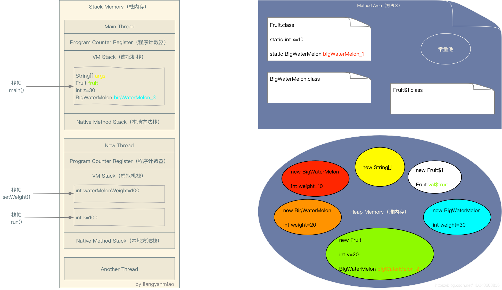
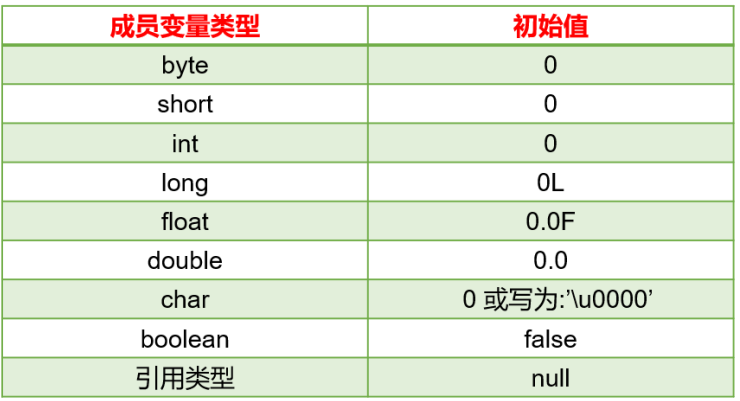
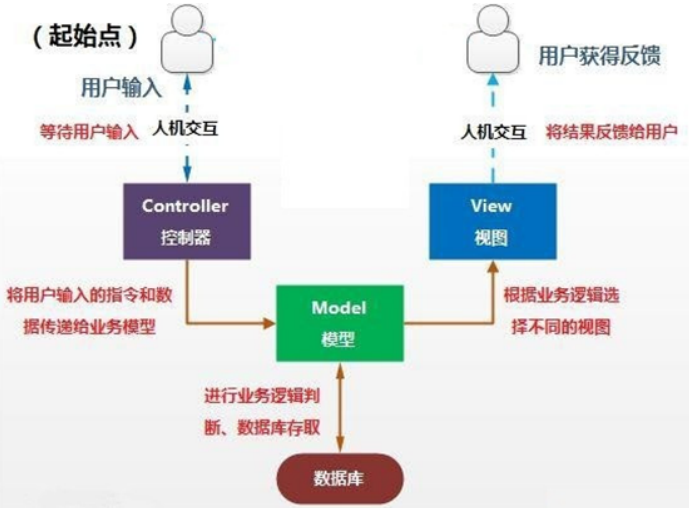

## JVM存储位置分配

### 总结

1. 凡是通过**new出来**的东西，都放在**堆**中。

   全局变量因为放在类里面，在使用的时候需要先将类对象new出来，才能使用其中的全局变量，所以`全局变量也是放在堆中的`。

2. **栈**里面放的是**局部变量**，包括创建出来的类对象，以及各种基本数据类型的变量。

3. **方法区里的常量池**存储的是**常量**以及**静态变量**

示例代码：

```java
class Fruit {
    static int x = 10;
    static BigWaterMelon bigWaterMelon_1 = new BigWaterMelon(x);

    int y = 20;
    BigWaterMelon bigWaterMelon_2 = new BigWaterMelon(y);
     
    public static void main(String[] args) {
        final Fruit fruit = new Fruit();
     
        int z = 30;
        BigWaterMelon bigWaterMelon_3 = new BigWaterMelon(z);
     
        new Thread() {
            @Override
            public void run() {
                int k = 100;
                setWeight(k);
            }
     
            void setWeight(int waterMelonWeight) {
                fruit.bigWaterMelon_2.weight = waterMelonWeight;
            }
        }.start();
    }

}

class BigWaterMelon {
    public BigWaterMelon(int weight) {
        this.weight = weight;
    }

    public int weight;

}
```

内存分配图：



同一种颜色代表变量和对象的引用关系。

由于方法区和堆内存的数据都是线程间共享的，所以线程Main Thread，New Thread和Another Thread都可以访问方法区中的静态变量以及访问这个变量所引用的对象的实例变量。

**ps：方法区存储的都是只加载一次的。**

**栈内存中每个线程都有自己的虚拟机栈、程序计数器和本地方法栈，每调用一个方法，都会在虚拟机栈中创建一个栈帧，栈帧之间的数据互不相通（局部变量）**，每一个栈帧之间的数据就是线程独有的了。

比如线程New Thread中setWeight方法是不能访问线程Main Thread中的局部变量bigWaterMelon_3，setWeight()方法也不能访问run()方法中定义的变量k。

但是我们发现setWeight却访问了同为Main Thread局部变量的“fruit”，这时为什么呢？因为"fruit"被声明为final了。

当"fruit"被声明为final后，"fruit"会作为New Thread的构造函数的一个参数传入New Thread，也就是堆内存中Fruit$1对象中的实例变量val$fruit会引用"fruit"引用的对象，从而New Thread可以访问到Main Thread的局部变量"fruit"。

> **当方法执行完毕之后，栈中的数据会被自动释放；**
>
> **堆中的数据不会自动释放，而是在某一时刻，Java虚拟机的回收机制来回收，才会被释放。**


---

## 成员变量与局部变量的区别与联系

### 不同点：

#### ①类中声明的位置不同：

属性：声明在类内，方法外的变量

局部变量：声明方法、构造器内部的变量

#### ②在内存中分配的位置不同：

属性：随着对象的创建，存储在堆空间中。

局部变量：存储在栈空间中。

#### ③生命周期：

属性：随着对象的创建而创建，随着对象的消亡而消亡。（堆空间中的数据，是在某一个时刻，被java垃圾回收机制进行回收）

局部变量：随着方法对应的栈帧入栈，局部变量会在栈中分配；随着方法对应的栈帧出栈，局部变量消亡。

#### ④作用域：

属性：在整个类的内部都是有效的

局部变量：仅限于声明此局部变量所在的方法（或构造器、代码块）中。

#### ⑤是否可以有权限修饰符进行修饰：

都有哪些权限修饰符：public、protected、缺省、private。（用于表明所修饰的结构可调用的范围大小）

属性：是可以使用权限修饰符进行修饰的。

局部变量：不能使用任何权限修饰符进行修饰的。

#### ⑥是否有默认值：

属性：都有默认初始化值

​	意味着，如果没有给属性进行显示初始化赋值，则会有默认初始化值。

局部变量：都没有默认初始化值

​	意味着，在使用局部变量之前，必须进行显式地赋值，否则报错。

#### 属性默认初始化值：



### 相同点：

* 变量声明的格式相同：数据类型 变量名 = 初始化值
* 变量必须先声明、后初始化、再使用。
* 变量都有其对应的作用域，只在其作用域内是有效的。


## 方法重载

#### 概念及特点

* **方法重载**：在同一个类中，允许存在一个以上的同名方法，只要它们的参数列表不同即可。
  * 参数列表不同，意味着参数个数或参数类型的不同。
* **重载的特点**：与修饰符、返回值类型无关，只看参数列表，且参数列表必须不同。（参数个数或参数类型）。调用时，根据方法参数列表的不同来区别。
* **重载方法调用**：JVM通过方法的参数列表，调用匹配的方法。
  * 先找个数、类型最匹配的
  * 再找个数和类型可以兼容的，如果同时多个方法可以兼容将会报错。

> :smiley:**方法的重载只与形参有关，与其他因素无关。**

举例：

```java
//返回两个整数的和
public int add(int x,int y){
	return x+y;
}

//返回三个整数的和
public int add(int x,int y,int z){
	return x+y+z;
}

//返回两个小数的和
public double add(double x,double y){
	return x+y;
}
```

以上三种方法属于重载方法

当调用add()时里面的参数是两个int类型的参数时，就会去调用第一个方法；

当没有第一个方法时，只有第二个和第三个方法，此时如果实参是两个int类型的参数时，就会去调用第三个方法，为了可以进行调用，实参的两个int类型数据会进行向上转型，当然，如果有第一个方法，则会去调用第一个，因为**重载方法调用，先找个数、类型最匹配的；再找个数类型可以兼容的**。

举例2：方法的重载和返回值类型无关

```java
public class MathTools {
	//以下方法不是重载，会报错
	public int getOneToHundred(){
		return (int)(Math.random()*100);
	}
	
	public double getOneToHundred(){
		return Math.random()*100;
	}
}
```

以上的两种方法并不是重载方法，而是会被认为同种方法，会报错。

**编译器会根据方法名以及形参列表来判断当前调用的是哪一个方法**，而不会去考虑返回值与修饰符。

---

## 可变个数的形参

使用场景：当出现方法形参的类型确定，但是形参数量不是确定的情况时，就可以使用可变个数的形参方法。

### **语法：**

```java
方法名(参数的类型名 ...参数名)
```

举例：

```java
//JDK5.0以前，采用数组形参来定义方法，传入多个同一类型变量
public static void test(int a, String[] books);

//JDK5.0及以后，采用可变个数形参来定义方法，传入多个同一类型变了
public static void test(int a, String... books);
```

### 注意点：

> 1. 可变参数方法的使用与方法参数部分使用数组是一致的，二者不能同时声明，否则报错。
>
> 2. 可变参数：方法参数部分指定类型的参数个数是可变多个：0个，1个或多个，也可以传入数组类型。
>
> 3. 数组类型参数的方法只能传入数组类型的实参，不能传入一个或多个数量的实参。
>
>    例如：

```java
public class ArgsTest{
    @Test
    public void test(){
        int[] ints = new int[]{3, 4, 6, 9, 11};
        //可变个数的形参方法可以传入数组类型
    	print(ints);
    } 
    
    public void print(int... nums){}
    
//    public void print(int[] nums){}
//	  这两个方法不构成重载方法，一起声明会报错
    
}


public class ArgsTest2{
    @Test
    public void test(){
        //报错，因为形参是数组类型的方法只能传入数组
        print(1, 4, 5, 7);
    }
    
    public void print(int[] nums){}
    
}
```

> 4. 方法的参数部分有可变形参，需要放在形参声明的最后。
>
> 5. 在一个方法的形参中，最多只能声明一个可变个数的形参。
>
> 6. 在使用可变个数的形参时，只需要将其看作是数组类型即可。
>
>    例如：

```
public void print(int... nums){
    for (int i = 0; i < nums.length; i++) {
        System.out.println(nums[i]);
    }
}
```

---

## 递归

注意：

1. 递归调用会占用大量的系统堆栈，内存耗用多，在递归调用层次多时速度要比循环`慢得多`。所以在使用递归时要慎重。
2. 在要求高性能的情况下尽量避免使用递归，递归调用既花时间又`耗内存`。考虑使用循环迭代。

在使用递归时，方法不停地调用自身，会不断地在栈内存中创建方法栈帧，会占用大量的栈内存，所以要谨慎使用递归。


## 关键字：package、import

### package（包）

package，称为包，用于指明该文件中定义的类、接口等结构所在的包。

### 语法格式

```java
package 顶层包名.子包名;
```

举例：pack1\pack2\PackageTest.java

```java
package pack1.pack2;
public class PackageTest{
}
```

#### 说明：

* 一个源文件只能有一个声明包的package语句

* package语句作为Java源文件的第一条语句出现。若缺省该语句，则指定为无名包。

* 包名，属于标识符，满足标识符命名的规则和规范（全部小写）、见名知意

  * 包通常使用所在公司域名的倒置：com.atguigu.xxx

  * > **大家取包名时不要使用"java.xx"包**

* 包对应于文件系统的目录，package语句中用"."来指明包（目录）的层次，每一次就表示一层文件目录。

* 同一个包下可以声明多个结构（类、接口），但是不能定义同名的结构（类、接口）。不同的包下可以定义同名的结构（类、接口）。

#### 包的作用

* 包可以包含类和子包，划分`项目层次`，便于管理
* 帮助`管理大型软件`系统：将功能相近的类划分到同一个包中。比如：MVC的设计模式
* 解决`类命名冲突`的问题
* 控制`访问权限`

#### 举例：MVC设计模式

MVC是一种软件构件模式，目的是为了降低程序开发中代码业务的耦合度。

MVC设计模式将整个程序分为三个层次：`视图模型层（View)，控制器层（Controller)层，与数据模型层（Model)层`。这种将程序输入输出、数据处理，以及数据的展示分离开来的设计模式使程序结构变得灵活而且清晰，同时也描述了程序各个对象间的通信方式，降低了程序的耦合性。

```tex
视图层view：显示数据，为用户提供使用界面，与用户直接进行交互。
>相关工具类：view.utils
>自定义view：view.ui

控制层controller：解析用户请求，处理业务逻辑，给予用户响应
>应用界面相关：controller.activity
>存放fragment：controller.fragment

模型层model：主要承载数据、处理数据
>数据库操作类：model.dao
>数据对象封装：model.bean/domain
>数据库：model.db
```



### import（导入）

为了使用定义在其他包中的Java类，需用import语句来显式引入指定包下所需要的类。相当于import语句告诉编译器到哪里去寻找这个类。

#### 语法格式

```java
import 包名.类名;
```

#### 应用举例

```java
import pack1.pack2.Test; 
//import pack1.pack2.*;表示引入pack1.pack2包中的所有结构

public class PackTest{
	public static void main(String args[]){
		Test t = new Test(); //Test类在pack1.pack2包中定义
		t.display();
	}
}
```

#### 注意事项

* import语句，声明在包的声明和类的声明之间。
* 如果需要导入多个类或接口，那么就并列显示多个import语句即可。
* 如果使用`a.*`导入结构，表示可以导入a包下的所有的结构。举例：可以使用java.util.*的方式，一次性导入util包下所有的类或接口。
* 如果导入的类或接口是java.lang包下的，或者是当前包下的，则可以省略此import语句。
* 如果已经导入java.a包下的类，那么如果需要使用a包的子包下的类的话，仍然需要导入。
* 如果在代码中使用不同包下的同名的类，那么就需要使用类的全类名的方式指明调用的是哪一个类。

比如：Date类有来自于java.util包下的，也有来自于java.sql包下的，如果在一个源文件中需要使用到两个包下的Date类，则一个可以使用导入的方式，一个则必须使用全类名的方式（包含包的类）：

```java
package com.cheng.javabasics;
import java.util.Date;
public class Test{
    @Test
    public void test(){
        //有两个相同类名的类来自于两个不同的包下
        //如果在一个源文件中需要同时用到两个
        //那么第一个类可以通过导包的方式直接使用（后续直接使用类名的类也是导包的类）
        //第二个类则需要使用全类名的方式使用（全类名包括类在哪一个包下）
        Date date = new Date;
        java.sql.Date date1 = new java.sql.Date(10000L);
    }
}
```


## 面向对象特征之一：封装性

随着我们系统越来越复杂，类会越来越多，那么类之间的访问边界必须把握好，面向对象的开发原则要遵循“`高内聚、低耦合`”。

> 高内聚、低耦合是软件工程中的概念，也是UNIX操作系统设计的经典原则。
>
> 内聚，指一个模块内各个元素彼此结合的紧密程度；耦合指一个软件结构内不同模块之间互联程度的度量。内聚意味着重用和独立，耦合意味着多米诺效应牵一发动全身。

* **高内聚**：类的内部数据操作细节自己完成，不允许外部干涉。
* **低耦合**：仅暴露少量的方法给外部使用，尽量方便外部调用。

### Java如何实现数据封装

* 实现封装就是控制类或成员的可见范围，这就需要依赖访问控制修饰符，也称为权限修饰符来控制。
* 权限修饰符：**public**、**protected**、**缺省**、**private**。具体访问范围如下：


* 具体修饰的结构：
  * 外部类：public、缺省
  * 成员变量、成员方法、构造器、成员内部类：public、protected、缺省、private。


### 封装性的体现：

* **场景一**：私有化（private）类的属性，提供公共（public）的get和set方法，对此属性进行获取或修改。
* **场景2**：将类中不需要对外暴露的方法，设置为private。
* **场景3**：单例模式中构造器private了，避免在类的外部创建实例。

场景一实现步骤：

①使用**`private`**修饰成员变量

```java
private 数据类型 变量名 ；
```

代码如下：

```java
public class Person {
	private String name;
	private int age;
	private boolean marry;
}
```

②提供**`getXxx`**方法/**`setXxx`**方法，可以访问成员变量，代码如下：

```java
public class Person {
	private String name;
	private int age;
	private boolean marry;
	public void setName(String n) {
		name = n;
	}
	public String getName() {
		return name;
	}
	public void setAge(int a) {
		age = a;
	}
	public int getAge() {
		return age;
	}
    public void setMarry(boolean m){
		marry = m;
	}
	public boolean isMarry(){
		return marry;
	}
}
```

**成员变量封装的好处**：

* 让使用者只能通过事先预定的方式来`访问数据`，从而可以在该方法里面加入控制逻辑，限制对成员变量的不合理访问。还可以进行数据检查，从而有利于保证对象信息的完整性。
* 便于修改，提供代码的可维护性。主要说的是隐藏的部分，在内部修改了，如果其对外可以的访问方式不变的话，外部根本感觉不到它的修改。

**注意：**

> 开发中，一般成员实例变量都习惯使用private修饰，再提供相应的public权限的get/set方法访问。
>
> 对于final的实例变量，不提供set()方法（后面final关键字的时候讲）
>
> 对于static final的成员变量，习惯上使用public修饰。


---

## 类的成员之三：构造器（Constructor）

我们new完对象时，所有成员变量都是默认值，如果我们需要赋别的值，需要挨个为他们再赋值，太麻烦。在new对象的时候，直接为当前对象的某个或所有成员变量直接赋值。

### 构造器的作用

new对象，并在new对象的时候为实例变量赋值。

### 语法格式

```java
[修饰符] class 类名{
	[修饰符] 构造器名(){
		// 实例初始化代码
	}
	[修饰符] 构造器名(参数列表){
		// 实例初始化代码
	}
}
```

说明：

1. 构造器名必须与它所在的类名必须相同。
2. 没有返回值，所以不需要返回值类型，也不需要void。
3. 构造器的修饰符只能是权限修饰符，不能被其他任何修饰。比如，不能被static、final、synchronized、abstract、native修饰，不能有return语句返回值。

代码如下：

```
public class Student {
	private String name;
	private int age;
	// 无参构造
	public Student() {}
	// 有参构造
	public Student(String n,int a) {
		name = n;
		age = a;
	}
	//get、set方法
}

```

### 使用说明

1. **当我们没有去显示地声明类中的构造器时，系统会默认提供一个无参的构造器`并且该构造器的修饰符默认与类的修饰符相同`。**例如，缺省的类会默认提供一个缺省的构造器，public的类会提供一个public的构造器。


2. 当我们显示地去定义构造器以后，系统就不会再提供一个无参的构造器了。
3. 在类中，至少存在一个构造器。
4. 构造器是可以重载的。


#### 有一个问题：

当类的权限修饰符为public时，类的构造器权限修饰符设置为缺省，此时该构造器的范围只是同一个包中，如果要使用该构造器去创建类对象，那么只能在同一个包中去创建；

但当我将类的权限修饰符设置为缺省，并将类的构造器权限修饰符设置为public，是否可以在外包中创建该类的对象呢？

这显然是不行的，当将类的权限修饰符设置成缺省，外包中的类就无法找到该类了，自然也就无法使用该类中public的构造器，例如：

```java
package org.example.javaadvance;
class ConstructorTest {
    public ConstructorTest(){}
}

package org.example.javabasics;
public class ConstructorJurisdictionTest {
    @Test
    public void test(){
        //报错，原因是类的权限是缺省，无法在外包中查找到该类
        ConstructorTest constructorTest = new ConstructorTest();
    }
}
```

> 当不去给类显示地设置构造器时，会有一个与类权限一致的空构造器。

构造器的权限修饰符也有四种，包括public、protected、缺省以及private。

构造器、方法与属性的权限修饰符只能比类的权限修饰符权限范围一样或者更小，不能比类的权限修饰符范围更大（即便更大，也不起作用）。

例如，当类的权限修饰符为缺省时，如果此时构造器的权限修饰符为protected或者public，也会因为在外包中无法查找到该类而使用不了构造器。

这点其实和方法、属性是一个道理，如果类的权限修饰符低于方法、属性，比如为缺省，那么此时方法或者属性就算是public，在外包中依旧是无法使用到类中的方法与属性的，因为直接连类都无法查询到。将构造器看作是一种方法来使用即可。

也就是说，当类的权限修饰符设置为缺省时，类中属性、方法、构造器的最高权限也就是缺省，设置为public与protected实际显现的权限也只能是缺省。


---

## 类中属性赋值过程

**1、在类的属性中，可以有哪些位置给属性赋值？**

①默认初始化

②显式初始化

③构造器中初始化

④通过“对象.属性"或者”对象.方法“的方式，给属性赋值

**2、这些位置执行的顺序是怎样？**

顺序：① - ② - ③ - ④

说明：

* 上述中的①、②、③在对象创建过程中，只执行一次。
* ④实在对象创建后执行的，可以根据需求多次执行。


---

## JavaBean

所谓的JavaBean，是指复合如下标准的Java类：

> * **类是公共的**
> * **有一个无参的公共构造器**
> * **有属性，且有对应的get、set方法**

用户可以使用JavaBean将功能、处理、值、数据库访问和其他任何可以用Java代码创造的对象进行打包，并且其他的开发者可以通过内部的JSP页面、Servlet、其他JavaBean、applet程序或者应用来使用这些对象。用户可以认为JavaBean提供了一种随时随地的复制和粘贴的功能，而不用关心任何改变。

示例：

```
public class JavaBean {
	private String name; // 属性一般定义为private
	private int age;
	public JavaBean() {
	}
	public int getAge() {
		return age;
	}
	public void setAge(int a) {
		age = a;
	}
	public String getName(){
		return name;
	}
	public void setName(String n){
		name = n;
	}
}

```


---

## UML类图

* UML（Unified Modeling Language，统一建模语言），用来描述**`软件模型`**和**`架构`**的图形化语言。
* 常用的UML工具软件有PowerDesinger、Rose和Enterprise Architect。
* 在软件开发中，使用**UML类图**可以更加直观地描述类内部结构（类的属性和操作）以及类之间的关系（如关联、依赖、聚合等）。


> * **+表示public类型，-表示private类型，#表示protected类型，空着表示缺省类型。**
> * **方法的写法：方法的类型(+、-或#)方法名(参数名：参数类型)：返回值类型**
> * **斜体表示抽象方法或者类**

