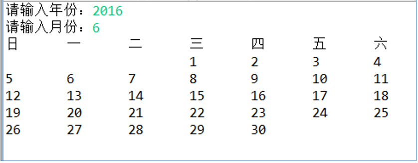

[TOC]


# 1. String类 

## 一、String类大致介绍

* `java.lang.String` 类代表字符串。Java程序中所有的字符串文字都可以看做是实现此类的实例。
* String对象的字符内容是存储在一个字符数组value[]中的，`"hello"`等效于`char[] data = {'h','e','l','l','o'};`


**jdk8中的String源码：**


**jdk8之后String的源码：**


> * 在`jdk8`中，字符串存储在`char`类型的数组中；在`jdk8`以后，字符串存储在**`byte`**类型的数组中。
>   为什么会改变？
>
>   原因是为了节省内存进行了优化。在于大多数的字符串都是拉丁字符，比如abcd这些都属于拉丁字符体系，这些拉丁字符使用数字表示范围在1~127之间，只需要一个字节的存储空间，完全可以使用占一个字节的byte来存储（byte存储大小范围在-128~127之间）。
>
>   char占用两个字节，在jdk8即之前时，String字符串使用char[]数组来存储，在大多数情况下有一半的内存空间都是未被使用的。
>
>   但若是其他语言，比如中文，对应的编码数字一定要占两个字节，这种情况该怎么办呢？
>
>   jdk8之后，新的String类将根据字符串不同的内容，有着不同的存储方式，分为ISO-8859-1（每个字符一个字节）和UTF-16（每个字符两个字节）。编码标志将指示使用哪种编码。
>
>   即当我们String存储汉字时，就是使用UTF-16编码集进行编码来存储，即：使用两个字节存储一个字符。
>
> * `String`类声明为`final`意味着`String`**不可被继承**。
> * `Serializable`接口，可序列化接口。凡是实现此接口的对象就可以通过网络或者本地进行数据的传输。
> * `Comparable`接口：凡是实现此接口的类，其对象可以进行比较大小。
> * 在JDK8之前：**`private final char value[]`**，声明为`final`类型的，意味着数组一旦初始化，其地址就不可变，即**数据创建后不可再被修改**。（无论是jdk8之前还是以后）


其实不仅仅是String是不可变的，**`包装类也是不可变的`**。Integer等包装类，一旦创建，就不可被修改了，实际上修改是创建了一个新的对象，而不是在原有对象的基础上进行修改。

例如：

```java
public class StringTest {
    public static void main(String[] args) {
        int i = 1;
        Integer j = Integer.valueOf(2);
        Circle c = new Circle();
        change(i,j,c);
        
        //这里为1很好理解，因为int属于基本数据类型，值传递而不是引用传递
        System.out.println("i = " + i);//1
        //这里为什么为2呢？明明Integer属于引用数据类型，为什么不是12？
        //原因就在于Integer具有不变性，当我们去修改Integer的值时，实际上是去创建一个新的Integer对象
        //故没有在原对象的基础上进行修改
        System.out.println("j = " + j);//2
        System.out.println("c.radius = " + c.radius);//10.0
    }

    public static void change(int a ,Integer b,Circle c ){
        a += 10;
        //等价于  b = new Integer(b+10);即不是在原对象上进行修改，而是新建了一个包装类的对象
       b += 10;
        c.radius += 10;
    }
}
class Circle{
    double radius = 0;
}
```


## 二、String的内存结构及存储方式

由于字符串对象设计成不可变的（final），所以字符串存放在字符串常量池中。

在`JDK6`及之前，字符串常量池放在`方法区`内。

从`JDK7`及以后，常量池移到`堆空间`中。

String对象创建过程内存结构案例：


由上图可知，String不同实例化的方式，存储的方式也不同：

* 当我们使用直接赋值的方式创建String对象时，**String对象保存的是常量池String对象的地址值，String对象中的value属性再指向常量池中的数组数据**。

  比如String s1 = "hello"，s1指向的是位于常量池中的"hello"。

* 当我们使用new的方式创建String对象时，**String对象保存的是堆中String对象的地址值，String对象中的属性value再指向常量池中的数组数据**。

  比如String s2 = new String("hello")，s2指向的是堆中的String对象。

> 总结：
>
> **不同实例化的方式，String对象的存储位置不同：**
>
> **`直接赋值存放在常量池中；new存放在堆中`。**

内存案例分析（注意，以下使用的是JDK6之前的内存图）：


> **`在字符串常量池中，不允许存放两个相同的字符串常量的。`**

所以，

当使用直接创建的方式创建字符串对象，当常量池中含有一样的字符串常量时，会直接将常量池中String对象的地址值赋值给该对象变量，而对象中的value属性则指向了数组的地址；

若使用new的方式创建字符串对象，当常量池中含有一样的字符串常量时，是在堆空间中重新创建了一个String对象，并将常量池中存放数据的数组地址赋值给对象中的value属性。


案例：

```
String s1 = "hello";
String s2 = "hello";
String s3 = new String("hello");

//对于引用数据类型来说，==判断的是地址值
System.out.println(s1 == s2);//true，说明二者的地址值相同
System.out.println(s1.equals(s2));//true，说明值相同

System.out.println(s1 == s3);//false，说明地址值不同
System.out.println(s1.equals(s3));//true
```

为什么s1 == s2是true，而s1 == s3为false呢？

原因就在于，使用直接赋值的方式创建的String对象，是将常量池中的地址值赋值给String对象变量；而使用new的方式创建的String对象，则是重新在堆中创建一个String对象，然后再将常量池中的数组地址值赋值给堆中String对象的value属性。

并且，由于常量池中不允许存放两个相同的常量，所以当创建的s2字符串与s1相同时，是将s1常量地址值直接赋给s2，所以s1 == s2为true。


并且由于String的不可变性，当给String对象赋一个新的值时，实际上是去常量池中创建一个新的数组，并赋值给这个对象引用。


但是**无论实例化String的方式如何，最终都会指向常量池中的value数组。**


## 三、String的特性

注意！以下的内存结构都是JDK6及之前的，JDK7及以后常量池均存放在堆空间内。

并且以下的内存均是简化情况，均未将常量池中的String对象表示出来。

### 1、对String进行修改

1. 当对字符串重新赋值时，需要重新指定一个字符串常量的位置进行赋值，不能在原有的位置修改


2. 当对现有的字符串进行拼接操作时，需要重新开辟空间保存拼接以后的字符串，不能在原有的位置修改。


3. 当调用字符串的replace()替换现有的某个字符时，需要重新开辟空间保存修改以后的字符串，不能在原有的基础上修改。


### 2、对String拼接的一些情况

#### 2.1、测试String的连接符：+

```java
String s1 = "hello";
String s2 = "world";

String s3 = "helloworld";
String s4 = "hello" + "world";
String s5 = s1 + "world";
String s6 = "hello" + s2;
String s7 = s1 + s2;

System.out.println(s3 == s4);//true
System.out.println(s3 == s5);//false
System.out.println(s3 == s6);//false
System.out.println(s3 == s7);//false
System.out.println(s5 == s6);//false
System.out.println(s5 == s7);//false
```

为什么会出现这种情况？

**原因：**

* 使用`常量 + 常量`的方式进行拼接，实际上是在字符串常量池中创建了一个新的字面量，若常量池中已有该字面量，则返回字面量的地址值。

* 若使用`常量 + 变量`或`变量 + 变量`的方式进行拼接，实际上是通过new的方式创建了一个新的对象，返回的是对象的地址值。

所以，在上述情况中，若使用"hello" + "world"的方式进行拼接，则直接将常量池中的字面量地址值返回；若使用到了变量s1或s2，则会去堆空间中创建一个新的对象，将对象的地址值返回。

我把情况改一改：将s1设置成final类型的：

```
        final String s1 = "hello";
        String s2 = "world";

        String s3 = "helloworld";
        String s5 = s1 + "world";

        System.out.println(s3 == s5);//true
```

这个时候为什么变为true了呢？

原因在于s1加了一个final，这表示s1从变量变成了常量了，那么s5就变成了常量拼接常量，s5就是直接指向了常量池中的字面量，自然也与s3相等了。


#### 2.2、concat()方法进行拼接

使用`concat()`进行拼接，不管是常量调用，还是变量调用，实际上都是`new`一个新的`String`对象出来。

案例：

```java
String s1 = "hello";
String s2 = "world";

String s3 = "helloworld";
String s4 = s1.concat("world");
String s5 = s1.concat(s2);
String s6 = "hello".concat("world");
String s7 = "hello".concat(s2);

System.out.println(s3 == s4);//false
System.out.println(s3 == s5);//false
System.out.println(s3 == s6);//false
System.out.println(s3 == s7);//false
```

#### 2.3、String的方法`intern()`

> String的`intern()`方法返回的是**字符串常量池中字面量的地址值**。

就是将常量池中该字符串数组的地址值直接返回，此方法可以用于从new对象的方式创建的String对象中获取到字面量的地址值，即使用直接赋值的方式创建String对象。

例如：

```java
String s1 = new String("hello");

String s2 = s1.intern();

//那么s2的创建就相当于String s2 = "hello";
```


## 四、String常用的构造器与方法

### 1、构造器

* **`public String()`**：初始化新建的String对象，以使其表示空字符序列。
* **`public String(String original)`**：初始化一个新创建的String对象，使其表示一个与参数相同的字符序列。
* **`public String(char[] value)`**：通过当前参数中的字符数组来构造新的String。
* **`public String(char[] value, int offset, int count)`**：通过字符数组的一部分来构造新的String。
* **`public String(byte[] bytes)`**：通过使用平台的**默认字符集**解码当前参数中的字节数组来构造新的String。
* **`public String(byte[] bytes, String charsetName)`**：通过使用指定的字符集解码当前参数中的字节数组来构造新的String。

举例：

```java
//字面量定义方式：字符串常量对象
String str = "hello";

//构造器定义方式：无参构造
String str1 = new String();

//构造器定义方式：创建"hello"字符串常量的副本
String str2 = new String("hello");

//构造器定义方式：通过字符数组构造
char chars[] = {'a', 'b', 'c','d','e'};     
String str3 = new String(chars);
String str4 = new String(chars,0,3);

//构造器定义方式：通过字节数组构造
byte bytes[] = {97, 98, 99 };     
String str5 = new String(bytes);
String str6 = new String(bytes,"GBK");
```

### 2、方法

#### 2.1、常用方法

* **`boolean isEmpty()`**：判断当前字符串是否为空。
* **`int length()`**：返回当前字符串的长度。
* **`String concat(String s)`**：返回拼接后的字符串。这里是去使用new的方式新建了一个字符串返回的。
* **`boolean equals(Object obj)`**：比较字符串是否相等，区分大小写。
* **`boolean equalsIgnoreCase(Object obj)`**：比较两个字符串是否相等，不区分大小写。
* **`int compareTo(String other)`**：比较字符串的大小，区分大小写，按照其Unicode编码值比较大小。
* **`int compareToIgnoreCase(String other)`**：比较字符串的大小，不区分大小写。
* **`String toLowerCase()`**：将字符串转换成小写。
* **`String toUpperCase()`**：将字符串转换成大写。
* **`String trim()`**：去掉字符串前后空白符。
* **`String intern()`**：将字符串的在常量池中的字面量地址值返回，即返回的String对象与使用直接赋值的方式创建的String对象指向方式一致。

#### 2.2、与查找有关的方法

* **`boolean contains(String s)`**：是否包含xxx。
* **`int indexOf(String str)`**：在从前往后查找字符串str，即如果有返回第一次出现的下标（从0开始），要是没有返回-1。
* **`int indexOf(String str, int fromIndex)`**：返回指定子字符串在此字符串中第一次出现处的索引，从指定的索引开始。
* **`int lastIndexOf(String str)`**：在当前字符串中从后往前查找str字符串，如果有则返回第一次查找到的位置下标（相对于全局字符串而言），如果没有返回-1。
* **`int lastIndexOf(String str, int fromIndex)`**：在当前字符串中从指定位置开始从后往前查找str字符串，如果有则返回第一次查找到的位置下标，如果没有返回-1。

案例：

```java
//contains()，是否包含
String s1 = "helloworldhelloworldhelloworld";
System.out.println(s1.contains("elo"));//false

//索引从0开始
System.out.println(s1.indexOf("e"));//1
//从指定索引开始检索，返回的值是该字符串位于全局字符串的索引
System.out.println(s1.indexOf("e", 5));//11

//从指定的索引从后往前反向搜索
System.out.println(s1.lastIndexOf("e"));//21
//从指定的索引从后往前反向搜索，返回指定字符串第一次出现处的索引，注意是相对于全部字符串从左至右的索引值
System.out.println(s1.lastIndexOf("e",19));//11
```

#### 2.3、与截取有关的方法

* **`String substring(int beginIndex)`**：返回一个新的字符串，它是此字符串的从beginIndex开始（包括beginIndex位置的字符）截取到最后一个子字符串。
* **`String substring(int beginIndex, int endIndex)`**：返回一个新的字符串，它是此字符串从beginIndex开始截取到endIndex索引位置（包括beginIndex，不包括endIndex）的一个子字符串。

案例：

```java
String s1 = "helloworldhelloworldhelloworld";
//截取后的字符串包含beginIndex索引位置的字符
System.out.println(s1.substring(17));//rldhelloworld

//从beginIndex开始截取到endIndex（不包含endIndex位置的字符）
//相当于是beginIndex截取到endIndex-1.
System.out.println(s1.substring(6, 11));//orldh
```

在Java中，凡是涉及到一个区间的，全是**左闭右开**区间，即包含左边，但不包含右边。比如Math.random()随机数，其区间就是[0, 1)区间，左闭右开区间。

#### 2.4、与char字符有关的方法

* **`char charAt(index)`**：返回index索引位置的字符。
* **`char[] toCharArray()`**：将此字符串转换为一个新的字符数组返回。
* **`static String valueOf(char[] data)`**：将char数组转换成String字符串，底层使用的是new的方式创建字符串。
* **`static String valueOf(char[] data, int offset, int count)`**：将data数组转换成字符串，从索引offset开始，使用count数目的字符进行创建。（注意这里并不是endIndex，而是count，表示数目）
* **`static String copyValueOf(char[] data)`**：与valueOf()类似。
* **`static String copyValueOf(char[] data, int offset, int count)`**：与valueOf()类似。

案例：

```java
char[] chars = new char[]{'1', '2','3','4','5','6','7','8','9','a','b','c','d'};
String s1 = String.valueOf(chars);
String s2 = String.valueOf(chars, 3, 9);
String s3 = String.copyValueOf(chars);
String s4 = String.copyValueOf(chars, 3, 9);

System.out.println(s1);//123456789abcd
System.out.println(s2);//456789abc
System.out.println(s3);//123456789abcd
System.out.println(s4);//456789abc

System.out.println(s1 == s2);//false
System.out.println(s3 == s4);//false
System.out.println(s1.equals(s2));//false
System.out.println(s3.equals(s4));//false

System.out.println(s1.charAt(6));//7
```

#### 2.5、与开头、结尾有关的方法

* **`boolean startsWith(String prefix)`**：测试此字符串是否以指定的前缀开始。
* **`boolean startsWith(String prefix, int toffset)`**：测试此字符串从指定索引开始的子字符串是否以指定前缀开始。
* **`boolean endsWith(String suffix)`**：测试此字符串是否以指定的后缀结束。

#### 2.6、与替换有关的方法

* **`String replace(char oldChar, char newChar)`**：返回一个新的字符串，它是通过用newChar替换此字符串中出现的所有oldChar得到的。
* **`String replace(CharSequence target, charSequence replacement)`**：使用指定的字面量替换序列replacement替换此字符串中所有匹配字面值目标序列target的子字符串。
* **`String replaceAll(String regex, String replacement)`**：使用给定的replacement替换此字符串所有匹配给定的正则表达式regex的子字符串。
* **`String replaceFirst(String regex, String replacement)`**：使用给定的replacement替换此字符串匹配给定的正则表达式regex的第一个子字符串。

### 3、String与其他结构之间的转换

#### 3.1、基本数据类型/包装类与String之间的转换

由于基本数据类型与对应的包装类之间使用自动装箱/拆箱的方式可以轻易的相互转换，所以我们一般将这两种类型在使用时看成一种。


**基本数据类型、包装类 → String：**

调用String类中的**`valueOf()`**方法可以将基本数据类型/包装类转换成String字符串。


**String → 基本数据类型、包装类：**

使用**`parseXxx(String s)`**可以将数字字符组成的字符串转换为基本数据类型/包装类。

#### 3.2、char数组与字符串之间的转换

**char数组 → 字符串 **：

使用String类的构造器：

**`String(char[] value)`** 

或

 **`String(char[] value, int offset, int length)`**

用char数组中的全部或部分字符创建字符串对象。


**字符串 → char数组**：

使用String类中的`toCharArray()`方法：

**`public char[] toCharArray()`**：将字符串中的全部字符转换成char[]类型的数组。

#### 3.3、byte数组与字符串之间的转换

byte数组与字符串之间的转换，实际上就是编码与解码的过程，byte数组转换成字符串是解码，字符串转换成byte数组是编码。

**字符串 → byte数组**（编码）：

* **`public byte[] getBytes()`**：使用平台的默认字符集将此字符串编码为byte序列，并将结果存储到一个新的byte数组中。
* **`public byte[] getBytes(String charsetName)`**：使用指定的字符集将此String编码到byte序列，并将结果存储到新的byte数组中。


**byte数组 → 字符串**（解码）：

* **`public String(byte[] bytes)`**：使用平台默认的字符集解码指定的byte数组，构建一个新的String。
* **`public String(byte[] bytes, String charsetName)`**：使用指定的字符集解码指定的byte数组。


# 2. StringBuffer与StringBuilder

因为String对象是不可变对象，虽然可以共享常量对象，但是对于频繁字符串的修改和拼接操作，效率极低，空间消耗也比较高。因此，JDK又在java.lang包提供了可变字符序列StringBuffer和StringBuilder类型。

> **`StringBuffer`和`StringBuilder`是可变的字符序列。**


StringBuffer与StringBuilder在使用上没什么区别，仅仅在于一个是线程安全，效率低；一个是线程不安全，效率高。

## StringBuffer、StringBuilder和String比较

> * `String`是**不可变的字符序列**，底层使用char[]（jdk8及之前），底层使用byte[]（jdk9及之后）
> * `StringBuffer`是**可变的字符序列**，jdk1.0声明，**线程安全**（使用synchronized实现）的，**效率较低**，底层使用char[]（jdk8及之前），底层使用byte[]（jdk9及之后）
> * `StringBuilder`是**可变的字符序列**，jdk5.0时声明，**线程不安全**，当进行增删改操作的时候**效率较高**，，底层使用char[]（jdk8及之前），底层使用byte[]（jdk9及之后）

虽然StringBuffer的效率较低，但是是相对于StringBuilder而言的，对于String来说，其增删改的操作还是比String速度更快的，因为其是可变的字符序列，在增删改时不会去新创建对象。

String、StringBuffer和StringBuilder底层实现，在jdk8之前都是使用char[]数组，jdk9之后都是使用byte[]数组。


## 源码分析（JDK8）

**内部属性**

```java
char[] value; //存储的字符

int count; //记录的是char[]数组实际存储的字符个数
```

这两个属性，也就保证了StringBuffer与StringBuilder是可变的。

在String中，每次去增加字符或删除字符时，都会去创建一个新的数组，这也就是String不可变的原因。

但是对于StringBuffer与StringBuilder而言，每次增删操作不一定会去重新创建数组。

这是因为value数组中不一定能够全部存满，由于count的存在，记录下了value实际存储的字符数量。

**当我们创建一个StringBuffer或StringBuilder对象时：**

> 若参数为空参，则会默认创建一个长度为`16`的value数组；若有参数，则会创建一个在`字符串参数的长度基础上加16`的value数组。

比如：

```java
StringBuffer str1 = new StringBuffer();//char[] value = new char[16];

StringBuffer str2 = new StringBuffer("abc");//char[] value = new char[16 + "abc".length()];
```


**StringBuffer与StringBuilder添加、删除数据时的操作：**

> 当往里面进行增删操作的时候，若value数组的长度大于count时，说明数组中还有“空位”，这个时候拼接字符时不会对数组进行扩容操作，直接往里添加即可，count++，不需要重新创建数组；char[]数组进行删除时，只需要将数据删除，count--，不需要重新new一个数组。
>
> 只有当添加进去的数据超出了value数组的长度时，才会对数字进行扩容，这时才会去创建一个新的数组。


当需要添加的字符串超出数组长度时，就会进行扩容

**扩容的操作**：


> 由上述源码可知，**默认扩容情况**是**`原数组长度 * 2 + 2`**，并将原有value数组中的元素复制到新的数组中。
>
> 当给当前数字长度 * 2 + 2之后，所需的数组长度仍然大于需要扩容的长度时，那么会直**接设置扩容后的长度为所需的数组长度**。


**源码启示：**

1. 如果开发中需要频繁的针对于字符串进行增、删、改等操作，建议使用StringBuffer或StringBuilder替换String，因为使用String效率低。
2. 如果开发中，不涉及到线程安全问题，建议使用StringBuilder替换StringBuffer。因为StringBuilder效率高。
3. 如果开发中大体确定操作的字符个数，建议使用int capacity参数的构造器，设定一个初始的数组的长度，避免进行多次扩容操作导致效率降低。


## 常用方法

StringBuilder、StringBuffer的API是完全一致的，并且很多方法与String相同。

* **`StringBuffer append(xx)`**:提供了很多的append()方法，用于进行字符串追加的方式拼接。
* **`StringBuffer delete(int start, int end)`**：删除[start, end)之间的字符
* **`StringBuffer deleteCharAt(int index)`**：删除[index]位置字符。
* **`StringBuffer replace(int start, int end, String str)`**：替换[start, end)范围的字符序列为str。
* **`void setCharAt(int index, char c)`**：替换[index]位置的字符
* **`char charAt(int index)`**：查找指定index位置上的字符
* **`StringBuffer insert(int index, xxx)`**：在[index]位置上插入xxx。
* **`int length()`**：返回存储的字符数据的长度。
* **`StringBuffer reverse()`**：反转

注意：这里的length()方法返回的是StringBuffer或StringBuilder中实际的字符串长度，即count，而不是char[]数组的长度，因为char[]数组中会存在“空位”。

## 不常用方法

* **`int indexOf(String str)`**：在当前字符序列中查询str的第一次出现下标
* **`int indexOf(String str, int fromIndex)`**：在当前字符序列[fromIndex, 最后]中查询str的第一次出现下标
* **`int lastIndexOf(String str)`**：在当前字符序列中查询str的最后一次出现下标。
* **`int lastIndexOf(String str, int fromIndex)`**：在当前字符序列[fromIndex, 最后]中查询str的最后一次出现下标。
* **`String substring(int start)`**：截取当前字符序列[start, 最后]。
* **`String substring(int start, int end)`**：截取当前字符序列[start, end)。
* **`String toString()`**：返回此序列中数据的字符串表示形式
* **`void setLength(int newLength)`**：设置当前字符序列长度为newLength。

setLength()方法设置的是StringBuffer/StringBuilder中字符串的实际长度，若设置的长度大于字符串的实际长度，则使用byte为0的字符填充；若设置的长度小于字符串的实际长度，则从前往后截取指定的长度。

案例：

```java
StringBuilder str = new StringBuilder("abc");

str.setLength(4);
for (char c : str.toString().toCharArray()) {
    byte b = (byte) c;
    System.out.println(b);
}

System.out.println("************");
str.setLength(1);
System.out.println(str);
```

输出结果：


# 3. 与时间日期有关的API
## JDK8之前的（未改良）

### java.lang.System

* **`public static long currentTimeMillis()`**：用来返回当前时间与`1970年1月1日0时0分0秒`之间以毫秒为单位的时间差。

> **该方法常用来计算时间差。**

计算世界时间的主要标准有：

* UTC(Coordinated Universal Time)
* GMT(Greenwich Mean Time)
* CST(Central Standard Time)

> 在国际无线电通信场合，为了统一起见，使用一个统一的时间，称为通用协调时（UTC，Universal Time Coordinated）。UTC与格林尼治平均时（GMT）一样，都与英国伦敦的本地时相同。这里UTC与GMT含义相同。


### java.util.Date

> 该类表示特定的瞬间，精确到毫秒；通常用它来获取当前时间或构造时间。

* **构造器**：
  * **`Date()`**：使用无参构造器创建的对象表示获取本地当前的时间。
  * **`Date(long 毫秒数)`**：把毫秒值换算成日期时间对象。
* **常用方法**：
  * **`getTime()`**：返回自1970年1月1日 00:00:00 GMT以来，到此Date对象所代表的时间差，返回的是毫秒数。
  * **`toString()`**：该方法会将Date对象转换成以下形式的字符串：`dow mon dd hh:mm:ss zzz yyy`。其中：dow表示的是星期几（Sun, Mon, Tue, Wed, Thu, Fri, Sat），zzz表示的是时间的标准。

案例：

```java
//创建一个基于当前系统时间的Date实例
Date date1 = new Date();

//创建一个制定时间戳的Date实例
Date date2 = new Date(1503066032874L);

//getTime()用于返回date表示的时间距离1970.1.1 00:00:00的时间差
System.out.println(date1.getTime());//1703066099457
System.out.println(date2.getTime());//1503066032874

//将Date转换成 dow mon dd hh:mm:ss zzz yyy形式的字符串
System.out.println(date1);//Wed Dec 20 17:54:59 HKT 2023
System.out.println(date2);//Fri Aug 18 22:20:32 HKT 2017
```


### java.sql.Date

> java.sql.Date主要针对**SQL语句**使用，它输出时`只包含日期而没有时间部分`。

`java.sql.Date`是`java.util.Date`的子类，所以java.sql.Date中继承了来自于java.util.Date中的方法。

主要了解一下它与java.util.Date之间的区别：

**构造器**：

java.sql.Date中只拥有一个未过时的构造器：

* **`Date(long date)`**：使用给定毫秒时间值构造一个Date对象。

即java.sql.Date类对象只能通过给定毫秒值来创建，而不能像java.util.Date那样可以去创建当前时间的date对象。

**方法：**

java.sql.Date类与java.util.Date类在方法区别在于，toString()方法的不同。

* **`toString()`**：将date对象转换成`yyyy-mm-dd`形式的字符串输出。

sql下的Date类中的toString()方法，会将创建出来的date对象转换成yyyy-mm-dd形式，例如2023-12-20，虽然输出的样式只包含年月日，但是date对象实际是包含精确时间的，只不过toString()时不会输出罢了。

案例：

```java
java.sql.Date date = new java.sql.Date(1703066099457L);

System.out.println(date);//2023-12-20
System.out.println(date.getTime());//1703066099457
```


#### 两个Date之间的区别与相互转换

在java环境中使用的Date时间类通常是java.util.Date，而数据库中声明变量类型为Date时，对应的是java.sql.Date。

> **当在java代码中获取到`java.util.Date`时间对象后，需要转换为`java.sql.Date`类才可以放入数据库中。**


**utile.Date与sql.Date之间的相互转换**

```java
Date utilDate = new Date();//util.Date

//util.Date转sql.Date
java.sql.Date sqlDate = new java.sql.Date(utilDate.getTime());

//sql.Date转util.Date
utilDate = new Date(sqlDate.getTime());
```

两个Date都包含着使用时间戳创建对象的构造器，均可使用两个类的getTime()方法获取时间戳，从而转换成另一个对象。

### java.text.SimpleDateFormat

> `java.text.SimpleDateFormat`类是一个不与语言环境有关的方式来**格式化**和**解析**日期的类。
>
> **格式化**：日期 → 文本
>
> **解析**：文本 → 日期
>
> 
>
> 该类的作用就在于制定日期类型的格式，将Date类型转换成指定格式的字符串，或将日期类型的字符串转换成Date类型。


* **构造器**：
  * **`SimpleDateFormat()`**：使用默认的日期格式创建SimpleDateFormat对象。
  * **`SimpleDateFormat(String pattern)`**：使用程序员指定的日期格式类型创建SimpleDateFormat对象。

* **方法**：
  * **格式化方法**：
    * **`public String format(Date date)`**：将Date类型转换成SimpleDateFormat对象指定格式的字符串类型。
  * **解析方法**：
    * **`public Date parse(String source) throws ParseException`**：将字符串转换成Date类型，注意，要求**字符串必须与SimpleDateFormat对象规定的格式一致，否则报ParseException解析异常**。

在日期时间类中，可以使用字母来表示所要显示的时间，从而设置指定格式：


使用案例：

```java
//使用默认的模式和语言环境创建对象，这个时候的格式是默认的
Date date = new Date();
SimpleDateFormat s1 = new SimpleDateFormat();
System.out.println(s1.format(date));

//创建指定格式的SimpleDateFormat对象
SimpleDateFormat s2 = new SimpleDateFormat("yyyy-MM-dd E z kk:mm:ss");
System.out.println(s2.format(date));

Date date2;
try {
    //将指定格式的字符串转换成Date类型
    date2 = s1.parse("2023/11/05 下午3:12");
} catch (ParseException e) {
    throw new RuntimeException(e);
}
System.out.println(date2);

try {
    //此时就会报异常了，因为字符串时间格式不符合SimpleDateFormat设置的格式
    date2 = s1.parse("23-11-05 下午03:12");
} catch (ParseException e) {
    throw new RuntimeException(e);
}
System.out.println(date2);
```

输出结果：


由上述结果可知，**SimpleDateFormat默认的时间格式为：**

```java
yyyy/MM/dd ah:mm
```

如：

```
2023/12/20 下午6:50
```


### java.util.Calendar（日历）

> Date类的API大部分被废弃了，替换为Calendar。
>
> `Calendar`类是Java用于处理日期和时间的**`抽象类`**，它提供了一种独立于特定日历系统的方式来处理日期和时间。通过Calendar类，你可以执行许多常见的日期和时间操作，如计算日期差异、添加或减去时间单位等。
>
> **Calendar可以随意地对日期时间进行添加、减去操作，能够得到我们想要的具体的时间。**

由于Calendar是一个抽象类，所以我们无法获取Calendar的对象，只能去创建Calendar的子类对象。可以通过静态方法getInstance()去获取；由于Calendar只有一个子类：java.util.GregorianCalendar，也可以通过new子类的方式直接创建。

**获取Calendar实例的方法**：

* **`public static Calendar getInstance()`**方法（推荐）

  不带参数的getInstance()是获取当前时区的当前时间。


* new GregorianCalendar()(不推荐)

无论通过哪一种方式创建的Calendar对象，均是子类GregorianCalendar的对象。


**Calendar常用的方法：**

一个Calendar的实例是系统时间的抽象表示，可以修改成获取YEAR、MONTH、DAY_OF_WEEK、HOUR_OF_DAY、MINUTE、SECOND等`日历字段`对应的时间值。

在下面方法中，field表示的就是Calendar中的常量，如DAY_OF_WEEK，用这些常量来表示参数的含义。

* **`public int get(int field)`**：返回给定日历字段的值。
* **`public void set(int field, int value)`**：将给定的日历字段设置为指定的值。
* **`public void add(int field, int amount)`**：根据日历的规则，为给定的日历字段添加或者减去制定的时间量。
* **`public final Date getTime()`**：将Calendar对象转换成Date对象。
* **`public final void setTime(Date date)`**：使用指定的Date对象修改Calendar对象的日期时间。

**field常用的类型：**


注意：

* 获取月份时：一月是0，二月是1，以此类推，12月是11。
* 获取星期时：周日是1，周一是2，以此类推，周六是7。

案例：

```java
Calendar calendar = Calendar.getInstance();
System.out.println(calendar.getClass());
//GregorianCalendar calendar = new GregorianCalendar();

//get()方法
System.out.println(calendar.get(Calendar.DAY_OF_WEEK));//4
System.out.println(calendar.get(Calendar.DAY_OF_MONTH));//20

//set()方法
calendar.set(Calendar.DAY_OF_MONTH, 23);
System.out.println(calendar.get(Calendar.DAY_OF_MONTH));//23


//add(int field, xx)
calendar.add(Calendar.DAY_OF_MONTH, 3);
System.out.println(calendar.get(Calendar.DAY_OF_MONTH));//26
calendar.add(Calendar.DAY_OF_MONTH, -5);
System.out.println(calendar.get(Calendar.DAY_OF_MONTH));//21

//getTime()方法获取Date类对象
// Calendar -> Date
Date date = calendar.getTime();
System.out.println(date);//Thu Dec 21 21:30:29 HKT 2023
System.out.println(date.getTime());//1703165429105

//setTime()：将calendar设置成指定date时间的日历对象
Date date1 = new Date(1303162293363L);
calendar.setTime(date1);
```

> **注意：**
>
> 一般使用Calendar搭配SimpleDateFormat一起使用，使用Calendar设置与修改时间，使用SimpleDateFormat获取我们想要的日期格式；也可以使用SimpleDateFormat去创建一个指定的时间，然后再配合Date类与Calendar一起进行操作。

### 以上几种类的使用案例

输入年份和月份，输出该月日历。

闰年计算公式：年份可以被4整除但不能被100整除，或者可以被400整除。



```java
@Test
public void test7(){
    //创建一个Scanner对象，用于获取用户输入
    Scanner scanner = new Scanner(System.in);
    //提示用户输入年份
    System.out.print("请输入年份：");
    int year = scanner.nextInt();
    int month;
    //循环获取用户输入的月份
    while (true){
        System.out.printf("请输入月份：");
        month = scanner.nextInt();
        //判断用户输入的月份是否在1到12之间
        if (month < 0 || month > 12){
            System.out.println("信息有误，请重新输入！");
        }else {
            break;
        }
    }

    //判断当前月是否是2月，是2月要考虑是否是闰年
    //计算出那个月的1号是星期几
    //先获取到Date类型，再转换成Calendar类型，因为Calendar类型无法设置指定的时间
    SimpleDateFormat sdf = new SimpleDateFormat("yyyy-MM-dd");
    Date date;
    try {
        date = sdf.parse(year + "-" + month + "-" + "01");
    } catch (ParseException e) {
        scanner.close();
        throw new RuntimeException(e);
    }
    Calendar calendar = Calendar.getInstance();
    calendar.setTime(date);
    int dayOfWeek = calendar.get(Calendar.DAY_OF_WEEK);
    System.out.println();
    System.out.println("日   一  二  三  四  五  六");
    int columnCount = 0;
    //每个月的天数
    int numberOfDaysInMonth;
    //打印出当前月份的1号是星期几
    for (int i = 1; i < dayOfWeek; i++) {
        System.out.print("  ");
        columnCount++;
    }

    //根据月份判断当前月份的天数
    if (month == 1 || month == 3 || month == 5 || month == 7 || month == 8 || month == 10 || month == 12){
        numberOfDaysInMonth = 31;
    }else if (month == 2){
        //计算当前年是否为闰年
        if ((year % 4 == 0 && year % 100 != 0) || year % 400 == 0){
            numberOfDaysInMonth = 29;
        }else {
            numberOfDaysInMonth = 28;
        }
    }else {
        numberOfDaysInMonth = 30;
    }
    //打印出当前月份的天数
    for (int i = 1; i <= numberOfDaysInMonth; i++) {
        System.out.print(i + "  ");
        columnCount++;
        //每7个元素换行
        if (columnCount == 7){
            columnCount = 0;
            System.out.println();
        }
    }
```


## JDK8之后的（改良后）

如果我们可以跟别人说：“我们在183434923423见面”那么再简单不过了。但是我们希望时间与昼夜与四季有关，于是事情就变复杂了。JDK1.0中包含了一个java.util.Date类，但是它的大多数方法已经在JDK1.1中引入Calendar类之后被弃用了。而Calendar并不比Date好多少。它们面临的问题是：

* **可变性**：像日期和时间这样的类应该是类似于String类型，具有不可变性的，我们去修改时间后，实际上获得的应当是新创建的时间、日期，原有的时间日期应当不变才合理。
* **偏移性**：Date中的年份是从1900开始的，而月份都从0开始，例如当我们使用new Date(yyyy, MM, dd)的方式创建Date对象，实际的年份是1900 + yyyy，实际的月份是MM - 1具有偏移性。
* **格式化**：格式化只对Date有用，Calendar则不行，之前学习的SimpleDateFormat类只能对Date类型进行格式化，由于Date类的很多方法都被Calendar类替换了，当我们使用时会多了许多步骤去转变日期类型。
* 此外，它们也不是线程安全的；不能处理闰秒等。

> 闰秒，是指为保持协调世界时接近于世界时时刻，由国际计量局统一规定在年底或年中（也可能在季末）对协调世界时增加或减少1秒的调整。由于地球自转的不均匀性和长期变慢性（主要由潮汐摩擦引起的），会使世界时（民用时）和原子时之间相差超过到±0.9秒时，就把协调世界时向前拨1秒（负闰秒，最后一分钟为59秒）或向后拨1秒（正闰秒，最后一分钟为61秒）； 闰秒一般加在公历年末或公历六月末。
>
> 目前，全球已经进行了27次闰秒，均为正闰秒。

总之，对日期和时间的操作一直是Java程序员最痛苦的地方之一。

第三此引入的API是成功的，并且Java8中引入的java.time API已经纠正了过去的缺陷，将来很长一段时间内它都会为我们服务。


### 本地日期时间：LocalDate、LocalTime、LocalDateTime(用于代替Calendar类)

看名字，我们就大致可以了解到：

> 当我们**只使用日期**时，就可以使用`LocalDate`类
>
> 当我们**只使用时间**时，就可以使用`LocalTime`类
>
> 当我们**既使用日期也使用时间**，那么就使用`LocalDateTime`类

当包含时间但是却使用LocalDate类时，就会报错。

同理，当包含日期却使用LocalTime时，就会报错。

即：

* 只有日期时，才可以使用LocalDate；

* 只有时间时，才可以使用LocalTime；

* 否则都使用LocalDateTime。

|                             方法                             | **描述**                                                     |
| :----------------------------------------------------------: | ------------------------------------------------------------ |
|                **`now() `**/ now(ZoneId zone)                | 静态方法，根据当前时间创建对象/指定时区的对象                |
|                   `of(xx,xx,xx,xx,xx,xxx)`                   | 静态方法，根据指定日期/时间创建对象                          |
|            **`from(TemporalAccessor temporal)`**             | 静态方法。DateTimeFormatter类的parse()方法可以将字符串类型转换成TemporalAccessor类型，使用日期时间类的from()方法可以将该类型转换成日期时间类型。TemporalAccessor接口是日期时间类型的父接口。 |
|                getDayOfMonth()/getDayOfYear()                | 获得月份天数(1-31) /获得年份天数(1-366)                      |
|                        getDayOfWeek()                        | 获得星期几(返回一个 DayOfWeek 枚举值)                        |
|                          getMonth()                          | 获得月份, 返回一个 Month 枚举值                              |
|                 getMonthValue() / getYear()                  | 获得月份(1-12) /获得年份                                     |
|              getHours()/getMinute()/getSecond()              | 获得当前对象对应的小时、分钟、秒                             |
|   withDayOfMonth()/withDayOfYear() /withMonth()/withYear()   | 将月份天数、年份天数、月份、年份修改为指定的值并返回新的对象 |
|                  with(TemporalAdjuster  t)                   | 将当前日期时间设置为校对器指定的日期时间                     |
| plusDays(), plusWeeks(), plusMonths(), plusYears(),plusHours() | 向当前对象添加几天、几周、几个月、几年、几小时               |
| minusMonths() / minusWeeks() /minusDays()/minusYears()/minusHours() | 从当前对象减去几月、几周、几天、几年、几小时                 |
|        plus(TemporalAmount t)/minus(TemporalAmount t)        | 添加或减少一个 Duration 或 Period                            |
|                     isBefore()/isAfter()                     | 比较两个 LocalDate                                           |
|                      **`isLeapYear()`**                      | 判断是否是闰年（在LocalDate类中声明）                        |
|              **`format(DateTimeFormatter  t)`**              | 格式化本地日期、时间，返回一个字符串                         |
|                  `parse(Charsequence text)`                  | 将指定格式的字符串解析为日期、时间                           |

案例：

```java
LocalDate ld1 = LocalDate.now();
LocalTime lt1 = LocalTime.now();
LocalDateTime ldt1 = LocalDateTime.now();
System.out.println(ld1);//2023-12-20
System.out.println(lt1);//22:55:44.724570800
System.out.println(ldt1);//2023-12-20T22:55:44.724570800

LocalDate ld2 = LocalDate.of(2023, 12, 20);
System.out.println(ld2);//2023-12-20
LocalTime lt2 = LocalTime.of(14, 35, 12);
System.out.println(lt2);//14:35:12

System.out.println(ld1.getDayOfMonth());
//这里就体现了不可变性
LocalDateTime ldt3 = ldt1.withDayOfMonth(30);
System.out.println(ldt3);//2023-12-30T22:53:45.135047600

//加上5日
LocalDate ld3 = ld1.plusDays(5);
System.out.println(ld3);//2023-12-25
```

### 瞬时：Instant(用来代替Date类与System类)

**时间戳作用是可以用来保证名称的唯一性。**

Instant：时间线上的一个瞬时点。这可能被用来记录应用程序中的事件时间戳。

* 时间戳是指格林威治时间1970年01月01日00时00分00秒(北京时间1970年01月01日08时00分00秒)起至现在的总秒数。

`java.time.Instant`表示时间线上的一点，而不需要任何上下文信息，例如，时区。概念上讲，`它只是简单的表示自1970年1月1日0时0分0秒（UTC）开始的秒数。`

| **方法**                        | **描述**                                                     |
| ------------------------------- | ------------------------------------------------------------ |
| `now()`                         | 静态方法，返回默认**UTC时区**的Instant类的对象               |
| `ofEpochMilli(long epochMilli)` | 静态方法，返回在1970-01-01 00:00:00基础上加上指定毫秒数之后的Instant类的对象 |
| `atOffset(ZoneOffset offset)`   | 结合即时的偏移来创建一个 OffsetDateTime对象，该对象可以转换成其他类型的时间类。 |
| `toEpochMilli()`                | 返回1970-01-01 00:00:00到当前时间的毫秒数，即为时间戳        |

注意：

使用`Instant.now()`方法获取到的是当前时间**UTC时区**的Instant对象。

若想要获取中国时间的Instant对象，需要使用instant对象中的`atOffset(ZoneOffset offset)`方法去创建`UTC+8`时区的时间对象。

案例：

```java
Instant instant1 = Instant.now();
System.out.println(instant1);//2023-12-20T15:14:55.795734800Z
System.out.println(instant1.toEpochMilli());//1703085295795

//转换成UTC+8时区
OffsetDateTime odt = instant1.atOffset(ZoneOffset.ofHours(8));

//将OffsetDateTime类对象转换成LocalDateTime对象
LocalDateTime localDateTime = odt.toLocalDateTime();
System.out.println(localDateTime);//2023-12-20T23:14:55.795734800
```

> 中国大陆、中国香港、中国澳门、中国台湾、蒙古国、新加坡、马来西亚、菲律宾、西澳大利亚州的时间与UTC的时差均为+8，也就是UTC+8。
>
> **`instant.atOffset(ZoneOffset.ofHours(8));`**


### 日期时间格式化：DateTimeFormatter（用来代替SimpleDateFormat）

> 既然DateTimeFormatter是用来代替SimpleDateFormat的，那么该类肯定是用来对LocalDate、LocalTime以及LocalDateTime实现格式化和解析的。
>

**该类提供了三种格式化方法：**

* 1、（了解）**预定义的标准格式**。如：`ISO_LOCAL_DATE_TIME`、`ISO_LOCAL_DATE`、`ISO_LOCAL_TIME`。这些预定义的标准格式，基本上就是LocalDate类自带的格式。

  注意：ISO_LOCAL_DATE_TIME仅能用于LocalDateTime的对象进行格式化；同理ISO_LOCAL_DATE创建的DateTimeFormatter仅能用于LocalDate对象；ISO_LOCAL_TIME仅能用于LocalTime对象。

使用案例：

```java
DateTimeFormatter dtf = DateTimeFormatter.ISO_DATE_TIME;
LocalDateTime ldt = LocalDateTime.now();
System.out.println(ldt);//2023-12-21T10:09:34.659716100

//使用预定义的格式进行格式化
String format = dtf.format(ldt);
System.out.println(format);//2023-12-21T10:09:34.6597161
```

* 2、（了解）**本地化相关格式**。如：ofLocalizedDateTime(FormatStyle.LONG)

  ```java
  本地化相关的格式。如：ofLocalizedDateTime()
  FormatStyle.MEDIUM / FormatStyle.SHORT :适用于LocalDateTime
  				
  本地化相关的格式。如：ofLocalizedDate()
  FormatStyle.FULL / FormatStyle.LONG / FormatStyle.MEDIUM / FormatStyle.SHORT : 适用于LocalDate
  ```

  案例：

  ```java
  LocalDateTime ldt = LocalDateTime.now();
  System.out.println(ldt);//2023-12-21T10:27:29.173008700
  
  DateTimeFormatter dtf = DateTimeFormatter.ofLocalizedDateTime(FormatStyle.MEDIUM);
  System.out.println(dtf.format(ldt));//2023年12月21日 上午10:27:29
  ```

* 3、（推荐）**自定义的格式。**

| **方**   **法**                                   | **描**   **述**                                     |
| ------------------------------------------------- | --------------------------------------------------- |
| **`ofPattern(String pattern)`**                   | 静态方法，返回一个指定字符串格式的DateTimeFormatter |
| **`format(TemporalAccessor t)`**                  | 格式化一个日期、时间，返回字符串                    |
| **` TemporalAccessor parse(CharSequence  text)`** | 将指定格式的字符序列解析为一个日期、时间            |

其中，`LocalDate`、`LocalTime`和`LocalDateTime`都是接口`TemporalAccessor`的子接口`Temporal`的**实现类**，故在DateTimeFormatter的format方法中，均可传入这三种类的对象，对这三种时间类型进行格式化。


在解析时，返回的是TemporalAccessor对象，TemporalAccessor是一个接口，是LocalDate、LocalTime和LocalDateTime的父接口。

**若想将TemporalAccessor类转换成这三种时间日期类，可以调用`LocalDate`、`LocalTime`或`LocalDateTime`的`from()方法`。**但是，需要注意，由于LocalDate只包含日期信息，当使用TemporalAccessor类转换成LocalDate时，该类不能不含时间信息；同理LocalTime只包含时间信息，当使用TemporalAccessor类转换成LocalTime时，该类中不能包含日历信息。

案例：

```
//日期格式化类
DateTimeFormatter dtf1 = DateTimeFormatter.ofPattern("yyyy-MM-dd HH:mm:ss");

//日期时间类
LocalDateTime localDateTime = LocalDateTime.now();

//格式化：日期 -> 字符串
//由于这里创建的DateTimeFormatter对象其中既包含了日期也包含了时间，所以应当使用LocalDateTime对象
//如果使用的是日期或时间类，由于不包含另外的信息
// 报异常UnsupportedTemporalTypeException
System.out.println(dtf1.format(localDateTime));//2023-12-21 11:06:27

//对于LocalDateTime而言
//既可以用于只包含日期的格式化
//也可以用于只包含时间的格式化
//同时也能用于既包含时间也包含日期的格式化
DateTimeFormatter dtf2 = DateTimeFormatter.ofPattern("yyyy/MM/dd");
System.out.println(dtf2.format(localDateTime));//2023/12/21

//格式化2:
LocalTime localTime = LocalTime.now();
//报异常，原因在于LocalTime中不包含日期信息，无法进行转换
//System.out.println(dtf2.format(localTime));

//解析1：字符串 -> 时间类型
//先转换成TemporalAccessor接口类型，该接口是日期时间类的父接口
TemporalAccessor temporalAccessor = dtf1.parse("2023-12-21 11:03:53");
//然后再调用日期时间类的静态方法from()将TemporalAccessor转换成日期时间类
LocalDateTime localDateTime2 = LocalDateTime.from(temporalAccessor);
System.out.println(localDateTime2);//2023-12-21T11:03:53

//解析2:异常情况，将包含日期时间的TemporalAccessor转换成只包含日期的类
//报：DateTimeParseException异常
//LocalDate localDate = LocalDate.from(temporalAccessor);
```


## 其他与日期时间有关的API

**1、指定时区日期时间：ZondId和ZonedDateTime**

- **`ZoneId`**：该类中包含了所有的时区信息，一个时区的ID，如 Europe/Paris

- **`ZonedDateTime`**：一个在ISO-8601日历系统时区的日期时间，如 2007-12-03T10:15:30+01:00 Europe/Paris。
  - 其中每个时区都对应着ID，地区ID都为“{区域}/{城市}”的格式，例如：Asia/Shanghai等

- 常见时区ID：

```java
Asia/Shanghai
UTC
America/New_York
```

* 可以通过ZondId获取所有可用的时区ID：

```java
public class TestZone {
    @Test
    public void test01() {
        //需要知道一些时区的id
        //Set<String>是一个集合，容器
        Set<String> availableZoneIds = ZoneId.getAvailableZoneIds();
        //快捷模板iter
        for (String availableZoneId : availableZoneIds) {
            System.out.println(availableZoneId);
        }
    }

    @Test
    public void test02(){
        ZonedDateTime t1 = ZonedDateTime.now();
        System.out.println(t1);

        ZonedDateTime t2 = ZonedDateTime.now(ZoneId.of("America/New_York"));
        System.out.println(t2);
    }
}
```


**2、持续日期/时间：Period和Duration**

- **持续时间**：**`Duration`**，用于计算两个“时间”间隔
- **日期间隔**：**`Period`**，用于计算两个“日期”间隔

```java
public class TestPeriodDuration {
    @Test
    public void test01(){
        LocalDate t1 = LocalDate.now();
        LocalDate t2 = LocalDate.of(2018, 12, 31);
        Period between = Period.between(t1, t2);
        System.out.println(between);

        System.out.println("相差的年数："+between.getYears());
        System.out.println("相差的月数："+between.getMonths());
        System.out.println("相差的天数："+between.getDays());
        System.out.println("相差的总数："+between.toTotalMonths());
    }

    @Test
    public void test02(){
        LocalDateTime t1 = LocalDateTime.now();
        LocalDateTime t2 = LocalDateTime.of(2017, 8, 29, 0, 0, 0, 0);
        Duration between = Duration.between(t1, t2);
        System.out.println(between);

        System.out.println("相差的总天数："+between.toDays());
        System.out.println("相差的总小时数："+between.toHours());
        System.out.println("相差的总分钟数："+between.toMinutes());
        System.out.println("相差的总秒数："+between.getSeconds());
        System.out.println("相差的总毫秒数："+between.toMillis());
        System.out.println("相差的总纳秒数："+between.toNanos());
        System.out.println("不够一秒的纳秒数："+between.getNano());
    }
    @Test
    public void test03(){
        //Duration:用于计算两个“时间”间隔，以秒和纳秒为基准
		LocalTime localTime = LocalTime.now();
		LocalTime localTime1 = LocalTime.of(15, 23, 32);
		//between():静态方法，返回Duration对象，表示两个时间的间隔
		Duration duration = Duration.between(localTime1, localTime);
		System.out.println(duration);

		System.out.println(duration.getSeconds());
		System.out.println(duration.getNano());

		LocalDateTime localDateTime = LocalDateTime.of(2016, 6, 12, 15, 23, 32);
		LocalDateTime localDateTime1 = LocalDateTime.of(2017, 6, 12, 15, 23, 32);

		Duration duration1 = Duration.between(localDateTime1, localDateTime);
		System.out.println(duration1.toDays());
    }
    
    @Test
    public void test4(){
        //Period:用于计算两个“日期”间隔，以年、月、日衡量
		LocalDate localDate = LocalDate.now();
		LocalDate localDate1 = LocalDate.of(2028, 3, 18);

		Period period = Period.between(localDate, localDate1);
		System.out.println(period);

		System.out.println(period.getYears());
		System.out.println(period.getMonths());
		System.out.println(period.getDays());

		Period period1 = period.withYears(2);
		System.out.println(period1);

    }
}
```


**3、Clock：使用时区提供对当前即时、日期和时间的访问的时钟。**

**4、TemporalAdjuster和TemporalAdjusters**

* **`TemporalAdjuster`** : 时间校正器。有时我们可能需要获取例如：将日期调整到“下一个工作日”等操作。
* **`TemporalAdjusters`** : 该类通过静态方法(firstDayOfXxx()/lastDayOfXxx()/nextXxx())提供了大量的常用 TemporalAdjuster 的实现。

```java
@Test
public void test1(){
    // TemporalAdjuster:时间校正器
	// 获取当前日期的下一个周日是哪天？
	TemporalAdjuster temporalAdjuster = TemporalAdjusters.next(DayOfWeek.SUNDAY);
	LocalDateTime localDateTime = LocalDateTime.now().with(temporalAdjuster);
	System.out.println(localDateTime);
	// 获取下一个工作日是哪天？
	LocalDate localDate = LocalDate.now().with(new TemporalAdjuster() {
   	 	@Override
   	 	public Temporal adjustInto(Temporal temporal) {
        	LocalDate date = (LocalDate) temporal;
     	  	if (date.getDayOfWeek().equals(DayOfWeek.FRIDAY)) {
           		return date.plusDays(3);
        	} else if (date.getDayOfWeek().equals(DayOfWeek.SATURDAY)) {
            	return date.plusDays(2);
        	} else {
            	return date.plusDays(1);
        	}
    	}
	});
	System.out.println("下一个工作日是：" + localDate);

}
```


## 时间类型之间的转换

| **类**                                                       | **To** **遗留类**                     | **From** **遗留类**         |
| ------------------------------------------------------------ | ------------------------------------- | --------------------------- |
| **java.time.Instant与java.util.Date**                        | Date.from(instant)                    | date.toInstant()            |
| **java.time.Instant与java.sql.Timestamp**                    | Timestamp.from(instant)               | timestamp.toInstant()       |
| **java.time.ZonedDateTime与java.util.GregorianCalendar**     | GregorianCalendar.from(zonedDateTime) | cal.toZonedDateTime()       |
| **java.time.LocalDate与java.sql.Time**                       | Date.valueOf(localDate)               | date.toLocalDate()          |
| **java.time.LocalTime与java.sql.Time**                       | Date.valueOf(localDate)               | date.toLocalTime()          |
| **java.time.LocalDateTime与java.sql.Timestamp**              | Timestamp.valueOf(localDateTime)      | timestamp.toLocalDateTime() |
| **java.time.ZoneId与java.util.TimeZone**                     | Timezone.getTimeZone(id)              | timeZone.toZoneId()         |
| **java.time.format.DateTimeFormatter与java.text.DateFormat** | formatter.toFormat()                  | 无                          |


# 4. Java比较器（Comparable和Comparator）

我们知道基本数据类型的数据（除boolean类型外）需要比较大小的话，之间使用比较运算符即可，但是对于引用数据类型来说，是不能直接使用比较运算符来比较大小的。那么，该如何解决这个问题呢？

* 在Java中经常会涉及到**对象数组的排序问题**，那么就涉及到对象之间的比较问题。
* Java实现对象排序的方式有两种：
  * **自然排序**：**`java.lang.Comparable`**
  * **定制排序**：**`java.util.Comparator`**

若在设计之初，就需要给一个类对象进行排序时，就可以使这个类实现Comparable接口；但是，若需要对第三方的类对象进行排序，或者不愿修改原有的类信息时，无法对类源码进行修改，则可以使用Comparator接口。


## 自然排序：java.lang.Comparable

* **`Comparable`**接口强行对实现它的每个类的对象进行整体排序。这种排序称为类的**自然排序**。

* 实现自然排序的类必须实现Comparable接口，实现Comparable的类必须实现接口中的抽象方法**`public int compareTo(T o)`**方法。

  两个对象即通过compareTo(T o)方法的返回值来比较大小，其中T是泛型类。**如果当前对象this大于形参o，则返回正整数；如果当前对象this小于形参对象o，则返回负整数；如果当前对象this等于形参对象o，则返回0。**（这样实现的是从小到大的排序）

```java
package java.lang;

public interface Comparable{
    int compareTo(Object obj);
}
```

> 实现Comparable接口的对象列表（或数组）可以通过`Collections.sort()`或`Arrays.sort()`方法进行自动排序。
>
> 实现此接口的对象可以用作有序映射（如LinkedHashMap）中的键或有序集合（如ArrayList）中的元素，无需指定比较器。


案例：

```java
public class ComparableTest{
    public static void main(String[] args) {
        Person p1 = new Person(20, 3000);
        Person p2 = new Person(40, 4000);
        Person p3 = new Person(11, 2000);
        Person p4 = new Person(18, 3000);
        Person p5 = new Person(18, 3000);


        ArrayList<Person> arrayList = new ArrayList<>();
        arrayList.add(p1);
        arrayList.add(p2);
        arrayList.add(p3);
        arrayList.add(p4);
        arrayList.add(p5);
        for (Person person : arrayList) {
            System.out.println(person);
        }

        System.out.println("********************");
        //排序
        Collections.sort(arrayList);

        for (Person person : arrayList) {
            System.out.println(person);
        }

    }
}

class Person implements Comparable<Person>{

    public Person(int age, double salary) {
        this.age = age;
        this.salary = salary;
    }

    int age;
    double salary;

    /**
     * 进行自然排序
     * 先根据工资大小进行排序；相等的再根据年龄进行排序
     * @param p the object to be compared.
     * @return
     */
    @Override
    public int compareTo(Person p) {
        if (p == null){
            throw new RuntimeException("信息有误！");
        }
        //对象相等，直接返回0
        if (this == p){
            return 0;
        }
        if (this.salary > p.salary){
            return 1;
        }else if (this.salary < p.salary){
            return -1;
        }else {
            if (this.age > p.age){
                return 1;
            }else if (this.age < p.age){
                return -1;
            }else {
                return 0;
            }
        }
    }

    @Override
    public String toString() {
        return "Person{" +
                "age=" + age +
                ", salary=" + salary +
                '}';
    }
}
```

输出结果：


> **注意：**
>
> 使用`Collections.sort()`或`Arrays.sort()`默认进行的是**`从小到大`**排序。
>
> 若想要实现**从大到小**排序的话：
>
> 当前对象的值大于传入参数obj的值时，返回负数；当前对象的值小于传入参数的值时，返回正数；相等则返回0。这样一来，使用Collections.sort()方法或Arrays.sort()方法进行排序后，是从大到小排序的。

* 对于类中的每一个对象，如o1和o2对象来说，当且仅当o1.compareTo(o2) == 0与o1.equals(o2)具有相同的布尔值时，类的自然排序才与equals一致。

  建议：`类自然排序返回值为0的情况与equals为true的情况一致`。

* Comparable的典型实现（`默认都是从小到大排列的`）：
  * String：按照字符串中字符的Unicode值进行比较
  * Character：按照字符的Unicode值来进行比较
  * 数值类型对应的包装类以及BigInteger、BigDecimal：按照它们对应的数值大小进行比较
  * Boolean：true对应的包装类实例大于false对应的包装类实例
  * Date、Time等：后面的日期时间比前面的日期时间大


## 定制排序：java.util.Comparator

什么时候需要Comparator接口实现定制排序？

* 1、当元素的类型没有实现java.lang.Comparable接口而又不方便修改代码（例如：一些第三方的类，你只有.class文件，没有源文件）

* 2、如果一个类，实现了Comparable接口，也指定了两个对象的比较大小的规则，但是此时此刻我不想按照它预定义的方法比较大小，但是我又不能随意修改，因为会影响其他地方的使用，怎么办？

JDK在设计类库之初，也考虑到这种情况，所以又增加了一个java.util.Comparator接口。强行对多个对象进行整体排序的比较。


**使用方式**：

> 1. **创建一个`Comparator`接口的实现类（若只使用一次时，则可以创建匿名实现类）**；
>
> 2. **重写`compare(T o1, T o2)`方法，其中T是泛型。在该方法中，对类对象进行比较，如果方法返回正整数，则表示o1大于o2；如果返回0，表示相等；返回负整数，表示o1小于o2。**
>
>    
>
>    `Collections.sort()`与`Arrays.sort()`均可传入一个Comparator接口参数，表明当前的排序不使用自然排序，而是使用定制排序的方式。


案例：

```java
public class ComparatorTest {
    public static void main(String[] args) {
        Person p1 = new Person(22,8000);
        Person p6 = new Person(22,8000);
        Person p2 = new Person(32,18000);
        Person p3 = new Person(44,28000);
        Person p4 = new Person(15,4000);
        Person p5 = new Person(35,8100);
        ArrayList<Person> arrayList = new ArrayList<>();
        arrayList.add(p1);
        arrayList.add(p2);
        arrayList.add(p3);
        arrayList.add(p4);
        arrayList.add(p5);
        arrayList.add(p6);
        for (Person person : arrayList) {
            System.out.println(person);
        }

        System.out.println("***********************");
        Collections.sort(arrayList, new Comparator<Person>() {
            @Override
            public int compare(Person o1, Person o2) {
                if (o1 == o2){
                    return 0;
                }
                if (o1.salary > o2.salary){
                    return 1;
                }else if (o1.salary < o2.salary){
                    return -1;
                }else {
                    if (o1.age > o2.age){
                        return 1;
                    }else if (o1.age < o2.age){
                        return -1;
                    }else {
                        return 0;
                    }
                }
            }
        });

        for (Person person : arrayList) {
            System.out.println(person);
        }
    }
}


class Person{
    int age;
    double salary;

    public Person(int age, double salary) {
        this.age = age;
        this.salary = salary;
    }

    @Override
    public String toString() {
        return "Person{" +
                "age=" + age +
                ", salary=" + salary +
                '}';
    }
}
```

输出结果：


#### 对比Comparable和Comparator

* 角度一：

​		自然排序：单一的，唯一的

​		定制排序：灵活的，多样的


* 角度二：

​		自然排序：一劳永逸的

​		定制排序：临时的


* 角度三：细节

  自然排序：对应的接口是Comparable，对应的抽象方法compareTo(T o)

  定制排序：对应的接口是Comparator，对应的抽象方法compare(T o1, T o2)


一般在开发中，当我们需要给一个类设置一种排序方式时，让它以后都基本上按照这种方式进行排序，就使用Comparable接口；当我们需要给一个类的对象设置临时进行的排序时，就使用Comparator，并且一般使用的是匿名实现类的方式。


## 注意事项

> 1. **当我们要进行排序的时候，无论是自然排序还是定制排序，前提一定是`同类型之间`才能进行排序。**
>
>    比如，调用Collections.sort()对集合进行排序，则该集合中的元素一定是同一类型，否则报异常：ClassCastException。
>
>    再比如，TreeSet或TreeMap中存储的元素，必须是同一类型的数据（TreeMap要求key类型保持一致），因为它们底层使用的是红黑树进行存储，要按照指定的大小判断进行排序，所以需要使用到Comparable与Comparator接口。
>
> 2. **程序认为，所有的排序都是按照`从小到大`进行排序的，所以当使用`min()`方法去获取集合中的最小元素，实际上是`排序后第一个元素`；`max()`方法获取集合中最大的元素，实际上是`排序后的最后一个元素`。**


# 5. 系统相关类

## java.lang.System类

* System类代表系统，系统级的很多属性和控制方法都放置在该类的内部。该类位于`java.lang`包。

* 由于该类的构造器是private的，所以无法创建该类的对象。其内部的成员变量和成员方法都是`static`的，所以也可以很方便的进行调用。

* **成员变量** Scanner scan = new Scanner(System.in);

  * System类内部包含`in`、`out`和`err`三个成员变量，分别代表标准输入流（键盘输入），标准输出流（在控制台输出）和错误输出流（使用红色的字输出）。

* **成员方法**

  - `native long currentTimeMillis()`：
    该方法的作用是返回当前的计算机时间，时间的表达格式为当前计算机时间和GMT时间(格林威治时间)1970年1月1号0时0分0秒所差的毫秒数。

  - `void exit(int status)`：
    该方法的作用是退出程序。其中status的值为0代表正常退出，非零代表异常退出。使用该方法可以在图形界面编程中实现程序的退出功能等。

  - `void gc()`：
    该方法的作用是请求垃圾回收机制进行回收工作，但是垃圾回收机制是否立即进行回收，无法控制，只是个请求功能。意思是告诉垃圾回收机制可以工作了，还是有一些作用的。

  - `String getProperty(String key)`：
    该方法的作用是获得系统中属性名为key的属性对应的值。系统中常见的属性名以及属性的作用如下表所示：

    

- 举例

```java
import org.junit.Test;

public class TestSystem {
    @Test
    public void test01(){
        long time = System.currentTimeMillis();
        System.out.println("现在的系统时间距离1970年1月1日凌晨：" + time + "毫秒");

        System.exit(0);

        System.out.println("over");//不会执行
    }

    @Test
    public void test02(){
        String javaVersion = System.getProperty("java.version");
		System.out.println("java的version:" + javaVersion);

		String javaHome = System.getProperty("java.home");
		System.out.println("java的home:" + javaHome);

		String osName = System.getProperty("os.name");
		System.out.println("os的name:" + osName);

		String osVersion = System.getProperty("os.version");
		System.out.println("os的version:" + osVersion);

		String userName = System.getProperty("user.name");
		System.out.println("user的name:" + userName);

		String userHome = System.getProperty("user.home");
		System.out.println("user的home:" + userHome);

		String userDir = System.getProperty("user.dir");
		System.out.println("user的dir:" + userDir);
    }

    @Test
    public void test03() throws InterruptedException {
        for (int i=1; i <=10; i++){
            MyDemo my = new MyDemo(i);
            //每一次循环my就会指向新的对象，那么上次的对象就没有变量引用它了，就成垃圾对象
        }

        //为了看到垃圾回收器工作，我要加下面的代码，让main方法不那么快结束，因为main结束就会导致JVM退出，GC也会跟着结束。
        System.gc();//如果不调用这句代码，GC可能不工作，因为当前内存很充足，GC就觉得不着急回收垃圾对象。
        			//调用这句代码，会让GC尽快来工作。
        Thread.sleep(5000);
    }
}

class MyDemo{
    private int value;

    public MyDemo(int value) {
        this.value = value;
    }

    @Override
    public String toString() {
        return "MyDemo{" + "value=" + value + '}';
    }

    //重写finalize方法，让大家看一下它的调用效果
    @Override
    protected void finalize() throws Throwable {
//        正常重写，这里是编写清理系统内存的代码
//        这里写输出语句是为了看到finalize()方法被调用的效果
        System.out.println(this+ "轻轻的我走了，不带走一段代码....");
    }
}
```

* `static void arraycopy(Object src, int srcPos, Object dest, int destPos, int length)`： 

  从指定源数组中复制一个数组，复制从指定的位置开始，到目标数组的指定位置结束。常用于数组的插入和删除

```java
import org.junit.Test;

import java.util.Arrays;

public class TestSystemArrayCopy {
    @Test
    public void test01(){
        int[] arr1 = {1,2,3,4,5};
        int[] arr2 = new int[10];
        System.arraycopy(arr1,0,arr2,3,arr1.length);
        System.out.println(Arrays.toString(arr1));
        System.out.println(Arrays.toString(arr2));
    }

    @Test
    public void test02(){
        int[] arr = {1,2,3,4,5};
        System.arraycopy(arr,0,arr,1,arr.length-1);
        System.out.println(Arrays.toString(arr));
    }

    @Test
    public void test03(){
        int[] arr = {1,2,3,4,5};
        System.arraycopy(arr,1,arr,0,arr.length-1);
        System.out.println(Arrays.toString(arr));
    }
}
```


## java.lang.Runtime类

每个 Java 应用程序都有一个 `Runtime` 类实例，使应用程序能够与其运行的环境相连接。

`public static Runtime getRuntime()`： 返回与当前 Java 应用程序相关的运行时对象。应用程序不能创建自己的 Runtime 类实例。

`public long totalMemory()`：返回 Java 虚拟机中初始化时的内存总量。此方法返回的值可能随时间的推移而变化，这取决于主机环境。默认为物理电脑内存的1/64。

`public long maxMemory()`：返回 Java 虚拟机中最大程度能使用的内存总量。默认为物理电脑内存的1/4。

`public long freeMemory()`：回 Java 虚拟机中的空闲内存量。调用 gc 方法可能导致 freeMemory 返回值的增加。

```java
package com.atguigu.system;

public class TestRuntime {
    public static void main(String[] args) {
        Runtime runtime = Runtime.getRuntime();
        long initialMemory = runtime.totalMemory(); //获取虚拟机初始化时堆内存总量
        long maxMemory = runtime.maxMemory(); //获取虚拟机最大堆内存总量
        String str = "";
        //模拟占用内存
        for (int i = 0; i < 10000; i++) {
            str += i;
        }
        long freeMemory = runtime.freeMemory(); //获取空闲堆内存总量
        System.out.println("总内存：" + initialMemory / 1024 / 1024 * 64 + "MB");
        System.out.println("总内存：" + maxMemory / 1024 / 1024 * 4 + "MB");
        System.out.println("空闲内存：" + freeMemory / 1024 / 1024 + "MB") ;
        System.out.println("已用内存：" + (initialMemory-freeMemory) / 1024 / 1024 + "MB");
    }
}
```


# 6. 和数学相关的类


## java.lang.Math

`java.lang.Math` 类包含用于执行基本数学运算的方法，如初等指数、对数、平方根和三角函数。类似这样的工具类，其所有方法均为**静态方法**，并且不会创建对象，调用起来非常简单。

* `public static double abs(double a) ` ：返回 double 值的绝对值。 

```java
double d1 = Math.abs(-5); //d1的值为5
double d2 = Math.abs(5); //d2的值为5
```

* `public static double ceil(double a)` ：返回大于等于参数的最小的整数。

```java
double d1 = Math.ceil(3.3); //d1的值为 4.0
double d2 = Math.ceil(-3.3); //d2的值为 -3.0
double d3 = Math.ceil(5.1); //d3的值为 6.0
```

* `public static double floor(double a) ` ：返回小于等于参数最大的整数。

```java
double d1 = Math.floor(3.3); //d1的值为3.0
double d2 = Math.floor(-3.3); //d2的值为-4.0
double d3 = Math.floor(5.1); //d3的值为 5.0
```

* `public static long round(double a)` ：返回最接近参数的 long。(相当于四舍五入方法)  

```java
long d1 = Math.round(5.5); //d1的值为6
long d2 = Math.round(5.4); //d2的值为5
long d3 = Math.round(-3.3); //d3的值为-3
long d4 = Math.round(-3.8); //d4的值为-4
```

* public static double `pow`(double a,double b)：返回a的b幂次方法
* public static double `sqrt`(double a)：返回a的平方根
* `public static double random()`：返回[0,1)的随机值
* public static final double `PI`：返回圆周率
* public static double `max`(double x, double y)：返回x,y中的最大值
* public static double `min`(double x, double y)：返回x,y中的最小值
* 其它：acos,asin,atan,cos,sin,tan 三角函数

```java
double result = Math.pow(2,31);
double sqrt = Math.sqrt(256);
double rand = Math.random();
double pi = Math.PI;
```


## BigInteger（任意长度的整数）

- Integer类作为int的包装类，能存储的最大整型值为2^31-1，Long类也是有限的，最大为2^63-1。如果要表示再大的整数，不管是基本数据类型还是他们的包装类都无能为力，更不用说进行运算了。


- java.math包的BigInteger可以表示`不可变的任意大小的整数`。BigInteger 提供所有 Java 的基本整数操作符的对应物，并提供 java.lang.Math 的所有相关方法。另外，BigInteger 还提供以下运算：模算术、GCD 计算、质数测试、素数生成、位操作以及一些其他操作。 


- **构造器**
  - **`BigInteger(String val)`**：根据字符串构建BigInteger对象

- **方法**
  - public BigInteger `abs`()：返回此 BigInteger 的绝对值的 BigInteger。
  - BigInteger `add`(BigInteger val) ：返回其值为 (this + val) 的 BigInteger。
  - BigInteger `subtract`(BigInteger val) ：返回其值为 (this - val) 的 BigInteger
  - BigInteger `multip ly`(BigInteger val) ：返回其值为 (this * val) 的 BigInteger
  - BigInteger `divide`(BigInteger val) ：返回其值为 (this / val) 的 BigInteger。整数相除只保留整数部分。
  - BigInteger `remainder`(BigInteger val) ：返回其值为 (this % val) 的 BigInteger。
  - BigInteger[] `divideAndRemainder`(BigInteger val)：返回包含 (this / val) 后跟 (this % val) 的两个 BigInteger 的数组。
  - BigInteger `pow`(int exponent) ：返回其值为 (this^exponent) 的 BigInteger。 

```java
@Test
public void test01(){
    //long bigNum = 123456789123456789123456789L;

    BigInteger b1 = new BigInteger("12345678912345678912345678");
    BigInteger b2 = new BigInteger("78923456789123456789123456789");

    //System.out.println("和：" + (b1+b2));//错误的，无法直接使用+进行求和

    System.out.println("和：" + b1.add(b2));
    System.out.println("减：" + b1.subtract(b2));
    System.out.println("乘：" + b1.multiply(b2));
    System.out.println("除：" + b2.divide(b1));
    System.out.println("余：" + b2.remainder(b1));
}
```


## BigDecimal(精确运算)

- 一般的Float类和Double类可以用来做科学计算或工程计算，但在**商业计算中，要求数字精度比较高，故用到java.math.BigDecimal类。**

- BigDecimal类支持不可变的、任意精度的有符号十进制定点数。

- **构造器**
  - `public BigDecimal(double val)`
  - **`public BigDecimal(String val)`** （推荐）

- **常用方法**
  - public BigDecimal `add`(BigDecimal augend)：加法
  - public BigDecimal `subtract`(BigDecimal subtrahend)：减法
  - public BigDecimal `multiply`(BigDecimal multiplicand)：乘法
  - public BigDecimal `divide`(BigDecimal divisor, int scale, int roundingMode)：除法。divisor是除数，scale指明保留几位小数，roundingMode指明舍入模式（ROUND_UP :向上加1、ROUND_DOWN :直接舍去、ROUND_HALF_UP:四舍五入）


- 举例

```java
@Test
public void test03(){
    BigInteger bi = new BigInteger("12433241123");
    BigDecimal bd = new BigDecimal("12435.351");
    BigDecimal bd2 = new BigDecimal("11");
    System.out.println(bi);
    // System.out.println(bd.divide(bd2));
    System.out.println(bd.divide(bd2, BigDecimal.ROUND_HALF_UP));
    System.out.println(bd.divide(bd2, 15, BigDecimal.ROUND_HALF_UP));
}

```


## java.util.Random

用于产生**随机数**

* `boolean nextBoolean()`:返回下一个伪随机数，它是取自此随机数生成器序列的均匀分布的 boolean 值。 

* `void nextBytes(byte[] bytes)`:生成随机字节并将其置于用户提供的 byte 数组中。 

* `double nextDouble()`:返回下一个伪随机数，它是取自此随机数生成器序列的、在 0.0 和 1.0 之间均匀分布的 double 值。 

* `float nextFloat()`:返回下一个伪随机数，它是取自此随机数生成器序列的、在 0.0 和 1.0 之间均匀分布的 float 值。 

* `double nextGaussian()`:返回下一个伪随机数，它是取自此随机数生成器序列的、呈高斯（“正态”）分布的 double 值，其平均值是 0.0，标准差是 1.0。 

* `int nextInt()`:返回下一个伪随机数，它是此随机数生成器的序列中均匀分布的 int 值。 

* `int nextInt(int n)`:返回一个伪随机数，它是取自此随机数生成器序列的、在 0（包括）和指定值（不包括）之间均匀分布的 int 值。 

* `long nextLong()`:返回下一个伪随机数，它是取自此随机数生成器序列的均匀分布的 long 值。 

```java
@Test
public void test04(){
    Random r = new Random();
    System.out.println("随机整数：" + r.nextInt());
    System.out.println("随机小数：" + r.nextDouble());
    System.out.println("随机布尔值：" + r.nextBoolean());
}
```
