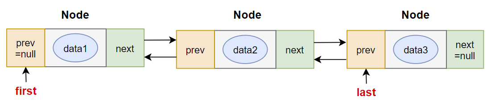

[TOC]


# 一、集合框架概述

## 数组的特点与弊端

* 一方面，面向对象语言对事物的体现都是以对象的形式，为了方便对多个对象的操作，就要对对象进行存储。
* 另一方面，使用数组存储对象方面具有`一些弊端`，而Java集合就像一种容器，可以`动态地`把多个对象的引用放入容器中。
* 数组在内存存储方面的`特点`：
  * 数组初始化以后，长度就确定了。
  * 数组中的添加的元素是依次紧密排序的，有序的，可以重复的。
  * 数组声明的类型，就决定了进行元素初始化时的类型。不是此类型的变量，就不能添加。
  * 可以存储基本数据类型值，也可以存储引用数据类型的变量。
* 数组在存储方面的`弊端`：
  * 数组初始化以后，长度就不可变了，不便于扩展。
  * 数组中提供的属性和方法少，不便于进行添加、删除、插入、获取元素个数等操作，且效率不高。
  * 数组存储数据的特点单一，只能存储有序的、可以重复的数据，无法存储要求是无序的、不可重复的数据。
* Java集合框架中的类可以用于存储多个`对象`，还可以用于保存具有`映射关系`的关联数组。


## Java集合框架体系

Java集合可分为**`Collection`**和**`Map`**两大体系：

* **`Collection`**接口：用于存储一个一个的数据，也称为`单列数据集合`。
  * **`List`子接口**：用来存储**有序的、可以重复的**数据（主要用来替换数组，“动态”数组）
    * 实现类：ArrayList（主要实现类）、LinkedList、Vector
  * **`Set`子接口**：用来存储**无序的、不可重复的**数据（类似于高中讲的“集合”）
    * 实现类：HashSet（主要实现类）、LinkedHashSet、TreeSet
* **`Map`**接口：用于存储具有映射关系“key-value对”的集合，即一对一对的数据，也称`双列数据集合`。（类似于高中的函数、映射。(x1, y1), (x2, y2) -> y = f(x)）
  * HashMap（主要实现类）、LinkedHashMap、TreeMap、Hashtable、Properties
* JDK提供的集合API位于java.util包内

* **Collection接口继承数**：


* **Map接口继承树**


# 二、Collection接口及其方法的说明

* JDK不提供Collection接口的任何直接实现，而是去提供其子接口List、Set的实现。
* Collection接口是List和Set接口的父接口，该接口里定义的方法既可以用于操作Set集合，也可以用于操作List集合。方法如下：

## 1. 添加方法

* **`add(E e)`**：添加元素对象到当前集合中。
* **`add(Collection other)`**：添加other集合中的所有元素对象到当前集合中，即this = this ∪ other。

## 2. 判断方法

* **`int size()`**：获取当前集合中**实际存储的元素个数**。
* **`boolean isEmpty()`**：判断当前集合是否为空集合。
* **`boolean contains(Object obj)`**：判断当前集合中是否存在一个与obj对象equals()方法返回true的元素。
* **`boolean containsAll(Collection coll)`**：判断coll集合中的元素是否在当前集合中都存在。即coll集合是否是当前集合的“子集”。
* **`boolean equals(Object obj)`**：判断当前集合与obj是否相等，obj也应当是一个集合。


在Collection中，`contains()`包含方法在判断集合中是否包含某一个对象时，是使用对象的**`equals()`**方法进行比较，如果equals()方法返回true，则表示包含。

> 故当我们将对象存放到集合中，需要查找对象时，**若想要去根据对象的内容进行比较的，则应当重写`equals()`方法**，否则默认根据地址值进行查找，即Object中的equlas()方法。

例如：

```java
Collection coll = new ArrayList();
coll.add("123");
coll.add(456);
System.out.println(coll.contains(new String("123")));//true
```

这里输出结果为true的原因就在于，contains()方法是使用equals()进行判断的，如果equals()方法返回true，则表示包含。String类重写了equals()方法，根据字符串的内容进行判断。

> **注意：**
>
> 不仅仅是contains()方法会使用equals()进行比对，凡是需要进行元素比较的方法，都使用的是equals()方法，比如remove()、removeAll()和retainAll()方法等，它们都是去循环地遍历集合，使用equals()一个一个地进行比较。


## 3. 删除方法

* **`void clear()`**：清空集合元素
* **`boolean remove(Object obj)`**：从当前集合中删除第一个找到的与obj对象equals()方法返回true的元素。
* **`boolean removeAll(Collection coll)`**：从当前集合中删除所有与coll集合中相同的元素。即this = this - this ∩ coll。
* **`boolean retainAll(Collection coll)`**：从当前集合中删除两个集合中不同的元素，使得当前集合仅保留与coll集合中的元素相同的元素，即当前集合中仅保留两个集合的交集，即this = this ∩ coll。


## 4. 其他方法

* **`Object toArray()`**：返回包含当前集合中所有元素的数组。
* **`hashCode()`**：获取集合对象的哈希值
* **`iterator()`**：返回迭代器对象，用于集合遍历。

```java
public class TestCollectionContains {
    @Test
    public void test01() {
        Collection coll = new ArrayList();

        coll.add("小李广");
        coll.add("扫地僧");
        coll.add("石破天");
        coll.add("佛地魔");
		//集合转换为数组：集合的toArray()方法
        Object[] objects = coll.toArray();
        System.out.println("用数组返回coll中所有元素：" + Arrays.toString(objects));
		
        //对应的，数组转换为集合：调用Arrays的asList(Object ...objs)
        Object[] arr1 = new Object[]{123,"AA","CC"};
        Collection list = Arrays.asList(arr1);
        System.out.println(list);
    }
}
```


## 集合与数组的相互转换

* **集合 → 数组**： **`Collection.toArray()`**：非静态方法，将当前的集合转换成数组。

* **数组 → 集合**：**`Arrays.asList(T... a)`**：Arrays类的静态方法，将数组转换成List集合

（因为数组是有序，可重复的，List也是有序可重复的，所以转换成集合应当会转换成List，而不是Set或Map)


**Arrays.asList(...)方法返回的List集合，既不是ArrayList实例，也不是Vector实例。Arrays.asList(...)返回值是一个固定长度的List集合。**

所以，当使用Arrays.asList()方法将数组转换成集合后，只能使用List变量来接收，不能使用ArrayList或Vector变量接收。


> **注意：**
>
> Arrays.asList()方法是将是将引用数据类型对象转换成集合类型，传入的是T... a，可以传入数组类型，表示是T类型的数组，也可以传入一个一个T对象，看作是一个对象数组（新特性）。
>
> 但是当传入的是基本数据类型的数组时，由于不是引用数据类型，并且受新特性的影响（T... a可以传入数组，也可以传入一个一个的对象），编译器会将整个数组看作是一个对象T，将基本数据类型的数组看作是T数组中的一员，即一个数组元素，而不是一个数组整体。

案例：

```java
Integer[] integers = new Integer[]{1, 2, 3};
System.out.println(Arrays.asList(integers).size());

int[] ints = new int[]{1, 2, 3};
System.out.println(Arrays.asList(ints).size());
```

输出结果：


在将Integer数组转换成集合中，数组中的元素实际上都通过了自动装箱的方式转换Integer类型的对象，即数组中的每一个元素都看作是一个a对象。

在将int数组转换成集合中，由于int类型是基本数据类型，不符合T... a中，a的要求（a要求是引用数据类型），所以实际上是将整个int数组看成是一个a对象。

## 向Collection集合中添加元素的要求

> **`要求元素所属的类中一定要重写equals()方法。`**

原因：

因为Collection中的相关方法，比如：contains() / remove()方法在使用时，是根据元素所在的类的equals()方法进行比较判断的。


# 三、Iterator迭代器接口

## Iterator接口介绍

* 在程序开发中，经常需要遍历集合中的所有元素。针对这种需求，JDK专门提供了一个接口`java.util.Iterator`。`Iterator`接口也是Java集合中的一员，但它与`Collection`、`Map`接口有所不同。

  * Collection接口与Map接口主要用于`存储`元素。
  * `Iterator`，被称为迭代器接口，本身并不提供存储对象的能力，主要用于`遍历`Collection中的元素。

* **Iterator的作用**：用来遍历集合元素。

* **如何获取Iterator对象？**

  Collection接口继承了java.lang.iterable接口，该接口有一个iterator()方法，那么所有实现了Collection接口的集合类都有一个iterator()方法，用于返回一个实现了iterator接口的对象。

  * **`public Iterator iterator()`**：获取集合对应的迭代器，用于遍历集合中的元素的。
  * **集合对象每次调用iterator()方法都得到一个全新的迭代器对象，默认游标在集合的`第一个元素之前`。**

* **iterator接口常用的方法**

  * **`public boolean hasNext()：`**如果仍有下一个元素（即仍可以迭代），则返回true。
  * **`public E next()`**：将游标下移一位，并返回游标指向的元素。

> **注意：**
>
> 在调用`iterator.next()`方法之前，必须要调用`iterator.hasNext()`进行检测。否则当后续已经无元素时，再调用`next()`方法，将会抛出**`NoSuchElementException`**异常。

使用案例：

```java
Collection coll = new ArrayList();
coll.add("AA");
coll.add(1);
coll.add("BB");
coll.add(234);
coll.add("CC");
coll.add(567);

Iterator iterator = coll.iterator();
while (iterator.hasNext()){
    System.out.println(iterator.next());
}
```

使用while(iterator.hasNext()){}方式进行遍历，就不会出现因游标下一位没有元素而出现报错的异常。


## 迭代器的执行原理

Iterator迭代器对象在遍历集合时，内部采用指针的方式来跟踪集合中的元素，接下来通过一个图例来演示Iterator对象迭代元素的过程：


由上图可知，迭代器的执行原理大概是：

1. 使用iterator()方法创建迭代器后，迭代器的指针指向的是集合元素的前一位。
2. 使用hasNext()方法判断指针下一位是否存在元素。
3. 使用next()方法先将指针下移一位，然后返回指针所指向的元素。
4. 一直遍历，直到hasNext()方法返回false，此时指针指向的是最后一位元素。

> **Iterator.next()方法的作用是（先下移，再返回元素）：**
>
> * ①`指针下移` 
>
> * ②`将下移以后集合位置上的元素返回。`

错误方式一：

```java
Iterator iterator = coll.iterator();
while ((iterator.next()) != null){
    System.out.println(iterator.next());
}
```

在这种方式中，通过判断iterator.next()是否为空来判断下一个元素是否存在，从而取代hasNext()方法。

但是，需要注意的是，next()方法本身会将指针下移一位，然后再在while循环体中执行next()方法，此时指针指向的就是下移两位的元素了，而不是下移一位。即next()本身不仅仅是返回元素，而且会控制指针下移，所以这种方式是错误的。


错误方式二：

```java
while (coll.iterator().hasNext()){
    System.out.println(coll.iterator().next());
}
```

这种方式，在while()循环判断中创建迭代器，又在循环体中创建迭代器，但是注意，这两种创建的迭代器并不是同一个迭代器，创建出了两个迭代器。

故当循环体中调用next()方法将指针下移一位时，括号中的迭代器依旧指向的是第一个元素前一位。并且在每次循环中均会创建一个新的迭代器，指向的都是第一个元素前一位。

## foreach循环（推荐使用）

* foreach循环（也称为增强for循环）是JDK5.0中定义的一个高级for循环，专门用来`遍历数组和集合`的。
* **foreach循环的语法格式：**

```java
for(元素的数据类型 局部变量 : 集合或数组){
	//操作局部变量的输出操作
}
```

案例：

```java
public class TestForeach {
    @Test
    public void test01(){
        Collection coll = new ArrayList();
        coll.add("小李广");
        coll.add("扫地僧");
        coll.add("石破天");
		//foreach循环其实就是使用Iterator迭代器来完成元素的遍历的。
        for (Object o : coll) {
            System.out.println(o);
        }
    }
    @Test
    public void test02(){
        int[] nums = {1,2,3,4,5};
        for (int num : nums) {
            System.out.println(num);
        }
        System.out.println("-----------------");
        String[] names = {"张三","李四","王五"};
        for (String name : names) {
            System.out.println(name);
        }
    }
}
```

> **对于集合的遍历，增强for循环底层实际上用的就是`Iterator`迭代器。**

如下图：


> **使用增强for循环的方式只能进行对元素进行遍历，而不能在循环中去修改集合或数字中的元素。**

增强for循环的作用是，将数组或集合中的元素在遍历中，依次赋值（或地址值）赋给临时变量，所以在循环体中对临时变量的修改，可能不会导致原有集合或数组中元素的修改。


例如：

```java
public class ForTest {
    public static void main(String[] args) {
        String[] str = new String[5];
        for (String myStr : str) {
            myStr = "atguigu";
        }
    }
}
```

这里的myStr起作用了吗？String数组中的元素是否都被修改成了"atguigu"？

并没有，原因在于，for(String myStr : str)作用是，将str中的每一个元素在每次遍历时，将值赋给了myStr，即让变量myStr指向了str中的元素，当我去运行代码myStr = "atguigu"时，实际上是将值赋值给了myStr变量，而不是将值赋值给了str数组中的元素，所以并不能起到修改值的作用，而仅仅只是去赋值给局部变量myStr。


# 四、Collection子接口1：List

## 1. List接口的特点

* 由于数组的局限性，我们一般使用`java.util.List`替代数组。

* List集合元素是**`有序的`**、**`可重复的`**。这样一来，List集合中就可以存入相同的元素，并且元素之间的排列是有序排列的。

* **List集合可以添加`null`元素。**

  List类似于数组，集合中的每个元素都有对应的顺序索引，并且迭代时也是按照add()的顺序进行迭代。

* JDK API中List接口的实现类常用的有：`ArrayList`、`LinkedList`和`Vector`。

## 2. List的主要方法

List除了从Collection集合继承的方法外，List集合里添加了一些`根据索引`来操作集合元素的方法。

* **插入元素**
  * **`void add(int index, Object ele)`**：在index位置插入ele元素。
  * **`boolean addAll(int index, Collection eles)`**：从index位置开始将eles中的所有元素添加进来。
* **获取元素**
  * **`Object get(int index)`**：获取指定index位置的元素
  * **`List subList(int fromIndex, iint toIndex)`**：返回从fromIndex到toIndex为止的子集合。
* **获取元素索引**
  * **`int indexOf(Object obj)`**：返回obj在集合中首次出现的位置。
  * **`int lastIndexOf(Object obj)`**：返回obj在当前集合中末次出现的位置。
* **删除和替换元素**
  * **`Object remove(int index)`**：移除指定index位置的元素，并返回此元素。
  * **`Object set(int index, Object ele)`**：设置指定index位置的元素为ele。

**注意：**

`remove()`重载的方法包括传入指定的元素的参数，也包括传入index指针的参数。


当我们使用时，比如remove(1)，这个时候，到底是去删除1这个元素呢，还是去删除指针为1的元素呢？

remove()方法当我们传入基本数据类型的数字时，**默认是使用index参数的remove()方法**。若需要去删除指定数字的元素时，需要将数字转换成包装类对象的形式。

例如：

```java
ArrayList<Integer> arrayList = new ArrayList();
arrayList.add(1);
arrayList.add(2);
arrayList.add(3);

arrayList.remove(1);//这里去删除的是指针为1的元素，即删除2这个元素
arrayList.remove(Integer.valueOf(1));//这里删除的是1元素
System.out.println(arrayList);//输出结果为[3]
```


## 3. List的实现类之一：ArrayList

* ArrayList是List接口的**`主要实现类`**。
* ArrayList底层使用的是**`Object数组`**来实现的。本质上，ArrayList是对象引用的一个“变长”数组。


> **由于ArrayList底层使用的是数组，所以在添加数据、查找数据时，效率会比较高；但是在插入数据、删除数据时，效率较低。**

原因：

1. 由于底层使用的是数组类型，存在索引，所以当我们去根据指定索引去查找元素可以直接找到，而不需要进行遍历，效率较高；当我们需要添加一个元素时，只需要在数组已有元素后面直接添加一个即可（数组不是满的）。

2. 当我们去ArrayList集合中插入一个数据时，由于ArrayList底层使用的是Object[]数组，所以在指定位置插入元素或删除元素时，其后续元素的位置都会发生变化，插入数据需要将当前位置的元素及后续所有的元素往后移动一位，删除数据时需要将当前位置的后续元素往前移动一位，这样一来造成的效率就比较低，时间复杂度为O(n)。

## 4. List的实现类之二：LinkedList

- 对于频繁的插入或删除元素的操作，建议使用LinkedList类，效率较高。这是由底层采用**`链表（双向链表）`**结构存储数据决定的。


ArrayList底层使用的是Object[]数组，由于数组是紧密排列的，当我们需要去删除其中某一个元素时，数组后续的元素都需要往前移动一位。当我们需要往其中添加一个元素时，该位置的元素以及后续元素都需要往后移动一位，这样一来执行效率比较低。

但是对于LinkedList来说，由于其底层使用的是双向链表的结构，当我们需要去删除集合中的某个元素时，只需要将该元素前一位元素的next指针指向该元素后一位的元素，后一位元素的prev指针指向该元素的前一位，这样就实现了元素的删除操作，而无需对所有元素进行操作。


同理，当LinkedList想要去添加元素时，只需要将插入位置的前一个元素的next指向这个元素，让当前元素的prev指向前一个元素；将插入位置后一个元素的prev指向当前元素，让当前元素的next指向后一个元素即可。这样一来，就是往链表中插入了一个元素。

> **所以：当插入或删除元素操作比较多时，建议使用`LinkedList`，效率较高。**

- 特有方法：
  - void addFirst(Object obj)
  - void addLast(Object obj)	
  - Object getFirst()
  - Object getLast()
  - Object removeFirst()
  - Object removeLast()

## 5. List的实现类之三：Vector

Vector是List古老的实现类，在实际开发中基本上已经不用了。Vector是在JDK1.0的时候就引入了，List都是在JDK1.2才引入的。

**为什么不用Vector了呢？**

Vector是线程安全的，故效率较低。当我们需要线程安全时，一般都是自己去包数据。

* Vector是一个`古老`的集合，JDK1.0就有了。大多数操作与ArrayList相同，区别之处在于Vector是`线程安全`的，故Vector效率较低，当可能出现线程安全问题时，依旧建议使用ArrayList，然后用锁将其包起来解决。
* 在各种List中，最好把`ArrayList作为默认选择`。当插入、删除频繁时，使用LinkedList；Vector总是比ArrayList慢，所以尽量避免使用。
* 特有方法：
  - void addElement(Object obj)
  - void insertElementAt(Object obj,int index)
  - void setElementAt(Object obj,int index)
  - void removeElement(Object obj)
  - void removeAllElements()

## 6. 总结：

> 1. ArrayList和Vector底层都是使用`Object数组`来存储的，LinkedList底层使用`双向链表`的方式来存储数据。
> 2. ArrayList、LinkedList是`线程不安全`的，Vector是`线程安全`的，所以不建议使用Vector，因为线程安全所导致的执行效率较低。Vector是古老的List实现类。
> 3. ArrayList由于底层使用的是Object数组，所以当`插入和删除操作比较多时，不建议使用`；此时推荐使用`LinkedList`，因为双向链表只需要修改其中两个元素的指针即可，而ArrayList由于底层是数组，当插入或删除一个元素时，后续元素在数组中的位置也需要改变。


# 五、Collection子接口2：Set

## 1. Set接口概述

* Set接口是Collection的子接口，Set接口相较于Collection接口没有提供额外的方法。
* Set集合不允许包含相同的元素，Set集合中存储的元素是**`无序的、不可重复的`**，如果尝试把两个相同的元素加入同一个Set集合中，则添加操作失败。
* Set集合支持的遍历方式和Collection集合一样：foreach和Iterator。
* Set的常用实现类有：`HashSet`、`TreeSet`、`LinkedHashSet`。
* `java.util.Set`：存储无序的，不可重复的数据（集合）
  * `java.util.HashSet`：主要实现类：底层使用的是HashMap，即使用数组+单向链表+红黑树结构进行存储。
    * `java.util.LinkedHashSet`：是HashSet的子类，在现有的数组+单向链表+红黑树结构的基础上，又添加了双向链表的结构，用于记录元素的先后顺序。即：我们可以按照添加元素的顺序实现遍历，便于频繁的查询操作。

  * `java.util.TreeSet`：底层使用红黑树存储，可以按照添加元素的指定属性的大小顺序进行遍历。

* 开发中的使用频率及场景：较List、Map来说，Set使用的频率比较少。
* **在什么时候使用Set？**
  * **`用来过滤重复数据`**。当我们需要过滤掉一份数据中重复的内容时，就可以将这一组数据存入Set中，重复的数据就会被自动过滤掉。
  * 当我们去调用系统的API，返回给我们的是一个Set类型的数据，想强调的是这份数据是`无序的、不可重复的`。

## 2. Set的主要实现类：HashSet

###  2.1、HashSet概述

* HashSet底层使用的是`HashMap`，即使用`数组+单向链表+红黑树`结构进行存储。（jdk8及之后）
* HashSet是Set接口的主要实现类，大多数时候使用Set集合时都使用这个实现类。
* HashSet按`Hash算法`来存储集合中的元素，因此具有很好的存储、查找、删除性能。
* HashSet具有以下特点：
  * 不能保证元素的排列顺序。
  * HashSet不是线程安全的。
  * 集合元素可以是null。
* **HashSet判断两个元素相同的标准：**
  * 两个对象通过`hashCode()`方法得到的哈希值相等，并且两个对象的`equals()`方法返回值为`true`。
* 因此：**对于存放在Set容器中的对象，对应的类一定要重写`hashCode()`和`equals()`方法**，用于实现对象相等的规则。即：“相等的对象必须具有相等的散列码”。


* **Set集合的元素`无序性`是怎么体现的？**

  * **Set集合中元素的无序性，不等同于随机性**。这里的无序性与元素的添加位置有关。具体来说：我们在添加每一个元素到数组中时，具体的存储位置是由元素的hashCode()调用后返回的hash值决定，而不是按照添加的顺序进行排列的，导致在数组中每个元素不是依次紧密存放的，表现出一定的无序性。

* **Set集合的元素的`不可重复性`是怎么体现的？**

  * 添加到Set中的元素是不能相同的，这里的不能相同实际上还是根据equals()方法进行判断的。要求：当两个元素equals()判断是true，则两个元素的hashCode值也一定相等；但两个元素的hashCode值相等，equals()返回的值不一定为true。

    **`当两个元素的哈希值相等，并且equals()返回true，则认为这两个元素是相同的。`**

### 2.2、HashSet中添加元素的过程：

* 第一步：当向HashSet集合中存入一个元素时，HashSet会调用该对象的`hashCode()`方法得到该对象的`hashCode`值，然后根据`hashCode`值，通过某个`散列函数`决定该对象在HashSet底层数组中的存储位置。

* 第二步：如果要在数组中存储的位置上没有元素，则直接添加成功。

* 第三步：如果要在数组中存储的位置上有元素，说明这两个元素通过散列函数获得的在数组中的位置一样，但是这两个元素不一定相等，则继续比较：

  * 如果两个元素的`hashCode`值不相等，则添加成功；
  * 如果两个元素的`hashCode`值相等，则会继续调用`equals()`方法：
    * 如果equals()方法结果为false，则添加成功。
    * 如果equals()方法结果为true，则添加失败。

  > 如第二步添加成功，元素会保存在底层数组中，
  >
  > 第三步两种添加成功的操作，由于该底层数据的位置已经有了元素了，则会通过`链表`的方式继续链接存储。

案例：

```java
class Person{
    String name;
    int age;

    //getter、setter方法
    public Person(String name, int age) {
        this.name = name;
        this.age = age;
    }

    @Override
    public boolean equals(Object o) {
        if (this == o) return true;
        if (o == null || getClass() != o.getClass()) return false;
        Person person = (Person) o;
        return age == person.age && Objects.equals(name, person.name);
    }

    @Override
    public String toString() {
        return "Person{" +
                "name='" + name + '\'' +
                ", age=" + age +
                '}';
    }
}

public class SetTest {
    @Test
    public void test(){
        Set<Person> set = new HashSet<>();
        set.add(new Person("cheng", 23));
        set.add(new Person("cheng", 23));
        for (Person person : set) {
            System.out.println(person);
        }
    }
}

```

输出结果：


上例中

当一个类没有去重写hashCode()方法时，将该类的对象存放到HashSet中，此时该对象的哈希值是随机的，那么Set集合中就可以存入两个相同的元素了。因为存放的位置是随机的，两个元素不会存放在一起，数组中可以存入进去，就不会去调用equals()方法进行判断两个元素是否相等，也就一定能够存入进去。

所以：

> **在Set集合中存放的对象，所属的类一定要重写`hashCode()`方法和`equals()`方法。**

如果添加一个hashCode()方法后：


此时，Set集合就会去过滤掉相同的元素，因为两个元素的hashCode()返回值相等，则就在数组中的同一个位置，因为同一个位置上已经有了，然后再进行equals()方法判断，为true则表示两个元素相等，就不会再放入。


### 2.3、重写hashCode()方法的基本原则

* 在程序运行时，同一个对象多次调用hashCode()方法应该返回相同的值。
* 当两个对象的equals()方法比较返回true时，这两个对象的hashCode()方法的返回值也应该相等。
* 对象中用作equals()方法比较的Field，都应该用来计算hashCode值。

> 注意：如果两个元素的equals()方法返回true，但它们的hashCode()返回值不相等，hashSet将会把它们存储在不同的位置，即相同的元素都可以存入Set，此时就会有问题。


### 2.4、重写equals()方法的基本原则

* 重写equals()方法的时候一般都需要同时复写hashCode()方法。通常参与计算hashCode的对象的属性也应该参与到equals()计算中。

* 推荐：开发中直接调用IDEA里的快捷键自动重写equals()和hashCode()方法即可。

  * 为什么用IDEA复写hashCode方法，有31这个数字？

    

    ```
    首先，选择系数的时候要选择尽量大的系数。因为如果计算出来的hash地址越大，所谓的“冲突”就越少，查找起来效率也会提高。（减少冲突）
    
    其次，31只占用5bits,相乘造成数据溢出的概率较小。
    
    再次，31可以 由i*31== (i<<5)-1来表示,现在很多虚拟机里面都有做相关优化。（提高算法效率）
    
    最后，31是一个素数，素数作用就是如果我用一个数字来乘以这个素数，那么最终出来的结果只能被素数本身和被乘数还有1来整除！(减少冲突)
    ```


## 3. Set的实现类二：LinkedHashSet

* LinkedHashSet是HashSet的`子类`，在现有的数组+单向链表+红黑树结构的基础上，又添加了一组**`双向链表`**。用于记录添加元素的先后顺序。即：**我们可以根据添加元素的顺序实现遍历，便于我们进行频繁的查询操作**。

* LinkedHashSet根据元素的hashCode值来决定元素的存储位置，但它同时使用`双向链表`维护元素的次序，这使得元素看起来是以`添加顺序`保存的。

* > LinkedHashSet**`插入性能略低于`**HashSet，原因在于在插入时不仅仅需要用到hashCode()和equals()方法，还需要使用到双向链表来维护其次序；但在**`迭代访问`**Set里全部的元素时有很好的性能。


问题：

明明Set存储的数据是无序的、不可重复的，但为什么LinkedHashSet可以根据添加元素的顺序实现遍历呢？

这里的无序，指的是在底层存储的位置上，元素在数组中不是依次存放的，而是根据hashCode()返回的hash值决定。LinkedHashSet在底层依旧是无序的，不可重复的，只不过由于其使用了双向链表，当我们去遍历的时候，让我们可以根据其添加的顺序进行遍历，但是LinkedHashSet依旧是无序的。

> LinkedHashSet也是`无序、不可重复`的，因为底层也是根据hashCode值来进行存放，而不是根据添加的顺序依次存放，只不过在HashSet的基础上，使用了双向链表来保证遍历的顺序与添加时的顺序一致。


## 4. Set的实现类三：TreeSet

* TreeSet是SortedSet接口的实现类，TreeSet可以按照添加元素的指定属性的大小顺序进行遍历。

* TreeSet底层使用`红黑树`结构存储数据。

* TreeSet根据其元素的大小进行排序，所以，**TreeSet中只能放入同一种类型的数据**，否则会报`ClassCastException`异常，因为不同的数据类型无法进行比较；并且，为了能够进行让引用类型的数据进行比较，需要使用到`Comparable`或`Comparator`。

* TreeSet特点：不允许重复、实现排序（自然排序或定制排序）。

* 同理，TreeSet虽然遍历时是按照其对象的大小顺序进行的，但是，由于底层使用的是红黑树，其存放的顺序并不与添加的顺序一致，所以底层依旧是无序的、不可重复的。

* 新增的方法如下：（了解）

  * Comparator comparator()
  * Object first()
  * Object last()
  * Object lower(Object e)
  * Object higher(Object e)
  * SortedSet subSet(fromElement, toElement)
  * SortedSet headSet(toElement)
  * SortedSet tailSet(fromElement)

* **TreeSet判断数据是否相同的标准：**

  * TreeSet与HashSet、LinkedHashSet不同，HashSet、LinkedHashSet是根据hashCode()与equals()判断两个元素是否是同一个，若hashCode()返回值相等，且equals()为true，则表示两个元素相等，后续元素就不会存入到Set集合中。

  * > TreeSet是根据`自然排序`或`定制排序`的相关方法`compareTo()`或`compare()`，**方法返回值是否是0进行判断**，若是0，则表示两个元素相等，两个元素中的后一个元素就不会存入到TreeSet集合中。

    则此时，不仅仅是add()方法，还有remove()、contains()方法，TreeSet都是根据其排序方法的返回值是否是0来进行判断TreeSet集合中是否有传入的相关元素。

* **TreeSet中不需要重写`hashCode()`方法和`equals()`方法，因为判断数据是否相等不是根据这两个方法了。**

### TreeSet的使用

TreeSet使用时，需要实现排序，两种排序方式：`自然排序`和`定制排序`。

#### 1、自然排序

当我们使用**默认的构造器**（不带参数）创建的TreeSet对象，例如：


使用的是存入的对象所属的类自带的排序方式，即**`自然排序`**。

自然排序要求该类需要实现`Comparable`接口，并重写`compareTo()`方法，TreeSet就会根据compareTo()方法，根据`从小到大`的顺序进行排序。

案例：

```java
public class SetTest {
    @Test
    public void test4(){
        TreeSet<Person> treeSet = new TreeSet<>();
        treeSet.add(new Person("aaa", 10));
        treeSet.add(new Person("aaa", 10));
        treeSet.add(new Person("aaa", 20));
        treeSet.add(new Person("aaa", 30));
        treeSet.add(new Person("bbb", 30));
        treeSet.add(new Person("ccc", 30));

        for (Person person : treeSet) {
            System.out.println(person);
        }
    }
}
class Person implements Comparable<Person>{
    String name;
    int age;
    
    //getter、setter方法

    @Override
    public String toString() {
        return "Person{" +
                "name='" + name + '\'' +
                ", age='" + age + '\'' +
                '}';
    }
    
    public Person(String name, int age) {
        this.name = name;
        this.age = age;
    }

    /**
     * 先按照name进行从小到大排序
     * 再按照age进行从大到小排序
     */
    @Override
    public int compareTo(Person o) {
        if (this == o){
            return 0;
        }
        int i = this.name.compareTo(o.name);
        if (i != 0){
            return i;
        }
        int i1 = -(this.age - o.age);
        return i1;
    }
}
```

输出结果：


#### 2、定制排序

当我们使用**带Comparator接口的参数**创建的TreeSet对象，例如：


此时的TreeSet对象按照的是Comparator匿名实现类中compare()方法进行排序的，即**`定制排序`**。

此时，无论传入的对象所属的类是否实现了Comparable接口，是否有自己的自然排序方式，都是按照compare()方法中规定的比较方式进行的排序。

定制排序要求创建TreeSet时传入一个`Comparator`接口对象，TreeSet就会根据`compare()`方法，根据`从小到大`的顺序进行排序。

案例：

```java
//使用定制排序
//Person类中无需创建hashCode()和equals()方法，因为TreeSet是根据排序方法的返回值判断是否相等的
class Person{
    String name;
    int age;
    
    //getter、setter方法
    
    @Override
    public String toString() {
        return "Person{" +
                "name='" + name + '\'' +
                ", age='" + age + '\'' +
                '}';
    }

    public Person(String name, int age) {
        this.name = name;
        this.age = age;
    }
}


public class SetTest {
    @Test
    public void test1(){
        //定制排序，传入带Comparator接口的参数
        TreeSet<Person> treeSet = new TreeSet(new Comparator<Person>(){
            /**
             * 先根据年龄，从小到大进行排序；
             * 再根据姓名，从大到小进行排序。
             */
            @Override
            public int compare(Person o1, Person o2) {
                if (o1 == o2){
                    return 0;
                }
                int value = o1.age - o2.age;
                if (value != 0){
                    return value;
                }
                return -o1.name.compareTo(o2.name);
            }
        });
        treeSet.add(new Person("cheng", 22));
        treeSet.add(new Person("aaa", 13));
        treeSet.add(new Person("ccc", 13));
        treeSet.add(new Person("bbb", 13));
        treeSet.add(new Person("wei", 33));
        treeSet.add(new Person("aaa", 65));
        treeSet.add(new Person("aaa", 65));
        for (Person person : treeSet) {
            System.out.println(person);
        }
    }
}

```

显示结果：


**注意：**

1. **若使用不带参的构造器创建的TreeSet，则默认是`自然排序`，要求传入的对象所属的类必须实现Comparable接口，并重写compareTo()方法。**当传入对象所属的类中没有实现Comparable接口，并且使用的是空参的构造器创建的TreeSet集合进行存储时，会报异常：`ClassCastException`。

   例如：

   元素所属的类：

   ```java
   class Person{
   	String name;
   	int age;
   	
   	public Person(String name, int age) {
           this.name = name;
           this.age = age;
       }
   }
   ```

   将该元素添加到TreeSet集合中：

   ```java
   TreeSet<Person> treeSet = new TreeSet();
   treeSet.add(new Person("aaa", 10));
   for (Person person : treeSet) {
   	System.out.println(person);
   }
   ```

   打印结果：

   

2. **TreeSet中传入的对象所属的类必须是同一个**，若是不同的类，则报异常：`ClassCastException`。因为不同的类，无法进行比较，也无法进行排序操作。

   例如：

   ```java
   TreeSet treeSet = new TreeSet();
   treeSet.add(123);
   treeSet.add("aaa");
   for (Object o : treeSet) {
       System.out.println(o);
   }
   ```

   打印结果：

   


### TreeSet总结：

1. TreeSet底层使用的是红黑树，该红黑树是根据排序的方法返回值进行存放的，所以存放入的元素应当可以进行排序。（要么该元素所属的类实现了Comparable接口，那么创建的TreeSet对象传入了Comparator接口对象）。
2. TreeSet只能传入同一种类型的数据，否则无法进行比较。
3. TreeSet集合中的元素所属的类无需重写hashCode()方法和equals()方法，与HashSet、LinkedHashSet不同，底层并非使用哈希算法计算存储的位置，而是使用红黑树排序。


> 当我们需要去**筛选出不重复的数据**时，可以主动地使用`Set`来实现，一般使用实现类`HashSet`；当我们需要对这些数据遍历时按照一定的大小顺序进行`排序`，使用`TreeSet`。


# 六、Map

现实生活与开发中，我们常会看到这样的一类集合：用户ID与账户信息、学生姓名与考试成绩、IP地址与主机名等，这种一一对应的关系，就称作映射。Java提供了专门的集合框架用来存储这种映射关系的对象，即`java.util.Map`接口。

> 对于Map集合来说，可以直接根据Set集合的特点进行考虑，只不过当Map集合中添加进两个元素拥有相同的key时，不是像Set一样忽略后续添加的元素，而是对先前的元素进行的修改操作。

## 1. Map概述

* Map与Collection并列存在。用于保存具有`映射关系`的数据：key-value。
  * `Collection`集合被称为单列集合，元素是孤立存在的。
  * `Map`集合称为双列集合，元素是成对存在的。

* Map中的key和value都可以是任何引用类型的数据。但常使用String类作为Map的“键”。

* Map接口的常用实现类：`HashMap`、`LinkedHashMap`、`TreeMap`和`Properties`。其中，`HashMap`是Map接口**使用频率最高**的实现类。

  


* Hashtable与HashMap的关系，类似于Vector与ArrayList。`Hashtable`也是Map古老的实现类，其是**线程安全**的，所以效率比较低，不推荐使用。

* **`HashMap`可以添加null的key和value值**

  **Hashtable不可以添加null的key或value值。**

* HashSet底层使用的是HashMap，LinkedHashSet底层使用的是LinkedHashMap，TreeSet底层使用的是TreeMap。所以，对于Set中有关的特点，实际上说的是对应Map中的特点。比如，Set中的数据是无序的、不可重复的，实际上说的就是Map中的数据特点。再比如，TreeSet遍历时是按照大小进行排列的，实际上这就是TreeMap的特点。


## 2. Map中key-value特点

这里主要以HashMap为例说明。

HashMap中，使用了**内部类`Node`数组**来存储元素


其中使用到了**数组+单向链表+红黑树**（JDK8）的结构。


HashSet实际上底层使用的就是HashMap，只不过在存储数据时，将添加进集合中的所有元素所对应的**`value`值**都设置成了**同一个静态的`Object`对象**，仅使用key来存储数据：


**HashMap中存储的key、value的特点如下：**


* Map中的`key用Set来存放，不允许重复`。存放在HashMap或LinkedHashMap中的**`key所在的类`，需要重写`hashCode()和equals()`**。

* 存储的数据是`无序的、不可重复的`。

  

* key和value之间存在单向一对一关系，即通过指定的key总能找到唯一的、确定的value，不同key对应的value可以重复。**`value`所在的类要重写`equals()`方法。**
* key和value构成一个entry。所有entry彼此之间是`无序的`、`不可重复的`。


## 3. Map接口的常用方法

* **添加、修改操作：**

  * **`V put(K key, V value)`**：将指定的key-value添加到（或修改）当前map对象中。

    在map中，无论是添加操作还是修改操作，都是使用的put()方法。当map集合中不存在要添加的key值时，此时put()进去就是添加操作；当map集合中存在要添加的key值时，此时put()就是修改操作。

  * `void putAll(Map m)`：将m中所有的key-value对存放到map中。

* **删除操作：**

  * **`V remove(Object key)`**：移除指定key的key-value对，并返回value值。
  * `void clear()`：清空当前map中的所有数据。

* **查询操作：**

  * **`V get(Object key)`**：获取指定key对应的value值。
  * `boolean containsKey(Object key)`：是否包含指定的key。
  * `boolean containsValue(Object value)`：是否包含指定的value。
  * `int size()`：返回map中key-value对的个数。
  * `boolean isEmpty()`：判断当前map是否为空。
  * `boolean equals(Object obj)`：判断当前map和参数对象obj是否相等。

* **视图操作：**

  * **`Set keySet()`**：返回所有key构成的Set集合。
  * **`Collection values()`**：返回所有value构成的Collection集合
  * **`Set entrySet()`**：返回所有key-value对构成的Set集合。

**遍历Map的两种方式：**

1. 获取key的Set集合，然后在循环中获取对应的value值。
2. 获取entry对集合，然后在循环中获取entry对中的key、value值。


使用案例：

```java
HashMap<String, Integer> hashMap = new HashMap<>();

//put(K k, V v)，若Map集合中原本没有key，则是添加；若有，则是修改
//添加
hashMap.put("AA", 123);
hashMap.put("BB", 456);
hashMap.put("Tom", 777);
hashMap.put("jack", 444);
hashMap.put("java", 999);
System.out.println(hashMap);//{AA=123, BB=456, Tom=777, java=999, jack=444}
//修改
hashMap.put("AA", 789);
System.out.println(hashMap);//{AA=789, BB=456, Tom=777, java=999, jack=444}

//remove()删除
Integer value = hashMap.remove("AA");
System.out.println(value);//789
System.out.println(hashMap);//{BB=456, Tom=777, java=999, jack=444}

//get()查找：当没找到，返回的是null
System.out.println(hashMap.get("AA"));//null
System.out.println(hashMap.get("BB"));//456

//size()长度
System.out.println(hashMap.size());//4

System.out.println("**********************");

//两种遍历操作：
for (String s : hashMap.keySet()) {
    System.out.println("key：" + s + " ==> value：" + hashMap.get(s));
}

System.out.println("***********************");

for (Map.Entry<String, Integer> entry : hashMap.entrySet()) {
    String k = entry.getKey();
    Integer v = entry.getValue();
    System.out.println("key：" + k + " ==> value：" + v);
}
```

## 4. Map的主要实现类：HashMap

* HashMap是Map接口`使用频率最高`的实现类。
* HashMap是**线程不安全**的，允许添加null键和null值。
* 存储数据采用的哈希表结构，底层使用`一维数组` + `单向链表` + `红黑树`进行key-value数据的存储。与HashSet一样，元素的存取顺序不能保证一致。
* HashMap`判断两个key相等的标准`是：两个key的hashCode值相等，通过equals()方法返回true。所以，存储在HashMap中的key所属的类，要**重写`hashCode()`与`equals()`**。
* HashMap`判断两个value相等的标准`是：两个value通过equals()方法返回true。

HashSet底层使用的是HashMap，我们根据HashSet的内容，可以推知HashMap。

* **HashMap添加/修改数据过程：**

  * 当我们向HashMap集合中添加数据时，会先去计算key的hashCode()值，并通过哈希函数，计算其在数组中的位置，若该位置上没有元素，则直接添加进去。

  * 若该位置上已有元素，则将两个元素的哈希值进行比较：

    * 若不同，则使用链表的方式添加进去。

    * 若相同，则比较二者equals()的返回值：
      * 若为false，则添加进去。

    * 若为true，则表示二者key为同一个元素，此时不是添加操作，而是修改操作，此时会将原value与新value使用equlas()进行比较，若为false，则将原有的value值修改成新的value值。若为true，则忽略。

> **`上述添加过程，与HashSet相似，只不过当key是同一个元素时，不再是筛选掉，而是进行修改。`**


## 5. Map的实现类之二：LinkedHashMap

> **在开发中，若需要进行频繁的遍历操作，建议使用`LinkedHashMap`。**


* LinkedHashMap是HashMap的子类。
* LinkedHashSet底层使用的是LinkedHashMap存储数据的，所以我们由前面的知识可以得知：对于**`LinkedHashMap`**而言，是在HashMap的基础上添加了一对**双向链表**，用来`记录添加元素的先后顺序`，这样可以保证在遍历元素时，与添加的顺序保持一致。添加一个双向链表后，遍历的速度会更快一点。
* 同理，为了保证键的唯一性、不可重复性，key所属的类需要重写`hashCode()`与`equals()`方法。

案例：

```java
LinkedHashMap<String, Integer> hashMap = new LinkedHashMap<>();
hashMap.put("cheng", 22);
hashMap.put("jia", 33);
hashMap.put("weoi", 44);
hashMap.put("wei", 11);
for (String s : hashMap.keySet()) {
    System.out.println(s + "：" + hashMap.get(s));
}
```

打印结果：


## 6. Map的实现类之三：TreeMap

* 底层使用的是`红黑树`进行存储。

* TreeMap存储key-value对时，需要根据key-value对进行排序。TreeMap可以保证所有的key-value对处于`有序状态`。

* TreeSet实际上底层用的就是TreeMap中的key，只不过value值设置成了静态的Object对象了。

  由TreeSet，我们可以推知**TreeMap的特点**：

  * 1、**`key`只能使用同一种数据类型**，否则无法进行比较大小。（value可以不是同一种数据类型）
  * 2、当使用**无参的构造器**创建出来的TreeMap对象，是按照key所属的类中的自然排序方式进行排序，此时key所属的类应当实现Comparable接口，按照重写的`compareTo()`方法设定的比较方式进行排序。
  * 3、当使用**带Comparator参数的构造器**创建的TreeMap对象，是按照Comparator实现类中`compare()`方法设定的比较方式进行排序的。
  * 4、TreeMap中的**key无需重写`hashCode()`与`equals()`方法**。
  * 5、TreeMap判断`两个key相等的标准`是：两个key通过compareTo()方法或者compare()方法返回0。
  * 6、当两个元素的key使用compareTo()或compare()方法返回的是0时，后续的元素不会像TreeMap一样被忽略，而是被修改value值。

案例：

```java
public class TreeMapTest {
    /*
     * 自然排序举例
     * */
    @Test
    public void test1(){
        TreeMap<String, Integer> map = new TreeMap();

        map.put("CC",45);
        map.put("MM",78);
        map.put("DD",56);
        map.put("GG",89);
        map.put("JJ",99);

        Set<Map.Entry<String, Integer>> entries = map.entrySet();
        for(Map.Entry<String, Integer> entry : entries){
            System.out.println(entry);
        }

    }

    /*
     * 定制排序
     *
     * */
    @Test
    public void test2(){
        //按照User的姓名的从小到大的顺序排列

        TreeMap<User,Object> map = new TreeMap<>(new Comparator<User>() {
            @Override
            public int compare(User o1, User o2) {
                if(o1 != null && o2 != null){
                    return o1.name.compareTo(o2.name);
                }
                throw new RuntimeException("输入的数据有误！");
            }
        });

        map.put(new User("Tom",12),67);
        map.put(new User("Rose",23),"87");
        map.put(new User("Jerry",2),88);
        map.put(new User("Eric",18),45);
        map.put(new User("Tommy",44),77);
        map.put(new User("Jim",23),88);
        map.put(new User("Maria",18),34);

        for (Map.Entry<User, Object> entry : map.entrySet()) {
            System.out.println(entry);
        }
    }
}

class User implements Comparable<User>{
    String name;
    int age;

    public User(String name, int age) {
        this.name = name;
        this.age = age;
    }

    public User() {
    }

    @Override
    public String toString() {
        return "User{" +
                "name='" + name + '\'' +
                ", age=" + age +
                '}';
    }
    /*
    举例：按照age从小到大的顺序排列，如果age相同，则按照name从大到小的顺序排列
    * */
    @Override
    public int compareTo(User o) {
        if(this == o){
            return 0;
        }

        if(o != null){
            int value = this.age - o.age;
            if(value != 0){
                return value;
            }
            return -this.name.compareTo(o.name);
        }
        throw new RuntimeException("输入的类型不匹配");
    }
}
```

## 7. Map的实现类之四：Hashtable

* Hashtable是Map接口的古老实现类，类似于Vector，JDK1.0就提供了。不同于HashMap，Hashtable是`线程安全`的。
* Hashtable现在已经不使用了，现在存在的唯一的意义就是作为面试题。
* Hashtable实现原理和HashMap相同，功能也相同。底层使用哈希表结构（数组+单向链表），与HashMap在jdk8之前的结构一样，JDK8之后HashMap添加了一个红黑树的结构，查询速度快。
* 与HashMap一样，Hashtable也不能保证其中Key-value对的顺序。
* Hashtable判断两个key相等、两个value相等的标准，与HashMap一致。
* 与HashMap不同，Hashtable不允许使用null作为key或value。

面试题：**Hashtable与HashMap的区别**

```
HashMap：底层是一个哈希表（JDK7及之前：数组+链表；JDK8及之后：数组+链表+红黑树），是一个线程不安全的集合，执行效率高。
Hashtable：底层也是一个哈希表（数组+链表），是一个线程安全的集合，执行效率低。

HashMap集合：可以存储null的键、null的值。
Hashtable集合：不能存储null的键、null的值。

Hashtable和Vector集合一样，在jdk1.2版本之后就被更先进的集合HashMap和ArrayList取代了。所以HashMap是Map的主要实现类，Hashtable是Map的古老实现类。

Hashtable的子类Properties（配置文件）类依然活跃，Properties集合是唯一一个和IO流相结合的集合。
```


## 8. Map的实现类之五：Properties

* `Properties`类是`Hashtable`的**子类**，该对象用于处理属性文件。

* `Properties`类中的`key`和`value`要求都是**`String`字符串类型**。

* 存取数据时，建议使用`setProperty(String key, String value)`方法和`getProperty(String key)`方法。

  案例：

  ```java
  @Test
  public void test01() {
      Properties properties = System.getProperties();
      String fileEncoding = properties.getProperty("file.encoding");//当前源文件字符编码
      System.out.println("fileEncoding = " + fileEncoding);
  }
  
  @Test
  public void test02() {
      Properties properties = new Properties();
      properties.setProperty("user","songhk");
      properties.setProperty("password","123456");
      System.out.println(properties);
  }
  
  @Test
  public void test03() throws IOException {
      Properties pros = new Properties();
      pros.load(new FileInputStream("jdbc.properties"));
      String user = pros.getProperty("user");
      System.out.println(user);
  }
  ```

  

# 七、Collections工具类

参考操作数组的工具类：Arrays，Collections是一个操作List、Set和Map等集合的工具类。

## 常用方法

Collections中提供了一系列静态的方法对集合元素进行排序、查询和修改等操作，还提供了对集合对象设置不可变、对集合对象实现同步控制等方法（均为static方法）

### 1. 排序方法

由于只有List是有序的，其他的集合都是无序的，所以排序操作只能针对List集合。

* **`reverse(List)`**：反转List中元素的顺序。
* **`shuffle(List)`**：对List集合元素进行随机排序。
* **`sort(List)`**：根据元素所属类的自然排序对指定List集合元素按升序排序。
* **`sort(List, Comparator)`**：根据指定的Comparator产生的顺序对List集合元素进行排序。
* **`swap(List, int int)`**：将指定list集合中的索引为i处元素和索引为j处元素进行交换。（索引从0开始）

使用案例：

```java
public class CollectionsTest {
    @Test
    public void test(){
        ArrayList<Animal> arrayList = new ArrayList<>();
        arrayList.add(new Animal("dog",2));
        arrayList.add(new Animal("dog",3));
        arrayList.add(new Animal("pig",4));
        arrayList.add(new Animal("chicken",4));
        arrayList.add(new Animal("cat",4));
        System.out.println(arrayList);

        //反转
        Collections.reverse(arrayList);
        System.out.println(arrayList);

        //随机排序
        Collections.shuffle(arrayList);
        System.out.println(arrayList);

        //自然排序
        Collections.sort(arrayList);
        System.out.println(arrayList);
        
        //定制排序
        Collections.sort(arrayList, new Comparator<Animal>() {
            //定制排序：只按照年龄的顺序从小到大
            @Override
            public int compare(Animal o1, Animal o2) {
                return o1.age - o2.age;
            }
        });
        System.out.println(arrayList);

        //交换：索引为2的元素和索引为4的元素交换位置（索引从0开始）
        Collections.swap(arrayList, 2, 4);
        System.out.println(arrayList);
    }
}

class Animal implements Comparable<Animal>{
    String name;
    int age;
    //省略了getter、setter和toString()方法

    public Animal(String name, int age) {
        this.name = name;
        this.age = age;
    }

    /**
     * 自然排序：先按照String从小到大
     * 再按照age从大到小
     * @param o the object to be compared.
     * @return
     */
    @Override
    public int compareTo(Animal o) {
        int name = this.name.compareTo(o.name);
        if (name != 0){
            return name;
        }
        return -(this.age - o.age);
    }
}
```

打印结果：


**注意：**

> **当我们要进行排序的时候，无论是自然排序还是定制排序，前提一定是`同类型之间`才能进行排序。**

比如，调用Collections.sort()对集合进行排序，则该集合中的元素一定是同一类型，否则报异常：ClassCastException。

再比如，TreeSet或TreeMap中存储的元素，必须是同一类型的数据（TreeMap要求key类型保持一致），因为它们底层使用的是红黑树进行存储，要按照指定的大小判断进行排序，所以需要使用到Comparable与Comparator接口。


### 2. 查找方法

#### 最大值与最小值：

* **`Object max(Collection)`**：根据元素的自然顺序，返回给定集合中的最大元素。
* **`Object max(Collection, Comparator)`**：根据Comparator指定的顺序，返回给定集合中的最大元素。
* **`Object min(Collection)`**：根据元素的自然顺序，返回给定集合中的最小元素。
* **`Object min(Collection, Comparator)`**：根据Comparator指定的顺序，返回给定集合中的最小元素。

**注意：**

> 程序认为，所有的排序都是按照`从小到大`进行排序的，所以当使用`min()`方法获取到的实际上是`按照指定排序方式后的第一个元素`；`max()`方法获取的实际上是`按照指定排序方式后的最后一个元素`。

案例：

```java
public class CollectionsTest {
    @Test
    public void test(){
        ArrayList<Animal> arrayList = new ArrayList<>();
        arrayList.add(new Animal("aaa", 111));
        arrayList.add(new Animal("aaa", 222));
        arrayList.add(new Animal("aaa", 333));
        arrayList.add(new Animal("bbb", 111));
        arrayList.add(new Animal("bbb", 222));
        arrayList.add(new Animal("bbb", 333));
        
        Animal max = Collections.max(arrayList, new Comparator<Animal>() {
            
            //定制排序：
            //先按照name从小到大排，再按照age从大到小排序
            @Override
            public int compare(Animal o1, Animal o2) {
                int nameSize = o1.name.compareTo(o2.name);
                if (nameSize != 0) {
                    return nameSize;
                }
                return -(o1.age - o2.age);
            }
        });
        
        System.out.println(max);
    }
}

class Animal{
    String name;
    int age;
    public Animal(String name, int age) {
        this.name = name;
        this.age = age;
    }
    //省略getter、setter与toString()方法
}
```

打印结果为：


获取集合中的最大值，实际上就是获取集合按照指定的排序方式排序后，最后的一个元素，因为程序均认为，排序都是按照从小到大的顺序进行的。


#### 获取出现次数：

* **`int frequency(Collection c, Object o)`**：返回指定集合中制定元素的出现次数。只能传入Collection接口下的集合，即Set与List，该方法是根据`equals()`方法是否返回true来判断的。


#### 使用二分法查找：

**要求**：`集合是有序的`。

* **`int binarySearch(List<? extends T> list, T key)`**：在List集合中查找某个元素的索引下标（从0开始），但是List的元素必须是T或者T的子类对象，该元素所属的类必须是支持自然排序的，即实现了Comparable接口，并重写了compareTo()方法。并且**集合本身也是有序的**，否则结果不确定。

* **`int binarySearch(List<? extends T> list, T key, Comparator c)`**：在List集合中查找某个元素的索引下标（从0开始），但是List的元素必须是T或者T的子类对象，并且**集合本身**也必须**事先按照c比较器的规则进行排序过**（顺序或者逆序均可），否则结果不确定。

  以上两种查询方式，均要求集合是有序的，这里的集合只能是List集合，因为只有List集合才是有序的，才可以使用二分法查找。当查找不到所要查询的对象时，返回负值，当集合并不是有序时，返回的结果是有误的。

  

  **注意：**

  > 1. 这里集合本身是有序的，既可以是`顺序`，也可以是`倒序`。即可以是按照自然排序或定制排序的方式，也可以逆顺序，只要集合是有序的就行。
  > 2. binarySearch()方法**判断两个元素是否相等的依据**是排序方法`compareTo()`或`compare()`方法。

  案例：

  ```java
  public class CollectionsTest {
      @Test
      public void test(){
          ArrayList<Animal> arrayList = new ArrayList<>();
          //按照自然排序的顺序从小到大添加
          arrayList.add(new Animal("aaa", 1234));
          arrayList.add(new Animal("aaa", 2345));
          arrayList.add(new Animal("bbb", 1234));
          arrayList.add(new Animal("ccc", 1234));
          arrayList.add(new Animal("ccc", 4567));
  
          
          //输出集合
          System.out.println(arrayList);
          Animal animal = new Animal("bbb", 1234);
         //输出元素在集合中的位置 System.out.println(Collections.binarySearch(arrayList, animal));
          
          
          //将集合中元素顺序反转
          Collections.reverse(arrayList);
          System.out.println(arrayList);
         //输出元素在集合中的位置 System.out.println(Collections.binarySearch(arrayList, animal));
  
          
          //将集合中元素的顺序随机打乱
          Collections.shuffle(arrayList);
          System.out.println(arrayList);
         //输出元素在集合中的位置 System.out.println(Collections.binarySearch(arrayList, animal));
      }
  }
  
  
  class Animal implements Comparable<Animal>{
      String name;
      int age;
  
      /**
       * 自然排序：第一层按照name从小到大
       * 第二层按照age从小到大
       * @param o the object to be compared.
       * @return
       */
      @Override
      public int compareTo(Animal o) {
          int nameSize = this.name.compareTo(o.name);
          if (nameSize != 0){
              return nameSize;
          }
          return this.age - o.age;
      }
      
      //getter、setter、toString()与构造器省略
  }
  ```

  打印结果：

  由结果可知，无论集合是按照指定的顺序进行排列的，还是逆顺序排列的，都可以使用binarySearch()二分查找的方式查询出其在集合中的索引，但是当集合不是有序的时，此时查询的结果是有误的。


### 3. 复制、替换方法

* **`void copy(List dest, List src)`**：将src中的内容赋值到dest中。

  **这个方法调用可能会出现一些问题。**

  案例1：

  ```java
  List<Integer> src = Arrays.asList(23, 12, 66, 83, 11, 9, 21, 43, 44, 55,90);
  List<Integer> dest = new ArrayList<>();
  Collections.copy(dest, src);
  System.out.println(dest);
  ```

  打印结果：

  

  此时出现`IndexOutOfBoundsException`，角标越界异常。

  为什么会出现这种问题？

  原因是新创建出来的dest集合，size()为0；src集合的size()为11，dest集合中无法存放进11个元素，所以报错。

  即要求：

  **`dest`接收的集合中实际存储的元素个数（`size()`）大于等于`src`原集合中实际存储的元素个数(`size()`)。**

  所以，当我们要使用copy()方法来进行集合的复制时，需要保证接收的集合中的元素个数大于等于要进行复制的集合。

  该如何保证？

  可以通过以下方式：

  ```java
  List<Integer> src = Arrays.asList(23, 12, 66, 83, 11, 9, 21, 43, 44, 55,90);
  System.out.println(src.size());//11
  
  //当我们要使用一个集合去接收时，需要将这个集合的长度设置成与原集合一致
  //若该集合比原集合长度小，则报异常：IndexOutOfException
  //若该集合比原集合长度大，则多余的元素使用null填充
  List<Integer> dest = Arrays.asList(new Integer[src.size()]);
  System.out.println(dest.size());
  
  Collections.copy(dest, src);
  System.out.println(dest);
  ```

  此时的打印结果：

  

  

* **`boolean replacAll(List list, Object oldVal, Object newVal)`**：使用新值替换List对象的所有旧值。

* **`Xxx unmodifiableXxx(Xxx c)`**，该方法返回指定Xxx集合的不可修改的视图。

  该方法的作用在于，获取指定集合的`只可读`、`不可写`的视图，即返回给我们的集合不能进行修改。

  案例：

  ```java
  //提供多个unmodifiableXxx()，该方法返回指定Xxx的不可修改的视图
  List<Integer> list1 = new ArrayList<>();
  //list1可以写入数据
  list1.add(12);
  list1.add(34);
  list1.add(56);
  System.out.println(list1);
  
  //获取list1的只可读不可写的视图
  List<Integer> list2 = Collections.unmodifiableList(list1);
  System.out.println(list2);
  list2.add(78);//报异常
  ```

​		打印结果：


我们来看一下源码：

通过这种方式获取到的List实际上是UnmodifiableRandomAccessList，是Collections中的静态内部类。


该类的父类是UnmodifiableList：


该类调用的add()方法不是ArrayList中的add()方法，而是其父类UnmodifiableList的add()方法：


我们可以发现，对于只读的操作，其是根据传入list参数去调用其对应的方法；对于写的操作，只是去抛出一个异常出来。


### 4、添加方法

* **`boolean addAll(Collection c, T... elements)`**：将所有指定元素添加到指定collection中。


### 5、同步方法

* **`Xxx synchronizedXxx(Xxx c)`**：该方法可将指定集合包装成线程同步的集合，从而可以解决多线程并发访问集合时的线程安全问题。

  对于ArrayList、LinkedList、HashSet、LinkedHashSet、HashMap、LinkedHashMap都是线程不安全的，就算如此，也不推荐使用Vector和Hashtable，此时我们可以使用synchronizedXxx()方法将集合变为线程安全的。

  

  案例：

  ```java
  List<Integer> list = Collections.synchronizedList(new ArrayList<Integer>());
  list.add(1234);
  ```

  

  我们可以发现，实际上创建出来的List对象是Collections中的内部类：SynchronizedRandomAccessList。

  查看一下这个类源码：

  

  创建时，初始化了其父类SynchronizedList，让我查看一下这个类：

  

  调用add()方法，实际上调用的是SynchronizedList中重写的add()方法：

  

  我们可以发现，这个类中的add()方法实际上调用的也是传入的list中的add()方法，只不过就是用了一个同步代码块括起来了，非常的简单。

  

**问题：**

**1、final修饰Map后，Map还可以继续添加数据吗？**

答案是可以的。

原因在于final修饰引用类型的数据，只是该数据的地址值不可变，里面的内容是可变的。

那该如何设置Map无法添加数据？

将Map设置成只读的。即使用`Collections.unmodifiableMap()`方法，将传入的map转换成`只读`的形式。


# 八、List集合的底层源码

## 1. ArrayList源码分析（基于JDK8）

**ArrayList的特点**：

* 实现了List接口，存储有序的、可以重复的数据
* 底层使用Object[]数组存储
* 线程不安全的

### 初始化机制：

#### 1、使用无参的构造器


我们可以发现：

当使用无参的构造器去创建ArrayList对象时，默认创建的是一个`空数组`。

当我们往其中`add()`添加数据时：


此时的`elementData = {}`，`size = 0`。

让我们继续进入到`add(e, elementData, size)`方法中：


此时就会进入到`grow()`方法中：


此时的：`oldCapacity = 0`，`minCapcity = 1`，第一个if判断false，那么就进入到else语句中，将`elementData`初始化，并返回。

其中，`DEFAULT_CAPCITY`的值为10：


那么就会去将`elementData = new Object[10];`并返回。

返回给上一层：


实参s的值即为传入的形参size的值，第一次添加元素size为0，所以相当于：

`elementData[0] = e;`

`size = 0 + 1;`

即给Object[]数组赋值并将size + 1。


**对上述过程的总结：**

> **当我们使用空参的构造器去创建ArrayList集合的时候，并不会在创建时就去初始化底层的Object[]数组，而是在`第一次add()添加元素时才初始化`，初始化时创建的Object[]数组`长度为10`。**

有些类似于单例模式中的`懒汉式`。即创建时未初始化，使用时才初始化。

**扩展：**

> 对于`JDK7及之前`来说，其使用空参的构造器去创建ArrayList对象时，在创建时就会去初始化一个长度为10的Object[]数组，而不是在add()添加数据的时候初始化的。有些类似于单例模式中的`饿汉式`。


#### 2、带int类型的构造函数

> 如果传入参数，则代表指定ArrayList的初始数组长度，传入参数如果是大于等于0，则使用用户的参数初始化，如果用户传入的参数小于0，则抛出异常。

构造方法如下所示：


#### 3、带Collection对象的构造函数

如下图所示：


> 当我们使用一个带Collection参数的构造器去创建ArrayList对象时，将集合参数对象转换成数组，并更新size的大小。
>
> * 若数组的长度不为0：
>   * 传入的集合也为ArrayList类型，则将数组的地址值赋给elementData。
>   * 传入的集合不为ArrayList类型，则调用Arrays.copyof()方法，把集合参数的内容（深拷贝）copy到elementData中。
> * 若数组的长度为0，则将elementData设置成空数组{}。


### 扩容机制：

ArrayList集合的扩容操作，是在`grow()`方法中实现的，让我们查看一下`grow()`方法中，ArrayList是如何进行扩容操作的：


当`oldCapacity > 0 || elementData != DEFAULTCAPCITY_EMPTY_ELEMENTDATA` 时，说明此时集合中已经有了元素，并且数组的长度不满足需求，此时就会去进行扩容操作。

**扩容操作的核心语句：**


进入到`newLength()`方法中：


传入的**`oldLength`为当前数组的长度**。

`minGrowth`为size + 1 - oldLength，当我们使用add()方法一个一个地添加数据时，当数组满了时，size的大小与数组的长度一致，所以**一般情况下，minGrowth的值为1**。

**`prefGrowth`为数组的长度 / 2**。

所以我们得到的prefLength为原数组的长度 + max(1, 数组的长度/2)。

即：

> **扩容之后，得到的数组长度为原数组的长度的`1.5倍`**。


然后使用`Arrays.copyOf()`方法，使用深拷贝，将原数组拷贝到一个原长度1.5倍的数组中，并使用elementData接收，并返回。


> **注意：**
>
> 由于数组复制的代价比较大，因此建议在创建ArrayList对象的时候就指定大概的容量大小，从而减少扩容操作的次数。

## 2. Vector源码分析（非重点)

> * 同ArrayList一样，**Vector底层也是由一个Object类型的数组来实现的**。

如下图所示：


>* 当我们使用**空参构造器**来创建Vector类对象时，则elementData数组的**初始容量默认为`10`**，如需再次扩容，则将elementData数组的当前容量扩容为**`2倍`**。

>* 如果使用**带参构造器**来创建Vector类对象，则elementData数组的初始容量即为**传入形参的指定容量**，如需扩容，则直接将该数字当前容量扩容至**`2倍`**。

  如下图所示：

  **构造器**

  默认传入的是10

  

  

  

  add()方法：

  


可以发现其中也是调用grow()方法进行扩容的。只不过此时扩容是扩容至2倍。


> * **Vector是线程同步的，即线程安全的**。这是因为Vector类的操作方法带有synchronized修饰符。但是，由于Vector效率较低，需要线程同步安全时，也不考虑Vector。

### ArrayList与Vector的比较


## 3. LinkedList源码分析(JDK1.8)

### LinkedList特点

Java中有双向链表的实现：LinkedList，它是List接口的实现类。

LinkedList是一个`双向链表`，如图所示：



**LinkedList的特点**：

* 实现了List接口，存储有序的、可以重复的数据
* 底层使用双向链表存储
* 线程不安全的

**链表与动态数组的区别**：

**动态数组**底层的物理结构是数组，因此根据`索引访问的效率非常高`。但是非末尾位置的`插入和删除效率不高`，因为涉及到移动元素。另外添加操作时涉及到扩容问题，就会增加时空消耗。

**链表**底层的物理结构是链表，因此根据`索引访问的效率不高`，即查找元素慢。但是插入和删除不需要移动元素，只需要修改前后元素的指向关系即可，所以`插入、删除元素快`，而且**链表的添加不会涉及到扩容问题**。

### 源码分析

**LinkedList的底层维护了一个双向链表**。在IDEA类图中，我们查看LinkedList类的字段可以发现，LinkedList类中维护了两个属性first和last，见名知意，它们分别指向双向链表的首节点和尾节点。我们也可以在源码中找到first和last，如下图所示：


每个节点(Node对象)中又维护了**prev**，**next**，**item**三个属性，其中`通过prev指向前一个节点，通过next指向后一个节点`，从而实现双向链表。此处的`Node<E>`类型，实际上是LinkedList中维护的一个**`静态内部类`**，如下图所示：


#### 初始化

LinkedList底层使用的是双向链表，而不是使用Object[]数组进行存储，所以，LinkedList没有使用指定数值来初始化的构造器。

**空参构造器**：


可以发现，空参构造器其实是什么都没有做，因为它底层使用的是链表，不需要去创建数组，仅仅是去创建LinkedList对象，而没有任何其他操作。

那么此时，LinkedList中的first和last都使用的是默认值null：


**带Collection参数的构造器：**


带Collection参数的构造器，其中除了去创建LinkedList对象以外，也调用了addAll()方法，将Collection集合参数中的元素添加到新创建的LinkedList对象中。

#### 添加元素

当我们开始添加元素时，让我们来看一下`add()`方法源码：


进入到`linkLast()`方法中：


可以发现，其中`linkLast()`方法很简单：

首先，将链表中的last元素，即最后一个元素赋值给l。

然后，根据传入的元素内容，创建Node对象，并将该node对象的prev属性（即前一个元素）设置成l。

然后，将last设置成刚刚创建出来的Node对象。

之后，判断l是否为null，若为null，即新创建的Node元素是双向链表中的第一个元素，则把first设置成该元素。

若不为null，说明双向链表中原有元素了，则将原有的最后一个元素的next设置成刚刚创建的Node对象。

最后，size++，modCount++。

总结一下，就是去新创建一个Node对象，然后把这个Node放到双向链表中的末尾。


比如：

```java
LinkedList<Integer> list = new LinkedList<>();
list.add(11);
```

当我们添加一个元素成功后，链表就长这个样子：


之后，我们再去添加一个元素，例如：

```java
list.add(141);
```

此时链表中的第一个元素的next就指向了这个元素，这个元素的prev就指向了原本的元素。如下图所示：


## 4、启示与开发建议

> 1. Vector基本不使用了。
>
> 2. ArrayList底层使用数组结构，查找和添加（尾部添加）操作效率高，时间复杂度为O(1)；删除和插入效率低，时间复杂度为O(n)。
>
> 3. LinkedList底层使用双向链表结构，删除和插入操作效率高，时间复杂度为O(1)；查找和添加（尾部添加）操作效率低，时间复杂度为O(n)。
>
> 4. 在选择了ArrayList的前提下：
>
>    new ArrayList()：底层创建长度为10的数组。
>
>    new ArrayList(int capactiy)：底层创建指定capactiy长度的数组。
>
>    若我们在开发中大概知道有多少元素，建议使用指定长度的构造器创建ArrayList，这样就不需要进行扩容了，扩容需要花费很多的资源。


# 九、Map集合源码分析

## 1. HashMap源码分析

**HashMap中元素的特点**：

* HashMap中的所有key彼此之间是不可重复的、无序的。所有的key就构成一个Set集合。
* HashMap中的所有value彼此之间是可重复的、无序的。所有的value就构成一个Collection集合。
* HashMap中的一个key-value，就构成一个entry。
* HashMap中的所有的entry彼此之间是不可重复的、无序的。所有的entry就构成一个Set集合。


**添加/修改的过程：**

将(key1, value1)添加到当前的map中：

首先，需要调用key1所在的类的`hashCode()`方法，计算key1对应的**哈希值1**，此哈希值1经过某种算法（`hash()`）之后，得到**哈希值2**。

哈希值2再经过某种算法(`indexFor()`)之后，就确定了`(key1, value1)`在数组table中的索引位置`i`。

* 如果此索引位置`i`的数组上没有元素，则(key1, value1)添加成功。（情况1）
* 如果此索引位置`i`的数组上有元素(key2, value2)，则需要1继续比较key1和key2的`哈希值2`。 →**`哈希冲突`**
  * 如果key1的哈希值2与key2的`哈希值2`不相同，则(key1, value1)添加成功。（情况2）
  * 如果key1的哈希值2与key2的`哈希值2`相同，则需要继续比较key1和key2的`equals()`。需要调用key1所在类的equals()，将key2作为参数传递进去。
    * 调用equals()，返回false，则(key1, value1)添加成功。（情况3）
    * 调用equals()，返回true，则认为key1和value2是相同的。默认情况下，value1替换原有的value2值。

情况1：将(key1, value1)存放到数组的索引i的位置。

情况2，情况3：(key1, value1)元素与现有的(key2, value2)构成单向链表。


**说明：**

put()方法若是添加操作，返回的是一个null。

若是修改操作，即当调用equals()返回true时，put()返回的是修改前的value值。

### JDK7源码分析

#### 一、HashMap底层是怎么存储的？Entry是什么？

**1.存储方式**

下面的代码是Java中HashMap的底层实现——一个`Entry`类型的数组。


默认情况下，Entry数组是一个{}空数组。

**2.Entry是什么？**


`Entry`是一个静态内部类，并且提供了四个成员变量：

1. 一个带final的key值，类型是泛型K。
2. 一个参数类型是泛型V的value值。
3. 一个Entry<K, V>类型的next变量
4. 一个int类型的哈希值。


**3.HashMap底层实现**

HashMap在java7及之前，都使用的是`数组+链表`的方式进行存储的。

如下图所示：


#### 二、内部属性


对上述属性的解释：

* **`DEFAULT_INITIAL_CAPACITY`**：值为16，该值是创建HashMap调用空参构造器时，默认的初始化容量。
* **`MAXIMUM_CAPCITY`**：最大容量，为2的30次方。
* **`DEFAULT_LOAD_FACTOR`**：默认的加载因子，为0.75，当HashMap中的实际存储数量大于capcity * loadFactory(负载因子)时，会进行扩容。
* **`EMPTY_TABLE`**：空数组{}。调用构造器创建HashMap对象但还未往其中添加数据时，默认是空的数组。
* **`table`**：Empty类型的数组，默认是上面给的`EMPTY_TABLE`空数组，只有在`put()`添加数据时才会进行初始化。
* **`size`**：HashMap中实际元素的个数，不等于table.length。
* **`threshold`**：扩容阈值。当size大于其值，并且当前添加的元素所在的数组位置已有元素，就会去扩容。`threshold = capcity(容量) * loadFactory(加载因子)`
* **`loadFactor`**：加载因子，用于判断当前是否需要进行扩容操作，默认值为DEFAULT_LOAD_FACTOR，即0.75。
* **`modCount`**：HashMap扩容和结构改变的次数。


#### 三、构造函数

HashMap给我们提供了四种构造器，我们先来看看其中的两个：

**（1）无参构造器和指定初始化容量的构造器：**

```java
public HashMap() {
    this(DEFAULT_INITIAL_CAPACITY, DEFAULT_LOAD_FACTOR);
}
```

```java
public HashMap(int initialCapacity) {
    this(initialCapacity, DEFAULT_LOAD_FACTOR);
}
```

我们可以发现：

无参的构造器和指定容量的构造器，实际上都在内部调用了重载的另一个带两个参数的构造器。

无参构造器传入的第一个参数是默认的初始化容量，为16，第二个参数是默认的加载因子是0.75。

而如果我们使用指定初始化容量的构造器，则第二个参数依旧使用默认的加载因子0.75。

那，让我们看一下这两个构造器中调用的指定初始化容量和加载因子的构造器：

**（2）指定初始化容量和加载因子的构造器（核心构造器）**

```java
//initialCapacity是初始化容量，loadFactory是加载因子
public HashMap(int initialCapacity, float loadFactor) {
    
    //对传入的参数进行合法性检验
    //初始化容量进行检验
    if (initialCapacity < 0)
        throw new IllegalArgumentException("Illegal initial capacity: " +
                                           initialCapacity);
    //如果初始化容量大于HashMap最大的容量
    //则将容量 = MAXIMUM_CAPACITY
    if (initialCapacity > MAXIMUM_CAPACITY)
        initialCapacity = MAXIMUM_CAPACITY;
    
    //对加载因子进行合法检验
    //如果小于0或者不是Float类型的数据，就抛出异常
    if (loadFactor <= 0 || Float.isNaN(loadFactor))
        throw new IllegalArgumentException("Illegal load factor: " +
                                           loadFactor);

    //参数检验完毕，就开始给map的属性赋值
    this.loadFactor = loadFactor;
    threshold = initialCapacity;
    init();
}
```

对上述过程进行概括：

> 先对传入的参数进行检验，要求容量不能小于0，不能大于最大值；加载因子不能小于0，必须是float类型的数据。检验完毕，就给对象中的两个属性`loadFactory`和`threshold`赋值。

最后的`init()`方法是一个空的方法，模板方法，如果有子类需要扩展可以去实现：


这就是JDK7中创建HashMap的大部分过程。

还有一种是带map类型参数的构造器，这个构造器的创建其实过程差不多，只不过多了一个将传入的map的元素放入到刚刚创建的HashMap集合中的操作：

**带一个map类型参数的构造器：**

```java
//构造一个新的HashMap，使用默认的加载因子，容量为(参数map的大小 / (默认负载因子0.75 + 1)) 与 默认容量16的最大值
public HashMap(Map<? extends K, ? extends V> m) {
    
    //容量：map.size() / 0.75 + 1 和 16两者中更大的一个
    this(Math.max((int) (m.size() / DEFAULT_LOAD_FACTOR) + 1,
                  DEFAULT_INITIAL_CAPACITY), DEFAULT_LOAD_FACTOR);
    inflateTable(threshold);

    //把传入的map里的所有元素加入到已构造的HashMap中
    putAllForCreate(m);
}
```

这里的`inflateTable()`方法，作用就是去创建一个table[]数组，方便后续使用。这个方法在我们去添加元素时也会去使用到（后续讲解）。

这里的`putAllForCreate()`方法源码是：


进入到`putForCreate()`方法中：


由此，我们可以知晓，putAllForCreate()方法的作用，就是将构造器的map参数全部转换成新创建的HashMap集合中的元素。

#### 四、添加/修改元素`put()`

让我们看看`put()`添加/修改元素的源码：


让我们来一个一个地解释：

> 1. **首先，判断当前HashMap对象中的table[]数组是否是空数组，若为空数组，则先进行初始化。**（当使用空参、带指定长度参数的构造器以及带指定长度和指定负载因子构造器创建的HashMap对象，在put()之前table[]数组都是空的）

让我们看看table[]数组初始化的操作，进入`inflateTable()`方法：


这里的toSize参数，传入的是threshold，threshold是HashMap对象中数组的长度。默认是16。

这里的`roundUpToPowerOf2()`方法，返回的是大于toSize数字并且最近的2次幂的数，默认是16，则返回的capacity也是16。

若在构造器中输入了`initialCapcity`指定长度为18，那么返回的就是大于18且最近的2次幂数，即为32。

之后，更新`threshold`阈值为：`capacity * loadFactor`。


后面的`MAXIMUM_CAPACITY`的值为2的30次方，一般是达不到这么大的数值。我们可以看成**阈值**就是：**table的容量和负载因子的乘积**。

之后，就会去初始化`table[]`数组，指定table[]数组的长度为`capacity`。


即：

**当我们使用指定长度的构造器去创建HashMap对象时，并不一定会去创建了指定大小的table[]数组，而是`去创建出与该长度最近一个2次幂数长度`的table[]数组。**

比如：

```java
HashMap map = new HashMap(20);
map.put(123,"abc");
```

此时，当我们去put()元素时，此时HashMap集合中的table[]数组长度为20吗？

答案是错误的。此时创建出来的table[]数组长度应该是32。因为实际上是根据你指定的长度，创建一个离该数据最近并且比其大的2次幂数，也就是32。


初始化table[]数组完毕后，让我们来看一下接下来的操作：

> 2. **判断传入的key是否为null，若为null，则直接retrun `putForNullKey()`方法，将元素直接添加到HashMap中。**

`putForNullKey()`方法，也就是为什么HashMap可以添加null元素的原因。

让我们进入到`putForNullKey()`方法中，来查看**为什么HashMap中可以添加null元素**：


其中：


这段代码的作用是：

在table[]数组索引为0的位置，循环地取出链表上所有的元素，判断当前元素的key值是否是null：如果当前循环元素的key不为null，则继续往下取；如果为null，则将元素的value值修改。

若循环结束后，均未有元素的key值为null，则执行下面的代码：


`addEntry()`方法实际上就是将元素添加到HashMap中，后续有详细解释。


> 3. **计算元素的哈希值`hash`，并根据该哈希值，计算出元素在`table[]`数组中的索引值`i`。**


通过`hash()`方法，得到key的哈希值，然后调用`indexFor(hash, length)`方法计算出当前的Entry要插入在table的那一个位置。让我们来看一下这两个方法的源码：

`hash()方法`：


`indexFor()`方法：


hash()方法采用了比较复杂的函数进行运算，这里不做介绍。

indexFor()方法采用的是位运算符中的与运算，将**哈希值`h`与table[]数组的`长度-1`进行了二进制`与运算`**。

**为什么要这么做呢？或者说，为什么table[]数组的长度要设置成2次幂呢？**

通过table的创建过程我们可以知道：length一定是2的幂次方，一个2的幂次方数字，减去1后，展开成二进制那么所有位上全是1。

比如，若length为16，那么16 - 1 = 15,15的二进制表示就是：1111 1111.

而length是int类型的，即32位。

当length为16，而计算出来的hash值为749时，则这个indexFor操作为：

```
0000 0000 0000 0000 0000 0010 1110 1101
&
0000 0000 0000 0000 0000 0000 1111 1111
= 
0000 0000 0000 0000 0000 0000 1110 1101
```

这样一来，我们就可以通过这个与操作，length数值为多少，取hash多少位的值，得到的结果就一定是在0到length-1之间上的，那么就一定能够存放到table[]数组上。

所以，这就是为什么table[]数组的长度要取2次幂数，即为了让二进制码的所有位上都是1。


> 4. **接下来是进行循环判断，若判断成立，说明`table[i]`位置上有与当前元素相同`key`值的元素，此时就会去执行修改`value`值的操作。**
>
>    判断条件是：
>
>    两个元素的hash值相等并且两个元素equals()返回true。


在获取到元素的key在table[]数组中的位置i后，进行循环，循环地取出table[i]位置上所有的元素，包括链表上的（因为HashMap中的存储结构是数组+链表的形式，table[i]上的元素可能位于链表上），然后对元素进行判断：若`put()`进的元素`hash`值与取出的元素的`hash`值相等，并且`equals()`判断key返回true，则表示两个元素的key值是相等的。

此时，就会进入到if判断中，进行修改操作：对原数据的value值进行修改，并且**返回修改前的value值**。

其中：`e.recordAccesss(this)`方法是一个空的方法：


> 5. **若循环结束后，依旧没有进入到if语句，即原集合中不存在与传入的元素相同的key值，则调用`addEntry()`方法，将传入的元素添加到集合中，并且返回null值。**


图示：


见名知意，我们可以知道添加方法最基本的方法就是`addEntry()`，该方法的作用也就是将元素添加进集合中，让我们来看看`addEntry()`方法：


其中，if语句的作用是判断当前的集合是否需要进行扩容，并执行扩容操作，我们在扩容机制中进行说明。

`createEntry()`方法的作用就是将元素添加到HashMap集合中，让我们来看看：


这里的createEntry()方法，先获取table[]数组上要存放索引位置上的Entry对象，然后将当前添加元素的next指针指向原对象，之后将table[]数组存放入新添加的元素。

> 即，**新添加的元素取代了`table[i]`上原本的元素，并该`next`指针指向了原本的元素，让原元素放入单向链表中，进行存储。**

大概如图所示：

**插入前：**


**插入后：**


最后，size++。

这就是整个put()操作的全部过程。

**put()总结：**


#### 五、扩容机制

我们来`addEntry()`方法中，查看一下扩容机制：


> **当`(size >= threshold) && (null != table[i])`时，进行扩容。**
>
> **即当元素的个数`size`达到临界值`threshold`时（`threshold = table[].length * loadFactor`），并且要插入的数组位置有元素存在，才会去扩容，若要插入的table[i]位置上没有元素，则依旧不进行扩容**

比如：


如上图所示，若集合中的元素已经达到了临界值，此时插入到数组中（红色箭头所表示的），依旧不会导致扩容，因为不满足插入的位置有元素存在；若插入到链表中（蓝色箭头所表示的），就会去扩容。

**`临界值=数组长度 * 加载因子（加载因子默认情况下为0.75）`**


**`resize()`方法是扩容的具体操作：**


`resize()`方法传入的`newCapacity`属性的值是`table.length * 2`。即**将原数组扩容至原来的两倍**。


先把旧table中的数据和长度临时保存起来，并判断旧的table[]数组容量是否已经处于上限，若容量已达可设置的上限，那么阈值直接变为int类型的最大值，然后直接return，此时不进行扩容。


若table[]容量尚未达到可设置的最大值，则可以进行`resize()`扩容。

先创建一个原数组长度2倍的新Entry[]数组，之后把旧的table元素放入到newTable中：


最后更新HashMap中的`table`属性为`newTable`，同时**阈值**也随之更新（`新数组的长度newCapacity * 负载因子loadFactor`）


让我们来看一下，HashMap扩容时是如何将旧table[]数组中的元素转到新创建的table[]数组中的，即也就是**`transfer()`**方法：


该方法就是去遍历旧table[]数组中所有Entry对象，然后重新计算其在新table[]数组中的索引i，将其放入到数组中去，和add()方法很相似。


对于**负载因子`loadFactor`**的大小，需要考虑：

* 当负载因子比较大时，此时需要集合中有较多的元素才会进行扩容，当一个链表中拥有较多的元素，其查找的效率会降低；
* 当负载因子比较小时，会导致扩容频繁，空间利用率较低。所以，负载因子不能太大，也不能太小。

### JDK8源码分析

#### 1、底层数据结构

为了进行一个对比分析，我们先给出一个jdk7的存储结构图：


从上图我们可以看到，在jdk1.7中，首先是把元素放到数组中，后来存放的数据元素越来越多，于是就出现了链表，对于数组中的每一个元素，都可以有一条链表来存储元素。这就是有名的“拉链式”存储方式。

后来，存储的元素越来越多，链表也会越来越长，在查找一个元素的时候效率很低（链表查找元素，需要遍历整个链表，时间复杂度是O(n)）。于是，就对链表进行了一个改进。如何改进呢？就是把这条链表变成一个适合查找的树形结构，就是红黑树。于是HashMap的存储数据结构就变成了下面的这种：


我们会发现优化的部分就是把链表结构变成了红黑树。原来jdk.17的优点是增删效率高，在jdk1.8时，不仅仅增删效率高，查找效率也提升了。


**注意：不是说变成了红黑树效率一定提高了，只有在`链表的长度不小于8并且数组的长度不小于64`时，才会将链表转换为红黑树。**


**问题一：什么是红黑树？**

红黑树是一个自平衡的二叉查找树，也就是说红黑树的查找效率是非常高的，查找效率会从链表的O(n)降低为`O(logn)`。


**问题二：为什么不一下子把整个链表变为红黑树呢？**

这个问题的意思是这样的，就是说我们为什么非要等到链表的长度大于等于8的时候，才会转变为红黑树？从两个方面来解释：

（1）构造红黑树要比构造链表复杂，在链表节点不多的时候，从整体性能来看，数组+链表+红黑树的结构不一定比数组+链表的结构性能高。

（2）HashMap频繁的扩容，会造成底部红黑树不断的进行拆分和重组，这是非常耗时的。因此，只有当链表长度比较长时转变为红黑树才会显著提高效率。

#### 2、HashMap构造函数

它的构造方法一共有四个：


这四种构造器其实和jdk7中差别不大，当我们去创建HashMap集合对象时，也是没有去初始化table[]数组的，而是在put()方法往其中添加数据时才会去初始化。

当使用空参构造器时，也是使用默认的属性：

`capacity容量为16，loadFactor负载因子为0.75。`

初始容量要求输入一个2的N次幂的值，当我们输入一个非2次幂值时，会根据你输入的值，找出最近的一个比其值高的2次幂。

**`capacity * loadFactor = HashMap的容量`**

当负载因子loadFactor越大，则散列表的装填程度越高，也就是能容纳更多的元素，元素多了，链表大了，所以此时索引效率就会降低。反之，负载因子越小，则链表中的数据量就越稀疏，此时会对空间造成浪费，但是此时索引效率高。


**什么是加载因子？加载因子为什么是 0.75？**
加载因子也叫扩容因子或负载因子，用来判断什么时候进行扩容的，假如加载因子是 0.5，HashMap 的初始化容量是 16，那么当 HashMap 中有 16*0.5=8 个元素时，HashMap 就会进行扩容。

那加载因子为什么是 0.75 而不是 0.5 或者 1.0 呢？

这其实是出于容量和性能之间平衡的结果：

* 当加载因子设置比较大的时候，扩容的门槛就被提高了，扩容发生的频率比较低，占用的空间会比较小，但此时发生 Hash 冲突的几率就会提升，因此需要更复杂的数据结构来存储元素，这样对元素的操作时间就会增加，运行效率也会因此降低；
* 而当加载因子值比较小的时候，扩容的门槛会比较低，因此会占用更多的空间，此时元素的存储就比较稀疏，发生哈希冲突的可能性就比较小，因此操作性能会比较高。

所以综合了以上情况就取了一个 0.5 到 1.0 的平均数 0.75 作为加载因子。

#### 3、存储方式

底层采用的是**`Node类型`**的数组，用于存储HashMap中的元素：


其实JDK8中的Node内部类和JDK7中的Entry内部类差不多，只不过名字改了一下，内部的属性基本没有变化，也是实现了Map.Entry接口。

#### 4、put()

我们在存储一个元素的时候，大多是使用下面的这种方式。

```java
public class Test {
    public static void main(String[] args) {
        HashMap<String, Integer> map= new HashMap<>();
        //存储一个元素
        map.put("张三", 20);
    }
}
```

在这里HashMap<String, Integer>，第一个参数是键，第二个参数是值，合起来叫做键值对。存储的时候只需要调用put()方法即可，那底层的实现原理是怎样的呢？我们来看看流程图：


上面这个流程，我们来用文字梳理一下：

1. 第一步：调用put()方法传入键值对。
2. 第二步：使用hash算法计算出key的hash值
3. 第三步：判断table[]数组是否已经初始化，若否，则先对哈希表进行初始化操作
4. 第四步：根据hash值确定存放的位置i，判断在table[i]位置上是否与其他键值对发生了冲突
5. 第五步：若没有发生冲突，直接存放到数组中即可。
6. 第六步：若发生了冲突，还需要判断当前位置的数据结构是什么？
7. 第七步：若此时的结构是红黑树，则将元素插入到红黑树中。
8. 第八步：若此时的数据结构是链表，则进行判断插入后链表的数量是否大于等于8.
9. 第九步：插入后大于8，则调用treeifyBin()进行扩容或转换成红黑树，再插入。
10. 第十步：插入之后不大于8，则直接插入到链表尾部。
11. 第十一步：判断数组的数量是否达到阈值，若达到则进行扩容。


来看一下`put()`方法：


其中调用了`putVal()`方法。`pulVal()`方法有5个参数：

1. 第一个参数`hash`：调用hash()方法计算key的哈希值。
2. 第二个参数`key`
3. 第三个参数`value`
4. 第四个参数`onlyIfAbsent`：表示如果键已经存在，是否不更新值。
5. 第五个参数`evict`：是否需要移除旧的值。

首先，让我们来看一下HashMap的`hash()`算法大概是如何进行计算的：


之后进入到主要的方法`putVal()`中：

```java
final V putVal(int hash, K key, V value, boolean onlyIfAbsent, boolean evict) {
    Node<K,V>[] tab;
    Node<K,V> p; 
    int n, i;
    
    //当第一次往HashMap数组中添加对象，此时table为null，则执行if中的操作
    if ((tab = table) == null || (n = tab.length) == 0)

        //调用resize()方法进行实例化数组，默认情况下创建一个16位的Node类数组
        n = (tab = resize()).length;
    
    //使用&与运算符，计算出当前key的hash值在数组中应处的位置i
    //如果数组中的位置i没有数据，即为null时，直接在该位置创建一个对象
    if ((p = tab[i = (n - 1) & hash]) == null)
        tab[i] = newNode(hash, key, value, null);

    //如果位置i上有数据，则要进行考虑：
    else {
        Node<K,V> e; 
        K k;

        //1、如果数组位置i上的数据和要添加的数据的key值相同，
        //   就将原有位置上的数据p赋给e
        if (p.hash == hash &&
            ((k = p.key) == key || (key != null && key.equals(k))))
            e = p;
        
        //2、如果该位置上原有的数据是TreeNode的子类，那么将要添加的数据放在树上
        //并将p转换为树类，并赋值给e
        else if (p instanceof TreeNode)
            e = ((TreeNode<K,V>)p).putTreeVal(this, tab, hash, key, value);

        //3、如果上述两种例子都不满足，
        //那么再考虑该位置上其他的使用链表连接起来的元素:
        //使用for循环，对该位置上使用链表连接起来的元素进行一一比较
        else {
            for (int binCount = 0; ; ++binCount) {

                //如果该链表上的当前元素为空，那么就直接创建一个新的Node对象
                //并且将链表上最后一个元素的next指向当前创建的元素（七上八下）
                if ((e = p.next) == null) {
                    p.next = newNode(hash, key, value, null);
                    //当链表的数量大于等于8时，则调用treeifyBin()方法将链表转换成红黑树
                    if (binCount >= TREEIFY_THRESHOLD - 1)
                        treeifyBin(tab, hash);
                    break;
                }

                //如果链表上的当前对象和要添加的数据中hash值以及equals都相同
                //那么退出循环，说明链表中已有与添加元素相同的key
                if (e.hash == hash &&
                    ((k = e.key) == key || (key != null && key.equals(k))))
                    break;
                p = e;
            }
        }

        
        //如果e不等于null，则表明bucket中已经有了相同的key值的Node对象，此时要进行的是修改操作
        if (e != null) {
            V oldValue = e.value;
            
            //将相同数据中的value值赋给原来的Node对象，即执行修改操作，然后返回修改前的value值
            if (!onlyIfAbsent || oldValue == null)
                e.value = value;
            afterNodeAccess(e);
            return oldValue;
        }
    }
    ++modCount;

    //如果size++后，大于threshold临界值，则进行扩容操作
    if (++size > threshold)
        resize();
    afterNodeInsertion(evict);
    return null;
}
```


**当链表的数量大于等于8时，会去调用将链表转变为红黑树的方法`treeifyBin()`：**


程序去做了一个判断，当`table.length < MIN_TREEIFY_CAPACITY`时，即**当HashMap中的`table[]`数组的长度小于64时，实际上并不是将链表转变为红黑树，而是去扩容resize()操作：**


即我们可以得出一个结论：

> **只有当`链表的长度不小于8`并且`table[]数组的长度不小于64`时，才会将链表转换成红黑树。**


**让我们来看一下`resize()`方法是如何进行实例化数组以及扩容的操作的：**


**扩容的操作有很多，这里把重点讲一下：**

> **`当HashMap其中一个链表上的对象个数如果达到了8个，但是数组长度没有达到64，那么HashMap会先扩容处理；若数组长度达到了64，那个这个链表会转换成红黑树，节点由Node类型变成TreeNode类型。`**
>
> **`当使用remove()移除映射关系后，下次resize()方法会判断树的节点个数，若小于6则会将树转变成链表。`**
>
> **`扩容是扩容至原来数组长度的两倍`**

### jdk7与jdk8底层实现的不同点与共同点

#### 不同点

**1、实现方式**

`jdk7`：数组 + 单向链表

`jdk8`：数组 + 单向链表 + 红黑树

> 什么时候会将单向链表转变为红黑树：如果数组索引i位置上的元素个数达到8，并且数组的长度达到64时，我们就将此索引i位置上的多个元素改为使用红黑树的结构进行存储。
>
> 什么时候会使用红黑树变为单向链表：当使用红黑树的索引i位置上的元素的个数低于6的时候，就会将红黑树结构退化为单向链表。


**2、Hash值计算的区别**

`JDK7`：h^ =(h>>>20)^(h>>>12) return h ^(h>>>7) ^(h>>>4);
`JDK8`：(key==null)?0:(h=key.hashCode())^(h>>>16);

> jdk7中因为要保持hash函数的散列性，所以进行了多次的异或和位运算，而jdk8中因为链表长度超过等于8会转变为红黑树，所以我们可以稍微减少元素的散列性，从而避免很多异或和位运算操作。


**3、链表数据插入的区别**

`JDK7`：使用头插法，扩容后和原位置相反（resize()扩容可能会导致环形链表）

`JDK8`：使用尾插法，扩容后位置与原链表相同。

**`七上八下`**

> jdk7插入链表头部，因为这样无需遍历链表就可以直接插入；
>
> jdk8中插入元素时，需要考虑个数是否需要构造红黑树，这样已经在遍历，所以插入尾部方便，并且解决了jdk7头插法导致的环状链表问题。


**4、底层存储结构不同**

`JDK7`：底层使用的是Node[]数组

`JDK8`：底层使用的是Entry[]数组

但是两者实际实现没有太大区别


**5、扩容机制不同**

`JDK7扩容条件`：**元素个数 > `(容量 * 加载因子 && 插入的数组位置已有元素存在)`**

`JDK8扩容条件`：**元素个数 > `容量 * 加载因子`**


**6、发生hash冲突的操作不同**

`JDK7`：发生hash冲突时，新元素插入到链表头总，即新元素总是添加到数组中，旧元素移动到链表中。

`JDK8`：发生hash冲突时，会先判断原节点的数据结构是红黑树还是链表，如果是红黑树，则在红黑树的末尾插入数据；如果是链表，则插入到链表的尾部，并判断当前链表的长度是否大于8：若大于8，则再判断当前数组的长度是否大于64，若大于64，则将链表转变为红黑树；若数组的长度不大于64，则先进行扩容处理。


**7、扩容操作不同**

`JDK7`：在扩容resize()过程中，采用单链表的头插入法，在将旧数组上的数据转移到新数组上时，转移操作 = 按旧链表的正序遍历链表、在新链表的头部依次插入，即在转移数据、扩容后，容易出现链表逆序的情况。

多线程下resize()容易出现死循环。若并发执行put()操作，一旦出现扩容情况，则容易出现环形链表，从而在获取数据、遍历链表时形成死循环(Infinite Loop)，即死锁的状态。

`JDK8`：由于JDK1.8转移数据操作 = 按旧链表的正序遍历链表、在新链表的尾部依次插入，所以不会出现链表逆序、倒置的情况，故不容易出现环形链表的情况，但jdk1.8仍是线程不安全的，因为没有加同步锁保护。


#### 相同点：

* 数组容量一定为2的次幂
* 扩容到原数组长度的2倍
* 默认初始容量为16，默认的加载因子为0.75

### 建议：

1. 使用时设置初始值，避免多次扩容的性能消耗
2. 使用自定义对象作为key时，需要重写hashCode和equals()方法
3. 多线程下，建议使用CurrentHashMap代替HashMap

## 2. LinkedHashMap源码分析

LinkedHashMap在HashMap使用的数组+单向链表+红黑树的基础上，又增了一对**`双向链表`**，**记录添加的(key, value)的先后顺序，便于我们遍历所有的key-value**。

LinkedHashMap重写了HashMap的如下方法`nowNode()`，创建节点的方法：


LinkedHashMap内部定义了一个`Entry`类：


这个Entry类继承了HashMap中的Node类，由之前的知识我们可以知道，HashMap中的Node类包含hash、key、value和next属性，**LinkedHashMap中的Entry类在Node类的继承上又定义了before和after属性，用于记录双向链表中的前一个元素和后一个元素。**

实际上，LinkedHashMap在大体上与HashMap没有什么不同，只不过是在创建Node节点时，有所区别，增加了两个指针，分别指向前一个元素和后一个元素。


# 十、Set集合源码

## HashSet、LinkedHashSet源码分析

> * **HashSet底层使用的是HashMap**
>
> * **LinkedHash Set底层使用的是LinkedHashSet**

HashSet、LinkedHashSet相当于只使用key来存储数据，value使用一个Object类型的常量。

HashSet中的每一个元素的value值都是相同的，都为同一个Object类型的常量：


