## 1、范式

### 范式简介

**`在关系型数据库中，关于数据表设计的基本原则、规则就成为范式。`**可以理解为，一张数据表的设计结构需要满足的某种的设计标准的`级别`。要想设计一个结构合理的关系型数据库，必须满足一定的范式。

范式的英文名称是`Normal Form`，简称`NF`。范式是关系数据库理论的基础，也是我们在设计数据库结构过程中所要遵循的`规则`和`指导方法`。

### 范式包括哪些

目前关系型数据库有六种常见范式，按照范式级别，从低到高分别是：**`第一范式（1NF）、第二范式（2NF）、第三范式（3NF）、巴斯范式（BCNF）、第四范式（4NF）和第五范式（5NF，又称完美范式）`**。

数据库的范式设计越高阶、冗余度就越低，同时高阶的范式一定符合低阶范式的要求，满足最低要求的范式是第一范式（1NF）。在第一范式的基础上进一步满足更多规范要求的称为第二范式（2NF），其余范式以此类推。

一般来说，在关系型数据库设计中，最高也就遵循到`BCNF`，普遍还是`3NF`。但也不绝对，有时候为了提高某些查询性能，我们还需要破坏范式规则，也就是`反范式化`。

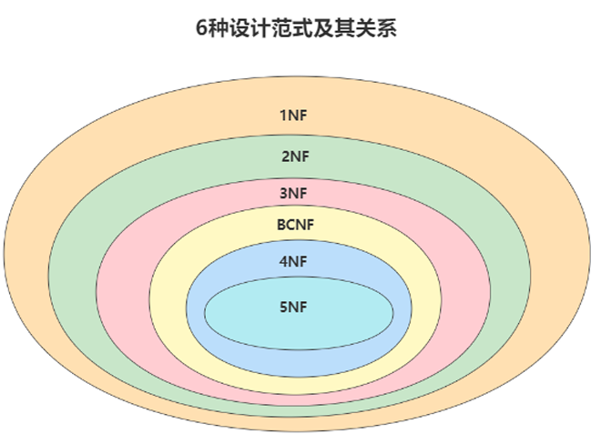


### 键和相关属性概念

范式的定义会用到主键和候选键，数据库中的键（key）由一个或者多个属性组成。数据库中常用的几种键和属性的定义：

* `超键`：能唯一标识元组的属性集叫做超键。
* `候选键`：如果超键不包含多余的属性，那么这个超键就是候选键。
* `主键`：用户可以从候选键中选择一个作为主键。
* `外键`：如果数据表R1中的某属性集不是R1的主键，而是另一个数据表R2的主键，那么这个属性集就是数据表R1的外键。
* `主属性`：包含在任意候选键中的属性称为主属性。
* `非主属性`：与主属性相对，指的是不包含在任何一个候选键中的属性。

通常，我们也将候选键称之为"`码`"，把主键也称为"`主码`"，因为键可能是由多个属性组成的，针对单个属性，我们还可以用主属性和非主属性来进行区分。

注意主键和主属性之间的区别，主键可能有多个列构成，主属性指的就是一个属性。

**举例**：
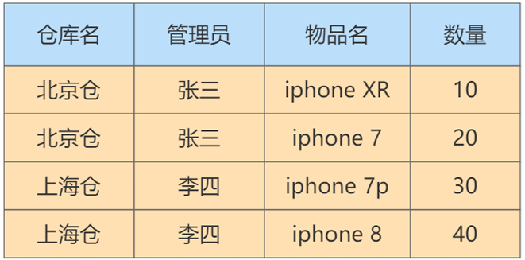

在这个表中，一个仓库只有一个管理员，同时一个管理员也只管理一个仓库。我们来梳理一下这些属性之间的依赖关系。

仓库名决定了管理员，管理员也决定了仓库名，同时（仓库名，物品名）的属性集合可以决定数量这个属性。这样，我们就可以找到数据表的候选键。

`候选键`：是（管理员，物品名）和（仓库名，物品名），


### 第一范式（1st NF）

第一范式主要是确保数据表中的每个字段的值必须具有**`原子性`**，也就是**`数据表中每个字段的值为不可再次拆分的最小数据单元`**。

我们在设计某个字段的时候，对于字段X来说，不能把字段X拆分成字段X-1和字段X-2.事实上，任何的DBMS都会满足第一范式的要求，不会将字段进行拆分。

> **判断是否符合第一范式的方式：**
>
> * **`属性是否还能分割。`**


**举例1：**

假设一家公司要存储员工的姓名和联系方式。它创建一个如下表：
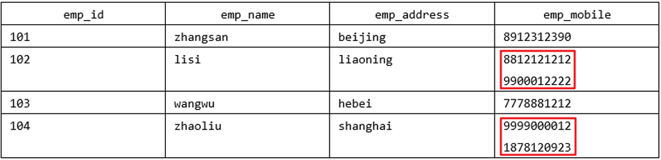

该表不符合1NF，因为规则说"表的每个属性必须具有原子（单个）值"，lisi和zhaoliu员工的emp_mobile值违反了该规则。为了使表符合1NF，我们应该有如下表数据：

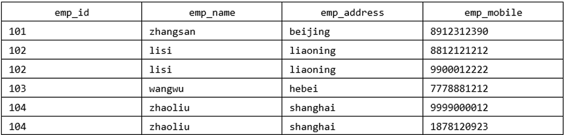


**举例2：**

user表的设计不符合第一范式


其中，user_info字段为用户信息，可以进一步拆分成更小粒度的字段，不符合数据库设计对第一范式的要求。将user_info拆分后如下：


**举例3：**

属性的原子性是`主观的`。

例如，Employees关系中雇员姓名应当使用1个(fullname)、2个(firstname和lastname)还是3个(firstname、middlename和lastname)属性表示呢？答案取决于应用程序。如果应用程序需要分别处理雇员的姓名部分（用于搜索目的），则有必要把它们分开。否则，不需要。


### 第二范式（2nd NF）

第二范式要求，在满足第一范式的基础上，还要满足：

**`数据表里的每一条数据记录，都是可唯一标识的（即拥有主键）。而且所有非主键字段，都只能主键的整体推出，通过主键的一部分是获取不到的。`**

即**非主属性不能部分依赖于候选键。**

这就是第二范式需要满足的要求，如果不满足第二范式，说明表不是一个独立的对象，需要将表拆分。

如果知道主键的所有属性的值，就可以检索到任何元组（行）的任何属性的任何值。（要求中的主键，其实可以扩展替换为候选键）


> **判断是否属于第二范式的方式：**
>
> * **`是否存在非主属性对候选键的部分依赖。`**


**举例1：**

`成绩表`（学号、课程号、成绩）关系中，（学号、课程号）可以决定成绩，唯一标识成绩，但是学号不能决定成绩，课程号也不能决定成绩，此时(学号、课程号)联合构成主键，（学号，课程号）-> 成绩就是完全依赖关系。


**举例2：**

`比赛表player_game`，里面包含球员编号、姓名、年龄、比赛编号、比赛时间、比赛场地和得分属性。我们要唯一标识表中的数据，那么就需要将(球员编号、比赛编号)字段合起来，共同组成一个主键。

我们可以通过主键来决定如下关系：

```
(球员编号，比赛编号) -> (姓名，年龄，比赛时间，比赛场地，得分)
```

但是这个表不满足第二范式，为什么？因为字段之间还有如下关系：

```
（球员编号）->（姓名，年龄）
（比赛编号）->（比赛时间，比赛场地）
```

即：非主属性字段，并非是完全依赖于主属性的，这里还可以依据主属性的一部分就可以得到，所以不满足于第二范式。第二范式要求表中的非主属性字段完全依赖于主属性。

这样会产生什么问题？

1. `数据冗余`：如果一个球员可以参加m场比赛，那么球员的姓名和年龄就重复了m-1次。一个比赛也可能会有n个球员参加，比赛的时间和地点就重复了n-1次。
2. `插入异常`：如果我们想要添加一场新的比赛，但是这时还没有确定参加的球员都有谁，那么就没法插入。
3. `删除异常`：如果我要删除某个球员编号，如果没有单独保存比赛表的话，就会同时把比赛信息删除掉。
4. `更新异常`：如果我们调整了某个比赛的时间，那么数据表中所有这个比赛的时间都需要进行调整，否则就会出现一场比赛时间不同的情况。

为了避免出现上述的情况，我们可以把球员比赛表设计为下面的三张表。


这样的话，每张数据表都符合第二范式，也就避免了异常情况的发生。

> INF告诉我们字段属性需要是原子性，而2NF告诉我们一张表就是一个独立的对象，一张表只表达一个意思。


**举例3：**

定义一个名为Orders的关系，表示订单和订单行的信息：

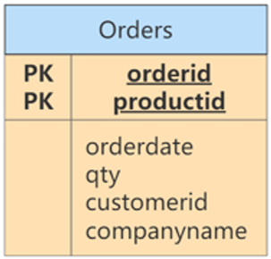

违反了第二范式，因为有非主键属性仅依赖于候选键（或主键）的一部分。例如，可以仅通过orderid找到订单的orderdate，以及customerid和companyname，而没有必要再去使用productid。

**如果存在非主属性部分依赖于主属性，就需要将这些非主属性和部分主属性抽取出来，使用一张新表来存储，保证表中的非主属性能够完全依赖于主属性。**

在这个例子中，就可以将orderid和orderdate、customerid、companyname这四个属性使用一张新表来存储，这样一来，新表中的非主属性就完全依赖于主属性orderid了。

修改：

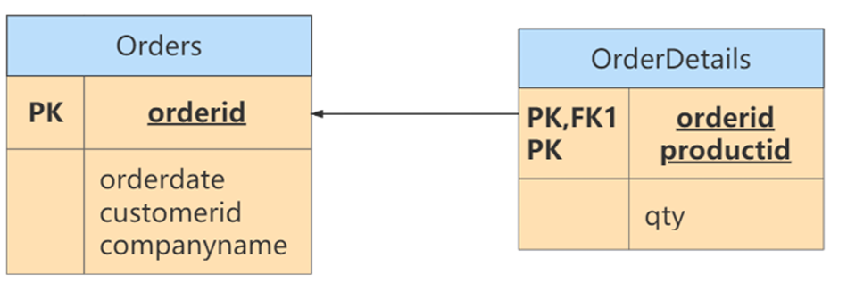

> 小结：第二范式（2NF）要求实体的属性完全依赖主关键字。如果不存在完全依赖，那么这个属性和主关键字的这一部分应该分离出来形成一个新的实体，新实体与元实体之间是一对多的关系。


### 第三范式（3rd NF）

第三范式是在第二范式的基础上，确保数据表中的每一个非主键字段和主键字段直接相关，也就是说，**`要求数据表中的所有非主键字段不能依赖于其他非主键字段`**。（即，不能存在非主属性A依赖于非主属性B，即存在A->B的决定关系），通俗来讲，该规则的意思是所有`非主键属性`之间不能有依赖关系，必须`相互独立`。

这里的主键可以拓展为候选键。


> **第三范式的判断方式：**
>
> * **`方式一：看非主属性之间是否存在依赖关系。`**
> * **`方式二：看非主属性是否传递依赖于主属性`**


**举例1：**

`部分信息表`：每个部门有部门编号、部门名称、部门简介等信息。

`员工信息表`：每个员工有员工编号、姓名、部门编号等信息。

上述两个表是符合第一、第二和第三范式的。因为姓名和部门编号之间不存在依赖关系；部门名称和部门简介之间也不存在依赖关系。

如果将部门名称添加到员工信息表中，由于此时在员工信息表中，部门名称可以依赖于非主属性部门编号，此时是不满足第三范式的。


**举例2：**

存在表：

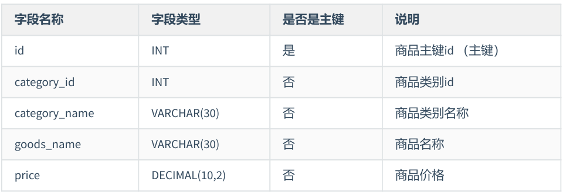

这个表是不满足第三范式的。因为商品的类别名称（非主键字段）能够根据商品类别id（非主键字段）直接获取。

修改：

表1：商品类型表


表2：商品表

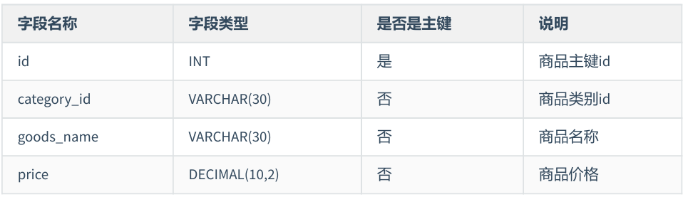

不满足第三范式时，也是采用拆分成多个表的形式进行解决。


**举例3：**

`球员表player表`：球员编号、姓名、球队名称和球队主教练。现在，我们把属性之间的依赖关系画出来，如下图所示：

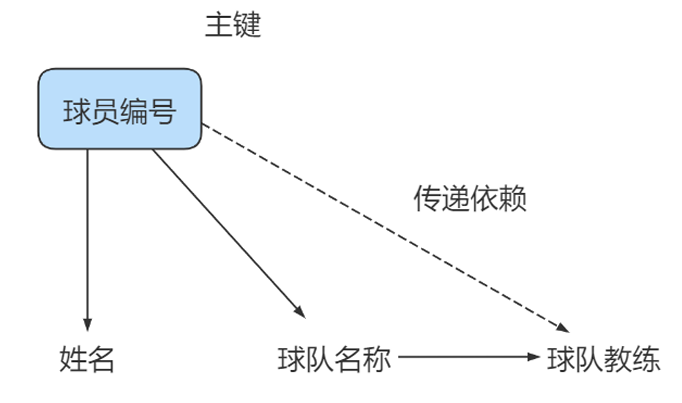

你能看到球员编号决定了球队名称，同时球队名称决定了球队主教练，非主属性球队主教练就会传递依赖于球员编号，因此不符合3NF的要求。

如果要达到3NF的要求，需要把数据表拆分成下面这样：


**举例4：**

修改第二范式中的举例3.

此时的Orders关系包含orderid、orderdate、customerid个companyname属性，主键定义为orderid。customerid和companyname均依赖于住建——orderid。例如，你需要通过orderid主键来查找代表订单中客户的customerid，同样，你需要通过orderid主键查找订单中客户的公司名称（companyname）。然而，customerid和companyname也是互相依靠的。为满足第三范式，可以改写如下：

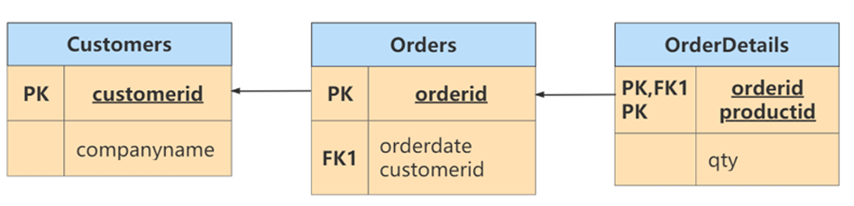

> 符合3NF后的数据模型通俗地讲，2NF和3NF通常以这句话概括：“每个非键属性依赖于键，依赖于整个键，并且除了键别无他物”。


### 总结

关于数据表的设计，有三个范式要遵循。

（1）**`第一范式（1NF）`**，确保每列保持`原子性`

数据库的每一列都是不可分割的原子数据项，不可再分的最小数据单元，而不能是集合、数组、记录等非原子数据项。

（2）**`第二范式（2NF）`**，确保每列都和主键`完全依赖`

尤其在复合主键的情况下，非主键部分不应该依赖于部分主键

（3）**`第三范式（3NF）`**确保每列都和主键列`直接相关`，而不是间接相关

**范式的优点**：数据的标准化有助于消除数据库中的`数据冗余`，第三范式（3NF）通常被认为在性能、扩展性和数据完整性方面达到了最好的平衡。

**范式的缺点**：范式的使用，可能`降低查询的效率`。因为范式等级越高，设计出来的数据表就越多、越精细，数据的冗余度就越低，进行数据查询的时候就可能需要`关联多张表`，这不但代价昂贵，也可能`使一些索引策略无效`。


范式只是提出了设计的标准，实际上设计数据表时，未必一定要符合这些标准。开发中，我们会出现为了性能和读取效率范围范式化的原则，通过该`增加少量冗余`或重复的数据来提高数据库的`读性能`，减少关联查询，join表的次数，实现`空间换取时间`的目的。因此在实际的设计过程中要理论结合实际，灵活运用。


## 2、反范式

### 概述

有的时候不能简单按照规范要求设计数据表，因为有的数据看似冗余，其实对业务来说十分重要。这个时候，我们就要遵循`业务优先`的原则，首先满足业务需求，再尽量减少冗余。

如果数据库中的数据量比较大，系统的UV和PV访问频次比较高，则完全按照MySQL的三大范式设计数据表，读数据时会产生大量的关联查询，在一定程度上会影响数据库的读性能。如果我们想对查询效率进行优化，**`反范式化`**也是一种优化思路。此时，可以通过在数据表中`增加冗余字段`来提高数据库的读性能。

### 应用举例

**案例1：**

员工信息存储在`employees`表中，部门信息存储在`departments`表中。通过employees表中的department_id字段与departments表建立关联关系。如果要查询一个员工所在部门的名称：

```sql
select employee_id, department_name
FROM employees e join departments d
ON e.department_id = d.department_id;
```

如果我们经常需要去查询department_name的属性，并且employees表中的数据很多的时候，这个时候我们就可以考虑在employees表中增加一个department_name的字段，这样就减少了关联查询的次数，提高了效率。此时是不满足第三范式的。


**案例2：**

我们有2个表，分别是`商品流水表`和`商品信息表`。商品流水表里有400万条流水记录，商品信息表里有2000条商品记录。

商品流水表：

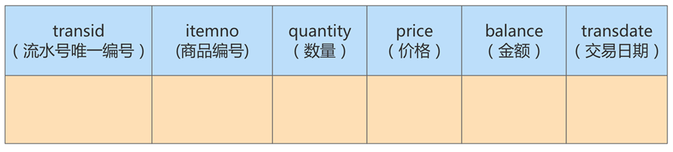

商品信息表：

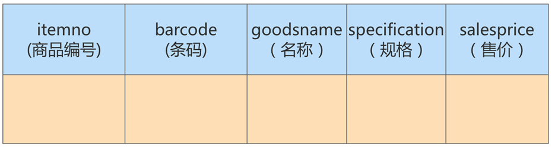

两个表是符合第三范式要求的。但是，在我们项目的实施过程中，对流水的查询频率很高，而且为了获取商品名称，基本都会用到与商品信息表的连接查询。

为了减少连接，我们可以直接把商品名称字段加到流水表里面。这样一来，我们就可以直接从流水表中获取商品名称字段了。虽然增加了冗余字段，但是避免了关联查询，提升了查询的效率。

新的商品流水表如下所示：

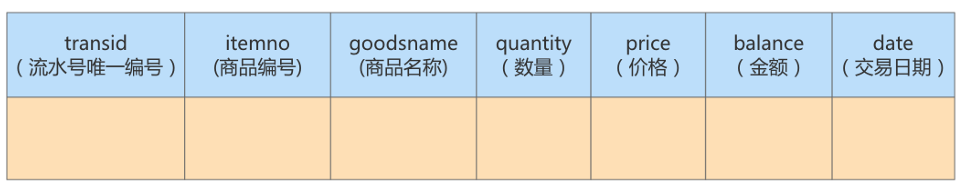


**案例3：**我们来看看具体的案例，看看反范式化对效率的影响

`课程评论表class_comment`，对应的字段名称及含义如下所示：

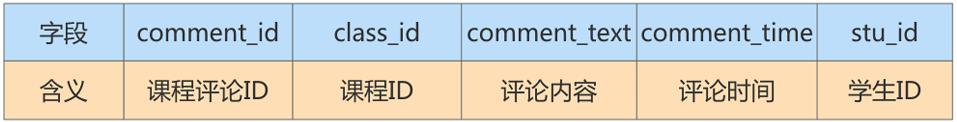

`学生表student`，对应的字段名称及含义如下：


在实际应用中，我们在显示课程评论的时候，通常会显示这个学生的昵称，而不是学生ID，因此当我们想要查询某个课程的前1000条评论时，需要关联class_comment和student这两张表来进行查询。

**实验数据：模拟两张百万量级的数据表**

为了更好地进行SQL优化实验，我们需要给学生表和课程评论表随机模拟出百万量级的数据。使用存储过程来实现模拟。

**反范式优化实验对比**

如果我们想要查询课程ID为10001的前1000条评论，需要写成下面这样：

```sql
SELECT p.comment_text, p.comment_time, stu.stu_name
FROM class_comment AS p LEFT JOIN student AS stu
ON p.stu_id = stu.stu_id
WHERE p.class_id = 10001
ORDER BY p.comment_id DESC
LIMIT 1000;
```

运行结果：

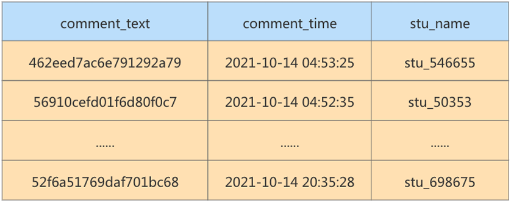

运行时长为0.395s，对于网站的响应来说，这已经非常慢了，用户体验会非常差。

如果我们想要提升查询的效率，可以运行适当的数据冗余，也就是在商品评论表中增加用户昵称字段，在class_comment数据表的基础上增加stu_name字段，就得到了class_comment2数据表。

这样一来，只需要表查询就可以得到数据集结果：

```sql
SELECT comment_text, comment_time, stu_name
FROM class_comment2
WHERE class_id = 10001
ORDER BY class_id DESC LIMIT 1000;
```

运行结果：

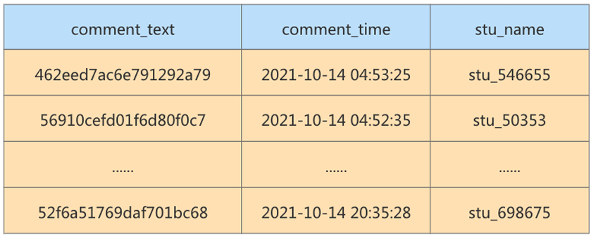

优化之后只需要扫描一次聚簇索引即可，运行时间为0.039s，查询时间是之前的1/10。可以看到，在数据量大的情况下，使用反范式化，查询效率会有显著的提升。


### 反范式出现的新问题

* 存储空间`占用变大`了
* 一个表中字段做了修改，另一个表中的冗余字段也需要做同步修改，否则`数据不一致`。
* 若采用存储过程来支持数据的更新、删除等额外操作，如果更新频繁，会非常消耗系统资源。
* 在数据量小的情况下，反范式化不能体现性能的优势，可能还会让数据库的`设计更加复杂`。

### 反范式的适用场景

当冗余信息有价值或者能大幅度提高查询效率的时候，我们才会采取反范式的优化。

**1、增加冗余字段的建议**

增加冗余字段一定要符合如下两个要求。只有满足这两个条件，才可以考虑增阿基冗余字段。

1）`不需要经常进行修改`；

2）`查询的时候不可或缺`。

**2、历史快照、历史数据的需要**

在现实生活中，我们经常需要一些冗余信息，比如订单中的收货人信息，包括姓名、电话和地址等。每次发生的订单收货信息都属于`历史快照`，需要进行保存，但用户可以随时修改自己的信息，这时保存这些冗余信息是非常有必要的。

反范式化页常用在`数据仓库`的设计中，因为数据仓库通常存储历史数据，对增删改的实时要求不强，对历史数据得到分析需求强。这时适当允许数据的冗余度，更方便进行数据分析。

我简单总结下数据仓库和数据库在使用上的**区别**：

1. 数据库设计的目的是在于`捕获数据`，而数据仓库设计的目的在于`分析数据`。

2. 数据库对数据的`增删改实时要求强`，需要存储在线的用户数据，而数据仓库一般存储的是`历史信息`；
3. 数据库设计需要`尽量避免冗余`，但为了提高查询效率也允许一定的冗余度，而数据仓库在设计上更偏向`采用反范式设计`。


## 3、BCNF（巴斯范式）

**巴斯范式**，实际上就是要求**`表中的候选键只有一个或者候选键都是单属性`**。即：**`主属性对候选键不存在部分依赖或者传递依赖关系`**。

人们在3NF的基础上进行了改进，提出了巴斯范式，也叫作**巴斯-科德范式**（BCNF）。BCNF被认为没有新的设计规范加入，只是对第三范式中设计规范要求更强，使得冗余度更小。所以，被称为是`修正的第三范式`，或`扩充的第三范式`，BCNF不能被称为第四范式。

若一个关系达到了第三范式，并且它只有一个候选键，或者它的每个候选键都是单属性，则该关系自然达到BCNF。

一般来说，一个数据库设计符合3NF或者BCNF就可以了。


> **判断是否符合巴斯范式的方式：**
>
> * **`方式一：候选键是否只有一个或者候选键是否都是单属性。`**
> * **`方式二：看主属性对候选键是否存在部分依赖关系`**


* **案例1：**
  我们分析如下表的范式情况：

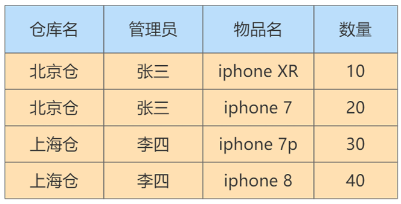

在这个表中，一个仓库只有一个管理员，同时一个管理员也只能管理一个仓库。我们先来梳理一下这些属性之间的依赖关系。

仓库名决定了管理员，管理员也决定了仓库名，同时（仓库名, 物品名）的属性集合可以决定数量这个属性。这样，我们就可以找到数据表的候选键。

`候选键`：是（管理员，物品名）和（仓库名，物品名），然后我们从候选键中选择一个作为主键，比如（仓库名，物品名）。

`主属性`：包含在任一个候选键中的属性，也就是仓库名，管理员名和物品名。

`非主属性`：只有数量这个属性。

**是否符合三范式？**

如何判断一张表的范式呢？我们需要根据范式的等级，从低到高来进行判断。

首先，数据表每个属性都是原子性的，符合INF的要求；

其次，数据表中非主属性“数量”都与候选键全部依赖，（仓库名，物品名）决定数量，（管理员，物品名）决定数量。因此，数据表符合2NF的要求；

最后，数据表中的非主属性，不传递依赖于候选键。因此符合3NF的要求。非主属性之间不存在依赖关系。

**存在的问题**

既然数据表已经符合了3NF的要求是，是不是就不存在问题了呢？我们来看下面的情况：

1. 增加一个仓库，但是没有存放任何物品。此时的物品名就应该是空的，但是根据数据表完整性的要求，主键不能有空值，因此会出现`插入异常`。
2. 如果仓库更换了管理员，我们就可能会`修改数据表中的多条记录`；
3. 如果仓库里的商品都卖空了，那么此时仓库名称和相应的管理员名称也会随之删除。

可以看到，即便数据表符合3NF的要求，可能还会存在插入、更新和删除数据异常情况。

**问题解决**

造成异常的原因：主属性仓库对候选键（管理员，物品名）之间是部分依赖的关系，第二范式只解决了非主属性对候选键的部分依赖问题，BCNF解决的是主属性对候选键之间的部分依赖问题，

在该例中，管理员、物品名以及仓库名都属于主属性，其中仓库名与管理员之间存在着依赖关系，并且仓库名与物品名之间构成候选键，那么此时也就是说，管理员（主键）部分依赖于候选键（仓库名），此时是不符合巴斯范式的。

**`引入BCNF，它在3NF的基础上消除了主属性对候选键的部分依赖或者传递依赖关系。`**

* 如果在关系R中，U为主键，A属性是主键的一个属性，若存在A->Y，Y为主属性，则该关系不属于BCNF。

根据BCNF的要求，我们需要把仓库管理关系表拆分成下面这样：

仓库表：（仓库名, 管理员）

库存表：（仓库名，物品名，数量）

这样就不存在主属性对于候选键的部分依赖或传递依赖。


* **案例2：**

有一个学生导师表，其中包含字段：学生ID，专业，导师，专业GPA，这其中学生ID和专业是联合主键。

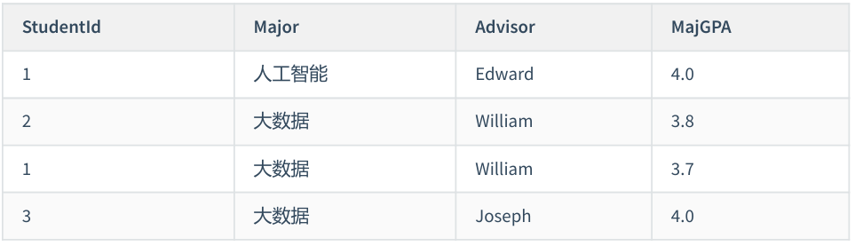

我们来看看这个表示是否符合三范式以及巴斯范式。

首先，这个表中存在着一个依赖关系：即一个导师只教一个专业，那么我们就可以得出：导师 -> 专业。

我们可以通过

`候选键`：(学生ID，专业)，（学生ID，导师）

`主属性`：学生ID、导师、专业

`非主属性`：专业GPA。

肯定是符合第一范式的。

第二范式：非主属性专业GPA都是完全依赖于两个候选键的，无法根据其中一个主属性就可以得出，符合。

第三范式：非主属性只有一个，不存在相互依赖的关系。

即上表符合三范式。

巴斯范式：由于主属性专业，可以依赖于主属性导师推出，导师属于候选键的一部分，所以是不符合巴斯范式的。（也可以根据存在两个候选键，并且两个候选键都由两个列构成得出）

所以上表不符合巴斯范式。

我们可以进行以下的调整，拆分成2个表：

学生导师表：

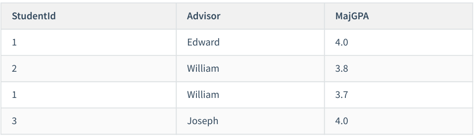

导师表：


## 4、第四、第五范式和域键范式（一般不使用）

## 5、实战案例

商超进货系统中的进货单表进行剖析：

进货单表：
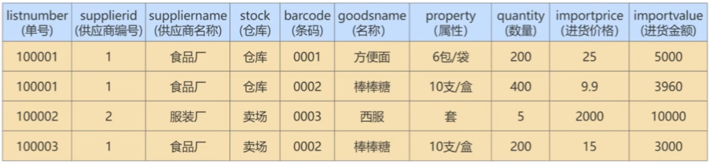

这个表中的字段很多，表里的数据也很惊人。大量重复导致表变得庞大，效率极低。如何改造？

> 在实际工作场景中，这种由于数据表结构设计不合理，导致数据重复的现象并不少见。往往是系统虽然能够运行，承载能力却很差，稍微有些流量，就会出现内存不足，CPU使用率上升的情况，甚至会导致整个项目失败。

### 迭代一次：考虑1NF

第一范式要求：**`所有的字段都是基本数据字段，不可1进一步拆分`**。这里需要确认，所有的列中，每个字段只包含一种数据。

在这张表中，我们把property这一字段，拆分成specification（规格）和unit（单位）。这2个字段如下：

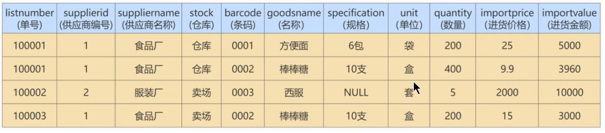


### 迭代2次：考虑2NF

第二范式要求，在满足第一范式的基础上，还要满足**`数据表里的每一条数据记录，都是可唯一标识的。而且所有字段，都必须完全依赖主键，不能只依赖主键的一部分`**。

* 第一步，就是要确定这个表的主键。通过观察发现：

单号确定了，那么供应商编号、供应商名称和仓库就确定了。

条码确定了，那么名称、规格和单位都确定了。

最后三个字段的数量、进货价格和进货金额则是根据单号和条码共同决定的。

那么主键就是（单号，条码），是联合索引

* 第二步，判断当前表是否满足第二范式：

由于供应商、供应商名称、仓库三个字段根据单号就能够确定；

名称、规格、单位三个字段根据条码就能够确定。

它们依赖的都是主键的一部分，而不是主键整体，所以是不满足第二范式的。

* 第三步，对表进行改造，将表拆分成三个表，分别是进货单头表、进货单明细表以及商品信息表：

进货单头表：

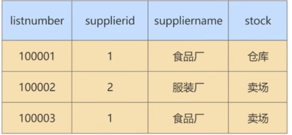

进货单明细表：

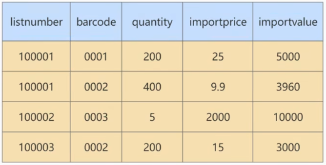

商品信息表：

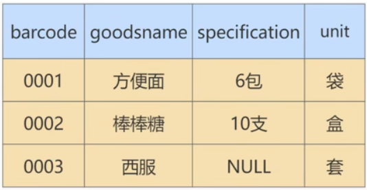

注意，在"商品信息表"中，字段barcode是有可能重复的。比如，用户门店可能有散装称重商品和自产商品，会存在条码共用的情况。所以，所有的字段都不能唯一标识表里的记录。这个时候，我们必须要给这个表加上一个主键，比如说是自增字段itemnumber。

此时，我们就可以把进货单明细表里面的字段barcode都替换成字段iternumber，得到了一个新的表：

进货单头表：


进货单明细表：

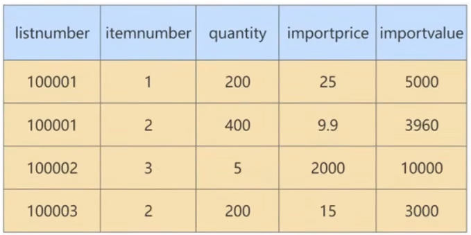

商品信息表：

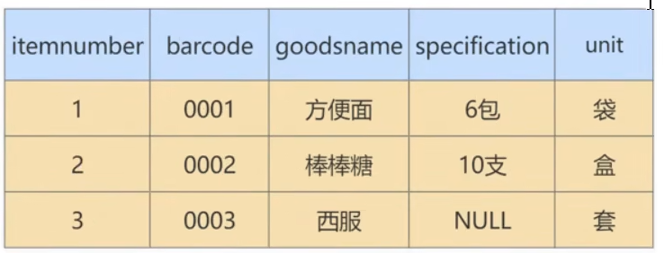

此时，拆分出来的三个表都满足第二范式的要求。


### 迭代3次：考虑3NF

考虑是否符合第三范式，就是看**`非主属性之间是否存在依赖关系`**。

**我们先来考虑进货单头表是否存在依赖关系**：


这个表中，主属性是listnumber（单号），非主属性有supplierid（供应商编号）、suppliername（供应商名称）以及stock（仓库），其中suppliername与supplierid之间存在依赖关系，所以是不满足第三范式的。

那我们就需要对进货单头表进行拆分，拆分成供应商表和进货单头表：

供应商表与进货单头表：

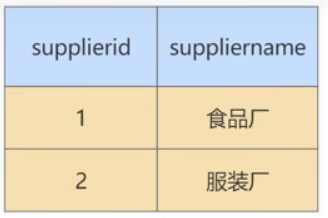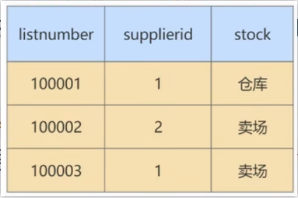

**接着来考虑商品信息表是否存在非主属性之间的依赖关系：**

 

itemnumber商品编号是主属性，barcode条码、goodsname商品名称、specification规格和unit单位之间都是完全依赖于商品编号的，无法根据依据其他字段推出，满足第三范式。

**最后来考虑进货单明细表是否存在非主属性之间的依赖关系：**

 

listnumber和itemnumber两个属性共同构成表中的主键

quantity和importprice两个字段完全依赖于主键，并且相互之间不构成依赖关系

importvalue是quantity * importprice计算得出，依赖于这两个非主属性，所以是不满足第三范式要求的。

但是，这里不对其改造，具体原因请接着往下看。


### 反范式化：业务优先原则

在进货单明细中，quantity * importprice = importvalue，importprice、quantity和importvalue这三个字段都可以通过任意两个计算出第三个来，这就存在冗余字段。如果严格按照第三范式的要求，现在我们应该进一步优化。优化的办法是删除其中其中一个字段，只保留另外2个，这样就没有冗余数据了。

可是，真的可以这样做吗？要回答这个问题，我们需要了解实际工作中的`业务优先原则`。

所谓的业务优先原则，就是指一切以业务需求为主，技术服务于业务。**`完全按照理论的设计不一定就是最优，还要根据实际情况来决定。`**这里我们就来分析一下不同选择的利与弊。

对于quantity × importprice = importvalue，看来importvalue似乎是冗余字段。可是，如果我们把这个字段取消，是会影响业务的。

因为有的时候，供应商会经常进行一些促销活动，按金额促销，实际付的金额和通过quantity × importprice是不一致的。所以，考虑到现实中业务的需求，需要将该字段保留。

因此，最后我们可以把进货单表拆分成下面4个表：

供货商表：


进货单头表：


进货单明细表：


商品信息表：


## 6、ER模型

数据库设计是牵一发而动全身的。那有没有什么办法提前看到数据库的全貌呢？比如需要哪些数据表、数据表中应该有哪些字段，数据表与数据表之间有什么关系、通过什么手段进行连接等等。这样我们才能进行整体的梳理和设计。

其实，ER模型就是一个这样的工具。ER模型也叫作`实体关系模型`，是用来描述现实生活中客观存在的事物、事物的属性，以及事物之间关系的一种数据模型。**`在开发基于数据库的信息系统的设计阶段，通常使用ER模型来描述信息需求和信息特性，帮助我们理清业务逻辑，从而设计出优秀的数据库。`**

### ER模型包括哪些要素？

**`ER模型中有三个要素，分别是实体、属性和关系。`**

`实体`，可以看作是数据对象，往往对应于现实生活中的真实存在的个体。在ER模型中，用`矩形`来表示。实体分为两类，分别是`强实体`和`弱实体`。强实体是指不依赖于其他实体的实体；弱实体是指对另一个实体有很强的依赖关系的实体。

`属性`，则是指实体的特性。比如超市的地址、联系电话、员工数等。在ER模型中用`椭圆形`来表示。

`关系`，则是指实体之间的联系。比如超市把商品卖给顾客，就是一种超市与顾客之间的联系。在ER模型中用`菱形`来表示。

注意：实体和属性不容易区分。这里提供一个原则：我们要从系统的整体角度出发去看，**可以独立存在的是实体，不可再分的是属性**。也就是说，属性不能包含其他属性。

### 关系的类型

在ER模型的3个要素中，关系又可以分为3种类型：分别是一对一、一对多、多对多。

`一对一`：指实体之间的关系是一一对应的，比如个人与身份证信息之间的关系就是一对一的关系。一个人只能有一个身份证信息，一个身份证信息也只属于一个人。

`一对多`：指一边的实体通过关系，可以对应多个另外一边的实体。相反，另外一边的实体通过这个关系，则只能对应唯一的一边的实体。比如说，我们新建一个班级表，而每个班级都有多个学生，每个学生则对应一个班级，班级对学生就是一对多的关系。

`多对多`：指关系两边的实体都可以通过关系对应多个对方的实体。比如在进货模块中，供货商与超市之间的关系就是多对多的关系，一个供货商可以给多个超市供货，一个超市也可以从多个供货商那里采购商品。再比如一个选课表，有很多科目，每个科目有很多学生选，而每个学生又可以选择多个科目，这就是多对多的关系。


### 建模分析

ER模型看起来比较麻烦，但是对我们把控项目整体非常重要。如果你只是开发一个小应用，或许简单设计几个表够用了，一旦要设计有一定规模的应用。在项目的初始阶段，建立完整的ER模型就非常关键了。开发应用项目的实质，其实就是`建模`。

我们设计的案例是电商业务，由于电商业务太过庞大且复杂，所以我们做了业务简化，比如针对SKU（库存量单位）和SPU（标准化产品单元）的含义上，我们直接使用了SKU，并没有提及SPU的概念。本次电商业务涉及总共有8个实体，如下所示：

* 地址实体
* 用户实体
* 购物车实体
* 评论实体
* 商品实体
* 商品分类实体
* 订单实体
* 订单详情实体

其中，`用户`和`商品分类`是强实体，因为它们不需要依赖其他任何实体。而其他属于弱实体，因为它们虽然都可以独立存在，但是它们都依赖用户这个实体，因此都是弱实体。知道了这些要素，我们就可以给电商业务创建ER模型了，如图：

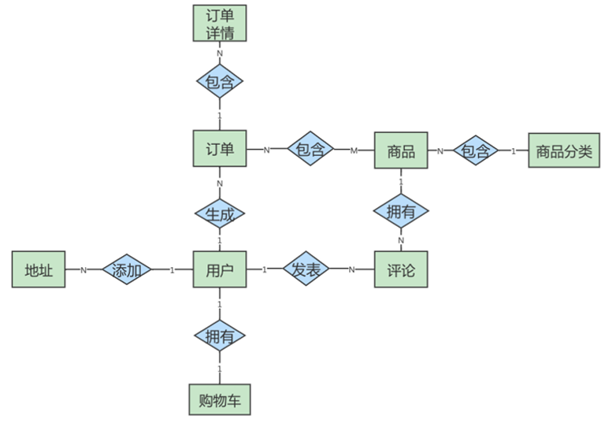

在这个图中，地址和用户之间添加关系，是一对多的关系，而商品和商品详情一对一的关系，商品和订单是多对多的关系。这个ER模型，包括了8个实体之间的8种关系。

（1）用户可以在电商平台添加多个地址；

（2）用户只能拥有一个购物车；

（3）用户可以生成多个订单；

（4）用户可以发表多条评论；

（5）一件商品可以有多条评论；

（6）每一个商品分类包含多种商品；

（7）一个订单可以包含多个商品，一个商品可以在多个订单里。

（8）订单中又包含多个订单详情，因为一个订单中可能包含不同种类的商品


### ER模型的细化

有了这个ER模型，我们就可以从整体上理解电商业务了。刚刚的ER模型展示了电商业务的框架，但是只包括了订单，地址，用户，购物车，评论，商品，商品分类和订单详情这八个实体，以及它们之间的关系，还不能对应到具体的表，以及表与表之间的关联。我们需要把属性加上，用椭圆来表示，这样我们得到的ER模型就更加完整了。

因此，我们需要进一步去设计一下这个ER模型的各个局部，也就是细化下电商的具体业务流程，然后把它们综合到一起，形成一个完整的ER模型。这样就可以帮助我们理清数据库的设计思路。

接下来，我们再分析一下各个实体都有哪些属性，如下所示：

（1）`地址实体`包括用户编号、省、市、地区、收件人、联系电话、是否是默认地址。 

（2）`用户实体`包括用户编号、用户名称、昵称、用户密码、手机号、邮箱、头像、用户级别。 

（3）`购物车实体`包括购物车编号、用户编号、商品编号、商品数量、图片文件url。 

（4）`订单实体`包括订单编号、收货人、收件人电话、总金额、用户编号、付款方式、送货地址、下单 时间。 

（5）`订单详情`实体包括订单详情编号、订单编号、商品名称、商品编号、商品数量。 

（6）`商品实体`包括商品编号、价格、商品名称、分类编号、是否销售，规格、颜色。 

（7）`评论实体`包括评论id、评论内容、评论时间、用户编号、商品编号 

（8）`商品分类实体`包括类别编号、类别名称、父类别编号

这样细分之后，我们就可以重新设计电商业务了，ER模型如图：

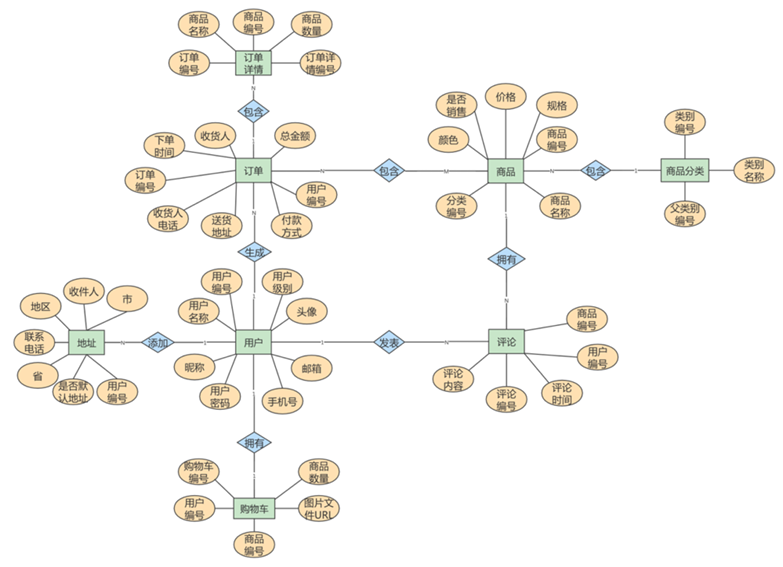


### ER模型图转换成数据表

> 通过绘制ER模型，我们已经理清了业务逻辑，现在就要进行非常重要的一步了：把绘制好的ER模型，转换成具体的数据表，下面介绍下**转换的原则：**
> （1）一个`实体`通常转换成一个`数据表`；
>
> （2）一个`多对多的关系`，通常页转换成一个`数据表`；
>
> （3）一个`1对1`，或者`1对多`的关系，往往通过表的`外键`来表达，而不是设计一个新的数据表；
>
> （4）`属性`转换成表的`字段`。

**`根据ER模型创建数据库表时，先去创建强实体`**，因为强实体不依赖于任何实体，可以自己独立地创建，不需要考虑字段是否依赖于其他实体中的字段，从而需要创建外键信息。

**`创建完强实体后，再去创建弱实体。`**

其实，任何一个基于数据库的应用项目，都可以通过这种`先建立ER模型，再转换成数据表`的方式，完整数据库的设计工作。创建ER模型不是目的，目的是把业务逻辑梳理清楚，设计出优秀的数据库。

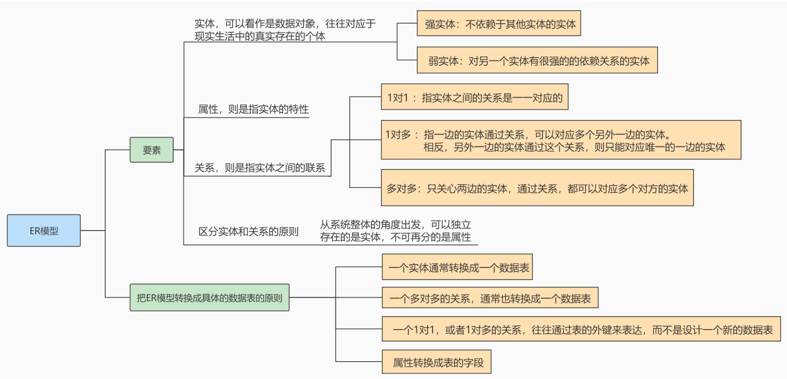


## 7、数据库对象编写建议

### 关于库

1. 【强制】库的名称必须控制在32个字符以内，只能使用英文字母、数字和下划线，建议以英文字母开头。

2. 【强制】库名中英文`一律小写`，不同单词采用`下划线`分割。须见名知意。

3. 【强制】库的名称格式：业务系统名称_子系统名。

4. 【强制】库名进制使用关键字（如type，order等）

5. 【强制】创建数据库时必须`显示指定字符集`，并且字符集只能是utf8或者utf8mb4。

   创建数据库SQL举例：CREATE DATABASE crm_fund DEFAULT CHARSET SET 'utf8';

6. 【建议】对于程序连接数据库账号，遵循权限最小原则

   使用数据库账号只能在一个DB下使用，不准跨库。程序使用的账号`原则上不准有drop权限`。

7. 【建议】临时库以`tmp_`为前缀，并以日期为后缀；

   备份库以`bak_`为前缀，并以日期为后缀。


### 关于表、列


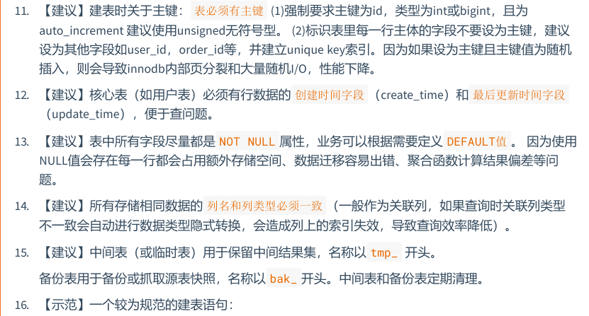

```sql
CREATE TABLE user_info (
 	`id` int unsigned NOT NULL AUTO_INCREMENT COMMENT '自增主键',
 	`user_id` bigint(11) NOT NULL COMMENT '用户id',
 	`username` varchar(45) NOT NULL COMMENT '真实姓名',
 	`email` varchar(30) NOT NULL COMMENT '用户邮箱',
 	`nickname` varchar(45) NOT NULL COMMENT '昵称',
 	`birthday` date NOT NULL COMMENT '生日',
	 `sex` tinyint(4) DEFAULT '0' COMMENT '性别',
	 `short_introduce` varchar(150) DEFAULT NULL COMMENT '一句话介绍自己，最多50个汉字',
	 `user_resume` varchar(300) NOT NULL COMMENT '用户提交的简历存放地址',
 	`user_register_ip` int NOT NULL COMMENT '用户注册时的源ip',
 	`create_time` timestamp NOT NULL DEFAULT CURRENT_TIMESTAMP COMMENT '创建时间',
 	`update_time` timestamp NOT NULL DEFAULT CURRENT_TIMESTAMP ON UPDATE CURRENT_TIMESTAMP COMMENT '修改时间',
 	`user_review_status` tinyint NOT NULL COMMENT '用户资料审核状态，1为通过，2为审核中，3为未通过，4为还未提交审核',
 PRIMARY KEY (`id`),
 UNIQUE KEY `uniq_user_id` (`user_id`),
 KEY `idx_username`(`username`),
 KEY `idx_create_time_status`(`create_time`,`user_review_status`)
) ENGINE=InnoDB DEFAULT CHARSET=utf8 COMMENT='网站用户基本信息'
```


### 关于索引

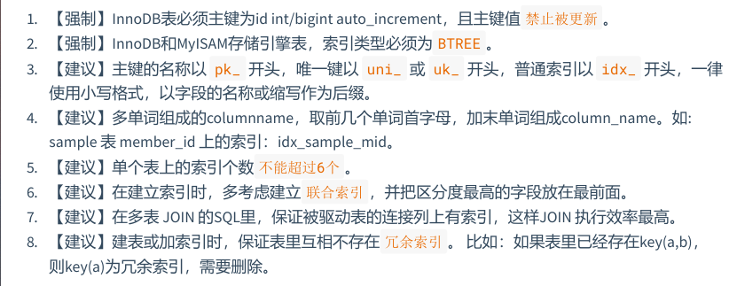


### SQL编写

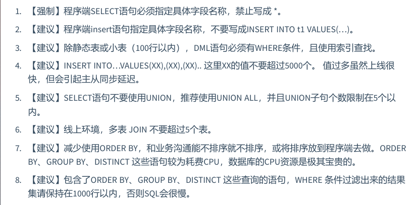

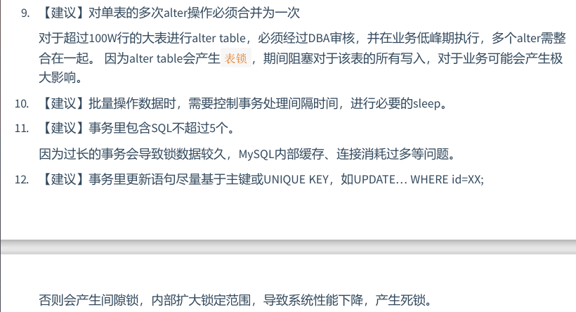


