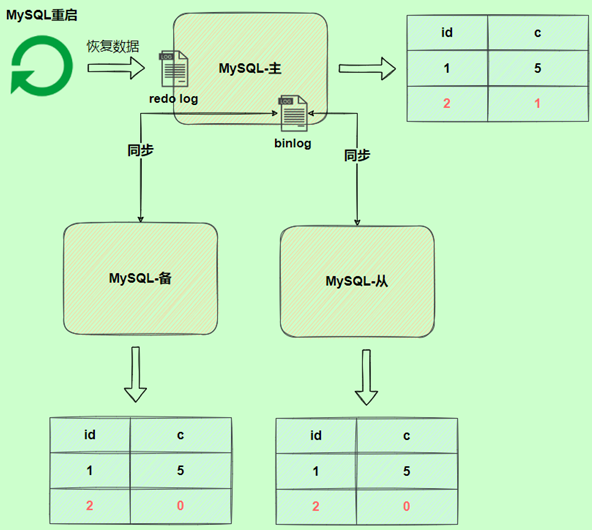
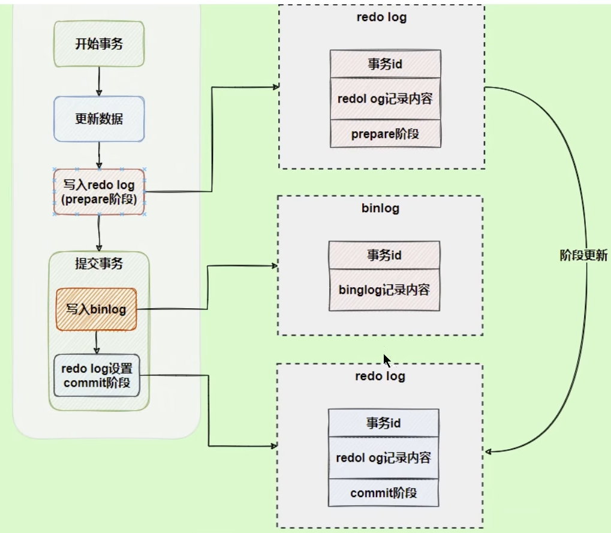
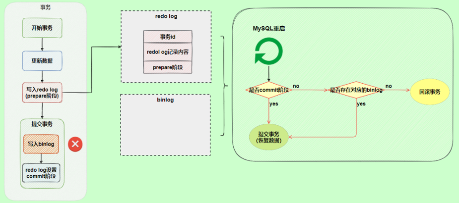

[TOC]


# 一、事务基础知识

## 1、数据库事务概述

### 存储引擎支持情况

**`只有InnoDB是支持事务的。`**

我们可以使用`SHOW ENGINES`命令来查看当前MySQL支持的存储引擎有哪些，以及这些存储引擎是否支持事务。


能看出在MySQL中，只有InnoDB是支持事务的。


### 基本概念

**`事务：`**是**一组逻辑操作单元**。使数据从一种状态变换到另一种状态。

**`事务处理的原则：`**

保证所有事物都作为`一个工作单元`来执行，即使出现了故障，都不能改变这种执行方式。当在一个事务中执行多个操作时，要么所有的事务都被提交（`commit`），那么这些修改就`永久`地保存下来；要么数据库管理系统将`放弃`所作的所有修改，整个事务回滚（`rollback`）到最初状态。

例如：AA用户给BB用户转账100

这里面涉及到了两个SQL操作：

```sql
update account set money = money - 100 where name = 'AA';

update account set money = money + 100 where name = 'BB';
```

这两步SQL实际上是一个事务，即AA用户给BB用户转账100是一个整体的操作，这两步操作必须要么全部执行完，要么全都回归到最初状态。


### 事务的ACID特性

#### **`原子性atomicity`**

**原子性是指事务是一个不可再分割的工作单位，要么全部提交，要么全部失败回滚。**即要么转账成功，要么转账失败，是不存在中间的状态。如果无法保证原子性怎么办？就会出现数据不一致的情况，A账户减去100元，而B账户增加100元失败，系统将丢失100元。


#### **`一致性consistency`**

指的是：事务的数据保持一致性。

**一致性是指事务执行前后，数据从一个`合法性状态`变换到另一个`合法性状态`。**

我们之前所学习的SQL语句的合法性，指的是SQL语句在语法上是要合法的，但是这里所说的合法指的是在`语义上`是合法的，语义的合法与具体的业务有关。

那什么是合法的数据状态呢？满足`预定的约束`的状态就叫做合法的状态。通俗一点，这状态是由你自己来决定的（比如满足现实世界中的约束）。满足这个状态，数据就是一致的，不满足这个状态，数据就是不一致的。如果事务中的某个操作失败了，系统就会自动撤销当前正在执行的事务，返回到事务操作之前的状态。

**举例1**：A账户有200元，转账300元出去，此时A账户余额外-100元。就会发现此时数据是不一致的，为什么？因为你定义了一个状态，余额必须>=0.

**举例2**：A账户200元，转账50元给B账户，A账户的钱扣了，但是B账户因为各种意外，余额并没有增加。此时数据是不一致的，为什么？因为你定义了一个状态，要求A+B的总余额必须不变。

**举例3：**在数据表中我们将姓名字段设置为唯一性约束，这时当事务进行提交或者事务发生回滚的时候，如果数据表中的姓名不唯一，就破坏了事务的一致性要求。


#### **`隔离性isolation`**

**事务的隔离性是指一个事务的执行`不能被其他事务干扰`，即一个事务内部的操作及使用的数据对`并发`的其他事务是隔离的，并发执行的各个事务之间不能互相干扰。**

如果无法保证隔离性会怎么样？假设A账户有200元，B账户0元。A账户往B账户转账两次，每次金额为50元，分别在两个事物中执行。以下是转账一次会执行的操作：

```sql
UPDATE accounts SET money = money - 50 WHERE name = 'AA';

UPDATE accounts SET money = money + 50 WHERE name = 'BB';
```

执行第一次转账步骤：

1、从磁盘上将A账号的余额读取到内存的变量A中，A为200；

2、在内存中执行操作A=A-50，A为150；

3、将A的值写回到磁盘上；

4、从磁盘上将B账户的余额读取到变量B中，B为0；

5、执行操作B=B+50，B为50

此时的B，还没有写回到磁盘中，仅仅保存在内存中，假如无法保证隔离性，有可能会出现：B未将数据写回到磁盘上，此时就执行第二次转账的步骤：

1、从磁盘上将A账号的余额读取到内存的变量A'中，A'为150；

2、在内存中执行操作A'=A'-50，A'为100；

3、将A'的值写回到磁盘上；

4、从磁盘上将B账户余额读取到变量B'中，此时B'的值为0;

5、执行操作B'=B'+50

6、将B'的值写回磁盘

此时，B账户的余额是50

执行完上述的步骤以后，再去执行第一步操作中，将B数据写回磁盘的操作，即：将50写回B账户的余额，B账户的余额是50。

这就是当两步更新SQL操作不是一个整体事务时，可能会出现的异常情况，下图是上面过程的图解：


#### **`持久性durability`**

**持久性是指一个事务一旦被提交，它对数据库中的数据的改变就是`永久性的`，接下来的其他操作和数据库故障不应该对其有任何影响。**

即：当事务提交之后，修改就是永久的了，无法通过rollback回滚操作回到之前的状态。

持久性是通过`事务日志`来保证的。日志包括了`重做日志`和`回滚日志`。当我们通过事务对数据进行修改的似乎，首先会将数据库的变化信息记录到重做日志中，然后再对数据库中对应的行进行修改。这样做的好处是，即使数据库系统崩溃，数据库重启后也能够找到没有更新到数据库系统中的重做日志，重新执行，从而使事务具有持久性。


> 总结：
>
> ACID是事务的四大特性，在这四个特性中，原子性是基础，隔离性是手段，一致性是约束条件，而持久性是我们的目的。


### 事务的状态

我们现在知道事务是一个抽象的概念，它其实对应着一个或多个数据库操作，MySQL根据这些操作所执行的不同阶段把事务大致划分成几个状态：

* **`活动的（active）`**

  事务对应的数据库操作`正在执行过程中`时，我们就说该事物处在活动的状态。

* **`部分提交的（partially committed）`**

  当事务中的最后一个操作执行完成，但由于操作都在内存中执行，所造成的影响并`没有刷新到磁盘`时，我们就说该事物处在部分提交的状态。

* **`失败的（failed）`**

  当事务处于`活动的`或者`部分提交的`状态时，可能遇到了某些错误（数据库自身的错误、操作系统错误或者直接断电等）而无法继续执行，或者人为的停止当前事务的执行，我们就说该事务处于失败的状态。

* **`中止的（aborted）`**

  如果事务执行了一部分而变为`失败的`状态，那么就需要把已经修改的事务中的操作还原到事务执行前的状态。换句话说，就是要撤销失败事务对当前数据库造成的影响。我们把这个撤销的过程称之为`回滚`。当回滚操作执行完毕时，也就是数据库恢复到了执行事务之前的状态，我们就说该事务处在了`中止的`状态。

* **`提交的（commited）`**

  当一个处在部分提交的状态的事务将修改过的数据`同步到磁盘`上之后，我们就可以说该事务处在了提交的状态。

一个基本的状态转换图如下所示：


图中可见，**只有当事务处于`提交的`或者`中止的`状态时，一个事务的生命周期才算是结束了**。对于已经提交的事务来说，该事务对数据库所做的修改将永久生效，对于处于中止状态的事务，该事务对数据库所做的所有修改都会被回滚到没执行该事务之前的状态。


## 2、如何使用事务

> **当执行到DDL语句（对数据库、数据表结构的修改）时，会隐式的将当前会话的事务进行一次`COMMIT`操作，且该COMMIT操作不受`autocommit`参数的影响。因此在MySQL中执行DDL语句时，应该严格地将DDL和DML完全分开，不能混在一起执行。**

**事务的完成过程**

步骤1：开启事务

步骤2：一系列的DML操作（不包含DDL操作）

...

步骤3：事务结束，提交状态（COMMIT）或中止状态（ROLLBACK）。


### 显式事务

**`步骤一：开启事务`**

**如何开启显式事务？**

使用关键字：**`start transaction`** 或 **`begin`**

```sql
start transation;
#或
begin;
```

如果使用start transaction关键字表示开启事务，后面还可以跟：

* `read only`：标识当前事务是一个`只读事务`，也就是属于该事务的数据库操作只能读取数据，而不能修改数据。

  > 补充：只读事务中只是不允许修改其他事务也能访问到的表中的数据（普通表数据），对于临时表来说（我们使用CREATE TEMPORARY TABLE创建的表），由于它们只能在当前会话中可见，所以只读事务是可以对临时表进行增删改操作的。

* `read write`：标识当前事务是一个`读写事务`，也就是属于该事务的数据库操作既可以读取数据，也可以修改数据。

* `with consistent snapshot` 开启一致性读。

比如：

```sql
START TRANSACTION READ ONLY; #开启一个只读事务

#开启只读事务和一致性读
START TRANSACTION READ ONLY, WITH CONSISTENT SNAPSHOT;

#开启读写事务和一致性读
START TRANSACTION READ WRITE, WITH CONSISTENT SNAPSHOT;
```

注意：

* READ ONLY和READ WRITE是用来设置所谓的事务访问模式的，就是以只读还是读写的方式来访问数据库中的数据，一个事务的访问模式不能同时既设置为只读的，也设置为读写的，所以不能同时把READ ONLY和READ WRITE放到START TRANSACTION语句后面。
* 如果我们不显示指定事务的访问模式，那么该事务的访问模式就是`读写`模式。

**`步骤2：一系列事务中的操作（主要是DML，不含DDL）`**

**`步骤3：提交事务或中止事务（即回滚事务）`**

这里有一个**保存点**的概念：

假如在事务中执行了很多次的操作，然后在最后一步操作失误了，此时假如要进行回滚，回滚到的是事务开启执行前，这个时候我们很多操作又要重新执行一遍，很多操作都白做了。所以，我们引入了保存点，在回滚的时候，可以回滚到指定保存点为止，就不需要再回滚到事务还没开始执行之前。

> **注意：回滚到保存点`ROLLBACK TO SAVEPOINT`，并不是事务中止的状态。**事务中止的状态有两种，一种是COMMIT，一种是ROLLBACK，并不是ROLLBACK TO SAVEPOINT，回滚到保存点还是活动的状态中，还需要继续执行操作，SAVEPOINT只是方便我们进行操作的功能。

**创建保存点语法：**

```sql
#在事务中创建保存点，方便后续针对保存点进行回滚，一个事务中可以存在多个保存点
SAVEPOINT 保存点名称;
```

**将事务回滚到某个保存点：**

```sql
ROLLBACK TO 保存点名称;
```

**删除某个保存点：**

```sql
RELEASE SAVEPOINT 保存点名称;
```

以上就是有关保存点的SQL语句。

回滚到保存点，并不会结束事务，事务还要继续操作，操作完毕最后结束事务，结束事务的两种方式是提交COMMIT以及回滚ROLLBACK。

**中止事务的两种方式：**

```sql
#提交事务
COMMIT;

#回滚，回滚到上一个事务提交之后
ROLLBACK;
```


显示事务中，隐式地自动提交数据将会失效，案例：

原本中的数据库autocommit_test

 

当我使用显式方式创建事务时，隐式事务中自动提交的数据就不会在显式进行提交数据，例如，我们先去设置autocommit为自动提交数据：

```sql
SET autocommit = 1;
```

然后我们去启动显式事务：

```sql
BEGIN;
```

并在事务中调用DML语句去修改表中的数据，例如：

```sql
update autocommit_test set num1 = 2;
```

 

此时数据库中的数据被修改成了2.

我们去rollback回滚：

```sql
ROLLBACK;
```

原本来说，DML拥有隐式事务，会自动提交数据，但是由于我们这里开启了显式事务，所以此时的隐式事务将会失效，rollback回滚则会回滚到执行事务执行语句之前：

 

即：**在显式事务中，DML语句所包含隐式事务（自动提交数据）将会失效，只有显式地调用COMMIT语句时才会去提交事务。**


### 隐式事务

隐式事务和系统变量**`autocommit`**有关。

在MySQL中，DML语句（对数据表中数据的增删改）执行完毕后，会自动提交数据，即每一条DML语句都是一个隐式的事务，每次执行完毕都会自动提交。

我们来看看这个autocommit变量：


默认是打开状态。

当autocommit是ON时，每一条DML语句都是一个事务。比如对于下面的语句

```sql
UPDATE account SET balance = balance - 10 where id = 1;
```

这是一个DML语句，执行完毕之后都会自动去提交。

**如何关闭这种自动提交？**

**有两种方式：**

* 1、**`使用显式事务`**。显示的使用`START TRANSACTION`或`BEGIN`语句开启一个事务。这样在本次事务提交或者回滚前会暂时关闭自动提交的功能。

* 2、**`设置系统autocommit为OFF`**。

  ```sql
  SET autocommit = OFF;
  #或者
  SET autocommit = 0;
  ```


### 会自动提交数据的情况

* **`数据定义语言（Data definition language，缩写为：DDL）`**

  数据库对象，指的是`数据库`、`表`、`视图`、`存储过程`等结构。当我们使用CREATE、ALTER、DROP等语句去修改数据库对象时，就会隐式的提交前边语句所属于的事务。即：

  ```sql
  BEGIN;
  
  SELECT ...#事务中的一条语句
  UPDATE ...#事务中的一条语句
  ...#事务中的其他语句
  
  CREATE TABLE ... #此语句会将之前的事务语句进行提交
  ```

* **`隐式使用或修改mysql数据库中的表`**

  当我们使用`ALTER TABLE`、`CREATE TABLE`、`DROP TABLE`、`GRANT`、`RENAME TABLE`、`REVOKE`、`SET PASSWOR`D等语句时也会隐式的提交前边语句所属的事务。

* **`事务或关于锁定的语句`**

  1）当我们在一个事务还没提交或者回滚时就又实用`START TRANSACTION`或`BEGIN`语句开启另一个事务时，会隐式地提交上一个事务。即：

  ```sql
  BEGIN;
  
  SELECT ... 
  UPDATE ...
  ...#事务中的其他语句
  
  BEGIN; #此语句会隐式地提交前边语句所属于的事务
  ```

  2）`autocommit`系统变量为`ON`时，调用DML语句，会自动提交数据（隐式事务），也会隐式地提交前边语句所属的事务。

  3）使用`LOCK TABLES`、`UNLOCK TABLES`等关于锁定的语句也会隐式的提交前边语句所属的事务。

* **`加载数据的语句`**

  使用`LOAD DATA`语句来批量往数据库中导入数据时，会自动提交数据，并且隐式的提交前面语句所属的事务。

* **`关于MySQL复制的一 些语句`**

  使用`START SLAVE`、`STOP SLAVE`、`RESET SLAVE`、`CHANGE MASTER TO`等语句会自动提交事务，并且隐式地提交前面语句所属的事务。

* **`其他的一些语句`**

  使用`ANALYZE TABLE`、`CACHE INDEX`、`CHECK TABLE`、`FLUSH`、`LOAD INDEX INTO CACHE`、`OPTIMIZE TABLE`、`REPAIR TABLE`、`RESET`等语句也会自动提交数据并把之前语句所属的事务也提交。

上述所有的操作都会提交事务，并且如果有上一个事务未提交，都会被隐式地提交。除了DML语句会受到autocommit的影响从而隐式提交数据，其他的所有对表以及数据库的操作都不会受到该参数的影响。


### 使用举例

**`使用举例1：提交与回滚`**

**情况1：**

创建一个表user

```sql
CREATE TABLE user(
	name VARCHAR(20),
	PRIMARY KEY(name)
)ENGINE = InnoDB;
```

此时，我们去开启一个事务，往user表中添加数据：

```sql
BEGIN;
INSERT INTO user SELECT '张三';
COMMIT;
```

此时，user表中存在一个数据：

 

此时，我们再往其中添加一个数据：

```sql
INSERT INTO user SELECT '李四';
```

此时，user表中存在两个数据：

 

然后，我们再进行rollback：

```sql
ROLLBACK;
```

此时回滚到哪一个节点上呢？

其实，此时回滚，回滚到的是插入'李四'数据之后。因为INSERT是DML语句，调用DML语句之后会自动commit提交数据（受到默认属性autocommit的影响）：

 


**情况2：**属性`completion_type`的测试

我们首先去把这个completion_type参数设置为1：

```sql
SET @@completion_type = 1;
```

然后再按照情况1的步骤进行测试：

```sql
BEGIN;
INSERT INTO user SELECT '张三';
COMMIT;

INSERT INTO user SELECT '李四';
ROLLBACK;
```

按道理来说，由于系统中的autocommit默认值是1，即默认自动给DML语句提交数据，所以最后应该有两个结果。但是，实际查询结果：

 

可以看到，相同的SQL代码，只是在事务开始之前设置了`SET @@completion_type = 1`，结果就和我们第一次处理的不一样了，只有一个'张三'，这是为什么呢？

这里我们讲解一下MySQL中completion_type参数的作用，实际上这个参数有三种可能值：

1. **`completion_type=0`**，这是默认情况。当我们执行COMMIT的时候会提交事务，在执行下一个事务时，还需要使用`START TRANSACTION`或`BEGIN`来开启。
2. **`completion_type=1`**，在这种情况下，当我们提交事务后，相当于执行了`COMMIT AND CHAIN`，也就是开启一个**链式事务**，即当我们提交事务之后会开启一个相同隔离级别的事务。
3. **`completion_type=2`**，这种情况下`COMMIT = COMMIT AND RELEASE`，也就是我们提交后，会自动与服务器断开连接。

这里设置了completion_type为1，也就是在第一个事务COMMIT提交之后，开启了一个链式事务，即后续的'李四'是在链式的事务中的，不会自动的提交数据，所以rollback会回滚到之前commit提交的数据之后。

> 当我们设置autocommit=0时，不论是否采用START TRANSACTION或者BEGIN的方式开启事务，都需要用COMMIT进行提交，让事务生效，使用ROLLBACK对事务进行回滚。
>
> 当我们设置autocommit=1时，每条SQL语句都会自动进行提交。不过这时，如果你采用START TRANSACTION或BEGIN的方式来显式地开启事务，那么这个事务只有在COMMIT时才会生效，在ROLLBACK时才会回滚。


**`使用举例2：测试不支持事务的engine`**

体会InnoDB和MyISAM的区别，MyISAM是不支持事务的。

案例：

创建两个表：t1和t2，其中t1使用InnoDB存储引擎，t2使用MyISAM存储引擎

```sql
CREATE TABLE t1(
	c1 INT
)ENGINE = InnoDB;

CREATE TABLE t2(
	c1 INT
)ENGINE = MyISAM;
```

分别在t1、t2表中执行下面的语句：

```sql
BEGIN;
INSERT INTO t1 VALUES(1);
ROLLBACK;
```

此时的t1表，就会回滚到数据未插入之前：

 

而此时的t2表，则查询出来的结果为：

 

则包含数据，即t2表是不支持事务的，不会进行回滚操作。


**`使用举例3：SAVEPOINT`**

SAVEPOINT保存点，保存点是在事务中设置的回档点。当事务中要执行的操作很多，有可能后续的错误需要重新执行所有全部的事务操作，这个时候就需要保存点，当后续出错时，可以回到事务执行中一个未出错的位置。

案例：

```sql
BEGIN;
UPDATE user3 SET balance = balance - 100 WHERE name = '张三';
UPDATE user3 SET balance = balance - 100 WHERE name = '张三';

#设置保存点
SAVEPOINT s1;

UPDATE user3 SET balance = balance + 1 WHERE name = '张三';

# 回滚到保存点
ROLLBACK TO s1;
```

回滚到保存点：ROLLBACK TO 保存点名称

注意：这里的ROLLBACK TO 保存点回滚到保存点，并不属于结束事务，中止事务中的ROLLBACK与这里是有区别的，回滚到保存点依旧处于事务的活动中状态。


## 3、事务隔离级别

MySQL是一个`客户端/服务器`架构的软件，对于同一个服务器来说，可以有若干个客户端与之连接，每个客户端与服务器连接上之后，就可以称为一个会话(`Session`)。每个客户端都可以在自己的会话中向服务器发出请求语句，一个请求语句可能是某个事务的一部分，也就是对于服务器来说可能同时处理多个事务。事务有`隔离性`的特性，理论上在`某个事务对某个数据进行访问的时候，其他事务应该进行排队`，当该事务提交之后，其他事务才可以继续访问这个数据。但是这样对`性能影响太大`，我们既相保持事务的隔离性，又想让服务器在处理访问同一数据的多个事务时`性能尽量高些`，那就看二者如何权衡。

比如，如果一个事务会将表中的数据全部都锁起来，不允许进行修改，那其他事务必须要等待这个事务全部处理完毕提交之后才可以去修改数据，这样一来，就不存在并发，全部都是串行操作，这样的话效率会变得很低。

多个事务去读取数据，以及去修改数据，实际上都是去内存（缓冲池）中对数据进行修改；如果内存中没有该数据，MySQL也会先去将磁盘中的数据读取到内存中，然后再在内存中对数据进行更改。在默认情况下，事务提交之后，才会将内存中更改的数据刷到磁盘中。

### 3.1、数据准备

我们需要创建一个表：

```sql
CREATE TABLE student(
	studentno INT,
	name VARCHAR(20),
	class VARCHAR(20),
	PRIMARY KEY(studentno)
)ENGINE=InnoDB CHARSET=utf8;
```

然后往其中插入一条数据：

```sql
INSERT INTO student VALUES(1, '小谷', '1班');
```

现在表里的数据是这样的：


### 3.2、数据并发问题

针对事务的隔离性和并发性，我们怎么做取舍呢？先看一下访问相同数据的事务在`不保证串行执行`（也就是执行完一个再执行另一个）的情况下可能会出现哪些问题：

（注意：下面这些问题，均表示在同一个事务中，如果每次使用都不是在同一个事务中，则不会有如下的问题）

#### 1. 脏写（Dirty Write）

脏写，意味着写的操作失效。

**对于两个事务Session A、Session B，如果事务Session A`修改了`另一个`未提交`事务Session B`修改过`的数据，那就意味着发生了脏写。**事务Session B未提交，意味着其可以回滚ROLLBACK，回滚到事务B执行之前，此时事务Session A的提交就会失效。

读取和修改数据都是在内存中完成的，只有提交数据后，才会将数据刷到磁盘中。

**示意图如下：**


Session A和Session B各开启了一个事务，Session B中的事务先将studentno列为1的记录的name列更新为'李四'，然后Session A中的事务接着又把这条studentno列为1的记录的name列更新为'张三'。如果之后Session B中的事务进行了回滚，那么Session A中的更新也将不复存在，这种现象就称之为脏写。这时Session A中的事务就没有效果了，明明把数据更新了，最后也提交事务了，最后看到的数据什么变化也没有。

不过，在默认的事务隔离级别情况下，上面Session A中的更新语句会处于等待状态。


#### 2.脏读（Dirty Read）

脏读，意思就是读取的数据是无效的，是错误的。

**对于两个事物Session A、Session B，Session A`读取`了已经被Session B`更新`但还`没有被提交`的字段。之后若Session B`回滚`，Session A`读取`的内容就是`临时且无效`的。**

类似于脏写，脏读也是在另一个事务已经修改，但是还未提交的基础上进行的，由于还未提交，此时另一个事务还处于活动中状态，有可能进行回滚操作，回滚之后数据会回到修改之前，那此时读取到的数据就是有问题的。

**脏读示意图：**


Session A和Session B各开启了一个事务，Session B中的事务先将studentno列为1的记录的name列更新为'张三'，然后Session A中的事务再去查询这条studentno为1的记录，如果读到列name的值为'张三'，而Session B中的事务稍后进行了回滚，那么Session A中的事务相当于读到了一个不存在的数据，这种现象就称之为脏读。


#### 3.不可重复读（Non-Repeatable Read)

不可重复读，实际上的含义就是，由于其他事务对数据的修改，我们几次读取的数据结果是不一样的。比如第一次读取到的数据是1，其他事务修改成了2，我们再去读取这个数据就变成了2，两次读取到的数据不一致。

在我们自己的认知看来，这样的结果应该不是错误，别人修改了值，读取到的自然就是不一样的值，但是在MySQL看来这是一个并发错误。

**对于两个事物Session A、Session B，Session A`读取`了一个字段，然后Session B`更新`了该字段。之后Session A`再次读取`同一个字段，`值就不同`了。那就意味着发生了不可重复读。**


我们在Session B中提交了几个隐式事务（注意是隐式事务，意味着语句结束事务就提交了），这些事务都修改了studentno列为1的记录的列的name值，每次事务提交之后，如果Session A中的事务都可以查看到最新的值，这种现象也被称之为不可重复读。


#### 4、幻读（Phantom）

幻读，相较于不可重复读来说，不可重复读是同一数据前后值不一致（update），而幻读是数据表中的行数前后不一致（INSERT）。

**对于两个事务Session A、Session B，Session A从一个表中`读取`了一个字段，然后Session B在改变中`插入`了一些新的行。之后，如果Session A`再次读取`同一个表，就会多出几行，这就意味着发生了幻读。**

示意图：


Session A中的事务先根据条件studentno > 0这个条件查询表student，得到了name列值为'张三'的记录；之后Session B中提交了一个隐式事务，该事务向表student中插入了一条新记录；之后Session A中的事务再根据相同的条件studentno > 0查询表student，得到结果集中包含Session B中的事务新插入的那条记录，这种现象也被称之为幻读。我们把新插入的哪些记录称之为`幻影记录`。

我们看来幻读了介绍，是不是感觉和不可重复读一样，感觉这个不是问题啊，另一个事务去往表中添加数据，另一个事务去读取的时候，自然是要把插入的数据也读取出来才对啊，可是这对MySQL来说，实际上是一个问题。


**`注意1：`**

有的同学会有疑问，那如何Session B中删除了一些符合studentno > 0的记录也不是插入新记录，那Session A之后再根据studentno > 0的条件读取的记录变少了，这种现象算不算幻读呢？这种现象不属于幻读。**幻读强调的是一个事务按照某个相同条件多次读取记录时，后读取时读到了之前没有读到的记录。幻读一定是多了一部分数据。**


**`注意2：`**

那对于先前已经读到的记录，之后又读取不到这种情况，算啥呢？这相当于对每一条记录都发生了`不可重复读`的现象。幻读只是重点强调了之前读取没有获取到的记录。


### 3.3、SQL中的四种隔离级别

上面介绍了几种并发事务执行过程中可能遇到的一些问题，这些问题有轻重缓急之分，我们给这些问题按照严重性来排一下序：

```
脏写 > 脏读 > 不可重复读 > 幻读
```

我们愿意舍弃一部分隔离性来换取一部分性能在这里就体现在：设立一些隔离级别，隔离级别越低，并发问题发生的就越多。SQL标准中设立了4个`隔离级别`：

* **`READ UNCOMMITTED`：读未提交。**在该隔离级别，所有事务都可以看到其他未提交事务的执行结果。不能避免脏读、不可重复读、幻读。
* **`READ COMMITED`：读已提交**。它满足了隔离的简单定义，一个事务只能看见已经提交事务所做的改变。这是大多数数据库系统的默认隔离级别（但不是MySQL默认的）。可以避免脏读，但不可重复读、幻读问题仍然存在。
* **`REPEATABLE READ`：可重复读**。事务A在读到一条数据后，此时事务B对该数据进行了修改并提交，那么事务A再读该数据，读到的还是原来的内容。可以避免脏读、不可重复读，但幻读问题仍然存在。**这是MySQL的默认隔离级别**。
* **`SERIALIZABLE`：可串行化**。确保事务可以从一个表中读取相同的行。在这个事务持续期间，禁止其他事务对该表执行插入、更新和删除操作。所有的并发问题都可以避免，但性能十分低下。能避免脏读、不可重复读和幻读。

`SQL标准`中规定，针对不同的隔离级别，并发事务可以发生不同严重程度的问题，具体情况如下：


**`脏写怎么没有涉及到？`**

**因为脏写这个问题太严重了，不论是那种隔离级别，都不允许脏写的情况发生。**

不同的隔离级别有不通过的现象，并有不同的锁和并发机制，隔离级别越高，数据库的并发性能就越差，4种事务隔离级别与并发性能的关系如下：


不同的数据库厂商对SQL标准中规定的四种隔离级别支持不一样。比如，`Oracle`就只支持`READ COMMITTED`（默认隔离级别）和`SERIALIZABLE`隔离级别。MySQL虽然支持4种隔离级别，但与SQL标准中所规定的各级隔离级别允许发生的问题却有些出入**，MySQL在REPEATABLE READ隔离级别下，是可以禁止幻读问题的发生的，禁止幻读的原因我们将在MVCC章节中学习**。

MySQL的默认隔离级别是**`REPEATABLE READ`**。

我们来查看一下MySQL的隔离级别：

```sql
#查看隔离级别：MySQL 5.7.20的版本之前：
SHOW VARIABLES LIKE 'tx_isolation';
```


在5.7.20版本之后，引入`transaction_isolation`来替换tx_isolation：

```sql
SHOW VARIABLES LIKE 'transaction_isolation';
```


或者在不同的版本中，都可以使用以下的方式查看隔离级别：

```sql
SELECT @@transaction_isolation;
```


### 3.4、如何设置事务的隔离级别

**`通过下面的语句设置隔离级别：`**

```sql
SET [GLOBAL|SESSION] TRANSACTION ISOLATION LEVEL 隔离级别;
其中，隔离级别的格式：
> READ UNCOMMITTED 读未提交
> READ COMMITTED 读已提交
> REPEATABLE READ 可重复读
> SERIALIZABLE 串行化
```

或者：

```sql
SET [GLOBAL|SESSION] TRANSACTION_ISOLATION = '隔离级别';
其中，隔离级别的格式：
> READ-UNCOMMITTED 读未提交
> READ-COMMITTED 读已提交
> REPEATABLE-READ 可重复度
> SERIALIZABLE 串行化
```

如果想要持久性地修改事务的默认隔离级别，可以在配置文件（`/etc/my.cnf`）中修改参数`transaction_isolation`的值。

比如，在启动服务器时制定了transaction_isolation=SERIALIZABLE，那么事务的默认隔离级别就从原来的REPEATABLE-READ变成了SERIALIZABLE。


**`关于设置时使用GLOBAL或SESSION的影响：`**

* **使用`GLOBAL`关键字（在全局范围影响）**

  比如：

  ```sql
  SET GLOBAL TRANSACTION ISOLATION LEVEL READ COMMITTED;
  #或
  SET GLOBAL TRANSACTION_ISOLATION = 'READ-COMMITTED';
  ```

  则：

  * 在当前已经存在的会话中无效
  * 只对执行完该语句之后产生的会话起作用

* **使用`SESSION`关键字（在会话范围影响）**

  比如：

  ```sql
  SET SESSION TRANSACTION ISOLATION LEVEL READ COMMITTED;
  #或
  SET SESSION TRANSACTION_ISOLATION = 'READ-COMMITTED';
  ```

  则：

  * 只对当前会话有效
  * 对当前会话的所有后续事务有效
  * 如果在事务之间执行，则对后续的事务有效
  * 如果在已开启的事务中执行，则不会影响当前正在执行的事务


### 3.5、不同隔离级别举例

初始化数据：

```sql
CREATE TABLE account(
	id INT PRIMARY KEY AUTO_INCREMENT,
	name VARCHAR(15),
	balance DECIMAL(10, 2)
);

INSERT INTO account VALUES(1, '张三', '100'), (2, '李四', '0');
```

此时，在account表中就存在着两个数据：


由于在所有的隔离级别中，脏写都被解决了，所以脏写问题无法被重现，我们只能从脏读开始演示。


#### 1、READ-UNCOMMITTED演示脏读

**案例1：**

创建两个会话A和B（相当于两个事务），将其中一个会话A的隔离级别设置成：`READ UNCOMMITTED`。


之后，我在会话B中去创建一个事务，在事务中修改id为1的balance值，将其增加100，但不提交事务：

```sql
BEGIN;

UPDATE account SET balance = balance + 100 WHERE id = 1;
```

此时，在会话B中，我们可以查看到'张三'的balance值变为了200：


这不是问题，因为修改是在当前会话中进行的，但是在会话A中，我们也看到了数据的修改：


此时，若会话B中的事务进行了回滚，那会话A中读取到的数据就是临时且无效的。

会话B中的隔离级别是默认REPEATABLE READ，会话A中的隔离级别是READ UNCOMMITTED，所以会话A可以看到未提交的数据，会话B中则不能看到。

修改隔离级别，修改的是当前会话的隔离级别，只会影响当前会话是否可以看到的信息。


**案例2：演示一个脏读后果比较严重的情况**

首先创建两个会话A和会话B，在会话A和会话B中都设置隔离级别为`READ UNCOMMITTED`读未提交。

在会话A中开启事务，并让张三转账100元给李四：

```sql
BEGIN;

UPDATE account SET balance = balance - 100 WHERE id = 1;

UPDATE account SET balance = balance + 100 WHERE id = 2;
```

此时，由于会话A和会话B的隔离级别都是READ-UNCOMMITTED读未提交，所以在会话A和会话B中就都可以查看到，张三的balance值为0，李四的balance值为100：


注意，此时的会话A中未提交也未回滚，即此时的会话A未结束，此时会话B可以读到会话A修改的数据，即此时发生了脏读。

然后，我们在会话B中，也去开启一个事务，让李四的100还给张三：

```sql
BEGIN;

UPDATE account SET balance = balance - 100 WHERE id = 2;

UPDATE account SET balance = balance + 100 WHERE id = 1;

commit;
```

我们发现，当我们执行update操作，让李四减去100元时，操作会被卡住不动了，原因其实在于：**会话A中的事务占用了表中id为2的数据，会使用锁将数据锁起来，不允许其他事务使用，所以会话B需要等待会话A提交或者回滚之后，释放锁，会话B才能对数据进行操作。**我觉得这个锁，就是为了防止出现**`脏写`**，因为如果一个事务对一条数据进行了更改并且未提交，此时其他事务如果能够对其进行修改就是脏写。


会话A结束事务，释放锁，会话A去rollback回滚：

```sql
ROLLBACK;
```

会话A回滚，那么会话A就会认为数据表回到了原来的状态，即此时表的数据应该为'张三'100元，'李四'0元。

会话A回滚，释放了锁，那么会话B就能够继续执行，执行完毕后，commit提交。

此时，去查看表中的数据：


此时，数据的结果就和操作的目的是不一致的，会话B是想让李四将100元还给张三，结果最后李四变为-100元，张三变为200元。

所以，脏读可能会导致严重的问题：当读取的是未提交的数据，并且在未提交数据上进行了业务的更改，如果未提交的数据进行了回滚操作，那么更改的数据在业务上是错误的。


#### 2、READ-COMMITTED演示不可重复读

我们先初始化表中的数据：

```sql
TRUNCATE TABLE account;

INSERT INTO account VALUES(1, '张三', '100'), (2, '李四', '0');
```

将会话A中的隔离级别设置成`READ-COMMITTED`：

```sql
SET SESSION TRANSACTION_ISOLATION = 'READ-COMMITTED';
```

然后，我们在会话A与会话B中分别开启事务：

```sql
BEGIN;
```

我们在会话A和会话B中去查询account表中的数据：


我们在会话B中修改account表中的数据：

```sql
update account set balance = balance - 50 where id = 1;
```

在会话B中查看account表中的信息：


在会话A中查看account表中的信息：


发现信息依然没变，依旧是张三100元，这是因为会话B中事务并未提交，张三50元是临时的，而会话A中隔离级别是READ-COMMITTED读已提交，只会读取已提交的数据，未提交的数据不会被读取到，所以数据依然是100元。

此时在会话B中去提交数据：

```sql
COMMIT;
```

相当于将会话B中的事务所作的修改持久化了，刷盘了。

那么此时，再去会话A中去查看account表中的数据：


就会发现，会话A中所查询到的account结果也发生了变化。这实际上就是一个问题，会话A中事务未结束，但是前后两次查询得到的结果却不一样，这就是事务的不可重复读问题。

原因就在于当前事务前后两次查询过程中，其他事务对查询的数据进行了修改，前后两次查询的结果就是不一样的了。


#### 3、REPEATABLE-READ演示解决不可重复读

将会话A的隔离级别修改为`REPEATABLE-READ`：

```sql
SET SESSION transaction_isolation = 'REPEATABLE-READ';
```

此时会话A的隔离级别变为REPEATABLE-READ：


此时，我们去会话A中开启一个事务，并查看account表中的数据：

```sql
BEGIN;

SELECT * FROM account;
```


然后我们在会话B中开启一个事务，并修改account表中的数据：

```sql
update account set balance = balance - 10 where id = 1;
```

此时在会话B中去查看account表：


在会话A中查看account表：


张三依旧是50，即REPEATABLE-READ可以解决脏读问题。

然后，我们把会话B中的事务进行提交：

```sql
COMMIT;
```

此时，我们再去查看会话A中的account表：


发现此时依旧是50元，即在一个事务中，其他事务对数据进行了修改并提交，但前后两次查询到的结果依然是相同的，即REPEATABLE-READ解决了不可重复读的问题。

我们将会话A中的事务提交之后，再去查询account表：


此时得到的结果就是修改后的数据了。

所以，我们得知，**在REPEATABLE-READ隔离级别下，能够解决脏读和不可重复读的问题。**


#### 4、REPEATABLE-READ演示幻读问题

复习一下：什么是幻读？比如有事务A和事务B，事务A去查询表，表中有三条记录数，事务A还没结束的情况下，事务B去INSERT表，并且提交数据，此时事务A再去查询表数据，发现此时表中的数据变多了，这就是幻读。在同一个事务中，后一次查询比前一次查询数据**变多**，这就是幻读。


**演示：**

现有两个会话A和B，这两个会话中的隔离级别都是`REPEATABLE-READ`：


分别在这两个会话中去开启一个事务，并分别在这些事务中查询account表中的数据：


此时表中包含两条数据。

我们在事务B中添加一条数据：

```sql
insert into account(id, name, balance) values(3, '王五',100);
```

此时，我们分别在事务B和事务A中查询account表中的数据，分别为：


发现事务B中添加的数据，事务A中查询不到，原因就在于事务B中并未提交，而事务A中所设置的隔离级别是REPEATABLE-READ，无法读取到未提交的数据，即避免了脏读。

然后，我们去事务B中，将修改进行提交：

```sql
COMMIT;
```

此时，我们再去事务A中查看account表：


发现增加的数据并没有被查出来，怎么会这样？明明这属于幻读问题，`REPEATABLE-READ`级别的隔离级别并不能避免幻读的问题，为什么这里查不出来新增的数据呢？

**对于MySQL来说，实际上`REPEATABLE-READ`确实是存在幻读问题的，只不过事务在查询的时候，会将其他事务中增加的数据给去除，也就看不到其他事务新增的数据了**

我们可以通过下面的方式去证明出现了幻读问题：

在事务A中去插入一条事务B中新增的一模一样的数据：

```sql
insert into account(id, name, balance) values(3, '王五',100);
```

此时，由于表中已经存在了id为3的数据，所以会报错：


这就证明了事务B中新增的数据，事务A中也能够获取到，即出现了幻读，只不过在MySQL中，REPEATABLE-READ的隔离级别，会将其他事务新增的数据给去除。

这里要灵活的`理解读取`的意思，第一次select是读取，第二个的insert其实也属于隐式的读取，只不过是在mysql的机制中读取的，插入数据也是要先读取一下有没有主键冲突才能决定是否执行插入。

幻读，并不是说两次读取获取的结果集不同，幻读侧重的方面是某一次select操作得到的结果所表征的数据状态无法支撑后续的业务操作。更为具体一些：select某记录是否存在，不存在，准备插入此记录，但执行insert时发现此记录已存在，无法插入，此时就发生了幻读。


**其实`REPEATABLE-READ`隔离级别也是可以避免幻读的：**

通过对select操作手动添加`行X锁（独占锁）`（select ... from update这也正是SERIALIZABLE隔离级别下会隐式为你做的事情）。同时，即便当前记录不存在，比如id=3是不存在的，当前事务也会获得一把记录锁（因为InnoDB的行锁锁定的是索引，故记录实体存在与否没关系，存在就加`行X锁`，不存在就加间隙锁），其他事务则无法插入此索引的记录，故杜绝了幻读。


当我们使用`SERIALIZABLE`隔离级别，事务B执行添加操作时，会隐式地添加`行(X)锁/gap(X)锁`，在事务B未提交之前就在事务A中执行添加操作会被阻塞，当事务B提交之后，在会话A中添加数据才能继续执行插入操作（虽然因主键冲突执行失败）。


## 4、事务的常见分类（了解）

从事务理论的角度来看，可以把事务分为以下几种类型：

* 扁平事务（Flat Transactions）
* 带有保存点的扁平事务（Flat Transactions with Savepionts）
* 链事务（Chained Transactions）
* 嵌套事务（Nested Transactions）
* 分布式事务（Distributed Transactions）

下面分别介绍这几种类型：

1）**`扁平事务`**：也就是最普通的事务。在实际生成环境中，是使用最频繁的事务，在扁平事务中，所有操作都处于同一层级，其由BEGIN WORK开始，由COMMIT WORK或ROLLBACK WORK结束，其间的操作是原则的，要么都执行，要么都回滚。因此，扁平事务是应用程序称为原子操作的基本组成模块。扁平事务虽然简单，但是在实际环境中使用最为频繁，也正因为其简单，使用频繁，故每个数据库系统都实现了对扁平事务的支持。扁平事务的主要限制是不能提交或回滚事务的某一部分，或分几个步骤提交。


2）**`带有保存点的扁平事务`**：即在扁平事务的基础上增加了保存点。它允许在事务执行过程中回滚到同一事物中较早的一个状态。这时因为某些事物可能在执行过程中出现错误并不会导致所有的操作都无效，放弃整个事务不合乎要求，开销太大。

`保存点（Savepoint）`用来通知事务系统应该记住事务当前的状态，以便当之后发生错误时，事务能回到保存点当时的状态。对于扁平的事务来说，隐式的设置了一个保存点，然后在整个事务中，只有这一个保存点，因此，回滚只能回滚到事务开始时的状态。


3）**`链事务`**：是指一个事务由多个子事务链式组成，它可以被视为保存点模式的一个变种。带有保存点的扁平事务，当发生系统崩溃时，所有的保存点都将消失，这意味着当进行恢复时，事务需要从开始处重新执行，而不能从最近的一个保存点继续执行。`链事务的思想`是：在提交一个事务时，释放不需要的数据对象，将必要的处理上下文隐式地传给下一个要开始的事务，前一个子事务的提交操作和下一个子事务的开始操作合并成一个原子操作，这意味着下一个事务将看到上一个事务的结果，就好像在一个事务中进行一样。这样，**`在提交子事务时就可以释放不需要的数据对象，而不必等到整个事务完成后才释放。`**其工作方式如下：


链事务与带有保存点的扁平事务的不同之处体现在：

1. 带有保存点的扁平事务能回滚到任意正确的保存点，而链事务中的回滚仅限于当前事务，即只能恢复到最近的一个保存点。

2. 对于锁的处理，两者也不相同，链事务在执行COMMIT后即释放了当前所持有的锁，而带有保存点的扁平事务不影响迄今为止所持有的锁。


4）**`嵌套事务`**是一个层级结构框架，由一个顶层事务控制着各个层次的事务，顶层事务之下嵌套的事务被称为子事务，其控制着每一个局部的变换，子事务本身也可以是嵌套事务。因此，嵌套事务的层次结构可以看成是一棵树。


5）**`分布式事务`**通常是在一个分布式环境下运行的扁平事务，因此，需要根据数据所在位置访问网络中不同节点的数据库资源。例如，一个银行用户从招商银行的账户向工商银行的账户转账1000元，这里需要用到分布式事务，因为不能仅调用某一家银行的数据库就完成任务。


---

# 二、事务日志

事务有4种特性：原子性、一致性、隔离性和持久性。那么事务的四种特性到底是基于什么机制实现呢？

* 事务的隔离性由`锁机制`实现。
* 而事务的原子性、一致性和持久性由事务的redo日志和undo日志来保证。
  * **`redo log`**称为**重做日志**，提供再写入，恢复提交事务修改的页操作，用来保证事务的持久性。
  * **`undo log`**称为**回滚日志**，回滚行记录到某个特定版本，用来保证事务的原子性、一致性。

redo和undo都可以视为是一种`恢复操作`：

* **redo日志**：是存储引擎（Innodb）生成的日志，记录的是事务在内存中修改的操作（`物理级别`），比如说页号xxx、偏移量yyy写入了'zzz'数据，是为了防止因为数据库宕机而造成事务修改失效，当数据库宕机后，能够从redo日志中获取修改操作，将修改操作恢复，从而保证事务的持久性。

* **undo日志**：是存储引擎（InnoDB)生成的日志，记录的是`逻辑操作`日志，比如对某一行数据进行了INSERT语句操作，那么undo log就记录一条与之相反的DELETE操作。主要用于`事务的回滚`（undo log记录的是每个记录操作的`逆操作`）和`一致性非锁定读`（undo log回滚行记录到某种特定的版本——MVCC，即多版本并发控制）。


## redo日志（重做日志）

InnoDB存储引擎是以`页为单位`来管理存储引擎的。在真正访问页面之前，需要把在磁盘上的页缓存到内存中的`Buffer Pool`之后才可以访问。所以的变更都必须先更新缓冲池中的数据，然后缓冲池中的脏页会`以一定的频率`被输入磁盘（**`checkPoint机制`**），通过缓冲池来优化CPU和磁盘之间的鸿沟，这样就可以保证整体的性能不会下降太快。

那也就是说，每次事务提交之后，不是马上就把事务修改好的数据刷到磁盘中，而是以一定频率的方式去刷盘，这个一定频率和`checkPoint`机制有关。

而我们之前所学习的innodb_flush_log_at_trx_commit参数，这个参数表示的是何时将缓冲区的数据写入日志文件并将日志文件写入磁盘，和数据刷到磁盘中无关。

### 1、为什么需要redo日志

一方面，缓冲池可以帮助我们消除CPU和磁盘之间的鸿沟，checkpoint机制可以保证数据的最终落盘，然而由于`checkpoint并不是每次变更的时候就触发`，而是master线程隔一段时间去处理的。所以最坏的情况就是事务提交后，刚写完缓冲池，数据库宕机了，那么这段数据就是丢失的，无法恢复。

另一方面，事务包含持久性的特性，就是说对于一个已经提交的事务，在事务提交后即使系统发生了崩溃，这个事务对数据库所做的更改也不能丢失。

那么如何保证这个持久性呢？`一个简单的做法`：在事务提交完成之前把该事务所修改的所有页面都刷新到磁盘，但是这个简单粗暴的做法存在问题：

* **`修改量与刷新磁盘工作量严重不成比例`**

  有时候我们仅仅修改了某个页面中的一个字节，但是我们知道在InnoDB中是以页为单位来进行磁盘IO的，也就是说我们在该事务提交时不得不将一个完整的页面从内存中刷新到磁盘，我们又知道一个页面默认是16KB大小，只修改一个字节就要刷新16KB的数据到磁盘上显然是太小题大做了。

* **`随机IO刷新较慢`**

  一个事务可能包含很多语句，即使是一条语句页可能修改很多页面，假如该事务修改的这些页面可能并不相邻，这就意味着在将某个事务修改的Buffer Pool中的页面刷新到磁盘时，需要进行很多随机IO，随机IO比顺序IO要慢得多。

`另一个解决的思路`：我们只是想让已经提交了的事务对数据库中数据所做的修改永久生效，即便后来系统崩溃，在重启后也能把这种修改恢复出来。所以我们其实没有必要在每次事务提交时就把该事务在内存中修改过的全部页面刷新到磁盘，**只需要把修改了哪些东西记录一下就好**。比如，某个事务将系统表空间中第10号页面中偏移量为100处的那个字节的值1改成2，我们只需要记录一下：将第0号表空间的10号页面的偏移量为100处的值更新为2.

InnoDB引擎的事务采用了`WAL技术（Write-Ahead Logging）`，这种技术的思想就是先写日志，再写磁盘，只有日志写入成功，才算事务提交成功。这里的日志就是redo log。当发生宕机且数据未刷到磁盘的时候，可以通过redo log来恢复，保证ACID中的D，这就是redo log的作用。


### 2、redo日志的好处与特点

**好处：**

* **`redo日志降低了刷盘频率`**
* **`redo日志占用的空间非常小`**

**特点：**

* **`redo日志是顺序写入磁盘的`**

在执行事务的过程中，每执行一条语句，就可能产生若干条redo日志，这些日志是按照产生的顺序写入磁盘的，也就是使用顺序IO，效率比随机IO快。

* **`事务执行过程中，redo日志不断记录`**

redo log跟bin log的区别，redo log是存储引擎层产生的，而bin log是数据库层产生的。假设一个事务，对表做10万行的记录插入，在这个过程中，一直不断的往redo log顺序记录，而bin log不会记录，直到这个事务提交，才会一次写入到bin log中。


### 3、redo的组成

redo log可以简单分为以下**两个部分**：

* **`重做日志的缓冲（redo log buffer）`**，保存在内存中，是易丢失的。

在服务器启动时就向操作系统申请了一大片称之为redo log buffer的连续空间，这个存储空间就是用来存储重做日志的。这片内存空间被划分成若干个连续的`redo log block`（block，也就是块的意思），一个redo log block占用`512字节`大小。


有一个参数表示log buffer的大小：**`innodb_log_buffer_size`**。

redo log buffer大小，默认是16M，最大值是4096M，最小是1M。

 


* **`重做日志文件（redo log file）`**，保存在硬盘中，是持久的。

**redo log buffer是存放在内存中的，如果服务器崩溃，这个内存中的数据也会失去效果，所以，实际上我们所说的恢复，实际上指的是根据存放在硬盘中的redo log file，来对数据进行恢复操作。**

redo日志文件如图所示，默认存放在mysql的数据目录下（/var/lib/mysql），其中的`ib_logfile0`和`ib_logfile1`都是redo日志文件。


### 4、修改操作整体流程

以一个更新事务为例，redo log流程过程，如下图所示：


```properties
第一步：先将原始数据从磁盘中读入内存中来，修改数据的内存拷贝
第二步：生成一条重做日志并写入redo log buffer，记录的是数据被修改后的值
第三步：以一定的频率，将redo log buffer中的内容写入page cache，并将page cache中的数据刷到redo log file日志文件中（和参数Innodb_flush_log_at_trx_commit有关），对redo log file采用追加写的方式
第四步：定期将内存中修改的数据刷新到磁盘中
```


> 这也体现了`WAL机制（Write-Ahead Log）`，即**预先日志持久化**。在持久化一个数据页之前，现将内存中相应的日志页持久化。

具体的过程请查看：redo log的刷盘策略


### 5、redo log的刷盘策略（重要）

#### 刷盘策略总体说明（重要）

这里的刷盘策略，指的是redo log buffer中的数据是如何写入到redo log file中的，即上述的第三步。只要修改操作日志信息已经存放到了redo log file中了，那么无论服务器宕机也好，怎么样也好，我们都可以根据redo log file中的信息恢复原本的操作，所以，我们要重点关心，redo log buffer是如何将日志信息存入到redo log file中的。

redo log的写入并不是直接写入磁盘的，InnoDB引擎会在写redo log的时候先写redo log buffer，之后以`一定的频率`刷入到真正的redo log file中。这里的一定频率怎么看待？这就是我们要说的刷盘策略。


> **注意：**redo log buffer刷盘到redo log file的过程中还包含一个中间过程：**`文件系统缓存（page cache）`**。
>
> page cache位于操作系统中，属于归操作系统管理的内存，是现代操作系统为了提高文件写入效率做的一个优化，由于page cache属于操作系统中的内存，操作系统不易宕机，所以page cache数据不易丢失。但是，当操作系统挂了，page cache中的数据也会丢失。
>
> 即redo log buffer并不是直接将数据存到redo log file中的，中间还经历了一个page cache，具体该如何刷盘请看下面的策略。

针对这种情况，InnoDB给出**`innodb_flush_log_at_trx_commit`**参数，该参数控制commit提交事务时，如何将redo log buffer中的日志刷新到redo log file中。**它支持三种策略：**

> * **`设置为0`**：表示**每次事务提交时不进行同步、刷盘操作**，既不将数据存到page cache中，也不将page cache中的数据存入redo log file中，相当于什么也没做。（`让后台线程完成同步、刷盘操作`）
> * **`设置为1`**：表示**每次事务提交时都将进行同步，刷盘操作**。即每次提交都将日志存入到page cache，并将page cache中的日志存入redo log file中。（`默认值`）
> * **`设置为2`**：表示**事物提交时都会把redo log buffer中的内容写入到page cache中，之后将page cache写入redo log file的刷盘操作就不做了**（`让后台线程完成刷盘操作`）。
>


> 另外，**InnoDB存储引擎有一个`后台线程`，每隔`1`秒，就会把redo log buffer中的内容写到文件系统缓存（page cache），然后调用刷盘操作（将page cache写入到redo日志文件）。**

由上述可知，无论将innodb_flush_log_at_trx_commit参数设置成什么，都会因为存在后台线程，会将redo log buffer中的数据，每隔1秒进行刷盘操作。

也就是说：

> 一个没有提交事务的`redo log`记录，也可能会刷盘，因为在事务执行过程redo log记录是会写入`redo log buffer`中，这些redo log记录会被后台线程刷盘。


除了后台线程每秒1次的轮询操作，还有一种情况，**当`redo log buffer`占用的空间即将达到`innodb_log_buffer_size`（这个参数默认是16M）的一般的时候，后台线程会主动刷盘。**


#### 不同刷盘策略的流程图与说明（重要）

```properties
innodb_flush_log_at_trx_commit=1
```


1. 每次修改数据，都会将修改操作存入到redo log buffer重做缓存中。
2. 提交事务后将进行同步，将redo log buffer中的数据写入page cache中，并将page cache中的数据刷盘，存入redo log file文件中。
3. 还存在着后台线程，会每隔1s，就把redo log buffer中的内容写到page cache中，然后调用fsync刷盘。

这种方式是MySQL Innodb存储引擎`默认的`刷盘机制。

> 小结：**innodb_flush_at_trx_commit为1时，只要事务提交成功，redo log记录就一定在硬盘里，不会有任何数据丢失。**
>
> 如果事务执行期间MySQL挂了或宕机，这部分日志丢了，但是事务并没有提交，所以日志丢了页不会有损失。可以保证ACID中的D，数据不会丢失，**`安全性最高，但是效率最差`**。


---

```properties
Innodb_flush_log_at_trx_commit=2
```


与值为1不同的是:

当innodb_flush_log_at_trx_commit为2时，每次提交事务仅仅是将redo log buffer中的数据写入到page cache中，而不会将page cache中的数据刷入磁盘。

那何时将数据刷入磁盘呢？

当page cache满时，或当后台线程每隔1s将redo log buffer中的内容写入page cache，然后调用fsync将page cache刷盘时。

> 小结：**innodb_flush_log_at_trx_commit为2时，事务提交成功，redo log buffer中的内容只写入文件系统缓存（page cache）中，而不进行刷盘操作。当page cache已满，或者后台线程每隔1s，才会进行刷盘操作。**
>
> 在这种情况下，MySQL挂了不会有任何数据损失，因为提交的数据已经存入到了page cache中，而`page cache`是受操作系统控制的。操作系统宕机了（可能性比MySQL宕机小）可能有1s数据的丢失。虽然innodb_flush_log_at_trx_commit为2的**`安全性比为1时小，但是效率肯定比为1时高`**。


---

```properties
Innodb_flush_log_at_trx_commit=0
```


**当参数为0时，此时每次提交事务都不会对redo log buffer进行任何操作，写入page cache以及刷盘的操作都让后台线程完成。**

这种**`方式效率是最高的，但是安全性也是最差的`**，有可能会丢失1秒内的事务。


> 当数据很庞大，有很多个线程访问数据库，此时CPU的使用率很高时，我们就可以对其进行一个优化，让innodb_flush_log_at_trx_commit的参数从1设置成2，这样一来，我们就不用每次提交的时候都去刷盘操作，而只让buffer中的数据写入到page cache中，刷盘操作让后台线程去完成。这样能够提高效率，安全性降低了，但是安全性也能够接受。


### 对red log buffer的说明（了解）

我们只需要理解刷盘策略的整体过程，对于其中的具体过程，比如redo日志如何写入redo log buffer中，以及redo log file是怎么样的有个了解就行。

#### 1、补充概念：Mini-Transaction

MySQL对底层页面中的一次原子访问的过程称之为一个`Mini-Transaction`，简称`mtr`，比如，向某个索引对应的B+树中插入一条记录的过程就是一个`Mini-Transaction`。一个所谓的`mtr`可以包含一组redo日志，在进行崩溃恢复时，这一组`redo`日志作为一个不可分割的整体。

一个事务可以包含多干条语句，每一条语句其实是由若干个mtr组成，每一个mtr又可以包含若干条redo日志，画个图它们之间的关系就是这样：


#### 2、redo日志写入log buffer

**向`log buffer`中写入redo日志的过程是顺序的**，也就是先往前边的block中写，当该block的空闲空间用完之后，再往下一个block中写。在block中，**只有`log block body`是存储redo日志的**，header和trailer不存放redo日志信息。当我们想让log buffer中写入redo日志时，第一个遇到的问题就是应该写在哪个block中的哪个偏移量处，所以InnoDB的设计者特意提供了一个称之为**`buf_free`的全局变量，该变量指明后续写入的redo日志应该写入到log buffer中的哪个位置**，如图所示：


一个mtr执行过程中可能产生若干条redo日志，**`这些redo日志是一个不可分割的组`**，即一个mtr执行中产生的所有redo日志是存放在一起的，所以其实并不是每生成一条redo日志，就将其插入到log buffer中，而是每个mtr运行过程中产生的日志先暂时存到一个地方，当该mtr结束的时候，将过程中产生的一组redo日志再全部复制到log buffer中。

例如：

我们现在假设有两个名为T1、T2的事务，每个事务都包含2个mtr，我们给这几个mtr命名一下：

* 事务T1的两个mtr分别称为mtr_T1_1和mtr_T1_2。
* 事务T2的两个mtr分别称为mtr_T2_1和mtr_T2_2。


不同的事务可能是并发执行的，所以T1、T2之间的mtr可能是交替执行的。每当一个mtr执行完成时，伴随该mtr生成的一组redo日志就需要被复制到log buffer中，也就是不同事务的mtr可能是交替写入log buffer的，我们画个示意图：


有的mtr产生的日志量非常大，比如mtr_t1_2产生的redo日志占用空间比较大，占用了3个block来存储。

从上面的案例说明的是：

> **在log buffer中，同一个事务的不同mtr不一定存放在一起（按照执行顺序存放），但是同一个mtr中的redo日志一定存放在一起**。


#### 4、redo log block结构图（看看就行）

一个redo log block是由`日志头`、`日志体`、`日志尾`组成。日志头占用12字节，日志尾占用8字节，所以一个block真正能存储的数据就是512-12-8=**`492`**字节。

> **为什么一个block设计成512字节？**
>
> 这个和磁盘的扇区有关，机械磁盘默认的扇区就是512字节，如果要写入的数据大于512字节，那么要写入的扇区肯定不止一个，这时就要涉及到盘片的转动，找到下一个扇区，假设现在需要写入两个扇区A和B，如果扇区A写入成功，而扇区B写入失败，那么就会出现非原子性的写入，而如果每次只写入和扇区的大小一样的512字节，那么每次的写入都是原子性的。


真正的redo日志都是存储到占用496字节大小的log block body中，图中的log block header和log block trailer存储的是一些管理信息。我们来看看这些管理信息有什么：


* `log block header`的属分别如下：
  * `LOG_BLOCK_HDR_NO`：log buffer是由log block组成，在内部log buffer就好似一个数组，因此LOG_BLOCK_HDR_NO用来标记这个数组中的位置。其是递增并且循环使用的，占用4个字节，但是由于第一位用来判断是否是flush bit，左移最大的值为2G。
  * `LOG_BLOCK_HDR_DATA_LEN`：表示block中已经使用了多少字节，初始值为12（因为log block body从第12个字节处开始）。随着往block中写入的redo日志越来越多，属性值也随之增长。如果log block body已经被全部写满，本属性的值被已设置为512。
  * `LOG_BLOCK_FIRST_REC_GROUP`：一条redo日志也可以被称之为一条redo日志记录，一个mtr会产生多条redo日志记录，这些redo日志记录被称之为一个redo日志记录组。LOG_BLOCK_FIRST_REC_GROUP就代表该block中第一个mtr生成的redo日志记录组的偏移量（其实也就是这个block里第一个mtr生成的第一条redo日志的偏移量）。如果该值的大小和LOG_BLOCK_HDR_DATA_LEN相同，则表示当前log block不包含新的日志。
  * `LOG_BLOCK_CHECKPOINT_NO`：占用4个字节，表示该log block最后被写入时的checkpoint。
* `log block trailer`中属性的意思如下：
  * `LOG_BLOCK_CHECKSUM`：表示block的校验值，用于正确性校验。


### 对redo log file的说明（了解）

#### 1、相关参数设置

* **`innodb_log_group_home_dir`**：指定**redo log文件所在的路径**，默认值为"`./`"，表示在数据库的数据目录下，MySQL的默认数据目录（`var/lib/mysql`）。


* **`innodb_log_files_in_group`**：**指明redo log file的个数**，明明方式为：ib_logfile0、ib_logfile1...ib_logfilen。默认情况下是2个，分别是ib_logfile0合ib_logfile1，最大100个。

```
mysql> show variables like 'innodb_log_files_in_group';
+---------------------------+-------+
| Variable_name             | Value |
+---------------------------+-------+
| innodb_log_files_in_group | 2     |
+---------------------------+-------+
#ib_logfile0
#ib_logfile1
```


* **`innodb_flush_log_at_trx_commit`**：控制redo log刷新到磁盘的策略，默认为1。


* **`innodb_log_file_size`**：**单个redo log文件设置大小**，默认值为**48M**。最大值为512G，注意最大值指的是整个redo log系统文件之和，即innodb_log_files_in_group * innodb_log_file_size不能大于最大值512G。

```
mysql> show variables like 'innodb_log_file_size';
+----------------------+----------+
| Variable_name        | Value    |
+----------------------+----------+
| innodb_log_file_size | 50331648 |
+----------------------+----------+
```

根据业务修改其大小，以便容纳较大的事务。编辑my.cnf文件并重启数据库生效，如下所示

```
[root@localhost ~]# vim /etc/my.cnf
innodb_log_file_size=200M  
```


在数据库实例更新比较频繁的情况下，可以适当加大redo log组数和大小。


#### 2、日志文件组

从上边的描述中可以看到，磁盘上的`redo`日志文件不止一个，而是以一个`日志文件组`的形式出现的。这些文件以`ib_logfile[数字]（`数字可以是0、1、2...）的形式进行命名，每个redo日志文件大小都是一样的。

在将redo日志写入日志文件组时，是从`ib_logfile0`开始写，如果`ib_logfile0`写满了，就接着`ib_logfile1`写。同理，`ib_logfile1`写满了就去`ib_logfile2`，依此类推。如果写到最后一个文件该怎么办？那就重新到`ib_logfile0`继续写，所以整个过程如下图所示：


总共的redo日志文件大小其实就是：**`innodb_log_file_size × innodb_log_files_in_group`**。

采用循环使用的方式向redo日志文件组写数据的话，会导致后写入的redo日志覆盖前边写的redo日志？当然，所以InnoDB的设计者提出了checkpoint的概念。


### 两阶段提交

在执行更新语句过程中，会记录redo log与binlog两个日志，以基本的事务为单位，redo log在事务执行过程中可以不断写入（后台线程，每隔1s就会将redo log buffer中的日志写入磁盘），而binlog只有在事务提交时才写入（没有后台线程将binlog cache信息写入磁盘），所以**`redo log与bin log的写入时机不一样`**。


**redo log与binlog两个日志之间的逻辑不一致，会出现什么问题？**

以update语句为例，假设id=2的记录，字段c值是0，把字段c值更新成1，SQL语句为update T set c = 1 where id = 2;

在更新操作完成后，会先将redo log写入内存中，然后再写入bin log，如果在写完redo log后，bin log日志写期间发生了异常，会出现什么情况呢？

由于binlog没写完就异常，这个时候binlog里面没有对应的修改记录。

**在主从复制中，主机是按照redo log进行恢复数据的，而从机使用的是binlog进行恢复。**

当我们进行数据恢复时，主机是正常恢复的，恢复出来的这一行c值是1；而从机使用binlog恢复数据时，就会少这一次更新，恢复出来的这一行c值是0，最终主从机的数据不一致。



为了解决两份日志之间的逻辑一致问题，InnoDB存储引擎使用**`两阶段提交方`**案。

原理很简单，**将redo log的写入拆成了两个步骤：`prepare`和`commit`**，这就是两阶段提交。

这两个步骤分别在binlog前与后执行：



redo log在prepare阶段写入redo log日志信息，在commit阶段，会把redo log设置成commit阶段。

使用两阶段提交后，写入binlog时发生异常也不会有影响了。

当MySQL使用redo log恢复数据时，发现redo log若还处于prepare阶段时，没有转变为commit阶段，说明binlog日志没有成功写入到日志文件中，此时恢复数据要回滚未提交的事务，因为最后一个事务在提交时binlog出现了错误，导致binlog中最后一个事务中的信息是错误的，为了保证主从机的一致性，所以需要对事务进行回滚。



如果redo log处于commit阶段，就说明binlog已经写入成功，此时主机使用red o log恢复数据，从机使用binlog恢复数据，两台主机恢复的操作是一样的，也就不会出现主从机不一致的问题。


### redo log总结

**`InnoDB的更新操作采用的是Write-Ahead Log（预先日志持久化）策略，即先写日志，再写入磁盘。`**


---

## undo日志（回滚日志）

> redo log是事务持久化的保证，undo log是事务原子性、一致性的保证。在事务中**更新数据**的**`前置操作`**其实是要先写入一个undo log。
>

### 1、undo log介绍

#### 为什么需要undo log？

一个事务，在执行过程中，在还没有提交事务之前，如果MySQL发生了崩溃，要怎么回滚到事务之前的数据呢？

如果我们每次在事务执行过程中，都记录下回滚时需要的信息到一个日志里，那么在事务执行中途发生了MySQL崩溃后，就不用担心无法回滚到之后之前的数据，我们可以通过这个日志回滚到事务之前的数据。

实现这一机制就是**undo log（回滚日志）**，**它保证了事务的ACID特性中的原子性（Atomicity）**。

undo log是一种用于撤销回退的日志。在事务每提交之前，MySQL会先记录更新前的数据到undo log日志文件里面，当事务回滚时，可以利用undo log来进行回滚。如下图：


每当InnoDB引擎对一条记录进行操作（修改、删除、新增）时，要把回滚时需要的信息都记录到undo log里。比如：

* 在**插入**一条记录时，要把这条记录的主键值记录下来，这样回滚时只需要把这个主键值对应的记录**删掉**就好了；
* 在**删除**一条记录时，要把这条记录中的内容都记下来，这样回滚时再把由这些内容组成的记录**插入**到表中就好了；
* 在**更新**一条记录时，要把被更新的列的旧值记下来，这样之后回滚时再把这些列**更新为旧值**就好了。

在发生回滚时，就读取undo log里的数据，然后做原先相反操作。比如当delete一条记录时，undo log中会把记录中的内容都记下来，然后执行回滚操作的时候，就读取undo log里的数据，然后进行insert操作。

所以，由此我们可以知道undo log是**`逻辑日志`**，在进行回滚时，仅仅是通过逻辑操作将数据库恢复到原来的样子，并不是对底层数据页进行物理修改，比如insert的逆过程删除并不是去真正地删除记录，而是调用delete语句进行逻辑上的删除。


#### undo日志的作用

* **`作用1：回滚数据`**

用户对undo日志可能有误解，undo并非是将数据库物理地恢复执行语句或事务之前的样子。undo是`逻辑日志`，因此只是将数据库逻辑地恢复到原来的样子。所有修改都被逻辑地取消了，但是数据结构和页本身在回滚之后可能大不相同。

这时逻辑上进行回滚，就比如原本INSERT了一条数据，我进行回滚时是去把这条数据DELETE了，而不是去底层物理层面，把这条新增出来的记录在页中删除。因为数据库中有可能有上千个事务进行操作，在物理层面进行修改有可能对其他事务造成影响，所以回滚实际上是去执行相反的SQL逻辑。

* **`作用2：MVCC`**

undo的另一个作用是MVCC，即在InnoDB存储引擎中MVCC的实现是通过undo来完成。当用户读取一行记录时，若该记录已经被其他事务占用，当前事务可以通过undo读取之前的行版本信息，以此实现非锁定读取。


#### undo的存储结构

InnoDB对undo log的管理采用`段`的方式，也就是**回滚段（rollback segment）**。每个回滚段记录了`1024个undo log segment`，而在每个undo log  segment中进行**undo页**的申请。

* 在`InnoDB1.1版本之前`（不包括1.1版本），只有一个rollback segment回滚段，那么也就只有1024个回滚日志段，1个事务使用1个undo log segment，因此支持同时在线的事务限制为1024。
* 从`1.1版本开始`InnoDB支持最大**`128个rollback segment`**，故支持同时在线的事务限制提高到了`128 * 1024`。


虽然InnoDB 1.1版本支持了128个rollback segment，但是这些rollback segment都存储在共享表空间ibdata中的。

从InnoDB 1.2版本开始，可以通过参数对rollback segment做进一步的设置。这些参数包括：

* `innodb_undo_directory`：设置rollback segment文件所在的路径。这意味着rollback segment存放在共享表空间以外的位置，即可以设置为独立表空间。该参数的默认值为"**`./`**"，也就是MySQL数据目录下（`/var/lib/mysql`）。
* `innodb_undo_logs`：设置rollback segment的个数，默认值是128。
* `innodb_undo_tablespaces`：设置构成rollback segment文件的数量，这样rollback segment可以较为平均地分布在多个文件中。默认值是2。我们可以在var/lib/mysql目录下看到以undo为前缀的文件，该文件就代表rollback segment文件。


undo log相关参数一般很少改动

**`undo页的重用`**

当我们开启一个事务需要写undo log的时候，就得先去undo log segment中去找一个空闲的位置，当有空位的时候，就去申请undo页，在这个申请到的undo页中进行undo log的写入。我们知道mysql默认一页的大小是16K。

当为一个事务分配一个页，是非常浪费的（除非事务足够的长），假设你的应用每秒处理事务的数目为1000，那么1s就需要1000个页，1分钟大概需要1G的存储。这样下去除非MySQL清理的非常勤快，否则随着时间的推移，磁盘空间会增长的非常快，而且很多空间都是浪费的。

于是undo页就被设计的可以`重用`了，当事务提交时，由于重用，这个undo页可能混杂着其他事务的undo log，所以不会立即删除undo页。undo log在commit后，会被放到一个链表中，然后判断undo页的使用空间是否**`小于3/4`**，如果小于3/4的话，则表示当前的undo页空位还挺多，可以被重用，不会被立即回收，其他事务的undo log可以记录在当前undo页的后面。由于undo log是离散的，所以清理对应的磁盘空间效率不高。


#### 回滚段与事务的说明

1. 每个事务都只会使用一个回滚段，一个回滚段在同一时刻可能会服务于多个事务。
2. 当一个事务开始的时候，会制定一个回滚段，在事务进行的过程中，当数据被修改时，原始的数据会被复制到回滚段。
3. 在回滚段中，事务会不断填充盘区，直到事务结束或所有空间被用完。如果当前的盘区不够用，事务会在段中请求扩展下一个盘区，如果所有已分配的盘区都被用完，事务会覆盖最初的盘区或者在回滚段允许的情况下扩展新的盘区来使用。
4. 回滚段存在于undo表空间中，在数据库中可以存在多个undo表空间，但同一时刻只能使用一个undo表空间（表空间默认是2个）。
5. 当事务提交时，InnoDB存储引擎会做以下两件事情：
   * 将undo log放入列表中，以供之后的purge线程进行删除操作
   * 判断undo log所在的页是否可以重用，若可以分配给下一个事务使用


#### 回滚段中的数据分类

1. `未提交的回滚数据（uncommited undo information）`：该数据所关联的事务并未提交，用于实现读一致性，所以该数据不能被其他事务的数据覆盖。
2. `已经提交但未过期的回滚数据（commited undo information）`：该数据关联的事务已经提交，但是仍受到undo retention参数的保持时间的影响
3. `事务提交提交并过期的数据（expired undo information）`：事务已经提交，而且数据保存时间已经超过undo retention参数指定的时间，属于已经过期的数据。当回滚段满了之后，会优先覆盖事务提交提交并过期的数据。


那么也就是说：

> 在事务提交之后，undo log会放入undo log链表中，让purge线程来决定何时删除；undo log所在的页则进行判断是否可以重用（使用空间小于3/4），若可以重用，则供之后的事务使用；若不可重用，则让purge线程判断何时删除。

#### undo的类型

在Innodb中，undo log分为两种：

* **`insert undo log`**：是指在insert操作中产生的undo log。因为insert操作的记录，只对当前事务本身可见，对其他事务不可见（这是事务隔离性的要求），因此这种undo log可以**在事务提交后直接删除，不需要进行purge操作**。

* **`update undo log`**：是对delete和update操作产生的undo log。该undo log可能需要提供MVCC机制使用，因此不能在事务提交时就进行删除，**提交时放入undo log链表，等待purge线程进行最后的删除**。


**对于purge线程的说明：**

Innodb中删除的操作只是标记为删除的状态，即，在用户记录中，将delete_mask设置为1，标记为已删除，因为MVCC机制的存在，要保留之前的版本为并发所使用，最终删除由purge线程来决定什么时候进行真正的删除。

purge线程是清理undo页和清除用户记录中delete_mask标识的记录。而undo页中的log，仅包含update undo log，对于insert undo log在事务提交之后直接删除。


### 2、undo log生命周期

#### undo+redo简要过程

以下是redo+undo事务的简化过程

假设有2个数值，分别是A=1和B=2，然后将A修改为3，B修改为4

```
1、start transaction
2、记录A = 1到undo log
3、update A = 3
4、记录A = 3到redo log
5、记录B = 2到undo log
6、update B = 4
7、记录B = 4到redo log
8、commit
9、将redo log buffer刷新到磁盘
```

* 如果在1~7之间任意一步系统宕机，事务未提交，这些操作仅仅只是在内存层面进行的，该事务不会对磁盘上的数据做任何影响

* 可以在1~7之间进行rollback操作，由于存在undo log信息，所以可以进行rollback操作
* 如果在9之后系统宕机，此时由于redo log日志信息已经保存到磁盘中了，所以可以根据redo log把修改的数据刷回磁盘（将数据刷回磁盘是由系统自己决定的checkpoint机制）


**`只有Buffer Pool的流程：`**


**`有了Redo Log和Undo Log之后：`**


这里以更新数据为例，大致过程为：

1. 开启一个事务，去执行更新操作，先去Buffer Pool中查询是否存在要更新的数据，如果不存在，则从磁盘中读取到Buffer Pool中；

2. 记录一下更新之前的状态，也就是Undo Log日志信息到Rollback Segment文件；
3. 执行更新操作；
4. 将修改的日志信息Redo Log写入到Redo Log Buffer中；
5. 事务提交，将Redo Log Buffer中的日志信息写入磁盘中；
6. 最后，写Binlog到Binlog文件中。

在更新Buffer Pool中的数据之前，我们需要先将该数据事务开始之前的状态写入Undo Log中。假设更新到一半出错了，我们就可以通过Undo Log来回滚到事务开始之前。


#### undo log底层生成过程

我们在之前学习过，在行记录中，记录真实的数据除了列信息以外，还存在三个隐藏的列，分别是row_id、transaction_id和roll_pointer。

实际上这几个列真正的名称是：`DB_ROW_ID`、`DB_TRX_ID`、`DB_ROLL_PRT`。

* **`DB_ROW_ID`**：一个表没有手动定义主键，则会选取一个Unique键作为聚簇索引中的主键，如果连Unique键都没有定义的话，则会为表默认添加一个名称row_id的隐藏列作为主键。所以row_id是在没有自定义主键以及Unique键的情况下才会出现。
* **`DB_TRX_ID`**：每个事务都会分配一个事务ID，即记录一下当前这条记录是由哪条事务进行操作的，我们就把这个事务的事务ID写入到这个列中。
* **`DB_ROLL_PTR`**：回滚指针，指向undo log。例如，当我们对行记录进行修改后，这个行记录存放的是修改后的数据，我们要进行回滚，回滚成修改前的记录时，我们就需要修改的undo log信息，帮助我们进行回滚操作。


**`当我们执行INSERT时：`**

```sql
BEGIN;
INSERT INTO user(name) VALUES("tom");
```

插入的数据都会生成一条insert undo log，并且数据的回滚指针会指向它。undo log会记录undo log的序号、插入主键的列和值，那么在进行rollback的时候，通过主键直接把对应的数据删除即可。


**`在此基础上再进行UPDATE操作：`**

对于更新的操作会产生update undo log，并且会分更新主键的和不更新主键的，假如现在执行：

```sql
UPDATE user SET name = 'Sum' WHERE id = 1;
```


这时会把老的记录写入新的undo log，让回滚指针指向新的undo log，它的undo no是1，并且新的undo log会指向老的undo log（undo log=0）

而在undo no为1的undo log中，记录的是修改之前，即name为tom的记录信息。


**`假设现在去执行更新主键的操作：`**

```sql
UPDATE user SET id = 2 WHERE id = 1;
```


这个更新操作是去更新主键的。

更新主键的操作与不更新主键的更新操作不一样。

对于更新主键的操作，会先把原来的数据的delete_mask标识设为1，并没有真正的去删除数据，然后在后面插入一条新的数据，该数据的id为2。

原本数据的回滚指针指向了一个新的undo log信息，该undo log信息记录的是delete_mask为0时的记录（相当于做了一个delete_mask=1的修改）；

新插入记录的回滚指针指向了一个插入操作的undo log（相当于插入了一条id为2的数据）

那也就是说：

**对于更新主键的操作来说，与不更新主键操作不一样，实际上相当于做了两步：**

1. 将原主键对应的行记录中的delete_mask列修改为1；
2. 在后面插入一条新数据，主键为修改后的主键数据

也就产生了两个undo log信息，分别是修改delete_mask列之前的列信息，以及插入新列的主键信息。


可以发现每次对数据的变更都会产生一个undo log，当一条记录被变更多次时，那么就会产生多条undo log，undo log记录的是我们变更前的日志，并且每个undo log的序号是递增的，那么当要回滚的时候，`按照序号依次向前推`，就可以找到我们的原始数据了。


#### undo log的回滚

例如：对于上述的三个操作：

```sql
BEGIN;
INSERT INTO user(name) VALUES("tom");
UPDATE user SET name = 'Sum' WHERE id = 1;
UPDATE user SET id = 2 WHERE id = 1;
```

最后的行记录应该是这样的：


此时我们进行回滚时，实际的流程应该是这样的：

1. 通过undo no=3的日志把id=2的数据删除（实际上也是将delete_mask设置为1，逻辑删除）
2. 通过undo no=2的日志把id=1的数据的delete_mask修改成0
3. 通过undo no=1的日志把id=1的数据的name修改成tom
4. 通过undo no=0的日志把id=1的数据删除（逻辑删除）


#### undo log的删除

* 针对于insert undo log

因为insert操作的记录，只对事务本身可见，对其他事务不可见。故该undo log可以在事务提交后直接删除，不需要进行purge操作。

* 针对于update undo log

该undo log可能需要提供MVCC机制，因此不能在事务提交时就进行删除。提交时放入undo log链表，等待purge线程进行最后的删除。

> **对于purge线程的说明：**
>
> Innodb中删除的操作只是标记为删除的状态，即，在用户记录中，将delete_mask设置为1，标记为已删除，因为MVCC机制的存在，要保留之前的版本为并发所使用，最终删除由purge线程来决定什么时候进行真正的删除。
>
> purge线程是清理undo页和清除用户记录中delete_mask标识的记录。而undo页中的log，仅包含update undo log，对于insert undo log在事务提交之后直接删除。


## 小结


undo log是**`逻辑日志`**，对事务回滚时，只是将数据库逻辑地恢复到原来的样子。

redo log是**`物理日志`**，记录的是数据页的物理变化，undo log不是redo log的逆过程。


---

# 三、锁

## 1、概述

锁是计算机协调多个进程或线程`并发访问某一资源的机制`。在程序开发中会存在多线程同步的问题，当多个线程并发访问某个数据的时候，尤其是针对一些敏感的数据（比如订单、金额等），我们就需要保证这个数据在任何时刻最多只有一个线程在访问，保证数据的完整性和一致性。在开发过程中加锁是为了保证数据的一致性，这个思想在数据库领域中同样很重要。

在数据库中，除传统的计算资源（如CPU、RAM、I/O等）的争用以外，数据也是一种供许多用户共享的资源。为保证数据的一致性，需要对并发操作进行控制，因此产生了锁。同时`锁机制`也为实现MySQL的各个隔离级别提供了保证。`锁冲突也是影响并发访问性能的一个重要因素`。所以锁对数据库而言尤其重要，也更加复杂。


## 2、并发访问存在的问题以及解决方式

并发事务访问相同记录的情况大致可以划分为3种：

### 读-读情况

`读-读`情况，即并发事务相继读取相同的记录。读取操作本身不会对记录有任何影响，并不会引起什么问题，所以允许这种情况的发生。

### 写-写情况

`写-写`情况，即并发事务相继对相同的记录做出改动。

在这种情况下可能会发生**`脏写`**的问题。脏写即一个事务对数据修改进行了提交，但另一个事务对修改进行了回滚，此时另一个事务的提交就失效了。

任何一种隔离级别都不允许这种问题的发生，所以在多个未提交事务相继对一条记录做改动时，需要让他们`排队执行`，这个排队的过程其实是通过**`锁`**来实现的。这个所谓的锁其实是一个内存中的结构，在事务执行前本来是没有锁的，也就是说一开始是没有`锁结构`与记录进行关联的，如图所示：


当一个事务想对这条记录做改动时，首先会看看内存中有没有与这条记录关联的`锁结构`，当没有的时候就会在内存中生成一个锁结构与之关联。比如，事务T1要对这条记录做改动，就需要生成一个锁结构与之关联：


在锁结构里有很多信息，为了简化理解，只把两个比较重要的属性拿出来（锁结构的详细信息会在后面介绍）：

* `trx信息`：代表这个锁结构是哪个事务生成的。
* `is_waiting`：代表当前事务是否在等待。

当事务T1改动了这条记录后，就生成了一个锁结构与该记录关联，因为之前没有别的事务为这条记录加锁，所以is_waiting的属性就是`false`，我们把这个场景就称之为`获取锁成功`，或者`加锁成功`，然后就可以继续执行操作了。

在事务T1提交之前，另一个事务T2也想对该记录做改动，那么先看看有没有锁结构与这条记录关联，发现有一个锁结构与之关联后，然后也生成了一个锁结构与这条记录关联，不过锁结构的is_waiting属性值为`true`，表示当前事务需要等待，我们把这个场景就称之为`获取锁失败`，或者`加锁失败`，图示：


在事务T1提交之后，就会把该事务生成的`锁结构释放`掉，然后看看海有没有别的事务在等待获取锁，发现了事务T2还在等待获取锁，所以把事务T2对应的锁结构的is_waiting属性设置为false，然后把该事务对应的线程唤醒，让它继续执行，此时事务T2就算获取到锁了。效果图就是这样：


小结几种说法：

* 不加锁

  意思就是不需要在内存中生成对应的锁结构，可以直接执行操作。

* 获取锁成功，或者加锁成功

  意思就是在内存中生成了对应的锁结构，而且锁结构的is_waiting属性为false，也就是事务可以继续执行操作。

* 获取锁失败，或者加锁失败，或者没有获取到锁

  意思就是在内存中生成了对应的锁结构，不过锁结构的is_waiting属性为true，也就是事务需要等待，不可以继续执行操作。

is_waiting为false时，就相当于Java中锁获取到了同步监视器，就可以执行；当is_waiting为true时，就需要进行等待其他锁执行，相当于Java中等待其他线程释放同步监视器。

> **由于锁机制的出现，所以不会出现脏写的问题：**
>
> 每个事务对记录进行修改操作时，会先去判断当前记录在内存中是否存在相应的锁结构，如果不存在，则可以对记录进行修改，并且给该记录生成一个相应的锁结构，`is_waiting为false`；如果存在，则表示已经有事务对该记录进行了修改，则表示需要进行等待其他事务释放锁，也会生成一个锁结构，`is_waiting为true`。


### 读-写情况

`读-写`，即一个事务进行读取操作，另一个进行改动操作，在这种情况下可能会发生`脏读`、`不可重复读`和`幻读`的问题。

怎么解决脏读、不可重复读和幻读的问题呢？其实有两种可选的解决方案：

* **方案一：读操作利用多版本并发控制（MVCC），写操作进行加锁**

所谓的MVCC，就是生成一个**`ReadView`**，通过ReadView找到符合条件的记录版本（历史版本由**`undo日志`**构建）。查询语句只能读到生成ReadView之前**已提交事务所做的更改**，在生成ReadView之前未提交的事务或者之后才开启的事务所做的更改是看不到的。而写操作肯定针对的是最新版本的记录，读记录的历史版本和改动记录的最新版本本身并不冲突，也就是采用MVCC时，读-写操作并不冲突。

简而言之就是：如果采用MVCC的方式，在事务中去查询数据，会产生一个ReadView，ReadView只能读已经提交的数据。

> 普通的SELECT语句在READ COMMITTED和REPEATABLE READ隔离级别下会使用到MVCC读取记录，**MVCC能够帮助MySQL避免并发问题的出现**：
>
> * 在**`READ COMMITTED`**隔离级别下，一个事务在执行过程中每次执行SELECT操作时都会生成一个ReadView，由于ReadView只能读取已提交的数据，所以ReadView存在本身就保证了`事务不可以读取到未提交的事务所做的更改`，也就**避免了脏读**现象。
> * 在**`REPEATABLE READ`**隔离级别下，一个事务在执行过程中只有`第一次执行SELECT操作`才会生成一个ReadView，之后的SELECT操作都**复用**这个ReadView，这样也就**避免了不可重复读和幻读的问题**。（虽然在REPEATABLE READ隔离级别下，MySQL也有幻读，但是在SELECT可以避免幻读）


* **方案二：读、写操作都采用加锁的方式**

如果在一些场景中，不允许去读取记录的旧版本，而是每次都必须去读取记录的最新版本。例如：在银行存款的业务中，需要先把账户的余额读出来，然后将其加上本次存款的数额，写到数据库中。在将账户余额读出来之后，就不想让其他的业务再访问该余额，必须等待本次存储事务执行完成之后，其他的事务才能够去访问账户的余额。也就是说，这里还要给读操作加上一把锁，让其他事务去读的时候，考虑当前读是否有锁，有锁才可以读出来，没锁等待其他事务释放锁，才能读取。

这样`在读取记录的时候，就需要对其进行加锁操作`，这样也就意味着读操作和写操作也像写-写操作那样进行排队执行。

**那么读写都加锁是如何解决事务并发问题的呢？**

`脏读`是因为当前事务读取了另一个未提交事务写的一条记录，如果另一个事务在写记录的时候就给这条记录加锁，那么当前事务就无法继续读取该记录了，所以也就不会有脏读问题的产生。

`不可重复读`的产生是因为当前事务先读取一条记录，另外一个事务对该记录做了改动之后并提交之后，当前事务再次读取时会获得不同的值，如果在当前事务读取记录时就给改记录加锁，那么另一个事务就无法修改改记录，自然页不会发生不可重复读了。

`幻读`的问题的产生是因为当前事务读取了一个范围的记录，然后另外的事务向该范围内插入了新纪录，当前事务再次读取该范围的记录时发现了新插入的新记录，我们把新插入的哪些记录称之为幻影记录。采用加锁的方式解决幻读问题就有那么一丢丢的麻烦，因为当前事务在第一次读取记录的时候那些幻影记录并不存在，所以读取的时候加锁就不知道给谁加锁，InnoDB后续有设计的方式。


采用`MVCC`方式的话，读-写操作彼此并`不冲突`，`性能更高`；采用`加锁`方式的话，读-写操作彼此需要`排队执行`，`影响性能`。一般情况下我们愿意采用MVCC来解决读-写操作并发执行的问题，但是业务在某些特殊情况下，要求必须采用加锁的方式执行。


## 什么是一致性读？

事务利用`MVCC`进行读取的操作称之为`一致性读`，或者`一致性无锁读`，有的地方也称之为`快照读`。**所有普通的SELECT语句（PLAIN SELECT）在`READ COMMITTED`、`REPEATABLE READ`隔离级别下都算是一致性读**。比方说：

```sql
SELECT * FROM t;
SELECT * FROM t1 INNER JOIN t2 ON t1.col1 = t2.col2;
```

> **`一致性读不会对表中的任何记录做加锁操作，其他事务可以自由的对表中的记录做改动。`**采用的是MVCC的方式，来解决事务并发的问题。


## 3、各种锁


### 从数据操作的类型划分：共享锁 排它锁

#### 什么是共享锁（S锁）与排它锁（X锁）？

对于数据库中并发事务的读-读情况并不会引起什么问题。对于写-写`、`读-写这些情况会引起一些问题，需要使用MVCC或者加锁的方式来解决它们。

在使用加锁的方式解决问题时，由于既要允许读-读情况不受影响，又要使写-写、读-写情况中的操作相互阻塞，所以MySQL实现一个由两种类型的锁组成的锁系统来解决。

这两种类型的锁通常被称为**`共享锁（Shared Lock，S Lock）`**和**`排它锁（Exclusive Lock，X Lock）`**。也叫**`读锁（readlock）`**和**`写锁（writelock）`**。

* **`读锁`**：也称为`共享锁`、英文用`S`表示。针对同一份数据，多个事务的读操作可以同时进行而不会互相影响，相互不阻塞。
* **`写锁`**：也称为`排它锁`、英文用`X`表示。当前写操作没有完成前，它会阻断其他写锁和读锁。这样就能确保在给定的时间里，只有一个事务能执行写入，并防止其他用户读取正在写入的同一资源。

需要注意的是：**对于InnoDB引擎来说，读锁和写锁可以加在表上，也可以加在行上。**

**举例（行级读写锁）：**

假如事务T1首先获取了一条记录的S锁之后，事务T2接着也要访问这条记录：

* 如果事务T2想要再获取一个记录的S锁，那么事务T2会获得该锁，也就意味着事务T1和T2在该记录上同时持有S锁。
* 如果事务T2想要再获取一个记录的X锁，那么此操作会被阻塞，直到事务T1提交之后将S锁释放掉。

如果事务T1首先获取了一条记录的X锁之后，那么不管事务T2接着想获取该记录的S锁还是X锁，都会被阻塞，直到事务T1提交。

那也就是说，写锁与任何锁都是不兼容的，包括读锁和写锁。假如一行记录的读锁被获取，要想获取这个行的写锁，就必须等待该行的读锁也被释放。但是，若只想获取该行的读锁是可以的。

总结：这里的兼容是指对同一张表或记录的锁的兼容性情况。


#### 给读操作添加锁

这里的S锁，我们叫做读锁，意思是读的时候就是加这个锁吗？其实是不严谨的。我们重点想要表示的其实是**共享**的含义。也就是说，其实我们读的时候，可以加S共享锁，也可以加X排它锁。

在采用加锁的方式解决脏读、不可重复读、幻读这些问题时，读取一条记录时需要获取该记录的`S锁`，其实是不严谨的，**有时候需要在读取记录时就获取记录的`X锁`**，来禁止别的事务读写该记录，为此MySQL提出了两种比较特殊的SELECT语句格式：

* **对读取的记录加`S锁（共享锁）`：**

  ```sql
  SELECT ... LOCK IN SHARE MODE;
  #或
  SELECT ... FOR SHARE; #8.0新增语法
  ```

  在普通的SELECT语句后边加**`LOCK IN SHARE MODE`**。原本读SELECT操作是没有添加任何锁的，当在后面加上LOCK IN SHARE MODE，表示给读取到的记录添加**共享锁**。

  允许别的事务继续获取这些记录的S锁（比方说别的事务也使用SELECT ... LOCK IN SHARE MODE语句来读取这些记录），但是不能获取这些记录的X锁（比如使用SELECT ... FOR UPDATE语句来读取这些记录，或者直接修改这些记录）。那也就是说，如果给读取到的记录加上了共享锁，这些记录只能被获取共享锁，不能被获取排它锁，**这些记录就不能被修改**，因为修改操作自带排它锁，它们会阻塞，直到当前事务提交之后将这些记录上的S锁释放掉。

  

* **对读取的记录加``X锁（排它锁）`**：

  ```sql
  SELECT ... FOR UPDATE;
  ```

  在普通的SELECT语句后加上**`FOR UPDATE`**，表示给读取到的记录添加**排它锁**。

  如果当前事务执行了该语句，那么它会为读取到的记录加`X锁`，这样既不允许别的事务获取这些记录的S锁（比方说别的事务使用SELECT ... LOCK IN SHARE MODE语句来读取这些记录），也不允许获取这些记录的X锁（比如使用SELECT ... FOR UPDATE语句来读取这些记录，或者直接修改这些记录）。如果别的事务想要获取这些记录的S锁或X锁，那么它们会阻塞，直到当前事务提交之后将这些记录上的X锁释放掉。

但是，我们知道，普通的查询是不会去获取任何锁的，**无论事务中的查询获取了何种锁，当我们使用普通的查询时，依旧是去可以去获取数据的**。

> **注意：**
>
> **`SELECT...LOCK IN SHARE MODE以及SELECT...FOR UPDATE语句执行的过程中所有扫描的行都会被锁上，所以我们在使用的时候需要确定使用上了索引，而不是全表扫描，如果未使用到索引，进行了全表扫描，则原本的行锁会变成表锁，将整个表都锁住。`**


**演示：**

创建两个会话，在这两个会话中分别开启事务，事务A和事务B。

在事务A获取account表中的所有记录：

```sql
BEGIN;
SELECT * FROM account;
```


此时未使用任何锁，实际上使用的是MVCC的方式去读的，并且又由于默认的隔离级别为REPEATABLE-READ，所以避免了不可重复读问题，读取相同的数据时，都是复用第一次读获取到的ReadView。所以，在事务A中，后续获取account表中数据时，应该与上述结果一致才对，但是，我们来看看后续的操作。

在事务B中，修改id为4记录中，balance的值为100：

```sql
UPDATE account SET balance = 100 WHERE id = 4;
```

修改后，此时，我们去事务A中，查询account表中的所有记录，并且在查询结果中添加共享锁与排它锁：

```sql
SELECT * FROM account LOCK IN SHARE MODE;

SELECT * FROM account FOR UPDATE;
```

发现这两个查询都无法进行操作，原因就在于，事务B中调用了UPDATE操作，UPDATE获取了这条记录的排它锁，当我们要去获取表的共享锁与排它锁时，就必须等待事务B释放这条记录的排它锁。当然，假如此时我们查询数据不获取任何锁，是可以执行成功的。

然后，我们去事务B中提交数据，提交完成之后，就可以查询数据了。

假设，此时我们去事务A中获取account表数据信息，但是不获取任何锁：

```sql
SELECT * FROM account;
```


此时查询出来的数据依旧是第一次查询的结果。原因就在于事务的隔离级别为REPEATABLE-READ，使用了MVCC机制避免了不可重复读的现象。

但是，假如我们去查询时，获取了表中的锁：

```sql
SELECT * FROM account FOR UPDATE;
#或
SELECT * FROM account LOCK IN SHARE MODE;
```


可以发现，此时的jerry的balance是修改后的数据了，即**此时的查询，并没有使用MVCC机制，而是去查询表中最新的数据了。**


**`MySQL8.0新特性`**

在MySQL 5.7及之前的版本中，如果其他事务中已经获取了某表或某记录的排它锁，当前事务去获取共享锁或排它锁时，就会一直等待，直到其他事务释放锁，或者超时，这里的超时的时长由`innodb_lock_wait_timeout`属性控制。

在MySQL 8.0中，可以`在SELECT ... FOR UPDATE`或`SELECT ... FOR SHARE`后添加`NOWAIT`、`SKIP LOCKED`语法，表示跳过锁等待，或者跳过锁定。

* 通过添加NOWAIT、SKIP LOCKED语法，能够遇到阻塞立即返回。如果查询的行已经加锁了：
  * **`NOWAIT`会立即报错返回**
  * **`SKIP LOCKED`会立即返回结果，只是返回的结果中不包含被锁定的行**

注意，这两个语句不能用在SELECT ... LOCK IN SHARE MODE中，需要使用8.0新增的表示查询获取共享锁的语法：SELECT ... FOR SHARE。

测试：

两个事务A、B，在事务B中查询account表中id为4的记录，并获取其排它锁：

```sql
SELECT * FROM account WHERE id = 4 FOR UPDATE;
```

然后我们在事务A中，去查询account表中的所有记录数据，并获取共享锁，原本由于id为4的记录被事务B获取了排它锁，此时事务A会被阻塞。但是，若在后面加上SKIP LOCKED，就表示立即返回结果，但是不返回被锁定的行：

```sql
SELECT * FROM account FOR SHARE SKIP LOCKED;
```


此时的结果中就不会包含已经被锁定的id为4的记录信息。


#### 写操作的锁

平常所用到的写操作无非是DELETE、UPDATE、INSERT这三种：

* **`DELETE`**:

  对一条记录做DELETE操作的过程其实是先在B+树中定位到这条记录的位置，然后获取这条记录的X锁，再执行delete mark操作。我们也可以把这个定位待删除记录在B+树中位置的过程看成是一个获取`X锁`的锁定读。

* **`UPDATE`**：在对一条记录做UPDATE操作时分为三种情况：

  * **情况1：未修改该记录的键值，并且被更新的列占用的存储空间在修改前后未发生变化。**

    则先在B+树中定位到这条记录的位置，然后再获取一下记录的`X锁`，最后在原记录的位置进行修改操作。我们也可以把这个定位待修改记录在B+树中位置的过程看成是一个获取X锁的锁定读。

  * **情况2：未修改该记录的键值，并且至少有一个被更新的列占用的存储空间在修改前后发生变化。**

    则先在B+树中定位到这条记录的位置，然后获取一下记录的X锁，将该记录彻底删除掉（就是把记录彻底移入垃圾链表），最后再插入一条新记录。这个定位待修改记录在B+树中位置的过程看成是一个获取`X锁`的锁定读，新插入的记录由INSERT操作提供的`隐式锁`进行保护。

  * **情况3：修改了该记录的键值**，则相当于在原记录上做DELETE操作之后再来一次INSERT操作，加锁操作就需要按照`DELETE`和`INSERT`的规则进行了。

* **`INSERT`**：

  一般情况情况下，新插入一条记录的操作并不加锁，通过一种称之为`隐式锁`的结构来保护这条新插入的记录在本事务提交前不被别的事务访问。


那么对于增删改操作，泛泛地说，实际上就是在操作时增加了排它锁，但是在细节上看，UPDATE和DELETE是加了排它锁的，但是INSERT操作，在添加之前是没有这样的记录的，由于隐式锁的存在，保证了事务的隔离性，其他事务是看不到的，看不到自然也就无法进行查询与修改操作。


> 以上这些所有提到的锁，全都是针对记录的，也被称之为**行级锁**或者**行锁**，对一条记录加锁影响的也只是这条记录而已。
>


---

### 从数据操作的粒度划分：表锁、行锁、页锁

为了尽可能提高数据库的并发度，每次锁定的数据范围越小越好，理论上每次只锁定当前操作的数据的方案会得到最大的并发度，但是管理锁是很耗资源的事情（涉及获取、检查、释放锁等动作）。因此数据库系统需要在高并发响应和系统性能两方面平衡，这样就产生了"**锁粒度（Lock granularity）**"的概念。

> **`锁粒度越细，并发度也就越好，但是系统性能就越差`**

对一条记录加锁影响的也只是这条记录而已，我们就说这个锁的粒度比较细；其实一个事务也可以在表级别进行加锁，自然就被称之为表级锁或者表锁，对一个表加锁影响整个表中的记录，我们就说这个锁的粒度比较粗。锁的粒度主要分为表级锁、页级锁和行锁。


#### 表锁（用的少）

该锁会锁定整张表，它是MySQL中最基本的锁策略，并不依赖于存储引擎（不管是什么存储引擎，表锁的策略都是一样的，就是给整张表加锁），并且表锁是开销最小的策略（因为粒度比较大）。由于表级锁一次会将整个表锁定，所以可以很好的避免死锁问题。当然，锁的粒度大所带来最大的负面影响就是出现锁资源争用的概率也会最高，导致并发率大打折扣。

一般情况下，在对某个表执行SELECT、INSERT、DELETE、UPDATE语句时，InnoDB存储引擎是不会为这个表添加表锁的。但是，如果有一个事务正在对一个表执行一些**`DDL操作`**时，例如ALTER TABLE、DROP TABLE等等，其他事务对这个表并发执行诸如SELECT、INSERT、DELETE、UPDATE的语句会发生阻塞。同理，某个事务中对某个表执行SELECT、INSERT、DELETE、UPDATE语句时，在其他会话中对这个表执行DDL语句也会发生阻塞。这个过程其实是通过server层使用一种称之为**元数据锁**（英文名：Metadata Locks，简称**`MDL`**）结构来实现的，这个元数据锁在后面学习，元数据锁是我们比较常用的一种表锁。


##### 表级的S、X锁（了解）

对于`MyISAM、MEMORY、MERGE`这些存储引擎来说，它们只支持表级锁，而且这些引擎并不支持事务，所以使用这些存储引擎的锁一般都是针对当前会话来说的。比方说Session 1中对一个表执行SELECT操作，就相当于为这个表加了一个表级别的S锁，如果在SELECT操作未完成时，Session 2中对这个表执行UPDATE操作，相当于要获取表的X锁，此操作会被阻塞，直到Session 1中的SELECT操作完成，释放掉表级别的S锁后，Session 2中对这个表执行Update操作才能继续获取X锁，然后执行具体的更新语句。

InnoDB是支持行锁、表锁，MyISAM只支持表锁。当我们使用InnoDB时，通常不会去选择使用表锁，因为我们可以选择粒度更小的行级锁，并发性会更好。

**一般情况下，不会使用InnoDB存储引擎提供的表级别的`S锁`和`X锁`。只会在一些特殊情况下，比方说崩溃恢复过程中用到。在MyISAM存储引擎下，只能使用表锁。**

比如，在系统变量`autocommit=0`，`innodb_table_locks=1`时，手动获取InnoDB存储引擎提供的表t的S锁或者X锁可以这么写：

* **`LOCK TABLES t READ`**：InnoDB存储引擎会对表t加**表级别的S锁**；
* **`LOCK TABLES t WRITE`**：InnoDB存储引擎会对表t加**表级别的X锁**。

不过尽量避免在使用InnoDB存储引擎的表上使用LOCK TABLES这样的手动锁表语句，它们并不会提供什么额外的保护，只是会降低并发能力而言。InnoDB的厉害之处还是实现了更细粒度的行锁，关于InnoDB表级别的S锁和X锁大家了解一下即可。

**说明：**

> * **表锁不会在事务提交时释放**，需要使用**`unlock tables`**手动释放当前数据库中的表锁，或者在客户端断开时的时候自动释放。
>
> * 使用**`show open tables where in_use > 0`**语句去查看数据库中是否包含被锁的表，如果有数据，则有被锁的表。例如：
>
>   
>
>   表示在atguigudb4下，有一个student表被锁。
>
> * 如果是`MyISAM、MEMORY、MERGE`这些存储引擎，在执行查询与修改时，都会自动去获取表级别的S锁与X锁，在查询与修改完毕之后自动释放表锁。但是如果是使用`LOCK TABLES t READ | WRITE`的方式，是手动地去获取表锁，不会自动释放，需要手动，在释放之前当前的会话都拥有着表锁（不支持事务）
>
> * 对于`InnoDB`存储引擎来说，在执行查询时不获取锁，修改时获取的是行锁，在事务提交之后释放；也可以手动获取表锁，也是必须手动释放。
> * **不同的存储引擎，表锁的实现原理都一样，体现出来的性质也是一样的。**表锁是体现在会话中，而不是事务中的，事务提交时表锁不会释放，因为MyISAM等其他存储引擎不支持事务。


---

**添加表锁的案例1**：MyISAM引擎下的表锁作为案例，因为Innodb一般只使用行锁

步骤1：创建表并添加数据：

```sql
CREATE TABLE mylock(
	id INT NOT NULL PRIMARY KEY auto_increment,
	name VARCHAR(20)
)ENGINE = MyISAM; #存储引擎使用InnoDB也可以，只是不建议

#插入一条数据
INSERT INTO mylock(name) VALUES('a');

#去查询表中所有的数据
SELECT * FROM mylock;
+----+------+
| id | NAME |
+----+------+
|  1 | a    |
+----+------+
1 row in set (0.00 sec)
```


步骤2：查看表上加过的锁

```sql
SHOW OPEN TABLES;  #主要关注In_use字段的值
#或者
SHOW OPEN TABLES WHERE In_use > 0;
```

当In_use的值大于0，表示该表被添加了锁

```sql
mysql> show open tables where in_use > 0;
Empty set (0.00 sec)
```

上面的结果表明，当前数据库没有被锁定的表


步骤3：手动添加表锁命令

```sql
LOCK TABLES t READ; #存储引擎会对表t加表级别的共享锁，共享锁也叫读锁或S锁
LOCK TABLES t WRITE; #存储引擎会对表t加表级别的排它锁，排它锁也叫独占锁、写锁或S锁
```

比如：给mylock表添加排它锁

```sql
LOCK tables mylock write;
```


当我们去获取数据库中另一个表的锁时，比如student表：

```sql
LOCK tables student read;
```


可以发现，此时原本数据库中的mylock表的表锁消失了，取而代之的是student表的表锁。

原来在一个会话（事务）中，只能获取一个表锁，后续获取了表锁会将之前的表锁释放。


步骤4：释放当前事务的表锁

```sql
unlock tables;
```


可以看到，此时已经没有In_use>0的数据了。

即，此时，已经将表锁给释放了。

以上就是加表锁和释放表锁的一般步骤，现在我们来具体使用步骤体验一下表锁的一些特性。


**案例2：**表锁特性的测试

**1、共享锁的测试：**

创建两个会话：会话A和会话B，会话A获取mylock表的共享锁（读锁）：

```sql
LOCK TABLES mylock READ;
```

会话A去读取表mylock中的数据：


执行成功。


会话A去修改表mylock中的数据：


执行失败


会话A去读取其他表，比如student中的数据：


执行失败


会话B读取mylock表中的数据：


执行成功。


会话B去修改mylock表中的数据：


执行被阻塞。


**2、排它锁的测试：**

将原本会话获取的表锁释放：

```sql
UNLOCK TABLES;
```

让会话A获取表mylock的表独占锁：

```sql
LOCK TABLES mylock WRITE;
```

会话A读取mylock表中的数据：


执行成功


会话A修改mylock表中的数据：


执行成功


会话A操作其他表中的数据：


执行失败


会话B读取mylock表中的数据：


执行被阻塞


会话B修改mylock表中的数据：


执行被阻塞

---

**总结**

MySQL的表级锁有两种模式：

* **`表共享锁（Table Read Lock）`**
* **`表独占锁（Table Read Lock）`**

**这两种模式的性质如下所示：**


**会话持有表锁体现出来的性质解读：**

* 当前会话持有表**`共享锁（读锁）`**时：
  * 由于当前会话已经持有表的共享锁，所以读取时就再次获取共享锁，直接读即可，所以可读；
  * 当前会话去修改表，需要获取表的独占锁，但是由于当前会话已经拥有表的共享锁，**一个会话只能持有一个表锁，手动获取表锁需要手动释放，**当我们想去获取表的排它锁（修改表）时，则必须释放表的共享锁（共享锁只拥有读取的权限），所以不可写；
  * 若想去操作其他的表，比如读取，此时就需要去获取其他表的锁，**一个会话只能持有一个表锁，手动获取表锁需要手动释放**，此时无法获取到其他表锁，所以不可操作其他表；
  * 由于是共享锁，所以其他会话读取数据时获取共享锁无需等待；但是其他会话若想修改数据，获取排它锁时，需要等待当前会话释放表的共享锁才可继续执行。
* 当前会话持有表**`独占锁（写锁）`**时：
  * 当前会话持有表的独占锁，也就意味着拥有了**表的读取与修改的权限**（独占锁包含了读取与修改的权限），所以可读可写；
  * 若想去操作其他的表，比如读取，此时就需要去获取其他表的锁，**一个会话只能持有一个表锁，手动获取表锁需要手动释放**，所以此时无法获取到其他表锁，所以不可操作其他表；
  * 当前会话持有表的独占锁，其他会话若想要读取（共享锁）或修改（排它锁），则必须等待当前会话释放，所以其他会话无法进行读以及写操作。

**总结：**

> 1. 当前线程（会话）持有表共享锁（读锁）时：
>    - 可以读取表中的数据，因为共享锁允许多个会话同时读取数据。
>    - 不能修改表中的数据，因为修改需要获取排他锁，而一个会话不能同时持有共享锁和排他锁。
>    - 不能操作其他表，因为一个会话一次只能持有一个表锁。
>    - 其他会话可以读取表中的数据，因为它们可以获取共享锁，而不需要等待。
>    - 其他会话不能修改表中的数据，因为它们需要获取排他锁，而当前会话已经持有共享锁。
>
> 2. 当前线程（会话）持有表独占锁（写锁）时：
>    - 可以读取和修改表中的数据，因为独占锁提供了读取和修改的权限。
>    - 不能操作其他表，因为一个会话一次只能持有一个表锁。
>    - 其他会话不能读取或修改表中的数据，因为它们需要获取共享锁或排他锁，而当前会话已经持有独占锁。
>
> 总结来说，共享锁允许并发读取，但不允许修改。独占锁（排他锁）允许读取和修改，但不允许其他会话读取或修改数据，直到独占锁被释放。


---

##### 意向锁（intention lock）

InnoDB支持多粒度锁（multiple granularity locking），它允许行级锁和表级锁共存，而**`意向锁`**就是其中一种表锁。

1. 意向锁的存在是为了`协调行锁和表锁的关系，支持多粒度（表锁和行锁）的锁共存`。
2. 意向锁是一种**`不与行级锁冲突的表级锁`**，这一点非常重要。那也就是说，添加意向锁并不会影响系统并发性能，反而还对并发有好处。
3. 意向锁的**作用**是：表明“`某个事务在某些行持有了锁或该事务准备去持有锁`”。

那也就是说，表中拥有意向锁，不会造成原本行级锁而并发性降低的问题。而对于之前的表级X|S锁来说，会降低事务的并发能力。


**1.意向锁要解决的问题**

现在有个事务A试图在该表级别上应用共享或排它锁，如果表中有行被其他事务应用了共享或排它锁，那么事务A就需要去判断是否有行被应用了锁，并且应用的是什么锁，如果事务A需要应用共享锁，那表中的所有行都不能被应用排它锁，否则事务A就需要进行等待，等待其他事务释放行级排它锁之后才能去读取数据。

所以，事务A就需要对表中的所有行进行判断了，如果一行一行地进行判断，那所花费的时间就很多很多了。但是，如果当事务在给行添加锁时，在表级别上也添加一个锁，用于在锁定表时进行的检查。此时，事务A就不需要检查每个行的锁了，只需检查表上的锁就行了。这里在给行应用锁时，给表上也添加的锁就是意向锁。简单来说就是给更大一级别的空间示意里面是否已经上过锁。

在数据表的场景中，**`如果我们给某一行数据加上共享（排它）锁，数据库会自动给更大一级的空间，比如数据页或数据表加上意向锁，告诉其他人这个数据页或数据表已经有人给它上过共享（排它）锁了`**，这样当其他人想要获取数据表共享（排它）锁的时候，只需要了解是否有人已经获取了这个数据表的意向共享（排它）锁即可。

* 如果事务想要获取数据表中某些记录的共享锁，就需要在数据表上添加`意向共享锁`。
* 如果事务想要获取数据表中某些记录的排它锁，就需要在数据表上添加`意向排它锁`。

这时，意向锁会告诉其他事务已经有人锁定了表中的某些记录。


**2.如何添加意向锁呢？**

意向锁分为两种：

* **`意向共享锁`**（intention shared lock, **`IS`**）：事务有意向对表中的某些行加**共享锁（S锁）**

  ```sql
  -- 事务要获取某些行的S锁，必须先获得表的IS锁
  SELECT column FROM table ... LOCK IN SHARE MODE;
  ```

* **`意向排它锁`**（intention exclusive lock, **`IX`**）：事务有意向对表中的某些行加**排它锁（X锁）**

  ```sql
  -- 事务要获取某些行的X锁，必须先获得表的IX锁
  SELECT column FROM table ... FOR UPDATE;
  ```

即：**意向锁是由存储引擎自己维护的，自动添加，用户无法手动操作意向锁，在为数据行加共享/排它锁之前，InnoDB会先获取该数据行所在数据表的对应意向锁。**


**举例：**创建表teacher，插入6条数据，事务的隔离级别默认为REPEATABLE-READ，如下所示：

```sql
CREATE TABLE teacher(
	id INT PRIMARY KEY,
	name VARCHAR(255) NOT NULL
)ENGINE = InnoDB DEFAULT CHARSET=utf8mb4;

INSERT INTO teacher VALUES
('1', 'zhangsan'),
('2', 'lisi'),
('3', 'wangwu'),
('4','zhaoliu'),
('5','chengjiawei'),
('6','tom');

mysql> select @@transaction_isolation;
+-------------------------+
| @@transaction_isolation |
+-------------------------+
| REPEATABLE-READ         |
+-------------------------+
1 row in set (0.00 sec)
```

假如事务A获取了某一行的排它锁，并未提交，语句如下所示：

```sql
begin;

select * from teacher where iid = 6 FOR UPDATE;
```

事务B想要获取teacher表的表读锁，语句如下：

```sql
begin;

LOCK TABLES teacher READ;
```

此时的事务B会被阻塞。

因为共享锁和排它锁互斥，所以事务B在视图对teacher表加表级共享锁时，必须满足两个条件：

（1）当前没有事务持有teacher表的排它锁

（2）当前没有事务持有teacher表中任意一行的排它锁

为了检测是否满足第二个条件，事务B必须在确保teacher表不存在任何排它锁的前提下，去检测表中的每一行是否存在排它锁。很明显这是一个效率很差的做法，但是有了意向锁之后，情况就不一样的了。


**3.意向锁的兼容互斥性**

意向锁是怎么解决上例中的问题的呢？首先，我们需要知道意向锁之间的兼容互斥性：

|                      | 意向共享锁（IS） | 意向排它锁（IX） |
| -------------------- | ---------------- | ---------------- |
| **意向共享锁（IS）** | **`兼容`**       | **`兼容`**       |
| **意向排它锁（IX）** | **`兼容`**       | **`兼容`**       |

这个其实也很好理解，事务对于行中的每一条记录，都可以生成意向锁，这些意向锁之间若不是兼容的，那当一个事务给表中的记录加锁，生成意向锁之后，其他的事务就不能获取表中的其他记录了？那岂不是和表锁是一样的了。这样肯定是不行的，所以生成的意向锁之间肯定是兼容的。

虽然意向锁之间互相兼容，但是它会与**普通的表级共享/排它锁互斥**：

|                     | **意向共享锁（IS）** | **意向排它锁（IX）** |
| ------------------- | -------------------- | -------------------- |
| **表级共享锁（S）** | **`兼容`**           | **`互斥`**           |
| **表级排它锁（X）** | **`互斥`**           | **`互斥`**           |

其实这个结果也很好理解，当表中有行记录添加了共享锁，也就是表中的行记录已经被事务读取了，这个表是可以被其他事务读取的，但是不能被其他事务所修改，所以意向共享锁与表级共享锁是兼容的，意向共享锁与表级排它锁是互斥的；当表中有行记录添加了排它锁，此时这个表整体应该不能被读取以及修改，所以意向排它锁与表级共享/排它锁应该是互斥的。


**案例分析：**

**回到刚才的teacher例子进行解释：**

事务A获取了某一行的排它锁，并未提交：

```sql
begin;

select * from teacher where id = 6 for update;
```

此时teacher表中存在两把锁：teacher表上的意向排它锁与id为6的数据行上的排它锁。

事务B想要获取teacher表的共享锁：

```sql
begin;

LOCK TABLES teacher READ;
```

此时事务B检测事务A表的意向排它锁，就可以得知事务A必然持有该表中某些数据行的排它锁，那么事务B对teacher表的加锁请求会被排斥（阻塞），而无需去检测表中的每一行是否存在排它锁。


**`意向锁不会与行级的共享/排它锁互斥`**。正因为如此，意向锁并不会影响到多个事务对不同数据行加排它锁时的并发性。（不然我们直接用普通的表锁就行了）

**扩展一下上面的案例：**

事务A先获取了某一行的排它锁并未提交：

```sql
begin;

select * from teacher where id = 6 for update;
```

事务A获取了teacher表上的意向排它锁，事务A获取了id为6的数据行上的排它锁。之后事务B想要获取teacher表上的共享锁：

```sql
begin;

LOCK TABLES teacher READ;
```

事务B检测到事务A持有teacher表的意向排它锁。事务B对teacher的加锁请求被阻塞。

事务B也想获取teacher表中某一行的排它锁：

```sql
begin;

select * from teacher where id = 5 for update;
```

事务C申请teacher的意向排它锁，事务C检测到事务A持有teacher表的意向排它锁，因为意向锁之间并不互斥，并且意向锁与行锁之间也不会互斥，并且事务A和事务C之间申请的行不是同一个，所以事务C获取到了teacher表的意向排它锁，并且成功获取到了该数据行上的排它锁。


**4.总结**

**`从上面的案例可以得到如下结论：`**

1. InnoDB支持`多粒度锁`，特定场景下，行级锁可以与表级锁共存。
2. 意向锁之间互不排斥，但`除了IS与S兼容外，意向锁会与表级共享锁/排它锁互斥`。
3. IX、IS是表级锁，不会与行级的X、S锁发生冲突，只可能与表级的X、S发生冲突。
4. 意向锁是保证并发性的前提喜爱，实现了`行锁和表锁共存`且满足`事务隔离性`的要求。


---

##### 自增锁（AUTO_INC锁 了解）

在使用MySQL过程中，我们可以为表的某个列添加`AUTO_INCREMENT`属性。例如：

```sql
CREATE TABLE teacher(
	id INT PRIMARY KEY AUTO_INCREMENT,
	name VARCHAR(255) NOT NULL
)ENGINE = InnoDB DEFAULT CHARSET=utf8mb4;
```

由于这个表的id字段声明了AUTO_INCREMENT，意味着书写插入语句时不要为其赋值，插入语句如下所示：

```sql
INSERT INTO teacher(name) VALUES('zhangsan'),('lisi');
```

上面的插入语句并没有为id列显式地赋值，所以系统会自动为它附上递增的值，结果如下所示：


当有多个事务，同时使用这种没有显式地声明id的方式，在表中插入数据时，我们就需要确保，这多个事务创建出来的数据，主键值是唯一的。这个时候，就需要使用到**`自增锁（AUTO_INC）`**，这个自增锁是表级别的。

现在我们看到的上面插入数据只是一种简单的插入模式，所有插入数据的方式总共分为三类，分别是"`Simple inserts`"，"`Bulk inserts`"，"`Mixed-mode inserts`"：

* **1.`Simple inserts`**（简单插入）

  **可以预先确定要插入的行数的插入语句**。包括没有嵌套子查询的单行和多行INSERT...VALUES()语句。比如上面的例子就属于该类，已经确定要插入的行数。

* **2.`Bulk inserts`**（批量插入）

  **事先不知道要插入的行数的插入语句。**比如INSERT...SELECT`、`LOAD DATA语句，但不包括纯SELECT语句。这种方式，不知道会插入多少条记录。

* **3.`Mixed-mode inserts`**（混合模式插入）

  混合模式，**是在Simple inserts简单插入的情况下，指定了部分行的id值，但是有些行的id值未指定**，例如INSERT INTO teacher(id, name) VALUES(1, 'a'), (NULL, 'b'), (6, 'c'), (NULL, 'd');只是指定了部分id的值。


对于上面数据插入的案例，MySQL采用了自增锁的方式来实现。

**AUTO-INC锁是当向使用含有AUTO_INCREMENT列的表中插入数据时需要获取的一种特殊的表级锁**，在执行插入语句时就在表级别加一个AUTO-INC锁，然后为每条待插入记录的AUTO_INCREMENT修饰的列分配递增的值，在该语句执行结束后，再把AUTO-INC锁释放掉。

**一个事务在持有AUTO-INC锁的过程中，其他事务的插入语句都要被阻塞**，可以保证一个语句中分配的递增值是连续的。

也正因为此，其并发性显然并不高，**当我们向一个有AUTO_INCREMENT关键字的主键插入值的时候，每条语句都要对这个表锁进行竞争**，这样的并发潜力其实是低下的。

所以InnoDB通过`innodb_autoinc_lock_mode`的不同取值来提供不同的锁定机制，来显著提高SQL语句的可伸缩性和性能。


**`innodb_autoinc_lock_mode`有三种取值，分别对应不同的锁定机制：**

1. **`innodb_autoinc_lock_mode = 0`**（传统锁定模式）

   这种就是最传统的模式，也就是每当事务执行INSERT的时候，都会得到一个表级锁（AUTO-INC锁），在同一时间多个事务执行INSERT时，会去竞争，一个事务得到了AUTO-INC锁，其他事务必须等待该事务释放，而事务释放锁必然是当插入操作执行完毕才会释放，这种模式限制了并发的能力。

2. **`innodb_autoinc_lock_mode = 1`**（连续锁定模式）

   这种模式是MySQL8.0之前默认的插入模式。

   在这种模式下，对于Bulk inserts（批量插入）的方式插入数据的，由于我们不知道具体插入多少条数据，所以使用批量插入的方式插入数据所属的事务，依旧需要去竞争AUTO-INC锁，等待其他事务执行完毕后才能去竞争锁，并且当前事务获得锁后，其他事务也需要等待当前事务执行插入操作完毕释放锁。（与传统锁定模式一样）

   但是，对于Simple inserts（简单插入）的方式插入数据所属的事务，由于我们清楚具体插入的行数，当使用这种插入方式的事务抢到了AUTO-INC锁时，会直接去申请插入数目的值，然后直接释放锁，不会等待所有插入操作执行完毕后才去释放，之后再进行添加操作。比如要通过简单插入10条数据，如果使用的是这种锁定模式，则事务会先去申请10条数据，然后直接就释放AUTO-INC锁，其他事务就可以去竞争了，然后当前事务才会插入那10条数据。也就是说，**在这种锁定模式下，使用简单插入的事务，在获得锁之后，先去申请占用主键值，然后释放锁，最后再插入**。

3. **`innodb_autoinc_lock_mode = 2`**（"交错"锁定模式）

   从MySQL8.0开始，交错锁模式是默认的。

   在这种锁定模式下，**所有插入语句都不会使用表级的AUTO-INC锁**，并且可以同时执行多个语句。这是最快以及并发性最好的锁定模式。

   **在这种模式下，可以保证所有插入的语句是唯一且单调递增的，但是，无法保证插入的值是连续的。**

   如果执行的是简单插入语句Simple insert，则可以保证插入的值是连续的，但是对于批量插入Mixed-mode inserts和混合插入bulk insert，值之间可能存在着间隙。这样可能会导致，在主从复制时，**从二进制日志重播SQL语句时，可能是不安全的**。


---

##### 元数据锁（MDL锁）

MySQL5.5引入了meta data lock，简称MDL锁，属于表锁范畴。MDL的作用是，保证读写的正确性。比如，如果一个查询正在遍历一个表中的数据，而执行期间另一个线程对这个表结构做变更，增加了一列，那么查询线程拿到的结构跟表结构对不上，肯定是不行的。

> 因此，**`当对一个表做增删改查操作的时候，加MDL读锁；当要对表结构变更操作(DDL语句）的时候，加MDL写锁。`** 

**在事务提交之后自动释放**。

这个MDL锁的作用，实际上就是为了让表结构操作，和数据库数据的读取与修改操作隔离开来，防止在读取或修改数据时，操作表结构；也防止在操作表结构时，读取或修改表中数据。

读锁之间不互斥，因此可以有多个线程同时对一张表增删改查。读写锁之间、写锁之间是互斥的，用来保证变更表结构操作的安全性，解决了DML和DDL操作之间的一致性问题。**不需要显式定义**，在访问一个表的时候会被自动加上。


**举例：元数据锁的使用场景模拟**

开启一个事务A，在事务A中读取mylock表中的数据：

```sql
begin;

select * from mylock;
```


开启一个事务B，在事务B中修改mylock的表结构：

```sql
begin;

alter table mylock  add column email varchar(20);
```


此时事务B就会被阻塞了。

原因就在于，事务A去查询了表mylock的数据，就会给表mylock添加一个MDL读锁；事务B要去修改表mylock的结构，会给mylock添加一个MDL写锁，读锁和写锁直接是互斥的，所以事务B需要等待事务A提交之后释放mylock表的MDL读锁才能够顺利执行。

如果此时提交事务B，停止修改表的行为，开启事务C，事务C也去读取或修改mylock表中的数据，就能够顺利执行：

```sql
begin;

update mylock set name = 'a1' where id = 1;
```

原因在于增删改查表中数据，会给表添加的是MDL读锁，读锁之间是兼容的，所以可以顺利执行。

但是，如果未提交事务B，依旧让事务B在修改表结构的过程中处于阻塞状态，此时再去开启事务C，同样也是执行上述的过程，此时发现，事务C也被阻塞了：


为什么会这样呢？事务A和事务C添加的不都是MDL读锁吗？读锁之间应该是兼容的，事务C应该可以顺利执行啊？

原因在于：**这个添加MDL锁的执行过程是一个公平队列**。哪个事务先执行操作，哪个事务先去获得锁，不是竞争关系，而是按照顺序进行排队。上例中，事务B先进入等待，等待事务A释放锁，事务C后执行操作，后想去获取锁，则事务C要等待事务B先执行，等事务B执行完毕并释放锁之后，事务C才能去获得锁。


> **`表级锁中，除了手动设置的S锁与X锁以外，其他的锁包括意向锁、自增锁以及元数据锁都是系统自动创建的，并由系统自身进行维护。`**


---

#### 行锁

只有InnoDB存储引擎支持行锁。

行锁（Row Lock）也称为记录锁，顾名思义，就是锁住某一行（某条记录row）。需要注意的是，MySQL服务器层并没有实现行锁机制，**`行级锁只在存储引擎层实现`**。

**优点：**锁定力度小，发生锁冲突概率低，可以实现的并发度高。

**缺点**：对于锁的开销比较大，加锁会比较慢，容易出现死锁情况。

InnoDB与MyISAM的最大不同有两点：一是支持事务（TRANSADCTION）；二是采用了行级锁。

##### 数据准备

创建表student，并插入几条数据：

```sql
CREATE TABLE student(
	id INT PRIMARY KEY,
	name VARCHAR(20),
	class VARCHAR(10)
)ENGINE=InnoDB CHARSET=utf8mb4;


INSERT INTO student VALUES
(1, '张三', '一班'),
(3, '李四', '一班'),
(8, '王五', '二班'),
(15, '赵六', '二班'),
(20, '钱七', '三班');
```


student表的聚簇索引简图如下所示：


这里把B+树的索引结构做了一个简化，只把索引中的记录给拿了出来，下面看看有哪些常用的行锁类型。


---

##### 记录锁（Record Locks）

顾名思义，记录锁就是将锁加到记录上，官方的类型名称为：**`LOCK_REC_NOT_GAP`**，也就是我们之前所学的**行级别的共享锁与排它锁**。

> **行记录锁，也就是行级别的普通共享锁与排它锁**
>
> 当对记录进行**`修改`**操作，或者使用**`SELECT...FOR UPDAT`**E进行查询时，会给记录增加**X锁**。
>
> 当使用**`SELECT...LOCK IN SHARE MODE`**进行查询时，会给记录加上**S锁**。

比如我们把id值为8的那条记录加一个记录锁的示意图如图所示，仅仅是锁住了id值为8的记录，对周围的数据没有影响。


记录锁是有S锁和X锁之分的，称之为`S型记录锁`和`X型记录锁`。

* 当一个事务获取了一条记录的S型记录锁后，其他事务也可以继续获取该记录的S型记录锁，但不可以继续获取X型记录锁；
* 当一个事务获取了一条记录的X型记录锁后，其他事务既不可以继续获取该记录的S型记录锁，也不可以继续获取X型记录锁。


**演示：**

开启事务A，在事务A中修改student表中id为1的name值：

```sql
begin;

update student set name = '张三1' where id = 1;
```

这时，就会在student表中，把id为1的这个记录添加一个X排它锁。

此时，如果在其他事务中，比如在事务B中，可以对除id为1的记录进行查询与修改操作，但是不能对id为1的记录进行查询（带锁的查询）和修改操作。

例如：

```sql
begin;

update student set name = '李四2' where id = 3;
```

对id为3的记录进行修改操作是没有问题的，因为该记录没有上锁，事务B上述的操作给id为3的记录上了一个排它锁。

但是，如果事务B对id为1记录进行查询，并且要去获取其共享锁：

```sql
SELECT * FROM student where id = 1 LOCK IN SHARE MODE;
```

此时的操作就会被阻塞。因为id为1的记录已经被添加了X排它锁，如果此时使用SELECT...LOCK IN SHARE MODE进行查询，表示要给查询到的记录添加S共享锁，原本已经存在排它锁，就需要等待排它锁被释放，才能添加共享锁。所以，查询会被阻塞。

当事务Acommit提交之后，排它锁被释放，查询继续执行。


---

##### 间隙锁（Gap Locks）

MySQL在`REPEATABLE-READ`隔离级别下是可以解决幻读问题的，解决方案有两种，一种是采用`MVCC`方案解决，一种是采用`加锁`方案解决。

但是，采用加锁方案解决有一个问题：

幻读问题是因为在事务两次读取操作之间，其他事务插入了数据，这些插入的数据被称之为幻影数据。我们之前所学习的加锁，都是给已存在的记录和表加上锁，反正其他事务修改，但是这个幻影数据，当我们第一次去读取的时候，幻影数据并不存在，我们无法给这些幻影数据加锁，这该怎么解决呢？

InnoDB提出了一种称之为**Gap Locks**的锁，官方的类型名称为`LOCK_GAP`，我们可以简称为**gap锁**。

比如，把id值为8的那条记录加一个gap锁的示意图如下：


图中id值为8的记录加了gap锁，意味着**不允许别的事务在id值为8的记录前边的间隙插入新记录**，其实就是id列的值(3, 8)这个区间的新纪录是不允许立即插入的。比如，有另外一个事务再想插入一条id值为4的新记录，它定位到该条新纪录的下一条记录的id值为8，而这条记录上又有一个gap锁，所以就会阻塞插入操作，直到拥有这个gap锁的事务提交之后，id列的值在区间(3, 8)中的新纪录才可以被插入。

> **`gap锁的提出仅仅是为了防止插入幻影记录而提出的。`**

虽然有共享gap锁和独占gap锁这样的说法，但是它们起到的作用是相同的，而且如果对一条记录加了gap锁（不论是共享gap锁还是独占gap锁），并不会限制其他事务对这条记录加记录锁或继续加gap锁。

**`如何加间隙锁？`**

请看案例！


**案例：**

**引入一下：**

首先，我们先去查看一下student表中有哪些数据：


我们去开启一个事务A，在事务A中去查看id为8的数据，并添加上一个共享锁：

```sql
begin;

select * from student where id = 8 LOCK IN SHARE MODE;
```

此时，id为8的这条数据就被添加上了一个共享锁，此时这条数据就不可以被其他事务修改了。

比如，开启一个事务B，在事务B中去查询id为8的数据，并添加排它锁：

```sql
begin;

select * from student where id = 8 FOR UPDATE;
```

此时，事务B就会被阻塞，因为id为8的数据已经有了共享锁，再去加排它锁就会互斥。

好，现在将上面两个事务都提交了。


**案例1：**

那假如我现在开启一个事务A，想要给id为5的数据添加共享锁，但是id为5的数据是不存在的，原表中只有1、3、8、15和20的数据：

```sql
begin;

select * from student where id = 5 LOCK IN SHARE MODE;
```


然后我再去开启一个事务B，也给id为5的数据添加一个排它锁：

```sql
begin;

select * from student where id = 5 FOR UPDATE;
```


我们再去开启一个事务C，在student表中插入一个数据，数据的id为6:

```sql
begin;

insert into student(id, name, class) values(6, '陈八', '三班');
```

发现此时，插入数据的语句就被阻塞了：


原因其实是：

事务A与事务B添加的锁并不是记录锁，而是间隙锁。

因为不是记录锁，所以它们添加的同为id为5的排它锁和共享锁不会互斥，虽然有共享间隙锁和排他间隙锁之说，但是它们的作用都是阻碍插入语句，作用是相同的，所以给间隙加锁，并不会阻碍其他事务给间隙加锁。

由于是间隙锁，id为5，id为5的数据在数据表中是不存在的，5在实际存在数据的id区间：(3, 8)之间的，所以这个查询操作，实际上就是给这个(3, 8)区间上了锁，其他事务不得在添加数据到该区间上，直到上锁事务提交，释放间隙锁，所以事务C插入语句就被阻塞了。

这里id为5其实都可以改成4、5、6、7，只要这个数据不存在，并且位于(3, 8)之间，都会为这个区间加上间隙锁，其他事务就不得在这个区间上插入数据直到间隙锁的释放。

**注意：这里的间隙锁，实际上是添加到了记录为8的那条数据上，表示`不允许其他事务往这条记录前边的间隙插入新记录`。**


**案例2：**我们再来看个例子加深一下理解

数据库中的数据：

 

开启一个事务A，执行如下的语句：

```sql
begin;

select * from student where id = 25 LOCK IN SHARE MODE;
```

由于数据表中并不存在id为25的数据，所以事务A实际上是添加了一个间隙锁。

由于表中最大数据的id为20，当添加一个比20还大的间隙锁时，实际上是在`(20, +∞)`添加了间隙锁，其他事务在这个区间上插入数据会被阻塞。

例如，开启一个事务B，事务B分别插入id为21、26以及17的数据：


可以发现，只有id为17的数据被成功插入，其他两个插入都被阻塞。

我们知道，给一条记录加了gap锁是不允许其他事务往这条记录前边的间隙插入新记录，那对于最后一条记录之后的间隙呢？最后一条记录之后的间隙锁该加在哪一条记录上，也就是student表中id值为20的记录之后的间隙该怎么办？如果加在最后一条记录上表示的是倒数第二条记录和最后一条记录之间的间隙，不是最后一条记录后面的间隙。这时候，我们在讲数据页时候，页中的两条伪记录就派上用场了：

* `Infimum`记录，表示页面中最小的记录
* `Supremum`记录，表示页面中最大的记录

为了实现阻止其他事务插入id值为(20, +∞)这个区间的新纪录，我们可以给索引中的最后一条记录，也就是id值为20的那条记录所在页面的Supremum记录加上一个gap锁，如图所示：


只要当id>20时，查询时添加的gap锁都是添加到Supremum记录上的。

可以使用

```sql
SELECT * FROM performance_schema.data_locks\G
```

进行检测：


表示锁添加到supremum上。


**案例3：间隙锁可能导致死锁问题**

开启一个事务A，并给student表中的(3, 8)区间添加间隙锁：

```sql
begin;

select * from student where id = 5 FOR UPDATE
```

开启一个事务B，并给student表中的(20, +∞)添加间隙锁：

```sql
begin;

select * from student where id = 27 LOCK IN SHARE MODE;
```

此时，若事务A去student表中插入一条id为28的数据时，会被阻塞：

```sql
INSERT INTO student(id, name, class) VALUES(28, '你好', '三班');
```

原因在于事务B往表的Supremum记录上创建了一个间隙锁，表示其他事务不能插入数据。

若事务B也去往student表中插入一条数据，id为6：

```sql
INSERT INTO student(id, name, clas) VALUES(7,'nihao', '二班');
```

此时事务B也会被阻塞了。

此时就发生了死锁现象。

原因在于：事务A拥有事务B继续执行下去的锁，事务B要想继续执行就必须等待事务A释放锁；事务B也拥有事务继续执行下去的锁，事务A要想继续执行也必须等待事务B释放锁。两个事务之间就在僵持中，都在等待对方释放锁，此时就是死锁。

我们来看看结果：

事务A：


事务B:


但是，按道理来说，死锁应该会造成两个事务（线程）无法继续执行，僵持在那，但是为什么这里一出现死锁问题就直接报错了，并且事务B还继续执行了呢？因为系统进行了死锁检测。

具体的死锁内容请查看后续内容。


---

##### 临键锁（Next-Key Locks）

**临键锁 = 记录锁 + 间隙锁**

有时候我们**既想锁住某条记录**，**又想阻止其他事务在该记录前边的间隙插入新记录**，所以InnoDB就提出了一种称之为`Next-Key Locks`的锁，官方名称为`LOCK_ORDINARY`，我们也可以简称为**`next-key锁`**。

Next-Key Locks是在存储引擎**InnoDB**，事务级别在**可重复读**的情况下使用的数据库锁。

> **`InnoDB默认的锁就是Next-Key Locks。`**

InnoDB中默认的锁就是临键锁，因为临键锁拥有记录锁和间隙锁的特征，所以上面的两个锁测试都得以通过。

比如，我们把id值为8的那条记录加一个next-key锁的示意图如下：


> **`next-key锁的本质就是一个记录锁和一个gap锁的合体，它既能保护该条记录，又能阻止别的事务将新记录插入被保护记录前边的间隙。`**

比如，对于上面的表，我们若想去将id为8的记录添加一个共享锁，在3~8之间添加一个间隙锁，可以这样写：

```sql
select * from student where id <= 8 and id > 3 LOCK IN SHARE MODE;
```

这样一来，其他事务在(3, 8)之间就不可插入数据，并且不可对id=8的数据添加排它锁了（修改）


---

##### 插入意向锁（Insert Intention Locks）（了解一下）

我们说一个事务在插入一条记录时需要判断一下插入位置是不是被别的事务加了gap锁（next-key锁也包含gap锁），如果有的话，插入操作需要等待，直到拥有gap锁的那个事务提交。但是**`InnoDB规定事务在等待的时候也需要在内存中生成一个锁结构`**，表明有事务想在某个间隙中插入新记录，但是现在在等待。InnoDB就把这种类型的锁命名为Insert Intention Locks，官方的类型名称为：LOCK_INSERT_INTENTION，我们称为**插入意向锁**。插入意向锁是一种**`Gap锁`**，不是意向锁，在insert操作时产生。

插入意向锁是在插入一条记录行前，由INSERT操作做产生的一种间隙锁。

该锁用以表示插入意向，当多个事务在同一区间插入位置不同的多条数据时，事务之间不需要互相等待。假设存在两条值分别为4和7的记录，两个不同的事务分别视图插入值为5和6的两条记录，每个事务在获取插入行上独占的锁前，都会获取(4, 7)之间的间隙锁，但是因为数据行之间并不冲突，所以两个事务之间并不会产生冲突。

总结来说，插入意向锁的特征可以分为两部分：

（1）插入意向锁是一种特殊的间隙锁——间隙锁可以锁定开区间内的部分记录

（2）**`插入意向锁之间互不排斥`**，所以即使多个事务在同一区间插入多条记录，只要记录本身不冲突，那么事务之间就不会出现冲突等待。

注意，虽然插入意向锁中含有意向锁三个字，但是它不属于意向锁而属于间隙锁，因为意向锁是表锁而插入意向锁是**行锁**。

比如，把id值为8的那条记录加一个插入意向锁的示意图如下：


比如，现在事务A为id值为8的记录加了一个gap锁：

```sql
begin;
select * from student where id = 5 FOR UPDATE;
```

上述的id值只要在(3, 8)之间，就表示在8上添加了一个间隙锁。

事务B和事务C分别想向student表中插入id值为4、5的两条记录：

```sql
#事务B
begin;
INSERT INTO student(id, name, class) VALUES(4, 'tom', '二班');

#事务C
begin;
INSERT INTO student(id, name, class) VALUES(5, 'jerry', '三班');
```

此时事务B和事务C都会被阻塞。因为事务A添加了间隙锁，事务B和事务C要想在插入数据必须等待事务A释放间隙锁。

但同时，事务B和事务C同时也会生成一个插入意向锁，表明事**务想要插入数据，但是现在在等待间隙锁的释放**：


从图中可以看到，由于事务A持有gap锁，所以事务B和事务C需要生成一个插入意向锁的锁结构并且处于等待状态。当事务A提交后会把它获取到的锁都释放了，这样事务B和事务C就能将插入意向锁对应的锁结构的is_waiting属性改为false了，并且插入意向锁之间不会互斥，它们就可以执行插入操作了。

事实上，**`插入意向锁并不会阻止别的事务继续获取该记录上任何类型的锁。`**


---

#### 页锁（了解）

页锁就是在`页的粒度`上进行锁定，锁定的数据资源比行锁要多，因为一个页中可以有多个行记录。当我们使用页锁的时候，会出现数据浪费的现象，但这样的浪费最多也就是一个页上的数据行。**`页锁的开销介于表锁和行锁之间，会出现死锁。锁定粒度介于表锁和行锁之间，并发度一般。`**

每个层级的锁数量是有限制的，因为锁会占用内存空间，锁空间的大小是有限制的。当某个层级的锁数量超过了这个层级的阈值时，就会进行**锁升级**。锁升级就是用更大粒度的锁替代多个更小粒度的锁，比如InnoDB中行锁升级为表锁，这样的好处是占用的锁空间降低了，但同时数据的并发度也下降了。


---

### 从对待锁的态度划分：悲观锁、乐观锁

从对待锁的态度来看锁的话，可以将锁分成乐观锁和悲观锁，从名字也可以看出这两种锁是两种看待数据并发的思维方式。需要注意的是，乐观锁和悲观锁并不是锁，而是锁的**`设计思想`**。


#### 悲观锁（Pessimistic Locking）

悲观锁是一种思想，顾名思义，就是很悲观。

悲观锁总是假设最坏的情况，每次去拿数据，都会认为别人会来修改这些数据，所以每次在拿数据的时候都会上锁，这样别人想拿这个数据就会阻塞直到它拿到（**共享资源每次只给一个线程使用，其他线程阻塞，用完后再把资源让给其他线程**）。对于我们之前学习到的行锁、表锁、读锁、写锁等，这些锁都是悲观锁，都是在操作之前先上锁，当其他线程想要访问数据时，都需要阻塞挂起。

Java中的`synchronized`和`ReentrantLock`等这些锁就是悲观锁的实现，这种会导致并发性差一点，但是可以保证安全性。


**案例：**

商品秒杀过程中，库存数量的减少，避免出现超卖的情况。

比如，商品表中有一个字段为quantity表示当前该商品的库存量，假设商品id为1001，quantity=100个，如果不使用锁的情况下，卖货的步骤如下所示：

```sql
#第一步：查出商品库存
SELECT quantity FORM items WHERE id = 1001;

#第二步：如果库存大于0，则根据商品信息生成订单
INSERT INTO orders(item_id) VALUES(1001);

#第三步：修改商品的库存，num表示购买的数量
UPDATE items SET quantity = quantity - num WHERE id = 1001;
```

这样写的话，在高并发环境下可能出现以下问题：


如果在线程B已经下单完毕，并且库存已经为0时，这个时候线程A依然去执行step3，就造成了超卖。

我们使用悲观锁可以解决这个问题，商品信息从查询出来到修改，中间有一个生成订单的过程，使用悲观锁的原理就是，当我们在查询items信息后就把当前的数据锁定，直到我们修改完毕后再解锁。那么整个过程中，因为数据被锁定了，就不会有第三者来对其进行修改。而这样做的前提是需要**将要执行的SQL语句放在同一个事务中，否则达不到锁定数据行的目的**。

修改如下：

```sql
#第一步：查出商品库存
SELECT quantity FORM items WHERE id = 1001 FOR UPDATE;

#第二步：如果库存大于0，则根据商品信息生成订单
INSERT INTO orders(item_id) VALUES(1001);

#第三步：修改商品的库存，num表示购买的数量
UPDATE items SET quantity = quantity - num WHERE id = 1001;
```

select ... for update是MySQL中的一个悲观锁。此时在items表中，id为1001的那条数据就被我们锁定了，其他的要执行select quantity from items where id = 1001 FOR UPDATE;语句的事务，就必须等本次事务提交之后才能执行。这样我们可以保证当前的数据不会被其他事务修改。

注意：当执行select quantity from items where id = 1001 for update;语句之后，如果有其他事务执行的是select quantity from items where id = 1001;语句，并不会受到影响，因为这个语句不会去加锁，所以仍然可以正常查询出数据。

**注意：**

> **`select ... for update语句执行过程中所有扫描的行都会被锁上，所以我们在使用行锁的时候，需要确定使用了索引，否则使用的是全表扫描，会将整个表都锁住。`**

悲观锁不适用的场景较多，存在一些不足，因为悲观锁大多数情况下依靠数据库的锁机制来实现，以保证程序的并发访问性，同时这样对数据库性能开销影响也很大，特别是长事务而言，这样的开销往往无法承受，这时就需要乐观锁。


---

#### 乐观锁（Optimistic Locking）

乐观锁认为对同一数据的并发操作不会总发生，属于小概率事件，不用每次都对数据上锁，但是在**更新的时候会判断一下在此期间别人有没有去更新这个数据**，也就是**`不采用数据库自身的锁机制，而是通过程序来实现`**。

在程序上，我们可以采用`版本号机制`或者`CAS机制`实现。

**`乐观锁适用于多读的应用类型，这样可以提高吞吐量。`**

也就是说，在程序中，我们认为读的操作比较多，写的操作比较少，因为写的操作比较少，所以我们只需要在更新的时候进行一下判断就行，不需要每次去读取的时候都锁起来，这样的话，读取操作并发性比较差。

在Java中java.util.concurrent.atomic包下的原子变量类就是使用了乐观锁的一种实现方式：CAS实现的。

**1.乐观锁的版本号机制**

在表中涉及一个**`版本字段version`**。每次有事务去修改数据，都会将version字段的值+1。

当我们第一次去读取的时候，会去获取version字段的值，当我们要去修改version值时，就会去判断version值是否依旧是第一次读取时的version值，如果是，说明在修改与读取之间没有其他事务对数据进行修改，此时就保证了数据是安全的，就能够进行修改操作。

**注意**：当我们每次去修改值时，也需要去修改version字段的值，即`update ... set version = version where ... and version = #{version};`后面的and version = #{version}是保证修改的操作是安全的数据，即在读取和修改这段之间内没有被修改。

如果去修改时，发现version值与第一次查询时的version值不一致，说明在要去修改和第一次读取这段时间，已经有别的事务对数据进行了修改了，此时再去修改就是不安全的，修改就不会成功，此时去修改的数据就不是原本查询的数据了。

这种方式类似我们熟悉的SVN、CVS版本管理系统，当我们修改了代码进行提交时，首先会检查当前版本号与服务器上的版本号是否一致，如果一致就可以直接提交，如果不一致就需要更新服务器上的最新代码，然后再进行提交。


**2.乐观锁的时间戳机制**

时间戳和版本号机制一样，也是在更新提交的时候，将当前数据的时间戳和更新之前取得的时间戳进行比较，如果两者一致则更新成功，否则就是版本冲突。

可以看到乐观锁是程序员自己控制数据并发操作的权限，基本是通过给数据行增加一个戳（版本号或者时间戳），从而证明当前拿到的数据是否最新。

这个时间戳，就是之前表中的update_time，update_time就可以用作乐观锁的时间戳机制，第一次读取的update_time上面的时间如果与修改时上面的时间一致，就表示在读取与修改这段时间内没有其他事务对其进行修改操作，也就是安全的。

就比如，第一次查询到的时间戳是1238742828（数据库中使用的是具体的时间表示，我这里就简单一点了），当我们去修改的时候，可以使用：

`update t1 set name = .. ,update_time = Now() WHERE id = ... AND update_time = 1238742828;`

这种方式，如果修改成功，就表示数据是安全的，如果修改失败，说明读取到修改之间已经有其他人对数据进行了修改，数据是不安全的，需要重新读取。


案例：

依然使用上面的秒杀案例，执行流程修改成使用乐观锁机制：

```sql
#第一步：查出商品库存以及版本号
select quantity, version from items where id = 1001;

#第二步：如果库存在于0，则根据商品信息生产订单
insert into orders(item_id) values(1001);

#第三步：修改商品的库存，num表示购买数量
update items set quantity = quantity - num, version = version + 1 where id = 1001 and version = #{version};
```

如果修改成功，表示版本号没变，即在第一步和第三步之间没有其他事务修改数据，数据是安全的。


---

#### 两种锁的适用场景

从这两种锁的设计思想中，我们总结一下乐观锁和悲观锁的适用场景：

1. **乐观锁**适合**`读操作多`**的场景，相对来说写的操作比较少。它的优点在于程序实现，不存在死锁问题，不过适用场景也会相对乐观，因为它组织不了除了程序以外的数据库操作。
2. **悲观锁**适合**`写操作多`**的场景，因为写的操作具有排它性。采用悲观锁的方式，可以在数据库层面阻止其他事务对该数据的操作权限，防止读-写和写-写的冲突。

我们把乐观锁和悲观锁总结如下图所示：


### 从加锁方式角度划分：隐式锁、显式锁

#### 隐式锁

在事务中，事务的隔离级别若为READ-COMMITTED或REPEATABLE-READ时，使用的是MVCC的方式进行读取的，事务在执行SELECT操作都会生成一个ReadView，ReadView只能读取已提交的数据，所以ReadView就给我们避免了读到未提交事务所插入的数据。

但是，当我们使用行锁的方式去查询数据，此时不是使用MVCC的方式了。

> **当我们使用`SELECT...LOCK IN SHARE MODE`或`SELECT...FOR UPDATE`的方式在读取时获取记录的锁，此时就不会生成ReadView，读取到的数据每次也都是最新的**

比如，原本在Repeatable-read隔离级别下，两次前后查询的结果是一致的，避免了不可重复读的问题，原因就在于第一次查询得到了ReadView，后续查询都会从第一次查到的ReadView中获取，所以就避免了不可重复读的问题。但是，如果我们使用了查询并获取其行锁的方式，查询的数据就是最新的版本，不会使用MVCC的方式。

**存在的问题：**

那如果一个事务首先插入了一条记录（此时并没有与该记录关联的锁的结构），然后另一个事务：

* 立即使用`SELECT...LOCK IN SHARE MDOE`语句读取这条记录，也就是在要获取这条记录的`S锁`，或者使用`SELECT...FOR UPDATE`读取这条记录，也就是要获取这条记录的`X锁`，该怎么办？

  如果允许这种情况发生，那可能产生**脏读**问题。

* 如果修改这条记录，也就是要获取这条记录的`X锁`，该怎么办？我们知道，插入的数据并不会给其加上排它锁。

  如果允许这种情况的发生，那么可能产生**脏写**问题。

**隐式锁的作用是：**

保证当我们使用SELECT...LOCK IN SHARE MODE或者SELECT...FOR UPDATE这两个查询去查询最新数据时，不会对新插入但还未提交的数据查询出，避免造成脏读；当我们去修改数据时，不能去修改新插入但还未提交的数据，避免造成脏写。

**那隐式锁是如何实现的呢？**
这时候我们前边提到的`事务id`又要起作用了。我们把聚簇索引和二级索引中的记录分开看一下：

* **`情景一`**：

  对聚簇索引记录来说，有一个`trx_id`隐藏列，该隐藏列记录着最后改动该记录的事务id。

  假如事务A新插入一条聚簇索引记录，该记录中的`trx_id`就记录着事务A的事务id。如果其他事务，比如事务B想对该记录添加S锁或X锁（带锁查询或者修改）时，首先会看一下该记录的`trx_id`隐藏列所代表的事务是否是活跃状态，如果是活跃状态的话，就表示事务还没有提交，此时就会帮助事务A创建一个X锁（`is_waiting属性是false`），同时也为自己创建一个锁，并进入到等待状态（`is_waiting属性是true`）。

  这种场景是当事务B直接通过聚簇索引来查找新插入记录的情况，当事务B使用二级索引查找到新纪录，则是情景二：

* **`情景二：`**

  对于**二级索引记录**来说，由于在二级索引中不会存储真实的数据，所以二级索引记录中不存在隐藏列。但是，在二级索引页面的**`Page Header`**部分有一个**`PAGE_MAX_TRX_ID`**属性，表示**修改当前页的最大事务ID**，事务往表中插入一条数据，同时会在聚簇索引和二级索引中同时插入数据，所以当事务往表中插入一条数据，不管是否已经提交，事务ID都会被记录在PAGE_MAX_TRX_ID中。

  当事务A往表中插入一条数据，此时在所有的二级索引中，`PAGE_MAX_TRX_ID`属性都会记录着事务A的ID值；假如在事务A未提交的状态下，事务B通过二级索引查找到新插入的数据，并且要去获取锁，此时就会将`PAGE_MAX_TRX_ID`属性与事务B的ID进行比较，如果事务B的id值更大，则说明之前对页中做修改的事务已经提交了；否则说明未提交，此时就需要在页面中定位到对应的二级索引记录，回表找到它对应的聚簇索引记录，然后再重复情景一中加锁的做法。

即：

> **一个事务对新插入的记录可以不显式的加锁（生成一个锁结构），但是由于`事务ID`的存在，相当于加了一个隐式锁。别的事务在对这条记录加S锁或X锁时，由于隐式锁的存在，会先帮助当前事务生成一个锁结构，然后自己再生成一个锁结构后进入等待状态。隐式锁是一种`延迟加锁`的机制，从而减少加锁的数量。**

隐式锁在实际内存对象中并不含有这个锁信息，只有当产生锁等待时，隐式锁转化为显式锁。


**案例：**

开启一个事务A，在事务A中向表student中插入一条数据：

```sql
begin;

insert into student(id, name, class) values(23, 'lorry', '一班');
```


此时，我们去查看一下数据库中的所有锁：

```sql
SELECT * FROM performance_schema.data_lock_waits\G
```


可以看到，此时数据库中是没有任何锁的。

然后我们开启一个事务B，在事务B中去查询这条刚刚插入的数据，使用的是行级锁查询的方式（普通的查询使用的是MVCC，MVCC就保证了只能查询到已提交的数据）：

```sql
begin;

select * FROM student where id = 23 FOR UPDATE;
```

此时，查询会被阻塞：


并且，我们再去查看表中的锁时：


就会发现，此时存在锁了。

以上出现这些情况的原因就在于隐式锁的存在。

事务A插入一条数据后，该记录的trx_id记录下的就是事务A的id值，当在事务B中，去查询这条数据并获取锁时，就会去查看这条记录中的trx_id所对应的事务是否是活跃的，如果是，就会给该记录添加一个X锁，并且当前事务也会获取到一把锁，并进入到等待状态。

即，原本事务A并不存在锁，因事务B的加锁操作反而拥有了一把X锁。

即：隐式锁 -> 显式锁


---

#### 显式锁

通过特定的语句进行加锁，我们一般称之为显示加锁，例如：

显式加共享锁：

```sql
SELECT ... LOCK IN SHARE MODE;
```

显式加排它锁：

```sql
SELECT ... FOR UPDATE;
```


---

### 其他锁

#### 全局锁

全局锁就是对整个数据库实例加锁。

当你需要让整个库处于**`只读状态`**的时候，可以使用这个命令，之后其他线程的以下语句会被阻塞：数据更新语句（数据的增删改）、数据定义语句（包括建表、修改表结构等）和更新类事务的提交语句。

全局锁的典型使用场景是：**做全库逻辑备份**。

全局锁的命令：

```sql
Flush tables with read lock
```


#### 死锁

##### 概念

两个事务都持有对方需要的锁，并且在等待对方释放，并且双方都不会释放自己的锁。

举例1：


举例2：

用户A给用户B转账，在此同时，用户B也给用户A转账100，在这个过程中，可能导致死锁：

```sql
#事务1
#操作1
update account set balance = balance - 100 where name = 'A';
#操作3
update account set balance = balance + 100 where name = 'B';

#事务2
#操作2
update account set balance = balance - 100 where name = 'B';
#操作4
update account set balance = balance + 100 where name = 'A';
```


##### 产生死锁的必要条件

1. 两个或者两个以上事务
2. 每个事务都已经持有锁并且申请新的锁
3. 锁资源同时只能被同一个事务持有或者不兼容
4. 事务之间因为持有锁和申请锁导致彼此循环等待

> 死锁的关键在于：两个（或以上）的Session加锁的顺序不一致。


##### 如何处理死锁

**`方式1`**：等待，直到超时（`innodb_lock_wait_timeout=50s`）

即当两个事务互相等待时，当一个事务等待时间超过设置的阈值时，就将其**回滚**，另外事务继续执行。这种方法简单有效，在InnoDB中，参数`innodb_lock_wait_timeout`用来设置超时时间。

就算不是死锁，如果等待时间超过了50s，也会进行回滚。

缺点：这对于在线服务来说，等待50s时间是无法令人接受的。

那如果将这个时间修改短一点，比如修改到1s？不行，有可能会误伤到普通的锁等待。

**`方式2`：使用死锁检测进行死锁处理**

方式1检测死锁太过被动，需要事务等待50s。

InnoDB还提供了`wait-for graph`算法来主动进行死锁检测，每当加锁请求无法立即满足并进入等待时，wait-for graph算法都会被触发。

这时一种**较为主动的死锁检测机制**，要求数据库保存`锁的信息链表`和`事务等待链表`两部分信息，现在，我们使用一个例子，来解释死锁监测机制：


上述表示的是存在四个事务，两个记录。在第一个记录中，T1等待T2释放X锁，在第二个记录中，T4等待T1释放S锁，T2等待T4释放S锁，T3等待T2释放X锁。

基于上述两个链表的信息，可以绘制`wait-for graph`（等待图）


> 死锁检测的原理是构建一个以事务为顶点、锁为边的有向图，判断有向图是否存在环，存在即有死锁。

一旦检测到回路，就说明有死锁了，这时InnoDB存储引擎会**选择回滚undo量最小的事务，让其他事务继续执行**。(**`innodb_deadlock_detect=on`**表示开启这个逻辑)

缺点：每个新的被阻塞的线程，都要判断是不是由于自己的加入导致了死锁，这个操作时间复杂度是O(n)。

该如何解决这个缺点？

* 方式一：关闭死锁检测，但这样肯定会导致大量的超时，导致业务有损。

* 方式二：减少并发访问的数量。


##### 如何避免死锁

* 合理设计索引，使业务SQL尽可能通过索引定位更少的行，减少锁竞争。
* 调整业务逻辑SQL执行顺序，避免update/delete长时间持有锁的SQL在事务前面。
* 避免大事务，尽量将大事务拆成多个小事务来处理，小事务缩短锁定资源的时间，发生锁冲突的几率也更小。
* 在并发比较高的系统中，不要显式加锁，特别是在事务里显式加锁。如select...for update语句，如果是在事务里运行了start transaction或设置了autocommit等于0，那么就会锁定所查找到的记录。
* 降低隔离级别。如果业务允许，将隔离级别调低也是较好的原则，比如将隔离级别从RR调整为RC，可以避免很多因为gap锁造成的死锁。


## 4、锁的内存结构

我们前边说对一条记录加锁的本质就是在内存中创建一个锁结构与之关联，那么是不是一个事务对多条记录加锁，就要创建多个锁结构呢？比如：

```sql
SELECT * FROM user LOCK IN SHARE MODE;
```

理论上创建多个锁结构没问题，但是如果一个事务要获取10000条记录的锁，生成10000个锁结构也太崩溃了。所以决定咋一堆不同记录加锁时，如果符合下边这些条件的记录会放在一个锁结构中：

* 在同一个事务中进行加锁操作
* 被加锁的记录在同一个页面中
* 加锁的类型是一样的
* 等待状态是一样的

符合上述四个条件的锁就会放在同一个锁结构中

> 即：**`在同一个页面里，如果是同一个事务加的行锁，并且这些行锁的类型是一样，等待状态也是一样，那么这些行锁就会被存入同一个锁结构中。`**


**InnoDB存储引擎中锁结构所示：**


结构解析：

1. **`锁所在的事务信息：`**

不论是表锁还是行锁，都是在事务执行过程中生成的，哪个事务生成了这个锁结构，这里就记录这个事务的信息。

此锁所在的事务信息在内存结构中只是一个指针，通过指针可以找到内存中关于该事务的更多信息，比方说事务id等。

2. **`索引信息：`**

对于行锁来说，需要记录一下加锁的记录是属于哪个索引的。这里也是一个指针。

3. **`表锁/行锁信息：`**

表锁结构和行锁结构在这个位置的内容是不同的：

* 表锁：

  记载着是哪个表加的锁，还有其他的一些信息。

* 行锁：

  记载了三个重要的信息：

  * `Space ID`：记录所在表空间

  * `Page Number`：记录所在页号

  * `n_bits`：对于行锁来说，一个记录就对应着一个比特位，一个页面中包含了很多记录，用不同的比特位来区分到底是哪些记录加了锁。所以，在行锁的末尾放置了一堆比特位，而这个`n_bits`属性是一个数量，表示使用了多少比特位。

    > n_bits的值一般都比页面中记录条数多一些，主要是为了之后在页面中插入新记录后不至于重新分配锁结构。

4. **`type_mode`**：

这是一个32位的数，被分成了`lock_mode`、`lock_type`和`rec_lock_type`三个部分，如图所示：


* 锁的模式（`lock_mode`），占用低4位，可选的值如下：

  * `LOCK_IS`（十进制的0）：表示共享意向锁，也是`IS锁`。
  * `LOCK_IX`（十进制的1）：表示独占意向锁，也就是`IX锁`。
  * `LOCK_S`（十进制的2）：表示共享锁，也就是`S锁`。
  * `LOCK_X`（十进制的3）：表示独占锁，也就是`X锁`。
  * `LOCK_AUTO_INC`（十进制的4）：表示`AUTO_INC锁`。

  在InnoDB存储引擎中，LOCK_IS，LOCK_IX，LOCK_AUTO_INC都是表级锁的模式，LOCK_S和LOCK_X既可以算是表级锁的模式，也可以是行级锁的模式。

* 锁的类型（`lock_type`），占用第5~8位，不过现阶段只有第5为和第6位被使用：

  * `LOCK_TABLE`（十进制的16），也就是第5个比特位为1时，表示`表级锁`。
  * `LOCK_REC`（十进制的32），也就是第6个比特位置为1时，表示`行级锁`。

* 行锁的具体类型（`rec_lock_type`），使用其余的位来表示。只有在lock_type的值为`LOCK_REC`时，也就是只有在该锁为行级锁时，才会被细分为更多的类型：

  * `LOCK_ORDINARY`（十进制的0）：表示next-key锁。
  * `LOCK_GAP`（十进制的512）：也就是第10个bit位为1时，表示gap锁
  * `LOCK_REC_NOT_GAP`（十进制的1024）：也就是第11个bit位为1时，表示记录锁。
  * `LOCK_INSERT_INTENTION`（十进制的2048）：也就是第12个bit位为1时，表示插入意向锁。

* **对于is_waiting属性呢？**基于内存空间的节省，把is_waiting属性放到了type_mode这个32位中的**`第9个bit`**位置：

  * `LOCK_WAIT`（十进制的256）：当第9个bit位为1时，表示is_waiting为true，也就是当前事务尚未获取到锁，处于等待状态；当这个bit位为0时，表示is_waiting为false，也就是当前事务获取锁成功。

5. **`其他信息：`**

为了更好的管理系统运行过程中生成的各种锁结构而设计了各种哈希表和链表。

6. **`一堆比特位：`**

如果是行锁结构的话，在该结构末尾还放置了一堆比特位，比特位的数量是由上面提到的`n_bits`属性表示的。InnoDB数据页中的每条记录在记录头信息中包含一个heap_no属性，伪记录Infimum的heap_no值为0，Supremum的heap_no值为1，之后每插入一条记录，heap_no值就增1。锁结构最后的一堆比特位就对应着一个页面中的记录，一个比特位映射一个heap_no，即一个比特位映射到页内的一条记录。


## 5、锁监控

关于MySQL锁的监控，我们一般可以通过检查`innodb_row_lock`等状态变量来分析系统上行锁的争夺情况：


对各个状态量的说明：

* `Innodb_row_lock_current_waits`：表示当前正在等待行锁的数量；（即被阻塞的数量）
* `Innodb_row_lock_time`：从系统启动到现在锁定的总时长（等待总时长）；
* `Innodb_row_lock_time_avg`：每次等待所花费的平均时长（等待平均时长）；
* `Innodb_row_lock_time_max`：从系统启动到现在等待最长的一次所花费的时间；
* **`Innodb_row_lock_waits`**：系统启动到现在等待的总次数。

如果等待的次数比较多，并且等待所花费的平均时间也比较长，这个时候我们就需要去进行优化了。


**`其他监控方法：`**

MySQL把事务和锁信息都记录在了`information_schema`表中，涉及到的三张表分别是INNODB_TRX、INNODB_LOCKS和INNODB_LOCK_WAITS。

MySQL5.7及之前，可以通过information_schema.INNODB_LOCKS查看事务的锁情况，但只能看到阻塞事务的锁；如果事务并未被阻塞，则在该表中看不到该事务的锁情况。

MySQL8.0删除了information_schema.INNODB_LOCKS表，添加了`performance_schema.data_locks`表，通过这个表查看事务的锁情况。和MySQL5.7不同的是，这个表不但可以看到阻塞事务的锁，还可以看到事务所持有的锁。

MySQL8.0也使用了`performance_schema.data_lock_waits`表替代了原本的information_schema.INNODB_LOCK_WAITS。

那也就是说：

**在MySQL8.0及以后，事务和锁信息存放在`information_schema.INNODB_TRX`、`performance_schema.data_locks`和`performance_schema.data_lock_waits`表中。**

我们模拟一个锁等待的场景，以下是这三张表收集的信息：

（1）查询正在被阻塞的SQL语句

```sql
SELECT * FROM information_schema.INNODB_TRX\G
```

（2）查询锁等待情况

```sql
mysql> SELECT * FROM performance_schema.data_lock_waits\G;
*************************** 1. row ***************************
                          ENGINE: INNODB
       REQUESTING_ENGINE_LOCK_ID: 140665589594872:62:4:7:140665480641272
REQUESTING_ENGINE_TRANSACTION_ID: 13634
            REQUESTING_THREAD_ID: 147
             REQUESTING_EVENT_ID: 17
REQUESTING_OBJECT_INSTANCE_BEGIN: 140665480641272
         BLOCKING_ENGINE_LOCK_ID: 140665589591448:62:4:7:140665480616192
  BLOCKING_ENGINE_TRANSACTION_ID: 13633
              BLOCKING_THREAD_ID: 143
               BLOCKING_EVENT_ID: 27
  BLOCKING_OBJECT_INSTANCE_BEGIN: 140665480616192
1 row in set (0.00 sec)

ERROR: 
No query specified
```

（3）查询锁的情况

```sql
mysql> SELECT * from performance_schema.data_locks\G;
*************************** 1. row ***************************
               ENGINE: INNODB
       ENGINE_LOCK_ID: 140665589594872:1121:140665480643920
ENGINE_TRANSACTION_ID: 13634
            THREAD_ID: 147
             EVENT_ID: 16
        OBJECT_SCHEMA: locktest
          OBJECT_NAME: student
       PARTITION_NAME: NULL
    SUBPARTITION_NAME: NULL
           INDEX_NAME: NULL
OBJECT_INSTANCE_BEGIN: 140665480643920
            LOCK_TYPE: TABLE
            LOCK_MODE: IX
          LOCK_STATUS: GRANTED
            LOCK_DATA: NULL
*************************** 2. row ***************************
               ENGINE: INNODB
       ENGINE_LOCK_ID: 140665589591448:1121:140665480619296
ENGINE_TRANSACTION_ID: 13633
            THREAD_ID: 143
             EVENT_ID: 27
        OBJECT_SCHEMA: locktest
          OBJECT_NAME: student
       PARTITION_NAME: NULL
    SUBPARTITION_NAME: NULL
           INDEX_NAME: NULL
OBJECT_INSTANCE_BEGIN: 140665480619296
            LOCK_TYPE: TABLE
            LOCK_MODE: IX
          LOCK_STATUS: GRANTED
            LOCK_DATA: NULL
*************************** 3. row ***************************
               ENGINE: INNODB
       ENGINE_LOCK_ID: 140665589591448:62:4:1:140665480616192
ENGINE_TRANSACTION_ID: 13633
            THREAD_ID: 143
             EVENT_ID: 27
        OBJECT_SCHEMA: locktest
          OBJECT_NAME: student
       PARTITION_NAME: NULL
    SUBPARTITION_NAME: NULL
           INDEX_NAME: PRIMARY
OBJECT_INSTANCE_BEGIN: 140665480616192
            LOCK_TYPE: RECORD
            LOCK_MODE: X
          LOCK_STATUS: GRANTED
            LOCK_DATA: supremum pseudo-record
*************************** 4. row ***************************
               ENGINE: INNODB
       ENGINE_LOCK_ID: 140665589591448:62:4:2:140665480616192
ENGINE_TRANSACTION_ID: 13633
            THREAD_ID: 143
             EVENT_ID: 27
        OBJECT_SCHEMA: locktest
          OBJECT_NAME: student
       PARTITION_NAME: NULL
    SUBPARTITION_NAME: NULL
           INDEX_NAME: PRIMARY
OBJECT_INSTANCE_BEGIN: 140665480616192
            LOCK_TYPE: RECORD
            LOCK_MODE: X
          LOCK_STATUS: GRANTED
            LOCK_DATA: 6
*************************** 5. row ***************************
               ENGINE: INNODB
       ENGINE_LOCK_ID: 140665589591448:62:4:3:140665480616192
ENGINE_TRANSACTION_ID: 13633
            THREAD_ID: 143
             EVENT_ID: 27
        OBJECT_SCHEMA: locktest
          OBJECT_NAME: student
       PARTITION_NAME: NULL
    SUBPARTITION_NAME: NULL
           INDEX_NAME: PRIMARY
OBJECT_INSTANCE_BEGIN: 140665480616192
            LOCK_TYPE: RECORD
            LOCK_MODE: X
          LOCK_STATUS: GRANTED
            LOCK_DATA: 17
*************************** 6. row ***************************
               ENGINE: INNODB
       ENGINE_LOCK_ID: 140665589591448:62:4:4:140665480616192
ENGINE_TRANSACTION_ID: 13633
            THREAD_ID: 143
             EVENT_ID: 27
        OBJECT_SCHEMA: locktest
          OBJECT_NAME: student
       PARTITION_NAME: NULL
    SUBPARTITION_NAME: NULL
           INDEX_NAME: PRIMARY
OBJECT_INSTANCE_BEGIN: 140665480616192
            LOCK_TYPE: RECORD
            LOCK_MODE: X
          LOCK_STATUS: GRANTED
            LOCK_DATA: 8
*************************** 7. row ***************************
               ENGINE: INNODB
       ENGINE_LOCK_ID: 140665589591448:62:4:5:140665480616192
ENGINE_TRANSACTION_ID: 13633
            THREAD_ID: 143
             EVENT_ID: 27
        OBJECT_SCHEMA: locktest
          OBJECT_NAME: student
       PARTITION_NAME: NULL
    SUBPARTITION_NAME: NULL
           INDEX_NAME: PRIMARY
OBJECT_INSTANCE_BEGIN: 140665480616192
            LOCK_TYPE: RECORD
            LOCK_MODE: X
          LOCK_STATUS: GRANTED
            LOCK_DATA: 15
*************************** 8. row ***************************
               ENGINE: INNODB
       ENGINE_LOCK_ID: 140665589591448:62:4:6:140665480616192
ENGINE_TRANSACTION_ID: 13633
            THREAD_ID: 143
             EVENT_ID: 27
        OBJECT_SCHEMA: locktest
          OBJECT_NAME: student
       PARTITION_NAME: NULL
    SUBPARTITION_NAME: NULL
           INDEX_NAME: PRIMARY
OBJECT_INSTANCE_BEGIN: 140665480616192
            LOCK_TYPE: RECORD
            LOCK_MODE: X
          LOCK_STATUS: GRANTED
            LOCK_DATA: 20
*************************** 9. row ***************************
               ENGINE: INNODB
       ENGINE_LOCK_ID: 140665589591448:62:4:7:140665480616192
ENGINE_TRANSACTION_ID: 13633
            THREAD_ID: 143
             EVENT_ID: 27
        OBJECT_SCHEMA: locktest
          OBJECT_NAME: student
       PARTITION_NAME: NULL
    SUBPARTITION_NAME: NULL
           INDEX_NAME: PRIMARY
OBJECT_INSTANCE_BEGIN: 140665480616192
            LOCK_TYPE: RECORD
            LOCK_MODE: X
          LOCK_STATUS: GRANTED
            LOCK_DATA: 1
*************************** 10. row ***************************
               ENGINE: INNODB
       ENGINE_LOCK_ID: 140665589591448:62:4:8:140665480616192
ENGINE_TRANSACTION_ID: 13633
            THREAD_ID: 143
             EVENT_ID: 27
        OBJECT_SCHEMA: locktest
          OBJECT_NAME: student
       PARTITION_NAME: NULL
    SUBPARTITION_NAME: NULL
           INDEX_NAME: PRIMARY
OBJECT_INSTANCE_BEGIN: 140665480616192
            LOCK_TYPE: RECORD
            LOCK_MODE: X
          LOCK_STATUS: GRANTED
            LOCK_DATA: 3
*************************** 11. row ***************************
               ENGINE: INNODB
       ENGINE_LOCK_ID: 140665589591448:62:4:9:140665480616192
ENGINE_TRANSACTION_ID: 13633
            THREAD_ID: 143
             EVENT_ID: 27
        OBJECT_SCHEMA: locktest
          OBJECT_NAME: student
       PARTITION_NAME: NULL
    SUBPARTITION_NAME: NULL
           INDEX_NAME: PRIMARY
OBJECT_INSTANCE_BEGIN: 140665480616192
            LOCK_TYPE: RECORD
            LOCK_MODE: X
          LOCK_STATUS: GRANTED
            LOCK_DATA: 21
*************************** 12. row ***************************
               ENGINE: INNODB
       ENGINE_LOCK_ID: 140665589591448:62:4:12:140665480616192
ENGINE_TRANSACTION_ID: 13633
            THREAD_ID: 143
             EVENT_ID: 27
        OBJECT_SCHEMA: locktest
          OBJECT_NAME: student
       PARTITION_NAME: NULL
    SUBPARTITION_NAME: NULL
           INDEX_NAME: PRIMARY
OBJECT_INSTANCE_BEGIN: 140665480616192
            LOCK_TYPE: RECORD
            LOCK_MODE: X
          LOCK_STATUS: GRANTED
            LOCK_DATA: 22
12 rows in set (0.00 sec)

ERROR: 
No query specified
```


# 四、多版本并发控制（MVCC）

## 1、什么是MVCC

`MVCC（Multiversion Concurrency Control）`，多版本并发控制。顾名思义，MVCC是通过数据行的多个版本管理来实现数据库的并发控制。这项技术使得在InnoDB的事务隔离级别下执行一致性读操作有了保证。换言之，就是为了查询一些正在被另一个事务的更新的行，并且可以看到它们被更新之前的值，这样在做查询的时候就不用等待另一个事务释放锁。

MVCC没有正式的标准，在不同的DBMS中MVCC的实现方式可能是不同的，也不是普遍使用的。这里讲解InnoDB中MVCC的实现机制（MySQL其他的存储引擎并不支持）。

我们在上面学习锁时，其实接触到了MVCC，使用MVCC进行查询时会生成一个`ReadView`，`ReadView`避免出现读取到未提交的事务所作出的更改，避免了脏读的问题。并且在RR隔离级别下，只有第一次SELECT会生成`ReadView`，后续的SELECT都会复用这个`ReadView`，避免了不可重复读和幻读的问题。

> **MVCC只能在`READ COMMITTED`和`REPEATABLE READ`两个隔离级别下工作。**

## 2、快照读与当前读

MVCC在MySQL InnoDB中的实现主要是为了提高数据库并发性能，用更好的方式去处理读-写冲突，做到即使有读写冲突时，也能做到不加锁，非阻塞并发读，而这个读指的就是快照读，而非当前读。当前读实际上是一种加锁的操作，是悲观锁的实现。而MVCC本质采用乐观锁思想的一种方式。

### 快照读

快照读也就是`一致性读`，读取的是快照数据。

**`不加锁的简单SELECT查询都属于快照读。`**

比如这样：

```sql
SELECT * FROM player WHERE...
```

快照读基于的就是MVCC，它在很多情况下，避免了加锁操作，降低了开销。

* 在`READ COMMITTED`隔离级别下，一个事务在执行过程中每次执行SELECT操作时都会生成一个ReadView，由于ReadView只能读取已提交的数据，所以ReadView存在本身就保证了**事务不可以读取到未提交的事务所做的更改**，也就避免了脏读现象。
* 在`REPEATABLE READ`隔离级别下，一个事务在执行过程中**只有第一次执行SELECT操作**才会生成一个ReadView，之后的SELECT操作都**复用**这个ReadView，这样也就避免了不可重复读和幻读的问题。（虽然在REPEATABLE READ隔离级别下，MySQL也有幻读，但是在SELECT可以避免幻读）

> **`所以快照读，读取到的不一定是数据的最新版本，有可能是之前的历史版本。`**

快照读的前提是隔离级别不是串行级别，串行级别下的快照读会退化成当前读。


### 当前读

**`当前读读取的是记录的最新版本。`**

当事务对数据进行了修改还未提交时，按道理来说使用当前读是可以读取到数据的，但是由于排它锁和共享锁的互斥性，事务修改未提交时，记录的排它锁未释放，使用当前读去读取记录会被阻塞。

但是，当事务提交之后，使用当前读就可以读取到数据了，在Repeatable-read隔离级别下，快照读前后两次读取的数据保证了一致，所以读取不到数据，但是当前读是可以读取到的。

加锁的SELECT，或者对数据进行增删改都会进行当前读。比如：

```sql
SELECT * FROM student LOCK IN SHARE MODE;  #共享锁
```

```sql
SELECT * FROM student FOR UPDATE; #排它锁
```

```sql
INSERT INTO student VALUES... #排它锁
```

```sql
DELETE FROM student WHERE... #排它锁
```

```Sql
UPDATE student SET .. #排它锁
```


## 3、MVCC实现原理之ReadView

### 复习之前的知识

#### 隔离级别

我们知道事务有4个隔离级别，可能存在三种并发问题：


在MySQL中，默认的隔离级别是可重复读，可以解决脏读和不可重复读的问题，如果仅从定义的角度来看，它并不能解决幻读问题。如果我们想要解决幻读问题，就需要采用串行化的方式，也就是将隔离级别提升到最高，但这样一来就会大幅度降低数据库的实物并发能力。

但是在MySQL中，由于MVCC机制的存在，在可重复读的隔离级别下，能够解决不可重复读和幻读的问题，MVCC代替了行级锁，降低系统的开销。MVCC可以看作是乐观锁。


#### 隐藏字段、Undo Log版本链

回顾一下undo日志的版本链，对于使用InnoDB存储引擎的表来说，它的聚簇索引记录中都包含两个必要的隐藏列。

* `trx_id`：每次一个事务对某条聚簇索引记录进行改动时，都会把该事务的事务id赋值给trx_id隐藏列。
* `roll_pointer`：每次对某条聚簇索引记录进行改动时，都会把旧的版本写入到undo日志中，然后这个隐藏列相当于一个指针，可以通过它来找到该记录修改前的信息。

举例：往student表中插入一条数据

 

假设插入该记录的事务id为8，那么此刻该条记录的示意图如下所示：


> insert undo只在事务回滚时起作用，当事务提交后，该类型的undo日志就没有用了，它占用的undo log segment也会被系统回收（也就是该undo日志占用的undo页面链表要么被重用，要么被释放）。

假设之后两个事务id分别为10、20的事务对这条记录进行UPDATE操作，操作流程如下：


> 能不能在两个事务中交叉更新同一条记录呢？不能！这不就是一个事务修改了另一个未提交事务修改过的数据，脏写。
>
> InnoDB使用锁来保证不会有脏写的情况发生，也就是在第一个事务更新了某条记录后，就会给这条记录加锁，另一个事务再次更新时就需要等待第一个事务提交了，把锁释放之后才可以继续更新。

每次对记录进行改动，都会记录一条undo日志，每条undo日志也都有一个`roll_pointer`属性，可以将这些undo日志都连起来，串成一个链表：


原本该条记录是

这条记录的变化过程是：'张三' -> '李四' -> '王五' -> '钱七' -> '宋八'

那么，对于修改操作，undo日志会记录下修改前的原记录信息，并且新的undo log会指向旧的undo log，并让真实记录上的roll_pointer指向最新的undo log，这样一来，在rollback时，就会按照roll_pointer指针指向的链表上的顺序，一步一步地进行逻辑回滚操作。

对该记录每次更新后，都会将旧值放到一条undo日志中，就算是该记录的一个旧版本，随着更新次数的增多，所有的版本都会被roll_pointer属性连接成一个链表，我们把这个链表称之为**`版本链`**，版本链的头节点就是当前记录最新的值。

每个版本中还包含生成该版本时对应的`事务id`。


### 3.1、什么是ReadView

MVCC的实现依赖于：**`隐藏字段`**、**`Undo Log`**、**`ReadView`**。

在MVCC机制中，多个事务对同一个行记录进行更新会产生多个历史快照，这些历史快照保存在Undo Log里。如果一个事务想要查询这个行记录，需要读取哪个版本的行记录呢？这时就需要用到ReadView了，它帮我们解决了行的可见性问题。

**`ReadView`就是某个事务在使用MVCC机制进行快照读操作时产生的`读视图`。**当事务启动时，会生成数据库系统当前的一个快照，InnoDB为每个事务构造一个数组，用来记录并维护系统当前活跃事务的ID。


### 3.2、ReadView设计思路与具体规则

在**READ UNCOMMITTED**与**SERIALIZABLE**这两个隔离级别下，是不会使用到MVCC的。对于READ UNCOMMITTED隔离级别的事务，由于可以读到未提交事务修改过的记录，所以直接读取记录的最新版本就好了。对于SERIALIZABLE隔离级别的事务，InnoDB规定使用加锁的方式来访问记录。所以，对于上述两种隔离级别，一个直接读取；一个全都加锁，都不需要使用MVCC来解决并发的问题，都不会使用到MVCC。


使用**`READ COMMITTED`**和**`REPEATABLE READ`**隔离级别的事务，都必须保证读到已经提交了的事务修改过的记录。假如另一个事务已经修改了记录但是尚未提交，是不能直接读取最新版本的记录的，核心问题就是需要判断一下版本链中哪个版本是当前事务可见的，这时ReadView要解决的主要问题。

**这个ReadView主要包含4个比较重要的内容，分别如下：**

1. **`creator_trx_id`**，创建这个ReadView的事务ID。

   > 说明：只有在对表中的记录做改动时（执行INSERT、DELETE、UPDATE这些语句时）才会为事务分配事务id，否则在一个只读事务中的事务id都默认为0。

2. **`trx_ids`**，表示在生成ReadView时当前系统中活跃的读写事务的事务id列表。

3. **`up_limit_id`**，活跃的事务中最小的事务ID。

4. **`low_limit_id`**，表示生成ReadView时系统中应该分配给下一个事务的id值。low_limit_id是系统最大的事务id值，这里要注意的是系统中的事务id，需要区别于正在活跃的事务id。

   > **注意：`low_limit_id并不是trx_ids中的最大值，事务id是递增分配的。`**
   >
   > 举例：假设现在有id为1、2、5这三个事务还活跃，其他的事务都已经提交，并且没有id比5还大的事务。然后此时，id为5的事务提交了。
   >
   > 那么此时，去生成一个ReadView时，trx_ids包括1、2，因为trx_ids是所有正在活跃的事务id集合；up_limit_id的值就是1，low_limit_id的值是系统中最大的事务id值 + 1，也就是6，不仅仅是活跃的事务id，系统的事务id值也包括已经提交了的事务id。

举例：

假设现在系统中包含四个活跃事务，分别是trx2、trx3、trx5和trx8，并且trx8就是整个系统中的最大事务。那么trx_ids为2、3、5、8的集合，系统的最大事务ID（low_limit_id）为8+1=9，活跃的最小事务ID（up_limit_id）为2。


有了这个ReadView，这样在访问某条记录时，只需要按照下边的步骤判断记录的某个版本是否可见。

> **ReadView的规则：**
>
> * 如果被访问版本的`trx_id`属性值与ReadView中的**`creator_trx_id`值相同**，意味着当前事务在访问它自己修改过的记录，所以该版本**可以被当前事务访问**。
> * 如果被访问版本的`trx_id`属性值**小于ReadView中的`up_limit_id`值**，说明在生成ReadView之前，生成该版本的事务已经提交了，所以该版本**可以被当前事务访问**。
> * 如果被访问版本的`trx_id`属性值**大于或等于ReadView中的`low_limit_id`值**，说明在当前事务生成ReadView之后，生成该版本的事务才开启，所以该版本**不能被当前事务访问**。
> * 如果被访问版本的**`trx_id`属性值在ReadView的`up_limit_id`和`low_limit_id`之间**，那就需要判断一下trx_id属性值是不是在`trx_ids`列表中。
>   * **如果在**，说明创建ReadView时生成该版本的事务还是活跃的，**该版本不可以被访问**。
>   * **如果不在**，说明创建ReadView时生成该版本的事务已经提交，**该版本可以被访问。**


### 3.3、MVCC整体操作流程

了解这些概念之后，我们来看下查询一条记录的时候，系统如何通过MVCC找到它：

1. 首先获取事务自己的版本号，也就是事务ID；
2. 获取ReadView；
3. 查询得到的数据，然后与ReadView中的事务版本号进行比较；
4. 如果不符合ReadView规则，就需要从Undo Log中获取历史快照；
5. 最后返回符合规则的数据。

如果某个版本的数据对当前事务不可见的话，那就顺着版本链找到下一个版本的数据，继续按照上边的步骤判断可见性，依此类推，直到版本链中的最后一个版本。如果最后一个版本也不可见的话，那就意味着该条记录对该事务完全不可见，查询结果就不包含该记录。

> **InnoDB中，MVCC是通过`Undo Log + Read View`进行数据读取，`Undo Log`保存了历史快照，而`Read View`规则帮我们判断当前版本的数据是否可见。**


在隔离级别为读已提交（Read Committed）时，一个事务中的**每一次SELECT查询都会重新获取一次Read View**。

如下图所示：


注意：此时同样的查询语句都会重新获取一次Read View，这时如果Read View不同，就可能产生不可重复读或者幻读的情况。


当隔离级别为可重复读时，就避免了不可重复读问题，这是因为一个事务只在第一次SELECT的时候会获取一次Read View，而后面所有的SELECT都会复用这个Read View，如下表所示：


## 4、MVCC举例说明

假设现在student表中只有一条由事务id为8的事务插入的一条记录：

 

MVCC只能在READ COMMITTED和REPEATABLE READ两个隔离级别下工作。接下来看一下READ COMMITTED和REPEATABLE READ所谓的生成ReadView的时机到底有何不同。

### Read COMMITTED隔离级别下

**`READ COMMITTED：每次读取数据前都生成一个ReadView。`**

现在有两个事务id分别为10、20的事务在执行：

```sql
#Transaction 10
BEGIN;
UPDATE student SET name = '李四' WHERE id = 1;
UPDATE student SET name = '王五' WHERE id = 1;

#Transaction 20
BEGIN;
#更新了一个别的表的记录
...
```

> 说明：事务执行过程中，只有在第一次真正修改记录时（比如使用INSERT、DELETE、UPDATE语句），才会被分配一个单独的事务id，这个事务id是递增的。所以我们才在事务2中更新一些别的表的记录，目的是让它分配事务id。

那么此时，表student中id为1的记录得到的版本链表如下所示：


假设现在有一个使用READ COMMITTED隔离级别的事务开始执行：

```sql
begin;

#transaction 10、20未提交
SELECT * FROM student WHERE id = 1;
```

这个SELECT的执行过程如下：

* 1、在执行SELECT语句时会先生成一个ReadView，ReadView的trx_ids列表内容就是{10, 20}，up_limit_id为10，low_limit_id为21，creator_trx_id为0（由于当前id未去修改数据，所以事务id为0）。

* 2、我们去查询记录，当前记录的最新版本name的内容是'王五'，该版本的trx_id值为10，trx_id与create_trx_id值不一致，并且10在trx_ids列表中，不符合可见性要求，根据roll_pointer跳到下一个版本。
* 3、下一个版本的列name内容是'李四'，该版本的trx_id值为10，也在trx_ids列表中，不符合可见性要求，继续跳到下一个版本。
* 4、下一个版本的列name内容是'张三'，该版本的trx_id值为8，小于ReadView中的up_limit_id值10，符合可见性要求。所以，最后返回给用户的版本就是这条列name为'张三'的记录。

之后，我们把事务id为10的事务提交：

```sql
#transaction 10
begin;

update student set name = '李四' where id = 1;
update student set name = '王五' where id = 1;

commit;
```

然后再到事务id为20的事务中更新一下表student中id为1的记录：

```sql
#transaction 20
begin;

#更新一下别的表的记录
update student set name = '钱七' where id = 1;
update student set name = '宋八' where id = 1;
```

此刻，student中id为1的记录的版本链就长这样：


然后再回到刚才使用READ COMMITTED隔离级别的事务中继续查找这个id为1的记录，如下：

```sql
begin;

#transaction 10、20均未提交
SELECT * FROM student WHERE id = 1; #得到的列name值为'张三'

#transaction 10提交，transaction 20未提交
SELECT * FROM student WHERE id = 1;
```

第二个SELECT的执行过程如下：

* 1、第二次执行SELECT，又会去重新生成一个ReadView，该ReadView的trx_ids列表是{20}，目前事务10已经提交，活跃的事务只有20，up_limit_id为20，low_limit_id为21，creator_trx_id为0。
* 2、进入到记录中，查看最新版本的记录，最新的版本name值为'宋八'，trx_id为20。与ReadView进行比较，trx_id与creator_trx_id不一致，说明不是当前事务修改的，并不小于up_limit_id，说明创建ReadView之前，修改该版本的事务并未提交，在trx_ids列表中，说明修改该版本记录的事务依旧处于活跃状态，未提交，所以该版本不符合可见性要求，跳转到下一个版本。
* 3、进入下一个版本，该版本的name为'钱七'，trx_id为20。也是不符合可见性要求，与最新版本一样的，经过比较后跳转到下一个版本。
* 4、进入下一个版本，该版本的name为'王五'，trx_id为10。使用trx_id与ReadView中的参数进行比较，首先，trx_id与creator_trx_id不一致，说明不是当前事务修改的；ReadView中up_limit_id为20，trx_id小于up_limit_id，说明在创建ReadView时，创建该版本的事务已经提交了，是已经提交了的数据，所以该版本符合可见性要求，是可见的。
* 5、返回name为'王五'的版本，停止继续向下遍历。

依此类推，如果之后事务id为20的记录也提交了，再次在使用READ COMMITTED隔离级别的事务中查询表student中id值为1的记录时，得到的结果就是'宋八'了。

> **强调：使用`READ COMMITTED`隔离级别的事务在每次查询开始时都会生成`一个独立的ReadView`。**


---

### REPEATABLE READ隔离级别下

> **`使用REPEATABLE READ隔离级别的事务来说，只会在第一次查询语句时生成一个ReadView，之后的查询就不会重复生成了。`**

比如，系统里有两个事务id分别为10、20的事务正在执行：

```sql
#Transaction 10
BEGIN;
UPDATE student SET name = '李四' WHERE id = 1;
UPDATE student SET name = '王五' WHERE id = 1;

#Transaction 20
BEGIN;
#更新了一个别的表的记录
...
```

> 说明：事务执行过程中，只有在第一次真正修改记录时（比如使用INSERT、DELETE、UPDATE语句），才会被分配一个单独的事务id，这个事务id是递增的。所以我们才在事务2中更新一些别的表的记录，目的是让它分配事务id。

那么此时，表student中id为1的记录得到的版本链表如下所示：


假设现在有一个使用REPEATABLE READ隔离级别的事务开始执行：

```sql
begin;

#transaction 10、20未提交
SELECT * FROM student WHERE id = 1;
```

这个SELECT的执行过程如下：

* 1、在执行SELECT语句时会先生成一个ReadView，ReadView的trx_ids列表内容就是{10, 20}，up_limit_id为10，low_limit_id为21，creator_trx_id为0（由于当前id未去修改数据，所以事务id为0）。

* 2、我们去查询记录，当前记录的最新版本name的内容是'王五'，该版本的trx_id值为10，trx_id与create_trx_id值不一致，并且10在trx_ids列表中，不符合可见性要求，根据roll_pointer跳到下一个版本。
* 3、下一个版本的列name内容是'李四'，该版本的trx_id值为10，也在trx_ids列表中，不符合可见性要求，继续跳到下一个版本。
* 4、下一个版本的列name内容是'张三'，该版本的trx_id值为8，小于ReadView中的up_limit_id值10，符合可见性要求。所以，最后返回给用户的版本就是这条列name为'张三'的记录。

之后，我们把事务id为10的事务提交：

```sql
#transaction 10
begin;

update student set name = '李四' where id = 1;
update student set name = '王五' where id = 1;

commit;
```

然后再到事务id为20的事务中更新一下表student中id为1的记录：

```sql
#transaction 20
begin;

#更新一下别的表的记录
update student set name = '钱七' where id = 1;
update student set name = '宋八' where id = 1;
```

此刻，student中id为1的记录的版本链就长这样：


然后再回到刚才使用REPEATABLE READ隔离级别的事务中继续查找这个id为1的记录，如下：

```sql
begin;

#transaction 10、20均未提交
SELECT * FROM student WHERE id = 1; #得到的列name值为'张三'

#transaction 10提交，transaction 20未提交
SELECT * FROM student WHERE id = 1;
```

在REPEATABLE READ隔离级别下，第一次查询所生成的ReadView，后续同样的查询会复用这个ReadView，所以第二次查询的ReadView依旧是第一次的。

所以，第二次查询的ReadView中的参数依旧是：

trx_ids：{10， 20}

up_limit_id：10

low_limit_id：21

creator_trx_id：0

然后，去记录中获取数据：

* 1、与最新版本name为'宋八'的记录比较，记录的trx_id为20，trx_id与creator_trx_id不一致，并且位于trx_ids中，该版本不可见，跳转到下一个版本。
* 2、与name为'钱七'的记录比较，记录的trx_id为20，也是一样不可见，跳转到下一个版本；
* 3、与name为'王五'的记录进行比较，记录的trx_id为10，与creator_trx_id不一致并且位于trx_ids中，该版本不可见，跳转到下一个版本；
* 4、与name为'李四'的记录进行比较，记录的trx_id为10，也是不可见，继续跳转；
* 5、与name为'张三'的记录进行比较，记录的trx_id为8，trx_id小于up_limit_id，所以该版本是可见的，返回的是name为'张三'的版本。

这就是在REPEATABLE READ隔离级别下，读取数据使用MVCC机制的案例。

REPEATABLE READ与READ COMMITTED的区别就在于，一个的ReadView是复用的，一个的ReadView会在每次查询时重新生成。


---

### MVCC是如何解决幻读问题的

注意，这里讲的是在MySQL数据库中，REPEATABLE READ隔离级别是如何解决幻读问题的，所以，这里的大前提是REPEATABLE READ隔离级别下。

接下来说明InnoDB是如何解决幻读的，其实就是**因为在REPEATABLE READ隔离级别下，第一次查询生成ReadView，后续查询都复用这个ReadView**。


假设现在表student中只有一条数据，数据内容中，主键id=1，隐藏的trx_id=10，它的undo log如下图所示：


假设现在有事务A和事务B并发执行，事务A的事务id为20，事务B的事务id为30.

步骤1：事务A开始第一次查询数据，查询的SQL语句如下：

```sql
select * from student where id >= 1;
```

在开始查询之前，MySQL会为事务A产生一个ReadView，此时ReadView的内容如下：`trx_ids={20,30}，up_limit_id=20，creator_trx_id=20`。

由于此时表student中只有一条数据，且符合where id>=1条件，因此会查询出来。然后根据ReadView机制，发现该行数据的trx_id=10，小于事务A的ReadView里up_limit_id，这表示这条数据是事务A开启之前，其他事务就已经提交了的数据，因此事务A可以读取到。

结论：事务A的第一次查询，能读取到一条数据，id=1。

步骤2：接着事务B(id=30)往表student中新插入两条数据，并提交事务：

```sql
insert into student(id, name) values(2, '李四');
insert into student(id, name) values(3, '王五');
```

此时表student中就有三条数据了，对应的undo如下图所示：


步骤3：接着事务A开启第二次查询，根据可重复读隔离级别的规则，此时事务A并不会再重新生成ReadView。此时表student中的3条数据都满足where id >= 1的条件，因此会先查出来。然后根据ReadView机制，判断每条数据是不是都可以被事务A看到。

1）首先id=1的这条数据，前面说过了，可以被事务A看到。

2）然后是id=2的数据，它的trx_id=30，此时事务A发现，这个值处于up_limit_id和low_limit_id之间，因此还需要再判断30是否处于trx_ids数组内。由于事务A的trx_ids={20,30}，因此在数组内，这表示id=2的这条数据是与事务A在同一时刻启动的其他事务提交的，所以这条数据不能让事务A看到。

3）同理，id=3的这条数据，trx_id也为30，因此页不能被事务A看见。


结论：最终事务A的第二次查询，只能查询出id=1的这条数据。这和事务A的第一次查询的结果是一样的，因此没有出现幻读现象，所以说在MySQL的可重复读隔离级别下。不存在幻读问题。

如果在READ COMMITTED隔离级别下，每次去查询都会重新生成一个ReadView，此时就可以查询出来新插入的两条数据的。


## 5、总结

这里介绍了MVCC在`READ COMMITTED`、`REPEATABLE READ`这两种隔离级别的事务在执行快照读操作时访问记录的版本链的过程。这样使不同的事务的读-写、写-读操作并发执行，从而提升系统性能。

核心点在于ReadView的原理，READ COMMITTED、REPEATABLE READ这两个隔离级别的一个很大不同就是生成ReadView的时机不同：

* **`READ COMMITTED`**在每一次进行普通SELECT操作前都会生成一个ReadView。
* **`REPEATABLE READ`**只在第一次进行普通SELECT操作前生成一个ReadView，之后的查询操作都重复使用这个ReadView就好了。

> 说明：我们之前说执行DELETE语句或者更新主键的UPDATE语句并不会立即把对应的记录完全从页面中删除，而是执行一个delete mark操作，将记录打上一个删除标志，这主要就是为MVCC服务的。

通过MVCC我们可以解决：

1. `读写之间阻塞的问题。`通过MVCC可以让读写互相不阻塞，即读不阻塞写，写不阻塞读，这样就可以提升事务并发处理能力。
2. `降低了死锁的概率。`这时因为MVCC采用了乐观锁的方式，对于写操作，页只锁定必要的行。
3. `降低快照读的问题。`当我们查询数据库在某个时间点的快照时，只能看到这个时间点之前事务提交更新的结果，而不能看到这个时间点之后事务提交的更新结果。
