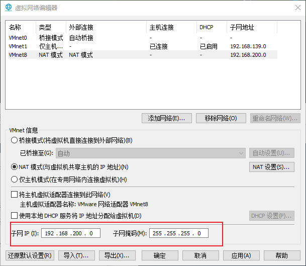

## NAT网络模式配置

现有两个需求：

1. 在保证主机未联网的情况下，主机和虚拟机之间也能互通；
2. 在主机联网的情况下，虚拟机能够访问外网。

因此，我们最好选择三种虚拟机网络模式中的NAT模式，具体的配置方式如下：

### 1、VMware虚拟网络器配置

1. **点击VMware菜单栏中的编辑，选择虚拟网络编辑器**

 

 


2. **打开虚拟网络编辑器后，赋予管理员权限**

 

在更改设置的NAT模式中，有两个内容是可以配置的，分别是`子网IP`和`子网掩码`：

 

**子网IP和子网掩码就能够确认子网的IP范围：**

有一个IP地址，与子网掩码进行按位与运算，得到的结果等于子网IP，那么这个IP地址就属于该子网的范围内。比如192.168.1.10与子网掩码255.255.255.0按位与运算得到的结果是192.168.1.0，所以192.168.1.10属于该子网的IP范围。

该子网IP，也就是虚拟机所虚拟出来的局域网的子网IP，我们需要确保虚拟机的IP地址，以及在主机上虚拟出来的网卡（VMnet8）IP地址在该IP地址范围，这样才能实现虚拟机与主机之间的通信。


3. **设置子网IP和子网掩码：**

 

将子网IP设置为192.168.200.0，子网掩码设置为255.255.255.0，那么在该子网IP的范围是192.168.200.2 - 192.168.200.254（1与255的ip地址有特殊用途，不可用于设备的ip）。

子网IP的第三位数字可以随便设置，可以设置为192.168.200.0，也可以设置为192.168.111.0，这个子网IP实际上是虚拟机虚拟出来的网络的IP地址范围，我们只需要保证虚拟机的IP地址以及主机虚拟网卡的IP地址在这个IP地址范围内，即可实现数据的通信。

我们这里将子网IP设置为`192.168.200.0`，子网掩码设置为`255.255.255.0。`


4. **勾选选项：将主机虚拟适配器连接到此网络**

   

这个选项表示的含义是，让主机中虚拟出来的虚拟网卡，连接上虚拟机虚拟出来的网络中，这样能够实现主机与虚拟机之间的通信。这个选项需要勾选上，否则我们就无法使用SSH连接来实现主机与虚拟机之间的通信了。

第二个选项：使用本地DHCP服务将IP地址分配给虚拟机，这个表示使用DHCP服务，来为虚拟机动态地分配IP地址，IP地址不是固定的。

这里先将第一个和第二个选项都勾选上，在后面我们将为主机分配静态的IP地址，此时就不需要再使用DHCP服务动态分配IP地址了。


5. **点击NAT设置，在NAT设置中配置子网的网关IP**

 

这里的网关IP，实际上是NAT设备在局域网中的IP地址。

解释：

我们知道，局域网中的设备要想去访问互联网，必须要通过NAT设备来对数据报进行转换。NAT设备在互联网中有一个IP地址，也就是公网IP；同理在局域网中也有一个IP地址，就是网关IP。

那么同理，对于虚拟机虚拟出来的NAT设备，在虚拟子网中也有一个IP地址，就是网关IP，我们需要确保网关IP在子网IP的范围内即可。

这里，我们将网关IP设置为`192.168.200.2`。


### 2、配置虚拟机联网方式

1. 修改虚拟机所使用的网络模式

   

2. 选择NAT模式

    

那么，此时虚拟机的网络就已经配置完成了，我们使用ifconfig命令，查看一下Linux系统的ip地址：

 

ip地址为192.168.200.128，该ip地址是DHCP动态分配的，不是静态的，IP地址范围会在子网IP地址范围内。


### 3、Windows主机虚拟网卡的配置

虚拟机的网络配置完毕了，接下来就是要去配置Windows主机。我们需要确保，将Windows主机中虚拟出来的网卡，加入到虚拟机虚拟出来的局域网中，这样才能实现主机与虚拟机之间的通信。

其实，当我们在虚拟网络编辑器中，勾选将`主机虚拟适配器连接到此网络`这个选项时，就已经将主机的虚拟网卡加入到了虚拟机虚拟出来的网络中，Vmware自动帮助我们配置的。

 

我们来验证一下：

1. 打开网络适配器配置面板

   `Win+R`打开运行窗口，输入`ncpa.cpl`，然后按回车键

2. 查看VMnet8虚拟网络适配器

   

3. 查看IpV4配置

   

   可以看到，Vmware已经自动帮助我们配置好了主机虚拟网卡在虚拟网络中的IP地址了，主机的虚拟网卡IP地址是固定的，都是子网IP范围中的第一个IP地址，不会使用DHCP服务来自动分配。

   当然，我们也可以手动地进行修改，只不过要求IP地址的范围是在虚拟网络IP地址的范围内。


### 测试

此时，主机的网络与虚拟机的网络都已经配置好了，此时主机与虚拟机之间的就可以互通了。

使用`ping IP地址`的方式进行测试。

并且此时，虚拟机也能够去访问互联网，使用ping www.baidu.com的方式进行测试：

 


### 出现的问题

当配置完毕后，发现可以使用主机去ping通虚拟机，但是使用虚拟机去ping主机，却无法ping通，此时可能是因为不同的操作系统，防火墙的配置是不同的：

* 在Linux系统中，默认情况下防火墙是允许ping请求通过的；

* 在Windows系统中，防火墙是不允许ping请求通过的。

此时，我们可以先将主机的防火墙暂时关闭。关闭之后，虚拟机和主机之间都能够互相ping通。

ping通之后，我们就可以将Windows的防火墙打开，打开之后也不会影响后续的操作，因为在实际的开发中，我们一般都是使用主机去请求虚拟机，很少会让虚拟机请求虚拟机。比如将项目部署到虚拟机上，我们都是去使用请求去访问虚拟机中的项目，一般不会让虚拟机访问主机。

打开Windows系统的防火墙之后，就会发现虚拟机无法ping通主机了。


---

## 配置静态IP地址

**为什么要去配置静态IP地址？**

在默认情况下，虚拟机的IP地址是由虚拟DHCP服务自动分配的，虚拟机的IP地址不固定，这对于使用SSH远程访问来说并不友好。所以，在通常情况下，我们不使用虚拟DHCP服务，而是手动地为虚拟机设置静态IP地址。

具体操作如下：

1. **确定网络配置文件**

在终端中输入ifconfig，查看当前的网络接口，内容如下：

 

ens33是目前的以太网接口，其配置文件为：`/etc/sysconfig/network-scripts/ifcfg-ens33`。

2. **修改网络配置文件**

打开配置文件

```shell
vim /etc/sysconfig/network-scripts/ifcfg-ens33 
```

 

> **需要修改的内容如下：**
>
> * 将`BOOTPROTO`参数修改为**`static`**（表示将使用的DHCP动态分配IP地址修改为使用静态IP地址）
>
> * 将`ONBOOT`参数修改为**`yes`**（表示网卡开机是否自启动）
>
> * 增加如下内容
>
>   ```ini
>   IPADDR=192.168.200.100
>   NETMASK=255.255.255.0
>   GATEWAY=192.168.200.2
>   DNS1=192.168.200.2
>   ```
>
>   这里需要注意：
>
>   1. `IPADDR`：配置的虚拟机IP地址。只需要将该IP地址设置在虚拟网络IP范围即可（我们在上一章中虚拟子网IP为192.168.200.0，所以我们只需要将虚拟机的IP地址设置在192.168.200.1 - 192.168.200.254之间即可，但是注意不要与网关的IP地址冲突，也不要与虚拟网卡的IP地址冲突）
>
>   2. `NETMASK`：子网掩码。
>
>   3. `GATEWAY`：网关IP。也就是我们在上一章所配置的虚拟网络的网关地址（192.168.200.2）。
>
>   4. `DNS1`：dns服务器1，填写所在网络可用的dns服务器地址即可，我这里使用的是网关地址。
>
>      在Vmware中，会将NAT设备的网关充当一个dns服务器，它实际会做一个转发操作，将DNS的请求转发到主机配置的dns服务器上，然后将解析的结果返回给虚拟机，所以DNS服务器我们直接填写网关的IP即可。

配置完毕后的ens33文件：

 

3. **重新启动网络服务**

在终端执行以下命令，重启network服务

```shell
systemctl restart network.service
```


4. **观察网络配置是否生效**

在终端执行`ifconfig`命令，观察ens33的网络接口的IP地址：

 

此时，虚拟机的IP地址就修改成功了。