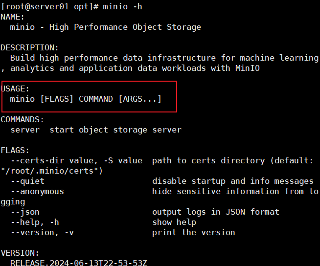
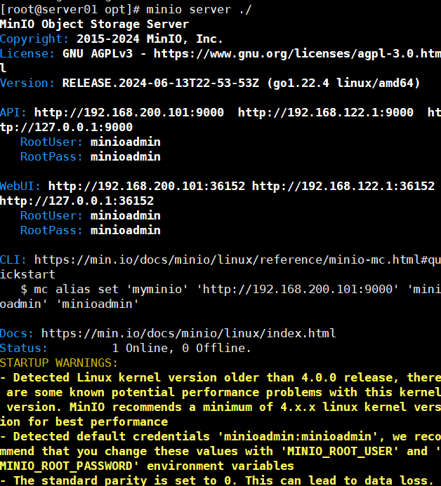

### 部署MinIO

在Linxu中部署MinIO，安装方式采用rpm离线安装，具体步骤可参考：[官方文档](https://min.io/docs/minio/linux/operations/install-deploy-manage/deploy-minio-single-node-single-drive.html#minio-snsd)。

#### 下载MinIO安装包

下载地址如下：

https://dl.min.io/server/minio/release/linux-amd64/archive/minio-20240613225353.0.0-1.x86_64.rpm

我们先进入到/opt目录，通过以下命令，以下命令将安装包下载至服务器：

```shell
wget https://dl.min.io/server/minio/release/linux-amd64/archive/minio-20240613225353.0.0-1.x86_64.rpm
```


#### 安装MinIO

```shell
rpm -ivh minio-20240613225353.0.0-1.x86_64.rpm
```

此时，MinIO就安装完毕了。


#### 测试MinIO服务

使用minio来启动MinIO服务，我们使用minio -h来查看一下minio的帮助信息：

 

其中有一项USAGE就表示着minio的语法：

`minio [FLAGES] COMMAND [ARGS...]`

其中[flages]就表示选项，可以传入的选项有--certs-dir、--quiet、--anonymous、--json、-h、--version。

COMMAND表示命令，只能使用server命令，server也就表示了去启动minio服务。

之后是[ARGS]，也就是该命令可以传入的参数，那minio server命令可以传入哪些参数呢？我们使用minio server --help来查看一下：

 

由USAGE用法中，可以看到，minio server可以传入flages，也可以传入dir。这个flages表示的是选项，这个dir表示的是目录。

flages可以传入的选项下面都有，这个dir目录也就是存储minio服务中的数据的。

那么，最简单的启动minio服务的语句是：

```shell
minio server ./
```

也就是启动minio服务，并将当前目录位置作为存储minio服务数据的目录。

 

出现出上面的界面，就表示MinIO服务启动成功。

上面有两个地址非常重要：

**1.MinIO的接口地址：**

 

若我们在项目中，去编写一个上传文件或删除文件的功能时，这个时候就需要访问这个接口地址。

 

那为什么会有三个地址呢？

这其实是因为Linux的虚拟机处在三个网络下，我们使用ifconfig来查看一下：

 

这三个网络分别是Vmware虚拟出来的虚拟子网、本地回环网络、以及虚拟网桥。在不同网络中，IP地址是不同的，MinIO服务在不同的网络中，IP地址也是不一样的，所以会出现三个不同的网络地址。

如果我们想要在主机中去访问MinIO的接口地址，也就是三个网络地址中的第一个的网络地址。


**2.MinIO后台服务管理界面地址：**

 

同样地，在这里会有三个地址，若我们想在主机中进行访问，访问的是第一个地址。

这里地址的端口号不是固定的，而是随机的，若能在主机中打开这个网络地址，说明minio服务是正常运行的：

 


#### 集成Systemd

**Systemd概述**

我们所使用的systemctl命令，都是由systemd命令所提供的。

Systemd是一个广泛应用于Linux系统的系统初始化和服务管理器，其可以管理系统中的各种服务和进程，包括启动、停止和重启服务，除此之外，其还可以检测各服务的运行状态，并在服务异常退出时，自动拉起服务，以保证服务的稳定性。系统的防火墙服务firewalld，我们自己安装的mysqld和redis均是由Systemd进行管理的，那么，我们将MinIO服务也交给Systemd管理。

**编写MinIO服务配置文件**

systemd所管理的服务需要由一个配置文件，这些配置文件均位于/etc/systemd/system/或/usr/lib/systemd/system/目录下，下面创建MinIO服务的配置文件。

执行以下命令创建并打开minio.service文件：

```shell
vim /etc/systemd/system/minio.service
```

内容如下，具体可参考MinIO官方文档：[官方文档](https://min.io/docs/minio/linux/operations/install-deploy-manage/deploy-minio-single-node-single-drive.html#create-the-systemd-service-file)。

```ini
[Unit]
Description=MinIO
Documentation=https://min.io/docs/minio/linux/index.html
Wants=network-online.target
After=network-online.target
AssertFileIsExecutable=/usr/local/bin/minio

[Service]
WorkingDirectory=/usr/local
ProtectProc=invisible
EnvironmentFile=-/etc/default/minio
ExecStartPre=/bin/bash -c "if [ -z \"${MINIO_VOLUMES}\" ]; then echo \"Variable MINIO_VOLUMES not set in /etc/default/minio\"; exit 1; fi"
ExecStart=/usr/local/bin/minio server $MINIO_OPTS $MINIO_VOLUMES
Restart=always
LimitNOFILE=65536
TasksMax=infinity
TimeoutStopSec=infinity
SendSIGKILL=no

[Install]
WantedBy=multi-user.target
```

需要注意的是，在粘贴时一定要将vim模式转换成输入模式，否则在一般模式下，粘贴的内容会不完整，因为普通模式下，会根据粘贴的内容执行相关命令。

**一些重要参数的说明：**

* `EnvirommentFile`：这个参数用于指定minio的环境变量文件，在这个文件中，可以配置MinIO服务所需的各项参数。也就是说，在这个文件中，可用于去配置一些参数，参数的格式是key=value的形式，然后我们在刚才常见的minio.service文件中可以引用这些参数。
* `EnexStart`：这个参数是用于配置MinIO服务的启动命令，也就是minio server，后面跟着的`$MINIO_OPTS`表示选项，`$MINIO_VOLUMES`表示MinIO服务的数据存储路径。这两个$符号的参数，均是引用于EnvironmentFile中的变量。
* `Restart`：表示当MinIO服务意外退出了，Systemd则会自动启动该服务。


**编写EnvironmentFile文件**

该EnvironmentFile文件，是用来配置MinIO的环境变量的。

使用vim命令来创建并且打开文件，注意文件目录必须与上面所配置的minio.service文件中的设置一样：

```shell
vim /etc/default/minio
```

内容如下：

```shell
MINIO_ROOT_USER=minioadmin
MINIO_ROOT_PASSWORD=minioadmin
MINIO_VOLUMES=/data
MINIO_OPTS="--console-address :9001"
```

**参数的含义：**

* `MINIO_ROOT_USER`和`MINIO_ROOT_PASSWORD`表示声明MINIO服务初始的用户名和密码。**注意**：用户名和密码长度至少为8位。
* `MINIO_VOLUMES`用于指定数据的存储路径，那么也就是说，我们将MINIO服务的数据存放在/data目录下。
* `MINIO_OPTS`用于配置启动minio服务的选项，这里我们只配置了--console-address的选项，这个选项表示的是固定minio服务的端口号。在上面说过，minio的api端口号是固定的，但是minio后台管理的端口号不是固定的，所以我们将其设置为固定的9001。


**创建minio存储数据的目录**

在上面，我们配置了MinIO服务的数据是存储在/data目录下的，所以我们这里要去创建data目录：

```shell
mkdir /data
```


#### 启动MinIO

在集成了Systemd服务之后，我们就不再使用minio server这样的语句去启动minio了，而是使用systemd给我们提供的命令systemctl：

```shell
systemctl start minio
```

执行以下命令查询运行状态：

```shell
systemctl status minio
```

设置MinIO开机自启：

```shell
systemctl enable minio
```


#### 访问MinIO管理页面

我们在之前的/etc/default/minio配置文件中，设置了MioIO的后台服务端口号为9001，所以我们在主机中访问虚拟机的MinIO后台服务页面的地址为：http://虚拟机地址:9001：

 

