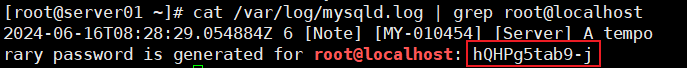

### 部署MySQL

部署MySQL可以使用两种方式，一种是使用rpm离线安装，一种是使用yum在线安装。


#### MySQL的卸载

1. **`关闭MySQL服务`**

   ```shell
   systemctl stop mysqld.service
   ```

2. **`查看当前MySQL安装状况`**

   ```shell
   rpm -qa | grep -i mysql
   
   #或
   
   yum list installed | grep mysql
   ```

   

3. **`卸载上述命令查询出的已安装程序`**

   ```shell
   yum remove mysql-xxx mysql-xxx mysql-xxx mysqk-xxxx
   ```

   务必删除干净，反复执行`rpm -qa | grep -i mysql`确认是否有卸载残留

4. **`删除mySQL相关文件`**

   * 查找相关文件

     ```shell
     find / -name mysql
     ```

   * 删除上述命令查找出的相关文件

     ```shell
     rm -rf xxx
     ```

5. **`删除my.cnf`**

   ```shell
   rm -rf /etc/my.cnf
   ```


#### 安装MySQL的两种方式

##### 方式一：使用rpm安装mysql

**检查是否安装过mysql**

* 如果使用的是rpm安装，检查一下RPM PACKAGE:

  ```shell
  rpm -qa | grep -i mysql
  ```

* 检查mysql service：

  ```shell
  systemctl status mysqld.service
  ```

* 如果存在mysql-libs的旧版本包，显示如下：

  

* 如果不存在mysql-lib的版本，显示如下：

  


**然后去下载MySQL的指定版本**

进入到MySQL官网中，下载MySQL8版本

   

由于是要给Linux系统下载MySQL数据库，所以，需要将下载的版本选择为Linux系统。

需要为CentOS 7下载MySQL数据库，但是这里并没有CentOS 7的选项，这里选择Red Hat Enterprise Linux/Oracle Linux，这是与CentOS 7兼容的。

然后再选择系统的版本

 

这里选择版本7，x86版本。

之后选择下载包的类型，这里选择的是`RPM Bundle`。

 

下载好的tar包，使用压缩工具解压，就可以得到很多的rpm文件。我们只需要其中的一部分安装包即可。


**将选中的文件，复制一份，使用Xftp软件，粘贴到CentOS 7系统的`/opt`目录下，这样一来，MySQL文件就复制到了CentOS 7系统中了。**


**rpm安装MySQL**

1. **先将安装程序拷贝到/opt目录下**

在Linux中，/opt目录就是用来存放安装的软件与程序的，所以需要先将下载的MySQL文件拷贝到/opt目录下进行安装操作。

由于之前，已经使用了Xftp软件，将下载的一部分MySQL文件拷贝到了/opt目录下，这里就不再阐述。

2. **在MySQL的安装目录下执行：**

首先进入到/opt目录下：

```shell
cd /opt
```

然后，在/opt目录下，按照顺序，一步一步地，依次执行下述语句：

```shell
rpm -ivh mysql-community-common-8.0.25-1.el7.x86_64.rpm

rpm -ivh mysql-community-client-plugins-8.0.25-1.el7.x86_64.rpm
 
rpm -ivh mysql-community-libs-8.0.25-1.el7.x86_64.rpm

rpm -ivh mysql-community-client-8.0.25-1.el7.x86_64.rpm

rpm -ivh mysql-community-server-8.0.25-1.el7.x86_64.rpm
```

* `rpm`是Redhat Package Manage缩写，通过RPM的管理，用户可以把源代码包装成以rpm为扩展名的文件形式，易于安装。
* `-i`，--install安装软件包
* `-v`，--verbose提供更多的详细信息输出
* `-h`，--hash软件包安装的似乎列出哈希标志（和-v一起使用效果更好），展示进度条。


**注意：**

1. 必须要按照顺序，一步一步地执行语句，有可能下载的MySQL版本不一样，导致文件名不一致而报错误，上例中使用的是8.0.25版本的MySQL，根据实际使用的MySQL版本进行安装即可。

2. 如在检查工作时，没有检查mysql依赖环境，则在安装mysql-community-server会报错。

3. 实际上按照：**`common -> client-plugins -> libs -> client -> server`**的顺序进行执行。

4. 在安装`mysql-community-libs`时，有可能会报一个错误信息：

   

   使用命令：**`yum remove mysql-libs`**解决，清除之前安装过的依赖即可。


##### 方式二：使用yum安装Mysql

在CentOS7系统中部署MySQL，具体的步骤可以参考官方的MySQL文档：[MySQL :: MySQL Installation Guide :: 7.1 Installing MySQL on Linux Using the MySQL Yum Repository](https://dev.mysql.com/doc/mysql-installation-excerpt/8.0/en/linux-installation-yum-repo.html)

**实现步骤**

1. **安装MySQL yum库**

   由于在Linux内置的yum仓库中，是没有MySQL的安装包的，所以我们需要给MySQL配置一个yum仓库，然后使用yum命令实现安装。

   * **下载yum库**

     首先，我们要去先下载一个yum仓库的配置文件，该文件安装后，会自动去配置yum仓库，然后就可以使用yum命令安装MySQL。

     下载地址：[MySQL :: Download MySQL Yum Repository](https://dev.mysql.com/downloads/repo/yum/)

     进入到该地址后，选择适合的版本，我们选择的是Red Hat Enterprise Linux 7的版本：

      

     然后点击Download， 点击下载：

      

     就会将rpm文件下载下来。

     也可以直接使用命令：

     ```shell
     wget https://dev.mysql.com/get/mysql84-community-release-el7-1.noarch.rpm
     ```

     进行下载。

     注意，这里的wget命令后面跟着的的下载链接，是我写笔记时最新的下载链接，由于版本可能会不断地更迭，建议使用最新的版本以免出现安装失败的问题。所以，建议去下载时先去该网站复制最新的下载链接，然后使用wget命令下载。

     在Linux系统中，自己下载的安装包一般都放在/opt目录下，所以我们可以使用wget命令的-P选项指定下载到/opt目录：

     ```shell
     wget -P /opt/ https://dev.mysql.com/get/mysql84-community-release-el7-1.noarch.rpm
     ```

   * **安装yum库**

     下载好后，我们来查看一下刚才下载的rpm文件：

      

     下载的文件名为mysql84-community-release-el701.noarch.rpm，那么我们就可以使用rpm命令安装rpm的文件：

     ```shell
     rpm -ivh mysql84-community-release-el7-1.noarch.rpm 
     ```

     安装好后，我们去查看一下本地的yum仓库：

      

     就可以看见，此时在yum仓库中，就多出了与mysql有关的配置文件。

     此时，就可以去安装mysql了，只不过此时，下载的速度比较慢，因为mysql的yum仓库服务器是在国外，我们去下载mysql网速会很慢，所以为了让下载速度能够快一点，我们可以为Yum仓库配置国内的镜像。就类似于maven仓库配置国内镜像的道理是一样的。

   * **配置国内镜像**

     修改`/etc/yum.repos.d/mysql-community.repo`文件中的baseUrl参数，修改内容如下：

     

     将mysql80-community部分中的baseurl属性修改为下面的值： 

     ```ini
     baseurl=https://mirrors.tuna.tsinghua.edu.cn/mysql/yum/mysql-8.0-community-el7-$basearch/
     ```

     然后注意，我们需要去更改该配置文件中各个版本的enabled属性值。

     这个enabled属性值，表示的是我们使用yum命令去安装mysql时，安装的版本：

      

     可以看到，此时只有mysql-8.4-lts-community这个版本的enabled属性值为1，也就是说，此时我们使用yum命令安装MySQL默认安装的是mysql-8.4版本。

     但是，我们这里不想安装mysql8.4版本，想安装mysql80版本，那么可以将mysql-8.4版本的enabled属性值修改为0，将mysql80版本的enabled属性修改为1，这样我们使用yum命令安装的mysql就是8.0版本的：

      


2. **安装MySQL**

执行如下命令安装MySQL

```shell
yum -install -y mysql-community-server
```

由于上述修改了/etc/yum.repos.d/mysql-community.repo中版本的enabled属性，所以此时下载的MySQL是8.0版本的。


#### 查看MySQL版本

执行如下命令，如果成功表示安装mysql成功。类似java -version打出版本等信息

```shell
mysql --version
#或
mysqladmin --version
```

 

执行如下名，查看是否安装成功。需要增加-i表示不去区分大小写，否则搜索不到。

```shell
rpm -qa|grep -i mysql
```

 


#### MySQL服务的初始化

为了保证数据库目录与文件的所有者为mysql登录用户，如果你是以root身份运行mysql服务，需要执行下面的命令进行初始化：

```shell
mysqld --initialize --user=mysql
```

说明：--initialize选项默认以"安全"模式来初始化，则会为root用户生成一个密码并`将该密码标记为过期`，登录后你需要去设置一个新的密码。生成的`临时密码`会往日志中记录一份。

查看密码：

```shell
cat /var/log/mysqld.log | grep root@localhost
```

 

root@localhost后面的就是初始化的密码，也就是hQHPg5tab9-j


#### 启动MySQL，查看状态

这个时候，就可以去登录MySQL数据库了，不过在此之前，需要确保MySQL服务已经启动。

**查看MySQL服务器状态：**

```shell
#加不加.service后缀都可以
systemctl status mysqld.service
```


`dead`就表示MySQL服务已经关闭停止了，此时我们就需要启动MySQL服务。

```shell
#加不加.service后缀都可以

启动：systemctl start mysqld.service

关闭：systemctl stop mysqld.service

重启：systemctl restart mysqld.service
```

启动后，我们再去查看mysql服务：


此时的MySQL服务就是running状态。

我们也可以通过查看系统进程的方式，查看到mysql服务是否启动：

```shell
ps -ef | grep -i mysql
```


#### 查看MySQL服务是否自启动

```shell
systemctl list-unit-files|grep mysqld.service
```


默认是enabled，表示MySQL服务自启动。

如果不是enabled，可以运行如下命令设置自启动：

```shell
systemctl enable mysqld.service
```

如果希望不进行自启动，运行如下命令设置：

```shell
systemctl disable mysqld.service
```

 


#### 登录MySQL

首次登录通过`mysql -hlocalhost -P3306 -uroot -p`进行登录，此时的密码是初始密码，也就是MySQL服务初始化时，生成的临时密码，可以使用`cat /var/log/mysqld.log | grep root@localhost`进行查看：



也就是hQHPg5tab9-j。

登录MySQL：


#### 修改密码

因为初始化密码默认是过期的，所以查看数据库会报错。

**修改密码：**

```sql
ALTER USER 'root'@'localhost' IDENTIFIED BY '新密码';
```

修改完成后，重新进入到MySQL数据库中，就可以正常地使用数据库了。

**注意**：MySQL默认安装了[validate_password](https://dev.mysql.com/doc/refman/8.0/en/validate-password.html) 插件，默认情况下，要求密码要包含大写字母、小写字母、数字和特殊符号，且密码长度最小为8。若需设置简单密码，可禁用该插件，或调整该插件的密码强度级别。

**禁用validate_password插件的方式：**

打开Linux系统mysql的配置文件：

```shell
vim /etc/my.cnf
```

将下面的内容添加到配置文件中：

```properties
[mysqld]
validate_password.check_user_name=OFF
validate_password.length=4
validate_password.mixed_case_count=0
validate_password.number_count=0
validate_password.policy=0
validate_password.special_char_count=0
```

保存退出，然后重启mysql服务：

```shell
systemctl restart mysqld.service
```

此时，vaildate_password所有规则都被修改了，那么此时我们就可以随便地设置mysql用户密码了。

 


#### 远程登录

**远程登录存在的问题**

在使用SQLyog或者Navicat去远程连接MySQL数据库时，遇到了下面的报错信息，这是由于MySQL配置了不支持远程连接引起的。

 


**实现步骤**

**1、确认网络**

1. 在远程机器上使用ping ip地址`保证网络畅通`

2. 确保本地机器`开启telnet命令`：

 

 

 


**2、关闭防火墙或开放端口**

需要把本地（Windows系统)的防火墙关闭，这样才可以去连接远程机器。

然后，可以选择去关闭远程机器的防火墙或者开放远程机器的3306端口。

**`方式一：关闭远程机器防火墙`**

**查看防火墙状态**

```shell
systemctl status firewalld.service
```

**打开防火墙**

```shell
systemctl start firewalld
```

**关闭防火墙**

```shell
systemctl stop firewalld
```

**设置开机启动防火墙**

```shell
systemctl enable firewalld
```

**设置开机禁用防火墙**

```shell
systemctl disable firewalld
```

我们可以使用上面的命令，去设置远程机器关闭防火墙，这样就给了远程连接一个基础。


**`方式二：开放远程机器的端口`**（推荐）

远程连接，要么去关闭防火墙，要么在开启防火墙的基础上，开放MySQL数据库连接的端口3306，只让该端口允许进行访问。

**查看开放的端口号**

```shell
firewall-cmd --list-all
```

**设置开放的端口号**

```shell
firewall-cmd --add-service=http --permanent

firewall-cmd --add-port=3306/tcp --permanent
```

**重启防火墙**

```shell
firewall-cmd --reload
```


**3、修改Linux配置**

在默认的情况下，MySQL数据库是不允许root用户进行远程连接的，root用户在默认的情况下只允许进行本地连接。我们可以通过下面的操作查看：

```sql
use mysql;

select Host, User from user;
```

 

我们可以看到，root用户的当前主机配置信息为localhost，即root用户只允许localhost本地访问，不允许进行远程访问。

那如何进行修改？

* **`修改Host为通配符%`**

Host列指定了允许用户登录所使用的IP，比如user=root Host=192.168.1.1。这里的意思就是说root用户只能通过192.168.1.1的客户端去访问。user=root Host=localhost，表示只能通过本地客户端去访问。而`%`是个`通配符`，如果Host=192.168.138.%，那么就表示只要是IP地址前缀为"192.168.138."的客户端都可以连接。如果`Host=%`，表示所有IP都有连接权限。

注意：在生成环境下不能为了省事将host设置为%，这样做会存在安全问题，具体的可以根据生成环境的IP进行设置。

```sql
update user set host = '%' where user = 'root';
```

Host设置了'%'后便允许进行远程访问。

 


不管在一般情况下，我们都会去创建一个用户，用于远程登录（该角色会限定权限，而不是像下面一样赋予所有权限）：

```mysql
CREATE USER 'root'@'%' IDENTIFIED BY '061535asd';
GRANT ALL PRIVILEGES ON *.* TO 'root'@'%' WITH GRANT OPTION;
```

上述第一条命令表示去创建一个root用户，可以在任何地址登录。

第二条命令表示给这个新创建的root用户赋予所有权限，并且WITH GRANT OPTION命令表示该用户可以将自己的权限赋予其他用户。


Host修改完成后记得执行flush privileges使配置立即生效：

```sql
flush privileges;
```

这个时候，去连接远程数据库就连接成功了。

 


**远程登录可能存在的问题**

如果是MySQL8的版本，连接时可能会出现如下的问题：

 

配置新连接报错：错误号码2058，分析是mysql密码加密方法变了。

解决方法：Linux下mysql -uroot -p 登录mysql数据库，然后执行这条SQL语句：

```sql
ALTER USER 'root'@'%' IDENTIFIED WITH mysql_native_password BY '密码';
```

然后再重新配置远程连接，即可连接成功。