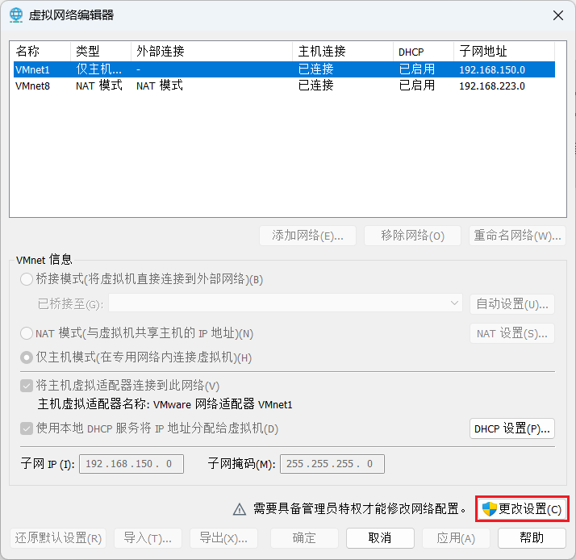

# 一、Linux系统概述


Linux是一种开源操作系统，与Windows或macOS等操作系统不同，Linux允许用户自由地查看、修改和分发其源代码。以下是Linux系统的一些显著的优势。

* **稳定性和可靠性：**

  Linux内核以其稳定性而闻名，能够持续运行数月甚至数年而不需要重新启动。这对于服务器来说至关重要，因为它们需要保持长时间的稳定运行，以提供持续的服务。

* **安全性：**

  Linux系统的安全性得到了广泛认可。开源的自然属性使得漏洞可以很快被发现和修复，从而减低了受到安全威胁的风险。

* **资源利用效率：**

  Linux在资源管理方面表现出色，可以高效地利用服务器硬件资源，使得服务器能够同时处理大量的请求。

* **开源和免费**

  Linux是开源的，因此不需要为操作系统本身付费。这使得它在经济上具有明显的优势，特别是对于企业或组织需要部署大量服务器的情况。

由于上述这些优势，Linux系统成为了许多企业和组织首选的服务器操作系统。


# 二、Linux系统的安装

## Linux系统安装

Linux系统的安装，请查看笔记： [1、VMWare15.5上安装CentOS7.docx](1、VMWare15.5上安装CentOS7.docx) 

这里我就不再阐述了。


## VMware使用技巧

### 系统快照

所谓系统快照，就是将操作系统的当前状态保存下来，若将来系统出现不可修复的故障，便可使用快照恢复操作系统。下面演示VMware提供的快照功能。

1. 拍摄快照

   找到需要拍摄的虚拟机，执行如下操作：

   

   填写快照信息

    

2. **误操作**

   假如失误删除了系统的一些重要文件，导致系统无法正常运行，例如下图所示

   

   关机后再启动，发现无法进入系统，

3. **恢复快照**

   进入快照管理器

   

   选中要恢复的快照，点击转到，即可将系统恢复到指定的状态。

    

4. **删除快照**

   若快照已经十分久远，失去其存在的意义，便可将其删除，具体操作如下图所示

   

   


### 克隆虚拟机

克隆虚拟机就是将现有的虚拟机复制一份，得到一台和原有虚拟机配置完全相同的虚拟机，从而省去了重复安装系统的繁琐工作。

具体克隆虚拟机的操作，请查看笔记： [5、Linux虚拟机的克隆（可选）.docx](5、Linux虚拟机的克隆（可选）.docx) 


### 删除虚拟机

废除不用的虚拟机可通过如下方式删除：


这种方式删除虚拟机，只会在该Vmware列表中将该虚拟机删除，而不会真正在磁盘中删除。若想真正在磁盘中删除虚拟机，需要右键虚拟机，在管理选项中选择在磁盘中删除虚拟机，才能真正将虚拟机删除。


# 三、Linux文件系统目录结构

**为什么要熟悉相关目录结构？**
不同的目录，定位是不同的。比如有些目录是用来存放用户下载的应用的，有些目录是用来存放系统文件的，有些目录是用来存放命令的。那么，熟悉这些目录结构，对于我们存放数据，查找信息，以及管理文件来说十分重要。

**Linux文件系统的目录结构如下图所示：**


**其中各目录的作用如下表所示：**

| 目录    | 说明                        | 作用                                                         |
| ------- | --------------------------- | ------------------------------------------------------------ |
| `/`     | 根目录                      | 根目录是整个文件系统的起点，所有其他目录和文件都位于根目录之下。 |
| `/home` | 家目录                      | 每个用户的个人目录都位于这个目录下，通常以用户名命名。例如，用户john的主目录路径为/home/john。 |
| `/root` | root用户的家目录            | 保存root用户的个人数据                                       |
| `/boot` | 引导文件所在目录            | 保存系统启动时所需的各种文件                                 |
| `/usr`  | User System Resources的简写 | 存放用户可用的软件和程序文件，也包括了一些共享的数据和库文件 |
| `/bin`  | binary的简写                | 存放系统的基本命令（如ls、cp等）和其余可执行文件。           |
| `/sbin` | system binary的简写         | 存放系统管理和维护方面的二进制文件。                         |
| `/etc`  | etcetera的简写              | 存放系统的配置文件，包括各种程序的配置文件和系统的全局配置文件。 |
| `/var`  | variable的简写              | 存放系统运行时产生的可变数据，如日志文件、数据库文件等。     |
| `/opt`  | optional的简写              | 存放一些可选的软件包，通常由用户自行安装                     |
| `/tmp`  | temporary的简写             | 存放临时文件，系统会定期清理该目录                           |


# 四、Linux交互界面

服务器中Linux系统，通常不会安装图形用户界面（GUI，Graphical User Interface），因此我们与操作系统的交互主要靠命令行界面（CLI，Command Line Interface），如下图所示：

 

在命令行界面，用户通过输入一系列命令来和操作系统进行交互，例如通过mkdir /test来创建/test目录。这些命令通常由shell解释并执行。

 

若想安装图形化界面，请查看笔记： [2、CentOS 7图形界面的配置.md](2、CentOS 7图形界面的配置.md) 

其中还包括了如何更改Linux系统不同的界面启动。

我们这里都使用命令行界面来学习。


---

# Linux路径的说明

在Linux中，路径的使用其实和前端中一样。（感觉其实在前端中学习的路径，适合所有位置）也就是：

* 以./开头（可以省略）或者../开头表示相对路径：
  * ./：表示当前目录结构下。（可以省略）
  * ../：表示上一层级目录结构下。
* 以/开头表示绝对路径：/表示的是最上层目录结构，在Linux系统中，/表示的是根目录下，在Web项目下，/表示的是http://localhost:8080/项目上下文路径/。

具体内容请查看： [路径问题.md](..\2、JavaWeb\路径问题.md) 


---

# 五、Linux常用命令（:star:）

## 该如何查看命令包含哪些选项？

比如对于ls命令，就包含了-a、-A、-l、-m、-n等等这些常用的选项，那么我们该如何去查看命令有哪些选项，并且这些选项所代表的含义呢？

有两种方式。

**第一种：使用系统提供的用户手册**

**格式：**`man 命令`

案例：查看ls命令的用法

 

结果：

 

可以看到，使用这种方式不仅可以看到该ls命令的选项，还可以查看到该命令的用法。

我们可以按q退出该用户手册。

这是操作系统给我们提供的用户手册，但是当我们要去查看的命令不是系统自带的命令，而是我们自己装的软件中所带的命令，就无法使用这种方式查看命令的选项。此时就只能使用第二种方式。


**第二种：查看命令自身的帮助信息**

**格式：**

**`命令 -h`** 或 **`命令 --help`**

这种方式是去查看命令自身的帮助信息，也适用于非系统命令。

一般情况下，使用-h或--help就能查看。

案例：

 


---

## 1、文件和目录相关

#### pwd

* **全称**：print working directory

* **作用**：打印当前位置所处的绝对路径

* **基本语法**：`pwd`

* **案例实操：**显示当前工作目录的绝对路径

   


#### ls

* **全称**：list

* **作用**：列出目录内容

* **基本语法**：`ls [选项] [目录或文件路径]`

* **说明：**
  若没有指定目录或文件，默认是列出当前目录下所有的内容；若指定目录或文件，则是列出指定目录或文件下所有的内容。

  这里的目录或文件，可以使用相对路径的方式指定，也可以使用绝对路径的方式指定。相对路径与绝对路径的使用方式与前端一致：

  * ./表示当前目录下（./可以省略）

  * ../表示上一层目录下

  * /开头表示绝对路径，/表示根目录。


* **选项说明**：

  | 选项 | 功能                                                |
  | ---- | --------------------------------------------------- |
  | `-a` | 全部的文件，连同隐藏文件（开头为.的文件）一起列出来 |
  | `-l` | 使用详细的格式列出信息，包含文件的属性与权限等数据  |

* **实操案例：**

  查看在根目录下，home目录中所有的文件（包括隐藏文件），并使用详细的格式列出：

  ```shell
  cd /
  ls -al home
  ```

    

  上图的方式，是进入到/根目录下，然后再在根目录中使用ls查询根目录下home目录中的内容。

  我们同样也可以使用**绝对路径**的方式，在/root目录中使用绝对路径，定位到/home目录：

  ```shell
  ls -al /home
  ```

   

  这里的/home就是一个绝对路径，/表示的是根目录。


* **使用-l选项查询出来的数据说明：**

  每一行都代表了一个文件。行中每一列我们将拿这个最后一行cheng目录来说明：

  * 第一列：
    * 第一个字符表示当前这一行表示的是文件还是目录，"-"表示的是目录，"d"表示的是文件。
    * 后续的内容与权限相关，将在后面讲解。

  * 第二、三、四列：这部分内容与权限有关，将在后面讲解。

  * 第五列：表示当前目录或文件的大小，单位是字节byte。

  * 第六、七、八列：表示当前目录或文件的最后一次修改时间。

  * 第九列：表示的是文件名或目录名。我们可以通过颜色来区分是文件还是目录，在默认情况下，黑色字体是文件，蓝色字体是目录。


#### cd

* **全称**：change direactory

* **作用**：切换路径

* **基本语法**：`cd [参数]`

* **参数说明：**

  | 参数         | 功能                     |
  | ------------ | ------------------------ |
  | cd 绝对路径  | 切换路径                 |
  | cd 相对路径  | 切换路径                 |
  | cd ~ 或者 cd | 回到家目录               |
  | cd -         | 回到上一次所在的目录     |
  | cd ..        | 回到当前目录的上一级目录 |

* 实操案例：

   

  


#### mkdir

* **全称**：Make Directory

* **作用**：创建目录

* **基本语法**：`mkdir [选项] 要创建的目录`

* **选项说明**

  | 选项 | 功能         |
  | ---- | ------------ |
  | -p   | 创建多层目录 |

  -p选项可以让我们去创建多层目录。若使用mkdir命令去创建多层目录时未使用-p命令，则会报错。

* **实操案例**

  若我们想去在当前目录下创建一个hello目录，并且在hello目录下再创建一个world目录，则命令是：

  ```shell
  mkdir hello
  mkdir hello/world
  
  或者
  mkdir -p hello/world
  ```

  mkdir hello/world只会去hello目录下创建world目录，若当前目录下不存在hello目录则报错。

  对于mkdir -p hello/world命令来说，hello目录不存在也不会报错，会将hello目录以及world目录一起创建出来。


#### cp

* **全称**：copy

* **作用**：复制文件或目录

* **基本语法**：`cp [选项] source dest`

* **选项说明**

  | 选项 | 功能               |
  | ---- | ------------------ |
  | -r   | 递归复制整个文件夹 |

* **参数说明**

  | 参数   | 功能     |
  | ------ | -------- |
  | source | 源文件   |
  | dest   | 目标文件 |

  对于源文件的说明：

  * 在默认情况下，cp命令只能去复制文件类型；
  * 加了选项-r，则cp命令可以复制整个文件夹的内容。

  对于目标文件的说明：

  * 若目标文件是一个存在的目录，则cp命令会将源文件复制到该目录下；
  * 若目标文件不存在，则cp命令会将原文件复制，并命名为目标文件名到目标文件的目录下。
  * 若目标文件是一个存在的文件，则cp命令会询问是否覆盖原文件。


* **实操案例**

  例1：将/root目录下的anaconda-ks.cfg文件复制到/root/home目录下：

  ```shell
  cp /root/anaconda-ks.cfg /root/home/
  ```

  实现上面命令的前提是home目录是存在的，因为cp命令不会去创建目录。

  

  例2：将/etc目录下的gss目录复制到/root目录下

  ```shell
  cp -r /etc/gss /root
  ```

  

  例3：将/etc目录下的yum.conf文件复制到/root/home目录下，并重命名为yum1

  ```shell
  cp /etc/yum.conf /root/home/yum1
  ```

  


#### rm

* **全称**：remove

* **作用**：移除文件或目录

* **基本语法：**`rm [选项] deleteFile`

* **选项说明**

  | 选项 | 功能                         |
  | ---- | ---------------------------- |
  | -r   | 递归删除目录所有内容         |
  | -f   | 强制删除，不提示用户进行确认 |

若不使用-f选项，则每次删除一个文件，都会跟用户确认一次，我们都需要输入y进行确认。

* **实操案例**

  递归删除当前目录下big目录中的所有内容

  ```shell
  rm -rf ./big
  ```

  

#### mv

* **全称**：move

* **作用**：移动或重命名文件

* **基本语法：**

  * 移动文件

    ```shell
    mv 原文件 目标目录
    ```

  * 重命名

    ```shell
    mv 原文件 目标文件
    ```

* **案例实操**

  mv命令和cp命令对于目标文件/目录的处理差不多

  移动文件

  ```shell
  mv initial-setup-ks.cfg world/
  ```

  移动文件并重命名

  ```shell
  mv initial-setup-ks.cfg ../hello.cfg
  ```

  重命名

  ```shell
  mv hello.cfg initial-setup-ks.cfg
  ```

  


#### cat

* **作用**：查看文件内容

* **基本语法**：`cat [选项] 文件`

* **选项说明**

  | 选项 | 功能描述                   |
  | ---- | -------------------------- |
  | -n   | 显示所有行的行号，包括空行 |

* **实操案例**

  查看当前目录下anaconda-ks.cfg内容：

  ```shell
  cat anaconda-ks.cfg
  ```

   

  如果要让查询的结果中，标注上行的行号，可以添加上-n选项：

  ```shell
  cat -n anaconda-ks.cfg
  ```

  结果：

   


#### tail

* **作用**：输出文件尾部内容

* **基本语法：**

  `tail 文件`（功能描述：查看文件后10行内容）

  `tail -n 5 文件`（功能描述：查看文件后5行内容，5可以是任意行数）

  `tail -f 文件`（功能描述：实时追踪该文档的所有更新）

* **选项说明**

  | 选项    | 功能                                 |
  | ------- | ------------------------------------ |
  | -n 行数 | 输出文件尾部n行内容                  |
  | -f      | 显示文件最新追加的内容，监视文件变化 |

* **实操案例**

  * 查看文件最后50行内容

    ```shell
    tail -n 50 hello.cfg
    ```

  * 实时追踪该文档的所有更新

    ```shell
    tail -f hello.cfg
    ```


---

#### touch

touch命令，表示的是摸一下文件。

比如：touch hello.txt，就是去摸一下这个hello.txt文件，hello.txt文件的最后一次修改时间就会发生改变。也就是我们使用ls -l查询出来的倒数第二行信息：

 

只要我们touch一下文件，文件的最后一次修改时间就会发生更新。

当文件不存在时，我们使用touch命令去摸一下文件，文件就会被创建出来，所以该命令也经常用于创建文件。


---

## 2、文本编辑相关


在命令行界面下，最常用的文本编辑器就是`Vi/Vim`。其中Vi是Linux操作系统中最通用的文本编辑器，Vim编辑器是Vi增强版，相较于Vi，提供了代码高亮等功能。**两者用法完全兼容。**

在有些Linux系统中，安装了Vim，有些没有安装，但是Vi文本编辑器是通用的。在centOS7中，是预装了Vim的，我们可以使用。

下面介绍Vim的用法。

* **基础语法**：

  **`vim 文件`**

  

* **工作模式介绍**

  Vim编辑器有不同的工作模式，在不同模式下，可以执行不同的操作。主要模式有：

  * **`一般模式`（Normal Mode）**：用于删除、复制、粘贴等基本操作。
  * **`编辑模式`（Insert Mode）**：用于编辑文本。
  * **`命令行模式`（Command Mode）**：用于执行命令，如保存、退出等。

  下面为各模式之间的切换方法：

  

  当使用`vim file`命令开始编辑文件时，此时进入到一般模式下，在该模式下，我们无法随意地编辑文本内容，只能通过一些快捷键来复制粘贴以及删除文本。

  在一般模式下，输入`i或a或o`，进入到编辑模式，在编辑模式下就可以进行各种各样的编辑操作。

  若想进入到命令模式，我们需要先按`Esc`进入一般模式，然后在一般模式下，输入`:或/`进入到命令模式，在命令模式下对文件进行保存、退出。

  

  **问题：**当从一般模式进入到编辑模式，需要输入i或a或o，输入i、a、o这三者有什么区别？

  从一般模式进入到编辑模式，输入i是直接在光标位置进行编辑；

  输入a则光标会往后移一位，在后一位进行编辑；

  输入o光标会往下移动一行，类似于IDEA中的Shift + Enter快捷键。

  这就是i、a、o三者的区别。在实际开发中，一般使用i即可。

  

下面分别介绍各个模式的用法

* **`编辑模式`**

  编辑模式下，可以进行正常的编辑操作，可在编辑模式下和其他模式下灵活切换，提高编辑效率


* **`一般模式`**

  在这个模式中，可以使用上下左右按钮来移动光标，也可通过一些简单的操作来复制粘贴以及删除文本，具体从作者如下：

  * **光标操作**

    | 快捷键           | 操作       |
    | ---------------- | ---------- |
    | `shift + 6（^）` | 移动到行头 |
    | `shift + 4（$）` | 移动到行尾 |
    | `shift + g`      | 移动到页尾 |
    | `gg`             | 移动到页头 |

  * **复制粘贴操作**

    | 快捷键 | 操作                                                         |
    | ------ | ------------------------------------------------------------ |
    | `yy`   | 复制光标当前行                                               |
    | `yw`   | 复制光标当前词（复制光标所在位置到词末尾内容，要想复制整个单词需要将光标放在词开头） |
    | `p`    | 粘贴                                                         |

  * **删除操作**

    | 快捷键  | 操作                                                         |
    | ------- | ------------------------------------------------------------ |
    | `dd`    | 删除光标当前行                                               |
    | `d n d` | 删除当前光标所处行及其以下共n行                              |
    | `dw`    | 删除光标当前词（也是从光标所在位置删除到词的末尾，要想删除整个词需要将光标放在词的开头） |
    | `x`     | 删除当前光标所处的一个字符                                   |

  * **撤销操作**

    快捷键 `u` 也就是undo，表示撤销刚才的操作，类似于Ctrl + z。


* **`命令模式`**

  命令模式下可通过一些命令实现存盘、退出、显示行号、搜索、批量替换等功能，具体命令如下：

  | 命令            | 操作                                                         |
  | --------------- | ------------------------------------------------------------ |
  | `:w`            | 保存                                                         |
  | `:q`            | 退出                                                         |
  | `:!`            | 强制执行                                                     |
  | `:set nu`       | 显示行号                                                     |
  | `:set nonu`     | 取消行号                                                     |
  | `/文本`         | 搜索文本，输入n光标指向上一个；输入N光标指向下一个，并且高亮显示 |
  | `:nohl`         | 取消高亮                                                     |
  | `:s/old/new/g`  | 在光标所在行使用new替换old内容，并且在全局高亮显示要替换的old内容 |
  | `:%s/old/new/g` | 在整个文件中使用new替换old内容                               |

**命令模式中比较常用的命令：**

【:w】保存编辑的内容

【:w!】强制写入该文件，但跟用户对文件的权限有关

【:q】在未进行修改的前提下离开

`【:q!】`不想保存修改强制离开

`【:wq】`保存并离开

**!强制执行的用法：**

1、当我们对文件进行了修改，但是不想保存时，此时就可以使用:q!命令，而:q命令则是在未修改情况下的退出。

2、当我们没有权限对文件进行修改时，比如我们对文件只有读的权限，此时我们可以使用:w!强制对文件进行保存。


---

## 3、文件权限相关

### 文件权限的说明

**用户和用户组**

在Linux系统中注册的个体称为一个**用户**，例如root和cheng，除此之外，还能使用`useradd 用户名`命令创建新的用户。

每个用户都可以属于一个或多个**用户组**，可以使用`groups 用户名`命令查看用户所属的组。

例如：groups cheng

 

当我们创建一个新用户时，会默认去创建一个同名的组，用户就属于这个同名的组。

我们可以去修改用户所属的组，使用`usermod -g 新组名 用户名`命令。

**每个文件或者目录都有一个所属用户和所属组。**

我们可以使用`ls -l`命令，来查看文件或者目录所属用户和所属组，例如：

 

用红色框框起来的第一列，表示的就是文件或目录所属用户；第二列表示的就是文件或目录所属组。


**文件权限**

在Linux中，文件和目录的权限主要分为三个部分：读（`read`）、写（`write`）、和执行（execute）。

* **读权限**，表示可以读取文件的内容或者查看目录的内容。
* **写权限**，表示可以修改文件内容或者在目录中创建、删除文件。
* **执行权限**，表示可以运行可执行文件或者进入到目录中。


**权限修饰符**

在Linux系统中，文件和目录的权限用一组字符来表示，通常以`rwxr-xr--`的形式来呈现，我们可以通过`ls -l`命令来查看文件或目录的权限，例如：

 

在查询结果的第一列用来表示文件或目录的权限。其中`r`、`w`、`x`分别表示读、写和执行权限。以下是第一列字符的含义：

* 第1位字符用来表示当前是文件还是目录。
* 第2-4位，确定该文件或目录所属用户拥有的权限。
* 第5-7位，确定该文件或目录所属组的用户拥有的权限。
* 第8-10位，确定其他用户拥有该文件或目录的权限。

例如对于上述查询结果的第二行数据：公共，其第一列字符是：`drwxr-xr-x`，表示的含义是：

1、d：表示公共是一个目录

2、rwx：表示公共目录的所属用户root对该目录拥有读、写和执行权限。（该目录所属用户是root，根据第三列数据可以得知）

3、r-x：表示公共目录所属组root中所有用户对该目录拥有读和执行权限，没有写权限。（该目录所属的用户组是root，根据第四列数据可以得知）

4、r-x：表示其他用户对于公共目录拥有读和执行权限，没有写权限。


---

### 常用命令

#### chmod

**全称**：change mode

**作用**：修改文件或目录的权限。也就是修改该文件或目录的所有者的权限，所属组的用户对该文件的权限，其他用户对该文件的权限。

**注意**：只有该文件或目录的所有者，才有权限去修改文件或目录的权限，其他人无法对该文件的权限进行修改。（root用户也可以修改，因为root拥有管理员权限）


**基本语法**

* **语法一：`chmod [选项] [u/g/o/a] [+/-/=] [r/w/x] 文件或目录`**

* **语法二：`chmod [选项] 三位八进制数 文件或目录`**

**选项说明**

| 选项 | 功能     |
| ---- | -------- |
| -R   | 递归操作 |

当我们对一个目录修改权限时，使用-R选项会将该目录下所有的文件与目录同时都修改。

**使用说明**

**第一个语法：**

`[u/g/o/a]`分别表示：

* u：user，文件或目录所属用户
* g：group，文件或目录所属组
* o：other，其他用户
* a：all，所有用户，包括了上面的三种用户

`[+/-/=]`分别表示：

* +：增加权限
* -：减少权限
* =：直接设置该权限

`[r/w/x]`分别表示文件或目录的三种权限。


**那这个语法该怎么用呢？**

案例1：修改文件权限，让其所属用户减少写的权限

```shell
chmod u-w hello.cfg
```

案例2：修改文件权限，让其所属组用户仅拥有读的权限

```shell
chmod r=g hello.cfg
```

案例3：修改文件权限，让所有用户都增加执行的权限

```shell
chmod x+a hello.cfg
```

案例4：让所有用户拥有该目录以及目录下所有文件的所有权限

```shell
chmod -R a=rwx /tmp
```

案例5：让文件所属用户拥有读、写、执行权限，让文件所属组用户拥有读、写权限，让其他用户拥有读权限：

```shell
chmod u=rwx,g=rw,o=r hello.cfg
```


**第二个语法**

在第二个语法`chmod [选项] 三位八进制数 文件或目录`中，三位八进制数每一位都表示着一种用户所拥有的文件或目录的权限。

对于三种权限：`rwx`，我们可以使用二进制的数字来表示。

`rwx`权限，使用二进制数字111表示，转换成八进制数就是7

`r-x`权限，使用二进制数字101表示，转换成八进制数就是5

`rw-`权限，使用二进制数字110表示，转换成八进制数就是6

所以，我们可以使用：

* `0`，表示权限是---，也就是三个权限都没有。

* `7`，表示拥有rwx权限，也就是读、写与执行权限
* `6`，表示拥有rw-权限，也就是读与写权限
* `5`，表示拥有r-x权限，也就是读与执行权限
* `4`，表示拥有r--权限，也就是只有读权限

那么，我们就可以使用三位的八进制表示三种不同类型的用户拥有的权限。

比如：

777表示所有用户都拥有三种权限；

766表示文件所属用户拥有三种权限，用户所属组以及其他用户拥有文件的读与写权限。

则，此时，我们就可以使用一个更加简单的方式来修改用户所拥有的权限。

**案例1：**设置文件所有者、所属组、其他用户都具有可读可写可执行权限

```shell
chmod 777 hello.txt
```

**案例2：**

设置文件所有者拥有可读可写可执行权限（7），所属组用户拥有可读可写权限（6），其他用户具有可读权限（4）

```shell
chmod 764 hello.txt
```

**案例3：**

修改目录以及目录下所有的文件、目录的所有者、所属组、其他用户都具有可读写可执行权限

```shell
chmod -R 777 hello/
```

一般情况下，会使用`chmod -R 777 目录`的方式，给所有用户都拥有一个目录下所有文件的所有权限。


---

#### chown

**全称**：change owner

**作用**：改变文件或目录的所属用户或所属组

**基本语法**

`chown [选项] 用户[:用户组] 文件或目录`

可以单独地修改文件或目录所属用户，也可以单独地修改文件或目录所属组，也可以修改文件或目录所属用户以及所属组。


**选项说明**

| 选项 | 功能     |
| ---- | -------- |
| -R   | 递归操作 |


**实操案例**

案例1：修改文件所有者

```shell
chown cheng hello.cfg
```

案例2：修改文件所属组

```shell
chown :cheng hello.cfg
```

案例3：递归修改目录及目录下所有文件或目录的所有者和所有组

```shell
chown -R cheng:cheng /tmp
```


---

## 4、进程管理相关

操作系统中正在运行的一个程序称为一个进程。

### 查看进程：ps

**命令**：**`ps [选项]`**（process status）

查看操作系统中当前的进程。

**常见用法**

* **`ps aux`**

  这里的aux是选项的第三种类型，也就是没有横杆-的选项。

  选项说明如下：

  | 选项 | 功能                         |
  | ---- | ---------------------------- |
  | `a`  | 显示所有前台进程             |
  | `u`  | 以用户友好的方式打印进程信息 |
  | `x`  | 显示后台进程                 |

  **ps aux表示的含义**：以用户友好的方式打印所有的进程。

  对于前台后台的简单理解：用户可以对其进行操作的，显示在界面上的，就是前台进程；用户看不到的，无法与之交互的，在后面默默运行的进程，就是后台进程。

  ps aux显示内容如下所示：

  

  * `USER`：启动该进程的用户。
  * `PID`：进程ID。
  * `%CPU`：该进程占用CPU资源的百分比。
  * `%MEM`：该进程占用物理内存的百分比。
  * `COMMAND`：启动此进程的命令。


* **`ps -ef`**

  选项说明如下

  | 选项 | 功能                           |
  | ---- | ------------------------------ |
  | -e   | 显示所有进程                   |
  | -f   | 以完整的格式显示进程的详细信息 |

  ps -ef是显示所有进程，ps aux也是显示所有进程，这两个命令类似，只不过是显示出来进程的详细信息有些不同。

  ps -ef显示如下：

  

  * `UID`：用户名
  * `PID`：进程ID
  * `PPID`：父进程ID，也就是通过父进程来启动的进程
  * `CMD`：启动进程所使用的命令和参数


**使用技巧**

若仅仅使用ps aux或ps -ef显示出来的进程太多了，所以在实际查看进程时，我们一般会进行过滤。

使用`grep`命令过滤文本行，例如，想查看所有的java进程，可执行以下命令：

```shell
ps -ef | grep java
```

`|`符号称为管道符，其作用是将前边命令的输出作为后边命令的输入。


再比如，查询进程中使用ps -ef命令生成的进程：

```shell
ps -ef | grep 'ps -ef'
```

由于ps -ef中间有一个空格，所以我们需要使用''将其作为一个整体，用于过滤字符串。

 


### 终止进程：kill

若想终止进程，可以使用`kill`命令。

**基本语法：**

**`kill [选项] 进程号`**

**选项说明**

| 选项 | 功能                 |
| ---- | -------------------- |
| -9   | 表示强迫进程立即停止 |

在kill命令中，使用选项-9和不使用选项-9有什么区别？

* 若不使用选项-9，则kill进程命令，则表示的是发送一个终止信号给该进程，而终止进程的操作是由进程本身来完成的；

* 若使用选项-9，则kill -9 进程表示的是直接强制关闭该进程。


**案例实操**

启动火狐浏览器，并杀死相关进程。

首先，去启动火狐浏览器。

然后，我们去查看火狐浏览器的进程：

```shell
ps -ef | grep firefox
```

 

我们可以看到第一个进程，是所有其他进程的父进程，在一般情况下，我们只需要关闭父进程，所有的子进程就会被关闭。

```shell
kill 14315
```

此时，火狐浏览器就被关闭了。


---

## 5、压缩归档相关

在Linux系统下，下载下来的软件一般都是以压缩包的形式，所以我们需要知道该如何压缩与解压缩操作，才能去安装软件。

### zip/unzip

`zip/unzip`可以用于压缩和解压缩zip文件，使用方式如下：

**基本语法**

zip压缩：**`zip [选项] 压缩后的文件.zip 文件或目录`**

如zip hello.zip hello.txt，表示将hello.txt文件压缩成hello.zip

unzip解压缩：**`unzip [选项] 要解压的文件.zip `**

如unzip hello.zip -d /tmp，表示将hello.zip解压到/tmp目录下。

**选项说明**

zip选项

| 选项 | 功能     |
| ---- | -------- |
| `-r` | 压缩目录 |

unzip选项

| 选项      | 功能                     |
| --------- | ------------------------ |
| `-d 目录` | 指定解压后文件的存放目录 |

若不使用-d选项，则默认解压到当前目录下。

**注意**，使用-d 目录的选项，需要将该选项放在unzip最后，例如将hello.zip解压到/root目录，命令是`unzip hello.zip -d /root`。


**案例实操**

**案例1**：压缩文件

创建两个文件file1.txt和file2.txt，并将其压缩为first.zip

```shell
vim file1.txt
vim file2.txt

zip first.zip file1.txt file2.txt
```


**案例2**：压缩目录

将hello目录压缩成hello.zip

```shell
zip -r hello.zip hello
```

 

我们可以看到，通过ls -l看到的hello目录大小明明是4096，为什么压缩后反而还更大了？因为我们通过ls -l看到的目录大小，实际是目录本身的信息所占用的大小，而不是该目录下所有文件的大小之和。


**案例3**：解压

将first.zip中的内容解压到hello目录下

```shell
unzip first.zip -d hello/
```


---

### tar（:star:）

tar命令可以用于对文件进行归档（打包）和压缩。

**什么是归档？**

归档或者打包，意思是将多个文件打包在一个文件中，比如Java中的打成jar包就是这个意思，文件的大小是不变的。而压缩则会将文件的体积压的更小。

这就是归档和压缩的区别。

使用`tar`命令，既可以对文件进行打包，也可以在打包的同时对文件进行压缩操作。

当仅对文件进行打包，打包后的文件会以`.tar`结尾；当对文件进行打包的同时还进行压缩，则打包后的文件会以`.tar.gz`结尾。

**基本语法**

* **打包：`tar [选项] -c -f 包名 文件1 文件2 文件3...`**

**选项说明**

| 选项      | 说明                                    |
| --------- | --------------------------------------- |
| `-c`      | 打包                                    |
| `-z`      | 打包的同时进行压缩（打包成.tar.gz文件） |
| `-v`      | 打包时显示正在处理的文件信息            |
| `-f 包名` | 指定打包后的文件名                      |

**注意**：-f选项是连接着包名的，所以必须将-f选项放在所有选项的最后。


**实操案例**

**案例1**：打包file1.txt和file2.txt到first.tar

```shell
tar -cvf first.tar file1.txt file2.txt
```

**案例2：**打包并压缩file1.txt和file2.txt到first.tar.gz

```shell
tar -zcvf first.tar.gz file1.txt file2.txt
```


* **解包：`tar [选项] -x -f 包名 -C 指定目录`**

**选项说明**

| 选项      | 功能                                    |
| --------- | --------------------------------------- |
| `-x`      | 解包                                    |
| `-z`      | 解包的同时进行解压（适用于.tar.gz文件） |
| `-v`      | 解包时显示正在处理的文件信息            |
| `-f 包名` | 指定要解包的文件名                      |
| `-C 目录` | 解包到指定目录                          |

**注意**：-f选项是与包名放在一起的，所以在tar后的所有选项中，-f选项要放在最后，需要保证-f后面就是包名。


**实操案例**

**案例1：**解包first.tar到当前目录下

```shell
tar -vxf first.tar
```


**案例2**：解包并解压first.tar.gz到/root目录下

```shell
tar -xzvf first.tar.gz -C /root
```


---

## 6、安装应用相关

### RPM离线安装

#### RPM概述

RPM（RedHat Package Manager），RedHat软件包管理工具，在基于RedHat的Linux发行版本中广泛使用。常见软件包如Apache-1.3.23-11.i386.rpm，类似于Windows系统中的exe文件。

离线安装，指的是不使用互联网的情况下安装应用，也就是原本下载好了，只需要安装到系统即可。

比如，我们安装mysql时，会先去将所有的mysql包下载好，然后再去安装，此时就属于rpm离线安装。

#### rpm命令

可以使用rpm命令**安装**、**卸载**和**查看**系统中已安装的应用，具体用法如下

##### 安装

* 语法：**`rpm -ivh 软件包路径`**

* 选项说明

  | 选项 | 功能                           |
  | ---- | ------------------------------ |
  | -i   | -i = install，也就是安装的意思 |
  | -v   | -v = verbose，表示显示详细信息 |
  | -h   | -h = hash，显示进度条          |

* **案例实操**

  在以下地址下载一个sl软件的安装包，并安装

  下载地址：https://dl.fedoraproject.org/pub/epel/7/x86_64/Packages/s/sl-5.02-1.el7.x86_64.rpm

  当我们要使用rpm进行离线安装时，服务器Linux系统一般是不连接到互联网的，但是，Linux服务器会连接到局域网。所以我们在可以连接外网的主机上下载好软件，然后通过内网连接到服务器，将下载好的软件传输给服务器，这样一来，我们的服务器就可以安装软件了。

  **实现步骤：**

  1.先在我们自己电脑主机上下载sl软件包。

  2.下载好后，使用Xftp软件，将安装包放到服务器中的/opt目录下：

  

  3.使用rpm命令，安装该软件：

  （若直接使用该文件名进行安装，需要进入到/opt目录下，否则找不到）

  ```shell
  rpm -ivh sl-5.02-1.el7.x86_64.rpm
  ```

  此时，软件就已经安装好了，我们可以使用了。

倘若我们要让服务器自己去下载该软件，不通过Xftp的方式将已下载好的软件包传输，则我们可以使用Linux中的命令：

```shell
wget 软件包下载地址
```

此时Linux系统自己就能够去下载该软件包，默认会存放到当前的目录下，之后，我们就再使用rpm -ivh命令安装即可。


##### 查看

* 基本语法：**`rpm -qa`**（功能描述：查询安装的所有rpm软件包）

* 选项说明

  | 选项 | 功能                          |
  | ---- | ----------------------------- |
  | -q   | -q = query，表示去查询rpm软件 |
  | -a   | -a = all，表示所有            |

* 案例实操

  查看刚才安装的sl软件

  ```shell
  rpm -qa | grep sl
  ```

   

  


##### 卸载

* 基本语法：**`rpm -e 软件包名`**

* 案例实操

  卸载刚才安装的sl软件

  ```shell
  rpm -e sl-5.02-1.el7.x86_64
  ```

  在一般情况下，我们会先去使用rpm -qa命令查看我们要卸载的已安装软件包名，然后使用rpm -e命令卸载。


---

### Yum在线安装

在线安装，指的是去互联网上下载安装应用，也就是边下载边安装。

#### Yum概述

`YUM`（全称为Yellowdog Updater Modidied）是一个Linux软件包管理器。YUM是经过YU经过修改改进后得到的。

它是Linux系统下，用于自动化安装软件的工具。

基于`RPM`包管理，能够从指定的服务器自动下载所需的RPM包并且安装，并且可以**自动处理依赖关系**，一次性安装所有依赖的软件包，无需繁琐地一次一次下载、安装。就有些类似于Java中的`maven`工具，maven也是能够自动下载安装所需的依赖，并且能够将依赖的依赖也一并下载安装。

比如，我们要去下载软件A，软件A有可能要依赖于软件B运行，那么我们还需要去下载软件B，如果使用Yum，则会自动将所需的软件B也一起下载下来并安装；如果使用npm，则需要自己手动将A、B都下载下来，然后还要依次进行安装操作，先安装B，才能安装A。

**yum的优点：**

当包与包之间的关系非常复杂，我们使用rpm手动安装就特别麻烦，此时使用yum进行自动化安装就特别简单，我们只需要使用yum命令安装软件，yum会自动帮助我们解析包与包之间的关系，自动按照要求下载和安装所需的软件。

**yum的缺点：**

服务器需要连接互联网才能下载安装软件。


#### yum命令

可以使用yum安装和卸载软件，具体用法如下：

##### 安装软件包

* 基本语法

  **`yum [选项] install 软件包名`**

* 选项说明

  | 选项 | 功能                |
  | ---- | ------------------- |
  | -y   | 对所有问题都回到yes |

  当我们使用yum命令安装软件时，会提出一些问题需要我们确认，比如确认是否要安装某一个依赖的软件，此时确认安装我们需要手动地输入y，那么我们使用-y选项就直接安装，无需确认了。

  

* **实操案例**

  使用yum在线安装sl软件：

  **注意！**使用yum命令安装所使用的包名，与使用npm命令安装所使用的包名不一定相同。因为npm命令只需要指向包名即可。

  

  所以，我们使用yum命令下载安装软件的前提是，要知道yum命令下载的软件包名，可以在网站：https://pkgs.org/中，查询到Linxu中的各种软件包。

  访问该网站，搜索sl：

   

  以下对应着不同的Linux发行版本。

  不同的Linux发行版本，软件安装包的格式是不同的，比如我们的centOS7版本，若使用其他Linxu发行版本如Ubuntu的软件包格式，有可能是无效的。所以同一个软件，需要分不同的发行版本展示。

  那么，我们就需要找到CentOS7版本的软件包：

   

  然后一直往下翻，找到Install Howto，这就是如何去下载，其中有yum的命令：yum install sl：

   

  那么，也就是说，我们只需要在命令行中输入yum install sl就会去下载安装sl软件。

  ```shell
  yum install sl
  ```

  去执行这个下载命令，发现报错了：

   

  

  **为什么会报错呢？**

  **原因：**yum的工作原理是从我们所配置的远程仓库中去下载rpm包，然后再进行安装。远程仓库的配置文件位于`/etc/yum.repos.d/`目录中。

  系统会自带一些远程仓库的地址，出现上述问题的原因是sl软件的rpm包不在系统预先配置的这些远程仓库中。yum找不到对应软件包，所以报错。

  因此我们需要去配置软件包所在的远程仓库，才可以使用yum进行安装。

  

  **配置远程仓库**

  ```shell
  yum -y install epel-release
  ```

  此时，在/etc/yum.repos.d/目录中，就会新增两个配置文件，这就是epel远程仓库的配置文件。

   

  

  此时去安装sl

  ```shell
  yum -y install sl
  ```

  此时就能够正常下载安装了。


##### 卸载软件包

* 基本语法

  **`yum remove 软件包名`**

* 案例实操

  卸载sl软件

  ```
  yum remove sl
  ```

  使用yum命令卸载的包名与安装时的包名是一致的。


## 关闭防火墙或开放端口

### 关闭防火墙

**查看防火墙状态**

```shell
systemctl status firewalld.service
```

**打开防火墙**

```shell
systemctl start firewalld
```

**关闭防火墙**

```shell
systemctl stop firewalld
```

**设置开机启动防火墙**

```shell
systemctl enable firewalld
```

**设置开机禁用防火墙**

```shell
systemctl disable firewalld
```

我们可以使用上面的命令，去设置远程机器关闭防火墙，这样就给了远程连接一个基础。


### 开放端口

**查看开放的端口号**

```shell
firewall-cmd --list-all
```

**设置开放的端口号**

```shell
firewall-cmd --add-service=http --permanent

firewall-cmd --add-port=3306/tcp --permanent
```

**重启防火墙**

```shell
firewall-cmd --reload
```


---

# 六、Linux远程访问

多数情况下，工作时所用的服务器并不在身边，这些计算机要么位于机房，要么位于云端，因此我们不能向操作个人电脑一样操作服务器，而是需要通过远程登录的方式来操作。

## 概述

SSH（Secure Shell）使用一种网络协议，用于在计算机之间建立加密的连接，从而允许用户以安全的方式在远程的计算机中执行命令。


## SSH连接实操

我们使用SSH访问Linux服务器的前提是，我们主机的网络和Linux服务器之间的网络是相通的，比如主机和Linux服务器处在同一网络下。

具体的步骤请查看笔记：   [3、CentOS 7设置静态IP地址.md](3、CentOS 7设置静态IP地址.md)  和[4、Xshell、Xftp连接虚拟机.md](4、Xshell、Xftp连接虚拟机.md) 


---

# 七、虚拟机网络配置

## 主机网络模式

为理解Vmware中的虚拟网络模式，我们首先需要明确主机所处的真实网络环境，其所处环境如下图所示：

 

 

如上图所示，路由器一端（WAN接口，Wide Area Network）连接互联网，另一端（LAN接口，Local Area Network）连接多个设备。这些设备组成一个局域网，局域网中的设备都通过路由器访问互联网，并且不管是使用有线连接还是无线连接，都是处在同一局域网下。

一般在家庭里面，路由器中的LAN接口只有3、4个，当我们想要去接入到很多设备时，就可以使用到交换机这个设备：

 

使用网线的一端连接路由器中的LAN口，另一端连接交换机的LAN口，这样就能够让连接在交换机上的设备也连入网络。并且不管是直接连接在路由器上的设备，还是连接在交换机上的设备，都是处在同一局域网下。

下面为大家介绍路由器中两个十分重要的角色：

* **`DHCP`**

  全称Dynamic Host Configuration Protocol，动态主机配置协议，该协议用于给联网的设备**自动分配（私网）IP地址和其他网络配置**。家用路由器中一般就会集成DHCP服务，因此设备只要连接上路由器，便能自动获取IP地址等网络配置。

  就比如若在虚拟机中使用了DHCP协议，则每当主机连接到一个新的网络之后，虚拟机和主机就会自动获得一个新的IP地址，这就是由路由器中的DHCP服务。


* **`NAT`**

  全称Network Address Translaction，网络地址转换，该技术主要用于缓解IPv4地址短缺，有了NAT之后，可以令多个网络设备共享一个公网IP地址，家庭路由器中都继承了该服务。

  网络之间的数据通信使用数据包的方式进行，在数据包中，不仅包括了通信的数据，还包括了其他的一些信息，如数据包要发往的目标地址以及数据包的源地址。

   

  NAT的工作原理是，NAT设备（路由器）一端连接着互联网，其具有一个公网IP，另一端连接着一个内部的局域网，局域网中的每一台设备都有一个私网IP。当局域网中的设备经过路由器向互联网中的其他设备发送数据时，NAT服务会将数据包中的源地址由该设备的私网IP替换为路由器中的公网IP，因此互联网中的其他设备看到的源地址为路由的公网IP。

  当其返回数据时，就会将得到的数据包中路由器的公网IP设置为目标地址。

  路由器接收到数据之后，NAT设备再将数据包中的目标地址由路由器的公网IP修改为原设备的私网IP，最终局域网中的设备就能够得到数据了。

  具体流程如下图所示：

   

  也就是说，实际上在同一网络下，多台设备使用的是一个公网的IP地址，而内部有自己的局域网，设备在局域网下的IP地址不同。NAT服务通过将数据包中的地址进行转换，能够实现局域网设备与外网中设备通信，从而缓解IPv4地址短缺的问题。


---

## 三种虚拟机网络模式

### 桥接模式

桥接模式的原理如下图所示

 

在这种模式下，Vmware虚拟出来了一个交换机。

虚拟交换机通过主机的物理网卡连接到主机所在的网络下，所有的虚拟机都通过虚拟的交换机接入到了主机所在的网络中。

接入交换机的设备，与接入到路由器中的设备，实际上是在同一个局域网下的，所以此时的主机和虚拟机之间是在同一网络下的。因此：**在主机接入网络的前提下，虚拟机和物理机之间是可以互通的**，此时主机和虚拟机在同一网络下。但若主机未联网，则此时虚拟机和主机之间不可互通。


> **总结：**
>
> 桥接模式是通过虚拟交换机的方式，直接接入主机所在网络。
>
> 在这种模式下，**`虚拟机能够访问外网`**。**`在主机接入网络的前提下，能够实现与主机之间的通信`**。


### NAT模式（推荐）

NAT模式的原理如下图所示：


在这种模式下，VMware虚拟出来了一个交换机、一个DHCP服务以及一个NAT服务，相当于构成了一个**`虚拟的路由器`**。

在这个模式下，虚拟路由器的**WAN接口**通过主机的物理网卡连接到主机网络路由器的**LAN接口**。虚拟机全部连接在虚拟路由器的**LAN接口**上。

这种模式，相当于是在主机的路由器网络下，又创建了一个子网，虚拟机都位于这个子网内，因此虚拟机之间是可以互相通信的。

并且由于**虚拟`NAT`服务**的存在，可以将虚拟机发送的与接收的数据包转换IP地址，所以虚拟机也是可以访问外网的。只不过虚拟机在访问外网时，数据包会经过两层NAT服务的转换，第一层是虚拟路由器的NAT服务，将虚拟机子网下的虚拟机的IP地址转换成主机所在网络下的子网IP；第二层是主机所在网络的路由器的NAT服务，将虚拟路由器的IP地址转换成外网的IP地址。

这里有个问题需要注意一下：

在这种模式下，主机和虚拟机并不是处在同一网络下的，虚拟机是位于虚拟路由器所在的网络中，而主机是位于真正的路由器所在的网络中。它们并没有处在同一级的网络中。

在这种情况下，主机和虚拟机之间是没有办法通信的，为了能够让主机和虚拟机之间进行互通，Vmware在主机上虚拟出来了一个**虚拟网卡**，将该虚拟网卡接入到了虚拟路由器中，这样一来，主机也处于虚拟路由器的网络下的，那么此时主机和虚拟机之间就能够互相通信了。

我们可以在主机上查看一下虚拟网卡：

 

这就是虚拟网卡，它会接入到虚拟路由器下，实现主机和虚拟机之间的通信。

那么，也就是说，在NAT模式下，主机是处在两个网络中的，一个是真正的主机所在网络；一个是虚拟机虚拟出来的虚拟机网络。

还有一个问题：

如果在主机没有连接到网络的情况下，虚拟机和主机之间还能互相通信吗？

在NAT模式下，不管主机是否连接到网络，主机和虚拟机之间都可以互相通信。

因为主机没有连接到外部网络的路由器，但是有虚拟网卡的存在，虚拟网卡可以连接到虚拟机所在的路由器下，此时还是在同一网络中，所以可以互相通信。


> **总结：**
>
> NAT模式下，虚拟机会去虚拟出来一个路由器，将该路由器接入到主机所在网络中，并且在主机中虚拟出来了一个网卡，实现主机与虚拟机之间的通信。
>
> **在NAT模式下，`虚拟机之间可以互相通信`，`虚拟机可以访问外网`，`虚拟机和主机之间可以互相通信`（不论主机是否接入外网）。**


### 仅主机模式

仅主机模式的原理如下图所示：


这种模式，与NAT模式十分相似。

在这种模式下，Vmware也虚拟出来的交换机、虚拟DHCP以及虚拟网卡，但是在这种模式下，虚拟交换机并没有通过主机的物理网卡连接到路由器中，所以此时在虚拟子网下的虚拟机，是无法连接到外网的，不能访问外部网络。只能虚拟机与主机之间或虚拟机之间进行通信。

仅主机下的虚拟网卡：


VMnet8接入的是NAT模式下的虚拟路由器

VMnet1接入的是仅主机模式下的虚拟路由器


> **总结：**
>
> 在仅主机模式下，**`虚拟机和主机之间可以互相通信`，`虚拟机之间可以互相通信`**，但是**`虚拟机无法连接外网`**。


但是，桥接模式，实际上是将虚拟机放入到外部的路由器网络下，所以在外部的其他设备也可以连接虚拟机，与虚拟机进行通信；

NAT模式与仅主机模式，虚拟机都是放在内部虚拟的网络下，连接在外部真实路由器下的设备无法与虚拟机进行通信，只有主机可以。

在桥接模式下，虚拟机所配置的静态ip地址，必须在外部路由器网络的范围内，所以，当我们使用主机连接到不同的网络时，虚拟机的ip地址都必须要变更。

但是在NAT模式或仅主机模式下，虚拟机内部内部自成网络，设置的虚拟机ip静态地址，是虚拟机内部子网的ip，当主机变更网络时，ip地址无需改变。


---

## NAT网络模式配置

现有两个需求：

1. 在保证主机未联网的情况下，主机和虚拟机之间也能互通；
2. 在主机联网的情况下，虚拟机能够访问外网。

因此，我们最好选择三种虚拟机网络模式中的NAT模式，具体的配置方式如下：

### 1、VMware虚拟网络器配置

1. **点击VMware菜单栏中的编辑，选择虚拟网络编辑器**

 

 


2. **打开虚拟网络编辑器后，赋予管理员权限**

 

在更改设置的NAT模式中，有两个内容是可以配置的，分别是`子网IP`和`子网掩码`：

 

**子网IP和子网掩码就能够确认子网的IP范围：**

有一个IP地址，与子网掩码进行按位与运算，得到的结果等于子网IP，那么这个IP地址就属于该子网的范围内。比如192.168.1.10与子网掩码255.255.255.0按位与运算得到的结果是192.168.1.0，所以192.168.1.10属于该子网的IP范围。

该子网IP，也就是虚拟机所虚拟出来的局域网的子网IP，我们需要确保虚拟机的IP地址，以及在主机上虚拟出来的网卡（VMnet8）IP地址在该IP地址范围，这样才能实现虚拟机与主机之间的通信。


3. **设置子网IP和子网掩码：**

 

将子网IP设置为192.168.200.0，子网掩码设置为255.255.255.0，那么在该子网IP的范围是192.168.200.2 - 192.168.200.254（1与255的ip地址有特殊用途，不可用于设备的ip）。

子网IP的第三位数字可以随便设置，可以设置为192.168.200.0，也可以设置为192.168.111.0，这个子网IP实际上是虚拟机虚拟出来的网络的IP地址范围，我们只需要保证虚拟机的IP地址以及主机虚拟网卡的IP地址在这个IP地址范围内，即可实现数据的通信。

我们这里将子网IP设置为`192.168.200.0`，子网掩码设置为`255.255.255.0。`


4. **勾选选项：将主机虚拟适配器连接到此网络**

   

这个选项表示的含义是，让主机中虚拟出来的虚拟网卡，连接上虚拟机虚拟出来的网络中，这样能够实现主机与虚拟机之间的通信。这个选项需要勾选上，否则我们就无法使用SSH连接来实现主机与虚拟机之间的通信了。

第二个选项：使用本地DHCP服务将IP地址分配给虚拟机，这个表示使用DHCP服务，来为虚拟机动态地分配IP地址，IP地址不是固定的。

这里先将第一个和第二个选项都勾选上，在后面我们将为主机分配静态的IP地址，此时就不需要再使用DHCP服务动态分配IP地址了。


5. **点击NAT设置，在NAT设置中配置子网的网关IP**

 

这里的网关IP，实际上是NAT设备在局域网中的IP地址。

解释：

我们知道，局域网中的设备要想去访问互联网，必须要通过NAT设备来对数据报进行转换。NAT设备在互联网中有一个IP地址，也就是公网IP；同理在局域网中也有一个IP地址，就是网关IP。

那么同理，对于虚拟机虚拟出来的NAT设备，在虚拟子网中也有一个IP地址，就是网关IP，我们需要确保网关IP在子网IP的范围内即可。

这里，我们将网关IP设置为`192.168.200.2`。


### 2、配置虚拟机联网方式

1. 修改虚拟机所使用的网络模式

   

2. 选择NAT模式

    

那么，此时虚拟机的网络就已经配置完成了，我们使用ifconfig命令，查看一下Linux系统的ip地址：

 

ip地址为192.168.200.128，该ip地址是DHCP动态分配的，不是静态的，IP地址范围会在子网IP地址范围内。


### 3、Windows主机虚拟网卡的配置

虚拟机的网络配置完毕了，接下来就是要去配置Windows主机。我们需要确保，将Windows主机中虚拟出来的网卡，加入到虚拟机虚拟出来的局域网中，这样才能实现主机与虚拟机之间的通信。

其实，当我们在虚拟网络编辑器中，勾选将`主机虚拟适配器连接到此网络`这个选项时，就已经将主机的虚拟网卡加入到了虚拟机虚拟出来的网络中，Vmware自动帮助我们配置的。

 

我们来验证一下：

1. 打开网络适配器配置面板

   `Win+R`打开运行窗口，输入`ncpa.cpl`，然后按回车键

2. 查看VMnet8虚拟网络适配器

   

3. 查看IpV4配置

   

   可以看到，Vmware已经自动帮助我们配置好了主机虚拟网卡在虚拟网络中的IP地址了，主机的虚拟网卡IP地址是固定的，都是子网IP范围中的第一个IP地址，不会使用DHCP服务来自动分配。

   当然，我们也可以手动地进行修改，只不过要求IP地址的范围是在虚拟网络IP地址的范围内。


### 测试

此时，主机的网络与虚拟机的网络都已经配置好了，此时主机与虚拟机之间的就可以互通了。

使用`ping IP地址`的方式进行测试。

并且此时，虚拟机也能够去访问互联网，使用ping www.baidu.com的方式进行测试：

 


### 出现的问题

当配置完毕后，发现可以使用主机去ping通虚拟机，但是使用虚拟机去ping主机，却无法ping通，此时可能是因为不同的操作系统，防火墙的配置是不同的：

* 在Linux系统中，默认情况下防火墙是允许ping请求通过的；

* 在Windows系统中，防火墙是不允许ping请求通过的。

此时，我们可以先将主机的防火墙暂时关闭。关闭之后，虚拟机和主机之间都能够互相ping通。

ping通之后，我们就可以将Windows的防火墙打开，打开之后也不会影响后续的操作，因为在实际的开发中，我们一般都是使用主机去请求虚拟机，很少会让虚拟机请求虚拟机。比如将项目部署到虚拟机上，我们都是去使用请求去访问虚拟机中的项目，一般不会让虚拟机访问主机。

打开Windows系统的防火墙之后，就会发现虚拟机无法ping通主机了。


---

## 配置静态IP地址

**为什么要去配置静态IP地址？**

在默认情况下，虚拟机的IP地址是由虚拟DHCP服务自动分配的，虚拟机的IP地址不固定，这对于使用SSH远程访问来说并不友好。所以，在通常情况下，我们不使用虚拟DHCP服务，而是手动地为虚拟机设置静态IP地址。

具体操作如下：

1. **确定网络配置文件**

在终端中输入ifconfig，查看当前的网络接口，内容如下：

 

ens33是目前的以太网接口，其配置文件为：`/etc/sysconfig/network-scripts/ifcfg-ens33`。

2. **修改网络配置文件**

打开配置文件

```shell
vim /etc/sysconfig/network-scripts/ifcfg-ens33 
```

 

> **需要修改的内容如下：**
>
> * 将`BOOTPROTO`参数修改为**`static`**（表示将使用的DHCP动态分配IP地址修改为使用静态IP地址）
>
> * 将`ONBOOT`参数修改为**`yes`**（表示网卡开机是否自启动）
>
> * 增加如下内容
>
>   ```ini
>   IPADDR=192.168.200.100
>   NETMASK=255.255.255.0
>   GATEWAY=192.168.200.2
>   DNS1=192.168.200.2
>   ```
>
>   这里需要注意：
>
>   1. `IPADDR`：配置的虚拟机IP地址。只需要将该IP地址设置在虚拟网络IP范围即可（我们在上一章中虚拟子网IP为192.168.200.0，所以我们只需要将虚拟机的IP地址设置在192.168.200.1 - 192.168.200.254之间即可，但是注意不要与网关的IP地址冲突，也不要与虚拟网卡的IP地址冲突）
>
>   2. `NETMASK`：子网掩码。
>
>   3. `GATEWAY`：网关IP。也就是我们在上一章所配置的虚拟网络的网关地址（192.168.200.2）。
>
>   4. `DNS1`：dns服务器1，填写所在网络可用的dns服务器地址即可，我这里使用的是网关地址。
>
>      在Vmware中，会将NAT设备的网关充当一个dns服务器，它实际会做一个转发操作，将DNS的请求转发到主机配置的dns服务器上，然后将解析的结果返回给虚拟机，所以DNS服务器我们直接填写网关的IP即可。

配置完毕后的ens33文件：

 

3. **重新启动网络服务**

在终端执行以下命令，重启network服务

```shell
systemctl restart network.service
```


4. **观察网络配置是否生效**

在终端执行`ifconfig`命令，观察ens33的网络接口的IP地址：

 

此时，虚拟机的IP地址就修改成功了。

那么，此时我们通过主机去访问虚拟机，虚拟机的IP地址就是固定的。