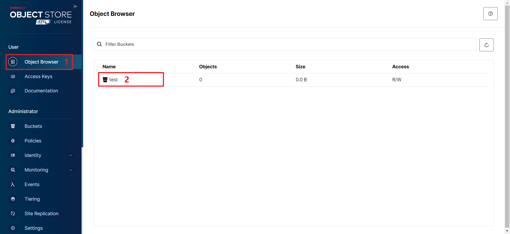

# 部署MinIO

在Linxu中部署MinIO，安装方式采用rpm离线安装，具体步骤可参考：[官方文档](https://min.io/docs/minio/linux/operations/install-deploy-manage/deploy-minio-single-node-single-drive.html#minio-snsd)。

#### 下载MinIO安装包

下载地址如下：

https://dl.min.io/server/minio/release/linux-amd64/archive/minio-20240613225353.0.0-1.x86_64.rpm

我们先进入到/opt目录，通过以下命令，以下命令将安装包下载至服务器：

```shell
wget https://dl.min.io/server/minio/release/linux-amd64/archive/minio-20240613225353.0.0-1.x86_64.rpm
```


#### 安装MinIO

```shell
rpm -ivh minio-20240613225353.0.0-1.x86_64.rpm
```

此时，MinIO就安装完毕了。


#### 测试MinIO服务

使用minio来启动MinIO服务，我们使用minio -h来查看一下minio的帮助信息：

 

其中有一项USAGE就表示着minio的语法：

`minio [FLAGES] COMMAND [ARGS...]`

其中[flages]就表示选项，可以传入的选项有--certs-dir、--quiet、--anonymous、--json、-h、--version。

COMMAND表示命令，只能使用server命令，server也就表示了去启动minio服务。

之后是[ARGS]，也就是该命令可以传入的参数，那minio server命令可以传入哪些参数呢？我们使用minio server --help来查看一下：

 

由USAGE用法中，可以看到，minio server可以传入flages，也可以传入dir。这个flages表示的是选项，这个dir表示的是目录。

flages可以传入的选项下面都有，这个dir目录也就是存储minio服务中的数据的。

那么，最简单的启动minio服务的语句是：

```shell
minio server ./
```

也就是启动minio服务，并将当前目录位置作为存储minio服务数据的目录。

 

出现出上面的界面，就表示MinIO服务启动成功。

上面有两个地址非常重要：

**1.MinIO的接口地址：**

 

若我们在项目中，去编写一个上传文件或删除文件的功能时，这个时候就需要访问这个接口地址。

 

那为什么会有三个地址呢？

这其实是因为Linux的虚拟机处在三个网络下，我们使用ifconfig来查看一下：

 

这三个网络分别是Vmware虚拟出来的虚拟子网、本地回环网络、以及虚拟网桥。在不同网络中，IP地址是不同的，MinIO服务在不同的网络中，IP地址也是不一样的，所以会出现三个不同的网络地址。

如果我们想要在主机中去访问MinIO的接口地址，也就是三个网络地址中的第一个的网络地址。


**2.MinIO后台服务管理界面地址：**

 

同样地，在这里会有三个地址，若我们想在主机中进行访问，访问的是第一个地址。

这里地址的端口号不是固定的，而是随机的，若能在主机中打开这个网络地址，说明minio服务是正常运行的：

 


#### 集成Systemd

**Systemd概述**

我们所使用的systemctl命令，都是由systemd命令所提供的。

Systemd是一个广泛应用于Linux系统的系统初始化和服务管理器，其可以管理系统中的各种服务和进程，包括启动、停止和重启服务，除此之外，其还可以检测各服务的运行状态，并在服务异常退出时，自动拉起服务，以保证服务的稳定性。系统的防火墙服务firewalld，我们自己安装的mysqld和redis均是由Systemd进行管理的，那么，我们将MinIO服务也交给Systemd管理。

**编写MinIO服务配置文件**

systemd所管理的服务需要由一个配置文件，这些配置文件均位于/etc/systemd/system/或/usr/lib/systemd/system/目录下，下面创建MinIO服务的配置文件。

执行以下命令创建并打开minio.service文件：

```shell
vim /etc/systemd/system/minio.service
```

内容如下，具体可参考MinIO官方文档：[官方文档](https://min.io/docs/minio/linux/operations/install-deploy-manage/deploy-minio-single-node-single-drive.html#create-the-systemd-service-file)。

```ini
[Unit]
Description=MinIO
Documentation=https://min.io/docs/minio/linux/index.html
Wants=network-online.target
After=network-online.target
AssertFileIsExecutable=/usr/local/bin/minio

[Service]
WorkingDirectory=/usr/local
ProtectProc=invisible
EnvironmentFile=-/etc/default/minio
ExecStartPre=/bin/bash -c "if [ -z \"${MINIO_VOLUMES}\" ]; then echo \"Variable MINIO_VOLUMES not set in /etc/default/minio\"; exit 1; fi"
ExecStart=/usr/local/bin/minio server $MINIO_OPTS $MINIO_VOLUMES
Restart=always
LimitNOFILE=65536
TasksMax=infinity
TimeoutStopSec=infinity
SendSIGKILL=no

[Install]
WantedBy=multi-user.target
```

需要注意的是，在粘贴时一定要将vim模式转换成输入模式，否则在一般模式下，粘贴的内容会不完整，因为普通模式下，会根据粘贴的内容执行相关命令。

**一些重要参数的说明：**

* `EnvirommentFile`：这个参数用于指定minio的环境变量文件，在这个文件中，可以配置MinIO服务所需的各项参数。也就是说，在这个文件中，可用于去配置一些参数，参数的格式是key=value的形式，然后我们在刚才常见的minio.service文件中可以引用这些参数。
* `EnexStart`：这个参数是用于配置MinIO服务的启动命令，也就是minio server，后面跟着的`$MINIO_OPTS`表示选项，`$MINIO_VOLUMES`表示MinIO服务的数据存储路径。这两个$符号的参数，均是引用于EnvironmentFile中的变量。
* `Restart`：表示当MinIO服务意外退出了，Systemd则会自动启动该服务。


**编写EnvironmentFile文件**

该EnvironmentFile文件，是用来配置MinIO的环境变量的。

使用vim命令来创建并且打开文件，注意文件目录必须与上面所配置的minio.service文件中的设置一样：

```shell
vim /etc/default/minio
```

内容如下：

```shell
MINIO_ROOT_USER=minioadmin
MINIO_ROOT_PASSWORD=minioadmin
MINIO_VOLUMES=/data
MINIO_OPTS="--console-address :9001"
```

**参数的含义：**

* `MINIO_ROOT_USER`和`MINIO_ROOT_PASSWORD`表示声明MINIO服务初始的用户名和密码。**注意**：用户名和密码长度至少为8位。
* `MINIO_VOLUMES`用于指定数据的存储路径，那么也就是说，我们将MINIO服务的数据存放在/data目录下。
* `MINIO_OPTS`用于配置启动minio服务的选项，这里我们只配置了--console-address的选项，这个选项表示的是固定minio服务的端口号。在上面说过，minio的api端口号是固定的，但是minio后台管理的端口号不是固定的，所以我们将其设置为固定的9001。


**创建minio存储数据的目录**

在上面，我们配置了MinIO服务的数据是存储在/data目录下的，所以我们这里要去创建data目录：

```shell
mkdir /data
```


#### 启动MinIO

在集成了Systemd服务之后，我们就不再使用minio server这样的语句去启动minio了，而是使用systemd给我们提供的命令systemctl：

```shell
systemctl start minio
```

执行以下命令查询运行状态：

```shell
systemctl status minio
```

设置MinIO开机自启：

```shell
systemctl enable minio
```


#### 访问MinIO管理页面

我们在之前的/etc/default/minio配置文件中，设置了MioIO的后台服务端口号为9001，所以我们在主机中访问虚拟机的MinIO后台服务页面的地址为：http://虚拟机地址:9001：

 


# 一、MinIO核心概念

MinIO是一个对象存储服务，对象存储服务是用来存储一些非结构化的数据。下面介绍MinIO中的几个核心概念。

* **对象（Object）**

  对象是实际的数据单元，例如我们上传的一个图片。

* **存储桶（Bucket）**

  存储桶是用于组织对象的命名空间，类似于文件夹。每个存储桶可以包含多个对象。

* **端点（Endpoint）**

  端点是MinIO服务器的网络地址，用于访问存储桶和对象，也就是MinIO的API地址，我在虚拟机所部署的MinIO端点为192.168.200.101。

  **注意：**

  9000为MinIO的API的默认端口，部署时配置的9001为管理页面端口。

* **Access Key 和 Secret Key**

  Access Key是用于标识和验证访问者身份的唯一标识符，相当于用户名。

  Secret Keyt是与Access Key关联的密码，用于验证访问者身份。


# 二、MinIO管理页面操作

1. **登录**

   管理页面的地址为：`192.168.200.101:9001`（这里的192.168.200.101是我的虚拟机地址，我在虚拟机上部署了MinIO，并且我在上面部署阶段，将MinIO的后台管理页面端口号修改为了9001，否则每次启动端口号都是随机的），在主机中进行访问，然后输入的用户名和密码是在部署时在`EnvironmentFile`文件中配置的如下参数：

   ```ini
   MINIO_ROOT_USER=minioadmin
   MINIO_ROOT_PASSWORD=minioadmin
   ```

    


2. **创建存储桶**

   在使用MinIO时，首先需要去创建一个桶，将对象数据放在桶里（实际上相当于创建一个文件夹）

   

   

   这里分别去填写的是桶的名称，以及三个选项，这三个选项所代表的含义是：

   * Versioning：版本控制，允许保存同一个Object的多个版本。这个功能就是去进行数据恢复的，当向桶中上传了同名的文件时，此时就会出现文件的覆盖（类似于文件系统中的覆盖），此时若开启了Versioning，就可以恢复原来的版本。

   * Object Locking：对象的锁。作用是为了防止对象被误删除。

   * Quota：可以用于限制桶中对象的大小。

   那么我这里就不去配置这三个选项了，只去创建一个名叫test的桶。


3. **在桶中上传文件**

   在Object Browser位置找到桶：

   

   然后，点击这个桶进入到桶内，然后点击Upload按钮上传文件：

   

   我们这里上传了一个1.jpg的图片：

    


4. **访问文件**

   在对象存储服务中，提供了HTTP访问功能，会为每一个对象分配一个IP地址，这个IP地址就是一个URL，我们可以直接通过这个URL地址，去访问这个对象。

   比如说，当前这个1.jpg图片，也有一个唯一的URL地址，我们可以通过这个URL地址，直接访问这个图片。

   对象URL为**`Endpoint+对象的存储路径`**，Endpoint也就是192.168.200.101:9000，是我自己虚拟机的IP地址:9000，对象存储路径也就是这个对象所存放的桶与自身名称，比如说，对于我上传的1.jpg图片，其URL是：`192.168.200.101:9000/test/1.jpg`。

   那么，我们在主机上去访问这个地址：

    

   发现，我们并没有能访问到这个图片，结果是报错的。

   原因实际上是因为，我们没有权限去访问到这个图片。

   那么，我们就需要先去修改一下权限了。


5. **权限修改**

   若想要通过HTTP协议，访问我们所上传的文件，需要先去修改**桶的权限**：

    

   当前这个test桶的访问权限是private，如下图所示，可选的访问权限一共有三种：

    

   * `Private`

     只允许桶的所有者对该桶进行读写。

   * `Public`

     允许所有人对该桶进行读写。

   * `Custom`

     自定义访问权限。

   在实际开发中，我们是肯定是希望管理员用户能够读写，但是普通用户只能读，不能写，所以此时就需要自定义访问权限，需要使用一个规定格式的JSON字符串进行描述。

   例如以下JSON字符串表达的含义是：允许（`Allow`）所有人（`*`）读取（`s3:GetObject`）指定桶（`test`）的所有内容。

   ```json
   {
     "Statement" : [ {
       "Action" : "s3:GetObject",
       "Effect" : "Allow",
       "Principal" : "*",
       "Resource" : "arn:aws:s3:::test/*"
     } ],
     "Version" : "2012-10-17"
   }
   ```

   这里没有配置桶的写权限，在默认情况下，桶只允许桶的所有者去写，所以我们就不需要配置桶的写权限了。

   那么将test桶的访问权限设置为Custom，并添加上述内容

   这样，重新访问http://192.168.200.101:9000/test/1.jpg，就可以访问到了：

    


# 三、MinIO JAVA SDK

我们来通过一个简单的案例，学习一下MinIO在Java中的用法：

**1、创建一个Maven工程**

**2、引入MinIO的依赖**

```xml
<dependency>
   <groupId>io.minio</groupId>
   <artifactId>minio</artifactId>
   <version>8.5.7</version>
</dependency>
```

**3、编写内容**

首先，若我们要使用MinIO去上传文件，我们需要先去获取MinIO的客户端对象，通过MinioClient这个类中的builder()方法，使用构造模式来创建MinioClient对象。需要传入endpoint端点地址，以及accessKey和secretKey：

```java
String endpoint = "http://192.168.200.101:9000";
String accessKey = "minioadmin";
String secretKey = "minioadmin";

MinioClient minioClient = MinioClient
    	.builder()
        .endpoint(endpoint)
        .credentials(accessKey, secretKey)
        .build();
```

我们要上传一个文件，得需要一个桶才行。之前我们是在后台管理页面中创建了一个桶，现在我们需要在代码中创建桶，在创建桶之前，先去判断桶是否存在，使用MinioClient对象中的bucketExists()方法进行判断：

```java
//首先判断我们要创建的桶是否存在
boolean isExists = minioClient.bucketExists(BucketExistsArgs.builder().bucket("test").build());
```

当桶不存在时，先去创建桶：

```java
//如果不存在，我们就要去创建桶
if (!isExists){
    //创建桶
    minioClient.makeBucket(MakeBucketArgs.builder().bucket("test").build());

    //设置桶的访问权限
    String policy = """
                {
                  "Statement" : [ {
                    "Action" : "s3:GetObject",
                    "Effect" : "Allow",
                    "Principal" : "*",
                    "Resource" : "arn:aws:s3:::hello-minio/*"
                  } ],
                  "Version" : "2012-10-17"
                }""";
    minioClient.setBucketPolicy(SetBucketPolicyArgs.builder().bucket("test").config(policy).build());
}
```

创建桶之后，就可以上传文件了，使用minioClient对象的uploadObject()方法上传对象：

```java
//上传图片
minioClient.uploadObject(UploadObjectArgs.builder().bucket("test").object("3.jpg").filename("C:\\Users\\14036\\Desktop\\studyCode\\minio\\src\\main\\resources\\images\\2.jpg").build());
```

完整代码：

```java
public class MinIOTest {
    public static void main(String[] args) throws ServerException, InsufficientDataException, ErrorResponseException, IOException, NoSuchAlgorithmException, InvalidKeyException, InvalidResponseException, XmlParserException, InternalException {
        String endpoint = "http://192.168.200.101:9000";
        String accessKey = "cheng";
        String secretKey = "061535asd";

        MinioClient minioClient = MinioClient.builder()
                .endpoint(endpoint)
                .credentials(accessKey, secretKey)
                .build();

        //首先判断我们要创建的桶是否存在
        boolean isExists = minioClient.bucketExists(BucketExistsArgs.builder().bucket("test").build());
        //如果不存在，我们就要去创建桶
        if (!isExists){
            //创建桶
            minioClient.makeBucket(MakeBucketArgs.builder().bucket("test").build());

            //设置桶的访问权限
            String policy = """
                        {
                          "Statement" : [ {
                            "Action" : "s3:GetObject",
                            "Effect" : "Allow",
                            "Principal" : "*",
                            "Resource" : "arn:aws:s3:::hello-minio/*"
                          } ],
                          "Version" : "2012-10-17"
                        }""";
            minioClient.setBucketPolicy(SetBucketPolicyArgs.builder().bucket("test").config(policy).build());
        }

        //上传图片
        minioClient.uploadObject(UploadObjectArgs.builder().bucket("test").object("2.jpg").filename("C:\\Users\\14036\\Desktop\\studyCode\\minio\\src\\main\\resources\\images\\2.jpg").build());
    }
}
```

此时，去执行，就成功往test桶中，上传了一个2.jpg的文件，也就能够通过浏览器访问这个图片了。

