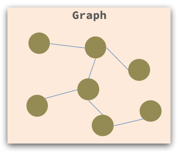
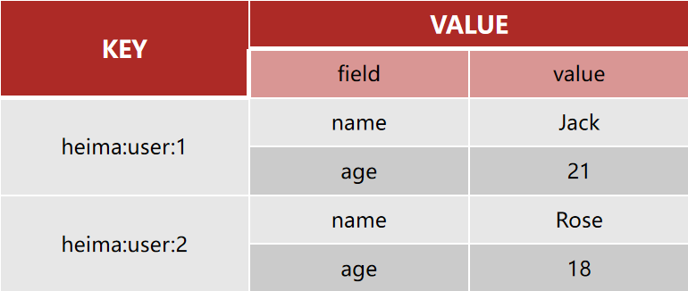

# 一、初识Redis

## 1、简单介绍

Redis是一种键值型的NoSql数据库，这里有两个关键字：

* `键值型`
* `NoSql`

其中键值型，是指Redis中存储的数据都是以key=value键值对的形式存储，而value的形式多种多样，可以是字符串、数值、甚至是json：


如上图所示，我们一般是将一个对象数据，作为一个value进行存储，存储的形式是一个json字符串，然后使用它的id作为key。

对于存储的数据，没有类似MySQL那么严格的约束，比如唯一性，是否可以为null等等，所以我们把这种松散结构的数据库，称之为NoSQL数据库。


## 2、认识NoSQL

SQL被称之为关系型数据库，NoSQL可以被翻译为Not Only SQL，或者是No SQL数据库。相对于传统的关系型数据库，NoSQL与之有着较大的差异，因此，我们将其称作**`非关系型数据库`**。

那么，现在我们来介绍一下这两者之间的差异：


**1）结构化 vs 非结构化**

传统的关系型数据是结构化数据，每一张表都有严格的约束信息、字段名、字段数据类型、字段约束等信息，插入的数据必须遵守这些约束。

 

而NoSQL则对数据库格式没有严格的约束，往往形式松散、自由。

可以是键值型：

 

也可以是文档型：

 

文档型数据，使用的是json类型格式的数据，一个数据，就是一条json语句。

甚至是图格式：

 

图类型的数据，一个数据，可以看成是图中的一个节点，节点与节点之间有着联系，不过这种格式使用的比较少。


**2）关联和非关联**

关系型数据库，之所以叫关系型数据库，是因为在数据库中，数据与数据之间往往是存在着关联的，例如外键约束：

 

在上例中，使用外键约束的方式，让tb_user与tb_order建立了关系，tb_order与tb_item建立了关系。

而非关系型数据库不存在关联关系，要维护关系要么靠代码中的业务逻辑，要么靠数据的冗余：

```json
{
  id: 1,
  name: "张三",
  orders: [
    {
       id: 1,
       item: {
			 id: 10, title: "荣耀6", price: 4999
       }
    },
    {
       id: 2,
       item: {
	 		id: 20, title: "小米11", price: 3999
       }
    }
  ]
}
```

在上例中，为了将张三的订单与商品荣耀和小米11建立关系，不得不将荣耀和小米11着两个商品的信息也保存在了订单的文档数据中，造成了数据的冗余。

所以，在NoSQL中，不存在关联关系，通过业务或者冗余数据的方式，关联数据，但是推荐使用业务处理的方式。

如何通过业务来关联数据呢？

在NoSQL中，再去创建文档数据，通过在业务中，指明使用id来进行关联，从而建立两个数据的关系。在NoSQL中，没有外键约束这种能够自动帮助我们建立关联关系，我们需要自己写业务逻辑，与其建立关系。（虽然在MySQL中，外键约束用的很少，也都是自己建立关联关系）


**3）查询方式的不同**

传统关系型数据库会基于SQL语句做查询，语法有统一的标准；

而不同的非关系型数据库查询语法不统一，不同的关系型数据库查询语法差异极大，五花八门各种各样，但是，NoSQL的语法会相对比较简单，没有SQL语法复杂。

  


**4）支持事务 vs 不支持事务**

传统关系型数据库能够支持事务，满足事务的ACID原则；

而非关系型数据库往往不支持事务，或者不能严格保证ACID的特性，只能实现基本的一致性。

 


**总结**

除了上述四点以外，在存储方式、扩展性、查询性能上，关系型数据库与非关系型数据库都有着显著的差异，总结如下：
 

- **存储方式**
  - 关系型数据库基于磁盘进行存储，会有大量的磁盘IO，对性能有一定影响
  - 非关系型数据库，他们的操作更多的是依赖于内存来操作，内存的读写速度会非常快，性能自然会好一些

* **扩展性**

  * 关系型数据库的扩展：

    关系型数据库集群模式一般是主从，主从数据一致，起到数据备份的作用，称为`主从复制`，也就是主库负责写，从库负责读，将读请求和写请求分隔开来，从而提高查询与修改的性能。

    如果关系型数据库中的数据表过多，可以进行垂直拆分，分成多个服务器，采用`垂直分库`的方式，将有关联的数据表部署到同一个数据库上；

    如果数据表中的列过多，还可以采用`垂直分表`的方式，将一张表拆分成多张数据表，将经常使用的列放在同一张表中。（类似于冷热数据分离）

    关系型数据库因为表之间存在关联关系，如果做水平扩展，也就是水平拆分，将一张表中的数据拆分放在多个表中，但这样会给数据查询带来很多麻烦。

  * 非关系型数据库可以将数据拆分，存储在不同机器上，可以保存海量数据，解决内存大小有限的问题。称为水平扩展。


---

## 3、认识Redis

Redis诞生于2009年，全称`Re`mote `D`ictionary `S`erver远程词典服务器，是一个基于内存的键值型NoSQL数据库。

**特征：**

* 键值（key-value）型，value支持多种不同数据结构，功能丰富
* 单线程，每个命令具备原子性
* 低延迟，速度快（基于内存、IO多路复用、良好的编码）
* 支持数据持久化
* 支持主从集群、分片集群
* 支持多语言客户端


---

## 4、Redis的安装与部署

大多数企业都是基于Linux服务来部署项目，而且Redis也没有提供Windows版本的安装包，因此我们都会基于Linux系统来安装Redis。

这里我们的Linux版本为`CentOS7`。


### 4.1、安装Redis依赖

Redis是基于C语言编写的，因此我们首先需要安装Redis所需的gcc依赖：

```shell
yum install -y gcc tcl
```

不过在使用yum命令之前，首先需要去配置yum的远程仓库（如果之间已经配置过则不需要再配置）：

```shell
yum -y install epel-release
```


### 4.2、上传安装包并解压

在安装好Redis的依赖后，我们就可以去安装Redis了，这里我们选择的Redis版本是6.2.6。

安装包已经下载到了lib目录下了，可以直接使用： [redis-6.2.6.tar.gz](lib\redis-6.2.6.tar.gz) 

我们将这个安装包，使用Xftp软件，将这个安装包复制到`/usr/local/src/`目录下，这个目录是用来存放用户编译软件的：

 

 

然后，我们进入到这个目录，进行解压缩：

```shell
tar -xzf redis-6.2.6.tar.gz
```

解压完成后：

 

可以看到，已经解压成功了。


然后，我们需要进入Redis的解压目录：

```shell
cd redis-6.2.6
```


之后，运行编译命令：

```shell
make && make install
```

执行结束后，此时redis就已经安装成功了。

如果出现了致命错误问题，则可以先去运行：

```shell
make MALLOC=libc
```

命令，执行完毕之后再来运行该命令。


默认的安装路径是在`/usr/local/bin`的目录下，让我们查看一下：

 

该目录下，存在着很多以redis开头的命令，并且该目录已经默认配置到path环境变量中，所以可以在任意的目录下运行这些命令。其中：

* `redis-cli`：是redis提供的命令行客户端
* `redis-server`：是redis服务端启动脚本
* `redis-sentinel`：是redis的哨兵启动脚本


### 4.3、启动Redis

#### 默认启动方式

安装完成后，我们可以在任意目录输入redis-server命令启动Redis：

```shell
redis-server
```

如图：


但是，这种启动属于前台启动，会阻塞整个会话窗口，当前的会话就无法执行命令了，只能执行Redis，直到Redis停止，所以不推荐使用这种方式。（与部署MinIO时类似）


#### 部署Systemd

与MinIO一样，Redis也是未部署Systemd的，无法让Systemd帮助我们管理Redis服务，所以，我们需要去给Redis部署Systemd。

**编写Redis服务配置文件**

在/etc/systemd/system/目录下，创建一个redis.service文件：

```shell
vim /etc/systemd/system/redis.service
```

内容如下：

```ini
[Unit]
Description=redis-server
After=network.target

[Service]
Type=forking
ExecStart=/usr/local/bin/redis-server /usr/local/src/redis-6.2.6/redis.conf
PrivateTmp=true

[Install]
WantedBy=multi-user.target
```

保存并退出。


**修改Redis配置文件**

在编写Redis服务配置文件中，我们配置了Redis的启动服务是redis-server，Redis的配置文件是/usr/local/src/redis-6.2.6/redis.conf，那么我们首先去配置一下该配置文件的信息。

首先，进入到redis软件目录下：

```shell
cd /usr/local/src/redis-6.2.6/
```

然后，修改redis.conf文件的一些配置：

```shell
vim redis.conf
```

修改配置（可以根据实际情况进行修改）：

```ini
# 允许访问的地址，默认是127.0.0.1，会导致只能在本地访问。修改为0.0.0.0则可以在任意IP访问，生产环境不要设置为0.0.0.0
bind 0.0.0.0
# 守护进程，修改为yes后redis服务即可后台运行
daemonize yes 
# 密码，设置后访问Redis必须输入密码
requirepass 061535asd
# 监听的端口
port 6379
# 工作目录，默认是当前目录，也就是运行redis-server时的命令，日志、持久化等文件会保存在这个目录
dir .
# 数据库数量，设置为1，代表只使用1个库，默认有16个库，编号0~15
databases 1
# 设置redis能够使用的最大内存
maxmemory 512mb
# 日志文件，默认为空，不记录日志，可以指定日志文件名
logfile "redis.log"
```

那么，此时redis就配置完毕了。


然后重载系统服务：

```shell
systemctl daemon-reload
```


此时，我们就可以使用systemctl命令，来控制Redis了：

```shell
# 启动
systemctl start redis
# 停止
systemctl stop redis
# 重启
systemctl restart redis
# 查看状态
systemctl status redis

# 设置Redis自启动
systemctl enable redis
# 查看Redis是否开机启动
systemctl is-enabled redis
# 设置redis开机不启动
systemctl disabled redis
```

那么，我们将Redis设置为自启动。


## 5、Redis桌面客户端

安装完成Redis，我们就可以操作Redis，实现数据的CRUD了，这需要用到Redis客户端，包括：

* 命令行客户端
* 图形化桌面客户端
* 编程客户端


### 5.1、Redis命令行客户端

Redis安装完成后，就自带了命令行客户端：**`redis-cli`**，使用方式如下：

```shell
redis-cli [options] [commonds]
```

这个命令行客户端，就类似于MySQL在Linux中，使用命令行去操作，即使用命令：mysql -uroot -p进行登录。在Redis中，就是使用redis-cli命令，去登录Redis数据库。

redis-cli的常见选项options有：

* `-h`：指定要连接的redis节点的IP地址，默认是127.0.0.1，也就是当前主机。
* `-p`：指定要连接的redis节点端口，默认是6379。
* `-a`：指定redis的访问密码。

commonds，指的是登录Redis进行操作的命令，例如：ping，也就是做心跳测试，服务端正常会返回pong，一般情况下不指定命令，因为我们希望的是进入redis控制台。

例如：

```shell
redis-cli -h 127.0.0.1 -p 6379
```

（这里的-h与-p选项其实都可以去掉，因为默认值就是127.0.0.1与6379）

使用上面的命令进入到Redis控制台中，对于-a输入密码，我们一般是使用上面命令之后，然后再使用`AUTH 用户名 密码`命令的方式，进行登录，因为这样比较安全一些：

 

只有使用了`AUTH 用户名 密码`登录之后，我们才可以去操作Redis数据库，否则没有权限，由于我们没有设置用户名，只设置了密码，所以可以直接使用密码登录。

比如，我们使用ping命令：

 

服务器返回PONG。

再比如我们还可以往其中存取数据：

 


### 5.2、图形化桌面客户端

有一个github大神，自己编写了Redis的Windows系统图形化客户端，下载地址是：https://github.com/lework/RedisDesktopManager-Windows/releases

我已经下载好了，放在了lib目录下： [resp-2022.5.zip](lib\resp-2022.5.zip) 解压后安装即可

**建立连接**

 

我这里连接的是我自己Linux虚拟机的地址，Redis是安装在虚拟机上的。

然后点击确定，就可以连接上了：

 

这里显示了16个库，Redis默认就是有16个库，编号从0到15，名字是固定的。

通过配置文件可以设置仓库数量，但是不能超过16个，并且不能自定义仓库的名称。

可以看到零号库，有我们之前往其中添加的数据：name=jack

 


如果我们使用的是图形化客户端，则可以直接通过点击的方式，去选择数据库；

如果我们使用的是命令行客户端redis-cli，则可以通过`select`命令来选择数据库：

```
# 选择0号库
select 0
```


当出现使用远程的图形化客户端无法访问Redis，但是在本地却可以使用redis-cli命令行客户端的方式访问Redis，在确定地址、端口号以及密码没有问题的情况下，有可能是因为Linux系统的防火墙未关闭，关闭防火墙即可访问：

```shell
# 关闭防火墙
systemctl stop firewalld

# 设置开机禁用防火墙
systemctl disable firewalld
```


---

# 二、Redis常见命令

## 如何去查找要使用的命令？

Redis是一个key-value的数据库，key一般是String类型，不过value的类型多种多样：


每一种不同的类型，就对应着不同的命令。

对于这些命令，我们不要死记硬背，学会查询即可。

Redis为了方便我们学习，将操作不同数据类型的命令也做了分组，在官网：[Commands | Docs (redis.io)](https://redis.io/docs/latest/commands/)中可以查看到不同类型的命令：

 

这样，在我们要使用时，直接去查即可。

我们也可以通过使用help命令，在Redis客户端中帮助我们查看不同数据类型的命令，如：help @generic表示查看通用命令，help @hash表示查看hash结构的命令：

 

每一组的第一行表示命令语法，第二行是去解释该命令，第三行是说明该命令的启用版本。

命令是非常多的，命令不需要记，只需要会使用帮助文档，使用时来查即可。


---

## 通用命令

通用命令是指对任何数据类型，都可以适用的命令。常见的命令有：

> 1. **KEYS**

**语法：`keys 表达式`**

**说明**：KEYS，表示去查看符合模板的所有key。

我们在客户端中，使用help command查看一下命令的具体用法：

 

可以看到，KEYS 后面跟上一个表达式，就是去查看符合表达式模板的所有key。

如：

```shell
KEYS *a*
```

就表示查看包含a字符的key

```shell
KEYS a??
```

就表示以a字符开头，后面跟着两个任意字符的key

*和?在Redis中是通配符，分别表示任意数量的任意字符，以及一个任意字符。

类似于在MySQL中的%与_。


使用KEYS命令，去查看所有符合模板的key，当数据很多时，Redis就需要去搜索很长的时间，又因为Redis是**`单线程`**的，所以在搜索时，其他所有的请求都会被阻塞，所以，**不建议在生产环境设备上使用**。


> 2. **DEL**

**语法格式：`DEL key [key...]`**

**说明**：用于删除指定的key，可以批量删除。

**用法**：

```shell
127.0.0.1:6379> help del #使用help命令查看用法

  DEL key [key ...]
  summary: Delete a key
  since: 1.0.0
  group: generic

127.0.0.1:6379> del name #删除单个
(integer) 1  #成功删除1个

127.0.0.1:6379> keys *
1) "age"

127.0.0.1:6379> MSET k1 v1 k2 v2 k3 v3 #批量添加数据
OK

127.0.0.1:6379> keys *
1) "k3"
2) "k2"
3) "k1"
4) "age"

127.0.0.1:6379> del k1 k2 k3 k4
(integer) 3   #此处返回的是成功删除的key，由于redis中只有k1,k2,k3 所以只成功删除3个，最终返回
127.0.0.1:6379>

127.0.0.1:6379> keys * #再查询全部的key
1) "age"	#只剩下一个了
```


> 3. **EXISTS**

**语法格式：`EXISTS key [key...]`**

**说明：**用于判断一个key是否存在，也可以批量判断。

**用法：**

```shell
127.0.0.1:6379> help EXISTS

  EXISTS key [key ...]
  summary: Determine if a key exists
  since: 1.0.0
  group: generic

127.0.0.1:6379> exists age  # 存在age
(integer) 1

127.0.0.1:6379> exists name  #不存在name
(integer) 0 
```


> 4. **EXPIRE**

**语法格式：`EXPIRE key seconds`**

**说明：**这个命令表示去给一个key设置有效期，有效期到期时，该key会被自动删除。

内存是非常宝贵的，对于一些数据，我们应当给它一些过期时间，当过期时间到了之后，它就会自动删除。

**用法：**

```shell
127.0.0.1:6379> expire age 10
(integer) 1

127.0.0.1:6379> ttl age #使用ttl命令，查看key的剩余有效期
(integer) 8

127.0.0.1:6379> ttl age
(integer) 6

127.0.0.1:6379> ttl age
(integer) -2

127.0.0.1:6379> ttl age
(integer) -2  #当这个key过期了，那么此时查询出来就是-2 

127.0.0.1:6379> keys *
(empty list or set)

127.0.0.1:6379> set age 10 #如果没有设置过期时间
OK

127.0.0.1:6379> ttl age
(integer) -1  # ttl的返回值就是-1
```

这里又涉及到了一个新的命令：ttl，ttl是去查看指定key的剩余有效期的。


**总结：**

* `KEYS`：查看符合模板的所有key，不建议在生产环境设备上使用。
* `DEL`：删除一个指定的key。
* `EXISTS`：判断key是否存在。
* `EXPIRE`：给key设置有效期，有效期到期后该key会被自动删除。
* `TTL`：查看一个key的剩余有效期。

通过`help 命令`可以查看一个命令的具体用法。


---

## String命令

String类型，也就是value是字符串类型，是Redis中最简单的存储类型。根据字符串的格式不同，可以分为三类：

* string：普通字符串
* int：整数类型，可以做自增、自减操作
* float：浮点类型，可以做自增、自减操作

不管是哪种格式，底层都是字节数组形式存储，只不过是编码方式不同。字符串类型的最大空间不能超过512m。


**常见命令：**

* **`SET`**：添加或修改已经存在的一个String类型键值对。
* **`GET`**：根据key获取String类型的value。
* **`MSET`**：批量添加或修改多个String类型键值对。
* **`MGET`**：根据多个key获取多个String类型的value.


* **`INCR`**：让一个整形的key自增1
* **`DECR`**：让一个整形的key自减1
* **`INCRBY`**：让一个整形的key自增并指定步长，例如：incrby num 2 让num值自增2（我们也可以让值变为负数来实现自增）
* **`DECRBY`**：让一个整形的key自减并指定步长，例如：decrby num 2 让num值自减2
* **`INCRBYFLOAT`**：让一个浮点类型的数据自增并指定步长


* **`SETNX`**：添加一个String类型的键值对，前提是这个key不存在，否则不执行
* **`SETEX`**：添加或修改一个String类型的键值对，并指定有效期


以上命令，除了INCRBYFLOAT外，都是常用命令。


**使用案例：**

* SET 和GET: 如果key不存在则是新增，如果存在则是修改

```java
127.0.0.1:6379> set name Rose  //原来不存在
OK

127.0.0.1:6379> get name 
"Rose"

127.0.0.1:6379> set name Jack //原来存在，就是修改
OK

127.0.0.1:6379> get name
"Jack"
```

* MSET和MGET

```java
127.0.0.1:6379> MSET k1 v1 k2 v2 k3 v3
OK

127.0.0.1:6379> MGET name age k1 k2 k3
1) "Jack" //之前存在的name
2) "10"   //之前存在的age
3) "v1"
4) "v2"
5) "v3"
```

* INCR和INCRBY和DECY

```java
127.0.0.1:6379> get age 
"10"

127.0.0.1:6379> incr age //增加1
(integer) 11
    
127.0.0.1:6379> get age //获得age
"11"

127.0.0.1:6379> incrby age 2 //一次增加2
(integer) 13 //返回目前的age的值
    
127.0.0.1:6379> incrby age 2
(integer) 15
    
127.0.0.1:6379> incrby age -1 //也可以增加负数，相当于减
(integer) 14
    
127.0.0.1:6379> incrby age -2 //一次减少2个
(integer) 12
    
127.0.0.1:6379> DECR age //相当于 incr 负数，减少正常用法
(integer) 11
    
127.0.0.1:6379> get age 
"11"

```

* SETNX

```java
127.0.0.1:6379> help setnx

  SETNX key value
  summary: Set the value of a key, only if the key does not exist
  since: 1.0.0
  group: string

127.0.0.1:6379> set name Jack  //设置名称
OK
127.0.0.1:6379> setnx name lisi //如果key不存在，则添加成功
(integer) 0
127.0.0.1:6379> get name //由于name已经存在，所以lisi的操作失败
"Jack"
127.0.0.1:6379> setnx name2 lisi //name2 不存在，所以操作成功
(integer) 1
127.0.0.1:6379> get name2 
"lisi"
```

* SETEX

```sh
127.0.0.1:6379> setex name 10 jack
OK

127.0.0.1:6379> ttl name
(integer) 8

127.0.0.1:6379> ttl name
(integer) 7

127.0.0.1:6379> ttl name
(integer) 5
```


---

## Key的层级结构

Redis由于是键值型的存储结果，即key=value的形式，类似于Map的存储结构，所以要求key是唯一的，那么，我们一般都是使用对象的id值作为key来存储。

但是，若都是将id值直接作为key，放在Redis数据库中的话，一些数值看起来就比较乱，不方便进行分类，并且不同数据表中的id值也可能相同，造成冲突。

在MySQL中，有表的概念，能够用于对不同的数据进行分类，那在Redis中，我们该如何区分不同类型的key呢？

例如：

我们需要使用存储用户、以及商品信息，用户的id为1，有一个商品的id也为1，此时使用id作为key就会产生冲突，该怎么办？

我们可以通过给key添加**前缀**用于分类：

Redis的key允许有多个单词形成**层级结构**，多个单词之间用"**`:`**"隔开，格式如下：

 

这个格式并非固定，也可以根据自己的需求来删除或添加此条。

比如，项目名叫project，有user和product两种不同类型的数据，我们可以这样定义key：

* user有关的key：`project:user:1`
* product有关的key：`project:product:1`

如果Value是一个Java对象，例如是一个User对象，则可以将对象序列化成为JSON字符串后存储：

| **KEY**           | **VALUE**                                 |
| ----------------- | ----------------------------------------- |
| project:user:1    | {"id":1, "name": "Jack", "age": 21}       |
| project:user:2    | {"id":2, "name":"Rose", "age": 18}        |
| project:product:1 | {"id":1, "name": "小米11", "price": 4999} |
| project:product:2 | {"id":2, "name":"荣耀6", "price": 2999}   |

当我们想redis中采用这种方式进行存储，那么在可视化界面中，redis会以层级结构来进行存储，形成类似于这样的结构，更加方便Redis获取数据：

 

 

这样数据会更加地清晰。


---

## Hash命令

Hash类型，也叫散列，其value类型是有一个无序的字典，类似于Java中的`HashMap`结构。

String结构是将对象序列化为JSON字符串胡存储，当需要修改对象某个字段时很不方便：


Hash结构可以将对象中的每个字段独立存储，可以针对单个字段做CRUD：



也就是说，Redis存储的数据本身就是key=value的形式，而对于value是Hash类型的数据，则value也是key=value的形式，那么整体数据就有点类似于`Map<String, Map<String, String>>`的结构了。

即，此时，对于Hash类型的value数据而言，其真正的结构是：

KEY={{field=value},{field=value}}


**Hash类型的常见命令**

* **`HSET key field value`**：添加或修改hash类型key的field的值
* **`HGET key field`**：获取一个hash类型key的field值。
* **`HMSET`**：批量添加多个hash类型key的field的值。
* **`HMGET`**：批量获取多个hash类型key的field的值。


* **`HGETALL`**：获取一个hash类型的key中所有的field和value。（有些类似于HashMap中的entrySet()方法，返回所有的Entry键值对）

* **`HKEYS`**：获取一个hash类型的key中所有的field。（有些类似于HashMap中的keySet()方法，返回所有的键）

* **`HVALS`**：获取一个hash类型的key中所有的value。（有些类似于HashMap中的values()方法，返回所有的值）

  

* **`HINCRBY`**：指定一个hash类型的field的字段值value（整数型）自增并指定步长。

  

* **`HSETNX`**：添加一个hash类型的key的field值，前提是这个field不存在，否则不执行，也就是在将原本String类型的SETNX命令改成了HASH类型的。


Hash类型，相较于String类型来说，value值从原本的String类型，变为了key=value的形式，多了一层key结构（field），所以，当我们要去添加/修改或获取最底层的value值时，需要在原本命令的基础上多加一层field结构。

哈希结构也是我们实际开发中常用的命令。

**使用案例**

* HSET和HGET

```shell
127.0.0.1:6379> HSET project:user:3 name lucy
(integer) 1

127.0.0.1:6379> HSET project:user:3 age 21
(integer) 1

127.0.0.1:6379> HGET project:user:3 name
"lucy"

127.0.0.1:6379> HGET project:user:3 age
"21"
```

在上例中，我们往project:user:3中添加了两个field值，分别是name=lucy以及age=21，在可视化界面中显示的结果是：

 

在hash类型的value中，内部也是key-value的形式。


* HMSET和HMGET

```java
127.0.0.1:6379> HMSET project:user:3 email 061535@qq.com gender 男
OK
    
127.0.0.1:6379> HMGET project:user:3 name age email gender
1) "lucy"
2) "21"
3) "061535@qq.com"
4) "\xe7\x94\xb7"
```


* HKEYS和HVALS

```shell
127.0.0.1:6379> HKEYS project:user:3
1) "name"
2) "age"
3) "email"
4) "gender"

127.0.0.1:6379> HVALS project:user:3
1) "lucy"
2) "21"
3) "061535@qq.com"
4) "\xe7\x94\xb7"
```


* HINCRBY

若使用整数，就表示自增；若使用负数，就表示自减。

```shell
127.0.0.1:6379> HINCRBY project:user:3 age 2
(integer) 23

127.0.0.1:6379> HINCRBY project:user:3 age 2
(integer) 25

127.0.0.1:6379> HINCRBY project:user:3 age -3
(integer) 22

127.0.0.1:6379> HINCRBY project:user:3 age -3
(integer) 19
```


* HSETNX

```shell
127.0.0.1:6379> HKEYS project:user:3
1) "name"
2) "age"
3) "email"
4) "gender"

127.0.0.1:6379> HVALS project:user:3
1) "lucy"
2) "19"
3) "061535@qq.com"
4) "\xe7\x94\xb7"

# 添加原本存在的field值，添加失败
127.0.0.1:6379> HSETNX project:user:3 name tom
(integer) 0

127.0.0.1:6379> HVALS project:user:3
1) "lucy"
2) "19"
3) "061535@qq.com"
4) "\xe7\x94\xb7"

# 添加原本不存在的field值，添加成功
127.0.0.1:6379> HSETNX project:user:3 balance 9000
(integer) 1

127.0.0.1:6379> HVALS project:user:3
1) "lucy"
2) "19"
3) "061535@qq.com"
4) "\xe7\x94\xb7"
5) "9000"
```


---

## List命令

Redis中value的List类型与Java中的LinkedList类似，可以看作是一个双向链表结构。既可以支持正向检索，也可以支持反向检索。

特征也与LinkedList类似：

* 有序
* 元素可以重复
* 插入和删除速度快
* 查询速度一般

**常用来存储对顺序有要求的数据**。例如：朋友圈点赞列表、评论列表等等。


**List类型常见的命令**

* **`LPUSH key element [element...]`**：向列表左侧插入一个或多个元素。
* **`LPOP key`**：移除并且返回列表左侧的第一个元素，没有则返回nil。
* **`RPUSH key element [element...]`**：向列表右侧插入一个或多个元素。
* **`RPOP key`**：移除并返回列表右侧的第一个元素。
* **`LRANGE key start end`**：返回一段角标范围内的所有元素。
* **`BLPOP`**和**`BRPOP`**：B指的是Block，即阻塞，该命令与LPOP和RPOP类似，只不过在该命令中可以去设置等待时间，当没有元素时进行等待（阻塞），而不是直接返回nil。


**使用案例：**

* LPUSH和RPUSH

```shell
127.0.0.1:6379> LPUSH project:user:4 tom jerry bob lucy john rudy
(integer) 6
```

此时，就是创建了一个List类型的key=value键值对，并且List链表的左侧分别插入了tom、jerry、bob、lucy、john以及rudy，返回结果是该List类型的value中一共有几条数据。

此时rudy是在链表的最左侧，可视化界面中的显示是rudy在最上面，也就是链表的最左侧：

 


使用RPUSH再往其中添加数据：

```shell
127.0.0.1:6379> RPUSH project:user:4 cheng
(integer) 7
```

此时，就是往链表的右侧添加数据，所以添加的cheng数据最终是在可视化界面中的最下面，在链表中在最右侧：

 


* LPOP和RPOP

```shell
127.0.0.1:6379> LPOP project:user:4
"rudy"
127.0.0.1:6379> RPOP project:user:4
"cheng"
```

LPOP和RPOP分别表示取出链表中最左侧与最右侧的数据，并返回。那么此时，project:user:4这个key中的数据是：

 

当链表中没有数据时，就返回nil。


* LRANGE

该命令用于返回List类型的value中，一段角标内所有元素，从0开始，并且是左右闭区间。

比如：LRANGE project:user:4 0 1，则表示返回project:user:4这个key中的List类型的value中，第一和第二个元素。

```shell
127.0.0.1:6379> LRANGE project:user:4 0 1
1) "john"
2) "lucy"
```


* BLPOP和BRPOP

该命令与LPOP和RPOP类似，也是去取出value这个双向链表的数据，只不过，与LPOP和RPOP不同的是，当不存在数据时，并不会返回nil，而是进入阻塞状态，直到数据被添加或者超时才会退出。

例如，我去创建两个会话，来访问Redis，分别是server1和server2，在server1中，使用BLPOP去获取project:user:5中双向链表的最左侧数据，并且设置了超时时长为20：

```shell
BLPOP project:user:5 20
```

由于project:user:5这个key并不存在，所以，此时server1就会进入到阻塞状态，直到20秒时间到，此时就会返回nil并且显示阻塞的时长：

 

如果在server1阻塞状态时，有其他的用户添加了List数据，比如，我们在server2中添加了数据：

```shell
127.0.0.1:6379> LPUSH project:user:5 tom 
```

此时，server1就会提前退出阻塞状态，并且获得刚才添加的数据：

 

并且显示key，以及获取到的value双向链表中的值，以及阻塞的时长。


**思考：**

如何利用List结构模拟一个栈？

* 入口和出口在同一边。

如何利用List结构模拟一个队列？

* 入口和出口不在同一边。

如何利用List结构模拟一个阻塞队列？

* 入口和出口在不同边。

* 出队列时使用BLPOP或BRPOP。


---

## Set命令

Redis的Set结构与Java中的HashSet类似，可以看作是一个value为null的HashMap，因为也是一个hash表，因此具备与HashSet类似的特征：

* `无序`
* `元素不可重复`
* `查找速度快`
* `支持交集、并集、差集等功能`


**Set常见命令**

**单个集合的操作：**

* **`SADD key member [member...]`**：向Set中添加一个或多个元素
* **`SREM key member [member...]`**：移除Set中的指定元素
* **`SCARD key`**：返回Set中元素的个数
* **`SISMEMBER key member`**：判断一个元素是否存在于Set中，返回1表示存在，返回0表示不存在。
* **`SMEMBERS key`**：获取Set中的所有元素。

**多个集合之间的操作：**

* **`SINTER key1 key2...`**：求key1和key2之间的交集。
* **`SDIFF key1 key2...`**：求key1中有，但是key2中没有的元素。（差集）
* **`SUNION key1 key2...`**：求key1和key2之间的并集。


如上图：

SINTER S1 S2，结果为B C

SDIFF S1 S2，结果为A

SUNION S1 S2，结果为A B C D


**使用案例**

* 增删改查操作

```shell
127.0.0.1:6379> SADD project:user:6 tom jerry lucy
(integer) 3

127.0.0.1:6379> SMEMBERS project:user:6
1) "jerry"
2) "lucy"
3) "tom"

127.0.0.1:6379> SCARD project:user:6
(integer) 3

127.0.0.1:6379> SISMEMBER project:user:6 jerry
(integer) 1
127.0.0.1:6379> SISMEMBER project:user:6 bob
(integer) 0

127.0.0.1:6379> SREM project:user:6 tom
(integer) 1

127.0.0.1:6379> SMEMBERS project:user:6
1) "jerry"
2) "lucy"
```


* 两个集合之间的操作

案例：

将下列数据用Redis的Set集合来存储：

* 张三的好友有：李四.王五.赵六
* 李四的好友有：王五.麻子.二狗

利用Set的命令实现下列功能：

* 计算张三的好友有几人
* 计算张三和李四有哪些共同好友
* 查询哪些人是张三的好友却不是李四的好友
* 查询张三和李四的好友总共有哪些人
* 判断李四是否是张三的好友
* 判断张三是否是李四的好友
* 将李四从张三的好友列表中移除

```shell
127.0.0.1:6379> SADD zs lisi wangwu zhaoliu
(integer) 3
    
127.0.0.1:6379> SADD ls wangwu mazi ergou
(integer) 3
    
127.0.0.1:6379> SCARD zs
(integer) 3
    
127.0.0.1:6379> SINTER zs ls
1) "wangwu"
    
127.0.0.1:6379> SDIFF zs ls
1) "zhaoliu"
2) "lisi"
    
127.0.0.1:6379> SUNION zs ls
1) "wangwu"
2) "zhaoliu"
3) "lisi"
4) "mazi"
5) "ergou"
    
127.0.0.1:6379> SISMEMBER zs lisi
(integer) 1
    
127.0.0.1:6379> SISMEMBER ls zhangsan
(integer) 0
    
127.0.0.1:6379> SREM zs lisi
(integer) 1
    
127.0.0.1:6379> SMEMBERS zs
1) "zhaoliu"
2) "wangwu"
```


---

## SortedSet命令

Redis中的SortedSet类型数据是一个可排序的Set集合，在功能上与Java中的TreeSet有些类似，但底层数据结构却差别很大。SortedSet中的每一个元素都带有一个`score`属性，可以基于`score`属性对元素进行排序，底层的实现是一个调表（SkipList）加hash表。

SortedSet具备下列特征：

* `可排序`
* `元素不可重复`
* `查询速度快`

因为SortedSet的可排序特性，经常被用来实现排行榜这样的功能。


**SortedSet常见命令**

* **`ZADD key score member [score member]`**：添加一个或多个元素到SortedSet中，如果已经存在则更新其score值。
* **`ZREM key member [member]`**：删除SortedSet中的一个或多个指定元素。
* **`ZCARD key`**：获取SortedSet中的元素个数。
* **`ZSCORE key member`**：获取SortedSet中指定元素的score值。


* **`ZINCRBY key increment member`**：让SortedSet中指定元素的score值自增指定的increment值。


* **`ZRANK key member`**：升序获取SortedSet中指定元素的排名。
* **`ZREVRANK key member`**：降序获取SortedSet中指定元素的排名。


* **`ZCOUNT key min max`**：统计score值在给定范围内所有元素的个数。


* **`ZRANGE key min max`**：按照score排序后，获取指定排名范围内的元素，排名从0开始。（根据排名范围获取元素）
* **`ZRANGEBYSCORE key min max`**：按照score排序后，获取指定score范围内的元素。（根据score值范围获取元素）


* **`ZDIFF、ZINTER、ZUNION`**：求差集、交集、并集。


> **注意：以上的排名默认都是`升序`，即元素按照score的值从小到大进行排序。如果要`降序`，则在命令Z的后面添加`REV`即可。**

例如：

* 升序获取SortedSet中指定排名范围内的元素：`ZRANGE key min max`。
* 降序获取SortedSet中指定排名范围内的元素：`ZREVRANGE key min max`。


**使用案例**

将班级的下列学生得分存入Redis的SortedSet中：

Jack85,Lucy89,Rose82,Tom95,Jerry78,Amy92,Miles76

并且实现下列功能：

* 删除Tom同学
* 获取Amy同学的分数
* 获取Rose同学的排名
* 查询80分以下有几个学生
* 给Amy同学加2分
* 查出成绩前3名的同学
* 查出成绩80分以下的所有同学

```shell
# 添加元素
127.0.0.1:6379> ZADD stuscore 85 Jack 89 Lucy 82 Rose 95 Tom 78 Jerry 92 Amy 76 Miles
(integer) 7

# 删除元素
127.0.0.1:6379> ZREM stuscore Tom
(integer) 1

# 获取元素的score值
127.0.0.1:6379> ZSCORE stuscore Amy
"92"

# 根据score值倒序排序，获取指定元素的排名
127.0.0.1:6379> ZREVRANK stuscore Rose
(integer) 3

# 获取score指定范围内的元素个数
127.0.0.1:6379> ZCOUNT stuscore 0 80
(integer) 2

# 给元素的score值自增
127.0.0.1:6379> ZINCRBY stuscore 2 Amy
"94"

# 根据socre倒序排序，获取前三名的元素
127.0.0.1:6379> ZREVRANGE stuscore 0 2
1) "Amy"
2) "Lucy"
3) "Jack"

# 获取指定score范围内的元素
127.0.0.1:6379> ZRANGEBYSCORE stuscore 0 80
1) "Miles"
2) "Jerry"
```


---

# 三、Redis的Java客户端

Redis支持多种语言来操作Redis数据库，其中就包括了Java语言。

在Redis的官方文档中，推荐使用两种Java的客户端来操作Redis，分别是Jedis和lettuce：

   

**三种Redis的Java客户端特征**

* `Jedis`：Jedis以Redis命令作为方法名称，学习成本低，简单实用。但是Jedis实例是线程不安全的，多个线程操作同一个实例可能会造成线程安全问题，所以在多线程环境下，需要使用连接池，创建多个Jedis实例。
* `Lettuce`：Lettuce是基于Netty实现的，支持同步、异步和响应式编程方式，并且是线程安全的。支持Redis的哨兵模式、集群模式和管道模式。
* `Redisson`：Redisson是一个基于Redis是实现的分布式、可伸缩的Java数据结构集合。包含了诸如Map、Queue、Lock、Semaphore、AtomicLong等强大功能。这些类是单机的，在分布式的环境下往往会失去作用，而Redisson是基于Redis来实现了这些功能，就能够满足分布式的要求，当我们要在分布式的环境下去使用这些集合，就可以使用Redisson。


我们这里介绍两种Java客户端，分别是`Jedis`和`SpringDataRedis`，这两种客户端的关系有些类似于JDBC和MyBatis之间的关系：MyBatis是在JDBC的基础上再包装了一层；SpringDataRedis也是一样的，Spring帮助我们整合了Jedis以及Lettuce两种Redis客户端，在两者的基础上进行了封装整合，这样能够更好地融入Spring环境，并且我们可以自主地选择使用哪一种Redis客户端（默认使用Lettuce）。

所以，我们重点学习`SpringDataRedis`，学习了SpringDataRedis，就相当于学习了Jedis和Lettuce两种客户端。

而对于`Redisson`，它在分布式上的功能较为突出，我们在学习分布式锁时再学习。


---

## Jedis快速入门

**特征**

以Redis的命令作为方法名称，学习成本低，简单实用。但是Jedis实例是线程不安全的，也就是说，当多个线程去操作同一个Jedis实例时，会存在线程的安全问题。所以，我们需要为每一个线程，都创建Jedis实例，所以多线程环境下需要基于连接池来使用。


### 快速入门详细步骤

1. **创建工程**

创建一个工程，用于学习Jedis快速入门案例，比如叫做jedis-demo：

 

2. **引入依赖**

```xml
<dependency>
   <groupId>redis.clients</groupId>
   <artifactId>jedis</artifactId>
   <version>5.1.0</version>
</dependency>
```

然后，我们使用单元测试的方式来实现Jedis的入门案例，所以，我们还需要引入单元测试的依赖。

```xml
<dependency>
    <groupId>org.junit.jupiter</groupId>
    <artifactId>junit-jupiter</artifactId>
    <version>5.11.0-M2</version>
</dependency>
```


3. **建立连接**

创建一个单元测试类，来学习Jedis的入门案例，在这个类中，每个单元测试方法都对Jedis进行测试。

那么，我们使用使用单元测试的@BeforeEach注解，在每个测试方法执行前，都去调用setUp()方法，建立连接：

```java
public class JedisTest {
    private Jedis jedis;

    @BeforeEach
    public void setUp(){
        //建立连接
        jedis = new Jedis("192.168.1.102", 6379);

        //设置密码
        jedis.auth("061535asd");

        //选用库
        jedis.select(0);
    }
}
```


4. **关闭连接**

在实际测试之前，我们还需要再去创建有一个关闭连接的方法，用于在每个测试方法之后都去关闭redis的连接。使用单元测试给我们提供的`@AfterEach`注解，表示在每个单元测试方法后都去调用：

```java
@AfterEach
public void teardown(){
    //关闭连接
    if (jedis != null){
        jedis.close();
    }
}
```


5. **测试**

```java
//测试String类型数据
@Test
public void testString(){
    //存入数据
    String result = jedis.set("name", "tom");
    System.out.println(result); //OK

    //获取数据
    String name = jedis.get("name");
    System.out.println(name); //tom
}

//测试Hash类型数据
@Test
public void testHash(){
    //存入Hash数据，使用Map存入
    HashMap<String, String> map = new HashMap<>();
    map.put("name", "jerry");
    map.put("age", "24");
    map.put("email", "1403642083@qq.com");
    long result = jedis.hset("user", map);
    System.out.println(result); //3

    //获取Hash数据
    String userName = jedis.hget("user", "name");
    System.out.println(userName); //jerry

    //获取key中所有的Hash数据
    Map<String, String> map1 = jedis.hgetAll("user");
    System.out.println(map1); //{name=jerry, age=24, email=1403642083@qq.com}
}

//测试List类型数据
@Test
public void testList(){
    //往双向链表左侧添加数据
    jedis.lpush("stus", "tom","jerry","lucy","bob");

    //获取双向链表中的数据
    List<String> stus = jedis.lrange("stus", 0, 10);
    System.out.println(stus); //[bob, lucy, jerry, tom]

    //从右侧取出2个数据
    System.out.println(jedis.rpop("stus",2)); // [tom, jerry]

    //再去获取所有数据
    System.out.println(jedis.lrange("stus",0,10)); // [bob, lucy]
}
```


可以看到，Jedis非常简单，方法名与Redis命令是一样的，我们只需要知道命令就可以知道对应的方法。


### 使用Jedis连接池

Jedis是线程不安全的，所以多个线程若是使用同一个Jedis对象的话，存在线程的安全问题。但是，如果每个线程都自己去创建Jedis对象的话，则频繁地创建和销毁连接会有性能的损耗，因此，建议使用`Jedis连接池`的方式代替Jedis的直连。

其实，连接池的操作步骤和上面步骤基本一致，获取Jedis对象的方式由原来的主动创建，变成了从连接池中获取。

按照程序设计的思想，把从Jedis连接池中获取jedis对象的操作，封装成工具类。如下：

```java
public class JedisConnectionFactory {
    private static final JedisPool jedisPool;

    static {
        //配置连接池
        JedisPoolConfig config = new JedisPoolConfig();
        //最大连接数量
        config.setMaxTotal(8);
        //最大空闲连接
        config.setMaxIdle(8);
        //最小空闲连接
        config.setMinIdle(0);
        //设置最长等待时间
        config.setMaxWait(Duration.ofMillis(1000));
        jedisPool = new JedisPool(config, "192.168.1.102", 6379);
    }
    
    public static Jedis getJedis(){
        return jedisPool.getResource();
    }
}
```


这样，我们就能够直接通过这个Jedis连接池，获取到Jedis对象，不需要每次都去创建，能够减少资源的损耗：

```java
@BeforeEach
public void setUp(){
    //建立连接
    jedis = JedisConnectionFactory.getJedis();

    //设置密码
    jedis.auth("061535asd");

    //选用库
    jedis.select(0);
}
```


---

## SpringDataRedis

### 认识SpringDataRedis

SpringData是Spring中数据操作的模块，包含对各种数据库的集成，其中对Redis的集成模块就叫做SpringDataRedis，官网地址:https://spring.io/projects/spring-data-redis

* 提供了对不同Redis客户端的整合（Lettuce和Jedis）
* 提供了RedisTemplate统一API来操作Redis，类似于JDBCTemplate
* 支持Redis的发布订阅模型
* 支持Redis哨兵和Redis集群
* 支持基于Lettuce的响应式编程
* 支持基于JDK、JSON、字符串、Spring对象的数据序列化及反序列化
* 支持基于Redis的JDKCollection实现

SpringDataRedis提供了RedisTemplate工具类，其中封装了各种对Redis的操作。并且将不同数据类型的操作API封装了不同的类型中：


### 快速入门

SpringBoot已提供了对SpringDataRedis的支持，使用非常简单。

**实现步骤**

1. **创建SpringBoot项目**

首先，我们要去创建一个项目，比如叫做spring-data-redis-demo，然后在这个项目中，将spring-boot-starter-parent的jar包作为当前项目的父工程：

```xml
<parent>
    <groupId>org.springframework.boot</groupId>
    <artifactId>spring-boot-starter-parent</artifactId>
    <version>3.0.5</version>
    <relativePath />
</parent>
```


2. **引入redis的依赖**

SpringBoot提供了对Spring Data Redis的支持，在Spring Boot项目中，可以直接引入`spring-boot-starter-data-redis`来完成Spring Data Redis的自动配置，具体依赖如下：

```xml
<!--redis依赖-->
<dependency>
    <groupId>org.springframework.boot</groupId>
    <artifactId>spring-boot-starter-data-redis</artifactId>
</dependency>
```

在这个案例中，我们还使用到了SpringBoot整合的单元测试，所以我们还需要引入整合单元测试的依赖：

```xml
<dependency>
    <groupId>org.springframework.boot</groupId>
    <artifactId>spring-boot-starter-test</artifactId>
</dependency>
```


3. **配置application.yml文件**

在application.yml文件中，增加如下的参数：

```yaml
spring:
  data:
    redis:
      host: 192.168.1.102
      port: 6379
      password: 061535asd
      lettuce:
        pool:
          max-active: 8  #最大连接数
          max-idle: 8 #最大空闲连接
          min-idle: 0 #最小空闲连接
          max-wait: 100ms #连接等待时间
```

注意，不同的版本yaml参数的配置可能是不同的。

4. **使用案例**

由于RedisTemplate对象在启动SpringBoot服务时，就会放入到Spring的IOC容器中进行管理，所以，我们可以使用`@Autowired`注解在类中注入该类型的对象属性进行使用。如下例所示，RedisTemplate类是带有两个泛型的，我们注入的是<String, String>的泛型，然后通过`opsForValue()`方法，获取`ValueOperations`类型对象，操作String类型的数据：

```java
@SpringBootTest
public class RedisTest{
    @Autowired
    private RedisTemplate<String, Object> redisTemplate;

    @Test
    public void testRedis(){
        //设置数据
        ValueOperations<String, Object> operations = redisTemplate.opsForValue();
        operations.set("name", "jack");
        
        //获取数据
        System.out.println(operations.get("name"));
    }

}
```

执行该测试方法，结果：

 

执行报错了，报错结果说明没有找到RedisTemplate<String, Object>可以匹配的Bean。

那假如我们注入时，不指定K、V的类型，或者使用<String, String>类型的泛型：

```java
@Autowired
private RedisTemplate redisTemplate;

//或者

@Autowired
private RedisTemplate<String, String> redisTemplate;
```

重新启动服务，发现此时就不会报错，注入Bean成功。那为什么RedisTemplate<String, Object>注入Bean会失败？

**解决方案：**

**要想获取RedisTemplate<String, Object>的Bean，要根据名字装配（`@Resource`），而不能根据类型装配（@Autowired）。**

所以，将上面的代码修改后：

```java
@SpringBootTest
public class RedisTest{
    @Resource
    private RedisTemplate<String, Object> redisTemplate;

    @Test
    public void testRedis(){
        //设置数据
        ValueOperations<String, Object> operations = redisTemplate.opsForValue();
        operations.set("name", "jack");
        
        //获取数据
        System.out.println(operations.get("name"));
    }

}
```

此时就能够正常执行了，执行结果：

 


---

### RedisSerializer数据序列化

#### 问题说明

刚才，我们使用了RedisTemplate，往Redis中存入的数据，那么，我们现在使用命令行客户端，去获取一下：

 

发现结果不对啊，我刚才明明往其中添加的是jack数据才对，怎么是tom。

我们来获取一下所有的key：

 

其实，我们刚才往Redis中存放的数据，是这第12个数据，我们来获取一下key的value：

 

你肯定会觉得很奇怪，我们的键值对明明是name=jack的形式，为什么存到Redis中，就变成了一个一个的字节符号。

**解释：**

上述问题的根本原因是，Redis中的key和value均是以二进制的形式存储的，因此客户端输入的key和value都会经过序列化之后才发往Redis服务端。而RedisTemplate所使用序列化方式和命令行客户端采用序列化方式不相同，进而导致序列化之后的二进制数据不同，所以才会导致上述的现象。


SpringDataRedis可以接收任何类型的对象，然后将其转换成字节存储在Redis数据库中。

RedisTemplate的set()方法，接收的参数都是Object类型的数据，它会将我们传入的key、value都看作是一个对象数据，全都转换成字节类型的数据存放在Redis中（序列化），所以，此时我们在Redis数据库中，看到的key和value都是一些字节类型的数据。RedisTemplate将对象转换成字节类型默认使用的是`JDK序列化`。

当我们使用get()方法去获取时，同样地也会使用JDK序列化，将传入的数据转换成字节类型数据，进入到Redis中匹配对应的value，并将value使用`JDK反序列化`转换回对象类型（反序列化），再返回给用户。


以上，就是为什么我们存放name=jack数据到Redis中，Redis中的数据都是一些字节码的原因。

我们也可以去往其中存放对象类型的数据，看是否实现了序列化。

**测试：**

我们去创建一个User类型，往Redis中存放User类型对象测试一下。

创建User类型

```java
@Data
public class User {
    private String name;
    private Integer age;
    private String email;
}
```

注意，这里的User类型并没有去实现Serializable接口，所以该类型的对象不能实现序列化。

然后去使用RedisTemplate来将User类型的对象存入到Redis中进行测试：

```java
@SpringBootTest
public class RedisTest{
    @Resource
    private RedisTemplate<String, Object> redisTemplate;

    @Test
    public void testRedis2(){
        ValueOperations<String, Object> operations = redisTemplate.opsForValue();
        User user = new User();
        user.setAge(24);
        user.setName("cheng");
        user.setEmail("rudy@qq.com");
        //序列化
        operations.set("user", user);

        //反序列化
        User user1 = (User) operations.get("user");
        System.out.println(user1);
    }

}
```

此时的执行结果：

 

执行报错：Cannot serialize，即不能对User类型对象进行序列化。

我们将User类型修改一下：

```java
@Data
public class User implements Serializable {
    private static final long serialVersionUID = 1L;
    private String name;
    private Integer age;
    private String email;
}
```

让其实现Serializable接口，并且在其中创建serialVersionUID的属性。

此时，再去执行测试方法，执行结果：

 

即，此时User对象成功存入到了Redis数据库中，并且成功使用get()方法获取。


由上面的案例我们可以得知：

> **使用RedisTemplate往Redis中存入的数据，实际上都是将`Java对象`存入到其中，会经过序列化与反序列化的过程。**
>
> **如果我们要想往Redis数据库中存入数据，就必须让类以及类的属性实现序列化的接口`Serializable`，否则在往其中存入数据时就会报错。**

（由于String类型的数据，本身就已经实现了序列化接口，所以直接就可以使用）

具体内容，可以查看笔记： [序列化与反序列化.md](..\常用的笔记\序列化与反序列化.md) 


但是，对于使用JDK序列化的方式，得到的结果是这样的：


这样的结果可读性差、并且内存占用较大。如果我们一个对象的数据很多时，此时JDK序列化后的结果数据就会特别长，又臭又长。

SpringDataRedis给我们提供了自定义RedisTemplate的序列化方式，我们可以自己去自定义序列化的格式。


#### 自定义序列化

RedisTemplate对于不同类型的数据，可以分别设置序列化机制：

 

其中，`keySerializer`表示着所有key的序列化方式；

`valueSerializer`表示着所有value的序列化方式；

`hashKeySerializer`表示在hash类型的数据中，其hashKey，也就是键值对中，值中的field的序列化方式（三个值中的第二个）；

`hashValueSerializer`表示在hash类型的数据中，其hashValue，也就是键值对中的value的序列化方式（三个值中的最后第一个）。


这些属性都是**`RedisSerializer`**接口类型的，该接口表示的是序列化的类型，该接口的所有实现类：

 

其中，比较常用的是JdkSerializationRedisSerializer、Jackson2JsonRedisSerializer以及StringRedisSerializer。

* `JdkSerializationRedisSerializer`，表示的是JDK序列化类型，上述四种属性默认会被赋该类型对象的值。但是，这种类型不好用。

* **`StringRedisSerializer`**，这种序列化类型是专门用来处理`String`字符串类型的数据的。

  我们知道，字符串要想转成字节型数据，实现序列化，只需要调用String类型的getBytes()方法即可，没必要使用JDK序列化实现。我们可以控制底层的编码格式。

  所以，当我们要存入的数据中，key是字符串或者value是字符串，都可以使用这种类型来进行序列化。

* **`GenericJackson2JsonRedisSerializer`**，这种类型是用来将`对象`类型的数据转换成JSON字符串类型进行序列化的。

  对于对象类型的数据，无论是key还是value，如果是对象类型的数据，都建议转换成JSON字符串类型的数据进行序列化，此时就使用这种类型。


**自定义序列化的实现**

在实际开发中，key一般都是字符串类型，value一般都是Object类型，hashKey（也就是hash类型中的field）一般都是字符串类型，hashValue一般都是Object类型。

所以，我们一般都会给key、hashKey使用StringRedisSerializer进行赋值，给value、hashValue使用GenericJackson2JsonRedisSerializer进行赋值。

不过在此之前，我们需要先引入Jackson的依赖（如果是在web项目中，由于引入的spring-boot-starter-web中包含了jackson，就不需要引入了）：

```xml
<!--Jackson依赖-->
<dependency>
    <groupId>com.fasterxml.jackson.core</groupId>
    <artifactId>jackson-databind</artifactId>
</dependency>
```

然后，在启动类的包下，如com.rudy.config包中，创建一个配置类RedisConfig，用于去创建一个RedisTemplate的对象，设置其中的参数，加入到IOC容器中：

```java
@Configuration
public class RedisConfig {
    
    @Bean
    public RedisTemplate<String, Object> redisTemplate(RedisConnectionFactory redisConnectionFactory){
        //创建RedisTemplate对象
        RedisTemplate<String, Object> template = new RedisTemplate<>();
        
        //设置连接工厂
        template.setConnectionFactory(redisConnectionFactory);
        
        //创建对象的序列化类型（转换为JSON字符串）
        GenericJackson2JsonRedisSerializer jsonRedisSerializer = new GenericJackson2JsonRedisSerializer();

        //设置Key的序列化
        template.setKeySerializer(RedisSerializer.string());
        template.setHashKeySerializer(RedisSerializer.string());

        //设置value的序列化
        template.setValueSerializer(jsonRedisSerializer);
        template.setHashValueSerializer(jsonRedisSerializer);

        return template;
    }
}
```

这里的RedisSerilizer.string()方法，实际上就是获取了编码格式是UTF-8的StringRedisSerializer序列化类型对象。也就是说，key与hashkey都是使用UTF-8的编码将字符串转换成字节数据存储。

 


**测试1**

```java
@SpringBootTest
public class RedisTest{
    @Resource
    private RedisTemplate<String, Object> redisTemplate;

    @Test
    public void testRedis1(){
        //设置数据
        ValueOperations<String, Object> operations = redisTemplate.opsForValue();
        operations.set("name", "jack");
        //获取数据
        System.out.println(operations.get("name"));
    }
}
```

执行之后，此时Redis数据库中显示的格式：

 


**测试2**：测试往Redis中存入对象类型数据

User类（类要实现序列化接口）

```java
@Data
public class User implements Serializable {
    private static final long serialVersionUID = 1L;
    private String name;
    private Integer age;
    private String email;
}
```

测试

```java
@Test
public void testRedis2(){
    ValueOperations<String, Object> operations = redisTemplate.opsForValue();
    User user = new User();
    user.setAge(24);
    user.setName("cheng");
    user.setEmail("rudy@qq.com");
    //序列化
    operations.set("user", user);

    //反序列化
    User user1 = (User) operations.get("user");
    System.out.println(user1);
}
```

此时，Redis中的存储的数据：

 

就是以JSON字符串的格式，非常清晰。


**测试3**：存入Hash类型的数据

Emp类型

```java
@Data
@AllArgsConstructor
public class Emp implements Serializable {
    private static final long serialVersionUID = 1L;
    private Integer empId;
    private String empName;
    private Integer age;
    private Double balance;
}
```

测试

```java
@Test
public void testRedis4(){
    Emp e1 = new Emp(1, "tom", 24, 8000.00);
    Emp e2 = new Emp(2, "jerry", 22, 7000.00);
    Emp e3 = new Emp(3, "bob", 19, 5000.00);

    HashOperations<String, Object, Object> hashOperations = redisTemplate.opsForHash();
    hashOperations.put("emps", "" + e1.getEmpId(), e1);
    hashOperations.put("emps", "" + e2.getEmpId(), e2);
    hashOperations.put("emps", "" + e3.getEmpId(), e3);
}
```

注意，由于我们设置了hashSet使用的是String的序列化类型，但是Emp类型的empId属性是Integer类型，所以我们需要将其转换成String类型，才能进行序列化。

执行结果：


此时，Redis序列化与反序列化的工具就定义好了。


**注意**：上述所配置的序列化与反序列化类型，是定义在RedisTemplate<String, Object>中的，也就是说，只有在key是String类型，value是Object类型时，能够使用RedisTemplate<String, Object>才能生效。（在实际开发中，也是这种类型使用的比较多） 


---

### StringRedisTemplate解决序列化

在上一章中，使用RedisSerializer的实现类，来解决对象类型数据的序列化操作时，存在一些问题：


为了在序列化时知道对象的类型，JSON序列化器会将类的class类型写入到JSON字符串，存入到Redis中。但是，这样会带来额外的内存开销，如果存入到Redis的对象数据很多，那么就会造成很多内存的浪费。

那，可不可以不写入这个class类型，只想要将对象的属性数据存入Redis呢？

为了减少内存的消耗，我们可以去手动序列化，即不借助默认的对象序列化器，而是我们自己来控制序列化的动作：

**`将对象先自己转换成JSON字符串，采用String的序列化器进行序列化。`**

这样，我们自己手动将对象转换成JSON字符串，在JSON字符串中就不存在class的属性，我们在反序列化时，接收JSON字符串，再将这个JSON字符串自己手动转换回对象类型。这样，在存储value时，就不需要在内存中多存储数据表明对象所属的类型，而是自己采用业务代码，自己转换回指定的类型。从而节约内存的空间。


由于这种用法比较普遍，因此SpringDataRedis就提供了RedisTemplate的子类：**`StringRedisTemplate`**，它的key和value都是String类型，序列化方式默认就是String的方式：

 

即，采用UTF-8编码方式，将字符串转换成字节数据进行存储。


**使用StringRedisTemplate来存取数据的案例**

```java
@SpringBootTest
public class StringRedisTemplateTest {
    
    @Autowired
    private StringRedisTemplate stringRedisTemplate;

    @Test
    public void test01() throws JsonProcessingException {
        
        ValueOperations<String, String> operations = stringRedisTemplate.opsForValue();
        
        User user = new User();
        user.setName("tom");
        user.setAge(24);
        user.setEmail("12306@123.com");
        
        //手动将对象类型数据转换成JSON字符串格式
        ObjectMapper objectMapper = new ObjectMapper();
        String userJson1 = objectMapper.writeValueAsString(user);
        //使用String类型的序列化器写入数据
        operations.set("user1", userJson1);

        //获取数据
        String userJson2 = operations.get("user1");
        
        //手动将JSON字符串转换回对象
        User user1 = objectMapper.readValue(userJson2, User.class);
        System.out.println(user1);
    }
}
```

执行后，此时在Redis中user1的数据：

 

可以看到，此时class数据就不存在了，节约了内存空间。

**由于我们是将对象先转换成JSON字符串，然后将JSON字符串进行序列化存入到Redis，不是直接将对象进行序列化，所以此时该对象所属的类`无需实现Serializable接口`；并且String类型本身就实现了Serializable，所以我们不需要修改。**


对于上述的方案，我们一般都会将其封装成工具类，使用工具类来进行存储与获取的过程。


> **总结：**
>
> * 方案一：
>   * 自定义RedisTemplate
>   * 修改RedisTemplate的序列化器为GenericJackson2JsonRedisSerializer
> * 方案二：
>   * 使用StringRedisTempalte
>   * 写入Redis时，手动把对象序列化为JSON
>   * 读取Redis时，手动把读取到的JSON反序列化为对象


