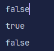
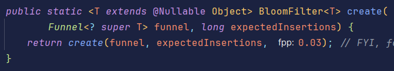
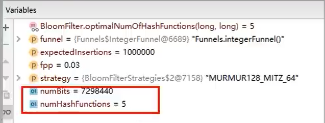
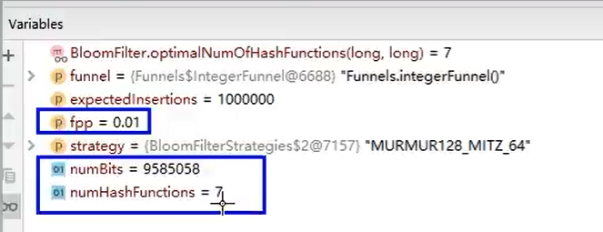

[TOC]


# 导入黑马点评项目

### 导入SQL

首先，导入课前资料提供的SQL文件： [hmdp.sql](lib\hmdp.sql) 

其中的表有：

* tb_user：用户表
* tb_user_info：用户详情表
* tb_shop：商户信息表
* tb_shop_type：商户类型表
* tb_blog：用户日记表（达人探店日记）
* tb_follow：用户关注表
* tb_voucher：优惠券表
* tb_voucher_order：优惠券的订单表


### 当前的模型说明

手机或app端发送请求，请求到我们的nginx服务器，nginx可以实现基于Lua直接绕开Tomcat访问Redis，也可以作为静态资源服务器，轻松抗下上万并发，负载均衡到下游Tomcat服务器，打散流量。

一台四核8G的tomcat，在优化和处理简单业务的加持下，大不了就处理1000左右的并发，经过nginx负载均衡分流后，利用集群支撑起整个项目，同时nginx在部署了前端项目后，更是可以做到动静分离，进一步降低Tomcat服务的压力，这些功能都得靠nginx起作用，所以nginx是整个项目中重要的一环。

在Tomcat支撑起并发流量后，我们如果让Tomcat直接去访问Mysql，根据经验MySQL企业级服务器只要上点并发，一般是16或32核心CPU，32或64G内存，企业级MySQL加上固态硬盘能够支撑的并发，大概就是4000~7000左右，上万的并发瞬间就会让MySQL服务器的CPU和硬盘全部打满，容易崩溃，所以我们在高并发场景下，会选择使用mysql集群，同时为了进一步降低mysql的压力，增加访问的性能，我们也会加入Redis，同时使用Redis集群使得Redis对外提供更好的服务。


### 导入后端项目

后端项目已经放在了笔记中： [hm-dianping.zip](lib\hm-dianping.zip) 

我们将其解压之后，使用IDEA打开即可。

我已经将原本项目中，老的依赖修改成新的了，我们直接打开启动即可。

**修改编码方式**

当我们创建SpringBoot项目时，都需要去指定编码方式为UTF-8，否则执行Application时会报错。

 

这样一来，后端项目的导入就完成了。

我们可以访问：[localhost:8081/shop-type/list](http://localhost:8081/shop-type/list)来测试一下数据运行是否有问题：

 

出现上述的结果，就说明后端导入完成了。


### 导入前端项目

在我们的笔记中，提供了一个压缩包：[nginx-1.18.0.zip](lib\nginx-1.18.0.zip) 

在这个压缩包里面，提供了nginx服务器，并且已经部署了黑马点评的前端项目，我们只需要将其解压之后，然后在nginx所在目录下打开cmd窗口，输入命令：

```shell
start nginx.exe
```

这样一来，我们的项目就启动了。

nginx监听的端口号是8080，那么，我们只需要去访问http://localhost:8080，就可以看到页面：

 

此时，前端项目就是运行成功了。

**注意！nginx这个目录不能放在包含中文的路径下，否则启动不了！**


---

# 一、短信登录

## 基于Session实现登录

#### 使用Session实现登录的流程

1. **发送验证码**

用户在提交手机号后，会去校验手机号是否合法，如果不合法，要求用户重新输入。

如果手机号合法，后台生成对应的验证码，并将验证码先保存到Session中，然后通过短信的方式将验证码发送给用户。

 

2. **短信验证码登录、注册**

用户收到验证码后，将验证码和手机号输入，后台从session中拿到当前的验证码，然后对用户输入的验证码进行校验，如果不一致，则无法通过校验；如果一直，则后台根据手机号查询用户，如果用户不存在，则为用户创建账号信息，保存到数据库。

无论用户是否存在，都会将用户的信息保存到session中，方便后续获得当前登录信息。

 


3. **校验登录信息**

用户每次去访问信息，都需要去校验登录的信息，用户的信息都保存在session中。而session的sessionId会保存在cookie中。

当用户访问时，一定会携带上自己的cookie，cookie中就会包含sessionId，我们就可以根据cookie中的sessionId，去获取对应的session，从而就可以获取用户信息。

我们只需要判断是否有用户存在，如果没有，说明之前该用户没有登录过，则拦截该请求；如果有，说明用户曾经登录过，则放行请求，在放行之前，先将用户缓存起来放到本地的ThreadLocal中，方便后续直接从ThreadLocal中获取用户信息。

ThreadLocal是一个线程域对象，每个请求到达后台，都是一个单独的线程，如果我们将数据保存在本地变量中，则多个线程去修改可能会出现线程安全的问题，而ThreadLocal则会将数据存放到每个线程内部，在线程内部创建一个Map进行存储，线程之间不会彼此干扰，就没有线程安全问题了。

 


**Cookie和Session是如何实现验证登录功能的？**

客户输入账号和密码进行登录，服务器端进行验证，验证成功则生成SessionId，并且在Session对象中存储当前用户信息。服务器端将SessionId写入客户端Cookie中，当客户端下次访问服务器端时Cookie会被自动发送给服务器端，服务器端在Cookie中拿到SessionId然后在服务器端的Session对象中查找SessionId进行验证，验证成功说明用户是登录状态，则可以为其响应只有在登录状态才能响应的数据。

具体内容请查看笔记： [Cookie与Session.md](..\2、JavaWeb\Cookie与Session.md) 


**为什么要使用ThreadLocal？**

因为ThreadLocal是**`线程隔离`**的。一个线程只能访问当前线程中ThreadLocal中的数据，而不能访问其他线程的ThreadLocal中所保存的数据。

在项目运行时，每次客户端向服务器发送的一个请求，都可以看作是一个线程，那么，多次访问就是多个线程，如果多次请求中都去访问了同一个数据，就会存在线程的安全问题。

所以，我们就想解决线程的安全问题。

那么，我们就可以使用ThreadLocal实现。

ThreadLocal是线程隔离的，意味着线程只能去访问当前线程内的ThreadLocal中存储的数据。那么，我们就可以把用户信息从Session中取出，保存在ThreadLocal中，这样既方便我们在后续操作中获取用户的登录信息，同时也能够将用户与当前线程（请求）绑定，防止被其他的请求访问而造成线程的安全问题。


#### 1、发送短信验证码功能

`注意！以下的代码是非常简短的代码，功能是不全的，重要的是理解功能的流程！`

**业务流程**

用户要进入`我的`页面时：

 

我的页面里面保存都是用户的信息，所以用户肯定是需要登录的。

 

在我的页面里面输入手机号，点击发送验证码时，一个请求就会发送到服务端，服务端就会处理这个请求了。

发送验证码的请求：

 

请求方式是POST，请求路径是/user/code，请求参数是phone。


**代码编写**

我们来看看之前写的发送验证码流程：

 

服务端接收到手机号之后，先去校验手机号是否符合格式，如果不符合就直接响应提示。符合，就去生成验证码，将验证码保存在Session中，然后将验证码发给用户的手机。

这就是发送短信验证码的流程。

那么，我们使用代码来实现一下：

```java
@Service
@Slf4j
public class UserServiceImpl extends ServiceImpl<UserMapper, User> implements IUserService {

   	//发送验证码功能
    @Override
    public Result sendCode(String phone, HttpSession session) {
        //1、校验手机号，isPhoneInvalid()方法是去校验是否是无效的手机号
        if (RegexUtils.isPhoneInvalid(phone)) {
            //2、如果不符合，返回错误信息
            return Result.fail("手机号格式错误！");
        }

        //3、符合，生成验证码
        String code = RandomUtil.randomNumbers(6);

        //4、保存验证码到Session
        session.setAttribute("code", code);

        //5、发送验证码
        //这里发送验证码的功能就不实现了，比较麻烦，而且不是学习的重点
        log.debug("发送验证码成功，验证码：{}", code);

        //6、结束，返回成功的信息
        return Result.ok();
    }
}
```

这是service层发送验证码的逻辑。

对其中代码的解释：

* `RegexUtils`是项目中已经创建好的工具类，该工具类是使用正则表达式来校验字符串是否符合格式的工具类。其中的`isPhoneInvalid()`方法，是校验字符串是否不符合手机号格式，如果返回值为true，表示不符合手机号格式。
* `RandomUtil`类，是我们所引入的hutool包中带的工具类，该类可以用于生成随机值，其中的`randomNumbers()`可以生成指定数量的随机数。hutool包是一个强大的工具类包，在其中给我们提供了很多的工具类。

* `Result`类，是项目中创建好的，用于响应给前端的结果类。其中，有四个属性：

   

  success：表示是否成功。

  errorMsg：表示错误信息。

  data：表示返回的具体信息。

  total：data若是不止一个（集合类型），则total表示其数量。


此时，去重启后端项目，然后再去输入手机号发送验证码，此时请求信息为：

 

可以看到，此时该请求的响应就是success:true，表示发送验证码成功了。

我们来看看后台程序的打印信息：

 

那么，至此发送验证码短信的功能就完成了。


#### 2、短信验证码登录功能

`注意！以下的代码是非常简短的代码，功能是不全的，重要的是理解功能的流程！`

**业务流程**

 

那么此时，就会发送一个请求给服务端：


请求地址是/user/login

请求方法是POST

请求参数是手机号以及验证码：

 

参数是JSON风格的字符串。


**代码实现**

 

1、验证手机号是否符合格式（永远不要相信前端给我们的数据）

2、验证码是否正确：如果与Session中保存的验证码不一致，就报一个异常信息给前端。

3、根据手机号去数据库中查询是否有对应的用户信息：

* 如果有，则将用户保存到Session中；
* 如果没有，就去创建一个新的用户，然后将用户保存到Session中。

结束。

使用代码实现：

```java
@Service
@Slf4j
public class UserServiceImpl extends ServiceImpl<UserMapper, User> implements IUserService {

    @Override
    public Result login(LoginFormDTO loginForm, HttpSession session) {
        // 1.校验手机号
        String phone = loginForm.getPhone();
        if (RegexUtils.isPhoneInvalid(phone)) {
            // 2.如果不符合，返回错误信息
            return Result.fail("手机号格式错误！");
        }

        //3、验证用户输入的验证是否正确
        String loginCode = loginForm.getCode();
        if (loginCode.isBlank()){
            return Result.fail("请输入验证码！");
        }
        Object sessionCode = session.getAttribute("code");
        if (sessionCode == null || !sessionCode.toString().equals(loginCode)){
            //4、如果不正确，就报异常信息
            return Result.fail("验证码有误！");
        }
        //5、根据手机号查询是否有对应的用户信息，手机号是唯一的
        LambdaQueryWrapper<User> lambdaQueryWrapper = new LambdaQueryWrapper<>();
        lambdaQueryWrapper.eq(User::getPhone, phone);
        User user = getOne(lambdaQueryWrapper);

        //6、如果用户不存在，则去创建用户
        if (user == null){
             user = createUserWithPhone(phone);
        }

        //7、将用户信息保存在Session中（实际开发中保存的格式肯定不是这样的，会更加复杂）
        session.setAttribute("user", user);

        return Result.ok();
    }
    
    
    //创建用户的方法
	private User createUserWithPhone(String phone) {
        User user = new User();
        //手机号
        user.setPhone(phone);
        //昵称，随机生成
        user.setNickName("user_" + RandomUtil.randomString(10));
        //保存用户
        save(user);
        return user;
    }
}
```

完成上述功能后，我们进行登录，登录完成后会进入到首页页面：

 

此时，我们再去点击我的页面：

 

发现我们还是进入的登录页面。

为什么会这样呢？

因为我们还没有完成登录校验的功能，只有在请求之前，校验我们已经完成了登录，那么此时才不会进入到登录页面。


#### 3、登录校验功能

我们已经完成了发送短信验证码，以及登录的功能。

但是，在进入我的页面时，依然进入的是登录页面，服务器依然认为我们没有登录，原因就在于登录校验的功能没有完成。

**说明**

登录验证，会在每一次去处理需要登录的请求之前，都会进行。

用户的请求会携带Cookie，而Cookie中保存着服务器的SessionId：

 

我们可以看到，请求头中包含了Cookie，在Cookie中，有JSESSIONID数据，这就是Session的ID，通过它可以获取服务器端的Session数据

我们可以获取浏览器中的Cookie，根据Cookie中的SessionId，获取我们在服务器端保存的Session，查看Session中是否保存用户信息，如果保存了，说明用户曾经登录过，也就通过了登录校验，可以对请求进行处理。

如果没保存，则需要用户登录。


**这样会有一个问题：**

在整个项目中，会有很多controller，就比如UserController，我们在UserController中，编写了去获取SessionID的代码，获取Cookie中的SessionId，然后根据SessionId获取user，完成业务逻辑。

但是不仅仅是一个controller中需要去校验用户的登录，在整个项目的开发中，会有越来越多的功能都需要验证用户是否登录，难道在每个controller中都编写登录验证的逻辑吗？那么有没有一个好的办法，能够让我们在指定的请求前都进行登录校验的工作呢？

有，那就是SpringMVC中所学习的**`拦截器`**。

有了拦截器之后，用户的请求就不会直接发送给controller了，而是先被我们的拦截器接收，在拦截器中去判断请求是被拦截还是放行，之后才会去执行handler方法。

那么，我们可以去`定义一个拦截器，在拦截器中对用户进行登录校验，只有满足了校验的要求后，才会被放行，从而去执行相关的业务`。


**还有一个问题：**

在拦截器校验完成后，我们是需要在业务中使用用户的信息，所以我们还需要在拦截器中，将用户的信息传递到handler方法中，并且需要注意线程的安全问题，此时就可以使用到**`ThreadLocal`**。

**服务器会为同一个会话中的所有请求，都会共享同一个Session。而每个请求，都是一个线程，所以，在同一个会话中对Session进行的操作，可能会出现线程安全问题。**此时，我们可以将数据保存到ThreadLocal中，ThreadLocal是线程隔离的，线程只能访问到该线程内部的ThreadLocal，ThreadLocal不是共享的。所以，我们为了防止出现线程安全问题，可以将数据保存在ThreadLocal中，这样其他线程就无法访问到。

这样一来，同一个用户访问不同的请求，或者不同用户访问同一个请求，都会有自己独立的ThreadLocal，ThreadLocal会将数据保存在内存中。ThreadLocal中保存的用户信息互相不干扰，不会有线程安全问题。当要使用到用户信息时，直接从ThreadLocal中取，而不是去Session中取。

**校验登录的流程**

 


**代码实现**

1. **创建拦截器包**

创建一个包，叫做com.hmdp.interceptor，在该包下，去定义拦截器类：

 

2. **创建拦截器类**

创建一个拦截器类，就叫做LoginInterceptor，使用该类去实现HandlerInterceptor接口，并且实现其中的preHandle()与afterCompletion()方法：

```java
@Component
public class LoginInterceptor implements HandlerInterceptor {
    @Override
    public boolean preHandle(HttpServletRequest request, HttpServletResponse response, Object handler) throws Exception {
        return HandlerInterceptor.super.preHandle(request, response, handler);
    }

    @Override
    public void afterCompletion(HttpServletRequest request, HttpServletResponse response, Object handler, Exception ex) throws Exception {
        HandlerInterceptor.super.afterCompletion(request, response, handler, ex);
    }
}
```

在preHandle()方法中，我们需要去验证登录信息，然后将用户的信息放入到ThreadLocal中。

在afterCompletion()方法中，我们需要去销毁ThreadLocal中的用户信息，避免内存泄漏。

那么，具体实现：

```java
@Component
public class LoginInterceptor implements HandlerInterceptor {
    @Override
    public boolean preHandle(HttpServletRequest request, HttpServletResponse response, Object handler) throws Exception {
        //1、获取Session
        HttpSession session = request.getSession();

        //2、获取Session中的用户
        Object user = session.getAttribute("user");

        //3、判断用户是否存在
        if (user == null){
            //4、不存在，拦截
            response.setStatus(401);
            return false;
        }

        //5、存在，保存用户信息到ThreadLocal
        UserHolder.saveUser((User) user);

        //6、放行
        return true;
    }

    
    @Override
    public void afterCompletion(HttpServletRequest request, HttpServletResponse response, Object handler, Exception ex) throws Exception {
        //移出用户，避免内存泄露
        UserHolder.removeUser();
    }

}
```

其中的UserHolder类，是项目中自定义类，我们来看看这个类的信息：

 

在这个类中，定义了一个`ThreadLocal<User>`类型的对象，我们可以将用户的信息，保存在该对象中。由于ThreadLocal是属于线程的数据，所以，我们可以在同一个线程中，随时获取到ThreadLocal中包含的数据，并且不需要担心其他线程造成影响。


3. **配置拦截器**

在config包下，创建一个Mvc的配置类，就叫做MvcConfig，在该类中配置MVC中的配置信息，其中就包括拦截器。

让该类去实现WebMvcConfigurer接口，重写该接口的addInterceptors()，该方法就是用来配置拦截器的。

```java
@Configuration
public class MvcConfig implements WebMvcConfigurer {

    @Autowired
    private LoginInterceptor loginInterceptor;

    @Override
    public void addInterceptors(InterceptorRegistry registry) {
        //添加拦截器
        registry.addInterceptor(loginInterceptor)
                .excludePathPatterns(
                        "/user/code",
                        "/user/login",
                        "/blog/hot",
                        "/shop/**",
                        "/shop-type/**",
                        "/upload/**",
                        "/voucher/**"
                );
    }
}
```

其中的excludePathPatterns()方法，是去指定哪些路径不被拦截器所拦截。

这样一来，登录验证的功能就完成了。

那么，我们要想在登录后，对某些请求验证是否登录，只需要保证该请求在拦截器的拦截路径下即可。


4. **配置me()方法**

最后，如果我们想要去访问我的页面，那么就需要将获取当前用户信息的接口完善：

```java
/**
 * 获取当前登录的用户
 * @return
 */
@Override
public Result me() {
    return Result.ok(UserHolder.getUser());
}
```

获取用户信息，直接从ThreadLocal中获取即可，因为我们在前置拦截方法中，将用户信息已经保存到了ThreadLocal中了，ThreadLocal是线程中的数据，在同一个线程的任意位置都可以直接修改或者获取ThreadLocal中保存的数据。


那么，此时，我的页面登录功能就算完成了，我们可以去我的页面查看了。 


#### 4、隐藏用户敏感信息

我们来看看，我的页面请求获取到的信息：

  

我们发现，有些信息是比较敏感的，不应该让用户看到。

比如说，id、password密码、还有createTime创建时间以及updateTime修改时间。

去显示用户的信息，其实只需要手机号phone、昵称nickName、以及图片位置icon即可，其他的数据我们是不希望响应给前端的。

那么，我们可以去出创建一个类，叫做`UserDTO`，该类中封装了可以返回给前端的数据：

```java
@Data
public class UserDTO {
    private Long id;
    private String nickName;
    private String icon;
}
```

然后，我们去修改代码，只讲UserDTO返回。

**在登录方法处修改**

```java
//7.保存用户信息到session中
session.setAttribute("user", BeanUtil.copyProperties(user, UserDTO.class));
```

**在拦截器处：**

```java
UserHolder.saveUser((UserDTO) user);
```

**在UserHolder处：将user对象换成UserDTO**

```java
public class UserHolder {
    private static final ThreadLocal<UserDTO> tl = new ThreadLocal<>();

    public static void saveUser(UserDTO user){
        tl.set(user);
    }

    public static UserDTO getUser(){
        return tl.get();
    }

    public static void removeUser(){
        tl.remove();
    }
}
```

修改完成后，我们再看看/user/me接口返回给前端的数据：

 

那么，此时返回给前端的数据，就是需要的数据了，不会有多余敏感的数据信息。


---

## 存在的问题以及解决方案

**Session共享问题**

一台服务器处理并发的能力有限，对于高并发的场景，我们需要使用服务器集群的方式，经过nginx负载均衡分流并发请求后，减少每台服务器处理的请求，从而降低服务器的压力，使得整个项目能够使用在高并发的场景下。

但是，这样就有了一个问题：

每个Tomcat服务器都有一份属于自己的session，假如用户第一次访问第一台Tomcat，并把自己的信息存放在第一台服务器的session中，但是第二次nginx将该用户的请求分流到第二台Tomcat，那么在第二台服务器上，肯定没有第一台服务器存放的session，那么此时的登录验证就会不过关，需要重新登录。此时，使用Session实现的登录验证功能是有问题的。


**解决方案**

**方案一：**session拷贝

虽然每台服务器都有不同的session，但是每当任意一台服务器session修改时，都会同步给其他的Tomcat服务器的session，这样一来，也实现了session的共享。

但是这种方案有两个大问题：

1、每台服务器中都有完整的一份session数据，服务器压力过大。

2、session拷贝数据时，可能会出现延迟。

所以，这种方案没有得到认可，也就没有得到广泛的应用。


我们想要的Session的替代方案应该满足的是：

* 数据共享
* 内存存储
* key、value结构

满足上述三个要求的，不就是Redis吗。


**方案二：使用Redis实现**


---

## 基于Redis实现短信登录（:star:）

### 流程说明

1. **发送验证码功能**

原本是将验证码保存在session中，现在我们将验证码保存到Redis中：

  

那么，将验证码保存在Redis中，value应该采用什么样的格式呢？

验证码就是String类型，所以value应该使用String类型的数据。

那key应该采用什么样的格式？

session有个特点，每个不同的浏览器，都有会自己独立的session，不同浏览器携带手机号来请求时，不同浏览器所访问到的session中的code验证码都是独立的，不会互相干扰。但是，如果把验证码放在Redis中，Redis中的数据是共享的，我们必须要区分不同的手机号，所对应的验证码。那么，验证码可以使用手机号作为key，这样一来，每个不同的手机号，所保存的验证码key都是不同的。

**所以，Redis中验证码格式为：**

| key            | value        |
| -------------- | ------------ |
| `phone:手机号` | `验证码code` |

之前使用Session时，不需要考虑取数据的问题。因为Tomcat会自动帮助我们维护Session。当我们创建一个Session时，Tomcat会自动将创建的SessionId，写到用户浏览器的Cookie中，这样用户访问时会自动带着Cookie，服务器就可以根据Cookie中的SessionId，找到Session，我们可以直接使用。

但是，现在使用的是Redis，在存数据时，我们还需要与其他数据进行区分，将来要取数据时，才能取出我们想要的数据。


2. **短信验证码登录、注册流程**

使用Redis实现短信验证码登录、注册时，进行验证码校验，是去Redis中，使用手机号寻找Redis中已保存的数据，然后使用验证码进行比对。并且在最后，原本是将用户保存到Session中，也要修改成将用户保存到Redis中。

  

那么，保存到Redis中，用户的信息是转换成JSON，使用String类型保存呢；还是使用Hash类型，对用户的每一个属性都进行单独保存？

我们先来看看这两种类型的区别：

 

String结构，以JSON字符串来保存，比较直观；

Hash结构，将对象中每个字段单独存储，可以对单个字段进行修改，并且占用内存更少。

我们这里选择使用JSON字符串来保存（实际还是因为在公司用的比较多的还是JSON）


然后，我们来考虑一下key的格式：

key我们推荐使用**随机`token`**来存储用户数据。（随机token也就是一个随机的字符串）

所以，Redis中存储用户数据格式为：

| key                | value                                  |
| ------------------ | -------------------------------------- |
| `token:随机字符串` | `{"name":"tom", "age":21}（JSON格式）` |


3. **登录校验流程**

使用Session实现登录校验比较简单，因为服务器会自动将SessionId写到浏览器的Cookie中，浏览器访问服务器时，就会将Cookie发送给服务器，就可以获取到Session的信息。而服务器就可以从Session中获取到用户的信息了。

但是使用Redis，那么此时登录凭证就不再是Cookie了。

此时的登录凭证，则是保存在Redis中作为key的**`token`**了。

也就是说，用户发送请求给服务器，就需要带上token了，将其作为登录的凭证。但是服务器并不会自动将token写到浏览器中，那么，**我们只能手动地将token返回给前端**。

那么，也就是说，在使用短信登录、注册的流程中，将用户保存到Redis以后，我们还需要将保存用户的key，也就是token返回给浏览器，浏览器将token信息保存下来，之后每次请求，都要携带这个token发送给服务器。

服务器在接收到token以后，去Redis中获取数据，就可以拿到用户信息了。

 

因为我们是将token保存在浏览器中的，所以token最好使用随机字符串了，而不要使用手机号作为token，这样可能会有泄漏风险。


我们来看看前端是如何去保存token的：

 

在访问/user/login，就是登录的请求后，前端将data是响应的数据，也就是token，保存在sessionStorage中，sessionStorage是浏览器的保存方式。

 

前端定义了一个request的拦截器，在每次发送请求之前，都将sessionStorage中的token数据拿出来，放到请求头的authorization中，发送给服务器，这样服务器就能够得到token的数据，验证是否登录成功了。


### 代码实现

**发送验证码功能**

```java
@Override
public Result sendCode(String phone, HttpSession session) {
    //1、校验手机号，isPhoneInvalid()方法是去校验是否是无效的手机号
    if (RegexUtils.isPhoneInvalid(phone)) {
        //2、如果不符合，返回错误信息
        return Result.fail("手机号格式错误！");
    }

    //3、符合，生成验证码
    String code = RandomUtil.randomNumbers(6);

    //4、保存验证码到Redis，设置验证码过期时间为2分钟
    stringRedisTemplate.opsForValue().set("login:code:" + phone, code, Duration.ofMinutes(2));
    

    //5、发送验证码
    //这里发送验证码的功能就不实现了，比较麻烦，而且不是学习的重点
    log.debug("发送验证码成功，验证码：{}", code);

    //6、结束，返回成功的信息
    return Result.ok();
}
```

**用户登录功能**

```java
@Override
public Result login(LoginFormDTO loginForm, HttpSession session) {
    // 1.校验手机号
    String phone = loginForm.getPhone();
    if (RegexUtils.isPhoneInvalid(phone)) {
        // 2.如果不符合，返回错误信息
        return Result.fail("手机号格式错误！");
    }

    //3、验证用户输入的验证码是否正确
    String loginCode = loginForm.getCode();
    if (loginCode.isBlank()){
        return Result.fail("请输入验证码！");
    }
    //获取Redis中的验证码
    String code = stringRedisTemplate.opsForValue().get("login:code:" + phone);
    
    
    if (code == null || !code.equals(loginCode)){
        //4、如果不正确，就报异常信息
        return Result.fail("验证码有误！");
    }
    
    
    //5、根据手机号查询是否有对应的用户信息，手机号是唯一的
    LambdaQueryWrapper<User> lambdaQueryWrapper = new LambdaQueryWrapper<>();
    lambdaQueryWrapper.eq(User::getPhone, phone);
    User user = getOne(lambdaQueryWrapper);

    
    //6、如果用户不存在，则去创建用户
    if (user == null){
         user = createUserWithPhone(phone);
    }

    
    //7、将用户信息保存在Redis中
    //生成一个随机token，作为登录令牌
    String token = UUID.randomUUID().toString();
    //将对象转换成JSON存在Redis中，使用json存储
    UserDTO userDTO = BeanUtil.copyProperties(user, UserDTO.class);
    ObjectMapper objectMapper = new ObjectMapper();
    String userJson = null;
    try {
        userJson = objectMapper.writeValueAsString(userDTO);
    } catch (JsonProcessingException e) {
        return Result.fail("数据有误！");
    }
    //保存用户数据，并设置有效期为30分钟
    stringRedisTemplate.opsForValue().set("login:token:" + token, userJson, Duration.ofMinutes(30));

    
    //返回token给前端
    return Result.ok(token);
}
```


**拦截器类中的登录校验功能**

```java
@Component
public class LoginInterceptor implements HandlerInterceptor {

    @Autowired
    private StringRedisTemplate stringRedisTemplate;

    @Override
    public boolean preHandle(HttpServletRequest request, HttpServletResponse response, Object handler) throws Exception {

        //1、获取请求头中保存的token数据
        String token = request.getHeader("authorization");

        //2、获取Redis中的用户信息
        String tokenKey = "login:token:" + token;
        String userJson = stringRedisTemplate.opsForValue().get(tokenKey);
        UserDTO user = null;
        if (userJson != null && !userJson.isBlank()){
            //将其转换成User对象
            ObjectMapper objectMapper = new ObjectMapper();
            user = objectMapper.readValue(userJson, UserDTO.class);
        }
        

        //3、判断用户是否存在
        if (user == null){
            //不存在，拦截
            response.setStatus(401);
            return false;
        }

        //4、存在，刷新用户的有效期
        //用户在访问服务器，说明用户是活跃的，那么就让用户有效期的时间重置
        //只有超过30分钟无操作才会将用户信息清除
        stringRedisTemplate.expire(tokenKey, Duration.ofMinutes(30));

        //5、并保存用户信息到ThreadLocal
        UserHolder.saveUser(user);

        //6、放行
        return true;
    }

    
    
    @Override
    public void afterCompletion(HttpServletRequest request, HttpServletResponse response, Object handler, Exception ex) throws Exception {
        //移出用户，避免内存泄露
        UserHolder.removeUser();
    }

}
```


### 解决状态登录刷新问题

**存在的问题**

在上面使用Redis实现登录的功能中，有一个问题存在：

在登录校验的拦截器中，确实可以去拦截需要进行登录校验的请求，在拦截的方法中完成对用户信息的校验，并且刷新token登录令牌的存活时间。但是，这个拦截器只是拦截需要被拦截的路径，假设当前用户访问了一些不需要拦截的路径，那么这个拦截器就不会生效。则此时，令牌的刷新实际上就不会执行。

但是，应该实现的业务是，只要用户发送请求到服务器，服务器就需要去刷新用户的token令牌存活时间。

所以，现在这个方案存在问题。


**优化方案**

我们可以添加一个拦截器，在登录校验的拦截器之前，去拦截所有的路径。

在第一个拦截器中，去获取请求中的token，然后根据token获取用户保存到ThreadLocal，再去刷新token。则第二个拦截器（也就是登录校验拦截器）只需要去判断ThreadLocal中是否有user对象即可，有则放行，无则拦截。

这样，整体的拦截器功能就完成。

 


**创建拦截器RefreshTokenInterceptor，拦截所有请求**

```java
@Component
public class RefreshTokenInterceptor implements HandlerInterceptor {
    
    @Autowired
    private StringRedisTemplate stringRedisTemplate;

    @Override
    public boolean preHandle(HttpServletRequest request, HttpServletResponse response, Object handler) throws Exception {

        //获取请求头中保存的token数据
        String token = request.getHeader("authorization");

        //token不存在，直接放行
        if (StrUtil.isBlank(token)){
            return true;
        }

        //获取Redis中的用户信息
        String tokenKey = "login:token:" + token;
        String userJson = stringRedisTemplate.opsForValue().get(tokenKey);
        if (userJson == null || userJson.isBlank()){
            return true;
        }

        //将其转换成User对象
        ObjectMapper objectMapper = new ObjectMapper();
        UserDTO user = objectMapper.readValue(userJson, UserDTO.class);

        //判断用户是否存在
        if (user == null){
            return true;
        }

        //存在，则刷新用户的有效期
        stringRedisTemplate.expire(tokenKey, Duration.ofMinutes(30));

        //保存用户信息到ThreadLocal
        UserHolder.saveUser(user);

        //放行
        return true;
    }

    @Override
    public void afterCompletion(HttpServletRequest request, HttpServletResponse response, Object handler, Exception ex) throws Exception {
        //释放资源
        UserHolder.removeUser();
    }
}
```


**对登录校验LoginInterceptor拦截器的修改**

```java
@Component
public class LoginInterceptor implements HandlerInterceptor {

    @Autowired
    private StringRedisTemplate stringRedisTemplate;

    @Override
    public boolean preHandle(HttpServletRequest request, HttpServletResponse response, Object handler) throws Exception {

        //判断用户是否存在
        if (UserHolder.getUser() == null){
            //不存在，拦截
            response.setStatus(401);
            return false;
        }

        //放行
        return true;
    }
}
```


**拦截器配置的修改**

```java
@Configuration
public class MvcConfig implements WebMvcConfigurer {

    @Autowired
    private LoginInterceptor loginInterceptor;

    @Autowired
    private RefreshTokenInterceptor refreshTokenInterceptor;

    @Override
    public void addInterceptors(InterceptorRegistry registry) {
        //添加拦截器
        //多个拦截器按照order属性顺序执行，值越小越先执行，默认都是0，则按照添加顺序执行
        registry.addInterceptor(refreshTokenInterceptor).order(0);//拦截所有请求

        registry.addInterceptor(loginInterceptor)
                .excludePathPatterns(
                        "/user/code",
                        "/user/login",
                        "/blog/hot",
                        "/shop/**",
                        "/shop-type/**",
                        "/upload/**",
                        "/voucher/**"
                ).order(1);
    }
}
```

那么，此时无论是访问需要登录验证的页面，还是访问不需要登录验证的页面，都会去触发刷新Redis中token登录令牌的存活时间。


---

# 二、缓存

## 1、什么是缓存？

**什么是缓存？**

缓存（Cache），就是数据交换的缓冲区，俗称的缓存就是缓冲区内的数据，一般从数据库中获取，存储于本地代码。

例如：

```java
例1:Static final ConcurrentHashMap<K,V> map = new ConcurrentHashMap<>(); 本地用于高并发

例2:static final Cache<K,V> USER_CACHE = CacheBuilder.newBuilder().build(); 用于redis等缓存

例3:Static final Map<K,V> map =  new HashMap(); 本地缓存
```

由于其被static修饰，所以随着类的加载而被加载到内存中，作为本地缓存。由于其又被final修饰，所以不用担心赋值导致缓存失效。


**为什么使用缓存？**

速度快，好用。

缓存数据存储于代码中，而代码运行在内存中，内存的读写性能远高于磁盘，缓存可以大大降低用户访问并发量带来的服务器读写压力。

实际开发过程中，企业的数据量少则几十万，多则几千万，这么大的数据量，如果没有缓存作为避震器，系统是几乎撑不住的，所以企业会大量运用到缓存技术。

但是缓存也会增加代码复杂度和运营成本：
 


**如何使用缓存？**

实际开发中，会构筑多级缓存来使系统运行速度进一步提升，比如：本地缓存与redis中的缓冲并发使用

**浏览器缓存**：主要是存在于浏览器端的缓存

**应用层缓存**：可以分为Tomcat本地缓存，比如使用map集合存储数据，还有mybatis缓存，或者是使用redis作为缓存

**数据库缓存**：在数据库中有一片空间是buffer pool数据库缓冲池，增改差数据会先加载到mysql的缓冲池中

**CPU缓存**：当代计算机最大的问题是CPU性能提升了，但内存读写速度没有跟上，所以为了适应当下的情况，增加了cpu的L1，L2，L3级的缓存


## 2、添加商户查询缓存

**缓存模型**

原本，客户端要去访问数据，会发送一个请求到数据库，在数据库中查询数据，然后将查询到的数据返回给客户端：

 

在添加了缓存之后，在客户端与数据库之间添加了一个中间层Redis，客户端的请求会先到达Redis，查询要想的数据。如果Redis中保存了要查询的数据，表示命中了，则直接将数据返回的客户端；如果在Redis中没有保存要查询的数据，则再去数据库中查询，然后将查询到的数据返回给客户端。

 

去数据库中查询到的数据，应该要保存到Redis中，这样当我们下一次去查询数据时，就可以直接在Redis中获取，不需要从数据库中去获取。

 


**商户查询使用缓存思路**

根据商户的id查询商户的详细信息，原本我们是直接去数据库中查询。

在使用Redis缓冲后，我们先去Redis中查询，如果Redis中保存了商户的信息，则我们直接返回；

如果Redis中没有对应的商户信息，此时再去mysql数据库中查询，将查询的数据保存到Redis中，方便下次查询，然后再返回。

 


**代码实现**

```java
@Autowired
private StringRedisTemplate stringRedisTemplate;

/**
 * 根据id查询商户信息，使用缓存
 * @param id
 * @return
 */
@Override
public Result queryById(Long id) {
    //获取Redis中的数据
    String shopKey = "cache:shop:" + id;
    String shopJsonStr = stringRedisTemplate.opsForValue().get(shopKey);

    //如果数据存在，则直接返回
    if (StrUtil.isNotBlank(shopJsonStr)){
        return Result.ok(JSONUtil.toBean(shopJsonStr, Shop.class));
    }

    //如果不存在，则去数据库中查询
    Shop shop = getById(id);
    if (shop == null){
        return Result.fail("店铺不存在！");
    }

    //存在则将数据保存到Redis中
    stringRedisTemplate.opsForValue().set(shopKey, JSONUtil.toJsonStr(shop));
    return Result.ok(shop);
}
```

这里Redis中对象value使用的是String类型，也就是使用JSON字符串保存对象数据。

此时，第一次去查询商户需要走数据库，第二次查询相同的商户，就不会再去数据库查询，直接查询Redis缓存获取。


## 3、缓存更新策略

### 三种缓存更新策略说明

我们把数据保存在缓存中，当用户更新了mysql数据库中的数据时，缓存中的数据并不会一起更新，那么此时，用户去查询到的数据就是缓存中的旧数据。这种情况在大多数业务场景下都是是不被允许的，那么，我们就需要去更新缓存中的数据。

在企业中，常见的缓存更新策略有三种：

1. **内存淘汰**：这种机制，原本是Redis用来解决内存不足的问题，Redis是基于内存来存储的，内存不像磁盘，它是有限的。当内存不足时，会触发这种策略，Redis会去自动淘汰部分数据，然后在下次查询时再去更新缓存。这种机制，让数据库与缓存之间保持一致性的能力较差。这种机制是Redis自带的机制，所以不需要我们进行维护，维护成本低。
2. **超时剔除**：给缓存数据添加TTL（超时）时间，到期后自动删除缓存。下次查询时更新缓存。如果设置TTL时间较短，比如30分钟，缓存更新的频率就会高一点，这样一来，数据一致性就会高一点；如果设置TTL的时间较长，比如1天，那么更新频率较低，数据一致性也会较差。这种策略所需的维护成本较低。
3. **主动更新**：主动更新，就是我们自己去编写业务逻辑，在修改数据库的同时，更新缓存。这样数据的一致性会比较好的，但是这种策略的维护成本会比较高。

那么，我们选择哪一种机制来实现缓存更新呢？

* **低一致性需求：**`使用内存淘汰机制`，例如店铺类型的查询缓存。
* **高一致性需求**：`主动更新，并以超时剔除作为兜底方案`。例如店铺详情查询的缓存。


### 主动更新策略

主动更新策略有三种类型：

* `Cache Aside Pattern`：人工编码方式，缓存调用者在更新完数据库后再去更新缓存，也称之为双写方案。
* `Read/Write Through Pattern`：由系统本身完成，数据库与缓存的问题交由系统本身去处理。
* `Write Behind Caching Pattern`：调用者只操作缓存，其他线程去异步处理数据库，实现最终一致。


后面两种方案，实现起来比较麻烦，并且也没有比较好的第三方组件，企业中一般使用的都是第一种方案：人工编码的方式去主动更新缓存。

使用人工编码方式主动更新缓存有三个问题需要考虑：

* **删除缓存还是更新缓存？**

  * 更新缓存：每次更新数据库都更新缓存，无效写操作较多
  * 删除缓存：更新数据库时让缓存失效，查询时再更新缓存

  如果数据库写操作比较多，比如更新了上百次，但是却不去查询，那么我们每次在更新数据库时都去更新缓存，更新缓存操作都是无效的。

  但是，如果在更新数据库时删除缓存，这样每次更新都不需要再去同步缓存，只在查询时让缓存生效，在大量写操作时就不会产生多次更新缓存的无效操作。

  所以，我们选择在更新sql数据库时，**`删除缓存`**。

* **如何保证缓存与数据库的操作的同时成功或失败？**

  我们需要保证删除缓存与更新数据库这两个操作同时成功，同时失败，即要保证这里两个操作合起来作为一个原子操作。

  * 单体系统，更新数据库与删除缓存在同一个项目中，甚至在同一个方法里，我们可以使用事务本身的特性就能够保证同时成功与同时失败；

  * 分布式系统，更新数据库的操作以及删除缓存的操作，有可能是不同的服务，此时就不得不用到TCC这样的分布式事务方案。

* **先操作缓存还是先操作数据库？**

  * 先删除缓存，再操作数据库
  * 先操作数据库，再删除缓存

  我们来看看不同的顺序可能会出现的问题：


如果是先删除缓存，再更新数据库的话：

* 假设有两个线程，一个线程是去修改数据库，一个线程是去查询数据。修改数据库的线程，先去删除缓存，假设其删除了缓存之后，另一个线程去查询数据，那么此时，查询缓存未命中，再去查询数据库，并将数据库中的数据写入到缓存中，查询线程结束。修改数据库的线程开始执行，去更新数据库，则此时，数据库中的数据与缓存中的数据不一致。由于查询缓存、查询数据库以及写缓存的速度是很快的，但是更新数据库的操作比较慢，所以，在删除缓存与将数据更新到数据库之间这段时间，有其他线程去查询缓存、查询数据库并将查询到的数据写入缓存发生的几率是很高的。

如果是先更新数据库，再删除缓存的话：

* 假设有两个线程，一个线程去查询数据v，一个线程去更新数据v。查询数据的线程，先去查询缓存，缓存未命中，此时再去查询数据库，此时查询到的数据v结果为10。在查询线程将数据10结果写入缓存之前，另一个线程去更新数据库，将数据库v的结果修改为20，更新数据库之后，删除了缓存。此时，查询数据库的线程去更新缓存，将v的结果修改为10。那么，此时缓存与数据库的数据不一致。出现这种问题，是在缓存失效，并且在查询数据库与写入缓存之间，恰好有一个线程去修改数据库，由于写入缓存的速度是非常快的，所以这种问题发生的概率很低。

以上是不同顺序可能出现的问题。由于我们先更新数据库，再删除缓存出现问题的概率，比先删除缓存，再更新数据库出现问题的概率低很多，所以，应该**`先操作数据库，再删除缓存`**。


### 小结：更新缓存的最佳实践

> * 对于**高一致性需求**的场景（经常修改），我们要**主动更新缓存**，并同时给缓存设置超时时间，使用**超时剔除**兜底。
>
> * 对于**低一致性需求**的场景（不经常修改），我们可以使用Redis自带的**内存淘汰**方案更新缓存。
>
> 
>
> * **读操作：**
>
>   * **`缓存命中则直接返回`**
>
>   * **`缓存未命中，则查询数据库，并写入缓存，设定超时时间`**
>
> * **写操作：**
>   * **`先写数据库，然后再删除缓存`**
>   * **`要确保数据库与缓存操作的原子性`**


### 代码实现商铺缓存与数据库的一致性

依据更新缓存的最佳实践，现去修改ShopController中的业务逻辑，满足下面的需求：

1. 根据id查询店铺时，如果缓存未命中，则查询数据库，将数据库结果写入缓存，并设置超时时间
2. 根据id修改店铺时，先修改数据库，再删除缓存。

**商铺更新方法**

```java
@Override
@Transactional
public Result updateShopById(Shop shop) {
    Long shopId = shop.getId();
    if (shopId == null){
        Result.fail("商铺id不能为空！");
    }

    //更新数据库
    updateById(shop);

    //删除缓存
    String shopKey = "cache:shop:" + shopId;
    stringRedisTemplate.delete(shopKey);
    return Result.ok();
}
```


**商铺查询方法的修改**

```java
@Override
public Result queryById(Long id) {
    //获取Redis中的数据
    String shopKey = "cache:shop:" + id;
    ValueOperations<String, String> operations = stringRedisTemplate.opsForValue();
    String shopJsonStr = operations.get(shopKey);

    //如果数据存在，则直接返回
    if (StrUtil.isNotBlank(shopJsonStr)){
       //返回数据
        return Result.ok(JSONUtil.toBean(shopJsonStr, Shop.class));
    }

    //如果不存在，则去数据库中查询
    Shop shop = getById(id);
    if (shop == null){
        return Result.fail("店铺不存在！");
    }

    //存在则将数据保存到Redis中，并设置超时时间
    operations.set(shopKey, JSONUtil.toJsonStr(shop), Duration.ofMinutes(30));
    return Result.ok(shop);
}
```


## 4、缓存的四大问题及解决方案（:star:）

在日常开发工作中，缓存技术被广泛利用以增强系统性能和减轻数据库的访问压力。但是，在使用缓存的过程中，我们可能会碰到几个典型问题，比如缓存穿透、缓存击穿和缓存雪崩。

### 涉及到的面试题

1. 缓存预热、雪崩、穿透、击穿分别是什么？你遇到过哪几个情况？
2. 缓存预热你是怎么做的？
3. 如何避免或减少缓存雪崩？
4. 穿透和击穿有什么区别？他俩有什么区别？
5. 穿透和击穿有什么解决方案？如何避免？
6. 假如出现了缓存不一致问题，你有什么解决方案？
7. ...****


### 1）缓存预热

#### 什么是缓存预热？

缓存预热是指在系统启动之前或者系统达到高峰期之前，通过预先将常用数据加载到缓存中，以提高缓存命中率和系统性能的过程。

#### 为什么需要缓存预热？

缓存预热的好处有很多，如：

1. 减少冷启动影响：当系统重启或新启动时，缓存是空的，这被称为冷启动。冷启动可能导致首次请求处理缓慢，因为数据需要从慢速存储中检索。
2. 提高数据访问速度：通过预先加载常用数据到缓存中，可以确保数据快速可用，从而加快数据访问速度。
3. 平滑流量峰值：在流量高峰期之前预热缓存可以帮助系统更好地处理高流量，避免在流浪激增时出现性能下降。
4. 保证数据的时效性：定期预热可以保证缓存中的数据是最新的，特别是对于高度依赖于实时数据的系统。
5. 减少对后端系统的压力，通过缓存预热，可以减少数据库或其他后端服务的直接查询，从而减轻它们的负载。


#### 如何实现缓存预热？

缓存预热的一般做法是在系统启动或系统空闲期间，将常用的数据加载到缓存中，主要做法有以下几种：

1. **系统启动时加载**：在系统启动时，将常用的数据加载到缓存中，以便后续的访问可以直接从缓存中获取；
2. **定时任务加载**：定时执行任务，将常用的数据加载到缓存中，以保持缓存中数据的实时性和准确性。
3. **手动触发加载**：在系统达到高峰期之前，手动触发加载常用的数据到缓存中，以便提高缓存命中率和系统性能。
4. **用时加载**：在用户请求到来时，根据用户的访问模式和业务需求，动态地将数据加载到缓存中。
5. **缓存加载器**：一些缓存框架提供了缓存加载器的机制，可以在缓存中不存在数据时，自动调用加载器加载数据到缓存中。


#### 具体实现方案

##### 启动时预热

**方式一：启动监听事件**

可以使用ApplicationListener监听`ContextRefreshedEvent`或`ApplicationReadyEvent`等应用上下文初始化完成事件，在这些事件触发后执行数据加载到缓存的操作，具体实现如下：

```java
@Component
public class CacheWarmer implements ApplicationListener<ContextRefreshedEvent> {
    @Override
    public void onApplicationEvent(ContextRefreshedEvent event) {
        // 执行缓存预热业务...
        cacheManager.put("key", dataList);
    }
}
```

或监听ApplicationReadyEvent事件，如下代码所示：

```java
@Component
public class CacheWarmer implements ApplicationListener<ApplicationReadyEvent> {
    @Override
    public void onApplicationEvent(ApplicationReadyEvent event) {
        // 执行缓存预热业务...
        cacheManager.put("key", dataList);
    }
}
```


**方式二：使用@PostConstruct注解**

可以使用@PostConstruct注解标注一个方法，该方法将在Bean的构造函数执行完毕后立即被调用。在这个方法中执行缓存预热的逻辑。

```java
@Component
public class CachePreloader {
 
    @PostConstruct
    public void preloadCache() {
        // 执行缓存预热逻辑
        // ...
    }
}
```


**方式三：实现CommandLineRunner或ApplicationRunner接口**

CommandLineRunner和ApplicationRunner都是SpringBoot应用程序启动后要执行的接口，它们都允许我们在应用启动后执行一些自定义的初始化逻辑，例如缓存预热。CommandLineRunner实现示例如下：

```java
@Component
public class MyCommandLineRunner implements CommandLineRunner {
    @Override
    public void run(String... args) throws Exception {
        // 执行缓存预热业务...
        cacheManager.put("key", dataList);
    }
}
```

ApplicationRunner实现示例如下：

```java
@Component
public class MyApplicationRunner implements ApplicationRunner {
    @Override
    public void run(ApplicationArguments args) throws Exception {
        // 执行缓存预热业务...
        cacheManager.put("key", dataList);
    }
}
```

CommandLineRunner和ApplicationRunner区别如下：

1. 方法签名不同：
   1. CommandLineRunner 接口有一个 run(String... args) 方法，它接收命令行参数作为可变长度字符串数组。
   2. ApplicationRunner 接口则提供了一个run(ApplicationArguments args) 方法，它接收一个 ApplicationArguments 对象作为参数，这个对象提供了对传入的所有命令行参数（包括选项和非选项参数）的访问。
2. 参数解析方式不同：
   1. CommandLineRunner 接口更简单直接，适合处理简单的命令行参数。
   2. ApplicationRunner 接口提供了一种更强大的参数解析能力，可以通过 ApplicationArguments 获取详细的参数信息，比如获取选项参数及其值、非选项参数列表以及查询是否存在特定参数等。
3. 使用场景不同：
   1. 当只需要处理一组简单的命令行参数时，可以使用 CommandLineRunner。
   2. 对于需要精细控制和解析命令行参数的复杂场景，推荐使用 ApplicationRunner。


**方式四：实现InitializingBean接口**

实现InitalizingBean接口，并重写afterPropertiesSet()方法，可以在Spring Bean初始化完成后进行缓存预热，具体实现代码如下：

```java
@Component
public class CachePreloader implements InitializingBean {
    @Autowired
    private YourCacheManager cacheManager;
    @Override
    public void afterPropertiesSet() throws Exception {
        // 执行缓存预热业务...
        cacheManager.put("key", dataList);
    }
}
```


##### 定时任务预热

在启动过程中预热有一个问题，那就是一旦启动之后，如果需要预热新的数据，或者需要修改数据，就不支持了，那么，在应用的运行过程中，我们是可以通过定时任务来实现缓存的更新预热的。

我们通常依赖这种方式来确保缓存中的数据是最新的，避免因为业务数据的变化而导致缓存数据过时。

在Spring中，要想实现一个定时任务也比较简单，基于@Scheduled就可以实现：

```java
@Scheduled(cron = "0 0 1 * * ?") // 每天凌晨1点执行
public void scheduledCachePreload() {
    // 执行缓存预热逻辑
    // ...
}
```


##### 缓存器预热

缓存框架提供了缓存加载器的机制，可以在缓存中不存在数据时，自动调用加载器加载数据到缓存中。这样可以简化缓存预热的逻辑。如Caffeine中有这样的功能：

```java
import com.github.benmanes.caffeine.cache.Caffeine;
import com.github.benmanes.caffeine.cache.LoadingCache;
import org.springframework.stereotype.Service;
 
import java.util.concurrent.TimeUnit;
 
@Service
public class MyCacheService {
 
    private final LoadingCache<String, String> cache;
 
    public MyCacheService() {
        this.cache = Caffeine.newBuilder()
                .refreshAfterWrite(1, TimeUnit.MINUTES)  // 配置自动刷新，1分钟刷新一次
                .build(key -> loadDataFromSource(key));  // 使用加载器加载数据
    }
 
    public String getValue(String key) {
        return cache.get(key);
    }
 
    private String loadDataFromSource(String key) {
        // 从数据源加载数据的逻辑
        // 这里只是一个示例，实际应用中可能是从数据库、外部服务等获取数据
        System.out.println("Loading data for key: " + key);
        return "Value for " + key;
    }
}
```

在上面的例子中，我们使用 Caffeine.newBuilder().refreshAfterWrite(1, TimeUnit.MINUTES) 配置了缓存的自动刷新机制，即每个缓存项在写入后的1分钟内，如果有读请求，Caffeine 会自动触发数据的刷新。

loadDataFromSource 方法是用于加载数据的自定义方法。你可以在这个方法中实现从数据源（例如数据库、外部服务）加载数据的逻辑。

### 2）缓存穿透

#### 什么是缓存穿透？

> **`缓存穿透`是指客户端请求的数据在缓存和数据库中都不存在，导致缓存永远不会命中，用户每次请求该数据都要去数据库中查询一遍。**

 

如果有恶意攻击者不断请求系统中不存在的数据，会导致短时间大量请求落在数据上，造成数据库压力过大，甚至导致数据库承受不住而宕机崩溃。


#### 问题分析

缓存穿透现象的核心问题在于请求中使用的key在Redis缓存中无法找到相应的值。在缓存穿透的情况下，传入的key在Redis中不存在，如果有黑客故意发送大量不存在的key的请求，这会导致数据库遭受巨大的查询压力，可能会严重威胁到系统的正常运行。因此，在日常开发实践中，对请求参数进行严格的校验是至关重要的。对于那些非法或明显不可能存在的key，系统应该立即返回一个错误提示，而不是让这些请求到达数据层面，这样不仅可以提升系统的安全性，还能够维护数据库的稳定性和性能。


#### 方案一：缓存空对象

##### 方案说明

当出现Redis查不到数据，数据库也查不到数据的情况，我们就把这个key保存到Redis中，设置value="null"，并设置其一个较短的过期时间，后面再出现查询这个key的请求的时候，直接返回null，就不需要再去查询数据库了。


**优点**：实现简单。

**缺点**：

* 1）**耗费内存并且会有失效的情况**。`在Redis中缓存大量空值不仅会消耗宝贵的内存资源，而且如果攻击者持续使用随机key进行攻击，这种防御策略就会失效`。在这种情况下，不仅数据库可能因过载而崩溃，Redis服务也可能由于内存耗尽而出现拒绝写操作的现象。这样，你的正常需要写入Redis的业务也会跟着收到影响。
* 2）**数据不一致问题**。虽然在缓存空值时我们设定了较短的过期时间，但仍存在一种情况：在缓存的空值尚未过期的这段时间内，数据库中的实际数据可能已经更新，而该键值在数据库中存在了数据。这导致在缓存中的空值仍然被返回，而没有返回真实的数据，从而造成缓存与数据库之间的数据不一致现象。

> 这种方式只能解决每次查询key都相同的情况，如果黑客使用随机的ID进行查询，那么我们存储在Redis中的空对象是失效的，不仅没有办法解决缓存穿透问题，反而还占用了多余的内存。如果随机查询的请求非常多，还会占用大量的内存，得不偿失。


##### 具体实现

查询商品信息原本的过程：

根据id查询商铺信息，去Redis中查询，没有查询到则再去数据库中查询，若依旧没有，则返回404给前端。这样是存在着缓存穿透问题的。

现在的逻辑：

现在去数据库中查询，数据不存在，不会返回404，还是会把这个空值写入到Redis中，并把空值返回；当再次发起查询时，去Redis缓存中查询，如果value是null，则证明是缓存穿透数据，直接返回。


**代码实现**

```java
@Override
public Result queryById(Long id) {
    //获取Redis中的数据
    String shopKey = "cache:shop:" + id;
    ValueOperations<String, String> operations = stringRedisTemplate.opsForValue();
    String shopJsonStr = operations.get(shopKey);

    //如果数据存在，则直接返回
    if (StrUtil.isNotBlank(shopJsonStr)){
       //返回数据
        return Result.ok(JSONUtil.toBean(shopJsonStr, Shop.class));
    }

    //如果数据是否是空字符串
    if (shopJsonStr != null){
        //返回一个错误信息
        return Result.fail("店铺不存在！");
    }

    //如果不存在，则去数据库中查询
    Shop shop = getById(id);
    if (shop == null){
        //如果店铺不存在，将空值保存到Redis中，并返回错误信息
        operations.set(shopKey, "", Duration.ofMinutes(2));
        return Result.fail("店铺不存在！");
    }

    //存在则将数据保存到Redis中，并设置超时时间
    operations.set(shopKey, JSONUtil.toJsonStr(shop), Duration.ofMinutes(30));
    return Result.ok(shop);
}
```

查询数据，如果Redis中有数据，则返回缓存数据，如果缓存的数据是一个空值""，那么报错误信息；如果Redis中没有数据，去Mysql数据库中查询，Mysql中也没有数据时，则保存一个空值到Redis中，当下次又要访问该数据时，会直接从Redis中获取到。

比如，我们访问一下id为0的数据，第一次查询会去数据库中获取：


当我们再去查询时，就不会走数据库，也就没有这个日志信息，而是直接从Redis中获取，返回错误信息给前端。


---

#### 方案二：布隆过滤器

##### 方案说明

为了缓解缓存穿透的问题，我们可以在Redis缓存层之前部署一道布隆过滤器防线。将数据库中的所有键导入布隆过滤器中，布隆过滤器提供一种高效的概率检测机制，用于判断一个元素是否可能在一个集合内。这样，在任何查询到达Redis之前，系统会首先检查该查询的键是否在布隆过滤器中。如果布隆过滤器中不存在查询的键，则直接返回，不去查询缓存以及数据库，以此避免对数据库的不必要访问和潜在查询压力。通过这样的布隆过滤器前置筛选，我们不仅保护了数据库免受不存在的键的查询压力，还确保了整体系统的性能稳定，即使在高并发查询的环境下也能有效地运作。

> **`当布隆过滤器断言数据库中不存在某个键时，这个结论是绝对可靠的；但它认为某个键存在时，只表示存在的可能性很高`**。

由于其内部使用的是哈希思想，使用哈希算法去计算数据库键所对应的值，保存到布隆过滤器中，所以其可能存在着哈希冲突，由于哈希冲突，所以其**存在误判**的可能。


但是，布隆过滤器如果认为数据库没有这个数据，那就一定是没有的，此时就可以直接返回，不去Redis或数据库中查询，所以布隆过滤器也能够过滤掉一些存在问题的请求。

**优点**：**占用内存小。**布隆过滤器不需要存储具体的数据项，只需要存储数据的哈希值，因此相对存储实际数据，它占用的内存更少。

**缺点**：

* 1）**存在一定误判的可能。**布隆过滤器存在一定的误判率，即它可能会错误的认为某个不存在的元素存在，尽管可以通过调整参数来降低误判率，但无法完全消除。

* 2）**数据不一致。**

  为了维护数据的准确性和一致性，理想情况下，当数据库中的数据发生更新时，布隆过滤器也应当进行相应的更新以反映这些变更。然而，布隆过滤器与数据库是两个独立的数据管理实体。所以可能出现的一种情形是，在数据库成功执行了数据更新之后，当尝试更新布隆过滤器时，网络异常发生，导致新增的数据未能及时写入布隆过滤器中。在这种状况下，后续针对这个新加入数据的查询请求将会被布隆过滤器拒绝，因为该数据的键尚未存在于过滤器中。尽管这是一个合理的查询请求，它却被“错误地”拦截了。


##### 使用Guava实现布隆过滤器

在实际开发中，我们一般会使用Geogle提供的`Guava`来实现布隆过滤器。

那么，现在我们就来实现使用Guava来实现一下布隆过滤器白名单的功能，从而解决缓存穿透问题。

使用布隆过滤器来实现一个白名单的功能，也就是只有白名单里面有的数据查询时才让通过，没有直接返回。但是存在误判，由于误判的概率很小，这很小概率的误判查询打到mysql数据库是可以接受的。

此时，该布隆过滤器也就能够解决缓存穿透问题，将数据库中的数据存入到布隆过滤器与Redis中，如果查询的是一个不存在的数据，此时布隆过滤器就不会让其通过，直接返回，也就不会有大量的不存在数据的请求能够达到数据库，就不会对数据库性能造成影响。

那么，现在我们就使用Guava来实现布隆过滤器的方式修改查询用户的方法，在查询之前先去查询布隆过滤器。

> 我们自己手写的布隆过滤器方案，使用的是Redis数据库中的BitMap数据类型来实现，而Guava方式实现的布隆过滤器并没有去连接Redis，没有与Redis发生耦合，直接使用即可。

###### 使用方式

1. **添加依赖**

首先，需要在项目中引入Guava包的依赖：

```xml
<dependency>
    <groupId>com.google.guava</groupId>
    <artifactId>guava</artifactId>
    <version>31.1-jre</version>
</dependency>
```


2. **使用方法**

使用BloomFilter的静态方法`create()`创建`BloomFilter`对象，传入`Funnel`对象：

* 可以使用`Funnels.stringFunnel()`方法创建一个`Funnel<String>`类型的Funnel对象，此时创建的BloomFilter泛型就是String，表示布隆过滤器中存入的是String类型的数据；

* 可以使用`Funnels.integerFunnel()`方法或者`Funnels.longFunnel()`方法，分别创建泛型为Integer或Long类型的BloomFilter，表示布隆过滤器中存入的是Integer或Long类型。

然后传入布隆过滤器中可能传入的元素个数，并设置误判率。**布隆过滤器会根据传入的`预计元素个数`以及`误判率`，计算出布隆过滤器所使用的`二进制数组大小`以及`无偏函数个数`。**

```java
BloomFilter<String> filter = BloomFilter.create(Funnels.stringFunnel(Charset.defaultCharset()), 1000,0.01);
```

使用**`put()`**方法往布隆过滤器中添加元素：

```java
filter.put("test");
```

使用**`mightContain()`**方法判断元素是否存在于布隆过滤器中：

```java
filter.mightContain("test");
```


3. **测试案例**

使用一个案例，来测试一下Guava布隆过滤器：

```java
public class GuavaTest {
    @Test
    public void testGuava(){
        //创建Guava版布隆过滤器
        BloomFilter<Integer> filter = BloomFilter.create(Funnels.integerFunnel(), 1000);

        //判断元素是否存在
        System.out.println(filter.mightContain(1));

        //将元素添加进布隆过滤器
        filter.put(1);
        //判断元素是否存在
        System.out.println(filter.mightContain(1));
        System.out.println(filter.mightContain(2));
    }
}
```

此时执行结果：

 


###### 源码分析

根据上面的案例，我们来分提出一个问题：

在构建布隆过滤器时，我们要去设置布隆过滤器的误差率，那这个误差率是不是越小越好？误差率为0是不是最好的？

我们带着这个问题，来看看Guava的源码，看看Guava是如何实现的。

假设我们创建BloomFilter对象时，没有设置误差率，此时调用的就是两个参数的`create()`：



可以看到：

> **当创建BloomFilter未设置误差率时，默认使用`0.03`的误差率来构建布隆过滤器。**

然后，我们进入到最终调用的`create()`方法中：

```java
@VisibleForTesting
static <T extends @Nullable Object> BloomFilter<T> create(
    Funnel<? super T> funnel, long expectedInsertions, double fpp, Strategy strategy) {
  checkNotNull(funnel);
  checkArgument(
      expectedInsertions >= 0, "Expected insertions (%s) must be >= 0", expectedInsertions);
  checkArgument(fpp > 0.0, "False positive probability (%s) must be > 0.0", fpp);
  checkArgument(fpp < 1.0, "False positive probability (%s) must be < 1.0", fpp);
  checkNotNull(strategy);

  if (expectedInsertions == 0) {
    expectedInsertions = 1;
  }
  /*
   * TODO(user): Put a warning in the javadoc about tiny fpp values, since the resulting size
   * is proportional to -log(p), but there is not much of a point after all, e.g.
   * optimalM(1000, 0.0000000000000001) = 76680 which is less than 10kb. Who cares!
   */
  long numBits = optimalNumOfBits(expectedInsertions, fpp);
  int numHashFunctions = optimalNumOfHashFunctions(expectedInsertions, numBits);
  try {
    return new BloomFilter<T>(new LockFreeBitArray(numBits), numHashFunctions, funnel, strategy);
  } catch (IllegalArgumentException e) {
    throw new IllegalArgumentException("Could not create BloomFilter of " + numBits + " bits", e);
  }
}
```

在该方法中，先是去检查参数的合法性，要求预计元素数量大于0，误差率大于0小于1，然后：

* **调用`optimalNumOfBits()`方法，使用`预计数据量大小n`和`误差率p`来计算布隆过滤器应使用的`bit数组的大小numBits`；**
* **调用optimalNumOfHashFunctions()方法，使用`预计数量大小n`和`bit数组大小numBits`来计算布隆过滤器应使用的`hash函数个数k`。**


当我们在构建布隆过滤器时，预计元素数据量设置为1000000，误差率设置为0.03，此时生成的布隆过滤器底层的bit数组大小为7298440，所使用的hash函数个数为5个：

 

当我们在构建布隆过滤器时，预计元素数据量设置为1000000，误差率设置为0.01时，此时生成的布隆过滤器底层bit数组大小为9585058，所使用的hash函数个数为7个：

 

所以我们可以得知：

> **布隆过滤器设置的`误判率越小`，要求的布隆过滤器精度也就越高，所需的资源也就越多，布隆过滤器需要使用的`bit数组也就越大`，`hash函数也就越多`。**
>
> 因此，布隆过滤器不是误判率越小越好，而是要根据实际的业务来设置，让布隆过滤器误判率设定为可接受的范围内。


#### 总结


在这里，其实并不存在一个完美无缺的方案解决缓存穿透问题。具体选择哪种方案必须依据业务场景来定。那么，我们到底该如何选择呢？

> 考虑并发度的高地，**`并发度低`的我们可以简单的使用`缓存空值`的方案来解决缓存穿透问题，`并发度高`的情况下我们最好使用`布隆过滤器`的方案解决缓存穿透问题**。
>

当然，除了上面提到的布隆过滤器和缓存空数据的方案之外，我们还可以通过:

* **增强id的复杂度，避免被猜测id规律**

* **数据参数格式校验**

* **拉黑恶意攻击者的IP**

* **加强用户权限校验**

* **做好热点参数的限流**

这些方法来增强对缓存穿透问题的防护。


---

### 3）缓存雪崩

#### 什么是缓存雪崩？

> **`缓存雪崩`是指由于缓存系统的整体失效，导致大量请求直接到达后端数据库，进而可能造成数据库崩溃和整个系统的崩溃**。

出现这种情况可能的原因是：

原因1：Redis主机发生了宕机，导致Redis缓存失效；

原因2：Redis中大量的key同一时间失效，导致大量请求都到达数据库。


#### 问题分析

造成缓存雪崩的关键在于同一时间大规模访问的key无法从缓存中获取数据，都要去数据库中请求。出现这一问题主要有两种可能：第一种是Redis宕机，第二种可能是key采用了相同的过期时间。


#### 解决方案

* **设置随机的过期时间**

在设置失效时间的时候加上一个随机值，比如1-5分钟随机。这样就可以避免由于使用相同的过期时间导致某一时刻大量的key过期引发的雪崩问题。


* **redis集群**

保证Redis缓存的高可用，防止Redis因宕机导致雪崩问题。可以使用主从 + 哨兵或者Redis分片集群的方式来避免出现因单个Redis服务器宕机导致整个缓存直接失效。


* **多级缓存**

通过实施多级缓存策略，我们可以优化系统的性能并降低因缓存失效导致的风险。在这种策略中，本地进程内的缓存充当第一级缓存，而Redis作为第二级远程缓存。每一级缓存都设定有独立且差异化的超时时间，这样的设计确保了即使一级缓存的数据或被清除，仍能有耳机或其他级别的缓存来提供数据支持。这种层级化的缓存机制为系统提供了额外的弹性层，当一层缓存遇到问题时，其他层级能够起到“安全网”的作用，从而可以有效的避免雪崩现象。


* **使用熔断机制**

当系统流量达到预定的极限时，为避免对数据库造成过大压力，我们将自动显示“系统繁忙”提示。这样做可以确保至少有一部分用户能够顺畅地使用我们的服务。对于未能即时访问的用户，只要多刷新几次，也是可以获得正常访问的。


* **缓存预热**

缓存预热是一种关键技术，它在系统启动前预先加载关键数据到缓存中，以减少系统上线时对后端数据库的冲击。由于新上线的系统缓存是空的，如果没有预热过程，大量并发请求将直接访问数据库，极有可能在系统上线初期导致服务崩溃。因此，通过在系统上线之前将高频率访问数据从数据库加载到Redis等缓存系统中，可以确保用户请求首先由缓存服务处理，从而减轻数据库的压力。实施缓存预热通常涉及编写批处理任务，这些任务可以在系统启动期间执行，或者通过定时任务定期去执行。定期执行更能保证数据的实时性，但是，同样会耗费系统的部分性能，尤其是在数据量大的时候。所以，具体选择如何进行预热数据，还是需要综合考虑预热数据量的大小以及预热数据更新是否频繁等因素。


* **互斥锁**

通过互斥锁来控制数据写缓存的线程数量，这样就可以避免大量请求同时击中数据库。同样，这样虽然可以避免大量key同时失效导致的缓存雪崩问题，但是，同样性能也会因为加锁的原因受到影响。如果系统对吞吐量要求不高的情况下，这种方式其实还是不错的。因为它既解决了缓存击穿问题，也解决了缓存雪崩的问题。


---

### 4）缓存击穿

#### 什么是缓存击穿？

> **`缓存击穿问题`也叫作热点key问题。当某一个被高并发访问的数据（热点key）在缓存中过期，此时有大量的并发请求需要访问这个数据，由于缓存中的数据已经失效，这些并发请求就会直接转发到数据库上，如果数据库的处理能力不足以应对这种突然增加的压力，就可能导致系统响应缓慢甚至崩溃。**

如果缓存雪崩是大量的key同时过期而导致的问题，那么缓存击穿就是部分key到期而导致的后果。

如下图所示：当某个热点缓存失效时，请求会去数据库查询出来，并重建缓存数据保存到缓存中，在这个期间，假如有很多的请求都来请求该数据，都在缓存中查询不到，那么都会去数据库中查询，就会造成数据库的压力过大，导致运行缓慢甚至崩溃。

 

#### 问题分析

核心问题在于，一旦某个热门的key失效，便会导致密集的并发请求直接涌向数据库。因此，解决方案需从两个方向着手：首先，考虑对热点key不设置过期时间以保持其持久有效；其次，探索降低数据库所承受的请求量的方法，以减轻其压力。


#### 方案一：互斥锁

##### 方案说明

互斥锁，也叫作排它锁。

当缓存失效后，会有大量的请求去访问数据库，并重新创建缓存。

那么我们可以使用互斥锁，控制访问数据库并创建缓存的线程数量，比如某个key只允许一个线程去查询数据库并创建缓存，而其他的请求线程被阻塞，这样，就只有一个请求会到达数据库，而其他的请求会被阻塞直到缓存重新被创建，其他请求则是去查询这个新创建的缓存信息。

 

**优点：**

1. **强一致性。**互斥锁能够确保在缓存重建的过程中，只有一个线程可以访问数据库并更新缓存，这样可以避免多个线程同时读取到过期的缓存数据，从而保证了数据的强一致性。
2. **实现相对简单**。互斥锁的实现相对简单，不需要复杂的逻辑处理，只需在缓存失效时加锁，更新完毕后释放锁即可。


**缺点：**

1. **吞吐量低。**在高并发的场景下，互斥锁可能会导致系统的可用性降低，因为大量的请求可能会因为等待锁而无法及时得到处理。
2. **可能有死锁风险**。比如在一个业务中需要获取多把锁，而在另一个业务中也需要去获取把锁，当前业务需要获取另一个业务的锁，而另一个业务中也需要获取当前业务的锁，那么就会出现死锁问题。


##### 具体实现

**需求**：修改根据id查询商铺的业务，基于互斥锁方式来解决缓存击穿问题。

 

**注意：**这里的锁并不是我们之前所学习的synchronized或者Lock。对于synchronized与Lock来说，我们拿到锁可以执行，未拿到锁就会被阻塞，并且就算将数据已经保存到了缓存中，原本被阻塞的线程中，也只能是其中一个线程去执行，其他线程还是会被阻塞。

所以，我们不能使用synchronized或者Lock来加锁。

我们可以**使用Redis中的命令`SETNX`来实现互斥锁的功能。**

SETNX命令，用于添加原本不存在的key=value，如果添加成功，返回1，如果添加失败，返回0：

 

这个命令可以用来实现互斥锁的功能：

当一个线程在Redis缓存中未查询到数据时，则其先去Redis中使用SETNX命令创建一个数据：

* 如果SETNX结果返回是1，表示之前没有线程创建该数据，也就是当前线程是第一个去创建的，则当前线程可以去查询mysql数据库数据并重构Redis缓存；

* 如SETNX结果返回0，表示之前已经有线程去创建了该数据，说明已经有线程在查询数据库数据并重构Redis缓存了，则当前线程就休眠一下，等下再去查询缓存。

加完锁重构Redis缓存完毕之后，我们就需要去释放锁：**使用`DEL`删除命令通过删除数据的方式去释放锁。**

并且，为了防止因为系统出现异常，导致锁未能够释放，我们需要**给锁添加`超时时长`兜底**，比如10秒钟，就算系统出现了异常锁未释放，在10秒之后，也能够将锁释放，程序能够得到正常运行。

以上就是使用互斥锁的思路，这跟真正的分布式锁还是有些差距的。


**代码实现**

获取锁的方法

```java
private Boolean tryLock(String lockKey){
    ValueOperations<String, String> operations = stringRedisTemplate.opsForValue();
    //setNX命令，在Java中对应的是setIfAbsent()
    //返回的结果是Boolean类型，即如果创建成功，返回的是true；如果创建失败，返回的是false
    return operations.setIfAbsent(lockKey, "1", Duration.ofSeconds(10));
}
```

释放锁的方法

```java
private void unlock(String lockKey){
    //释放锁，也就是去删除使用setNX创建的数据
    stringRedisTemplate.delete(lockKey);
}
```


那么，商铺查询的方法中，添加使用互斥锁方案解决缓存击穿问题的代码：

```java
@Override
public Result queryById(Long id) {
    //获取Redis中的数据
    String shopKey = "cache:shop:" + id;
    ValueOperations<String, String> operations = stringRedisTemplate.opsForValue();
    String shopJsonStr = operations.get(shopKey);

    //如果数据存在，则直接返回
    if (StrUtil.isNotBlank(shopJsonStr)){
       //返回数据
        return Result.ok(JSONUtil.toBean(shopJsonStr, Shop.class));
    }

    //如果数据是空字符串
    if (shopJsonStr != null){
        //返回一个错误信息
        return Result.fail("店铺不存在！");
    }

    //当缓存中没有数据时，使用互斥锁方案实现数据重构
    String lockKey = "lock:shop:" + id;
    Shop shop = null;
    try {
        //去获取锁
        if (!tryLock(lockKey)){
            //如果获取锁失败，则说明已经有线程在重构缓存，当前线程进入休眠，然后再去重新查询Redis数据库
            Thread.sleep(50);
            return queryById(id);
        }

        //获取锁成功，则去重构缓存
        shop = getById(id);
        if (shop == null){
            //如果店铺不存在，将空值保存到Redis中，并返回错误信息
            operations.set(shopKey, "", Duration.ofMinutes(2));
            return Result.fail("店铺不存在！");
        }

        //存在则将数据保存到Redis中，并设置超时时间
        operations.set(shopKey, JSONUtil.toJsonStr(shop), Duration.ofMinutes(30));
    } catch (Exception e) {
        throw new RuntimeException(e);
    }finally {
        //释放锁，将释放锁的操作放在finally中执行
        unlock(lockKey);
    }

    return Result.ok(shop);
}
```


#### 方案二：逻辑过期

##### 方案说明

逻辑过期，相当于永不过期。

在存储缓存数据时，不去设置数据过期时间，而是给value中添加一个逻辑过期的字段，比如叫做expire，在当前时间的基础上增加上逻辑过期时间给字段赋值。由于该数据没有设置过期时间，意味着该数据存储在Redis中，数据永远都存在，永不过期，数据永远都可以查到，不会出现缓存击穿的问题。如：

 


当一个线程去Redis中查询该数据，如果获取到的数据发现已经逻辑过期了，则表示需要去更新该数据，该线程会去获取互斥锁，然后开辟一个新的线程去更新缓存数据，当前线程则直接将已经过期的数据返回。

而其他线程在缓存还未更新时查询数据，发现获取到的缓存中的数据也已过期，去获取互斥锁失败，则直接将过期的数据返回。

当第一个线程开辟的更新缓存的线程，更新数据以及其逻辑过期时间完毕后，会释放锁，其他线程再去查询缓存数据，就可以获取锁并且获取到的数据也没有逻辑过期了，可以直接将新数据返回。

 


**优点：吞吐量高，性能较好。**在逻辑过期方案中，即使数据已过期，系统仍会返回过期数据给客户端，而不是等待锁后再去数据库拉取最新数据。

**缺点：**

1. **牺牲数据的一致性。**由于在数据更新过程中，系统可能会返回过期数据，这在一定程度上牺牲了数据的一致性。
2. **实现复杂。**逻辑过期方案需要维护额外的字段来记录每个缓存项的逻辑过期状态，这增加了系统的复杂性。
3. **耗费更多的内存。**因为增加了一个字段来维护逻辑过期时间，这必定要造成额外的空间占用。


**那么，什么时候使用互斥锁，什么时候使用逻辑过期呢？**

根据上面两种方式的优缺点，可以知道：当**数据要求强一致性**时，使用**互斥锁**方案；当要求**数据吞吐量高**，并且对**数据一致性要求不高**的时候，就使用**逻辑过期**方案。


##### 具体实现

**需求**：修改根据id查询商铺的业务，基于逻辑过期方式来解决缓存击穿问题。

**整体流程**


 

创建一个逻辑过期的类，在该类中声明一个逻辑过期时间属性，并且将要存储到Redis中实际的数据放在该类中。

```java
@Data
public class RedisData<T> {
    private LocalDateTime expireTime;
    private T data;
}
```

对于热点的数据，我们一般需要在后台，提前添加到缓存中。由于我们这里现在没有后台管理系统，所以我们先通过一个单元测试方法，将某个店铺数据添加到缓存中，提前做一个缓存的预热：

```java
public void saveShopToRedis(Long id, Long expireSeconds){
    //查询店铺数据
    Shop shop = getById(id);

    //封装逻辑过期时间
    RedisData<Shop> redisData = new RedisData<>();
    redisData.setData(shop);
    redisData.setExpireTime(LocalDateTime.now().plusSeconds(expireSeconds));
    //写入Redis
    stringRedisTemplate.opsForValue().set("cache:shop:" + id, JSONUtil.toJsonStr(redisData));
}
```

该方法用于保存一些逻辑过期的商铺数据到Redis中，可以指定逻辑过期时间。并且注意，我们在写入Redis时，没有给该用户设定存活时间，而是使用逻辑来控制其真正的过期时间。

此时，我们去执行测试一下，传入id为1，expireSeconds为10，那么执行的结果为：

 

**使用逻辑过期解决缓存击穿问题的主要代码**

```java
//线程池
private final static ExecutorService executorService = Executors.newFixedThreadPool(10);

/**
 * 使用逻辑过期解决缓存击穿问题
 * @param id
 * @return
 */
@Override
public Result queryById(Long id) {
    //获取Redis中的数据
    String shopKey = "cache:shop:" + id;
    ValueOperations<String, String> operations = stringRedisTemplate.opsForValue();
    String shopJsonStr = operations.get(shopKey);

    //如果未命中，则直接返回空
    if (shopJsonStr == null || shopJsonStr.isEmpty()) {
        return Result.ok();
    }

    //如果命中，判断热点数据是否已过期
    RedisData redisData = JSONUtil.toBean(shopJsonStr, RedisData.class);
    
    if (redisData.getExpireTime().isBefore(LocalDateTime.now())){
        //如果已过期，需要缓存重建
        //获取互斥锁
        String lockKey = "lock:shop:" + id;
        if (tryLock(lockKey)){
            //获取互斥锁成功，则去开启一个新线程，用于重建缓存
            executorService.execute(() -> {
                try {
                    //重建缓存，设置过期时间为20s
                    this.saveShopToRedis(id, 20L);
                } catch (Exception e) {
                    throw new RuntimeException(e);
                } finally {
                    //释放锁
                    unlock(lockKey);
                }
            });
        }
        //获取互斥锁失败，直接返回已过期的数据
    }

    return Result.ok(redisData.getData());
}
```


当热点数据过期时，当前线程会先去判断能否获取到互斥锁，如果不能，则直接返回过期的数据；如果可以，则去开启一个新的线程，用于对热点数据进行缓存重建工作，并将过期的数据返回，则当该新线程重建缓存完毕之后，就会释放锁，其他线程查询到的数据就是未逻辑过期的了。

这里采用**线程池**的方式，开启一个新的线程，在线程中对过期的热点数据进行缓存重建工作。给该线程池使用`final static`关键字进行修饰，则表示在程序运行期间，该线程池都会存在，并用于重建缓存。

上述的互斥锁，也是使用`SETNX`命令来实现的，具体可以查看互斥锁的方案内容。


---

## 5、缓存工具封装

基于StringRedisTemplate封装一个缓存工具类，满足下列需求：

* 方法1：将任意Java对象序列化为json存储在string类型的key中，并且可以设置TTL过期时间。
* 方法2：将任意Java对象序列化为JSON并存储在String类型的key中，并且可以设置逻辑过期时间，用于处理缓存击穿问题。
* 方法3：根据指定的key查询缓存，并反序列化为指定类型，利用缓存空值的方式解决缓存穿透问题。
* 方法4：根据指定的key查询缓存，并反序列化为指定类型，需要利用逻辑过期解决缓存击穿问题。

```java
@Component
public class CacheClient {

    private final StringRedisTemplate stringRedisTemplate;

    //线程池
    private static final ExecutorService executorService = Executors.newFixedThreadPool(10);

    public CacheClient(StringRedisTemplate stringRedisTemplate){
        this.stringRedisTemplate = stringRedisTemplate;
    }

    /**
     * 方法1：将任意Java对象序列化为json存储在string类型的key中，并且可以设置TTL过期时间。
     */
    public void set(String key, Object value, Long time, TimeUnit timeUnit){
        stringRedisTemplate.opsForValue().set(key, JSONUtil.toJsonStr(value), time, timeUnit);
    }

    /**
     * 方法2：将任意Java对象序列化为JSON并存储在String类型的key中，并且可以设置逻辑过期时间，用于处理缓存击穿问题。
     */
    public void setWithLogicalExpire(String key, Object value, Long time, TimeUnit timeUnit){
        RedisData redisData = new RedisData();
        redisData.setExpireTime(LocalDateTime.now().plus(time, timeUnit.toChronoUnit()));
        redisData.setData(value);
        //写入redis中
        stringRedisTemplate.opsForValue().set(key, JSONUtil.toJsonStr(redisData));
    }


    /**
     * 方法3：根据指定的key查询缓存，并反序列化为指定类型，利用缓存空值的方式解决缓存穿透问题。
     */
    public <ID, R> R queryWithThrough(String keyPrefix, ID id, Function<ID, R> dbFallback, Class<R> type, Long time, TimeUnit timeUnit){
        String key = keyPrefix + id;
        ValueOperations<String, String> operations = stringRedisTemplate.opsForValue();

        //从Redis中查询信息
        String jsonValue = operations.get(key);
        //判断数据是否存在
        if (StrUtil.isNotBlank(jsonValue)) {
            //若存在直接返回
            return JSONUtil.toBean(jsonValue, type);
        }
        //若查询出来为空字符串，则返回空字符
        if (jsonValue != null){
            return null;
        }

        //如果为空，则去数据库中查询
        //具体该怎么查，由传进来的dbFallback决定，执行其apply()方法
        R r = dbFallback.apply(id);
        //如果数据不存在，保存空字符串到Redis中
        if (r == null){
            operations.set(key, "", time, timeUnit);
        }
        //将数据保存到Redis中，并设置超时时间
        this.set(key, JSONUtil.toJsonStr(r), time, timeUnit);
        return r;
    }


    /**
     * 方法4：根据指定的key查询缓存，并反序列化为指定类型，需要利用逻辑过期解决缓存击穿问题。
     */
    public <R, ID> R queryWithLogicalExpire(String keyPrefix, ID id, Function<ID, R> dbFallback, Class<R> type, Long time, TimeUnit timeUnit){
        String key = keyPrefix + id;
        //查询缓存
        ValueOperations<String, String> operations = stringRedisTemplate.opsForValue();
        String jsonStr = operations.get(key);
        //如果缓存未命中，直接返回空
        if (jsonStr == null || jsonStr.isBlank()){
            return null;
        }
        //如果缓存命中，判断是否过期
        RedisData redisData = JSONUtil.toBean(jsonStr, RedisData.class);
        if (redisData.getExpireTime().isBefore(LocalDateTime.now())){
            //如果过期，则要去重新构建缓存数据
            //获取互斥锁
                String lockKey = "lock:shop:" + id;
                if (tryLock(lockKey)) {
                    //如果获得了互斥锁，则开启一个新的线程去重构数据
                    executorService.execute(() -> {
                        try {
                            //查询数据
                            R r = dbFallback.apply(id);
                            //重新保存数据
                            this.setWithLogicalExpire(key, r, time, timeUnit);
                        } catch (Exception e) {
                            throw new RuntimeException(e);
                        } finally {
                            //释放锁
                            unlock(lockKey);
                        }
                    });
                }
            //如果没有获得互斥锁，直接返回
        }
        //如果未过期，直接返回数据
        return JSONUtil.toBean((JSONObject) redisData.getData(), type);
    }

    /**
     * 方法5：根据指定的key查询缓存，并反序列化为指定类型，可以设置过期时间，并且利用互斥锁来解决缓存击穿问题
     */
    public <ID, R> R queryWithMutex(String keyPrefix, ID id, Function<ID, R> dbFallback, Class<R> type, Long time, TimeUnit timeUnit){
        String key = keyPrefix + id;
        //去查询数据是否存在，如果数据存在直接返回
        ValueOperations<String, String> operations = stringRedisTemplate.opsForValue();
        String jsonStr = operations.get(key);
        if (StrUtil.isNotBlank(jsonStr)){
            //如果数据存在，直接返回
            return JSONUtil.toBean(jsonStr, type);
        }
        //如果数据为Null，返回空值
        if (jsonStr != null){
            return null;
        }
        R r = null;
        String lockKey = null;
        try {
            //如果数据不存在，则去获取互斥锁
            lockKey = "lock:shop:" + id;
            if (!tryLock(lockKey)){
                //如果获取不到互斥锁，说明已经有线程再重构redis缓存了，则休息一下重新获取
                Thread.sleep(50);
                return queryWithThrough(keyPrefix, id, dbFallback, type, time, timeUnit);
            }

            //如果获取了互斥锁，则去重构redis
            r = dbFallback.apply(id);
            //如果不存在数据，将空值放入redis中
            if (r == null) {
                operations.set(key, "", 2, TimeUnit.MINUTES);
                return null;
            }
            //存在写入redis
            this.set(key, r, time, timeUnit);
        } catch (InterruptedException e) {
            throw new RuntimeException(e);
        } finally {
            //释放锁
            unlock(lockKey);
        }


        return r;
    }
    
    

    private boolean tryLock(String key) {
        Boolean flag = stringRedisTemplate.opsForValue().setIfAbsent(key, "1", 10, TimeUnit.SECONDS);
        return BooleanUtil.isTrue(flag);
    }

    private void unlock(String key) {
        stringRedisTemplate.delete(key);
    }
}
```

这里重点介绍一下这里的`Function`参数，Function接口是java.util.function包下的，用于根据一个类型的数据，得到另一个类型的数据。Function<T, R>第一个泛型类型，表示根据哪种类型的参数，第二个泛型类型，表示根据第一个参数得到的类型。

当我们要在方法中，根据不同的数据，执行不同的语句时，就可以传入一个Function接口类型的参数，在方法调用时指定具体该如何操作。

比如上例方法中，当Redis中缓存没有数据时，我们需要去查询数据表中的数据并写入Redis中，那么这个数据表是无法确定的，我们要根据实际业务场景，选择不同的数据表。那么，此时，我们就可以传入Function接口类型参数，让**实际查询数据表的操作，在方法的调用者中声明**，我们只需要在当前方法中，执行Function接口的`apply()`方法执行即可。

调用案例：查询shop表中指定id的数据，并使用互斥锁的方式解决缓存击穿问题

```java
@Override
public Result queryById(Long id) {
    Shop shop = cacheClient.queryWithMutex("cache:shop:", 1L, new Function<Long, Shop>() {
        @Override
        public Shop apply(Long shopId) {
            return getById(shopId);
        }
    }, Shop.class, 20L, TimeUnit.MINUTES);
    return Result.ok(shop);
}
```

传入的Function接口参数，就表示了在queryWithMutex()方法中，该如何去查询，以及查询哪一张表中的数据。在queryWithMutex()方法中，调用了apply()方法，实际上就是执行当前该方法中Function的匿名实现类中的的apply()方法。


---

# 三、秒杀问题（分布式锁）

## 1、全局唯一ID

### 说明

在本项目中，用户购买优惠券时，会生成订单信息保存到tb_voucher_order这张表中，而订单表如果使用数据库默认的自增ID就会存在一些问题：

* id的规律性太明显
* 受单表数据量的限制

场景分析1：如果我们的id具有太明显的规则，用户或者商业对手很容易猜测出来我们的敏感信息，比如商城在一天时间内，卖出了多少单，这明显不合适。

场景分析2：随着我们商城规律越来越大，mysql的单表的容量不宜超过500W，数据量过大后，我们要进行拆库拆表，但拆分表之后，他们从逻辑上实际属于同一张表，所以它们的id不能一样，我们需要保证id的唯一性。


全局ID生成器，是一种在分布式系统下用来生成全局唯一ID的工具，一般要满足下面的特性：


在Redis中，刚好有一个命令，可以实现id的自增功能，那就是**`INCR`自增命令**。

由于使用的是Redis自增命令是实现全局唯一ID，所以不论mysql数据库被拆分成多少表，使用的依旧是同一个Redis中的数据，能够确保拆分的所有表之间的ID也都是唯一的。

使用Redis的INCR命令进行自增，能够实现数据的唯一性以及递增性，由于使用的是Redis命令的方式，所以也满足高可用性与高性能的特性。但是，其不满足安全性，因为如果仅仅使用INCR命令对ID进行自增，还是很容易被用户看出ID的规律的。

所以为了增加ID的安全性，我们不直接使用Redis自增的数值，而是拼接一些其它信息，并且为了提高数据的性能，**ID需要设置成数值类型`bigint`**，也就是Java中的`Long`类型来作为ID的类型插入数据库，因为在数据库中，相比于字符串类型，数值类型占用的空间更小，并且更加适合索引，能够提高索引的查询效率。


**ID的组成：**


Long类型的数据占用的内存大小是8个字节，也就是`64个bit`。在这64位bit中：

* 第`1`位是**符号位**，永远是0，代表id永远是整数。符号位不需要设定，正数符号位就是0。

* 之后`31`位bit，表示的**时间戳**，以秒为单位。31位bit，可以支持大约69年的秒数。我们会定义一个初始的时间，比如2000年1月1日 0时0分0秒，然后会计算当前时间与设定时间的时间差是多少秒，将秒数记录下来。

* 最后`32`位bit，表示的是**序列号**，相当于秒内计数器，使用的是Redis的自增长来实现。由于其一共占用32位bit，也就是一共有2^32种数值。再加上前面的时间戳，也就是说，在同一秒内，可以有2^32不同的序列号值。


Redis并不是生成全局唯一ID的唯一方案。


### 使用Redis实现全局唯一ID

创建一个类RedisIdWorker，用于使用Redis实现全局ID的生成。使用@Component修饰该类，将该类放入到IOC容器中，方便我们调用。

```java
@Component
public class RedisIdWorker {
}
```

然后，就是去创建一个方法`nextId()`，用于获取全局ID。传入`keyPrefix`参数，表示key的前缀，不同的业务，都会有不同的自增长key用于生成全局ID，所以我们需要一个key的前缀用于获取当前业务所对应的自增长key。

```java
@Component
public class RedisIdWorker {
    public Long nextId(String keyPrefix){
        
    }
}
```

之后，我们就是来编写获取全局ID的方法了。

我们来看看全局ID的组成：


第一位符号位我们不需要管，只要ID是正数，符号位就是0.

那么，生成全局ID的过程就是：

1. `生成时间戳`

2. `生成序列号`

3. `拼接时间戳与序列号`

**生成时间戳**

生成时间戳时，首先我们得去设定一个开始的时间，获取当前时间与开始时间之间的时间差（秒数），作为全局ID的第2位-第32位bit的值。

由于时间戳占用31位bit，转换成数值大约可以存储69年的时间，所以，我们设定的开始时间不宜离目前太远，也不宜离当前太近，因为离得太近的话对于某些业务需求可能不能满足，并且不得超过当前时间。所以，我设定了选择2000-01-01 00:00:00作为开始时间：

```java
/**
 * 开始的时间，设置为2000-1-1 00:00:00，以秒为单位
 */
private static final long BEGIN_TIMESTAMP = LocalDateTime.of(2000, 1, 1, 0, 0, 0).toEpochSecond(ZoneOffset.UTC);
```

`toEpochSecond()`表示计算从1970-01-01T00:00:00Z开始到指定日期时间的秒数，也就是2000-01-01 00:00:00的秒数。

那么，全局ID中时间戳的计算就是：

```java
public Long nextId(String keyPrefix){
    //生成时间戳
    long now = LocalDateTime.now().toEpochSecond(ZoneOffset.UTC);
    long timestamp = now - BEGIN_TIMESTAMP;
}
```


**生成序列号**

序列号使用的是Redis的自增长的方式，在Redis中记录了一个key，用于保存自增长的数据。每次要去创建一个新数据时，就使用`INCR`命令，让该key自增长1，并且返回，那么返回得到的数据就可以作为我们的序列号数据。

这里有一个问题：Redis中，对于自增长的key会有一个上限，上限是2^64次方，并且我们获取到的序列号值（也就是自增长值）也有一个上限，上限是2^32次方，如果在实际的生产中，我们都是使用这一个自增长key，那么，随着时间的推移，自增长key的值会越来越大，有可能会超出序列号值的上限以及Redis对自增长key的上限。

所以，我们需要让这个自增长的key有一个限制，不能超过2^32次方。该怎么做？其实很简单，我们可以设置每天使用一个新的自增长key，这样一来，每天的key数值都不会很大，并且由于前面时间戳的限制，肯定不会出现ID相同的情况。

那么，具体实现的代码是：

```java
//生成序列号
//使用Redis的自增长实现，每天使用一个新的key
String date = now.format(DateTimeFormatter.ofPattern("yyyy:MM:dd"));
Long count = stringRedisTemplate.opsForValue().increment("icr:" + keyPrefix + ":" + date);
```

获取到的count，就是序列号的值。

这里的`increment()`方法，就是Redis命令INCR，当Redis中有该数据时，increment()方法会去将该数据自增1，并且返回值；当Redis中没有数据时，则increment()方法会去创建数据，并将数据自增1，并返回值。所以，我们不需要担心Redis中没有对应的序列号key，它会自动帮我们创建。


**拼接并返回**

我们得到时间戳以及序列号，但是如果直接加起来，并返回值的话，是无法实现在全局ID中，2-32位使用时间戳，33-64位使用序列号这种格式的：

 

那如果使用字符串拼接呢？

将时间戳转换成字符串，将序列号也转换成字符串，然后拼接起来再转换回Long类型。这种方式也不行，如果序列号的数值比较小，比如就是1，那么和时间戳拼接起来，序列号也占不了32位bit，时间戳所占用的位数也不对。

所以，不能使用字符串拼接。

那该怎么办？

这里就需要使用到**`位运算`**了。

可以这样思考：我们需要让时间戳数据占用的位置是在第2到第32位，让序列号占用的位置是在第33-64位。那么，我们可以将时间戳转换成二进制类型，让序列号也转换成二进制类型，时间戳与序列号的值是不够大的，致使这两个Long类型的数据，转换成二进制数据后，前面的bit位都是0，所以将数据向左移动时，真正存储数据的bit位并不会移动出去。

那么，我们可以**将时间戳转换成的二进制数据，向左移动32位（空出来的位置会使用0填充），空出32位bit，让这空出的32位bit（全是0），再与序列号的二进制数进行或运算，这样就能够将序列号的二进制数转移到这空出来的32位bit上，这样就实现了时间戳与序列号的拼接。**

所以，拼接操作对应的代码是：

```java
//拼接时间戳与序列号并返回
//让时间戳左移32位并与序列号进行与运算
return timestamp << 32 | count;
```

左移32位，这32位为了不写死，使用一个常量来存储：

```java
/**
 * 序列号的位数
 */
private static final int COUNT_BITS = 32;
```


**那么，最终基于Redis实现全局ID生成器的代码如下所示：**

```java
@Component
public class RedisIdWorker {
    /**
     * 开始的时间，设置为2000-1-1 00:00:00，以秒为单位
     */
    private static final long BEGIN_TIMESTAMP = LocalDateTime.of(2000, 1, 1, 0, 0, 0).toEpochSecond(ZoneOffset.UTC);

    @Autowired
    private StringRedisTemplate stringRedisTemplate;
    
    /**
     * 序列号的位数
     */
    private static final int COUNT_BITS = 32;

    public Long nextId(String keyPrefix){
        //生成时间戳
        LocalDateTime now = LocalDateTime.now();
        long nowSecond = now.toEpochSecond(ZoneOffset.UTC);
        long timestamp = nowSecond - BEGIN_TIMESTAMP;

        //生成序列号
        //使用Redis的自增长实现，每天使用一个新的key
        String date = now.format(DateTimeFormatter.ofPattern("yyyy:MM:dd"));
        Long count = stringRedisTemplate.opsForValue().increment("icr:" + keyPrefix + ":" + date);

        //拼接时间戳与序列号并返回
        //让时间戳左移32位并与序列号进行与运算
        return timestamp << COUNT_BITS | count;
    }
}
```


## 2、实现秒杀下单

### 添加优惠券实现

在本黑马点评的项目中，优惠券就相当于电商的商品。优惠券分为平价券和特价券，平价券可以任意购买，而特价券则需要秒杀抢购：


这里有两张表：tb_voucher和tb_seckill_voucher，其中tb_voucher表存放的是平价券和特价券共有的信息：

 

包括商铺id、优惠券名称、使用规则、支付金额、折扣金额、优惠类型以及优惠券状态等等。

tb_seckill_voucher表存放的是特价券的库存、开始抢购时间以及结束抢购时间，只有特价券才需要填写这些信息：

 


我们在实现秒杀优惠券之前，需要先实现创建优惠券的接口，去添加特价优惠券。

添加普通优惠券接口：

```java
@PostMapping
public Result addVoucher(@RequestBody Voucher voucher) {
    voucherService.save(voucher);
    return Result.ok(voucher.getId());
}
```

添加秒杀优惠券接口：

```java
@PostMapping("/seckill")
public Result addSeckillVoucher(@RequestBody Voucher voucher) {
    voucherService.addSeckillVoucher(voucher);
    return Result.ok(voucher.getId());
}
```

添加秒杀券的实现：

```java
@Override
@Transactional
public void addSeckillVoucher(Voucher voucher) {
    // 保存优惠券
    save(voucher);
    // 保存秒杀优惠券信息
    SeckillVoucher seckillVoucher = new SeckillVoucher();
    seckillVoucher.setVoucherId(voucher.getId());
    seckillVoucher.setStock(voucher.getStock());
    seckillVoucher.setBeginTime(voucher.getBeginTime());
    seckillVoucher.setEndTime(voucher.getEndTime());
    seckillVoucherService.save(seckillVoucher);
}
```

添加普通券时，只需要在tb_voucher优惠券表中添加数据即可；添加秒杀券，则需要在tb_voucher和tb_seckill_voucher表中都添加数据，在tb_seckill_voucher表中添加秒杀券的秒杀信息，包括库存，开始时间和结束时间。

那现在我们来添加一个秒杀券：


此时，就会在对应商家的代金券中，显示我们刚才所创建的特价代金券。

 

那么，接下来，就是去实现限时抢购（秒杀下单）的功能了，我们来看看这个抢购所对应的接口：


请求路径是/voucher-order/seckill/{id}。

请求参数是优惠券的id。

返回值是订单id。


### 下单功能的实现

对于下单一些限定时间限定数量的商品，就是实现秒杀下单业务。比如在本项目中的限定优惠券，需要进行限时的抢购，就是秒杀下单业务：

 

秒杀下单应该考虑的内容有两点：

* 1、秒杀是否开始或结束，如果尚未开始或已经结束则无法下单；
* 2、库存是否充足，不足则无法下单。

下单核心逻辑分析：

当用户开始下单，我们应当去查询优惠券信息，查询到优惠券信息，判断是否满足条件，比如时间是否充足，如果时间充足，则进一步判断库存是否足够，如果两者都满足，则扣除库存，创建订单，然后返回订单id，如果有一个条件不满足则直接结束。

 

让我们看看订单表`tb_voucher_order`的信息：


其中包括用户id、优惠券id、支付方式、订单状态这些重要的信息。

**代码实现**

下单接口：

```java
@PostMapping("seckill/{id}")
public Result seckillVoucher(@PathVariable("id") Long voucherId) {
    return voucherOrderService.seckillVoucher(voucherId);
}
```

service实现：

```java
@Service
public class VoucherOrderServiceImpl extends ServiceImpl<VoucherOrderMapper, VoucherOrder> implements IVoucherOrderService {

    @Autowired
    private ISeckillVoucherService seckillVoucherService;

    @Autowired
    private RedisIdWorker redisIdWorker;
    /**
     * 下单秒杀优惠券方法
     * @param voucherId
     * @return
     */
    @Override
    @Transactional
    public Result seckillVoucher(Long voucherId) {
        //1、查询秒杀优惠券
        SeckillVoucher seckillVoucher = seckillVoucherService.getById(voucherId);
        LocalDateTime now = LocalDateTime.now();
        //查看优惠券是否已经开始
        if (seckillVoucher.getBeginTime().isAfter(now)){
            return Result.fail("秒杀活动尚未开始！");
        }

        //查看是否已经结束
        if (seckillVoucher.getEndTime().isBefore(now)){
            return Result.fail("秒杀活动已经结束！");
        }

        //判断是否有库存
        if (seckillVoucher.getStock() <= 0){
            return Result.fail("库存不足！");
        }

        //扣除库存
        seckillVoucher.setStock(seckillVoucher.getStock() - 1);
        boolean isSuccess = seckillVoucherService.updateById(seckillVoucher);
        //扣除库存失败
        if (!isSuccess){
            return Result.fail("库存不足！");
        }

        //创建订单
        VoucherOrder voucherOrder = new VoucherOrder();
        //使用全局ID的方式创建订单id
        long orderId = redisIdWorker.nextId("order");
        voucherOrder.setId(orderId);
        //userId
        Long userId = UserHolder.getUser().getId();
        voucherOrder.setUserId(userId);
        //代金券id
        voucherOrder.setVoucherId(voucherId);
        save(voucherOrder);

        //把订单id返回
        return Result.ok(orderId);
    }

}
```

那么此时，我们限时抢购按钮，就会去创建一个订单信息，并返回订单的id：

 

此时，就会在tb_voucher_order表中创建一个订单的信息。


### 多线程安全问题：超卖问题

#### 问题分析

使用JMeter来对上面所创建的特价优惠券下单功能进行测试。首先，我们去创建一个特价优惠券信息，库存设置为100：

 

然后，在JMeter中，创建200个线程，执行下单的接口：

 

在正常情况下，实际的订单信息应该只有100个。那我们去执行一下JMeter测试。

注意，这里需要在JMeter中，设置HTTP请求的信息头，因为我们所创建的用户token，是放在请求头的authorization参数中，我们需要先去设置该参数，表示用户已经登录了，才能在创建订单时，获取用户的id：


然后去执行JMeter，执行这200个创建订单的线程。

执行完毕后查看优惠券订单表，发现此时创建了200个订单：

 

在特价优惠券表中，订单的库存还有13个：

 

出现这一问题的原因是什么？

我们来看看秒杀优惠券中，对于优惠券库存的操作：

```java
//判断是否有库存
if (seckillVoucher.getStock() <= 0){
    return Result.fail("库存不足！");
}

//扣除库存
seckillVoucher.setStock(seckillVoucher.getStock() - 1);
boolean isSuccess = seckillVoucherService.updateById(seckillVoucher);
if (!isSuccess){
    return Result.fail("库存不足！");
}
```

假设优惠券还有1个库存，此时线程1过来查询库存，判断出来库存是1，正准备去扣减库存，但是还没有来得及去扣减，此时线程2过来，线程2也去查询库存，发现此时的库存也是1，那么线程2也可以去扣减库存，此时线程1扣减库存，库存变为0，此时线程2原本是不应该去扣减库存了，因为此时的库存已经变为0，但是线程2判断库存的操作是在库存变为0之前的，所以线程2就会再去扣减库存，库存变为-1。

这里是模拟了两个线程的情况，假设在线程查询库存之后，扣除库存之前，有无数个线程进行查询库存判断库存是否大于0，都会大于0，那么，它们都可以去扣除库存，此时就是一个非常严重的线程安全问题，即超卖问题。


超卖问题是典型的线程安全问题，针对这一问题的常见解决方案就是加锁：对于加锁，我们通常有两种加锁方式，分别是**`悲观锁`**和**`乐观锁`**。

悲观锁和乐观锁是从对待锁的态度来划分的类型。从名字上也可以看出这两种锁是两种看到数据并发的思维方式。需要注意的是，乐观锁和悲观锁并不是一种锁，是**锁的设计思想**。

* **悲观锁**：认为线程安全问题一定会发生，因此在操作数据之前先获取锁，确保线程串行执行。例如Java中的`synchronized`、`Lock`等都属于悲观锁，或者mysql数据库中的`互斥锁`也是悲观锁。

  由于多线程之间是串行执行的，所以悲观锁的性能并不是特别好，对于高并发场景并不是很适合。

* **乐观锁**：认为对同一数据的并发操作并不会总发生，属于小概率事件，不给数据加锁，只是在更新的时候判断一下此期间别人有没有去更新这个数据，如果没有修改则认为是安全的，自己才更新数据，如果已经被其他线程修改说明发生了安全问题，此时可以重试或异常。不采用数据库自身的锁机制，而是通过程序来实现。可以采用`版本号机制`或`CAS机制`实现。

在本项目的秒杀优惠券实现中，我们推荐使用乐观锁来解决线程的安全问题。因为悲观锁会使线程串行化执行，高并发场景并不适合使用这种方式；而乐观锁并没有给数据加锁，而是在修改时去判断修改的数据是否与原本获取的不一致，没有使线程串行化执行，执行效率更高。


---

#### 使用乐观锁方式解决

乐观锁的关键是判断之前得到的数据是否被修改过，常见的方式有两种：

（以下这两种方案，思想其实是一样的，区别就在于一个使用了版本号字段，一个没有使用版本号字段）

##### 方案一：版本号

所谓的版本号法，就是给数据加一个版本`version`字段，在多线程并发时，基于版本号来判断是否被修改。这种方式是应用的最广泛的。

每次去修改数据，都会去将数据库中，数据的`version`字段进行修改，我们要判断数据是否被修改过，只需要判断version字段是否被修改过即可。


**案例说明**

有两个线程，线程1和线程2：

 

1、线程1去创建订单，先去查询库存和版本号，假设现在查询出来的库存stock=1，版本号version=1。

2、在线程1去修改库存之前，线程2开始执行了，也去创建一个订单，那么线程2查询出来库存stock=1，版本号version=1。

3、在线程2查询出来库存信息之后，线程1执行修改库存的操作，在修改时，会去判断原本的version是否还是1，还是1的话修改操作就能够执行成功。执行语句类似于：

```java
update tb_seckill_voucher
set stock = stock - 1, version = version + 1
where id = ? and version = #{version};
```

由于在此期间，没有线程去修改库存操作，所以此时的version版本依旧是1，修改操作成功。

4、线程1修改库存操作执行完毕，线程2再去执行减少库存的操作。线程2也会去判断version的版本，由于线程1修改了version的值，此时线程2中获取到的version与数据库中的version不一致，此时线程2执行修改操作就会失败。

以上就是通过版本号来解决线程安全问题的案例。

**版本号法，就是通过数据表中版本号字段值的变化来控制修改操作。**查询时需要将版本号查询出来，修改时需要去修改版本号，只有当查到的版本和更新时的版本一致时，才能更新数据。


**实现**

先去给数据表tb_seckill_voucher中添加一个version字段，在获取秒杀券信息时也会去version字段的数据，然后在修改库存数据时，确保库存>0并且version字段数据与之前获取的数据一致。即：

```java
update tb_seckill_voucher
set stock = stock - 1, version = version + 1
where voucher_id = #{voucherId} and version = #{version};
```


---

##### 方案二：CAS（推荐）

所谓的`CAS`法，就是在版本号方案的基础上进行了简化。

在版本号方案中，我们在修改库存时，需要先去将库存和版本号查询出来，判断库存是否大于0，如果大于0，然后再去修改库存和版本号，判断版本号是否没变，如果没变的话，让库存自增1，让版本号自减1。

但是，我们其实可以在版本号方法的基础上，进行修改的：版本号方案是根据版本号的值是否变化来判断数据是否可以修改，我们要去修改库存和版本号，那为何不能使用库存来代替版本号呢？

如果使用业务中要修改的字段：库存，来代替版本号，判断查询出来的库存值与去修改时的库存值是否一致，如果一致，说明在查询库存与修改库存这一期间，没有人修改库存，则可以去修改，如果不一样，则不能去修改。

即，**`CAS法`，是通过数值本身是否发生变化来判断线程是否安全。**其实就是利用要修改的字段本身来代替version字段，实现版本号的功能。由于使用版本号方案需要添加一个版本号的字段，成本比较高，所以推荐使用CAS方案代替版本号方案。


**案例说明**

两个线程，线程1和线程2：


1、线程1先去查询库存stock，查询出来stock=1，可以去创建订单。

2、在线程1扣除库存之前，线程2开始执行。线程2也去查询库存，查询出来stock=1，也可以去创建订单。

3、线程2在扣除库存之前，线程1开始执行。线程1去扣除库存的同时，判断stock库存是否变化，大致的sql语句是：

```sql
update tb_seckill_voucher
set stock = stock - 1
where stcok = #{stock};
```

由于在此期间，并没有其他线程修改库存，所以库存值依旧是1，所以修改库存操作执行成功。

4、线程1修改库存执行完毕后，线程2开始执行。在修改stock库存的同时，判断stock是否变化，由于此时stock的值是0，与查询时不一致，所以此时线程2修改库存操作失败。


**代码实现**

使用我们要去修改的数据，来代替version字段，这样我们就不需要为数据表添加一个version字段，修改数据表结构的操作造成的成本有可能过高，直接通过判断库存字段在修改前是否已被其他线程修改，若修改了，则可能会有线程的安全问题，则重试或者报异常。推荐使用CAS方式代替版本号的方式。

修改库存代码：

```java
//判断库存是否变化，修改库存
boolean isSuccess = seckillVoucherMapper.updateStockById(seckillVoucher);
if (!isSuccess){
    //如果库存修改失败，有可能是因为库存值发生了变化
    return Result.fail("下单失败，请重试！");
}
```

mapper实现：

```java
<update id="updateStockById">
    update tb_seckill_voucher
    set stock = stock - 1
    where stock = #{voucher.stock}
      and voucher_id = #{voucher.voucherId}
</update>
```

我们在修改时，将stock与原来值相等作为查询的条件，只有当stock没有变化时，才能去修改库存，否则就执行更新失败。


以上这种方式实际上有一个**问题**：

修改库存操作的成功率比较低。当一个线程去查询到库存数据，而没有去修改库存时，其他线程也进来查询到了相同的库存数据，此时第一个线程去修改了库存，那其他线程查询到的库存数据就是失效的，这些线程就会执行失败，返回失败信息。而在高并发的场景下，很多线程并发执行，就特别容易失败。

我们可以对上述的逻辑进行一下**优化**：

让SQL执行修改时，判断的条件将stock = #{stock}修改为`stock > 0`，因为我们只需要保证还有库存，就可以去下单，而不是要保证库存的值与原本查询到库存值一致。

这样优化后，当一个线程在其他线程已经获取到库存stock数据之后，进行修改，只要stock此时>0，即此时还有库存，其他线程也能进行修改，而不会出现其他线程此时执行就因为stock与原本的值不同而报异常信息。

修改代码：

```java
<update id="updateStockById">
    update tb_seckill_voucher
    set stock = stock - 1
    where stock > 0
      and voucher_id = #{voucher.voucherId}
</update>
```

此时，失败场景出现的可能性就比较低了，只有当库存值小于等于0时才会执行失败。


虽然使用乐观锁比使用悲观锁，效率会更高一点，但是其还是要去操作数据库，对于高并发的场景，比如淘宝秒杀商品，性能还是不够的，所以，接下来我们还要去优化功能，让其在高并发场景下效率更高。


---

### 一人一单功能实现

给秒杀业务，添加一个新的需求：一人一单功能，即要求同一个优惠券，一个用户只能下一单。

**业务存在的问题：**

优惠券是为了引流，但目前的情况是，一个人可以无限制的抢这个优惠券，所以我们应该增加一个逻辑，让一个用户只能下一单，而不是让一个用户下多个单，

具体的逻辑如下：首先对优惠券进行判断，比如时间是否充足，如果时间充足，则进一步判断库存是否足够，然后再根据优惠券id和用户id查询是否已经下过这个订单，如果下过这个订单，则不再下单，否则进行下单。


**代码实现**

```java
@Service
public class VoucherOrderServiceImpl extends ServiceImpl<VoucherOrderMapper, VoucherOrder> implements IVoucherOrderService {

    @Autowired
    private ISeckillVoucherService seckillVoucherService;

    @Autowired
    private SeckillVoucherMapper seckillVoucherMapper;

    @Autowired
    private RedisIdWorker redisIdWorker;
    
    @Override
    @Transactional
    public Result seckillVoucher(Long voucherId) {
        //1、查询秒杀优惠券
        SeckillVoucher seckillVoucher = seckillVoucherService.getById(voucherId);
        LocalDateTime now = LocalDateTime.now();
        //查看优惠券是否已经开始
        if (seckillVoucher.getBeginTime().isAfter(now)){
            return Result.fail("秒杀活动尚未开始！");
        }

        //查看是否已经结束
        if (seckillVoucher.getEndTime().isBefore(now)){
            return Result.fail("秒杀活动已经结束！");
        }

        //判断是否有库存
        if (seckillVoucher.getStock() <= 0){
            return Result.fail("库存不足！");
        }
        
        //userId
        Long userId = UserHolder.getUser().getId();

        //查询该用户是否已经下过订单了，如果已经下过，则不能再下
        LambdaQueryWrapper<VoucherOrder> lambdaQueryWrapper = new LambdaQueryWrapper<>();
        lambdaQueryWrapper.eq(VoucherOrder::getUserId, userId);
        lambdaQueryWrapper.eq(VoucherOrder::getVoucherId, voucherId);
        long count = count(lambdaQueryWrapper);
        if (count > 0){
            return Result.fail("已经下单，请勿重复购买！");
        }
        

        //判断库存是否变化，修改库存
        boolean isSuccess = seckillVoucherMapper.updateStockById(seckillVoucher);
        if (!isSuccess){
            //如果库存修改失败，有可能是因为库存值发生了变化
            return Result.fail("下单失败，请重试！");
        }

        //创建订单
        VoucherOrder voucherOrder = new VoucherOrder();
        //使用全局ID的方式创建订单id
        long orderId = redisIdWorker.nextId("order");
        voucherOrder.setId(orderId);
        //userId
        voucherOrder.setUserId(userId);
        //代金券id
        voucherOrder.setVoucherId(voucherId);
        save(voucherOrder);

        //把订单id返回
        return Result.ok(orderId);
    }

}
```

根据当前用户的id和优惠券id去订单表中查询是否有数据，如果有数据，说明原本已经下过订单了，为保证一人一单的功能，所以当前用户不可再下订单，则此时就返回异常信息。


**测试**

使用JMeter模拟多并发场景下创建订单的过程，创建200个线程去创建订单，使用的用户都是同一个，执行完毕后，订单表的信息：

 

发现订单表中有两个数据，但是实际上，一个用户只能去创建一个同种优惠券的订单。这里实际上存在着线程的安全问题。


**问题的原因**

这里问题的原因实际上和库存判断出现线程安全问题的原因是一样的。

假设一开始没有任何订单，线程A为用户判断是否已经创建了订单，查询结果为0，也就是没有创建订单，此时就可以往下执行，去创建订单信息，但是在创建订单信息之前，线程B也为用户判断是否创建了订单，查询结果也为0，那么此时线程B也能够去创建订单信息。所以，此时线程A和线程B都判断用户没有创建任何订单，都可以去创建订单信息，此时用户就创建了两个订单信息。

也就是在判断订单信息以及创建订单信息之间，出现了线程安全的问题。


**解决方案**

既然是线程的安全问题，就可以使用加锁来实现。加锁有几个问题需要讨论一下：

**1、是否可以使用乐观锁呢？**

**`乐观锁是在更新数据时候使用的。`**更新数据，判断指定数据值是否与之前的值相同或者其他条件（比如库存大于0），如果满足条件，则可以去更新数据；否则不可以。但是，在一人一单功能当中，无法判断数据是否修改过，因为数据一开始是不存在的，我们是要去插入数据，在判断满足条件与插入数据之间，要保证没有其他的线程影响，所以，此时不能使用乐观锁判断是否修改，要使用**悲观锁**来保证没有其他线程影响。

使用悲观锁，来保证判断条件与插入数据之间没有其他线程的影响，那就需要去给判断条件与插入数据这一整个逻辑，使用锁锁起来。


**2、使用的锁对象是什么？**

可以确定使用悲观锁了，那我们应该使用什么对象作为锁呢，可以使用`this`对象吗？

使用this对象，就表示使用当前对象作为锁，由于每一个线程下订单都要执行该类中的方法，所以一个线程获取到了当前对象的锁，其他线程就要等待该线程创建订单完毕之后释放锁，才能去执行创建订单的过程。我们的业务需求是，一个用户只能去创建一个订单，但是当一个线程获取到了this锁对象，其他线程，无论是不是当前用户，都无法继续执行。这里的**`锁粒度`**太大了，导致每一个线程进来都会被锁住，而我们的想法是只去锁住当前用户的线程，所以this对象作为锁并不推荐，会导致效率很低。所以**不推荐**！

那可以使用`user`对象作为锁码？

user对象，是当我们每次去请求时，使用拦截器的方式从Redis缓存中获取到的，然后存入到ThreadLocal中，在使用时从ThreadLocal中获取。由于ThreadLocal是线程隔离的，每个线程的ThreadLocal中存储的数据都不一样，所以，在每个线程中获取到的user对象都不是同一个，那么user对象就无法锁住相同用户的线程。所以**不推荐**！

我们可以使用当前用户的`userId`作为锁对象。

虽然相同用户的不同线程，获取到的user对象不一致，但是它们的userId是一致的，所以可以使用userId作为锁对象，先将long类型的id其转换成String类型。

注意，这里还有一个问题，我们来看看userId.toString()方法：

 

可以看到，其toString()方法实际上也是使用new String()的方式去创建String类型数据，所以在不同的线程中，使用userId.toString()方法，创建出来的String字符串也不是同一个，是new出来的对象，我们必须要保证锁是同一把，所以我们使用需要**`intern()`**方法。

`intern()`方法，会先去字符串常量池中，获取与当前要创建字符串一样的数据，如果没有，再去new一个字符串数据，并将地址值放到常量池中。那么，当我们将数据锁起来时，同一个用户的不同线程，就会根据userId去常量池中获取到相同的字符串地址值，从而获取到的字符串对象是同一个，然后再去尝试获取锁，此时就会获取不到。

那么，此时，相同用户的线程就会被锁起来，不同用户之间不会锁，锁的粒度变小了，程序的性能就会更好。

即，**推荐的锁是：`userId.toString().intern()`**


**代码实现（优化1）**

```java
@Override
public Result seckillVoucher(Long voucherId) {
    //1、查询秒杀优惠券
    SeckillVoucher seckillVoucher = seckillVoucherService.getById(voucherId);
    LocalDateTime now = LocalDateTime.now();
    //查看优惠券是否已经开始
    if (seckillVoucher.getBeginTime().isAfter(now)) {
        return Result.fail("秒杀活动尚未开始！");
    }

    //查看是否已经结束
    if (seckillVoucher.getEndTime().isBefore(now)) {
        return Result.fail("秒杀活动已经结束！");
    }

    //判断是否有库存
    if (seckillVoucher.getStock() <= 0) {
        return Result.fail("库存不足！");
    }

    return createVoucherOrder(seckillVoucher);
}


@Transactional
public Result createVoucherOrder(SeckillVoucher seckillVoucher) {
    //userId
    Long userId = UserHolder.getUser().getId();

    synchronized (userId.toString().intern()) {

        //查询该用户是否已经下过订单了，如果已经下过，则不能再下
        LambdaQueryWrapper<VoucherOrder> lambdaQueryWrapper = new LambdaQueryWrapper<>();
        lambdaQueryWrapper.eq(VoucherOrder::getUserId, userId);
        lambdaQueryWrapper.eq(VoucherOrder::getVoucherId, seckillVoucher.getVoucherId());
        long count = count(lambdaQueryWrapper);
        if (count > 0) {
            return Result.fail("已经下单，请勿重复购买！");
        }

        //判断库存是否变化，修改库存
        boolean isSuccess = seckillVoucherMapper.updateStockById(seckillVoucher);
        if (!isSuccess) {
            //如果库存修改失败，有可能是因为库存值发生了变化
            return Result.fail("下单失败，请重试！");
        }

        //创建订单
        VoucherOrder voucherOrder = new VoucherOrder();
        //使用全局ID的方式创建订单id
        Long orderId = redisIdWorker.nextId("order");
        voucherOrder.setId(orderId);
        //userId
        voucherOrder.setUserId(userId);
        //代金券id
        voucherOrder.setVoucherId(seckillVoucher.getVoucherId());
        save(voucherOrder);
        //返回订单id
        return Result.ok(orderId);
    }
}
```


**细节问题1**

上面方法中的锁，是在方法结束之前释放的，但是，声明式事务是在方法结束之后提交的。

也就是说，上面所的释放是在事务提交之前，而若事务没有提交，那么修改的操作不会提交到数据库，此时，假如在一个线程释放锁但还没有提交事务之前，其他线程获得了这个锁，由于事务未提交，所以创建订单的操作还没有提交到数据库中，数据库没有订单信息，所以其他线程此时也可以去创建订单，那么此时数据库中就可能存在着一个用户的多个订单信息。

所以，使用`synchronized`锁加在createVoucherOrder()方法就不合适了，因为当synchronized中的代码执行完毕后，createVoucherOrder()方法还没有去提交事务，我们应该让createVoucherOrder()方法执行完毕后，再去释放锁，所以，synchronized代码块应该加在外部：

```java
Long userId = UserHolder.getUser().getId();
synchronized (userId.toString().intern()) {
    return createVoucherOrder(seckillVoucher);
}
```

在调用方法的外部加锁，此时会当方法执行完毕之后释放锁。那么，对于createVoucherOrder()方法来说，当该方法执行完毕，并且提交事务之后，此时数据库中就会去创建订单信息，再释放锁之后，此时就可以确保数据库中存在订单，此时又有其他线程来，再去查询数据库，就存在着订单，也就不会存在线程安全问题。**`先提交事务，再释放锁，才能确保线程是安全的。`**


**细节问题2**

紧接着上面的代码：

```java
Long userId = UserHolder.getUser().getId();
synchronized (userId.toString().intern()) {
    return createVoucherOrder(seckillVoucher);
}
```

我们知道，在createVoucherOrder()方法，添加了@Transactional声明式事务，而没有给外部的调用方法seckillVoucher()添加事务，而外部调用createVoucherOrder()方法，实际上是通过`this`进行调用的，也就是this.createVoucherOrder()（this省略）。

这里的this拿到的对象，实际上是VoucherOrderServiceImpl对象。我们知道，对于Spring的声明式事务，其实是去创建代理对象，使用代理对象实现的事务功能。其实，使用this方法进行调用，指的是非代理对象，此时调用的方法是没有事务功能的，此时方法就不是原子性的，内部执行报错无法进行回滚。

所以，我们需要去获取类的代理对象，通过代理对象去调用当前类中的事务方法，从而才能实现事务的功能。

实现步骤：

1、引入aop依赖

```xml
<dependency>
    <groupId>org.springframework.boot</groupId>
    <artifactId>spring-boot-starter-aop</artifactId>
</dependency>
```

2、启用对AspectJ自动代理的支持

在配置类或者启动类中，使用@EnableAspectJAutoProxy启用对AspectJ自动代理的支持

```java
@EnableAspectJAutoProxy(exposeProxy = true)
```

3、通过`AopContext.currentProxy()`方法，获取当前类的代理对象

通过AopContext类的静态方法：currentProxy()，可以去获取当前类的AOP代理对象，获取到的对象是当前类的父接口的实现类（有些类似于JDK代理类），所以，我们要确保在父接口，也声明了要调用的方法。

```java
//userId
Long userId = UserHolder.getUser().getId();
synchronized (userId.toString().intern()) {
    IVoucherOrderService proxy = (IVoucherOrderService) AopContext.currentProxy();
    return proxy.createVoucherOrder(seckillVoucher);
}
```

那么，此时就不会出现线程安全问题了。


**最终结果**

```java
@Service
public class VoucherOrderServiceImpl extends ServiceImpl<VoucherOrderMapper, VoucherOrder> implements IVoucherOrderService {

    @Autowired
    private ISeckillVoucherService seckillVoucherService;

    @Autowired
    private SeckillVoucherMapper seckillVoucherMapper;

    @Autowired
    private RedisIdWorker redisIdWorker;

    /**
     * 下单秒杀优惠券方法
     *
     * @param voucherId
     * @return
     */
    @Override
    public Result seckillVoucher(Long voucherId) {
        //1、查询秒杀优惠券
        SeckillVoucher seckillVoucher = seckillVoucherService.getById(voucherId);
        LocalDateTime now = LocalDateTime.now();
        //查看优惠券是否已经开始
        if (seckillVoucher.getBeginTime().isAfter(now)) {
            return Result.fail("秒杀活动尚未开始！");
        }

        //查看是否已经结束
        if (seckillVoucher.getEndTime().isBefore(now)) {
            return Result.fail("秒杀活动已经结束！");
        }

        //判断是否有库存
        if (seckillVoucher.getStock() <= 0) {
            return Result.fail("库存不足！");
        }
        //userId
        Long userId = UserHolder.getUser().getId();
        synchronized (userId.toString().intern()) {
            IVoucherOrderService proxy = (IVoucherOrderService) AopContext.currentProxy();
            return proxy.createVoucherOrder(seckillVoucher);
        }
    }


    @Transactional
    public Result createVoucherOrder(SeckillVoucher seckillVoucher) {
        //userId
        Long userId = UserHolder.getUser().getId();


        //查询该用户是否已经下过订单了，如果已经下过，则不能再下
        LambdaQueryWrapper<VoucherOrder> lambdaQueryWrapper = new LambdaQueryWrapper<>();
        lambdaQueryWrapper.eq(VoucherOrder::getUserId, userId);
        lambdaQueryWrapper.eq(VoucherOrder::getVoucherId, seckillVoucher.getVoucherId());
        long count = count(lambdaQueryWrapper);
        if (count > 0) {
            return Result.fail("已经下单，请勿重复购买！");
        }

        //判断库存是否变化，修改库存
        boolean isSuccess = seckillVoucherMapper.updateStockById(seckillVoucher);
        if (!isSuccess) {
            //如果库存修改失败，有可能是因为库存值发生了变化
            return Result.fail("下单失败，请重试！");
        }

        //创建订单
        VoucherOrder voucherOrder = new VoucherOrder();
        //使用全局ID的方式创建订单id
        Long orderId = redisIdWorker.nextId("order");
        voucherOrder.setId(orderId);
        //userId
        voucherOrder.setUserId(userId);
        //代金券id
        voucherOrder.setVoucherId(seckillVoucher.getVoucherId());
        save(voucherOrder);
        //返回订单id
        return Result.ok(orderId);

    }
}
```


---

## 3、分布式锁（:star2:）

### 集群环境下存在的并发问题

通过加锁可以解决在单机情况下的一人一单问题，但是在集群模式下就不行了。

那么，我们现在去创建一个集群环境。

**创建集群服务过程**

**1、创建两个服务**

打开IDEA，在Services服务界面，找到我们的SpringBoot服务：


按Ctrl + D，去复制该服务：

 

这里相当于去创建一个新的Tomcat服务。当我们去启动SpringBoot时，就会去启动两个Tomcat。

但是，我们需要去配置新Tomcat的端口，因为如果不配置的话，两台Tomcat端口是一样的，彼此之间就会发生冲突。

在Modify options，选择

 

在弹框中，选择Add VM options选项：

 

输入-Dserver.port=8082，表示当前创建的Tomcat服务使用8082端口号去覆盖原本在application.yml中配置的8081端口：

 

这样一来，在服务1中就会使用8081端口，服务2就使用8082端口。

此时，在services界面中，就会出多出来一个服务：

 

此时，我们去执行这两个服务：

 

就相当于形成了一个服务器的集群。


**2、修改nginx配置**

在nginx目录下的conf目录中，找到nginx.conf文件，使用文本编辑器打开，找到upstream backend，我们需要使用指定的反向代理，并且添加刚才新创建的Tomcat服务器地址：

 

这样就配置好了反向代理和负载均衡，默认采用的是轮询的负载均衡，这样这两个服务器都可以访问到。当然，如果想去创建多个服务器，往后面添加就可以了。

修改完nginx配置文件后，我们需要在当前目录下，使用命令行终端，输入`nginx.exe -s reload`命令重新加载nginx的配置文件，这样就能够生效了。

那么此时，服务器的集群就配置好了。


**测试**

使用postman去访问http://localhost:8080/api/voucher/list/1，该路径是nginx服务器的路径。

第一次访问，访问的是8081这个服务器：


第二次访问，访问的是8082服务器：

 

这是因为nginx采用的是轮询的负载均衡，请求轮流访问不同的服务器。


**问题重现**

现在去为当前用户创建优惠券的订单，规定一个用户只能下一个订单。

那么，我们使用postman进行测试，创建两个都是下单的请求：

 

并在IDEA中给判断是否已经下单的判断语句后添加上断点：


此时我们依次点击两个请求的发送，并且发送完毕后，将程序中两个服务的断点都进行放行，此时在数据表中，就会出现两个订单的信息：

 

这里就暴露了问题：虽然我创建了两个服务，使用了负载均衡，每次请求交替访问不同的服务，但是数据库实际上还是同一个，判断的条件依然是没变的，那为什么同一个用户可以创建两个订单呢？

这里又出现了集群的并发问题，在集群模式下，锁没有起作用，两个请求都进入到了锁内。


**问题产生的原因**

在单机模式下，使用锁实现一人一单功能的原理：

  

实现原理：实际上是在JVM中，维护了一个锁的监视器对象，也就是我们所使用的userId，当userId相同的情况下，锁的监视器是同一个，当线程1获取锁时，锁的监视器就会记录线程1，当线程2再来获取时，由于锁监视器已经记录了线程1，所以线程2就无法获取到。那么，线程1获取到锁以后，线程2再去获取锁就会失败，此时线程2只能等待线程1释放锁后才能继续执行。

即**synchronized锁是利用JVM中的`锁监视器对象`来实现锁功能的。**


而对于集群模式来说，一个新的部署，就意味着一个新的Tomcat服务，内部就会维护一个新的JVM虚拟机，所以两个服务就会有两套JVM虚拟机，也就有着各自的堆、栈、方法区等等：

 

所以，我们新创建的端口为8082的服务，有着自己的JVM虚拟机，那么内部也就有着自己的锁监视器对象了，跟8081服务中的JVM虚拟机中的监视器对象并不是同一个。当JVM2中的线程3去获取锁时，是去JVM2中的锁监视器的锁，此时由于JVM2中的锁监视器是空的，所以也能获取锁成功。那么此时，两个服务中线程1和线程3都能够获取锁成功。当线程1和线程3都去为同一个用户创建订单时，此时就可能出现线程的安全问题。

也就是说，JVM中锁监视器能够保证JVM内部的线程之间形成互斥，但是如果有多个服务器，就会有多个JVM，同时也有多个锁监视器，此时每个JVM中就会有一个线程获取锁成功。如果集群中包含10台或20台，那么至少会有10个或20个线程同时运行，那么就会又出现线程的安全问题。

**在集群模式下，每个服务中都有自己的`JVM`，每个`JVM`内部都维护了一个`锁监视器对象`，导致每一个锁都可以有一个线程获取，那么线程就可以并行运行，可能出现线程的安全问题。**

那么，我们就要想办法，让不同的JVM使用同一把锁，这种跨JVM的锁，就是分布式锁。


---

### 分布式锁的基本原理

synchronized锁的实现原理，是使用JVM内部的锁监视器对象，来去保证JVM中线程之间的互斥。但是在集群模式下，由于JVM的不同，锁监视器对象也是不同的，所以synchronized无法保证在集群模式下不同JVM中线程的互斥。

锁监视器对象是JVM内部的，对于集群模式下，如果把锁监视器放在JVM外部，让不同JVM使用同一个锁监视器对象，从而去保证在不同JVM中的线程也能够实现互斥。这就是分布式锁的核心思想。


**什么是分布式锁？**

**分布式锁**：满足分布式系统或集群模式下多进程可见并且互斥的锁。


**那么分布式锁应该满足一些什么样的条件呢？**

* `多进程可见`：也就是多个JVM都可以看到，所有的服务进程都可以看见。
* `互斥`：互斥是分布式锁最基本的条件，使程序串行执行。
* `高可用`：程序不易崩溃，时时刻刻都保证较高的可用性。
* `高性能`：由于加锁本身让性能降低，所以对于分布式锁来说，需要它有着较高的加锁性能和释放锁性能。
* `安全性`：安全也是程序汇总必不可少的一环。


**常见的分布式锁**


### 使用SETNX实现分布式锁

#### 实现思路

Redis实现分布式锁需要实现两个基本方法

* 获取锁：

  * 互斥：确保只能有一个线程获取锁。

    ```shell
    # 添加锁，利用SETNX的互斥特性。例如：
    SETNX lock thread1
    ```

  * 非阻塞：尝试获取锁，成功返回true，失败返回false。

* 释放锁

  * 手动释放

    ```shell
    # 释放锁，删除即可
    DEL lock
    ```

  * 超时释放：获取锁时添加一个超时时间

    防止因为系统宕机后，出现因锁一直存在而所有线程都被阻塞的问题，但是为了防止程序没有运行完就去释放锁，一般需要将超时的时间设置的比运行程序的时间稍微长一点，比如10秒。

  添加锁是一个操作，设置超时时间也是一个操作，有可能会出现在添加锁之后系统宕机，此时还没有设置超时时间，那么还是会出现锁没有得到释放的问题。所以，我们希望将**添加锁与设置超时时间这两个操作，作为一个原子操作去执行**。

  在Redis中的SET命令中，给我们提供了各种参数，其中就包括设置超时时间以及设置NX操作，我们只需要执行：

  ```shell
  SET key value EX 超时时间 NX
  ```

  **这种方式去SETNX的同时，也能够设置超时时间，这样就能够保证二者是一个原子操作，从而保证二者能够同时成功与同时失败，从而保证分布式锁不会一直存在**。所以：

**基于Redis实现分布式锁的两个命令**

**1、`获取锁`**

```shell
# 添加锁，NX是互斥，EX是设置超时时间
SET key value NX EX 超时时间
```

**2、`释放锁`**

```shell
# 释放锁，删除即可
DEL key
```


**如果线程获取锁失败了，那么失败以后，线程该如何做呢？**

有两种机制，一种是`阻塞式机制`，即获取锁失败后，线程会进入等待，等待其他线程释放锁后再去尝试获取锁；一种是`非阻塞式的获取`，即获取锁失败后，会直接结束，不进入等待。

我们这里使用的是非阻塞式机制。


基于Redis实现Redis锁的流程图如下所示：

 


#### 初级版本

首先，我们先去定义一个类，去实现下面的接口，该实现类就是基于Redis实现分布式锁功能的。

```java
public interface ILock {
    /**
     * 尝试获取锁
     * 传入锁持有的过期时间，超过时间自动释放
     * 返回true代表获取锁成功；false代表获取锁失败
     */
	boolean tryLock(long timeoutSec);
	
	/**
	 *  释放锁
	 */
	void unlock();
}
```

**分布式锁实现类**

```java
public class SimpleRedisLock implements ILock{
    //业务名称，用于去设置分布式锁的key
    private String name;
    private StringRedisTemplate stringRedisTemplate;

    public SimpleRedisLock(String name, StringRedisTemplate stringRedisTemplate){
        this.name = name;
        this.stringRedisTemplate = stringRedisTemplate;
    }

    //分布式锁固定的前缀名
    private static final String KEY_PREFIX = "lock:";

    @Override
    public boolean tryLock(long timeoutSec) {
        //获取线程ID
        long threadId = Thread.currentThread().getId();
        //获取锁，使用lock: + name作为key，使用当前线程的ID作为value（标识锁是属于哪一个线程的）
        //由于返回结果是一个Boolean包装类，所以转换成boolean涉及一个自动拆箱的问题（如果是null，就会报异常），所以我们这里使用了Boolean.TRUE.equals()方法来对boolean类型进行判断
        Boolean isSuccess = stringRedisTemplate.opsForValue().setIfAbsent(KEY_PREFIX + name, String.valueOf(threadId), timeoutSec, TimeUnit.SECONDS);
        
        return Boolean.TRUE.equals(isSuccess);
    }
    

    @Override
    public void unlock() {
        //释放锁
        stringRedisTemplate.delete(KEY_PREFIX + name);
    }
}
```

上述的`setIfAbsent()`方法，也就类似于`SET key value NX EX 超时时间`命令，能够在`SETNX`的同时，同时也去设置`超时时间`，为防止出现系统宕机问题而导致锁无法得到释放从而使用超时时间进行兜底。

在上述的方式中，通过在构造函数中设置key所需的内容来设置不同业务中所需的不同key。

我们通过上面的类去实现分布式锁，通过在要使用分布式锁的位置创建SimpleRedisLock对象，传入分布式锁所使用的key信息，通过SETNX命令创建key，如果key创建成功（tryLock()方法返回true），就说明Redis中原本没有该key，即没有其他线程正在对数据进行操作，该线程可以继续执行；如果key创建失败（tryLock()方法返回false），说明已经有其他线程正在操作数据了，当前线程就不再继续执行。

那么，我们将原本下单功能中，原本使用synchronized锁解决一人一单问题修改成使用Redis分布式锁解决的代码实现：

```java
@Service
public class VoucherOrderServiceImpl extends ServiceImpl<VoucherOrderMapper, VoucherOrder> implements IVoucherOrderService {

    @Autowired
    private ISeckillVoucherService seckillVoucherService;

    @Autowired
    private SeckillVoucherMapper seckillVoucherMapper;

    @Autowired
    private StringRedisTemplate stringRedisTemplate;

    @Autowired
    private RedisIdWorker redisIdWorker;

    /**
     * 下单秒杀优惠券方法
     * @param voucherId
     * @return
     */
    @Override
    public Result seckillVoucher(Long voucherId) {
        //1、查询秒杀优惠券
        SeckillVoucher seckillVoucher = seckillVoucherService.getById(voucherId);
        LocalDateTime now = LocalDateTime.now();
        //查看优惠券是否已经开始
        if (seckillVoucher.getBeginTime().isAfter(now)) {
            return Result.fail("秒杀活动尚未开始！");
        }

        //查看是否已经结束
        if (seckillVoucher.getEndTime().isBefore(now)) {
            return Result.fail("秒杀活动已经结束！");
        }

        //判断是否有库存
        if (seckillVoucher.getStock() <= 0) {
            return Result.fail("库存不足！");
        }

        SimpleRedisLock simpleRedisLock = null;

        try {
            //userId
            Long userId = UserHolder.getUser().getId();

            //创建锁对象，由于我们是一人一单，所以创建的分布式锁的key需要包含userId信息
            simpleRedisLock = new SimpleRedisLock("order:" + userId, stringRedisTemplate);
            //尝试加锁
            boolean isSuccess = simpleRedisLock.tryLock(100);

            if (!isSuccess){
                //如果加锁失败，说明当前用户已经在创建订单了
                return Result.fail("不允许重复下单！");
            }

            //去获取AOP代理对象，通过代理对象去调用createVoucherOrder()方法，这样该方法的@Transactional注解才能生效
            IVoucherOrderService proxy = (IVoucherOrderService)AopContext.currentProxy();
            return proxy.createVoucherOrder(seckillVoucher);

        } catch (IllegalStateException e) {
            throw new RuntimeException(e);
        }finally {
            //释放锁
            simpleRedisLock.unlock();
        }
    }


    @Transactional
    public Result createVoucherOrder(SeckillVoucher seckillVoucher) {
        Long userId = UserHolder.getUser().getId();
        //查询该用户是否已经下过订单了，如果已经下过，则不能再下
        LambdaQueryWrapper<VoucherOrder> lambdaQueryWrapper = new LambdaQueryWrapper<>();
        lambdaQueryWrapper.eq(VoucherOrder::getUserId, userId);
        lambdaQueryWrapper.eq(VoucherOrder::getVoucherId, seckillVoucher.getVoucherId());
        long count = count(lambdaQueryWrapper);
        if (count > 0) {
            return Result.fail("已经下单，请勿重复购买！");
        }

        //判断库存是否变化，修改库存
        boolean isSuccess = seckillVoucherMapper.updateStockById(seckillVoucher);
        if (!isSuccess) {
            //如果库存修改失败，有可能是因为库存值发生了变化
            return Result.fail("下单失败，请重试！");
        }

        //创建订单
        VoucherOrder voucherOrder = new VoucherOrder();
        //使用全局ID的方式创建订单id
        Long orderId = redisIdWorker.nextId("order");
        voucherOrder.setId(orderId);
        //userId
        voucherOrder.setUserId(userId);
        //代金券id
        voucherOrder.setVoucherId(seckillVoucher.getVoucherId());
        save(voucherOrder);
        //返回订单id
        return Result.ok(orderId);

    }
}
```

在秒杀优惠券的接口中，我们需要去实现一人一单的问题，先去数据库中查询，保证当前用户没有去创建订单信息，然后再去为当前用户创建订单。就是在查询与创建这一过程中，有可能有其他线程已经创建了订单，那么就不能再去创建，所以我们需要给这一过程加锁，为了能够在集群模式下，保证其他服务中的线程也要受到锁的互斥影响，所以我们需要创建分布式锁。为保证一人一单功能，所以不同用户，需要使用到的锁是不同的，所以我们需要使用到用户id来作为锁的key。


**测试**

使用postman同时发送两个请求到两个不同的服务器中，但是此时，无论如何操作，在mysql数据库中都只能去创建一个数据：

 

此时，在集群模式下，实现了线程之间的互斥，保证了线程的安全。


---

#### 分布式锁改进一：解决误删问题

##### 误删问题说明

**问题说明**

我们在去设置分布式锁时，会设置锁的存活时间。当持有锁的线程1在执行时内部出现了阻塞，并且时间超出了锁的存活时间，此时该线程1所持有的锁就会被释放；另一个线程2来尝试获取锁，就拿到了这把锁，然后线程2去执行。在线程2执行过程中，线程1停止了阻塞，继续执行，而线程1执行过程中，走到了删除锁的逻辑，此时就会把线程2目前所持有的锁进行删除。那么，其他线程又可以去获取该锁并执行，并且线程2还在执行，此时就会出现并行执行的情况。这就是误删别人锁的问题。


**图示**


如上图所示：线程1获取了锁，但是发生了业务阻塞，此时Redis分布式锁超时了，那么线程1的锁就会被释放；此时线程2尝试获取锁，获取锁成功，线程2开始执行；在线程2执行的过程中，线程1停止了业务阻塞，也继续往下执行，执行最后删除了锁，那么此时删除的锁是线程2拥有的，那么其他线程就又可以去执行，比如线程3，线程3开始执行。由于线程2和线程3都在执行业务，并行执行，所以就可能会发生线程的安全问题。


**解决方案**

在每个线程去释锁的时候，去判断一下当前这把锁是不是属于自己的，如果属于自己，则不进行锁的删除。

比如，对于上面的案例，线程1卡顿，锁超时释放，线程2进入到锁的内部执行逻辑，此时线程1停止卡顿，然后删除锁，但是线程1看到这把锁不是属于自己的，就不会去执行删除锁的逻辑，线程2走到删除锁逻辑时，会判断当前这把锁是属于自己的，于是就可以删除这把锁。


##### 解决误删问题

**需求**：修改之前的分布式锁实现，要求满足：

1. 在获取锁时存入线程标识。（使用UUID和线程ID表示）
2. 在释放锁时先获取锁中的线程标识，判断是否与当前线程标识一致
   * 如果一致则释放锁
   * 如果不一致则不释放锁

这里的线程标识，我们不能只使用线程ID来实现，因为线程的ID实际上表示是在当前JVM中的第几个线程，比如当前JVM中的第30个线程，线程ID就为30。而对于不同的JVM中，线程ID是有可能一样的，所以不能只使用线程ID来作为集群模式下线程的标识。我们可以**使用`UUID`和`线程ID`一起作为线程的标识**，其中：

**UUID是用来区分不同的JVM，线程ID是用来区分同一JVM中的不同线程**。


**核心逻辑**：在存入锁时，放入自己线程的标识，在删除锁时，判断当前这把锁的标识是否是自己存入的，如果是，则进行删除，如果不是，则不进行删除。


**流程图**

 


**具体实现**

修改分布式锁中加锁和释放锁的逻辑，让加锁时去加上UUID和线程ID的信息，释放锁时获取UUID和线程ID信息，判断该锁是否属于当前线程。

加锁逻辑

```java
//线程标识前缀，后面跟上线程ID
private static final String ID_PREFIX = UUID.randomUUID() + "-";

//分布式锁固定的前缀名
private static final String KEY_PREFIX = "lock:";

@Override
public boolean tryLock(long timeoutSec) {
    //获取线程标识
    String threadIdentification = ID_PREFIX + Thread.currentThread().getId();
    
    //加锁，将线程标识放在分布式锁的value中
    Boolean isSuccess = stringRedisTemplate.opsForValue().setIfAbsent(KEY_PREFIX + name, threadIdentification, timeoutSec, TimeUnit.SECONDS);
    
    //判断加锁是否成功，返回boolean类型
    return Boolean.TRUE.equals(isSuccess);
}
```

释放锁

```java
@Override
public void unlock() {
    //判断锁是不是当前线程的
    String key = KEY_PREFIX + name;
    String value = stringRedisTemplate.opsForValue().get(key);
    //判断锁是不是自己的，如果是再去删除，否则不去删除
    if (value != null && value.equals(ID_PREFIX + Thread.currentThread().getId())) {
        stringRedisTemplate.delete(key);
    }
}
```

在释放锁时，判断要去删除的锁中的value值，是否与当前进程（JVM）中随机生成的UUID值相同，并且其中的ID值是否与当前线程ID相同，如果都满足，则说明锁是属于当前线程的，可以去删除，如果不满足，说明锁不是自己的，让其他线程来释放该锁。

那么，此时我们去测试，服务器1生成了一个分布式锁，并且在执行过程中超时了，锁被超时释放，此时服务器2也去尝试获取，生成了一个分布式锁，那么服务器1就算此时继续执行，也无法将服务器2中生成的分布式锁删除，该锁只能通过服务器2删除或者超时释放。


---

#### 分布式锁改进二：解决原子性问题

##### 原子性问题说明

这是一个更为极端的误删逻辑：

线程1持有锁之后，在执行业务逻辑过程中，已经走到了判断当前的锁是否是自己的，并且判断成功，正准备去删除锁，此时被阻塞了，然后他的锁超时释放；此时另一个线程2获取到了锁，并且正在执行业务逻辑，线程1卡顿结束，直接去执行删除锁的代码，此时线程1删除的锁实际上是线程2的锁，相当于条件判断没有起作用，发生了锁的误删。如下图所示：

 


实际出现上述问题的原因就在于判断锁的操作和释放锁操作是两个操作，在这两个操作之间发生了阻塞，那么去释放的锁就可能不是原本判断的锁，而是另一个线程生成的。

为了保证判断的锁和释放的锁是同一个，就要保证这两步操作是一个原子操作，具有原子性，两步操作要一起执行，不能有间隔。


---

##### Lua脚本

> **在数据库中事务的ACID中原子性指的是“`要么都成功要么都失败`”，而在并发编程中的原子性指的是“`操作不可拆分、不被中断`“。**

虽然我们已经在锁删除时，对锁标识进行了判断，不是当前线程的锁不会去删除，但是由于锁判断和锁释放不是原子性的，一开始锁判断时锁是属于当前线程的，但是在判断锁之后因为阻塞锁超时释放而被其他线程所获取，那么在阻塞结束再去释放锁时，释放的就是其他线程的锁了，于是又出现了锁的误删问题。

为了解决这一问题，我们必须确保锁判断和锁释放两个操作是原子操作，**具备原子性**。

一看到原子性，我们就想到了数据库的事务，事务是具备原子性的，在Redis中也具备事务，但是在Redis中的事务不具备一致性，并且Redis事务中的多个操作其实是一个批处理操作，是在最终一次性执行，也就是说无法先去查询判断锁是否属于自己，再去释放，因为在if()判断时无法拿到结果，if判断时的查询数据无法拿到结果，它是在最终一次性执行的。

这里我们推荐使用Redis的**`Lua脚本`**来实现Redis多个命令的原子性。**Redis提供了`Lua`脚本功能，在一个脚本中编写多条Redis命令，这多条Redis命令执行时是原子性的，不可拆分，不可被中断。**基本语法可以参考网站：https://www.runoob.com/lua/lua-tutorial.html。Lua编程语言其实语法有些类似于Java，我们不需要熟练掌握Lua语言，只需要去将本案例中的Lua弄清楚就差不多了。


**Lua脚本是如何保证原子性的？**

在Redis中，Lua脚本能够保证原子性的主要原因是**`Redis采用了单线程执行模型`**。也就是说，当Redis执行Lua脚本时，Redis会把Lua脚本看作一个整体，并将其当成一个任务加入到队列中，然后单线程按照队列的顺序依次执行这些任务，在执行过程中，任务是不会被其他命令或请求打断。因此可以保证每个任务的执行都是原子性的，也就能够保证Lua脚本是原子性的。


**Redis中Lua脚本的基本使用**

我们要做的，就是利用Lua语言，去调用Redis命令，让这些Redis命令成为一个原子性操作。那如何利用Lua语言调用Redis命令呢？

* **`Redis官方提供了使用Lua脚本去调用Redis命令的调用函数，语法如下：`**

  ```lua
  redis.call('命令名称', 'key', '其他参数',...)
  ```

  这就是一个Lua脚本，用于调用Redis中指定的命令，有些类似于Java中  方法的调用，redis可以看作是一个对象，call()可以看成是一个方法，使用对象去调用方法。

例如：

我们要执行set name jack，则Lua脚本是这样的：

```lua
redis.call('set', 'name', 'jack')
```

再例如：

我们要先去执行set name Rose，再执行get name，并且将获取到的值返回，则脚本如下：

```lua
-- 先执行 set name jack
redis.call('set', 'name', 'Rose')
-- 再执行get name，并声明name变量接收
local name = redis.call('get', 'name')
-- 返回
return name
```

那么，在写好脚本之后，就可以去调用该脚本，执行命令。


* **`Redis调用Lua脚本的常见命令如下：`**

  ```lua
  EVAL script numkeys key [key ...] arg [arg ...]
  ```

  其中的

  * `EVAL`就表示调用Lua脚本的命令；

  * `script`就表示Lua的脚本；

  * `numkeys`代表的是参数的数量；

  * `key`表示的是参数；

  * `arg`表示的是参数的值。
  
  也就是说调用Lua脚本时可以传参的，类似于Java方法的传参，如果我们想让Lua脚本写死，就不传参，但是这样Lua脚本的扩展性就比较差；如果我们让Lua脚本传参，这样的话Lua脚本扩展性会比较好，可以适应不同情况，比如我们可以给不同的key赋上不同的值。

  **如果脚本中的key、value不想写死，可以作为参数传递。key类型参数会放入`KEYS`数组，其他参数会放入`ARGV`数组，在脚本中可以从`KEYS`何`ARGV`数组中获取这些参数，这里的`数组角标从1开始`。**（Lua语言与其他语言不同，在Lua语言中，数组的角标从1开始）

例如：

我们要执行redis.call('set', 'name', 'Rose')这个脚本，如果参数写死了，语法如下：

```lua
EVAL "return redis.call('set', 'name', 'Rose')" 0
```

对上面内容的解释：EVAL，表示的是Redis中调用Lua脚本的命令；""双引号引起来的内容，就是Lua脚本，Lua脚本就是一个字符串，所以我们要使用双引号""引起来，而对于脚本中的字符串内容，我们需要使用单引号''引起来，与外部的双引号进行区分；0，表示的要传入的参数为0，则0后面不需要再传入参数。

再例如：

我们要执行redis.call('set', 'name', 'Rose')这个脚本，如果参数name和value不写死，在调用Lua脚本时传入，语法如下：

```shell
EVAL "return redis.call('set', KEYS[1], ARGV[1])" 1 name Rose
```

这里就没有将参数写死，其中的KEYS[1]表示取出KEYS数组中的第一个元素，也就是我们传入的name；ARGV[1]表示取出ARGV数组中的第一个元素，也就是我们传入的Rose；数字1表示传入一组参数；name表示KEYS数组的元素为name；Rose表示AGRV数组的元素为Rose。


**使用Lua脚本改造释放锁业务的说明**

释放锁的业务逻辑是这样的：

1. 获取锁中的线程标识
2. 判断是否与指定的标识（当前线程标识）一致
3. 如果一致则释放锁（删除）
4. 如果不一致，则什么都不做


那么，对于上述业务逻辑，使用Lua脚本来实现的代码如下所示：

```lua
-- 这里的KEYS[1]和ARGV[1]都是调用Lua脚本时传入的参数，其中KEYS[1]就是分布式锁的key，ARGV[1]是当前线程的标识
-- 获取分布式锁中保存的线程标识，判断是否与当前线程标识一致
if(redis.call('GET', KEYS[1]) == ARGV[1]) then
    -- 如果一致，则删除锁，删除成功的话返回的结果是1
	return redis.call('DEL', KEYS[1])
end
-- 否则，什么都不做，返回0表示删除失败
return 0
```

这就是使用Lua脚本，来实现释放分布式锁的流程，之后，我们就需要去改造Java代码，执行这个Lua脚本，来实现获取锁、判断锁以及释放锁这三步操作设置成原子性的。


---

##### Lua脚本改造分布式锁

需求：基于上述的Lua脚本实现分布式锁的释放锁逻辑。

在RedisTemplate中，调用执行Lua脚本的方法是**`execute()`**，如下所示：

 

该方法要可以传入三个参数：

* `script`：表示的是要去执行的Lua脚本；
* `keys`：表示的是执行该Lua脚本所传入的KYES[]数组参数；
* `args`：表示的是执行该Lua脚本所要传入的AGRV[]数组参数。

script参数也就对应着Redis中EVAL命令的script参数；keys参数也就对应着Redis中EVAL命令的KEYS[]数组参数；args参数也就对应着Redis中EVAL命令的ARGV[]数组参数。

在该命令中，我们就不需要去指定要传入参数的数量。


那么，我们就对目前释放锁的方法进行修改，改成使用Lua脚本来实现释放锁的功能：

1. **创建unlock.lua文件**

为了方便以后对lua脚本进行修改，我们一般不会在代码中将lua脚本写死，而是将lua脚本放在文件中，方便我们后续的调用与代码的修改。

那么，我们在resources目录下，创建一个unlock.lua文件，在该文件中，引入我们获取锁、判断锁以及删除锁的逻辑：

```lua
-- 比较当前线程标识与锁中的线程标识是否一致
if(redis.call('GET', KEYS[1]) == ARGV[1]) then
    -- 如果一致，则删除锁，删除成功的话返回的结果是1
	return redis.call('DEL', KEYS[1])
end
-- 否则，什么都不做，返回0表示删除失败
return 0
```

该脚本的返回值是0或1，也就是数值类型，KEYS[1]就是分布式锁的key，ARGV[1]就是锁的标识，这两个参数都是传入的。


2. **调用lua脚本**

使用RedisTempalte的execute()方法，调用lua文件，需要传入`RedisScript`类型的参数，这个参数就表示的是Lua脚本。

但是，我们的Lua脚本是放在了文件里，而这里传入的是一个对象，也就是说，我们需要先让该RedisScript对象加载Lua文件里的内容，然后才能使用该对象参数去执行Lua脚本。

为了防止每一次去调用unlock()方法，都要去加载一遍unlock.lua脚本文件，加载一次脚本文件就是一次IO操作，我们一般将RedisScript类型的参数声明为类中的**常量**（使用static final修饰），这样一来，只需要加载一遍即可。

由于RedisScript是一个接口类型，我们一般是去给其实现类**`DefaultRedisScript`**创建常量。

在类中创建**`DefaultRedisScript`**类型的常量：

```java
private static final DefaultRedisScript<Long> UNLOCK_SCRIPT;
```

其中的泛型，表示的是该对象所对应的Lua脚本执行的返回值类型。由于我们的释放锁Lua脚本，释放成功返回1，释放失败返回0，是数值类型，所以我们这里使用了Long类型作为脚本的返回值类型。

由于其初始化的代码不止一行，所以我们将该常量的初始化放在静态代码块中完成：

```java
static {
    UNLOCK_SCRIPT = new DefaultRedisScript<>();
    //加载指定的Lua脚本文件
    UNLOCK_SCRIPT.setLocation(new ClassPathResource("unlock.lua"));
}
```

这样一来，我们的Lua脚本配置就完成了。

之后，我们就需要去调用该脚本：

```java
//获取锁的key
String key = KEY_PREFIX + name;
//获取锁的标识
String lockIdentification = ID_PREFIX + Thread.currentThread().getId();

//调用Lua脚本
//有返回值，但不需要管，因为释放锁执行成功就直接成功，失败就说明锁已经被其他线程删除或者超时失效了
stringRedisTemplate.execute(UNLOCK_SCRIPT, Collections.singletonList(key), lockIdentification);
```

这样一来，获取锁、判断锁以及释放锁这三步操作，都将变成一个原子操作，不可被拆分也不会被中断。


那么**加锁与释放锁的类SimpleRedisLock最终修改后的结果**为：

```java
public class SimpleRedisLock implements ILock{
    //业务名称，用于去设置分布式锁的key
    private final String name;
    private final StringRedisTemplate stringRedisTemplate;

    //锁标识前缀，后面还需要加上线程的ID
    private static final String ID_PREFIX = UUID.randomUUID() + "-";

    //Lua脚本对象
    private static final DefaultRedisScript<Long> UNLOCK_SCRIPT;

    //初始化Lua脚本，指定脚本文件加载
    static {
        UNLOCK_SCRIPT = new DefaultRedisScript<>();
        UNLOCK_SCRIPT.setLocation(new ClassPathResource("unlock.lua"));
    }

    
    public SimpleRedisLock(String name, StringRedisTemplate stringRedisTemplate){
        this.name = name;
        this.stringRedisTemplate = stringRedisTemplate;
    }
    

    //分布式锁固定的前缀名
    private static final String KEY_PREFIX = "lock:";

    
    @Override
    public boolean tryLock(long timeoutSec) {
        //获取线程标识
        String lockIdentification = ID_PREFIX + Thread.currentThread().getId();
        
        //获取锁，使用lock: + name作为key，使用当前线程的ID作为value（标识锁是属于哪一个线程的）
        Boolean isSuccess = stringRedisTemplate.opsForValue().setIfAbsent(KEY_PREFIX + name, lockIdentification, timeoutSec, TimeUnit.SECONDS);
        return Boolean.TRUE.equals(isSuccess);
    }
    
	//释放锁
    @Override
    public void unlock() {
        //获取锁的key
        String key = KEY_PREFIX + name;
        //获取锁的标识
        String lockIdentification = ID_PREFIX + Thread.currentThread().getId();

        //调用Lua脚本（有返回值，但不需要管，因为释放锁执行成功就直接成功，失败就说明锁已经被其他线程删除或者超时失效了）
        stringRedisTemplate.execute(UNLOCK_SCRIPT, Collections.singletonList(key), lockIdentification);

    }
}
```


**总结：**

**基于Redis的分布式锁实现思路：**

* 利用set nx ex获取锁，并设置过期时间，把保存线程标识。
* 释放锁时先判断线程标识是否与自己一致，一致则删除锁。

**特性：**

* 利用set nx满足互斥性；
* 利用set ex保证故障时锁依然能释放，避免死锁，提高安全性；
* 利用Redis集群保证高可用性和高并发特性。


---

### 使用Redisson实现分布式锁（:star:）

#### 1、功能介绍

基于SETNX实现的分布式锁存在下面的问题：

1. **不可重入问题**：不可重入问题是指获得锁的线程可以再次进入到相同的锁的代码块中，可重入锁的意义在于防止死锁。比如HashTable的代码中，它的方法都是使用synchronized修饰的，假如它在一个使用synchronized修饰的方法中，调用另一个方法，此时如果不是可重入的，那不就死锁了吗？所以可重入锁的意义是防止死锁，synchronzed和Lock锁都是可重入的。而对于使用SETNX命令实现的分布式锁来说，使用了SETNX后，再次使用SETNX命令则无法获取到该锁（返回值是0），此时就会出现死锁现象。
2. **不可重试问题**：是指使用SETNX命令实现的锁只能尝试获取一次，当获取失败后就直接返回。我认为合理的情况应该是：线程在获取锁失败后，再次尝试获取锁。
3. **超时释放问题**：我们在使用SETNX分布式锁时增加了过期时间，这样我们可以防止死锁。但是，当卡顿的时间过长时，会去释放锁，此时虽然我们使用了Lua脚本防止出现删锁的情况，但是超时释放锁后，其他线程也能够获取这把锁，就会出现线程的安全问题。
4. **主从一致问题**：如果Redis提供了主从集群，当我们向集群中写数据时，主机需要异步地将数据同步给从机，保证主从节点中的数据是一致的。但是万一在主机同步数据之前，主机宕机了，就会使用从机来替代主机，此时从机中不存在锁数据，其他线程就可以去获得锁，可能会出现线程的安全问题。


如果项目中没有上述四种问题，那么可以使用SETNX来实现分布式锁。但是，当项目中对分布式锁的要求比较高时，就需要使用**`Redisson`**了。


**那什么是Redisson呢？**

Redisson是一个在Redis的基础上实现Java驻内存数据网络（In-Memory Data Grid）。它不仅提供了一系列的分布式的Java常用对象，还提供了许多分布式服务，其中就包括了各种分布式锁的实现。


**Redisson提供的分布式锁**


Redisson锁的加锁机制如上图所示，线程去获取锁，获取成功则执行Lua脚本，保存数据到Redis数据库。

如果获取失败：一直通过while循环尝试获取锁（可自定义等待时间，超时后返回失败），获取成功后，执行lua脚本，保存数据到Redis数据库。

Redisson提供的分布式锁是支持锁自动续约的，也就是说，如果线程仍旧没有执行完，那么Redisson会自动给Redis中的目标key延长超时时间，这在Redisson称之为Watch Dog机制。


Redisson提供了分布式锁的多种多样的功能：

 

具体内容可以查看Redisson官方文档：[Redisson文档](https://redisson.org/)


---

#### 2、快速入门

1. **引入依赖**

引入Redisson的依赖：

```xml
<dependency>
    <groupId>org.redisson</groupId>
    <artifactId>redisson</artifactId>
    <version>3.24.3</version>
</dependency>
```


2. **配置Redisson客户端**

配置Redisson客户端的方式有两种，一种是使用配置类的方式实现，还有一种是使用Redisson的yaml配置文件方式实现。不推荐使用第二种方式，第二种方式会去替代Spring官方提供的对redis的配置和实现，将redisson的配置和redis配置混在一起。

在`config`包下，创建配置类`RedisConfig`，该类就是专门用来配置Redis信息的（大部分的Redis配置已经在yaml文件中完成，这里可以用来配置一些其他的信息，就比如Redisson）

```java
@Configuration
public class RedisConfig {
}
```

然后在该类中，使用`@Bean`注解去使用方法创建`RedissonClient`对象，该对象就是一个Redisson对象的工厂类，在方法中创建一个org.redisson.config包下的`Config`类，该类就是一个配置类，配置Redisson信息。

然后使用Config类型对，调用`useSingleServer()`方法，表示创建的是一个单点的地址（目前没有创建Redis集群，所以是单点的），也可以使用`useClusterServers()`添加集群地址。

然后再使用`setAddress()`和`setPassword()`方法分别去配置Redis的地址和密码信息。

最后通过`Redisson`的`create()`方法，传入`config`对象，创建RedissonClient工厂类对象。

```java
@Configuration
public class RedisConfig {
    
    @Bean
    public RedissonClient redissonClient(){
        //来创建一个Redisson的配置类
        Config config = new Config();

        //添加redis的地址，这里添加了单点的地址，也可以使用config.useClusterServers()添加集群地址
        config.useSingleServer().setAddress("redis://192.168.110.101:6379").setPassword("061535asd");

        //创建客户端
        return Redisson.create(config);
    }
}
```


3. **使用Redisson的分布式锁**

```java
@Autowired
private RedissionClient redissonClient;

@Test
void testRedisson() throws Exception{
    //获取可重入锁对象，指定锁的名称，也就是key
    RLock lock = redissonClient.getLock("anyLock");
    
    //尝试去获取锁，参数分别是：获取锁的最大等待时间(期间会重试)，锁自动释放时间，时间单位
    boolean isLock = lock.tryLock(1, 10, TimeUnit.SECONDS);
    //判断获取锁成功
    if(isLock){
        try{
            //执行业务...
        }finally{
            //释放锁
            lock.unlock();
        }
    }  
}
```

**说明：**

* 首先，我们`redissonClient.getLock(keyName)`去创建一个锁对象，创建出来的锁对象是**可重入锁**，也就解决了SETNX的不可重入问题。

* 然后调用锁对象的`tryLock()`方法，它表示的含义是去获取锁。可以不传入参数，也可以传入两个或三个参数，我们来看看传入三个参数的方法：

  

  其中：

  * `waitTime`：表示的含义是获取锁的最大等待时间，在这个期间内，会去重复地尝试获取锁。比如，我们将waitTime设置为1s，则在这1秒内，会不断地尝试获取锁，如果1秒内没有获取到，那么tryLock()方法返回false。这一功能，帮助我们解决了SETNX无法重试的问题。
  * `leaseTime`：表示的含义是锁自动释放时间。当超出这个时间，当锁创建后达到了这个时间就会被自动释放。
  * `TimeUnit`：设置上述两个时间的时间单位，一般使用TimeUnit.SECONDS值，即设置为秒。

  tryLock()方法有三种重载方法，分别有0个参数、2个参数以及三个参数：

   

  对于0个参数的tryLock()方法来说，waitTime默认设置为-1，即第一次没有获取到直接返回false，不重试；leaseTime默认设置为30，TimeUnit设置为TimeUnit.SECONDS，即超时时间设置为30秒。
  
  对于2个参数tryLock()来说，time表示的是等待时间waitTime，超时时间leaseTime使用默认值。

* 这里的`unlock()`方法，删除的只会是当前线程所拥有的锁，不会去删除其他线程的锁，并且是一个原子操作，也就帮助我们解决了误删其他线程锁问题以及删除锁原子性的问题。


那么，接下来，我们就根据上面的过程，去给下订单的逻辑使用Redisson分布式锁完成（省略导入依赖以及创建Redisson配置类的过程）：

```java
@Service
public class VoucherOrderServiceImpl extends ServiceImpl<VoucherOrderMapper, VoucherOrder> implements IVoucherOrderService {

    @Autowired
    private ISeckillVoucherService seckillVoucherService;

    @Autowired
    private SeckillVoucherMapper seckillVoucherMapper;

    @Autowired
    private RedisIdWorker redisIdWorker;

    @Autowired
    private RedissonClient redissonClient;


    @Override
    public Result seckillVoucher(Long voucherId) {
        //1、查询秒杀优惠券
        SeckillVoucher seckillVoucher = seckillVoucherService.getById(voucherId);
        LocalDateTime now = LocalDateTime.now();
        //查看优惠券是否已经开始
        if (seckillVoucher.getBeginTime().isAfter(now)) {
            return Result.fail("秒杀活动尚未开始！");
        }

        //查看是否已经结束
        if (seckillVoucher.getEndTime().isBefore(now)) {
            return Result.fail("秒杀活动已经结束！");
        }

        //判断是否有库存
        if (seckillVoucher.getStock() <= 0) {
            return Result.fail("库存不足！");
        }

        //userId
        Long userId = UserHolder.getUser().getId();

        //使用用户id去创建可重入锁对象，根据用户去锁，保证一人一单
        RLock lock = redissonClient.getLock("lock:order:" + userId);
        try {
            //尝试获取锁
            boolean isSuccess = lock.tryLock();

            if (!isSuccess) {
                //如果加锁失败，说明当前用户已经在创建订单了
                return Result.fail("不允许重复下单！");
            }

            //去获取AOP代理对象，通过代理对象去调用createVoucherOrder()方法
            IVoucherOrderService proxy = (IVoucherOrderService) AopContext.currentProxy();
            return proxy.createVoucherOrder(seckillVoucher);
            
        } catch (InterruptedException e) {
            throw new RuntimeException(e);
        } finally {
            //释放锁
            lock.unlock();
        }
    }


    @Transactional
    public Result createVoucherOrder(SeckillVoucher seckillVoucher) {
        Long userId = UserHolder.getUser().getId();
        //查询该用户是否已经下过订单了，如果已经下过，则不能再下
        LambdaQueryWrapper<VoucherOrder> lambdaQueryWrapper = new LambdaQueryWrapper<>();
        lambdaQueryWrapper.eq(VoucherOrder::getUserId, userId);
        lambdaQueryWrapper.eq(VoucherOrder::getVoucherId, seckillVoucher.getVoucherId());
        long count = count(lambdaQueryWrapper);
        if (count > 0) {
            return Result.fail("已经下单，请勿重复购买！");
        }

        //判断库存是否变化，修改库存
        boolean isSuccess = seckillVoucherMapper.updateStockById(seckillVoucher);
        if (!isSuccess) {
            //如果库存修改失败，有可能是因为库存值发生了变化
            return Result.fail("下单失败，请重试！");
        }

        //创建订单
        VoucherOrder voucherOrder = new VoucherOrder();
        //使用全局ID的方式创建订单id
        Long orderId = redisIdWorker.nextId("order");
        voucherOrder.setId(orderId);
        //userId
        voucherOrder.setUserId(userId);
        //代金券id
        voucherOrder.setVoucherId(seckillVoucher.getVoucherId());
        save(voucherOrder);
        //返回订单id
        return Result.ok(orderId);

    }
}
```

以上使用的tryLock()方法是无参的，也就是waitTime默认设置为-1，即只去获取一次，不重试，直接返回是否获取到；leaseTime默认设置为30、TimeUnit默认设置为TimeUnit.SECONDS，即锁的超时时间为30秒。


此时，我们使用JMeter进行高并发测试，可以发现此时一个用户只能去创建一个订单，不存在线程的安全问题。


---

#### 3、可重入锁解决不可重入问题

##### 1）重入锁原理

重入锁（Reentrant Lock）是一种高级的同步工具，它允许同一个线程多次获取同一把锁，而不会发生死锁。这意味着一个线程在持有锁的情况下可以多次进入锁保护的代码块，而不会被自己阻塞。

1. **锁计数器：**重入锁内部维护了一个锁计数器，用于跟踪锁的持有次数。初始时，锁计数器为0，表示没有线程持有该锁。
2. **加锁操作：**当一个线程首次请求加锁时，锁计数器会增加，同时记录下持有锁的线程。此时，线程获得了锁，并且可以执行锁保护的代码块。
3. **重入：**如果同一个线程再次请求加锁（重复加锁），锁计数器会继续增加，表示锁被持有多次。线程在退出锁保护的代码块之前，可以多次加锁和解锁，而锁计数器会相应地增加和减少。
4. **解锁操作：**每次线程解锁时，锁计数器减少。只有当锁计数器减少为0时，锁才会被完全释放，其他线程才有机会获得锁。

**作用：**

1. **避免死锁：**重入锁允许同一线程多次获取锁，因此不会因为线程自己持有的锁而导致死锁。这在复杂的多线程场景中非常有用，因为线程可能需要在执行一些递归函数或者多层嵌套的方法时多次获取锁。
2. **精细控制锁的释放：**与传统的synchronized关键字相比，重入锁允许更灵活地控制锁的释放。线程可以在锁保护的代码块内多次获取和释放锁，而不必将整个代码块包裹在同一个synchronized块中。


##### 2）Hash类型数据如何实现可重入锁

为什么原本使用SETNX命令实现的分布式锁不支持可重入？我们来看个例子：

```java
void method1(){
	//执行SETNX命令，获取锁
	tryLock();
    //调用method2()方法
	method2();
	//释放锁
	unlock();
}

void method2(){
	//执行SETNX命令，获取锁
    tryLock();
    //业务逻辑代码
    //释放锁
    unlock();
}
```

假如上面的案例使用的是SETNX命令实现加锁功能的话，我们去调用method1()方法，在method1()方法中去加锁，然后在method1()方法中调用method2()方法，在method2()方法中也去使用SETNX命令加锁，由于此时我们已经在method1()中使用了SETNX命令，此时在method2()中执行的SETNX命令返回结果就会是false，也就加锁失败。

即**使用`SETNX`实现的分布式锁是`不可重入`的**。（在同一个方法中无法两次获取相同的锁）

**问题：那我们该如何实现可重入锁呢？**

我们可以参考Lock锁中的实现：

实现可重入锁，实际是当我们获取锁的时候，若该锁已经有所属的线程了，则判断该锁所属的线程是不是当前线程，如果是同一个线程，则可以去获取该锁。并且在Lock中使用了一个`state`变量来记录重入的状态，比如当前没有人持有这把锁，则state=0，假如有人持有这把锁，则state=1，如果持有这把锁的人重入了该锁，则state就会+1。

那么，实现可重入锁，也可以参考Lock锁中的实现方式：

在锁中需要记录获取锁的线程，以及重入的次数，记录该锁重入了几次锁，每次重入一次锁就将值+1。

那么，假如我们要使用SETNX来实现可重入锁，我们就需要记录下锁所属的线程，以及重入的次数，即需要记录两个内容的数据，那么此时，若使用String作为Redis中value类型则不能满足上述要求，此时**value可以使用`Hash`类型来实现可重入锁**。

**`Hash`类型的Redis数据中，`name`存放的是锁的名称，`field`存放锁所属线程的标识，`value`存放重入的次数。**

 

那么，对于下面的命令，若使用Hash类型的Redis数据，则可以实现可重入锁：

```java
void method1(){
	//执行SETNX命令，获取锁
	tryLock();
    //调用method2()方法
	method2();
	//释放锁
	unlock();
}

void method2(){
	//执行SETNX命令，获取锁
    tryLock();
    //业务逻辑代码
    //释放锁
    unlock();
}
```

调用method1()方法，使用SETNX命令去获取锁，此时Redis中该数据的field值就记录下了当前线程的信息，value值设置为了1；然后再在其中调用method2()方法，执行SETNX命令，此时就会去判断是否存在锁，由于存在，再去其中获取field数据，判断其中记录的线程是否是当前线程，如果是，则获取该锁，并且value值+1；如果不是，则无法获取到该锁。由于是同一个线程，所以在method2()中可以获取到锁，获取到锁后该数据如下所示：

 

然后在method2()中执行完了业务逻辑，此时去释放锁，那么此时不能直接将锁删除，因为不仅仅是在method2()中获取了锁，在method1()中也获取了锁。如果直接在method2()中将锁删除了，此时就有其他线程可以获取锁了，可是method1()中的逻辑还要执行，此时就可能会出现线程的安全问题。

所以：**对于可重入锁来说，每次重入锁都会将重入次数的值加一，`释放锁时不是直接将锁删除`，而是将重入次数（也就是这里value值）减一，每释放一次锁，就将重入次数减一，直到重入次数的值变为0时，说明已经将最外层的锁释放，则此时就可以去将锁删除。**

那么此时，我们就通过使用Redi中Hash类型的数据实现了可重入锁功能。

则使用Redis中Hash类型数据实现可重入锁的流程如下所示：

 

我们可以看到，使用Redis中Hash类型的数据实现可重入锁的逻辑比较复杂，并且获取锁以及释放锁功能中均有多个步骤，所以我们需要使用**`Lua`**脚本来确保获取锁与释放锁的原子性。

**获取锁的Lua脚本**：

在Hash类型的命令中，不存在SETNX，判断锁是否存在是通过`EXISTS`命令判断的，然后再使用`HSET`命令创建或更新数据信息。

```lua
local key = KEYS[1]; --锁的key
local threadId = ARGV[1]; --线程唯一标识
local releaseTime = AGRV[2]; --锁的自动释放时间
--判断锁是否存在，EXISTS命令返回为0表示锁不存在
if(redis.call('exists', key) == 0) then
	--不存在，则去创建一个锁，使用HSET命令创建Hash类型数据
    redis.call('hset', key, threadId, '1');
    --设置锁的有效期
    redis.call('expire', key, releaseTime);
    return 1;
end; 

--若锁已经存在，判断锁中的唯一标识是否是当前线程，返回是1说明该Hash类型数据中的field值与当前线程的唯一标识一致，锁属于当前线程
if(redis.call('hexists', key, threadId) == 1) then
    --若锁中的唯一表示是自己，则获取锁，并重入次数+1
    redis.call('hincrby', key, threadId, '1');
    --重置锁的有效期
    redis.call('expire', key, releaseTime);
    return 1;
end;
return 0; --代码走到这里，说明获取到的锁不是当前线程的，获取锁失败
```


**释放锁的Lua脚本：**

先判断锁是否属于当前线程，是的话才能去操作，不是说明当前线程的锁已经被释放了，则直接退出。

锁属于当前线程，则对于可重入锁来说，不能直接去释放锁，因为有可能当前线程中获取了两次以上的锁，我们需要一层一层地释放锁，即释放锁的操作实际上是去将重入次数减一，当重入次数为0时，再去释放锁。

```lua
local key = KEYS[1]; --锁的key
local threadId = ARGV[1]; --线程唯一标识
local releaseTime = AGRV[2]; --锁的自动释放时间
--判断锁是否属于当前线程所持有
if(redis.call('HEXISTS', key, threadId) == 0) then
    return nil; --如果不是自己的，则直接返回（可以使用return nil的方式停止继续执行，类似于Java中的return;）
end;

--如果是自己的，则重入次数减一
local count = redis.call('HINCRBY', key, threadId, -1);

--判断重入次数是否已经为0
if(count > 0) then
    --大于0说明不能释放锁，重置有效期后返回
    redis.call('EXPIRE', key, releaseTime);
    return nil;
else --等于0说明可以释放锁了，直接删除
    redis.call('DEL', key);
end;
```


##### 3）Redisson底层实现可重入锁原理

Redisson的可重入锁实现就是依赖于**`Redis的Lua脚本和Hash数据类型`**来实现的。与上面的使用Lua脚本实现的方式是一样的，只不过就是封装了一下。

让我们来看看源码：

**锁的获取方法**

```java
boolean isLock = redisLock.tryLock();
```

锁的获取方法tryLock()是在接口Lock中声明的，我们实际调用的是其实现类RedissonLock中的方法：

 

在tryLock()方法中，调用了tryLockAsync()方法：

 

在tryLockAsync()方法中，又去调用了传入一个当前线程ID参数的重载方法tryLockAsync(long threadId)：

```java
@Override
public RFuture<Boolean> tryLockAsync(long threadId) {
    return getServiceManager().execute(() -> tryAcquireOnceAsync(-1, -1, null, threadId));
}
```

在其中，又去调用了tryAcquireOnceAsync()方法，该方法中有四个参数，分别是waitTime获取锁最大等待时间、leaseTime锁自动释放的时间、unit时间单位以及threadId当前线程的Id。

由于去获取锁时，调用的tryLock()是空参的，所以前三个参数都是取默认值，即-1、-1以及null。

我们再来看看tryAcquireOnceAsync()方法：

```java
private RFuture<Boolean> tryAcquireOnceAsync(long waitTime, long leaseTime, TimeUnit unit, long threadId) {
    //判断是否有锁自动释放时间
    if (leaseTime != -1L) {
        return this.tryLockInnerAsync(waitTime, leaseTime, unit, threadId, RedisCommands.EVAL_NULL_BOOLEAN);
    } else {
        RFuture<Boolean> ttlRemainingFuture = this.tryLockInnerAsync(
            //获取锁等待时间
            waitTime, 
            //锁自动释放时间（系统指定）
            this.commandExecutor.getConnectionManager().getCfg().getLockWatchdogTimeout(), 
            //时间单位
            TimeUnit.MILLISECONDS, 
            //线程ID
            threadId, 
            .EVAL_NULL_BOOLEAN);
        ttlRemainingFuture.onComplete((ttlRemaining, e) -> {
            if (e == null) {
                if (ttlRemaining) {
                    this.scheduleExpirationRenewal(threadId);
                }

            }
        });
        return ttlRemainingFuture;
    }
}
```

在tryAcquireOnceAsync方法中，首先要先判断有没有锁的自动释放时间，如果有，则会使用该值，否则使用默认值。

接着会去调用tryLockInnerAsync()方法：

```java
<T> RFuture<T> tryLockInnerAsync(long waitTime, long leaseTime, TimeUnit unit, long threadId, RedisStrictCommand<T> command) {
    return evalWriteAsync(getRawName(), LongCodec.INSTANCE, command,
            "if ((redis.call('exists', KEYS[1]) == 0) " +
                        "or (redis.call('hexists', KEYS[1], ARGV[2]) == 1)) then " +
                    "redis.call('hincrby', KEYS[1], ARGV[2], 1); " +
                    "redis.call('pexpire', KEYS[1], ARGV[1]); " +
                    "return nil; " +
                "end; " +
                "return redis.call('pttl', KEYS[1]);",
            Collections.singletonList(getRawName()), unit.toMillis(leaseTime), getLockName(threadId));
}
```

在tryLockInnerAsync()方法中，写死了一段Lua脚本，这一段Lua脚本，就是往Redis中创建Hash类型锁的过程。

我们来单独看看这个Lua脚本：

```java
"if ((redis.call('exists', KEYS[1]) == 0) " +
        "or (redis.call('hexists', KEYS[1], ARGV[2]) == 1)) then " +
    "redis.call('hincrby', KEYS[1], ARGV[2], 1); " +
    "redis.call('pexpire', KEYS[1], ARGV[1]); " +
    "return nil; " +
"end; " +
"return redis.call('pttl', KEYS[1]);",
```

先去判断锁是否存在或者锁是否属于当前线程，如果不存在或锁存在且属于当前线程，那么就去将Hash类型的锁中的value属性+1，即可重入次数+1，并且刷新锁的存活时间。否则获取锁失败，直接返回。

以上这个Lua脚本，实际上和我们在上面使用Hash数据类型实现可重入锁的Lua脚本是一样的，Redisson底层也是使用Lua脚本 + Hash数据类型来实现可重入锁。


**锁的释放方法**

我们释放锁，调用的是unlock()方法：

```java
lock.unlock();
```

这里的unlock也是Lock接口中声明的方法，我们实际上调用的是RedissonBaseLock实现类中的unlock()方法（我引入的Redisson版本是3.24.3，不同版本有可能使用不同位置的unlock方法）：


在unlock()方法中，调用了unlockAsync()方法，传入线程的ID用于线程的标识：  

 

在其中调用了unlockAsync0()方法。


在unlockAsync0()方法中，调用了unlockInnerAsync()方法，该方法是实际实现锁释放功能的方法：

```java
protected RFuture<Boolean> unlockInnerAsync(long threadId, String requestId, int timeout) {
    return evalWriteAsync(getRawName(), LongCodec.INSTANCE, RedisCommands.EVAL_BOOLEAN,
                          "local val = redis.call('get', KEYS[3]); " +
                                "if val ~= false then " +
                                    "return tonumber(val);" +
                                "end; " +

                                "if (redis.call('hexists', KEYS[1], ARGV[3]) == 0) then " +
                                    "return nil;" +
                                "end; " +
                                "local counter = redis.call('hincrby', KEYS[1], ARGV[3], -1); " +
                                "if (counter > 0) then " +
                                    "redis.call('pexpire', KEYS[1], ARGV[2]); " +
                                    "redis.call('set', KEYS[3], 0, 'px', ARGV[5]); " +
                                    "return 0; " +
                                "else " +
                                    "redis.call('del', KEYS[1]); " +
                                    "redis.call(ARGV[4], KEYS[2], ARGV[1]); " +
                                    "redis.call('set', KEYS[3], 1, 'px', ARGV[5]); " +
                                    "return 1; " +
                                "end; ",
                            Arrays.asList(getRawName(), getChannelName(), getUnlockLatchName(requestId)),
                            LockPubSub.UNLOCK_MESSAGE, internalLockLeaseTime,
                            getLockName(threadId), getSubscribeService().getPublishCommand(), timeout);
}
```

我们可以看到，在该方法中，使用了Lua脚本来实现释放锁的功能，我们来看看这个Lua脚本：

```java
"local val = redis.call('get', KEYS[3]); " +
"if val ~= false then " +
  "return tonumber(val);" +
"end; " +

"if (redis.call('hexists', KEYS[1], ARGV[3]) == 0) then " +
  "return nil;" +
"end; " +
"local counter = redis.call('hincrby', KEYS[1], ARGV[3], -1); " +
"if (counter > 0) then " +
  "redis.call('pexpire', KEYS[1], ARGV[2]); " +
  "redis.call('set', KEYS[3], 0, 'px', ARGV[5]); " +
  "return 0; " +
"else " +
  "redis.call('del', KEYS[1]); " +
  "redis.call(ARGV[4], KEYS[2], ARGV[1]); " +
  "redis.call('set', KEYS[3], 1, 'px', ARGV[5]); " +
  "return 1; " +
"end; "
```

首先，先去获取锁，如果锁不存在，说明已经该锁已经被释放了，则直接返回；

然后，去判断锁是否属于当前线程，如果不属于当前线程，说明锁被超时释放并且被其他线程获取，那么直接返回；

最后，判断锁的可重入次数是否大于0，如果大于0，则将锁的可重入次数减1，并且重置锁的存活时间；如果不大于0，则直接删除锁。

以上就是使用Redisson实现可重入锁的释放锁过程，实际与我们手动使用Lua脚本与Hash数据结果实现可重入锁的释放过程是一致的。


---

#### 4、锁重试机制解决不可重试问题

Redisson锁能够解决SETNX分布式锁无法进行重试的问题。我们现在来看看其底层是如何实现的：

Redisson中获取锁的tryLock()方法，有三种重载方法：

 

其中：

第一种三个参数，分别去设置了获取锁的最大等待时间，在这个时间内会不断地去获取锁；存活时间，以及这两种时间的单位。

第二种没有参数，这三个参数都会使用默认值。

第三种两个参数，锁的存活时间会使用默认值（30秒），其他两个参数就是去设置锁的最大等待时间以及时间单位。

为了去查看锁的重试机制源码，我们就去查看包含获取锁最大等待时间的tryLock()，那这里就去查看包含三个参数的tryLock()。

包含三个参数的tryLock()方法：

 

可以看到其中的逻辑是：

* 先去将获取锁的最大等待时间转换成毫秒；

* 然后去获取当前时间的时间戳；

* 再去获取当前线程的ID，线程ID是当前JVM中线程的标识；

* 然后再调用tryAcquire()方法尝试获取锁。

那我们来看看tryAcquire()方法是如何尝试获取锁的：

 

 

最终调用了tryAcquireAsync()方法，以下是tryAcqurireAsync()方法部分内容：

 

这里进行了一个判断，如果在获取锁时设置了leaseTime锁的存活时间，那么就使用设置的值去调用tryLockInnerAsync()方法，如果未设置leaseTime锁的存活时间，就给锁设置默认值30秒，然后去调用tryLockInnerAsync()方法。

这里的tryLockInnerAsync()方法，就是实质调用lua脚本实现获取锁功能的方法：


先判断锁是否存在或者锁是否属于当前线程，只要满足锁不存在或者锁属于当前线程的其中一个条件，就可以去给锁的重入次数＋1，并且重置锁的存活时间。

如果上述两个条件都不满足，那么此时去执行的是`redis.call('pttl', KEYS[1])`，Redis中pttl命令和ttl命令类似，都是**`返回锁的剩余存活时间`**，只不过ttl返回的是以秒为单位的剩余有效期，而`pttl`则返回的是以**毫秒**为单位的剩余有效期。

也就是说，在获取锁的lua脚本中，获取锁成功返回nil，返回锁失败返回锁的剩余有效期。

那么，我们探究的锁重试机制，实际上就是在没有获取到锁情况下代码的执行机制，也就是说，在没有获取到锁情况下，程序是如何去操作这个锁的剩余有效期的。返回到上一层调用该tryLockInnerAsync()方法的tryAcquireOnceAsync()方法中：

 

我们可以看到，这里是使用了RFuture类型来接收获取锁的返回结果，因为这里的tryLockInnerAsync()方法是一个异步函数，也就是说函数执行完毕只代表命令已经发出了，并不代表已经去执行了，结果拿到没有并不清楚，所以是一个Future类型。

这一部分内容我们将在后面进行解释，我们继续去查看调用该tryAcquireAsync()方法的方法：

 

将Future返回后，这里调用了一个get()方法，这个get()方法实际上就是阻塞等待获取Future的结果，若没有获取到锁，则get()就获取到了锁的剩余有效期，并将该结果返回给上一个调用者，也就是最初的tryLock()方法。


**tryLock()中对锁重试机制的说明**

```java
public boolean tryLock(long waitTime, long leaseTime, TimeUnit unit) throws InterruptedException {
    long time = unit.toMillis(waitTime);
    long current = System.currentTimeMillis();
    long threadId = Thread.currentThread().getId();
    Long ttl = this.tryAcquire(waitTime, leaseTime, unit, threadId);
    if (ttl == null) {
        return true;
    } else {
        time -= System.currentTimeMillis() - current;
        if (time <= 0L) {
            this.acquireFailed(waitTime, unit, threadId);
            return false;
        } else {
            current = System.currentTimeMillis();
            RFuture<RedissonLockEntry> subscribeFuture = this.subscribe(threadId);
            if (!subscribeFuture.await(time, TimeUnit.MILLISECONDS)) {
                if (!subscribeFuture.cancel(false)) {
                    subscribeFuture.onComplete((res, e) -> {
                        if (e == null) {
                            this.unsubscribe(subscribeFuture, threadId);
                        }

                    });
                }

                this.acquireFailed(waitTime, unit, threadId);
                return false;
            } else {
                boolean var16;
                try {
                    time -= System.currentTimeMillis() - current;
                    if (time <= 0L) {
                        this.acquireFailed(waitTime, unit, threadId);
                        boolean var20 = false;
                        return var20;
                    }

                    do {
                        long currentTime = System.currentTimeMillis();
                        ttl = this.tryAcquire(waitTime, leaseTime, unit, threadId);
                        if (ttl == null) {
                            var16 = true;
                            return var16;
                        }

                        time -= System.currentTimeMillis() - currentTime;
                        if (time <= 0L) {
                            this.acquireFailed(waitTime, unit, threadId);
                            var16 = false;
                            return var16;
                        }

                        currentTime = System.currentTimeMillis();
                        if (ttl >= 0L && ttl < time) {
                            ((RedissonLockEntry)subscribeFuture.getNow()).getLatch().tryAcquire(ttl, TimeUnit.MILLISECONDS);
                        } else {
                            ((RedissonLockEntry)subscribeFuture.getNow()).getLatch().tryAcquire(time, TimeUnit.MILLISECONDS);
                        }

                        time -= System.currentTimeMillis() - currentTime;
                    } while(time > 0L);

                    this.acquireFailed(waitTime, unit, threadId);
                    var16 = false;
                } finally {
                    this.unsubscribe(subscribeFuture, threadId);
                }

                return var16;
            }
        }
    }
}
```

当获取锁成功时，则将true返回：

 

可以看到，这里的tryAcquire()方法如果返回的是null，也就是lua脚本返回结果是nil时，则说明获取到了锁，则返回true给调用者，说明已经获取到锁了；


如果锁获取失败，则要去重新尝试获取锁了：

 

这里的time就是waitTime，即最大等待时间。

这里先使用当前时间，减去获取锁之前的时间，那么得到的就是获取锁所消耗的时间。然后使用最大等待时间减去消耗的时间，也就是剩余等待时间，即这里的time运算的结果是获取锁的剩余等待时间，在这剩余等待时间里要对重新尝试获取锁。

然后去判断time剩余等待时间是否小于0，如果小于0，则return false。也就是说，获取锁的时间有可能太长，将waitTime最大等待时间消耗完，那就不再去获取锁，直接return false。


如果time > 0的话，就说明还剩时间需要去重新获取锁，就需要往下走了：

 

重新获取当前时间，然后去调用subscribe()方法，subscribe译为订阅，该方法是去订阅其他线程释放锁的信号，也就是说如果有线程释放了锁，会发一个消息过来，使用subscribe()方法就可以获取到该信号。

在unlock()方法使用lua脚本实现锁的释放中，其中的`PUBLISH`命令就是去推送锁释放的信号：


当存在锁释放信号时，此时subscribe()返回的结果就是true，即收到了锁释放信号。 

由于其他线程释放锁的时间是不确定的，所以这里也使用了一个Future结果进行接收。然后让Future进入等待，等待其他线程释放锁，这里最多等待time的时间，也就是锁的剩余等待时间。

当等待时间已经达到锁的剩余等待时间并且没有获取到释放锁的信号时，此时await()方法返回的结果就是false，此时就会进入到if语句中进行执行。

获取到锁信号了，则会先去调用unsubscribe()方法取消订阅释放锁的信号，然后返回false，即表示获取锁失败。


如果在剩余等待时间内，获取到了锁的释放信号，此时await()方法返回的就是true了，此时if判断就不成立，就会进入到else语句中：

 

又使用当前时间减去了在等待之前所创建的时间，即计算出等待所花费的时间，然后再用time减去的等待花费时间，计算出现在锁还剩下多少获取等待时间。

当锁还剩下的获取时间小于等于0，则说明已经超时了，就不再去获取锁，直接返回false。


如果现在锁还有等待时间的话，那就终于可以进行重试了：

 

这里使用了一个do-while循环来进行锁获取的重试。

可以看到，其中又是去通过tryAcquire()方法来获取锁，返回值依然是null或者锁的剩余生存时间。

如果返回值是null，表示在该次重试中重新获取到了锁，此时就返回true；

如果返回值不是null，说明在该次重试中没有获取到锁，返回的ttl结果是锁的剩余生存时间。

然后再去判断剩余锁获取时间还剩多少，如果剩余锁获取时间小于等于0，那就直接返回false，如果剩余锁获取时间还有，那就再进行尝试。

同样地，这里尝试不会立即尝试，同样也是去获取锁释放的信息，存在锁的释放信号之后再去尝试重新获取。获取锁释放的信号以后，再去执行do-while循环尝试获取锁。

当time小于等于0时，还没获取到锁，那就返回一个false；如果获取到了锁，那就返回true.

这里高明之处，**在于利用了`消息订阅`与`信号量`的机制，不是盲目地重新尝试获取锁，而是等待锁释放的信号，有锁释放信号之后再去尝试获取锁，而不是一味地while循环获取锁。**如果是while循环一味地去获取锁，是对CPU资源的严重浪费。

> 为了使用到Redisson的锁重试机制，让未获取到锁时不断地进行重试，所以我们一般在tryLock()尝试获取锁时，设置waitTime等待时间，在这waitTime时间内不断地尝试获取锁。


---

#### 5、WatchDog机制解决超时释放问题

> **注意：`若在获取锁时，设置了锁的存活时间，则watchdog续约机制不会生效`，只有不设置锁的存活时间时，此时才会去使用watchdog续约机制来防止出现线程因被阻塞而导致锁被释放的问题**

在SETNX实现分布式锁中，当线程的业务被阻塞时，超过了线程所设置的锁的有效期，此时线程获取到的锁会被超时释放，那其他线程就可以获取到该锁，从而与当前线程并行执行，造成线程的安全问题。

SETNX无法解决这一问题，在Redisson中，使用了`Watch Dog续约机制`，能够确保锁的释放是因为业务执行完毕，而不是因为阻塞而超时释放。

我们来看看Redisson是如何解决这一问题的。


**tryAcquireAsync()方法说明**

当我们使用tryLock()方法去获取锁时，会在其中调用tryAcquireAsync()方法：


在tryAcquireAsync()方法中，调用了tryLockInnerAsync()方法，该方法是一个异步的方法，返回结果是Future类型，也就是说该方法不会立即去执行，而是发出一个命令让其执行。

当我们在tryLock()调用时，设置了leaseTime锁的存活时间，则此时这里的leaseTime就不是-1，而是有值的，此时就会直接将tryLockInnerAsync()方法的返回结果返回。

当我们没有去设置leaseTime锁存活时间时，此时的leaseTime值设置为-1，此就会去使用默认看门狗watchdog的默认存活时间30秒，得到Future结果，并且继续往下执行。

`ttlRemainingFuture.onComplete()`方法类似于一个回调函数，指的是当Future中的命令执行完毕以后，在执行其中的方法。

在onComplete的实现类的方法中（也就是Lambda表达式），第一个参数ttlRemaining表示执行的结果，第二个参数e表示执行报的异常。当异常不为null时，说明报异常了，则直接返回；当ttlRemaining为Null时，说明获取锁成功了，那么我们就需要去考虑锁的存活时间问题，此时去执行`scheduleExpirationRenewal()`方法。


**scheduleExpirationRenewal()方法说明**

 

这里先去创建了一个entry，然后使用putIfAbsent()方法，将entry放入到了EXPIPATION_RENEWAL_MAP中，这个EXPIPATION_RENEWAL_MAP实际上是一个ConcurrentHashMap，key是字符串类型，value是entry类型。

putIfAbsent()是往ConcurrentHashMap中添加数据，只有当Map中原本没有对应的key时，调用putIfAbsent()方法才能够添加数据。

这里的getEntryName()方法，实际上是使用锁的名称进行拼接的：

 

entryName由id和name两部分组成，id就是当前的连接的id，name就是当前锁的名称。

 

我们可以这样理解，getEntryName获得的就是锁的名称，这个EXPIRATION_RENEWAL_MAP是静态的，那么，RedissonLock类的所有实例就都可以看到这个Map。

而一个RedissonLock类可以创建很多锁的实例，每一个锁都有自己的名字，那么在这个map中就会有唯一的key也就是getEntryName()与唯一的entry相对应。

* `如果是第一次去创建锁，那么此时在map中不存在锁对应EntryName，所以此时调用putIfAbsent()方法往map中放入的是一个全新的entry，返回值是null。`
* `如果不是第一次创建锁，而是重入锁的话，那么此时在map中已经存在了锁对应的EntryName，此时调用putIfAbsent()方法无法往其中添加数据，返回的结果是旧的oldEntry。`

所以：

**`这里的putIfAbsent()方法，是用来保证同一个锁获取到的是同一个entry对象`**

然后，我们将线程的ID放入到entry中，由于不同的线程是不能获取同一把锁的，所以往oldEntry中addThreadId()添加ThreadId，实际上是去重复地添加ThreadId。

**当oldEntry为null时，说明获取的锁是新建的，调用`renewExpectation()`方法更新锁的有效期，而对于重入的锁，就不会去更新锁的有效期，因为在第一次创建的时候就已经会去刷新有效期，不需要继续执行。**


**renewExpectation()方法说明**

首先去获取了Entry对象：

 

然后再去获取了一个Timeout对象：

 

Timeout对象是一个超时任务对象，通过newTimeout()方法创建定时任务，传入三个参数，第一个参数是TimerTask类型的，它表示的定时任务本身；第二个参数delay，表示的是延时的时间；第三个参数表示时间的单位。

也就是说，这个TimerTask中声明的任务，会在delay到期时才去执行。

我们可以看到，这里的internalLockLeaseTime，也就是看门狗时间30秒，这里除以了3，也就是10秒去执行定时任务。

我们来看看定时任务做了什么：

1. 首先去获取了entry，然后从entry中取出线程ID，然后调用renewExpirationAsync()方法，该方法就是去刷新有效期的，我们在下面会对该方法进行解释。

2. 然后调用onComplete()方法执行完renewExpirationAsync()方法之后，此时的锁已经被刷新有效期了，然后再调用renewExpiration()方法，也就是去调用自己进行递归。

那么也就是说：

> **在创建锁后，我们如果没有设置锁的有效时间，则会给锁设置一个默认的有效时间30秒，在锁没有释放时，会每隔10秒刷新一次锁的有效期，实现锁的永不过期。**


**renewExpirationAsync()方法说明**


在其中就是一个lua脚本了，该lua脚本先去判断当前的锁是否属于当前线程，肯定是属于当前线程的，然后再去执行pexpire命令，去刷新锁的生存时间，让锁重新开始计时。

也就是说，该方法就是用来重置锁的有效时间的。


**那什么时候才能去释放锁呢？**

自然是当我们手动释放锁时，我们调用unlock()方法手动地释放锁，我们来看看unlock方法：

 

在其中调用了unlockAsync()方法实现释放锁功能：

 

在其中调用`cancelExpirationRenewal()`方法，取消更新锁存活时间的任务：


先从map中将entry取出，将entry中的任务线程移除，然后再去取消timeout定时任务，最后移除entry。

那么，锁的定时任务的释放就完成了。


> 为了使用到Redisson的WatchDog机制来解决超时释放问题，我们一般在tryLock()时，不设置leaseTime超时释放时间，让其能够在被阻塞时不会因锁超时释放而导致出现线程安全问题，


**总结**


**获取锁总结** 

1. 获取到锁后，判断ttl是否为null，如果为null，说明获取到锁了，此时就要去考虑使用watchDog机制来防止锁超时释放；如果不为null，说明没有获取到锁，需要重新进行尝试。

2. 当ttl不为null时，此时未获取到锁：

   * 判断我们设置的最大等待时间是否还有剩余，如果有，则调用进入等待，等待其他线程释放锁的信号。

     * 当等待时间已经超过了设置的最大等待时间时，此时就不再等待，退出。

     * 当等待时间没有超过设置的最大等待时间，并且此时获取到了释放锁的信号，则重新尝试获取锁。

   重复执行上述的步骤，直到时间超时，或者获取到锁。

3. 当ttl为null时，此时获取到了锁：

   * 判断当前创建的锁是新建的锁还是重入锁：
     * 如果是重入锁，则直接返回；
     * 如果不是重入锁，则使用定时任务的方式，每隔10秒钟执行一次刷新锁的存活时间（30秒），直到释放锁。


**释放锁总结**

* 释放锁是去将锁的重入次数减一，然后判断此时锁的重入次数数目；
  * 若锁的重入次数大于0，说明在该线程中还重复持有该锁；
    * 将锁的存活时间重置然后返回。
  * 若锁的重入次数等于0，说明此时释放的锁已经是最外层的锁的；
    * 删除锁，并且去发送锁的释放消息，以供其他在重试的线程订阅该消息重新尝试获取；
    * 取消watchdog定时任务，停止刷新锁的存活时间。


---

#### 6、使用MutiLock解决主从一致性问题

在上面两个内容中，我们已经解决了使用Redisson解决SETNX分布式锁存在的不可重入、不可重试以及超时释放问题，接下来还有主从一致性的问题，在这章内容中，我们就来分析一下Redisson是如何解决主从一致性问题的。

##### 1）MutiLock原理说明

1. **Redis主从一致性问题产生的原因**

在之前的学习中，我们所使用的都是单节点的Redis，当Redis发生故障时，所有依赖于Redis的业务都会出现问题，包括分布式锁。在核心业务中，这样的情况是不允许发生的，所以为了解决这一问题，提高Redis的可用性，我们会去搭建Redis的主从模式。

Redis的主从模式，实际上就是有多台Redis，其中一台Redis作为主节点，而其他Redis则作为从节点，并且主从节点还会去实现读写分离。在主节点中负责对数据进行增删改，而从节点只负责对数据进行读操作。

为了保证主节点与从节点保持数据一致性，我们需要让主从节点进行数据的同步。主节点需要不断地将数据同步到从节点，保证数据是一致的，但是毕竟不是同一台机器，所以主从同步会存在着一定的延时，尽管延时很短，但是延时依然是存在的。主从一致性问题正是这个延时所导致的。

 

 


2. **主从同步问题案例说明** 

比如现在有一个Java应用，要想去获取锁，执行了SET lock thread1 NX EX 10的命令。这就是一个写的操作，该操作将在主节点上保存一个lock = thread1的数据，而后主节点就会向从节点进行同步，但是此时，主节点发生了故障，也就是主从同步尚未完成。

 

此时，Redis中的哨兵就会起作用，Redis中的哨兵会监控Redis集群的状态，当它发现主节点宕机以后，此时客户端的连接会断开，然后去从节点中选出一个节点作为新的主节点。

但是由于在获取锁后主从同步尚未完成，此时的锁并没有同步到从节点中，锁是丢失的，所以此时Java应用再次去访问新线程时，锁是失效的，其他线程获取锁也能获取成功，就会发生并发问题。

 

这就发生了主从一致性问题。


3. **Redisson如何解决主从一致性问题？**

Redisson为解决主从一致性问题，使用了一个简单粗暴的方式，**`放弃原本的主从模式，将所有的节点都视作一个独立的节点，相互之间没有关系，每一个节点的地位都是一样的，每个节点都可以进行读写操作`。**

此时获取锁的方式就变了，之前获取锁是去Master主节点中获取，但现在获取锁是依次地去多个Redis节点中获取，不论集群中是一个节点，还是多个节点，必须依次去这些节点中获取锁，都去保存了锁的标识，才算获取锁成功；只要有一个节点获取不到，都不能算是加锁成功，就保证了加锁的可靠性，避免了主从一致性问题。

 

若现在有一个节点宕机了，由于存在其他的节点，所以此时Redis依然是可用性，可用性，并且随着节点数的增多，可用性会越来越高。

所以，使用这种方式不仅解决了主从一致性问题，也能够保证Redis的可用性。


4. **更进一步优化**

在此基础上，再次提高Redis的可用性，我们可以在这种方式的基础上，给每一台Redis节点，都建立主从关系，让它们进行主从同步：

 

此时，就算有Redis的节点宕机了，由于主从模式的存在，该节点的从节点就会代替原本的主节点，防止因为集群模式中因有节点的宕机而造成Redis可用性的降低。

那此时加入了主从模式，会出现主从同步问题吗？

不会。

假设在加锁后，集群中的节点都加锁成功了，但是在中同步之前，有一个节点出现了宕机，宕机后会将该主节点所对应的从节点，转变成主节点加入到集群中：

 

但是由于未完成主从同步，在主节点中所创建的锁，没有同步到从节点上，该从节点中不存在锁的标识信息，那么此时，虽然我们可以在其他节点上获取到锁信息，但是无法去该节点中获取到锁标识，加锁是失败的，因为只要有一个Redis节点加锁失败，那么整体获取锁就是失败的，保证了加锁的可靠性。


5. **说明总结**

> **在Redis中，提出了`MutiLock`锁，使用这种锁Redis集群中每个节点的地位是一样的，这些节点之间不存在主从关系。**
>
> **这把锁的加锁逻辑需要写入到每一个节点上，只有所有的节点都获取锁成功，加锁才是成功的。只有一个锁加锁失败，整体加锁就是失败的。**
>
> 同时，可以对这些节点进一步地进行**优化，为每一个节点都创建主从关系，在主节点宕机后，从节点会作为主节点加入到集群中**，同时，由于在这种模式下，数据修改时每一个节点都同步成功整体才算同步成功，所以这种方式不不存在主从同步问题，并且建立主从关系会让Redis的可用性更强。


##### 2）Redisson解决主从问题测试

1. **创建多个Redis的节点。**

   我这里去使用了三个虚拟机，创建了三个Redis数据库，地址分别是192.168.1.101、192.168.1.102、192.168.1.103，端口号都是6379。

    


2. **配置Redisson客户端**

   Redisson是实现分布式锁的，可以解决主从一致性问题，我们这里仅测试Redisson在主从模式下如何解决锁的一致性问题，暂时不去使用Redis数据库集群，仅是给实现分布式锁的Redisson使用Redis集群。

   在RedisConfig配置类中，配置三个Redisson客户端：

   ```java
   @Configuration
   public class RedisConfig {
       @Bean
       public RedissonClient redissonClient1(){
           //来创建一个Redisson的配置类
           Config config = new Config();
   
           //添加redis的地址，这里添加了单点的地址，也可以使用config.useClusterServers()添加集群地址
           config.useSingleServer().setAddress("redis://192.168.1.101:6379").setPassword("061535asd");
   
           //创建客户端
           return Redisson.create(config);
       }
   
       @Bean
       public RedissonClient redissonClient2(){
           Config config = new Config();
           config.useSingleServer().setAddress("redis://192.168.1.102:6379").setPassword("061535asd");
   
           return Redisson.create(config);
       }
   
       @Bean
       public RedissonClient redissonClient3(){
           Config config = new Config();
           config.useSingleServer().setAddress("redis://192.168.1.103:6379").setPassword("061535asd");
   
           return Redisson.create(config);
       }
   }
   ```

   之后，就使用这三个客户端，分别获取三个独立的锁，将这三个独立的锁合在一起变成联锁。

3. **使用联锁multiLock**

   首先，我们需要引入三个Redisson客户端，这里需要使用@Resource引入，因为@Autowired引入是根据类型引入，而我们创建了三个RedissonClient对象，所以使用@Autowired引入不知道引入的是哪一个。@Resource是根据名字引入。

   ```java
   @Resource
   private RedissonClient redissonClient1;
   
   @Resource
   private RedissonClient redissonClient2;
   
   @Resource
   private RedissonClient redissonClient3;
   ```

   然后，就要使用这三个客户端，分别去创建三个锁对象：

   ```java
   RLock lock1 = redissonClient1.getLock("lock:order:" + userId);
   RLock lock2 = redissonClient2.getLock("lock:order:" + userId);
   RLock lock3 = redissonClient3.getLock("lock:order:" + userId);
   ```

   之后，就可以根据这三个锁对象，去创建联锁，使用new RedissonMultiLock()的方式，创建一个联锁对象，传入创建的三个锁对象：

   ```java
   //创建联锁
   RLock multiLock = new RedissonMultiLock(lock1, lock2, lock3);
   ```

   这样一来，联锁就创建完毕了。

   联锁的使用和普通锁使用的方式是一样的，都是使用tryLock()方式获取锁，使用unlock()方式释放锁：

   ```java
   //尝试获取锁
   boolean isSuccess = multiLock.tryLock(1L, 20L, TimeUnit.NANOSECONDS);
   
   //释放锁
   multiLock.unlock();
   ```

   

那我们去创建一个Test单元测试来测试一下联锁：

```java
@SpringBootTest
@Slf4j
public class RedissonTest {
    @Resource
    private RedissonClient redissonClient1;
    @Resource
    private RedissonClient redissonClient2;
    @Resource
    private RedissonClient redissonClient3;

    private RLock multiLock;

    @BeforeEach
    void setUp(){
        //创建可重入锁对象
        RLock lock1 = redissonClient1.getLock("lock:order");
        RLock lock2 = redissonClient2.getLock("lock:order");
        RLock lock3 = redissonClient3.getLock("lock:order");

        //创建联锁
        multiLock = new RedissonMultiLock(lock1, lock2, lock3);
    }

    @Test
    public void method1() {
        try {
            //尝试获取锁
            boolean isLock = multiLock.tryLock(1L, TimeUnit.SECONDS);
            if (!isLock){
                log.error("获取锁失败...1");
                return;
            }
            log.info("获取锁成功...1");
            method2();
            log.info("开始执行业务...1");

        } catch (InterruptedException e) {
            throw new RuntimeException(e);
        }finally {
            log.warn("准备释放锁...1");
            multiLock.unlock();
        }
    }
    

    void method2(){
        try {
            //尝试获取锁
            boolean isLock = multiLock.tryLock(1L, TimeUnit.SECONDS);
            if (!isLock){
                log.error("获取锁失败...2");
                return;
            }
            log.info("获取锁成功...2");;
            log.info("开始执行业务...2");

        } catch (InterruptedException e) {
            throw new RuntimeException(e);
        }finally {
            log.warn("准备释放锁...2");
            multiLock.unlock();
        };
    }
}
```

测试类开始执行，当执行到method1()方法中获取锁的位置时：`boolean isLock = multiLock.tryLock(1L, TimeUnit.SECONDS);`，此时会在三个Redis节点中分别去创建一个锁：


并且这些锁都是可重入锁，使用Hash类型的数据结构，value值为1。

当执行到method2()方法中的`boolean isLock = multiLock.tryLock(1L, TimeUnit.SECONDS);`位置时，就会重入该锁，将重入值value+1，此时就会去三个Redis节点中三个锁都进行更改。

同理，在释放锁时，也会将三个Redis节点中的三个锁中的重入值-1，当重入值变为0时，就会去彻底释放锁。


##### 3）源码分析

进入tryLock()方法，查看一下MultiLock中是如何实现主从一致性的。

进入到RedissonMultiLock类中的tryLock()方法：


由于我们调用的tryLock()方法是没有设置leaseTime的，所以leaseTime默认设置为-1。


进入到tryLock(waitTime, leaseTime, TimeUnit)方法中：

先对释放时间进行处理，当我们传了释放时间时，若没有传waitTime，则将释放时间转换成毫秒单位；若传了waitTime，则将释放时间设置为等待时间的2倍。


之后，是去获取当前时间，然后创建一个剩余等待时间remainTime，这个剩余等待时间就是我们所设置的等待时间。然后再去创建一个lockWaitTime，这个lockWaitTime是锁等待时间，也就是remainTime剩余等待时间，也就是我们设置的等待时间。 

 


之后创建了一个failedLocksLimit，这个变量的意思是锁可失败的次数，值是0；之后创建了一个List集合，这个集合中保存的是创建成功锁的集合，目前集合为空：

 


然后开始遍历我们创建MultiLock对象时传入的锁对象，也就是RedissonLock对象：

 

当传入的waitTime与leaseTime都是-1时，此时调用的就是RedissonLock中空参的tryLock()方法获取锁对象；

当传入的waitTime与leaseTime存在不为-1的值时，此时调用的就是RedissLock中带参的tryLock()方法获取锁对象。


之后，去判断使用tryLock()方法是否成功获取到锁：

* 如果获取锁成功，则将获取到的锁放入到获取锁成功的集合acquiredLocks中：

   

  然后去查看剩余时间是否充足：计算给该锁加锁所花费的时间，如果花费的时间超出了剩余的等待时间，则去将所有已加的锁全部释放：

   

  之后，就是进行for循环，去获取其他所有的锁，并将这些锁放入到lockAcquired中，然后判断是否还有剩余时间，有则继续for循环，没有则去将所有成功获取的锁释放，然后退出。

* 如果获取锁失败，首先去判断一下 锁的总数 - 成功获取的锁数量 是否等于锁可失败的次数，锁可失败的次数是0，也就是说去判断一下是否已经全部成功获取到锁了，如果是，则可以退出。

  如果不是，判断可失败次数是否是0，是0，就去将所有成功获取到的锁全部释放，然后再去判断一下waitTime是否是-1，如果是-1，说明不想进行重试，直接返回false。

  如果想进行重试，则先将所有的锁清空，然后将迭代器指针重置，这样就重新开始for循环，从头开始迭代去获取锁。

   


当将所有的锁都拿到以后，先去判断leaseTime是否不为-1，当我们在tryLock()时设置了leaseTime锁存活时间（leaseTime不为-1）时：


会去遍历拿到了每一把锁，然后重新给每一把锁设置有效期。

因为我们会去给设置每一个Redis的节点都创建锁，而每一把锁在创建时就设置了有效期，在后续执行过程中都在倒计时。也就是说，创建的每一把锁实际的剩余有效期都是不同的，第一把创建的锁剩余的有效期一定是最少的，最后一把创建的锁剩余的有效期一定是最多的，所以，就有可能出现有的节点中锁已经释放了，但是在有的节点中，锁还没有释放。

所以，我们在这里就等锁全部获取到以后，重新给每一把锁都去设置有效期，确保锁的剩余有效都是一样的。

只有在leaseTime不为-1时才会去重新设置有效期，当leaseTime为-1时，会去触发WatchDog机制，自动给锁续约，锁不会超时释放，只会被手动释放，所以不需要去重置有效期了。

以上就是整个MultiLock获取锁的逻辑。


---

#### 7、实现分布式锁原理总结

* **`可重入`：利用Hash结构记录线程id和重入次数。**

  每次获取锁时，先判断锁是否存在，如果不存在直接获取，如果已经存在，再去判断线程标识是否属于当前线程，如果属于当前线程，如果属于当前线程，则将可以再次获取，将重入次数加一即可。

  每次释放锁时，都会将重入次数减一，直到重入次数减为0时，证明此时释放的锁是最外层的锁，此时就会真正地将锁删除。

* **`可重试`：利用信号量和PubSub订阅功能实现等待释放锁的消息、唤醒重新获取锁的重试机制。**

  **要求**：获取锁时，设置了锁的最大等待时间。

  当我们第一次尝试获取锁失败时，会进入到一个等待状态，等待其他线程释放锁的消息，获取锁成功的线程在释放锁时就会发送释放锁的消息，从而被等待状态的线程订阅捕获到。当线程订阅捕获到的释放锁的消息，就会重新尝试获取锁，若再次获取再次失败，则又会进入到等待状态。直到等待的时间超出了我们所设置的等待时间为止，就会停止等待，直接退出。

  由于重试机制采用了等待唤醒的机制，所以并不会过多地占用CPU资源，效率还是比较高的。

* **`超时续约`：利用`WatchDog`机制，每隔一段时间（releaseTime / 3），重置超时时间。**

  **要求：**获取锁时，没有设置releaseTime超时时间。

  当我们获取锁时，没有设置releaseTime超时时间时，此时会使用默认的超时时间WatchDogTime30秒给锁设置超时时间，并且会去每隔10秒钟，自动地给锁重置超时时间，直到锁手动释放。即此时，锁不会被超时释放，只能手动释放。
  
* **`主从一致性`：使用`MultiLock`锁来保证主从一致性，将所有的Redis节点都看作是一个独立的节点。**

  对于具有主从的多个Redis节点，MultiLock都会将它们视作是独立的Redis节点，不会把它们看作具有主从关系。MultiLock要求所有的节点都要去获取锁，只有所有的节点都获取锁成功，才算是加锁成功，只要有一个失败，就算加锁失败。

  所以，当一个节点宕机时，还有其他的节点也能够获取到锁，不会出现因为主节点宕机而导致从节点没有更新到锁而出现的主从一致性问题，因为所有节点都包含锁。


---

# 四、优化秒杀（异步线程）

### 异步秒杀思路

**回顾**：我们来回顾一下下单的流程：

当用户发送请求时，此时会去请求nginx，nginx访问Tomcat中的程序，程序执行步骤分为如下几步：

1. 查询优惠券
2. 判断是否满足下单条件
3. 查询订单信息
4. 校验是否是一人一单
5. 扣减库存
6. 创建并保存订单

这些步骤都是一步一步串行执行的，耗费的时间实际上就是每个步骤所消耗时间之和，并且其中很多步骤都是去操作数据库，比如查询优惠券、查询订单、减库存以及创建订单，数据库的并发能力是比较差的，并且这里的减库存以及创建订单都是对数据库的写操作，并且为了保证线程的安全，这里还加了分布式锁。所以整体的效率是很低的。

 

* **问题1**：那我们该如何进行优化，提高业务的并发能力呢？

举个例子：

在一个饭店里，有一个服务员，既负责接待顾客，也负责做饭。一个顾客来了，服务员先去接待顾客，让顾客点餐，点完餐之后服务员去厨房做菜，做好菜之后给顾客，那么一个流程就结束了。这个流程就类似于上面的流程，服务员接待顾客，然后点餐，点完餐下单，下好单再做饭，做完饭就去送餐才算结束。一个人负责了所有完整的业务，耗时就是所有业务的耗时之和，由于做饭的时间较长，所有整体流程的时间就会比较长，这样一来，下一个顾客来的时候，等待的时间就会更长，工作效率就比较低。那该如何解决呢？我们可以再请一个厨师，服务员负责接待顾客、点餐、然后将要做的菜告诉给厨师，服务员的工作就完成了，那么厨师就是根据点餐的信息去做菜。在服务员告诉厨师做菜的信息后，服务员就可以去接待下一个客人了，这样一来，它的工作效率就会比较高。因为接待顾客、点餐这一部分耗时较短，交给服务员去做；做菜这一部分耗时较高，交给厨师去做。因此，服务员的工作效率大大提高，这个饭店单位时间内接待的顾客也能够大大提高。

同理，秒杀业务也能够参考这种方式：

我们将秒杀业务也能够分成两个部分：

* 第一部分是校验一人一单部分，也就是查询优惠券、判断秒杀库存、查询订单以及校验一人一单这四步，这一部分所消耗的时间比较短，类似于饭店中的服务员；

* 第二部分是对数据库的写操作这一部分，也就是减库存、创建订单这两步，这一部分由于涉及到了对数据库的写操作，耗时较长，类似于饭店中的厨师。

**优化，就是将这两部分内容，交给两个线程去做：**

**`当用户请求时，主线程就是去判断用户是否有购买资格，如果有购买资格，我们就可以去开启一个独立的线程，进行减库存以及创建订单的工作。`**

这样一来，我们的主线程效率就会大大地提高，并发能力也会大大地提高。


经过上述优化后，在主线程中，就是四个步骤：查询优惠券、判断秒杀库存、查询订单、校验一人一单。其中，查询优惠券以及查询订单操作都是去查询数据库，这两个步骤依然会受到数据库的限制。相比于数据库来说，Redis缓存效率更高。所以：

**为了进一步提升项目的性能，我们除了将业务分成两部分，校验工作交给主线程处理之外，还可以将查询数据库的操作修改成去查询`Redis缓存`。**

即，将原本主线程中查询优惠券、判断秒杀库存、查询订单以及校验一人一单的工作，修改成使用Redis缓存来实现。

并且为了保证不会因为Redis宕机或者其他原因，导致Redis中缓存的数据消失，我们也需要去数据库中对库存以及一人一单进行校验，校验完成后再去减库存、创建订单。


我们直接去Redis中判断是否可以下单，如果可以下单，就去创建一个线程，将优惠券id、用户id以及订单id传给线程，就可以直接返回订单id了。这样一来，我们只需要知道可以下单，然后获取订单的id即可，其他对数据库的操作全部交由新线程来完成，虽然在获取到订单时，数据库中真正的订单还未完成，但是可以确保在将来一定会被创建。这样一来，主线程的效率就比较高了。

这里我们是**将优惠券id、用户id以及订单id存入到`阻塞队列`中，将来就可以开启一个异步的独立的线程，读取队列中的信息进行下单操作。**


* **问题2**：如何在Redis中完成库存的判断以及一人一单的校验工作？

为了完成使用Redis完成库存的判断以及一人一单的校验工作，我们需要将库存信息以及用户的订单信息都保存在Redis中。

那我们该选择什么数据结构来保存这两个信息呢？

库存信息比较简单，由于存储的是库存的数值，那value类型使用String即可。我们在进行库存判断时，只需要判断库存的数值是否大于0，如果大于0，就表示还有库存，那就可以进行下单。在我们下单后，就需要将库存值减1。

对于用户的订单信息来说，我们就可以将用户的id保存起来，当用户下单时，我们只需要判断订单信息中是否有该用户，如果有，则不能下单，如果没有，就可以下单。所以，用户的订单信息，需要满足两点：1、由于优惠券的库存很多，所以在一个key中可以保存多个用户信息；2、为了保证一人一单功能，所以用户id不可重复。满足以上两种条件的value类型是SET类型。

所以，**库存信息使用`String`类型的数据结构；用户订单信息使用`Set`类型的数据结构。**

 


**流程梳理**

当用户下单后，判断库存是否充足只需要在Redis中根据key找对应的value是否大于0即可，如果不充足，则返回1并且结束；如果充足，继续在Redis中判断用户是否可以下单，如果Set集合中已经存在该用户的id，说明他已经下单过，此时返回2并且直接结束；如果SET集合中不存在该用户id，则说明可以下单，此时去减库存并且将userId存入到SET集合中，并返回0。

**上述整个过程是去操作Redis库，并且有判断也有操作，为了保证在多线程环境下不会因其他线程影响而导致出现线程安全问题，需要保证是原子性的，所以我们要使用`Lua脚本`来实现。**

在上面逻辑走完之后，我们可以判断Lua脚本返回结果是否是0，如果是0表示可以下单，则将数据存入到阻塞队列中，然后返回订单id。之后，就会有线程进行异步下单操作。前端可以根据返回的订单id来判断是否下单成功。


之后，我们就开启一个独立的线程，读取保存的用户信息以及订单信息，就可以完成异步的下单操作。

在我们返回订单id给前端时，下单的业务就已经结束了，用户就已经可以拿着订单id进行付款了，将原本同步执行的流程修改成异步执行，整体流程所花费的时间就缩短了。至于我们什么时候操作数据库完成减库存、创建订单的工作，时效性就不会那么高，我们完全可以等数据库不忙的时候再去操作。


---

### 功能实现

在上面，我们已经分析了如何使用Redis来实现异步的秒杀功能，在这里，我们就去实现一下异步的秒杀功能。

**需求：**

1. 新增秒杀券的同时，将优惠券信息保存到Redis中
2. 基于Lua脚本，判断秒杀库存、一人一单，决定用户是否抢购成功
3. 如果抢购成功，将优惠券id和用户id封装后存入阻塞队列
4. 开启线程任务，不断从阻塞队列中获取信息，实现异步下单功能


#### 1）保存优惠券信息到Redis中

我们先去在新增优惠券的接口中，在新增优惠券的同时，在Redis中存入优惠券的库存，也就是下面的`stringRedisTemplate.opsForValue().set("seckill:stock:" + voucher.getId(), voucher.getStock().toString());`代码，使用seckill:stock:优惠券id作为Redis中的key：

```java
@Override
@Transactional
public void addSeckillVoucher(Voucher voucher) {
    // 保存优惠券
    save(voucher);
    // 保存秒杀优惠券信息
    SeckillVoucher seckillVoucher = new SeckillVoucher();
    seckillVoucher.setVoucherId(voucher.getId());
    seckillVoucher.setStock(voucher.getStock());
    seckillVoucher.setBeginTime(voucher.getBeginTime());
    seckillVoucher.setEndTime(voucher.getEndTime());
    seckillVoucherService.save(seckillVoucher);

    //保存优惠券的库存到Redis中
    stringRedisTemplate.opsForValue().set("seckill:stock:" + voucher.getId(), voucher.getStock().toString());
}
```

并且我们这里在创建缓存时，并没有指定缓存的存活时间，所以这个缓存是一直会存在的。

当我们去创建秒杀券时，就会去Redis中创建库存信息：

 


#### 2）创建Lua脚本，判断是否满足下单条件

先在resources目录下，创建一个lua脚本文件，就叫做seckill.lua：

 

然后我们去编写一下Lua脚本：

 

在Lua脚本中，我们需要去判断库存是否充足，所以我们需要先传入Redis中优惠券库存所对应的key，去查询库存数据；然后，我们需要去判断用户是否下单，此时我们需要去Redis中查询订单信息中是否包含用户，所以我们需要传入订单的key，以及用户的id进行查询。

```lua
-- 库存的key
local stockKey = KEYS[1];
-- 订单的key
local orderKey = KEYS[2];
-- 用户id
local userId = ARGV[1];
```

然后我们去判断库存是否充足，如果不足，则返回1：

```lua
-- 判断库存是否充足
if (tonumber(redis.call('get', stockKey) <= 0) then
    --库存不足，返回1
    return 1;
 end;
```

tonumber()函数的作用是将String类型转换成整形。


然后，判断用户是否下单了，如果已经下单，则返回2：

```lua
 --判断用户是否下单
if (redis.call('sismember', orderKey, userId) == 1) then
    --返回1，说明已存在
    return 2;
end;
```

使用SET数据类型中的SISMEMBER命令判断数据是否存在，返回1表示存在，返回0表示不存在，若结果是1，则直接返回2。


然后去减库存并将用户信息保存到订单缓存中，并返回0。

```lua
--如果不存在，则去扣库存并下单
redis.call('incrby', stockKey, -1);

--下单（保存用户），使用SADD命令添加SET类型的数据
redis.call('sadd', orderKey, userId);

return 0;
```


这样一来，lua脚本就完成了，最终结果为：

```lua
-- 库存的key
local stockKey = KEYS[1];
-- 订单的key
local orderKey = KEYS[2];
-- 用户id
local userId = ARGV[1];
-- 判断库存是否充足
if (tonumber(redis.call('get', stockKey) <= 0) then
    --库存不足，返回1
    return 1;
 end;

 --判断用户是否下单
if (redis.call('sismember', orderKey, userId) == 1) then
    --返回1，说明已存在
    return 2;
end;

--如果不存在，则去扣库存并下单
redis.call('incrby', stockKey, -1);

--下单（保存用户），使用SADD命令添加SET类型的数据
redis.call('sadd', orderKey, userId);

-- 返回0
return 0;
```


#### 3）执行lua脚本，完成秒杀资格的判断

创建完lua脚本以后，我们现在就需要去执行lua脚本，执行lua脚本，那么，我们首先就需要去创建RedisScript接口的实现类，并加载lua脚本文件：

```java
private static final DefaultRedisScript<Long> SECKILL_SCRIPT;

static {
    SECKILL_SCRIPT = new DefaultRedisScript<>();
    SECKILL_SCRIPT.setLocation(new ClassPathResource("seckill.lua"));
}
```

然后，就需要去执行lua脚本：（VoucherOrderServiceImpl类）

```java
@Override
public Result seckillVoucher(Long voucherId) {
    Long userId = UserHolder.getUser().getId();
    Long orderId = redisIdWorker.nextId("order");
    //1、执行lua脚本
    //优惠券库存key
    String stockKey = "seckill:stock:" + voucherId;
    //优惠券订单key
    String orderKey = "seckill:order:" + voucherId;

    //将key添加到集合中
    List<String> keys = new ArrayList<>();
    keys.add(stockKey);
    keys.add(orderKey);

    //执行lua脚本
    Long result = stringRedisTemplate.execute(SECKILL_SCRIPT, keys, userId);


    //2、判断结果是否为0
    if (result != 0L) {
        //2.1、不为0，代表没有购买资格
        return Result.fail(result == 1L ? "库存不足！" : "不能重复下单！");
    }


    //2.2、为0，代表有购买资格，把下单信息保存到阻塞队列中
    //TODO: 保存信息到阻塞队列

    //3、返回订单id
    return Result.ok(orderId);
}
```

以上就是通过Redis缓存，判断是否可以进行下单，然后返回一个订单id给前端，告诉前端已经下单成功，但是实际并没有去执行创建订单操作，而是将等待下单的信息保存到阻塞队列中，让线程去获取队列中的数据完成实际的创建订单工作。


#### 4）创建阻塞队列，并添加订单

在我们执行完lua脚本以后，若返回的结果是0，说明可以下单，此时我们就需要将下单的信息保存到阻塞队列中，以供线程获取信息从而执行下单操作。

**阻塞队列的特点：`当一个线程尝试去阻塞队列中获取元素时，若阻塞队列中没有元素，那该线程就会被阻塞，直到队列被添加了元素，线程才会被唤醒，进而获取元素。`**

而对于我们的订单来说，只有在有人下单时，才会有，不是一直都存在的，所以这里使用阻塞队列比较合适。

阻塞队列的接口是：`BlockingQueue<T>`，其中的泛型就是阻塞队列中存储元素的类型，我们可以去使用其实现类`ArrayBlockingQueue`创建阻塞队列：

```java
private BlockingQueue<VoucherOrder> orderQueue = new ArrayBlockingQueue<>(1024 * 1024);
```

ArrayBlockingQueue是基于数组实现的阻塞队列，在创建ArrayBlockQueue对象时，需要指定队列的大小，也就是数组的大小。

然后，我们就可以调用该orderQueue对象，将下单的信息封装到VoucherOrder对象中，然后将该对象保存到队列中：

```java
//2.2、result为0时，代表有购买资格，把下单信息保存到阻塞队列中
VoucherOrder voucherOrder = new VoucherOrder();
voucherOrder.setId(orderId);
voucherOrder.setUserId(userId);
voucherOrder.setVoucherId(voucherId);
orderQueue.add(voucherOrder);
```


#### 5）创建线程，使用线程创建订单

开启一个新的线程，就使用线程池来完成。那么，我们去创建一个线程池，通过线程池来完成操作：

```java
private static final ExecutorService SECKILL_ORDER_EXECUTOR = Executors.newSingleThreadExecutor();
```

因为这里不需要很快地对订单进行处理，这里创建的线程池是单线程的。

然后就去创建任务，指定线程池中的线程该如何执行，这里我们去创建一个内部类，用该内部类去实现Runnable接口，在其中的run()方法中指明操作的具体步骤（这里我们就先省略）

```java
private class VoucherOrderHandler implements Runnable{

    @Override
    public void run() {

    }
}
```

然后，我们就需要让线程池中的线程，执行方法。并且，由于在类初始化完成以后，随时都有可能会有请求将订单的信息添加到阻塞队列中，所以我们需要在类初始化完成之后，就要执行VoucherOrderHandler中的run()方法，等待阻塞队列中的订单信息。

此时，可以使用Java给我们提供的`@PostConstruct`注解，该注解表示的含义是在当前类初始化之后执行该注解所修饰的方法。也就是去使用线程去执行VoucherOrderHanlder中的方法：

```java
@PostConstruct
private void init(){
    SECKILL_ORDER_EXECUTOR.execute(new VoucherOrderHandler());
}
```

我们在VoucherOrderHandler的run()方法中，实际就是不断地去阻塞队列中取出元素，根据元素中保存的信息去创建订单，从而实现实际地创建订单操作。

在run()方法中，我们使用while(true)表示不断地去取出元素，当阻塞队列中不包含元素时，该线程就会被阻塞，所以不用担心会对CPU造成负担，也不会出现内存溢出问题。并且，我们**给被调用的方法使用@Transactional注解修饰，这样一来，当被调用的方法结束时，事务也就会提交**。

然后调用阻塞队列的`take()`方法，表示的含义是去获取并删除阻塞队列中的第一个元素，如果不存在则一直阻塞直到有元素为止。

```java
private class VoucherOrderHandler implements Runnable{

    @Override
    public void run() {
        while (true){

            try {
                //1、获取队列中的订单信息
                VoucherOrder voucherOrder = orderQueue.take();

                //2、创建订单
                handleVoucherOrder(voucherOrder);
            } catch (Exception e) {
                log.error("处理订单异常");
            }
        }
    }
}
```

然后在handleVoucherOrder()方法中，对数据库实际地进行操作。

创建handleVoucherOrder()方法，在该方法中，完成对数据库的操作：

```java
private void handleVoucherOrder(VoucherOrder voucherOrder) {
    //userId
    Long userId = UserHolder.getUser().getId();

    //创建可重入锁对象
    RLock lock = redissonClient.getLock("lock:order:" + userId);
    try {

        //尝试获取锁
        boolean isSuccess = lock.tryLock();

        if (!isSuccess) {
            log.error("不允许重复下单！");
            return;
        }

        //获取代理对象（事务）
        //注意，在这里通过这种方式是获取不到代理对象的
        IVoucherOrderService proxy = (IVoucherOrderService) AopContext.currentProxy();
        proxy.createVoucherOrder(voucherOrder);
    } finally {
        //释放锁
        lock.unlock();
    }
}


@Transactional
@Override
public void createVoucherOrder(VoucherOrder voucherOrder) {
    //查询该用户是否已经下过订单了，如果已经下过，则不能再下
    LambdaQueryWrapper<VoucherOrder> lambdaQueryWrapper = new LambdaQueryWrapper<>();
    lambdaQueryWrapper.eq(VoucherOrder::getUserId, voucherOrder.getUserId());
    lambdaQueryWrapper.eq(VoucherOrder::getVoucherId, voucherOrder.getVoucherId());
    long count = count(lambdaQueryWrapper);
    if (count > 0) {
        log.error("用户已经购买过了");
        return;
    }

    //判断库存是否变化，修改库存
    boolean isSuccess = seckillVoucherService.update()
            .setSql("stock = stock - 1") // set stock = stock - 1
            .eq("voucher_id", voucherOrder.getVoucherId()).gt("stock", 0) // where id = ? and stock > 0
            .update();
    if (!isSuccess) {
        log.error("库存不足");
        return;
    }

    //保存订单信息
    save(voucherOrder);
}
```

与我们之前创建订单的步骤一样，先去加锁，然后再去数据库中获取数据，判断当前用户是否已经下过订单，然后再判断库存是否充足，在满足未下过单并且库存充足的情况下，再去保存订单信息。

可是Redis中明明对库存以及用户订单做出了判断了，为什么我们这里还要去查询数据库中的缓存信息以及用户订单信息呢？

我们这里实际上是去做了一个兜底工作，防止Redis缓存中出现数据问题而对我们的数据造成影响，所以再次去查询了数据库，再次对库存以及用户订单信息进行了判断。只不过，在这里我们就不需要再考虑查数据库对性能造成的影响，因为主线程已经返回了，这里是我们开启了一个异步的线程去执行这些操作。


**存在的问题**：

以上的代码有一个问题：

在项目启动时，会去给`@Transactional`所修饰的方法代理对象方法，而真正具有事务功能的是创建的代理对象方法，所以，我们调用时，就需要去调用代理对象方法来实现事务功能。

在上例中，我们将`@Transactional`注解放在了createVoucherOrder()方法上，那么，我们就需要去调用代理对象的createVoucherOrder()方法，而不能直接使用this调用。

在上例中，我们虽然是使用`IVoucherOrderService proxy = (IVoucherOrderService) AopContext.currentProxy();`的方式创建了一个代理对象，然后通过这个proxy代理对象去调用了createVoucherOrder()方法，但是我们来看看这个创建代理对象的方法currentProxy()：

 

 

可以看到，这里是通过ThreadLocal对象去获取的proxy代理对象的。

但是，我们知道，此时去获取的proxy对象的线程，是我们所创建出来的线程池中的线程，在创建出来的线程中不存在IOC容器，也就无法去获取代理对象，那么此时也就无法通过代理对象去使用声明式事务。

**修改方案**

既然在子线程中无法获取到代理对象，我们可以在主线程中去获取到代理对象，然后在子线程中直接使用即可。

那么，我们可以将proxy对象作为属性声明在类中：

```java
private IVoucherOrderService proxy;
```

然后在用户下单的API中（主线程），给该proxy对象进行设置：

```java
proxy = (IVoucherOrderService) AopContext.currentProxy();
```

此时就可以将代理对象设置给proxy。

最后，我们要在创建的线程中使用时，就可以直接使用该proxy对象调用事务方法：

```java
//获取代理对象（事务）
proxy.createVoucherOrder(voucherOrder);
```

这样一来，就可以获取到代理对象了，就可以通过代理对象去调用代理的方法。


**秒杀订单优化后的代码**

```java
@Service
@Slf4j
public class VoucherOrderServiceImpl extends ServiceImpl<VoucherOrderMapper, VoucherOrder> implements IVoucherOrderService {

    @Autowired
    private ISeckillVoucherService seckillVoucherService;

    @Autowired
    private RedisIdWorker redisIdWorker;

    @Resource
    private RedissonClient redissonClient;

    @Autowired
    private StringRedisTemplate stringRedisTemplate;
    
    //创建一个单线程的线程池用于处理订单（由于这里不需要很快地对订单进行处理，所以只创建一个线程即可）
    private static final ExecutorService SECKILL_ORDER_EXECUTOR = Executors.newSingleThreadExecutor();

    private BlockingQueue<VoucherOrder> orderQueue = new ArrayBlockingQueue<>(1024 * 1024);
    
    private static final DefaultRedisScript<Long> SECKILL_SCRIPT;
    
    private IVoucherOrderService proxy;

    static {
        SECKILL_SCRIPT = new DefaultRedisScript<>();
        SECKILL_SCRIPT.setLocation(new ClassPathResource("seckill.lua"));
    }
    
    //@PostConstruct表示在类初始化之后就执行，因为当这个类初始化好了之后，随时都可能有请求去创建订单
    @PostConstruct
    private void init() {
        SECKILL_ORDER_EXECUTOR.execute(new VoucherOrderHandler());
    }
    
    
    //内部类，用于设置线程执行的逻辑
    private class VoucherOrderHandler implements Runnable {

        @Override
        public void run() {
            //循环地去获取阻塞队列中的订单信息，然后创建订单
            while (true) {
                try {
                    //1、获取队列中的订单信息
                    VoucherOrder voucherOrder = orderQueue.take();

                    //2、创建订单
                    handleVoucherOrder(voucherOrder);
                } catch (Exception e) {
                    log.error("处理订单异常");
                }
            }
        }
    }
    
    
    @Override
    public Result seckillVoucher(Long voucherId) {
        Long userId = UserHolder.getUser().getId();
        Long orderId = redisIdWorker.nextId("order");
        //1、执行lua脚本
        //优惠券库存key
        String stockKey = "seckill:stock:" + voucherId;
        //优惠券订单key
        String orderKey = "seckill:order:" + voucherId;

        //将key添加到集合中
        List<String> keys = new ArrayList<>();
        keys.add(stockKey);
        keys.add(orderKey);

        //执行lua脚本
        Long result = stringRedisTemplate.execute(SECKILL_SCRIPT, keys, userId);
        
        //2、判断结果是否为0
        if (result != 0L) {
            //2.1、不为0，代表没有购买资格
            return Result.fail(result == 1L ? "库存不足！" : "不能重复下单！");
        }

        proxy = (IVoucherOrderService) AopContext.currentProxy();

        //2.2、为0，代表有购买资格，把下单信息保存到阻塞队列中
        VoucherOrder voucherOrder = new VoucherOrder();
        voucherOrder.setId(orderId);
        voucherOrder.setUserId(userId);
        voucherOrder.setVoucherId(voucherId);
        orderQueue.add(voucherOrder);


        //3、返回订单id
        return Result.ok(orderId);
    }

   
    

    private void handleVoucherOrder(VoucherOrder voucherOrder) {
        //userId
        Long userId = UserHolder.getUser().getId();

        //创建可重入锁对象
        RLock lock = redissonClient.getLock("lock:order:" + userId);
        try {

            //尝试获取锁
            boolean isSuccess = lock.tryLock();

            if (!isSuccess) {
                log.error("不允许重复下单！");
                return;
            }

            //获取代理对象（事务）
            proxy.createVoucherOrder(voucherOrder);
        } finally {
            //释放锁
            lock.unlock();
        }
    }

    


    @Transactional
    @Override
    public void createVoucherOrder(VoucherOrder voucherOrder) {
        //查询该用户是否已经下过订单了，如果已经下过，则不能再下
        LambdaQueryWrapper<VoucherOrder> lambdaQueryWrapper = new LambdaQueryWrapper<>();
        lambdaQueryWrapper.eq(VoucherOrder::getUserId, voucherOrder.getUserId());
        lambdaQueryWrapper.eq(VoucherOrder::getVoucherId, voucherOrder.getVoucherId());
        long count = count(lambdaQueryWrapper);
        if (count > 0) {
            log.error("用户已经购买过了");
            return;
        }

        //判断库存是否变化，修改库存
        boolean isSuccess = seckillVoucherService.update()
                .setSql("stock = stock - 1") // set stock = stock - 1
                .eq("voucher_id", voucherOrder.getVoucherId()).gt("stock", 0) // where id = ? and stock > 0
                .update();
        if (!isSuccess) {
            log.error("库存不足");
            return;
        }

        //保存订单信息
        save(voucherOrder);
    }
}
```


**总结：**

秒杀业务的优化思路是什么？

1. 先利用Redis完成库存余量、一人一单判断，完成抢单业务。
2. 再将下单业务放入阻塞队列，利用独立线程异步下单。

基于阻塞队列的异步秒杀存在哪些问题？

1. 内存限制问题：若队列存满，再有新的订单要往其中添加，此时就会有内存的限制。
2. 数据安全问题：目前是基于内存来保存的订单信息，若服务宕机，则内存中的订单信息都会丢失，此时已经下的订单却无法去数据库中创建。或者有一个线程取出了订单信息，但是该线程却发生了错误线程丢失了数据，这个时候这个取出的订单就无法进行创建了，并且在队列中也无法找到。


---

# 五、消息队列

## 1、什么是消息队列？

**消息队列（`Message Queue`）**，字面意思就是存放消息的队列。最简单的消息队列包括3个角色：

* **消息队列**：存储和管理消息，也被称为消息代理（Message Broker）。
* **生产者**：发送消息到消息队列。
* **消费者**：从消息队列获取消息并处理消息。

 

使用消息队列的好处在于**解耦**：所谓解耦，举一个生活中的例子就是：快递员（生产者）把快递放到快递柜中（Message Queue）去，我们（消费者）从快递柜里边去拿东西，这就是一个异步，如果耦合，那么这个快递员相当于直接把快递交给你，这事固然好，但万一你不在家，那快递员就会一直等你，这就浪费了快递员的时间，若使用快递柜的话，就解决了快递员和消费者之间的耦合，快递员的效率得到了极大的提升，消费者也不需要担心快递的丢失，想什么时候去取都可以。所以这种思想在我们日常开发中，是非常有必要的。

这种场景在我们秒杀中就变成了：我们下单之后，利用redis去进行校验下单条件，再通过队列把消息发送出去，然后再启动一个线程去消费这个消息，完成解耦，同时也加快我们的响应速度。


**消息队列与传统阻塞队列的区别：**

1. 消息队列是独立于JVM以外的服务，所以不受JVM内存的限制。

   这解决了JVM阻塞队列存在的内存限制问题；

2. 队列不仅仅做数据存储，还要确保数据的安全。

   存储在消息队列中的数据要做数据的持久化，这样一来不论是服务宕机还是重启，数据都不会丢失，而且它要求在消息投递给消费者以后，消费者要做消息的确认，如果消费者没有确认，那么消息依然回存在于消息队列中，在下一次继续投递给消费者，直到消费者确认为止。

   这就解决了JVM阻塞队列存在的数据安全性问题。


这里我们可以使用一些现成的mq，比如kafka，rabbitmq等等，但是呢，如果没有安装mq，我们也可以直接使用redis提供的mq方案，降低我们的部署和学习成本。

**Redis提供了三种不同的方式来实现消息队列：**

* list结构：基于List结构模拟消息队列
* PubSub：基本的点对点消息模型
* Stream：比较完善的消息队列模型


---

## 2、基于List模拟消息队列

**说明**

消息队列是一个存放数据的队列，队列是**先进先出**的结构。而Redis中的List数据结构是一个双向链表，很容易模拟出队列的效果。

队列是入口和出口不在一边，因此我们可以利用LPUSH结合RPOP、或者RPUSH集合LPOP来实现。


不过需要注意的是，当队列中没有消息时，RPOP或LPOP操作会返回null，而我们的想法是，当队列中没有消息时，应该类似于JVM的阻塞队列那样阻塞并等待消息。因此这里应该**使用`BRPOP`或者`BLPOP`来实现阻塞效果**。

B指的是Block，即阻塞，BRPOP和BLPOP这两个命令，与RPOP和LPOP类似，只不过在该命令中可以去设置等待的时间，当没有元素时会进入到阻塞状态，而不是返回null。


**演示**

使用`BRPOP key timeout`命令，就会去删除并获取List中最右侧的数据，若不存在数据，会阻塞timeout时间，直到获取到或者超时：

 

比如上例就是去获取并删除key为li的List类型中最右侧的数据，阻塞时间设置为20秒。

当我们在这20秒内往li这个key类型的List数据中添加数据，就会被该命令获取到。

如：

 

此时往li数据中添加e1和e2数据，使用BRPOP就可以获取到：

 

获取到的第一个数据是key的名称，第二个数据就是实际在List集合中获取到的数据。

使用上述的BRPOP与LPUSH、BLPOP与RPUSH结合的方式，可以模拟出消息队列的效果。往List数据中添加数据（LPUSH），可以使用BRPOP阻塞地进行获取。


**基于List消息队列的优缺点**

优点：

* 利用Redis存储，不受限于JVM内存上限
* 基于Redis的持久化机制，数据安全性有保证
* 可以满足消息有序性

缺点：

* 无法避免消息丢失。

  假如我从List中获取到一条数据，还没来得及处理时Redis就宕机了，或者服务出现了异常，那么因为使用BLPOP或者BRPOP会去将List数据移除然后获取，当前消费者在获取后出现了异常，List中的数据就会丢失了。

* 只支持单消费者

  一个消费者从List中POP了数据，数据就被移除了，其他的消费者就拿不到这个数据了。无法实现一条消息被很多消费者消费的需求。

  

所以，我们在实际开发中不会使用这种方式实现消息队列。


----

## 3、基于PubSub实现消息队列

**`PubSub`（Publish-Subscribe 发布订阅）**是Redis2.0版本引入的消息传递模型。顾名思义，消费者可以订阅一个或多个channel频道，生产者向对应channel频道发送消息后，所有订阅者都能够收到相关消息。

所以，PubSub是支持多消费者的。


**Redis与发布订阅有关的命令**

* **`SUBSCRIBE channel [channel...]`**：消费者订阅一个或多个频道。 

* **`PUBLISH channel msg`**：向一个频道发送消息。

* `PSUBSCRIBE pattern [pattern...]`：订阅与pattern通配符格式匹配的所有频道。

  这里可以使用的通配符有三种：

  * ?表示一个任意字符；
  * *表示任意个任意字符；
  * []指定具体的字符，如[ae]就可以表示a，也可以表示e。


例如：

生产者向order.queue频道发送了msg1的消息，有两个消费者，第一个消费者使用SUBSCRIBE订阅了order.queue的频道，第二个消费者使用PSUBSCRIBE命令订阅了order.*的频道。则这两个消费者都能够接收到order.queue频道的消息：


**案例实现**

我们在第一个会话中，使用SUBSCRIBE命令去订阅order.q1频道：

 

我们可以看到，该会话进入到了阻塞状态去等待消息。也就是说这种方式就是阻塞式的。

我们在第二个会话中，使用PSUBSCRIBE命令订阅order.*频道：

 

也进入到了阻塞状态等待获取消息。

然后，我们在第三个会话中，使用PUBLISH命令，在order.q1频道中发布消息：

 

那么此时在第一和第二个会话中都获得了消息：

第一个会话：

 

第二个会话：

 


我们再在第三个会话中，使用PUBLISH命令往order.q2中发送一个消息：

 

此时只有在第二个会话中获得了消息。

 

因为order.q2是满足通配符order.*条件的，但是与order.q1不符。所以这次就只有一个消费者获得了消息。


**基于PubSub的消息队列优缺点**

优点：

* 采用发布订阅模型，支持多生产、多消费

缺点：

* 不支持数据持久化
* 无法避免消息丢失
* 消息堆积有上限，超出时数据丢失


所以，我们在实际开发中也不会使用PubSub来实现消息队列。


---

## 4、基于Stream实现消息队列（:star:）

Stream是Redis 5.0引入的一种新数据类型，可以实现一个功能非常完善的消息队列。

### 单消费模式

#### 发送消息/创建消息队列的命令：XADD

XADD就是往消息队列中添加一条数据。

 

参数解释：

* `key`：表示队列的名称，也就是去往哪一个消息队列中添加数据。
* `[NOMKSTREAM]`：表示如果队列不存在，是否自动创建队列，默认是自动创建。如果给该值，就表示不去自动创建，所以一般不去管这个值。
* `[MAXLEN|MINID [=|~] threshold [LIMIT count]]`：表示去设置消息队列的最大消息数量。可以不给值，也就是不去设置消息队列的消息上限。
* `*|ID`：表示消息的唯一ID，也就是消息的唯一标识。`*`代表Redis自动生成，格式是"时间戳-递增数字"，例如"1312368172638-0"，也可以自己设置。建议使用`*`让Redis帮助我们生成。
* `field value [field value...]`：发送到队列中的消息，称为Entry，格式就是多个key-value的键值对，也就是一个消息中可以包含多个键值对。

所以，XADD最简单的用法案例是：

```shell
XADD users * name jack age 21
```

它表示去创建一个名为users的队列，并向其中发送一个消息，内容是{name=jack,age=21}，该消息使用Redis自动生成ID。

执行结果：

 

返回的结果就是生成的消息ID。

此时就会在Redis中，创建一个Stream类型的数据对象：

 


#### 读取消息的命令：XREAD


参数解释：

* `[COUNT count]`：表示读取消息时最大的数量，可以一次性读取多条，也可以一次性读取一条。
* `[BLOCK milliseconds]`：若不设置BLOCK，则去读取时没有消息返回空；若设置了BLOCK，当不存在消息时就进入等待，milliseconds为0，则表示一直等待下去。
* `STREAMS key [key ...]`：指明要读取的消息是哪一个队列中，可以指定多个key。
* `ID [ID ...]`：指定起始消息的ID，只返回大于该ID的消息。若传入0，表示从第一个消息开始读取；若传入$，代表从最新的消息开始，**`通过$的方式只能读取到未被读取过的最新消息`**。

**使用Stream格式实现的消息队列，在读取消息之后，不会将消息删除，消息是永久存在的。**


比如，使用XREAD读取第一个消息：

```shell
XREAD COUNT 1 STREAMS users 0
```

 

第一层级表示队列的名称

第二层级表示消息的ID

第三层级表示消息的内容。


再比如，使用XREAD阻塞的方式，读取最新的消息：

```shell
XREAD COUNT 1 BLOCK 1000 STREAMS users $
```

如果队列中的消息已经读取过了，那么使用$去读取最新消息时就无法读取到了。

也就是说，**通过$的方式只能读取到未被读取过的最新消息**。

那么，我们使用上面的语句读取时，就算队列中存在消息，但是如果消息都被读取过，那么获得到的结果是nil：


BLOCK 1000表示阻塞等待1秒钟。


在业务开发中，我们可以循环的调用XREAD阻塞方式来查询最新消息，从而实现持续监听队列的效果，伪代码如下：

 

对于`XREAD COUNT 1 BLOCK 2000 STREAMS user $`命令来说，要么在2秒内获取到了数据，此时返回的结果就不是null，就可以去处理消息，在处理完毕之后继续执行while循环，实现永远监听消息的作用；要么在2秒内没有获取到数据，此时返回的结果就是null，从而执行continue命令，继续重写尝试获取队列中的消息，继续进行监听。


**注意：XREAD命令存在着漏读的风险**

当我们指定起始ID为$时，如命令：XREAD COUNT 1 STREAMS users $，此时代表读取最新的消息。如果我们正在读取消息的过程中，又有超过1条以上的消息到达了对象，下次再获取时，也只能去获取到最新的一条数据，此时就会出现**`漏读消息`**的问题，


**特点：**

* 消息可回溯，会一直保存在Redis中。
* 一个消息可以被多个消费者读取。
* 可以被阻塞读取。
* 有消息漏读的风险。

有没有办法来解决消息漏读的问题呢？我们可以使用Stream的消费者组模式。


---

### 消费者组模式（:star2:）

#### 什么是消费者组模式？

对于单消费者模式，如果我们使用$每次去读取最新的数据，那么有可能会出现漏读的问题。

**`消费者组`（Consumer Group）：将多个消费者划分到一个组中，监听同一个队列。**具备下列特点：

1. **消息分流**：队列中的消息会分流给组内的不同消费者，而不是重复消费，从而加快消息处理的速度。

2. **消息标识**：消费者组会维护一个标识，记录最后一个被处理的消息，哪怕消费者宕机重启，还会从标识之后读取数据，确保每一个消息都会被消费。

3. > **消息确认**：**消费者获取消息后，消息处于`pending`状态，并存入一个`pending-list`。当处理完成后需要通过`XACK`命令来确认消息，标记消息为已处理，才会从pending-list移除**。pending-list中存储的消息就是待处理的消息。该机制可以确保所有消息都能够被消费一次。


#### 命令

##### 1）创建消费者组 XGROUP

```shell
XGROUP CREATE key groupName ID [MKSTREAM]
```

参数说明：

* `key`：队列名称，表示去给哪一个队列创建消费者组。
* `groupName`：消费者组名称。
* `ID`：表示该消费者组从队列中哪一个消息开始监听，$表示队列中最新的消息，0则表示队列中的第一个消息。（建议：如果在创建消费者组时，原本的队列中的消息不想去监听，就可以使用$；如果还想去消费队列中原本已有的消息，就可以使用0）
* `[MKSTREAM]`：它表示当我们去创建消费者组时，如果队列不存在，是否去创建队列，如果给了表示去自动创建，如果没给就表示不去创建。

**使用案例：**

给users队列创建一个名为group1的消费者组，该消费者从头开始读取消息：

```shell
XGROUP create users group1 0
```

给users队列创建一个名为group2的消费者组，该消费者组只会读取创建消费者组以后添加的数据：

```shell
XGROUP create users group2 $
```


##### 2）从消费者组读取消息 XREADGROUP

```shell
XREADGROUP GROUP group consumer [COUNT count] [BLOCK milliseconds] [NOACK] STREAMS key [key ...] ID [ID ...]
```

* `group`：消费者组名称

* `consumer`：消费者名称，如果消费者不存在，会自动创建一个消费者。

* `[COUNT count]`：本次查询的最大数量

* `[BLOCK milliseconds]`：当没有消息时阻塞等待的最长时间。

* `[NOACK]`：当消费者拿到消息以后，需要对消息进行确认。这里的NOACK表示不需要消费者进行确认，消息投递给消费者后就会自动确认，消息不会进入到pending-list中。那么此时，假如消费者挂了，消费者没有对消息进行处理，此时消息也不在pending-list中，那么就会出现消息丢失的情况。（一般不建议配置）

* `STREAMS key [key...]` ：指定监听哪一个队列的队列名。

* `ID [ID...]`：获取消息的起始ID

  * "`>`"：表示从下一个未消费的消息开始。在消费者组内会维护一个标识，记录着最后一个被处理的消息，因此这里的>会从标记的下一个消息开始读，确保所有消息都会被消费。（建议使用）
  * `其他`：根据指定id从pending-list中获取已消费但未确认的消息。例如0，是从pending-list中的第一个消息开始读取。

  在一般情况下，我们都会使用>去处理未被消费的消息，但是若出现了异常时，此时会出现已被获取但未确认的消息，此时我们就可以使用0去pending-list获取消息进行消费。

**使用案例：**

下面的命令所表示的含义是：使用c1消费者（若不存在则创建）去users队列中的group1消费者组中读取下一个未被读取的消息，如果未读取到，则阻塞2秒钟，直到读取到或超时。

```shell
XREADGROUP GROUP group1 c1 COUNT 1 BLOCK 2000 STREAMS users >
```


下面所表示的含义是，使用c1消费者去users队列中的group2消费者组中的pending-list从头读取一条数据。

```shell
XREADGROUP GROUP group2 c1 COUNT 1 BLOCK 2000 STREAMS users 0
```

这里的pending-list中存储的是已经被消费者读取，但是没有确认的消息。当队列中的消息被消费者组中的消费者读取时，就会将该消息存入到pending-list中，当消费者确认收到消息后，就会将消息从pending-list中移除。

也就是说，ID为0的XREADGROUP命令，读取的是已被消费者组中的消费组读取，但还未确认的消息。


##### 3）确认收到消息 XACK

在收到消息并处理完消息后，应该确认收到消息，这样一来，该消息才会从pending-list中移除，表示该消息已经被确认，否则会一直放在pending-list中，这样以来，我们通过ID为0的XREADGROUP命令就可以读取到pending-list中未被确认的消息。

**XACK命令格式：**

 

其中的：

* key表示队列名称；
* group表示消费者组名称；
* ID表示确认收到的消息id。

**使用案例：**

 

此时在users队列的group2消费者组中的pending-list中，有一个id为1719902651202-0的消息未被确认，那么我们就可以使用XACK命令确认收到消息：

```shell
XACK users group2 1719902651202-0
```

 

返回的结果是受到影响的消息行数。

此时，我们再去查看一下pending-list中的消息：

 

就不存在任何未被确认的消息了。


##### 4）其他常见命令

```shell
# 删除指定的消费者组
XGROUP DESTORY key groupName

# 给指定的消费者组添加消费者
XGROUP CREATECONSUMER key groupname consumername

# 删除消费者组中的指定消费者
XGROUP DELCONSUMER key groupname consumername
```

在一般的情况下，不需要自己使用上面的命令手动添加消费者，因为我们去消费者组中使用指定的消费者读取消息时，如果没有消费者组中不存在对应的消费者时，就会自动进行创建。


#### 说明

> * 队列有些类似于List结构，一个基于STREAM数据格式的队列，就是Redis中一个List类型的数据，可以通过Redis中的key进行定位。队列中消息，也就是List集合中的一个元素。
>
> 
>
> * 一个队列可以去创建多个消费者组，即队列与消费者组的关系是一对多，消费者组是在队列中的，创建消费者组之前，需要先使用`XADD`命令创建队列。
>
> 
>
> * **在创建消费者组时，若队列中已有消息存在，则可以使用`$`或者`0`来决定该消费者组是否读取原本的旧数据：**
>   * **如果`只读取创建消费者组以后添加的消息，则使用$创建消费者组`；**
>   * **如果`读取创建消费组以前就添加的消息，从头读取队列使用0创建`。**
>
> 
>
> * **从消费者组中使用消费者读取消息，此时可以读取的是创建消费者组时所设定的可以读取的消息，然后再在此消息的基础上使用`XREADGROUP`命令进行读取。**
>
>   比如我在创建消费者组时，使用了$去创建，那么此时通过该消费者组中读取的消息，只能是创建消费者组以后添加的消息，不能去读取消费者组创建之前就存在的消息，然后再使用ID为>号的XREADGROUP命令读取的是创建消费者组以后添加并且未被消费的消息。
>
>   
>
> * **`XREADGROUP命令是针对于当前消费者所在的消费者组来说的。`**
>
>   若当前消费者所在的消费者组中没有消费过某一个消息，那么就可以使用ID为>的XREADGROUP命令读取到（读取未消费过的消息），与队列中的其他消费者组无关。
>
> 
>
> * **注意**：在读取到消息并处理完消息后，我们需要确认收到消息，Redis在接收到我们的确认以后，才会将消息从pending-list中移除，这样消息才算是消费完成。
>
>   这种机制能够避免出现因为服务异常或宕机而导致消息未被处理而丢失的问题。
>
>   确认收到消息的命令是:
>
> 
>
> 案例：
>
> 在users队列中，已经存在如下消息：
>
> 
>
> 此时，我们去创建一个消费者组，如group1，ID设为0：
>
> ```shell
> XGROUP CREATE users group1 0
> ```
>
> 就表示该消费者组的消费者将从头开始读取users队列中的消息，以上这些消息可以读取到。
>
> 此时使用ID为>的XREADGROUP命令去读取消息，就可以读取到，虽然有可能users队列中的这些消息被其他消费者组中的消费者读取过，但是只要是当前所使用的消费者组没有读取过，那么就可以被ID为>的XREADGROUP命令所读取：
>
>  
>
> 在上面命令中没有设置COUNT，所以就去读取了所有可以读取的数据。
>
> 此时这些消息就是被读取到了，在确认消息之前，就会将这些消息放入到pending-list中，pending-list中保存的是已读取但未被确认的消息：
>
>  
>
> 当我们处理完这些消息以后，需要对消息进行确认，表示该消息已经被消费了，此时调用XACK命令，就会将这些消息从存储未被确认消息的pending-list中移除：
>
> ```shell
> XACK users group1 1719852657753-0 1719898767944-0 1719899049858-0 1719899623014-0
> ```
>
>  
>
> 此时就表示原本的四条消息已经被消费了，那么pending-list中就不存在未被确认的消息了。
>
> 
>
> 
>
> 创建一个消费组，如group2，ID设置为$：
>
> ```shell
> XGROUP CRETAE users group2 $
> ```
>
> 就表示该消费者组中的消费者只会读取创建group2以后添加的消息，那么以上这些原本已存在的消息就无法读取到。
>
> 那么，此时使用ID为>的XREADGROUP命令，虽然该消费者组中没有消费者消费过消息，但是因为该消费者组本身没有数据可读，所以此时使用XREADGROUP命令无法读取到任何消息：
>
>  
>
> 


 


#### 监听消息的基本思路

以下以伪代码的形式来说明Java代码中是如何监听消息的：

```java
while(true){
	//尝试监听队列，使用阻塞模式，最长等待2秒钟
    Object msg = redis.call("XREADGROUP GROUP g1 c1 COUNT 1 BLOCK 2000 STREAMS s1 >");
    
    //如果msg为null，此时没有捕获到消息，那么重新循环获取
    if(msg == null){
        contiue;
    }
    
    try{
        //处理消息，完成时一定要去XACK确认消息
        handleMessage(msg);
        
    }catch(Exception e){
        
        //如果出现了异常，那么就有可能会没有确认消息
        //此时消息就无法使用>来捕获，要使用0去pending-list中捕获
        while(true){
            Object msg = redis.call("XREADGROUP GROUP g1 c1 COUNT 1 BLOCK 2000 STREAMS s1 0");
            
            if(msg == null){
                //如果msg为null，说明已经处理完消息，并且确认收到，那么此时退出循环即可
                break;
            }
            
            try{
            	//如果msg不为null，说明没有确认消息，此时还需要重新去处理消息
            	handleMessage(msg);
            }catch(Exception e){
                //重新处理消息有可能还有报错，此时就重新进行循环即可
                continue;
            }
        }
    }
}
```


#### STREAM类型消息队列特点

1. 消息可回溯
2. 可以被多消费者争抢消息，加快消费速度
3. 可以阻塞读取
4. 没有消息漏读的风险
5. 有消息确认机制，保证消息至少被消费一次


---

### 基于Stream消息队列实现异步秒杀（:star2:）

**需求：**

1. 创建一个Stream类型的消息队列，名为stream.orders
2. 修改之前的秒杀下单lua脚本，在认定有抢购资格后，直接向stream.orders中添加消息，内容包括voucherId、userId、orderId
3. 项目启动时，开启一个线程任务，尝试获取stream.orders中的消息，完成下单


**实现**

1. **创建消息队列与消费者组**

那么，我们首先要进行数据的准备，需要去创建队列，并且创建消费者组，在消费者组中去读取消息。

创建消费者组的命令：

```shell
XGROUP CREATE key groupName ID [MKSTREAM]
```

这里的[MKSTREAM]参数就是当队列不存在时，自动去创建队列。

所以，我们可以直接通过创建消费者组的命令去创建队列与消费者组。


此时，就创建了一个stream.orders的队列，并创建了一个g1的消费者组，该消费者组从头开始读取消息（目前队列中没有消息）。


2. **修改lua脚本，添加发送消息的代码**

原本之前，我们添加的消息是使用JDK的阻塞队列的方式，往阻塞队列中添加信息。但是，在学习了Redis基于Stream实现消息队列以后，我们就需要将消息发送给Redis中的消息队列，而不是将消息发送给JDK的阻塞队列。

那么此时，我们发送消息的代码就可以写在lua脚本中，在判断满足下单条件后，直接将信息发到消息队列中。那么，此时发送消息的内容就要包括voucherId、userId以及orderId。

那么，此时我们就需要修改lua脚本的内容了，让传入过来的参数中包含voucherId、userId以及orderId：

```lua
--优惠券id
local voucherId = ARGV[1];

-- 用户id
local userId = ARGV[2];

--订单id
local orderId = ARGV[3];

-- 库存的key，在lua脚本中..表示拼接字符串
local stockKey = "seckill:stock:" .. voucherId;
-- 订单的key
local orderKey = "seckill:order:" .. voucherId;

-- 判断库存是否充足
if (tonumber(redis.call('get', stockKey)) <= 0) then
    --库存不足，返回1
    return 1;
 end;

 --判断用户是否下单
if (redis.call('sismember', orderKey, userId) == 1) then
    --返回1，说明已存在
    return 2;
end;

--如果不存在，则去扣库存并下单
redis.call('incrby', stockKey, -1);

--下单（保存用户），使用SADD命令添加SET类型的数据
redis.call('sadd', orderKey, userId);

-- 发送消息到消息队列中
redis.call('xadd', 'stream.orders', '*', 'userId', userId, 'voucherId', voucherId, 'id', orderId);

-- 返回0
return 0;
```

此时，会传入三个参数，分别是voucherId、userId以及orderId，原本的库存key以及订单key都设置成了固定的格式，不再传入。


这里我们建议将消息存入到消息队列时，orderId的key使用id来表示：

 

因为在后续在Java代码中获取到的消息，是使用Map<Object, Object>集合来存储的，而我们使用时，会将Map集合转换成VoucherOrder对象，使用BeanUtil.fillBeanWithMap()方法进行转换，需要传入Map以及VoucherOrder对象。

但是这种方式，需要满足Map集合中的key名称与类中的属性名称一一对应才行，而我们所声明的VoucherOrder类型中，OrderId所对应的属性是id：

 

所以，我们若想要使用`BeanUtil.fillBeanWithMap()`直接将Map集合转换成对象类型，就需要保证key名与属性名一一对应才行。所以，我们这里保存消息时，将orderId使用id来进行保存，方便后续将Map转换成对象。


在满足下单条件以后，我们不仅会去修改库存以及添加下单用户信息，还会去发送一个消息到消息队列中，该消息包含了voucherId、userId以及orderId的信息。

这样一来，lua脚本就改造完成了。


3. **修改主线程执行lua脚本的代码**

将主线程执行lua脚本并且将数据存入到阻塞队列中的代码进行修改，原本执行lua脚本时需要传入我们所指定的优惠券库存key以及优惠券用户订单的key，但是现在都写死了。并且我们还需要传入voucherId、userId以及orderId：

```java
Long userId = UserHolder.getUser().getId();
Long orderId = redisIdWorker.nextId("order");

//1、执行lua脚本
Long result = stringRedisTemplate.execute(
        SECKILL_SCRIPT,
        Collections.emptyList(),
        voucherId.toString(), userId.toString(), orderId.toString());
```

之后，原本需要去将数据保存到阻塞队列中，但是我们这里直接在lua脚本中就将消息发送给了消息队列，所以后面将数据保存在阻塞队列中的操作就不需要进行了。

那么下单方法最终修改为：

```java
@Override
public Result seckillVoucher(Long voucherId) {
    Long userId = UserHolder.getUser().getId();
    Long orderId = redisIdWorker.nextId("order");
    //1、执行lua脚本
    Long result = stringRedisTemplate.execute(
            SECKILL_SCRIPT,
            Collections.emptyList(),
            voucherId.toString(), userId.toString(), orderId.toString());

    //2、判断结果是否为0
    if (result != 0L) {
        //2.1、不为0，代表没有购买资格
        return Result.fail(result == 1L ? "库存不足！" : "不能重复下单！");
    }
    //3、返回订单id
    return Result.ok(orderId);
}
```

获取到lua脚本的执行结果，判断下单是否成功，成功返回订单id，不成功返回错误即可。

我们将消息已经发送给了Redis中的Stream类型数据，所以，我们要想去实际创建订单信息，直接开启一个线程，去Redis中的队列获取信息即可。


4. **获取消息并处理创建订单，确认收到消息**

原本我们在类中声明了一个静态常量SECKILL_ORDER_EXECUTOR线程池，通过使用线程池去执行定义的run()方法，在run()方法中去获取了阻塞队列中的订单信息，并去创建订单。

以下就是原本线程池中的线程所执行的逻辑：

```java
private class VoucherOrderHandler implements Runnable {

    @Override
    public void run() {
        while (true) {

            try {
                //1、获取队列中的订单信息
                VoucherOrder voucherOrder = orderQueue.take();

                //2、创建订单
                handleVoucherOrder(voucherOrder);
            } catch (Exception e) {
                log.error("处理订单异常");
            }
        }
    }
}
```

但是现在我们不是使用JVM的阻塞队列了，而是通过使用Redis的STREAM类型数据实现的，所以我们就不需要阻塞队列了，所以上面的run()方法要进行修改。

在run()方法中，我们现在是去获取消息队列中的信息。读取消息队列中消息的命令设置为：

`XREADGROUP GROUP g1 c1 COUNT 1 BLOCK 2000 STREAMS stream.orders >`


> **在Java中，XREADGROUP命令所对应的方法是`StreamOperations`中的`read()`方法：**
>
> ```java
> @Nullable
> List<MapRecord<K, HK, HV>> read(Consumer consumer, StreamReadOptions readOptions, StreamOffset<K>... streams);
> ```
>
> 要传入三个参数：
>
> * **`consumer`：表示的是消费者的信息。**
>
>   消费者的信息包括消费者所属的组以及消费者名称。我们可以通过`Consumer.from()`方法进行创建，创建时传入两个参数，第一个参数是消费者组名称；第二个参数是消费者名称。
>
>   注意这里的Consumer是org.springframework.data.redis.connection.stream包下的。
>
>   所以按照如下方式设置：
>
>   Consumer.from("g1", "c1")
>
>   表示的含义就是名称是g1的组中的c1消费者。
>
>   
>
> * **`readOptions`：表示的是读取的选项。**
>
>   比如要去读取几条消息，是否要进行阻塞，阻塞多少毫秒，这些都是读取的选项，这些选项都放在readOptions参数中。我们可以通过StreamReadOptions类中的静态方法`empty()`先创建StreamReadOptions对象，然后后面再跟上链式方法`count(long)`与`block(Duration)`设置读取的消息的个数以及阻塞的时间。
>
>   所以，该参数可以如下设置：StreamReadOptions.empty().count(1).block(Duration.ofSeconds(2))
>
>   这表示的含义就是只读取一条数据，阻塞时间为2秒。
>
>   
>
> * **`StreamOffset`：用于设置读取的队列以及读取的ID。**
>
>   使用`StreamOffset.creat()`方法进行创建，该creat()方法第一个参数传入的是队列的key，第二个参数传入的是`ReadOffset`对象，表示以何种方式进行读取。
>
>   在ReadOffset对象中，给我们提供了四种静态方法用于设置以何种方式进行读取：
>
>   
>
>   其中的latest()，也就是$，即读取最新的数据；
>
>   lastConsumed()，也就是>，即读取未被读取过的数据。
>
>   我们也可以使用form()方法自己定义读取方式，如ReadOffset.form("0")，就表示读取pending-list中的数据。
>
>   所以按照如下方式设置：
>
>   StreamOffset.create("stream.orders", ReadOffset.lastConsumed())
>
>   所表示的含义是队列为stream.orders，读取的方式是从第一条未被读取的数据开始读取。

案例：

```java
String queueName = "stream.orders";

List<MapRecord<String, Object, Object>> records = stringRedisTemplate.opsForStream().read(
        Consumer.from("g1", "c1"),
        StreamReadOptions.empty().count(1).block(Duration.ofSeconds(2)),
        StreamOffset.create(queueName, ReadOffset.lastConsumed())
);
```

此时上述方法所表示的含义是：

读取stream.orders队列中g1消费者组未被读取的第一条数据，若未读取到则阻塞2秒，当前消费者的名称是c1。


使用read()命令读取到的消息返回的结果是List<MapRecord<String, Object, Object>>类型，由于不知道实际读取的条数，所以是List类型，会将所有读取到的结果都放入到List集合中，若只有一条数据，那么就是该集合中的第一个元素。

List集合中的每一个元素，都是一个MapRecord<String, Object, Object>类型。MapRecord实际上底层就是一个Map集合，该Map集合中的key是消息的id，也就对应着MapRecord的第一个String泛型，value就是我们存储在消息中的键值对，也就对应着第二个和第三个Object泛型。

我们可以**使用MapRecord的`getId()`方法获取消息的id，使用`getValue()`方法获取存储在消息中的键值对。**

那么，我们就可以使用getValue()方法，获取到队列中的消息，然后将该消息的键值对类型，使用BeanUtil.fillBeanWithMap()方法转换成VoucherOrder类型，从而传入到createVoucherOrder()方法中执行下单操作：

```java
//2、判断消息是否获取成功
if (CollectionUtil.isEmpty(records)){
    //2.1、如果失败，说明没有消息，则继续进行下一次循环
    continue;
}

//2.2、如果成功，则去解析消息
MapRecord<String, Object, Object> record = records.get(0);
Map<Object, Object> value = record.getValue();
//将map转成voucherOrder对象
VoucherOrder voucherOrder = BeanUtil.fillBeanWithMap(value, new VoucherOrder(), true);


//3、下单
proxy.createVoucherOrder(voucherOrder);
```


下单完成以后，我们还需要使用`XACK`命令确认收到消息，这样一来消息才算是被消费了。那么，在本例中，XACK命令应该为：

`XACK stream.orders g1 id`

> **XACK命令所对应的Java方法是StreamOperations类中的`acknowledge()`方法。**
>
> 我们调用的是参数包含key、group以及recordId的重载方法：
>
> 
>
> 第一个参数用于指定队列；
>
> 第二个参数表示消费者组；
>
> 第三个参数表示确认收到消息的id。

那么，我们就可以使用该acknowledge()方法确认收到消息：

```java
//队列名
String queueName = "stream.orders";
//组名
String groupName = "g1";
//消息id
RecordId recordId = record.getId();

//4、XACK确认消息
stringRedisTemplate.opsForStream().acknowledge(queueName, groupName, recordId);
```

这样一来，我们确认收到消息的代码就完成了。


5. **处理异常情况**

以上都是正常执行的情况，当有消息以后，就会去获取消息，然后处理消息创建订单，创建完毕以后确认收到消息，然后再去进行下一遍循环。

但是当出现了异常情况，此时收到的消息就没有被处理，此时也不会去确认收到消息，那么我们就无法通过ID为>的读取方式读取到消息，此时未被确认的消息就会一直保存在pending-list中，而对于pending-list中的消息，其实都是没有被处理并确认的，所以我们还需要对这些pending-list中的消息进行处理并确认。

所以，我们就去创建一个处理出现异常的方法，在该方法中，对pending-list中的消息进行处理：

```java
private void handlePendingList(){
    String queueName = "stream.orders";
    String groupName = "g1";
    while (true){
        try {
            //1、去获取pending-list
            List<MapRecord<String, Object, Object>> records = stringRedisTemplate.opsForStream().read(
                    Consumer.from(groupName, "c1"),
                    StreamReadOptions.empty().count(1),
                    StreamOffset.create(queueName, ReadOffset.from("0"))
            );

            //2、如果pending-list中没有消息，则说明消息都被确认了，就不需要再进行处理，退出
            if (CollectionUtil.isEmpty(records)){
                break;
            }

            //3、否则，处理消息
            MapRecord<String, Object, Object> record = records.get(0);
            Map<Object, Object> value = record.getValue();
            //将map转成voucherOrder对象
            VoucherOrder voucherOrder = BeanUtil.fillBeanWithMap(value, new VoucherOrder(), true);
            //下单
            proxy.createVoucherOrder(voucherOrder);
            RecordId recordId = record.getId();

            //4、确认收到消息
            stringRedisTemplate.opsForStream().acknowledge(queueName, groupName, recordId);
            
        } catch (Exception ex) {

            //若还是报错，那就让其休眠一下，防止太频繁
            try {
                Thread.sleep(20);
            } catch (InterruptedException exc) {
                throw new RuntimeException(exc);
            }

        }
    }
}
```

这里去获取消息的ID使用了0，也就是从pending-list中的第一个消息开始获取，即获取的都是没有被确认的消息：

```java
List<MapRecord<String, Object, Object>> records = stringRedisTemplate.opsForStream().read(
        Consumer.from(groupName, "c1"),
        StreamReadOptions.empty().count(1),
        StreamOffset.create(queueName, ReadOffset.from("0"))
);
```

pending-list中的消息都是被读取后但没有被确认的消息，这些消息是因为出现了问题才会没有被确认，所以我们还需要重新去使用这些消息处理业务，并确认后，再去pending-list中删除。由于pending-list的存在，确保了STREAM方式的消息队列数据安全。


然后，在出现异常时，调用此方法即可：

```java
catch (Exception e) {
    //如果出现了异常，就会将消息放入到pending-list中
    //此时就去pending-list中处理消息
    handlePendingList();
}
```


这样一来，我们使用消息队列去取代阻塞队列的代码就已经实现了。


最终实现实际下单工作的线程代码为：

```java
private class VoucherOrderHandler implements Runnable {

    @Override
    public void run() {
        String queueName = "stream.orders";
        String groupName = "g1";
        while (true) {


            try {
                //1、获取消息队列中的信息
                List<MapRecord<String, Object, Object>> records = stringRedisTemplate.opsForStream().read(
                        Consumer.from(groupName, "c1"),
                        StreamReadOptions.empty().count(1).block(Duration.ofSeconds(2)),
                        StreamOffset.create(queueName, ReadOffset.lastConsumed())
                );
                //2、判断是否获取消息成功
                if (CollectionUtil.isEmpty(records)){
                    //2.1、如果失败，说明没有消息，则继续进行下一次循环
                    continue;
                }

                //2.2、如果成功，则去解析消息
                MapRecord<String, Object, Object> record = records.get(0);
                Map<Object, Object> value = record.getValue();
                //将map转成voucherOrder对象
                VoucherOrder voucherOrder = BeanUtil.fillBeanWithMap(value, new VoucherOrder(), true);


                //3、下单
                proxy.createVoucherOrder(voucherOrder);

                RecordId recordId = record.getId();
                //4、XACK确认消息
                stringRedisTemplate.opsForStream().acknowledge(queueName, groupName, recordId);

            } catch (Exception e) {
                //如果出现了异常，就会将消息放入到pending-list中
                //此时就去pending-list中处理消息
                handlePendingList();
            }
        }
    }
}

private void handlePendingList(){
    String queueName = "stream.orders";
    String groupName = "g1";
    while (true){
        try {
            //1、去获取pending-list
            List<MapRecord<String, Object, Object>> records = stringRedisTemplate.opsForStream().read(
                    Consumer.from(groupName, "c1"),
                    StreamReadOptions.empty().count(1),
                    StreamOffset.create(queueName, ReadOffset.from("0"))
            );

            //2、如果pending-list中没有消息，则说明消息都被确认了，就不需要再进行处理，退出
            if (CollectionUtil.isEmpty(records)){
                break;
            }

            //3、否则，处理消息
            MapRecord<String, Object, Object> record = records.get(0);
            Map<Object, Object> value = record.getValue();
            //将map转成voucherOrder对象
            VoucherOrder voucherOrder = BeanUtil.fillBeanWithMap(value, new VoucherOrder(), true);
            //下单
            proxy.createVoucherOrder(voucherOrder);
            RecordId recordId = record.getId();

            //4、确认收到消息
            stringRedisTemplate.opsForStream().acknowledge(queueName, groupName, recordId);
        } catch (Exception ex) {

            //若还是报错，那就让其休眠一下，继续while循环
            try {
                Thread.sleep(20);
            } catch (InterruptedException exc) {
                throw new RuntimeException(exc);
            }
        }
    }
}
```


---

# 六、点赞与点赞排行榜（SortedSet）

## 1、点赞功能

在首页的探店笔记排行榜和探店图文详情页面都有点赞的功能：

 

这一个功能的API是：

 

这一功能已经在项目中实现了：
 

上面的代码就相当于update tb_blog set liked = liked + 1 where id = ?，也就是每次去点赞都会去给liked点赞字段+1。

但是这样存在着一个问题：这种方式可以让一个用户进行无限地点赞，是不合理的。

**需求：**

1. 同一个用户只能给一个探店笔记点赞一次，再次点击则取消点赞。
2. 如果当前已经点赞，则点赞按钮高亮显示（前端已经实现，判断字段Blog类的isLike属性）


**实现原理：**

由于一个探店笔记，一个用户只能点赞一次，所以我们可以为每一个探店笔记的点赞用户创建一个**`SET`**类型的缓存，由于**`SET`**中的数据是不可重复的，所以我们可以根据SET缓存是否包含用户来判断用户是否已点赞。


**实现步骤：**

1. 给Blog类添加一个isLike字段，标示是否被当前用户点赞。
2. 修改点赞功能，利用Redis的SET集合判断是否点赞过，未点赞过则点赞数+1，已点赞过则点赞数-1。
3. 修改根据id查询Blog的业务（笔记详情页面），判断当前用户是否点赞过，并赋值给isLike字段。
4. 修改分页查询Blog业务，判断当前登录用户是否点赞过，赋值给isLike字段。


**点赞功能核心代码：**

```java
@Override
public Result likeBlog(Long id) {
    Long userId = UserHolder.getUser().getId();
    
    //判断当前用户是否已点赞
    String key = "blog:like:" + id;
    Boolean isLiked = stringRedisTemplate.opsForSet().isMember(key, userId.toString());

    if (Boolean.FALSE.equals(isLiked)){
        //如果未点赞，则去点赞，让数据库的点赞数+1
        boolean isSuccess = update().setSql("liked = liked + 1").eq("id", id).update();
        if (isSuccess){
            //保存用户id信息到Set中
            stringRedisTemplate.opsForSet().add(key, userId.toString());
        }
    }else {
        //如果已点赞，就表示取消
        boolean isSuccess = update().setSql("liked = liked - 1").eq("id", id).update();
        if (isSuccess){
            //删除SET找那个的用户id
            stringRedisTemplate.opsForSet().remove(key, userId.toString());
        }
    }
    return Result.ok();
}
```

需要注意的是，由于我们所使用的是StringRedisTemplate，所以Redis中的数据，都是String类型的，我们需要将Long类型的id转换成String类型。


---

## 2、点赞排行榜功能

**需求：**

在探店笔记的详情页面，应该把给该笔记点赞的人显示出来，但是不会将所有人显示，而是去显示最早点赞的TOP5，形成点赞排行榜：

 

查看点赞排行榜的接口是：

 


我们来对比一下三种集合类型数据List、Set和SortedSet的区别：


那么，我们就可以使用SortedSet来改造原本的Set数据。


**实现原理：**

在上一节中，用户点赞的信息是存放在一个SET集合中，那么我们要想查询笔记点赞的用户信息就需要去Redis的SET集合中查询。但是，SET集合是不能排序的，并且我们业务需求点赞的用户信息是唯一的。此时，我们就可以采用一个可以排序的、并且数据具有唯一性的数据类型，也就是**`SortedSet`**。

在`SortedSet`中，没有类似于SET中的`SISMEMBER`命令去判断成员是否存在，但是可以利用`ZSCORE key membe`r命令，查看成员的score值，如果score值存在，说明成员存在，也即用户已点赞。

在保存数据到SortedSet中时，我们可以将**当前时间的时间戳**作为`score`值传入，这样一来，前面点赞的用户时间戳较小，score值较小；后面点赞的用户时间戳较大，score值较大，就能够实现按照时间进行排序，最上面的就是最先点赞的用户（默认按照从小到大排序）。

最后要去查询排行榜，就可以使用SortedSet中的**`ZRANGE key min max`**命令，表示按照socre排序后，获取指定排名范围内的元素。


**点赞核心代码**

```java
@Override
public Result likeBlog(Long id) {
    Long userId = UserHolder.getUser().getId();
    //判断当前用户是否已点赞
    String key = "blog:like:" + id;
    //如果已点赞，则score值存在
    Double score = stringRedisTemplate.opsForZSet().score(key, userId.toString());

    if (score == null){
        //如果未点赞，就去点赞
        boolean isSuccess = update().setSql("liked = liked + 1").eq("id", id).update();
        if (isSuccess){
            //保存用户id信息到SortedSet中，score值是当前时间的时间戳
            stringRedisTemplate.opsForZSet().add(key, userId.toString(), System.currentTimeMillis());
        }
    }else {
        
        //如果已点赞，就去取消
        boolean isSuccess = update().setSql("liked = liked - 1").eq("id", id).update();
        if (isSuccess){
            //删除SortedSET找那个的用户id
            stringRedisTemplate.opsForZSet().remove(key, userId.toString());
        }
    }
    return Result.ok();
}
```


**查询排行榜核心代码**

用户排行榜，传入的是探店笔记的id，返回的结果是`List<UserDTO>`类型。

```java
@Override
public Result queryBlogLikes(Long id) {
    String key = "blog:like:" + id;
    
    //获取前5名，返回的结果是userId
    Set<String> top5 = stringRedisTemplate.opsForZSet().range(key, 0L, 4L);
    
    //没有数据，返回空集合
    if (CollectionUtil.isEmpty(top5)){
        return Result.ok(Collections.emptyList());
    }
    
    //根据这前5名，去数据库中查询
    LambdaQueryWrapper<User> lambdaQueryWrapper = new LambdaQueryWrapper<>();
    lambdaQueryWrapper.in(User::getId, top5);
    List<User> userList = userService.list(lambdaQueryWrapper);
    
    return Result.ok(BeanUtil.copyToList(userList, UserDTO.class));
}
```

上面这些代码，有一个业务错误：

我们业务需求是：

假设用户A先点赞，比如用户A排在top0的位置，那么在SortedSet中是排在前面的，那么我去查询数据库的用户，将查询到的用户信息返回给前端时，用户A也应该排在List集合的最前面，让用户A先显示，这样用户A才是排行榜中的第一。

可是在上例中，我们就是根据查询到的前5个数据，去查询数据库中的用户，将用户信息返回，我们没有对查询到的用户信息进行排序，所以就有可能会出现先点赞的排在后面，这样就与我们的排行榜业务不相符。

因为上面的查询使用的是in条件，**使用`in`进行条件查询时，不保证查询的顺序**。比如我们想去查询id为1、2、3的用户，那么我们使用：select * from user where id in (1, 2, 3)命令，则此时查询出来的user不一定会按照1、2、3的顺序。


**那该如何保证使用in条件查询时，结果按照in条件中的顺序进行排序呢？**

可以在查询的最后使用**`ORDER BY FIELD()`**语句来实现。

在FIELD()函数中，传入的第一个参数是根据结果集中的哪一个字段进行排序，后面的参数是该字段值的排序顺序。

比如：

我们要去查询id为5, 3，1的用户，并且按照5,3,1的顺序进行排序，SQL语句是：

```sql
SELECT * 
FROM user
WHERE id IN (5, 3, 1)
ORDER BY FIELD(id, 5, 3, 1);
```

其中的ORDER BY FIELD(id, 5, 3, 1)就表示将查询的结果按照字段id为5,3,1的顺序进行排序。

我们若想使用ORDER BY FIELD()子句，就需要将从Redis中获取到排行榜，也就是一个Set集合类型，转换成String字符拼接到SQL中，并且由于Set集合是无序的，若直接转换成String类型，其中的顺序会被打乱，所以我们需要现将Set类型转换成List集合类型，然后将该List集合转换成String字符串进行拼接。

那么，对上面的代码进行修改：

```java
@Override
public Result queryBlogLikes(Long id) {
    String key = "blog:like:" + id;
    //获取前5名，返回的结果是userId
    Set<String> top5 = stringRedisTemplate.opsForZSet().range(key, 0L, 4L);
    //没有数据，返回空集合
    if (CollectionUtil.isEmpty(top5)){
        return Result.ok(Collections.emptyList());
    }

    //转换成List集合
    List<String> ids = top5.stream().toList();

    //将List集合转换字符串，字符串之间使用,分隔
    String idsString = String.join(",", ids);

    //根据这前5名，去数据库中查询
    LambdaQueryWrapper<User> lambdaQueryWrapper = new LambdaQueryWrapper<>();
    lambdaQueryWrapper.in(User::getId, ids);
    lambdaQueryWrapper.last("ORDER BY FIELD(id," + idsString + ")");
    List<User> userList = userService.list(lambdaQueryWrapper);
    return Result.ok(BeanUtil.copyToList(userList, UserDTO.class));
}
```

在上例中，我们先去SortedSet中查询出前5名数据，由于返回的结果是Set类型，我们现将其转换成List类型，然后再将List类型中的每个元素都转换成String类型，并且使用,逗号分隔，将这些id拼接到SQL中，表示去按照这些id的顺序进行排序。


---

# 七、好友关注（Feed流与滚动分页查询）

## 1、关注和取关功能

**业务说明**

在探店图文的详情页面中，可以关注发布笔记的作者：

  

当我们点击关注时，就会发送一个请求去关注该用户：

 

其中地址中的2表示的是用户的id，true表示的含义就是去关注该用户，同理，若传入的参数是false，就表示去取关。

但我们该如何知道当前用户是否关注了探店笔记的作者用户呢？在打开页面时，应该还有一个接口是去查询当前用户是否关注了作者：

 

那么，我们就要来实现这两个接口。


**需求**：基于该表的数据结构，实现两个接口：

1. 关注和取关接口
2. 判断是否关注接口

一个用户可以去关注很多其他用户，而用户也可以被很多其他用户关注，所以用户与用户之间的关注关系是多对多的。

所以，在数据库中记录用户与用户之间的关注关系要使用一个中间表来实现，那么在本项目中，数据库中有一张tb_follow表来进行标识，该表非常简单，主要的两个字段就是用户id：user_id，以及被关注的用户id：follow_user_id：

 


**功能实现**

判断原本是否已关注的代码

```java
@Override
public Boolean isFollowOrNot(Long id) {
    Long userId = UserHolder.getUser().getId();
    
    LambdaQueryWrapper<Follow> lambdaQueryWrapper = new LambdaQueryWrapper<>();
    lambdaQueryWrapper.eq(Follow::getUserId, userId).eq(Follow::getFollowUserId, id);
    long count = count(lambdaQueryWrapper);
    
    return count > 0;
}
```


关注与取关核心代码

```java
@Override
public Result followOrNot(Long id, Boolean isFollow) {
    Long userId = UserHolder.getUser().getId();

    //原本是否已关注
    Boolean followOrNot = isFollowOrNot(id);

    if (isFollow){
        //关注
        if (followOrNot){
            //如果已关注，则不可重复关注
            return Result.fail("不可重复关注！");
        }
        //未关注，则去关注
        Follow follow = new Follow();
        follow.setFollowUserId(userId);
        follow.setFollowUserId(id);
        save(follow);
    }else {
        //取关
        if (!followOrNot){
            //如果本身就未关注，则无法取关
            return Result.fail("还未关注！");
        }

        //删除关注的信息
        LambdaQueryWrapper<Follow> lambdaQueryWrapper = new LambdaQueryWrapper<>();
        lambdaQueryWrapper.eq(Follow::getUserId, userId).eq(Follow::getFollowUserId, id);
        remove(lambdaQueryWrapper);
    }
    return Result.ok();
}
```


## 2、共同关注功能（SET取交集命令）

**业务说明**

我们在探店笔记中，点击博主的头像，可以进入到博主的首页中：


在博主的主页中，有一个共同关注的按钮，当我们点击这个按钮时，就会去查询该博主与当前用户共同的关注。

该请求的接口是：

 

其中的2是该博主的用户id，返回的结果就是查询到的共同关注用户的集合`List<UserDTO>`。


**实现方案**

查询共同关注，实际上就是去查询指定用户关注的用户id，以及当前用户关注的用户id，然后取这些id的交集，也就是两个用户的共同关注。

在Redis中，SET集合有取交集、并集、补集的命令，其中取二者交集的命令是：`SINTER key1 key2`，这表示的是去取key1和key2之间的交集。

> **SINTER取两个集合交集的命令，所对应的方法是SetOperations类中的`intersect()`方法，传入两个SET集合的key即可。**

那么，我们就可以将用户关注的用户id集合作为Redis中的SET数据进行存储。

然后，在我们去关注一个用户时，就将该用户的用户id放入到当前用户的关注SET集合中。那么，我们要去查询当前用户与另一个用户的共同关注，就是去查询当前用户所有关注用户的SET集合，与另一个用户所有关注用户的SET集合之间的交集。

最后，我们将根据该交集，去查询用户表，就可以得到所有共同关注的用户List集合。


**具体实现**

**修改关注/取关代码**

我们在去获取当前用户是否已经关注了该博主时，不再从数据库中获取，而是去Redis中缓存获取。

并且我们要去修改关注/取关代码，在关注或取关时，将用户添加进当前用户关注的SET集合或者去SET集合中删除用户id。

```java
//判断是否已关注
@Override
public Boolean isFollowOrNot(Long id) {
    Long userId = UserHolder.getUser().getId();
    //去Redis中判断
    String key = "follows:" + userId;
    return stringRedisTemplate.opsForSet().isMember(key, id.toString());
}

@Override
@Transactional
public Result followOrNot(Long id, Boolean isFollow) {
    Long userId = UserHolder.getUser().getId();
    String key = "follows:" + userId;

    //原本是否已关注
    Boolean followOrNot = isFollowOrNot(id);

    if (isFollow){
        //关注
        if (followOrNot){
            //如果已关注，则不可重复关注
            return Result.fail("不可重复关注！");
        }
        //未关注，则去关注
        Follow follow = new Follow();
        follow.setFollowUserId(userId);
        follow.setFollowUserId(id);
        boolean isSuccess = save(follow);

        if (isSuccess){
            //将当前关注的用户添加到SET中
            stringRedisTemplate.opsForSet().add(key, id.toString());
        }


    }else {
        //取关
        if (!followOrNot){
            //如果本身就未关注，则无法取关
            return Result.fail("还未关注！");
        }

        //删除关注的信息
        LambdaQueryWrapper<Follow> lambdaQueryWrapper = new LambdaQueryWrapper<>();
        lambdaQueryWrapper.eq(Follow::getUserId, userId).eq(Follow::getFollowUserId, id);
        boolean isRemove = remove(lambdaQueryWrapper);

        if (isRemove) {
            //将SET中的数据删除
            stringRedisTemplate.opsForSet().remove(key, id.toString());
        }
    }
    return Result.ok();
}
```


**获取共同关注核心代码**

```java
@Override
public Result getCommonFollow(Long id) {
    //当前用户id
    Long userId = UserHolder.getUser().getId();

    String key1 = "follows:" + id;
    String key2 = "follows:" + userId;

    //获取两个SET集合的交集
    Set<String> commonFollows = stringRedisTemplate.opsForSet().intersect(key1, key2);

    if (CollectionUtil.isNotEmpty(commonFollows)) {
        
        //如果不为空，则将共同关注的用户查出来并返回
        List<User> userList = userService.listByIds(commonFollows);

        if (CollectionUtil.isNotEmpty(userList)) {
            return Result.ok(BeanUtil.copyToList(userList, UserDTO.class));
        }
    }

    //如果为空，直接返回空
    return Result.ok(Collections.emptyList());
}
```


## 3、关注推送功能（:star:）

### Feed流说明

关注一个用户的目的是，在该用户再发布笔记时，我们能够收到通知，所以我们应该在用户发布笔记时，去通知所有关注该用户的用户。该功能就叫做关注推送功能。

**关注推送**，也叫作**`Feed流`**，直译为投喂。为用户持续的提供”沉浸式“的体验，通过无限下拉刷新获取新的信息。

在`传统模式`下，用户想要获取信息，需要自己去检索，利用搜索引擎或者其他方式去寻找各种各样的内容，然后去思考、分析和鉴别自己真正想要的内容：

 

但是`Feed模式`恰恰相反，不需要用户自己去找内容，而是由我们的应用程序自动地根据用户行为去匹配更适合用户的内容，将内容推送给用户，于是用户就减少了自己查找和分析内容的过程，可以大大地减少用户检索花费的时间：

 


**Feed流产品有两种常见模式：**

* **`Timeline`**：不做内容筛选，简单的按照内容发布时间排序，常用于好友或关注，例如朋友圈。
  * 优点：信息全面，不会有缺失，并且实现也相对简单。
  * 缺点：信息噪音较多，用户不一定感兴趣，内容获取效率低。
* **`智能排序`**：利用智能算法是屏蔽掉违规的、用户不感兴趣的内容，推送用户感兴趣信息来吸引用户。
  * 优点：投喂用户感兴趣信息，用户粘度很高，容易沉迷。
  * 缺点：如果算法不精准，可能起到反作用。


而对于本业务来说，在个人主页会有一个关注的选项卡，在该选项卡中有着当前用户关注的所有用户发布的笔记信息，所以本业务使用的是Timeline的Feed流，即只要我关注的用户发布了笔记都展示在这里，不做过滤，只要按照发布时间进行排序即可。

 


### Timeline实现方案

Timeline模式的实现方案有三种：

1. `拉模式`
2. `推模式`
3. `推拉结合`


#### 实现方案一：拉模式

**`拉模式`**：也叫作**读扩散**

**案例说明**

假设赵六关注了张三、李四和王五，当张三、李四以及王五发布了消息以后，会将这些消息保存在发件箱里面。赵六要去读取消息，就会去读取他的收件箱，此时系统就会去他关注的人群里面，把所有关注人的发件箱的信息进行拉取，把这些信息拉取到收件箱中，然后再根据时间排序，这样一来，赵六就可以看到关注人发的消息了。


**优点**：比较节约空间，写消息时只会将消息保存一份到发件箱中，并且用户去读取时也只会复制一份到收件箱中，当用户读取到以后，可以直接收件箱中的消息删除。

**缺点**：当用户每次去读取消息时，都要去拉取关注人的发件箱，并且当用户读取数据时才去拉取，有延迟，假设该用户关注了大量的用户，那么此时就会去拉取海量的内容，对服务器压力巨大。


#### 实现方案二：推模式

**`推模式`**：也叫作**写扩散**。

**案例说明**

在推模式下，就没有发件箱了，但是存在收件箱。

假设粉丝1关注了张三，粉丝2和粉丝3关注了张三和李四，此时张三去写消息，会直接将该消息推送该关注张三的所有粉丝的收件箱中，也就是粉丝1、粉丝2以及粉丝3中的收件箱中。

李四要去写消息，也是一样的，会将该消息直接推送给关注李四的粉丝的收件箱中，也就是粉丝2和粉丝3。

然后，会对收件箱中的消息进行排序。

此时用户去读取消息时，就可以直接读取收件箱中的消息，不需要再去拉取。


**优点**：时效快，不需要临时拉取。

**缺点**：内存压力大，会将一个消息放在多人的收件箱中。


#### 实现方案三：推拉结合

**推拉结合模式：**也叫作读写混合，兼具推和拉两种模式的优点。

推拉结合模式是一种折中的方案，它站在发件人和收件人进行思考。

如果是一个普通人，他的粉丝数量比较少，那么我们就可以采用推模式，直接将消息推送到他粉丝的收件箱中，由于粉丝数量比较少，所以就算每个粉丝的收件箱中都有他消息，也不会占用太多内容。

如果是一个大V，他的粉丝数量特别多，那么我们还要对其收件人进行分类考虑。用户的粉丝如果特别庞大，其实其中绝大多数都是僵尸粉，也就是不会经常上线的，所以我们可以对粉丝是否活跃来进行划分。如果该粉丝是活跃的粉丝，经常查看收件箱内容的，那么我们可以将大V发布的消息直接推送给活跃粉丝，这一部分人群比较少，所以直接将消息复制多份放在收件箱中所占的内存可以接受；如果该粉丝是普通的粉丝，不经常查看收件箱内容，那么我们就可以将大V发布的消息放在发件箱中，该粉丝要去查看收件箱内容时再去发件箱中拉取。

所以对于粉丝量特别庞大的大v来说，他们是有发件箱的，发布消息时会将消息放入到发件箱中，也会将消息直接放入到活跃粉丝的收件箱中，而对于普通粉丝查看时，则是去发件箱中拉取消息再查看。


**三种实现方案对比**


---

### 基于推模式实现推送功能

由于当前的项目是一个点评网站，不会有太多的用户量，也不会有大v，所以这里我们就使用推模式来是实现推送功能。

**需求：**

1. 修改新增探店笔记的业务，在保存blog到数据库的同时，推送到粉丝的收件箱。
2. 收件箱满足可以根据时间戳排序，必须用Redis的数据结构实现
3. 查询收件箱数据时，可以实现分页查询


**分析**

原本已经实现了新增探店笔记的功能，不过原本我们是直接将Blog保存到数据库中：

 

现在我们需要去修改上面的内容，保存探店博文到数据库依旧是需要保留，只需要将探店笔记的id推送到粉丝的收件箱，然后进行排序，在将来用户要去查看收件箱时，再根据Redis收件箱里的id去查询获得关注用户的探店笔记，这样可以节省内存空间。所以，业务的关键在于实现收件箱，在新增探店笔记时将探店笔记的id推入到收件箱中。

**该如何实现收件箱呢？**

我们可以使用Redis来实现，收件箱里的内容要求可以按照时间戳进行排序，能够进行排序的数据结构有`List`和`SortedSet`。

还有一个需求是去查询收件箱数据时，就可以实现分页查询，也就是说可以去根据pageSize和pageNum查询指定范围的数据。

对于List类型数据来说，在底层维护了一个角标记录元素的位置，那么我们可以通过该角标来实现分页查询。

对于SortedSet类型数据来说，其中的排名就类似于角标的功能，根据名次也能够实现分页的效果。

既然List和SortedSet都能够满足实现上述的两个要求，那该选择哪一个呢？


> **`Feed流的分页问题`**

**在Feed流中的数据会不断更新，因为会有人不断地发新消息，所以不断有数据进入到队列中，因此数据的角标也会不断地变化，此时不能采用传统角标的分页模式。**

我们来看个案例解释一下：

假设在t1时刻，收件箱中有10条消息，如下图所示。其中值越大就表示数据越新。假设去分页查询，page=1，size=5，那么查询到的第一页数据就是角标为0到4的数据，也就是下图中的10-6。

  

然后，第一页查完了，就在这时来到了t2时刻，在这一时刻，有人插入了一条新消息，那么这个新消息就会来到最上面，作为角标第0的数据。那么此时，原本值为6的数据角标是4，由于插入了一条新数据，此时的角标变为了5。


在t3时刻，我们去读取第二页的数据，此时page=2，size为5，此时分页查询的角标从(page - 1)*size=5开始，在原本没有新增数据的情况下，角标为5的数据就是5，但是现在在新插入一条数据以后，角标为5的数据是6，在读取第一页数据时已经将数字6读取了，但是现在在读取第二页时又去读取6，此时出现了重复读取的情况。


出现重复读取的原因就是因为在分页读取时，添加了新的数据到队列中。所以，对于Feed流，不能采用传统角标的分页模式。建议采用滚动分页模式。

**Feed流的滚动分页**

所谓的滚动分页，其实就是去记录每次查询的最后一条数据，下一次查询时从这个位置开始查询。比如说微信朋友圈，就是使用滚动分页的方式进行查询的。

比如对于上面的案例，在t1时刻，我们查询第一页的5条数据时，会将lastId设置为∞，size=5，那么此时就会从第一个数据开始查询5条数据：


然后在t2时刻，有人插入了一条新的数据11，此时该数据会放在队列中的第一条，此时角标发生了改变但是没关系，因为我们不是按照角标查询的：


在t3时刻，我们去查询第二页数据时，由于在第一次查询时我们会去记录查询到的最后一条数据的id，也就是6，那么此时我们就会去id为6的数据后查询5条数据，此时就不会出现重复了。

 

由于滚动分页查询方式不是根据角标查询的，所以这种模式不会受到Feed流中数据变化、角标变化带来的影响。

**什么时候使用滚动分页查询？**

我们由上面的案例可以知道，滚动分页查询是根据上一次查询的位置，从而获取下一次查询的开始位置，所以，滚动分页查询只适合一页一页往下翻的查询，比如页面到达最底端就会刷新出新的数据，不适合那种可以跳转的分页查询。对于微信朋友圈这种，一页一页地往下翻的查询，就可以使用滚动分页查询，这样不会受到数据更新的影响而导致出现重复的数据。


那么，List数据结构支持滚动分页查询吗？

答案是不行，因为List数据结构只能首尾获取或者根据角标获取，所以List不支持滚动分页。

那SortedSet支持滚动分页查询吗？

SortedSet不仅支持根据排名进行查询，而且也支持使用score值的范围进行查询。如果根据排名查询的话，实际和角标也没有区别，因为排名也就是数据在集合中的位置；但是使用socre值进行查询是可以实现滚动分页查询的。

> **使用SortedSet实现滚动分页查询说明：**
>
> `若我们想要将消息按照时间顺序进行排序，最新发布消息在最前面，那么在SortedSet中，我们就可以使用时间戳作为score值，每次分页查询时，都去记录一下最小的时间戳（降序获取），在下次查询时，就去查找比记录的时间戳更小的数据，从该数据处开始降序获取数据，这样就实现了滚动分页，数据就不会重复了。`

所以，最终我们使用了SortedSet来实现收件箱功能。


**发布笔记核心代码**

每当有人去发布笔记时，我们需要把该笔记的id推送给该用户所有粉丝的收件箱中，也就是SortedSet中。

```java
@Override
public Result saveBlog(Blog blog) {
    // 1、获取登录用户
    Long userId = UserHolder.getUser().getId();
    blog.setUserId(userId);
    // 2、保存探店博文
    boolean isSuccess = save(blog);

    if (isSuccess) {
        //将探店博文的id保存到粉丝的收件箱中
        //3、获取笔记作者的所有粉丝
        LambdaQueryWrapper<Follow> lambdaQueryWrapper = new LambdaQueryWrapper<>();
        lambdaQueryWrapper.eq(Follow::getFollowUserId, userId);
        List<Follow> follows = followService.list(lambdaQueryWrapper);
        
        for (Follow follow : follows) {
            //4、推送笔记id给所有粉丝
            Long fansId = follow.getUserId();
            String key = "feed:" + fansId;
            stringRedisTemplate.opsForZSet().add(key, blog.getId().toString(), System.currentTimeMillis());
        }
    }
    // 返回id
    return Result.ok(blog.getId());
}
```


---

### 滚动分页查询收件箱

#### SortedSet实现两种分页模式演示

SortedSet中的数据如下所示：


1. **普通分页模式**

普通分页模式就是根据角标进行分页，在SortedSet中，排名就与角标的作用是一样的，那么普通分页模式实际上就是根据排名进行分页。

**核心命令是：`ZREVRANGE key min max [WITHSCORES]`**

表示按照socre进行降序排序后，获取指定排名范围内的元素，排名从0开始，[WITHSCORES]表示结果中是否带上socre值。

**演示**

分页查询，每页3个数据，通过ZREVRANGE命令实现角标查询，查询第一页的命令应该是：

 

假设此时添加进了一个新的元素：

 

它的值是最大的，也就代表着最新的数据，那么该数据就会放在SortedSet中的最前面（降序排序），于是现在的角标就会混乱了。

原本我们的元素9，角标是2，插入一个新的元素后，元素9的角标就变为了3，于是，当我们去查询第二页数据，角标范围应该是3-5，则此时查询的结果为：
 

可以看到，此时就出现了重复查询的问题。


2. **滚动分页模式**

为了解决普通分页模式重复查询的问题，我们就不能去按照角标（排名）查询，就需要按照元素的内容进行查询，使用SortedSet实现时也就是去按照分数进行查询。

当我们分页查询后，会去将查询结果中的最后一条数据的score值记录下来，下次再进行查询时，由于进行的是滚动分页查询，实际就会去查询该页数据的下一页数据，那么我们就根据记录下来的socre值，去查询比该socre值小的元素，这样就不会因为插入数据，角标发生变化而导致出现重复查询的问题。

**核心命令：`ZREVRANGEBYSCORE key max min [WITHCORES] [LIMIT offset count]`**

它表示按照score倒序排序后，获取指定score范围内的元素。

[WITHCORES]表示结果中是否带上socre值。

[LIMIT offset count]中的offset表示偏移量，表示从最大值开始的第几个元素查询，在这个命令中，最大值与最小值都是包含关系，所以若offset为0，就表示从小于等于最大值的第一个元素开始查询，若offset为1，就表示从小于等于最大值的第二个元素开始查询。count表示一共查询几条数据。


**演示**

我们要使用滚动分页查询下面的数据，每次查询三个数据：


第一次查询：

 

在第一次查询之后，我们可以看到查询到的最后一个数据score值为10，那么，我们在下一次查询时，就可以以10为基础进行查询，最大值设置为10，偏移量设置为1，所以命令应该为：

ZREVRANGEBYSCORE z1 10 0 WITHSCORES LIMIT 1 3

表示的含义是：按照socre倒序排序后，从score值小于等于10的第二个数据开始查询，查询到score值为的0的数据，查询3个。

 

假设此时，有人插入了一条新的数据：

 

那么此时，再去查询第三页的数据：

 

可以看到不会收到任何影响。

所以：

要想实现滚动分页查询，我们需要传入四个参数，分别是分数的最大值、分数的最小值、偏移量和查询数量。

在这四个参数中，其实有两个参数是不变的，这两个参数分别是最小值与查询数量。在滚动分页查询中，我们只关心上一次查到哪了以及总共查几条，所以最小值只需要传入0即可，而分页查询每次查询的数量都是固定的。

变化的是max最大值以及偏移量，每次查询时，都需要去查找上一次查询的最小值，将其作为当前查询的最大值，以此为基础进行查询；而偏移量则只会在第一次时为0，后续的查询都会是1，即后续查询不会将上一次的最小值包括，要从该最小值的下一个元素开始查询。

但是现在存在一个**问题**：假设SortedSet中存在着相同score的元素，那么此时使用ZREVRANGEBYSCORE命令就可能会造成查询重复数据的问题。

比如：SortedSet中的元素如下所示


SortedSet中存在了两个socre值均为11的元素。 

此时我们第一次去滚动分页查询，查询三条数据：

 

上述命令表示的含义就是根据score值的大小倒序查询score值为0到100的元素中前三个元素。

那么我们第二次去滚动分页查询，查询第4-6条数据：


可以发现，此时查询出了第一次分页查询时出现的数据，出现了重复查询问题。

为什么会出现这一问题？

该命令所表示的含义是按照score值的倒序查询score值为0到11的元素的3个元素，偏移量为1，表示按照倒序排序后，从第二个元素开始查询。它会将[0,11]中所有的元素进行排序后，去掉第一个元素，然后再将前面三个元素返回。由于SortedSet中存在两个11的元素，所以去掉一个还剩一个，而这一个刚好是上一次查询中查询出来的结果，所以就出现了重复查询。

**所以，LIMIT中的offset值不一定都是0或1，它的值取决于上一次查询中最小值相同的个数。**

比如在一次查询中，最小值为5，并且该查询中有2个5，那么我们在下一次查询时，偏移量应该设置为2，表示从值为5的元素开始，偏移两个元素开始查询，那么这样就可以去除掉已查询出来的元素。

那么，对上述问题进行修改后，查询结果为：

 

此时就不会查询到重复的数据了。


> **滚动分页查询参数说明**
>
> * `max`：表示查询时最大数据的值。第一次查询时由于没有上一次查询，所以使用当前时间的时间戳，因为对于时间戳来说，当前时间的值最大；若不是第一次查询，则max使用上一次查询的最小时间戳。
> * `min`：0
> * `offset`：查询的偏移量。第一次查询时不需要进行偏移，查询指定数量即可，所以值为0；后续查询时，该值取决于上一次查询结果，上一次查询结果中与最小值一样的元素的个数有几个，该值就是多少。
> * `count`：分页查询的数量，固定值。
>
> 我们使用伪代码来说明一下：
>
> 第一次查询时：
>
> ```java
> ZREVRANGEBYSCORE key System.currentTimeMillis() 0 LIMIT 0 3 
> ```
>
> 这表示的含义就是去查询score值范围为[0, 当前时间的时间戳]的元素，按照值大小倒序进行排序，查询最前面的三个元素。
>
> 后续的查询：
>
> ```java
> ZREVRANGEBYSCORE key 上一次查询结果中最小的时间戳 0 LIMIT 上一次查询结果中最小值相同的个数 3 
> ```
>
> 那么后续查询的范围就是score值为[0, 上一次查询最小时间戳]的元素，按照倒序排序，并且对排序后的结果进行偏移，偏移的个数是上一次查询结果中最小时间戳相同的个数，这样一来就会将上一次查询的结果移除，从而查询到上一次查询结果后面的三个元素。


#### 功能实现

**需求**：在个人主页的“关注“卡片中，查询并展示推送的Blog信息。


该接口的信息如下所示：

 

在上一节我们了解了，使用ZREVRANGEBYSCORE命令实现滚动分页查询时，两个参数是会改变：max最大值以及offset偏移量。max最大值是上一次查询结果中的最小值，偏移量是上一次查询结果中最小值相同的个数。

所以，在本次查询中，我们需要获取到上一次查询结果的最小值以及相同个数；并且将本次查询到结果的最小值以及相同个数返回。

即该接口请求参数中的lastId就表示上次查询的最小值；offset偏移量也就表示上次查询结果最小值相同的个数。

该接口返回值参数中的List<Blog>表示分页查询结果的笔记集合；minTime表示本次查询结果中最小值；offset表示本次查询结果中最小值的个数。


1. **创建返回类**

创建一个返回类，就叫做ScrollResult，使用该类来封装该接口的三个返回参数返回给前端。

```java
@Data
public class ScrollResult {
    private List<?> list;
    private Long minTime;
    private Integer offset;
}
```


2. **创建API接口**

创建查询收件箱的接口，传入lastId和offset，当未传入offset时，表示第一次查询，此时有一个默认值0。

```java
@GetMapping("/of/follow/")
public Result pageQueryBlogOfFollow(@RequestParam(value = "lastId") Long lastId,
                                    @RequestParam(value = "offset", required = false, defaultValue = "0") Integer offset){
    return blogService.pageQueryBlogOfFollow(lastId, offset);
}
```


3. **实现查询收件箱功能**

```java
@Override
public Result pageQueryBlogOfFollow(Long lastId, Integer offset) {
    Long userId = UserHolder.getUser().getId();
    String key = "feed:" + userId;
    
    //获取笔记
    Set<ZSetOperations.TypedTuple<String>> typedTuples = stringRedisTemplate.opsForZSet().reverseRangeByScoreWithScores(key, 0, lastId, offset, 3);
    if (CollectionUtil.isEmpty(typedTuples)){
        //笔记为空
        return Result.ok();
    }

    List<Long> feedIds = new ArrayList<>(typedTuples.size());
    Long minTime = 0L;
    int os = 1;

    //去解析笔记，获取所有笔记的id、最小的时间戳（score值）、最小时间戳相同的个数offset
    for (ZSetOperations.TypedTuple<String> typedTuple : typedTuples) {
        Long feedId = Long.getLong(typedTuple.getValue());
        feedIds.add(feedId);

        //时间戳
        long time = typedTuple.getScore().longValue();

        if (time == minTime){
            os++;
        }else {
            minTime = time;
            os = 1;
        }
    }

    //若当前查询结果的最小时间戳与传入的上一次查询最小时间戳相同
    //说明当前查询所有结果时间戳都相同，则去将偏移量相加，下一次查询需要偏移当前查询的所有内容
    os = minTime.equals(lastId) ? os : os + offset;

    //根据feedIds查询笔记
    String idsStr = StrUtil.join(",", feedIds);
    LambdaQueryWrapper<Blog> lambdaQueryWrapper = new LambdaQueryWrapper<>();
    lambdaQueryWrapper.in(Blog::getId, feedIds).last("ORDER BY FIELD(id," + idsStr + ")");
    List<Blog> blogList = list(lambdaQueryWrapper);

    //封装ScrollResult
    ScrollResult scrollResult = new ScrollResult();
    scrollResult.setList(blogList);
    scrollResult.setOffset(os);
    scrollResult.setMinTime(minTime);
    return Result.ok(scrollResult);

}
```


---

# 八、附近商户（GEO）

当我们打开商铺信息搜索附近的商铺，或者微信、抖音这些去搜索附近的人，该功能就是基于地理坐标进行搜索，实现这种功能的技术有很多，Redis就是其中之一，那么我们这一章就是来学习如何基于Redis来使用这一技术。


## 1、GEO数据结构的基本使用

GEO就是Geolocation的简写形式，代表地理坐标。Redis在3.2版本中加入了对GEO的支持，允许存储地理坐标信息，帮助我们根据经纬度来检索数据。常见的命令有：

* **`GEOADD`**：添加一个地理空间信息，它代表着一个点，将这个点的信息存储到Redis中，包含：经度（longitude）、纬度（latitude）和值（member）。

  

* **`GEODIST`**：计算G指定的两个GEO点之间的距离并返回。


* **`GEOHASH`**：将指定member的坐标转为hash字符串形式并返回，它会将经纬度转换成二进制的数字，然后使用特殊的编码将其转换成字符串。转换成字符串以后所占用的空间较小，可读性会比较好。
* **`GEOPOS`**：返回指定member的坐标。


* GEORADIUS：指定圆心、半径，找到该圆内包含的所有member，并按照与圆心之间的距离排序后返回。6.2以后废弃。
* **`GEOSEARCH`**：在指定范围内搜索member，并按照与指定点之间的距离排序后返回。范围可以是圆形或矩形。6.2新功能。
* **`GEOSEARCHSTORE`**：与GEOSEARCH功能一致，不过可以把结果存储到一个指定的key。6.2新功能。


**案例：**

1. 添加下面几条数据：

   北京南站（116.378248 39.865275）

   北京站（116.42803 39.903738）

   北京西站（116.322287 39.893729）

添加包含经纬度信息的点的命令是GEOADD：


可以一次性添加多个数据。

那么添加上述三个坐标的命令：

```shell
GEOADD g1 116.378248 39.865275 bjn 116.42803 39.903738 bjz 116.322287 39.893729 bjx
```

此时，我们去看一下该数据：


我们可以看到，刚才添加的数据变成了ZSET类型，也就是SortedSet类型。

> 即**`GEO`类型的数据底层是使用`SortedSet`实现的**。

member变成了ZSET中的value，经纬度转变成了ZSET中的score值存入。


2. 计算北京西站到北京站的距离

计算距离的命令是GEODIST：

 

表示计算指定GEO数据中两个地理坐标点之间的距离，后面可以设置长度单位，主要有m、km，默认单位是米m。

那么，我们计算北京西站到北京站之间的距离，使用千米作为单位：

 

也就是9.0916km。


3. 搜索天安门（116.397904 39.909005）附近10km的所有火车站，并按照距离升序排序

在指定范围内搜索坐标，也就是附近的人功能，使用的命令是GEOSEARCH：

```shell
127.0.0.1:6379> help geosearch

  GEOSEARCH key [FROMMEMBER member] [FROMLONLAT longitude latitude] [BYRADIUS radius m|km|ft|mi] [BYBOX width height m|km|ft|mi] [ASC|DESC] [COUNT count [ANY]] [WITHCOORD] [WITHDIST] [WITHHASH]
  summary: Query a sorted set representing a geospatial index to fetch members inside an area of a box or a circle.
  since: 6.2
  group: geo
```

* key：指的是对哪个GEO数据中的点信息进行搜索。
* [FROMMEMBER memeber]：表示以该key中的某一个成员memeber作为中心进行搜索。
* [FROMLONLAT longitde latitude]：表示传入一个经纬度的点信息作为中心进行搜索。
* [BYRADIUS radius m|km|ft|mi]：表示进行搜索的范围是一个圆形，并指定半径大小以及单位。
* [BYBOX width height m|km|ft|mi]：表示进行搜索的范围是一个矩形，并设置矩形的长宽和单位。
* [ASC|DESC]：排序方式，默认升序方式排序。
* [COUNT count [ANY]]：查询条数，若不设置则查询所有。
* [WITHCOORD] [WITHDIST] [WITHHASH]：查询结果带上距离。


那么，我们去搜索天安门（116.397904 39.909005）附近10km的所有火车站，并按照距离升序排序的命令是：


## 2、附近商户业务功能实现

### 业务说明

在点评网首页中会去显示各种频道，在频道下，存放在该频道类型的商家：

 

点击某个频道，即可看到该频道类型商户的列表，比如我们点击美食频道，就会显示该美食类型的商家：

 

可以看到，商家排序的方式包括距离、人气以及评分。

我们想要让商家在默认情况下按照距离进行排序，让最近的商家显示在最前面，并且每个商家都去显示与当前用户的距离，并且在一页显示不下时进行分页。

请求接口说明：

 

该接口传入四个参数：

typeId，表示的是商户的类型，点击美食频道看到的就是美食类型的商家，点击KTV频道看到的就是KTV类型的商家；

current，页码，一页是显示不完所有商家的，所以这里会进行滚动显示（不是滚动分页，是传统分页）；

x,y，经度纬度，原本像这种应用app会去收集当前的精度纬度传入，但是这里将当前用户所处位置的精度纬度写死了传入。

当前所有商家的位置信息是保存在数据库中的：

 

目前若想要实现按照距离进行排序是无法实现的，我们需要将这些商铺的信息存入到Redis中，使用GEO类型的数据进行存储，存入商铺的精度和纬度，将商铺的id作为GEO类型数据的member进行存储，不能存入商铺所有信息，因为Redis是基于内存实现的，内存中不能存入太多数据。

当我们要查询时，将所有数据查询出来，按照与当前传入的精度纬度的距离大小进行排序，然后根据排好序的id集合去查询对应的商铺信息，将商铺信息返回。

但是这里还有一个问题，因为我们获取到的商铺信息，是根据频道类型进行分类的，比如美食频道，查询到的都是美食的商铺信息；KTV频道，查询到的都是KTV的商铺信息。如果我们将所有商铺放入同一个GEO数据中的话，那么我们还需要将根据id集合查询出来的商铺去根据type分类，筛选出所有相同type的商铺，这样比较麻烦，所以，我们要根据type类型，去创建多个GEO数据，将不同频道类型的商铺放在不同的GEO数据中，当我们要去查询时，传入typeId，这样我们就可以去查询指定频道中的商铺信息。

由于GEO数据结构底层使用的是SortedSet实现的，所以最终底层存储商铺地理位置信息的结构如下所示：

 

不同频道商铺放在不同的GEO数据中，value存储的是商铺的id，score存储的是商铺的经纬度信息。


### 创建商铺时添加商铺位置信息

原本创建商铺就是直接去save商铺，然后将商铺的id返回。

那么现在我们在创建商铺时，就需要去将商品的位置信息添加到GEO数据中，添加的命令是：

GEOADD key longityde latitude member [longityde latitude member...]

在Java中，所对应的方法是`GeoOperations`类中的**`add()`**方法，该方法有四种不同参数的重载方法：

 

一般会使用第一种与第四种参数的add()方法：

* 第一种类型方法表示添加一个位置信息，传入一个位置信息，point对象在创建时可以设置该点的x、y（经度纬度）；

* 第四种类型方法表示批量添加位置信息，传入一个集合，该集合泛型是GeoLocation类型，可以使用其子类RedisGeoCommands.GeoLacation进行创建，创建时传入member信息以及该member的位置信息（x、y）。

那么，在创建商铺时将商铺的位置信息添加到Redis则是使用第一种类型的add()方法：

```java
@Override
@Transactional
public Long saveShop(Shop shop) {
    //保存数据到数据库
    save(shop);

    //添加位置信息到Redis数据库
    String key = "shop:geo:" + shop.getTypeId();
    stringRedisTemplate.opsForGeo().add(key, new Point(shop.getX(), shop.getY()), shop.getId().toString());
    return shop.getId();
}
```


除此之外，我们还需要去创建一个测试类，将已有的商铺信息中的位置信息添加到GEO数据中，根据商品类型的不同放入到不同的GEO数据中：

```java
@Test
public void testAddShopGeo(){
    String keyPrefix = "shop:geo:";
    //获取所有的商铺
    List<Shop> shopList = shopService.list();
    //需要将所有商铺根据typeId进行分类，转换成Map类型
    Map<Long, List<Shop>> map = shopList.stream().collect(Collectors.groupingBy(Shop::getTypeId));

    //将不同的类型的商铺位置信息，放入不同的GEO数据中
    for (Map.Entry<Long, List<Shop>> entry : map.entrySet()) {
        Long typeId = entry.getKey();
        String key = keyPrefix + typeId;
        //遍历所有店铺，将店铺id以及位置添加到RedisGeoCommands.GeoLocation<String>>的集合中
        List<Shop> shops = entry.getValue();
        List<RedisGeoCommands.GeoLocation<String>> locations = new ArrayList<>(shops.size());
        for (Shop shop : shops) {
            locations.add(
                    new RedisGeoCommands.GeoLocation<>(
                            shop.getId().toString(),
                            new Point(shop.getX(), shop.getY())));
        }

        stringRedisTemplate.opsForGeo().add(key, locations);
    }
}
```


### 获取附近商户功能

查询商户的接口：

 

请求参数包括typeId、current、x、y。

其中，x和y这两个参数不是必传的，但我们传入x和y时表示按照商铺距离当前位置的大小进行排序，那么此时就需要去查询GEO中的数据，计算存储商铺的经纬度与当前位置传入的经纬度之间的距离，按照距离的升序进行排序。

若要根据坐标来进行查询，查询得到的结果是一个集合，那么我们还需要去根据传入的current页码，来获取当前页应该是集合中的第几个元素开始到第几个元素结束，获取这一部分的数据。

Redis中获取指定位置附近的member，并按照距离进行排序后返回的命令是：

```
GEOSEARCH key [FROMMEMBER member] [FROMLONLAT longitude latitude] [BYRADIUS radius m|km|ft|mi] [BYBOX width height m|km|ft|mi] [ASC|DESC] [COUNT count [ANY]] [WITHCOORD] [WITHDIST] [WITHHASH]
```

这里的参数特别多，其中最常用的命令所包含的参数是：

`GEOSEARCH key FROMLONLAT x y BYRADIUS radius m|km WITHDIST`

即，搜索以指定的经纬度x、y为圆心，radius为半径的圆内所有的member，并带上距离返回。

该命令所对应的Java方法是**GeoOperations中的`search()`方法**，该方法有6种不同类型参数的重载方法：


而我们经常使用的就是其中的第二种与第三种。

* **`key`**参数用于设置去查询哪一个GEO数据。

  

* **`reference`**参数用于设置搜索圆的圆心，即以哪一个坐标点进行搜索。可以调用其中的静态方法创建对象，GeoReference.fromMember()表示以GEO数据中的一个member作为坐标搜索，传入member值；`GeoReference.fromCoordinate()`则表示传入经纬度，以该经纬度作为坐标进行搜索。在该项目中，是传入一个经纬度进行搜索。

  

* **`radius`**参数用于设置搜索的圆半径。通过new Distance()的方式创建对象，第一个参数value表示半径的大小；第二个参数metric表示半径的单位，默认使用米作为单位。

  

* **`args`**表示搜索参数。比如说我们想让搜索结果带上与传入坐标的距离，我们就需要使用args参数；还比如我们想让结果进行分页，我们也需要使用args参数。

  我们需要先使用RedisGeoCommands.GeoSearchCommandArgs.newGeoSearchArgs()方法创建GeoSearchCommandArgs对象，然后调用其中的方法添加参数，该类中的方法都是链式方式，直接在后面进行拼接添加。其中的：

  `includeDistance()`方法表示在搜索结果中带上距离，也就是命令中的[WITHDIST]参数；

  `limit(count)`方法表示对搜索结果进行分页，但是注意，这里的limit()只能传入一个参数，也就是搜索的条数，也就是命令中的[COUNT count [ANY]]参数。

  当我们要进行分页时，先将from与end计算出来，也就是算出从哪一条数据开始，到哪一条数据结束，那么我们查询GEO时就只需要查询end数量的数据，然后再将查询结果中前from个数据去除，就可以得到from到end之间的数据，也就是分页的数据。


那么，以指定经纬度为坐标，搜索该经纬度5000米范围内的前10条数据，其中GEO数据的key是shop:geo，就可以写为：

```java
String key = "shop:geo";
GeoResults<RedisGeoCommands.GeoLocation<String>> geoResults = stringRedisTemplate.opsForGeo().search(
        key,
        GeoReference.fromCoordinate(x, y),
        new Distance(5000),
        RedisGeoCommands.GeoSearchCommandArgs.newGeoSearchArgs().limit(10)
);
```


**获取附近商铺功能实现**

```java
@Override
public IPage<Shop> queryShopByType(Integer typeId, Integer current, Double x, Double y) {
    
    IPage<Shop> page = new Page<>(current, 5L);
    
    //1、首先先去判断是否需要根据坐标来查询
    if (x == null || y == null){
        //不需要根据坐标进行查询，直接去数据库查询返回
        LambdaQueryWrapper<Shop> lambdaQueryWrapper = new LambdaQueryWrapper<>();
        lambdaQueryWrapper.eq(Shop::getTypeId, typeId);
        return page(page, lambdaQueryWrapper);
    }

    //2、计算分页的参数
    //页中的数据应该是整体数据从from开始到end结束
    int from = (current - 1) * 5;
    int end = current * 5;

    //3、查询redis，并按照距离进行排序、分页。结果应该包含shopId和举例distance
    String key = "shop:geo:" + typeId;
    GeoResults<RedisGeoCommands.GeoLocation<String>> geoResults = stringRedisTemplate.opsForGeo().search(
            key,
            GeoReference.fromCoordinate(x, y),
            new Distance(5000),
            RedisGeoCommands.GeoSearchCommandArgs.newGeoSearchArgs().limit(end)
    );

    //如果没有数据
    if (geoResults == null){
        return page;
    }
    //如果存在数据，那么就进行解析
    //该集合中的数据是从0到end的数据
    List<GeoResult<RedisGeoCommands.GeoLocation<String>>> geoResultList = geoResults.getContent();
    
    //如果查询的数据小于from，也就是小于当前页的起始数目，说明查询到的数据比较少，没有到下一页，直接结束
    if(geoResultList.size() < from){
        return page;
    }
    
    
    //截取从from到end的部分
    // 并去获取结果中的shopId和distance距离，
    //后续我们要根据id去查询店铺，然后再给每一个店铺设置距离，所以后续我们要根据店铺的id去获取距离
    //所以要将shopId存入到List中，方便进行查询
    // shopId与distance的关系其转换成Map集合，方便后续根据shopId获取距离
    Map<Long, Distance> map = new HashMap<>(geoResultList.size());
    List<Long> shopIds = new ArrayList<>(geoResultList.size());
    geoResultList.stream().skip(from).forEach(result -> {
        //店铺id，
        Long shopId = Long.valueOf(result.getContent().getName());
        shopIds.add(shopId);
        map.put(shopId, result.getDistance());
    });


    //4、根据shopId查询店铺
    //要按照shopId集合中的顺序进行查询，所以需要使用到FIELD()函数
    //将ids集合转换成字符串类型，使用逗号,分隔
    String shopIdsStr = StrUtil.join(",", shopIds);
    LambdaQueryWrapper<Shop> lambdaQueryWrapper = new LambdaQueryWrapper<>();
    lambdaQueryWrapper.in(Shop::getId, shopIds).last(
            "ORDER BY FIELD(id," + shopIdsStr + ")"
    );
    IPage<Shop> shops = page(page, lambdaQueryWrapper);

    
    //5、根据查询到的shop集合，将该shop所对应的距离放入其中
    for (Shop shop : shops.getRecords()) {
        Distance distance = map.get(shop.getId());
        shop.setDistance(distance.getValue());
    }
    //6、返回
    return shops;
}
```


---

# 九、用户签到（BitMap）

**业务说明**

在一些app或者游戏中，会有一个用户签到的功能，用户签到后会奖励一些道具或者积分之类的，是一种激励用户每天都登录的一种手段。

我们可以借助于数据库中的表来实现签到，假设我们用一张表来存储用户签到信息，其结构如下：

  

那么，这一张表中的一行数据，就代表着某一个用户某一天的签到记录。

假设有1000万用户，平均每人每年签到的次数为10次，则这张表一年的数据量就是1亿条，并且每签到一次需要使用（8 + 8 + 1 + 1 + 3 + 1）共22字节的内存，一个月则需要600多节。当数据量非常大时，占用的空间也会非常大，所以不能采用这种设计。


可以这样设计：

每一天的签到要么就是签了，要么就是没签，那么在程序中这种是否的关系，可以使用1、0来表示，1表示签了，0表示没签。

我们按月来统计用户签到信息，签到记录为1，未签到则记录为0。

那么每一天的签到信息都可以使用1010来表示，一个1或0只占用一个bit，这样一来，一个月的签到信息可以使用31位bit解决。


**把每一个bit位与每种业务状态，形成了映射关系。用0和1标识业务状态，这种思路就称为`位图（BitMap）`。**

那么在签到业务中，就是将每一个bit位与签到状态进行映射，1表示签了，0表示没签。这种实现简单并且节省内存空间，在数据统计时经常会使用到BitMap。


## BigMap用法

Redis底层是利用**`String`类型数据**结构来实现BitMap的，因此最大上限是512MB，转换为bit则是2^32个bit位。

**BitMap的操作命令有：**

* **`SETBIT`**：向指定位置（offset）存入一个0或1。


* **`GETBIT`**：获取指定位置（offset）的bit值。
* **`BITPOS`**：查找bit数组中指定范围内第一个0或1出现的位置。


* **`BITCOUNT`**：统计BitMap中值为1的bit位的数量


* **`BITFIELD`**：操作（查询、修改、自增）BitMap中bit数组中指定位置（offset）指定数量的bit，转换成十进制形式数字返回。（一般只使用查询功能）

* `BITFIELD_RO`：查询BitMap中bit数组，并以十进制形式返回。


* `BITOP`：将多个BitMap的结果做位运算（与、或、异或）。


在上面这些命令中，一般使用SETBIT设置是否的情况，使用GETBIT获取指定位置的情况；使用BITFIELD获取指定位置指定数量或者所有的情况。其他命令都不是很常用。


**演示**

`SETBIT`命令

将第1、2、3、6、7、9位的bit设置为1:

 

那么在Redis中的显示结果为：

 

可以看到，设置了1的位都是正确的，但是为什么后面会有这么多0？

BitMap是以8位为一组进行存储的，当我们设置8位bit中的某一个bit时，其余所有bit都会自动设置为0（默认值）。比如当我们设置了第1位bit，那么其余的第2-8位bit都会自动设置为0；当我们设置了第9位bit，那么其余第10-16位bit也都会自动设置为0。


`GETBIT命令`

比如去获取第3位与第11位的bit：

 


`BITCOUNT命令`

获取bit为1的数量：

 


`BITFIELD命令`

这个BITFIELD命令就相对比较长了，因为该命令既可以进行查询，也可以进行修改、自增操作：

 

其中：

[GET type offset]参数表示去查询；

[SET type offset value]参数表示去修改；

[INCRBY type offset increment]参数表示去自增。

在一般情况下，我们都是使用该命令进行查询。

所以我们来解释一下GET type offset：

* `type`：指定读取多少位，并且指定返回的结果是无符号还是有符号的。

* `offset`：表示从哪一位开始读，也就是偏移量。

**返回的结果是一个十进制的数字。**

由于十进制是有正数和负数之分的，而二进制数字中是以符号位来标记为正数还是负数，所以当将二进制数字转换成十进制数字时，就要说明该二进制数字是否带符号，如果带符号，那么第一位bit会被当成符号位；如果不带符号，那么就直接转换成正的十进制数。

type使用u表示二进制的bit是无符号的，使用i表示bit带符号。一般情况下使用u无符号。

在u后面加上数字，来表示获取多少bit位。

比如u2就表示获取2个bit位。


如：

获取bm1两个bit位，从第1个开始获取，并且无符号：

```shell
BITFIELD bm1 GET u2 0
```

 

由于bm1中前两个bit都是1，所以二进制数是11，转换成十进制为3。

再比如：获取bm1中3个无符号bit位，从第3个bit位开始获取：

```shell
BITFIELD bm1 GET u3 2
```

 

结果是4，因为bm1的bit信息为：

 

那么从第3位开始获取，获取3位bit的结果是100，转换成十进制数就是4。


`BITPOS命令`

该命令是去查询指定范围内第一个0或1出现的位置。

比如：查询bm1中第一个0出现的位置：

 

结果是3，就表示第一个0出现在第4位。


---

## 签到功能实现

**需求**：实现签到接口，将当前用户当天签到信息保存到Redis中。

接口：
 

我们是想在Redis中的BitMap数据中，存储某一个用户某个月的签到信息，将同一个用户同一个月的签到信息放在一个BitMap中，那么这个BitMap的key就需要有用户id以及日期信息，所以要想实现签到功能，就需要知道用户id，以及当前的年月日信息，而这些信息都不需要前端传入，直接获取即可。

> 由于BitMap底层底层是基于Redis的**`String`数据结构**，因此其操作也都封装在字符串相关操作中了。
>
>  
>
> 我们直接获取String类型的数据结构`ValueOperations`，来执行相关代码操作Bit。
>
> 上述的`getBit()`方法对应着GETBIT命令；
>
> `setBit()`方法对应着SETBIT命令，第一个参数是key，第二个参数是偏移量，第三个参数表示bit值，true表示1、false表示0。


**签到功能代码**

```java
//签到
@Override
public void sign() {
    Long userId = UserHolder.getUser().getId();
    LocalDateTime now = LocalDateTime.now();
    //将日期转换成年月格式
    String ym = now.format(DateTimeFormatter.ofPattern("yyyyMM"));
    String key = "sign:" + userId + ":" + ym;
    
    //获取今天是本月的第几天
    int dayOfMonth = now.getDayOfMonth();

    stringRedisTemplate.opsForValue().setBit(key, dayOfMonth - 1, true);
}
```

BigMap的key需要使用userId与月份的信息，然后去计算出当前日是月中的第几天，以该天数-1作为偏移量设置bit值为1，即表示签到。


---

## 连续签到统计实现

**问题1：**什么叫连续签到天数？

从最后一次签到开始向前统计，直到遇到第一次未签到为止，计算总的签到次数，就是连续签到天数。

如下所示：

  

上述的逻辑使用Java代码实现：获得当前这个月的最后一次签到数据，定义一个计数器，然后不断地往前统计，直到获得第一个非0的数字位置，每得到一个非0的数字计数器+1，知道遍历完所有的数据，就可以获得当前月的签到总天数了。


**问题2**：如何得到本月到今天为止的所有签到数据？、

`BITFIELD key GET u[dayOfMonth] 0`

使用BITFIELD命令来实现，偏移量为0，查询数目为当前天数。

比如若今天是10号，那么偏移量设置为0，查询bit的数量为10。

注意，使用该命令返回的结果是一个十进制类型的数字。

该命令所对应的Java方法是ValueOperations类中的**`bitField()`方法**，该方法要传入两个参数：

 

* 第一个参数key，表示BitMap的key值；

* 第二个参数subCommands，用来设置BITFILED命令中的子命令，子命令包含[GET type offset]、[SET type offset value]、[INCRBY type offset increment]，我们最常用的就是[GET type offset]参数，即用于查询从指定位置开始offset数目的bit。

该subCommands类型对象使用`BitFieldCommands.create()`方法进行创建。

然后在后面添加`get()`方法表示是去执行BITFIELD中的GET子命令，在get()方法中，传入`BitFieldSubCommands.BitFieldType.unsigned(count)`，这表示GET子命令中的type的u参数，即将该二进制数以无符号的形式转换成十进制数，在unsigned()方法中传入数值，该数值也就是type中的数字，即表示查询的数目。

最后，在get()方法后面，添加`valueAt(offset)`方法，用于设置查询的偏移量。


比如我们要去查询这个月的所有签到信息，今天是本月中的5号，那么第二个参数的设置可以为：

```java
List<Long> result = stringRedisTemplate.opsForValue().bitField(
        key,
    BitFieldSubCommands.create().get(BitFieldSubCommands.BitFieldType.unsigned(5)).valueAt(0)
);
```

其中的get()方法就表示使用GET参数，unsigned(5)就表示该bit数据以无符号二进制数转换成十进制数，5表示查询5个数据，valueAt(0)表示从0开始查询（即从头查）。

返回的结果是一个`List<Long>`类型的数据，由于BITFIELD命令可以同时执行多个子命令，包括GET、SET以及INCR，所以返回的List集合中存储的就是这多个命令各自的返回结果。那我们只去执行一个GET查询的命令，那实际上结果中就只有一个元素，所以我们需要get(0)就可以获得BITFIELD命令执行查询结果获得的十进制数值。


**问题3**：如何从后向前遍历每个bit位？

与1做与运算，因为1的转换为bit只有最后一个bit是1，其他bit位都是0，与其他数字做与运算时，就可以得到其他数字中最后一位bit是0还是1。

即：与数字1做与运算的数字最后一个bit位是几，得到的数字就是几。

如：

 

与运算结束后，我们可以将数字向右移动一位，这样一来，倒数第二位就会变为最后一位，然后再与1进行与运算，就又可以得知倒数第二位数字是1还是0，也就可以得到是否签到。

按照这样的方式，每次与运算结束后，若是1，则表示是已签到，计数器+1，,并继续将获得的数据向右移动一位，继续进行循环判断；若与运算的结果是0，表示该天未签到，此时结束循环。


由此，**实现连续签到统计思路**：

先使用BITFIELD获取BitMap中当月所有的签到数据，返回的结果将是一个十进制的数字类型，该数字是将bit签到数据转换成的十进制数。然后对该十进制数字与1进行与运算操作，就可以获得该十进制数字转换成二进制数字以后最后一位的数值，是0或者1，如果是1，说明该位代表的天签到了，签到数+1，然后则将该二进制数向右移动一位，继续与1进行与运算；如果是0，表示没有进行签到，此时签到被中断了，退出循环；这样就可以得到连续签到的天数。


**功能实现**

需求：实现下面接口，统计当前用户截止当前时间在本月的连续签到天数。

 

```java
@Override
public Integer getSignCount() {
    //当前用户id
    Long userId = UserHolder.getUser().getId();
    //当前的月份
    LocalDate now = LocalDate.now();
    String ym = now.format(DateTimeFormatter.ofPattern("yyyyMM"));
    String key = "sign:" + userId + ":" + ym;

    //当前的日期在当前月中的第几天
    int dayOfMonth = now.getDayOfMonth();

    //去获取截止今天为止所有签到信息，返回的结果是一个List<Long>类型，
    List<Long> result = stringRedisTemplate.opsForValue().bitField(
            key,
            //这表示获取dayOfMonth个bit位，从0开始（从头开始），将bit视为unsigned无符号，转换成十进制数
            BitFieldSubCommands.create().get(BitFieldSubCommands.BitFieldType.unsigned(dayOfMonth)).valueAt(0)
    );

    //如果没有签到信息
    if (CollectionUtil.isEmpty(result)){
        return 0;
    }

    //获取签到值
    Long num = result.get(0);
    //当没有签到值时，返回0
    if (num == null || num == 0){
        return 0;
    }
    int count = 0;
    while (true){
        //循环地将签到值与1进行与运算
        //如果结果为1，说明签到值转换成二进制数最后一位是1，也就是签到了，那么就将count++，并且将签到值向右移动一位，继续进行循环；
        //如果为0，表示最后一位是0，即没有签到，此时就退出循环
        if ((num & 1) == 1){
            //如果为1，说明已签到，此时计数器+1
            count++;
            //无符号右移一位，抛弃最后一个bit位，比对下一个bit位
            num = num >>> 1;
        }else {
            //如果不为1，说明没有签到，此时退出循环
            break;
        }
    }
    return count;
}
```


---

# 十、UV统计（HyperLogLog）

## 什么是UV？

* **`UV`**：全称Unique Vistor，也叫独立访客量，是通过互联网访问、浏览这个网页的自然人。1天内同一个用户多次访问该网站，只记录1次。
* **`PV`**：全称Page View，也叫页面访问量或点击量，用户每访问网站的一个页面，记录一次PV，用户多次打开网页，则记录多次PV。往往用来衡量网站的流量。 

PV往往会比UV大很多，UV会有重复值，我们去衡量一个网站流量时，要根据多个值一起分析。UV可以看出网站的用户访问量，PV则可以看出网站的整体流量，PV / UV可以看出网站的用户粘度，如果PV / UV比较小，说明用户的平均点击量不高，也能侧面说明该网站的内容质量不高；如果PV / UV比较大，说明每个用户的平均点击量比较高，说明该网站内容质量比较好，用户粘度比较高。


那我们该如何统计一个网站的UV呢？

由于UV是一个用户的多次访问只会记录一次，所以必须在用户访问时判断用户是否已经统计过了，如果没有统计过，那么就将计数器+1，如果已经统计过了，那么就不能去操作计数器。所以，UV统计在服务端做会比较麻烦，因为要判断用户是否已经统计过了，需要将统计过的用户信息保存。但是如果每个访问的用户都保存到Redis中，数据量会非常恐怖。


此时就可以使用HyperLogLog。


## HyperLogLog的用法

**`HyperLogLog(HLL)`**是从Loglog算法中派生的概率算法，用于确定非常大的集合的基数，是一种概率统计，基于基本数据来推算总数量，不需要存储其所有值。

Redis中的HLL是基于String结构实现的，**单个HLL的内存永远小于16KB**，内存占用非常地。作为代价，其测量结果是有概率性的，**有小于0.81%的误差**，不过对于UV统计来说，这完全可以忽略。

所以**`使用HyperLogLog算法的前提是可以容忍误差的存在。`**

其中只有三个命令：


第一个命令：`PFADD`，用于插入元素，element表示插入的元素，虽然插入了一个元素，但底层并不是将该元素保存了下来，而是基于概率算法实现的。

第二个命令：`PFCOUNT`，用于统计插入的元素，计算出的结果不一定是准确值，有一定的误差。

第三个命令：`PFMERGE`，用于合并两个使用HyperLogLog算法统计总数的数据，将sourcekey合并到destkey中。


**测试**

 

HyperLogLog不管加入多少重复元素，只会记录一次。

所以HyperLogLog天生就适合进行UV统计。


## UV统计测试

我们利用单元测试，向HyperLogLog中添加100万条数据，看看内存占用和统计效果如何：

```java
@Test
public void testHLL(){
    String[] users = new String[1000];
    int index = 0;
    for (int i = 1; i <= 1000000; i++) {
        users[index++] = "user_" + i;
        //每隔1000次发一次Redis
        if (i % 1000 == 0){
            index = 0;
            stringRedisTemplate.opsForHyperLogLog().add("hll1", users);
        }
    }

    //结束后查看添加
    Long size = stringRedisTemplate.opsForHyperLogLog().size("hll1");
    System.out.println("显示添加的数目为：" + size);
}
```

执行结果：

 

经过测试，Redis使用HyperLogLog算法用于存储大量不同的数据，并获得这些数据总共的数目功能，所占用的内存极小，误差在允许的范围内。
