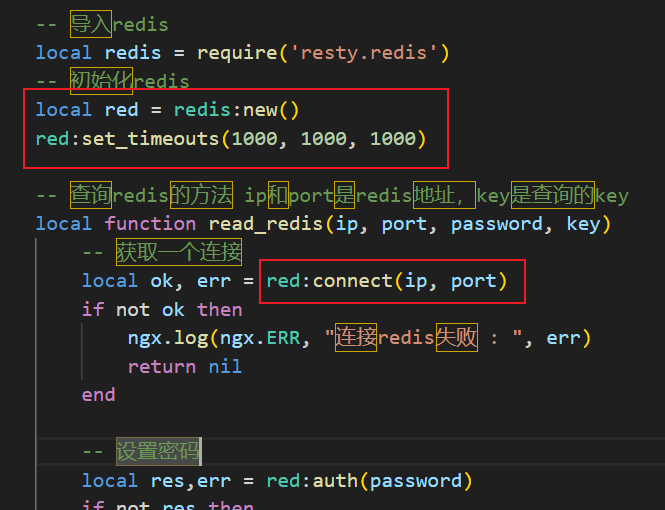

[TOC]

# 一、Redis持久化

## RDB持久化

### 什么是RDB？

**`RDB`**全称`Redis Database Backup file`（**Redis数据备份文件**），也被叫做**Redis数据快照**。简单来说就是把内存中的所有数据都记录到磁盘中。当Redis实例故障重启后，从磁盘读取快照文件，恢复数据。

快照文件称为RDB文件，默认是保存在当前运行目录。


### RDB的执行

RDB持久化会在下面四种情况下执行：

1. `执行save命令`
2. `执行bgsave命令`
3. `Redis停机时`
4. `触发RDB条件时`


#### 1）save命令

  

SAVE命令就会去执行RDB持久化，该命令是由Redis主进程来执行的，由于Redis是单线程的，那么主进程执行该命令就会去阻塞其他所有命令。

并且持久化是将内存中的数据写入磁盘，磁盘的IO比较慢，当数据量比较大时，该SAVE命令所耗费的时间就会比较长，那么其他命令就会被阻塞较长的时间。

所以**不推荐使用**这个命令执行RDB持久化，一般将该命令使用在Redis停止之前，已经没有其他命令要去执行了。


#### 2）bgsave命令


该命令执行以后会去**开启一个独立的进程来`异步`完成RDB持久化**，主进程不收到影响，依然可以继续处理请求。

所以一般**推荐**使用该命令在Redis运行过程中使用来完成RDB持久化。


#### 3）Redis停机时

在Redis停机时会执行一次save命令，实现RDB的持久化。

 

可以看到在Redis停机时，执行了`save`命令，将Redis中的数据进行了RDB持久化。此时，数据就保存到了Redis的运行目录中。


然后，我们再次打开redis服务时，就会根据保存的rdb文件恢复Redis中的数据。


#### 4）触发RDB条件

当我们停止Redis服务时会自动将数据进行RDB持久化，但是只会在停机时会自动进行，当我们的Redis服务运行了很久突然宕机时，由于没有停机进行RDB持久化，所以数据全都会丢失了。

那么这个时候，就需要Redis在一段时间内自动地进行RDB持久化。

Redis内部有触发RDB的机制，在一段时间内会自动地进行RDB持久化，可以在配置文件redis.conf文件中找到RDB持久化的规则，格式如下：

```ini
# 900秒内，如果至少有1次修改，则执行bgsave
save 900 1
# 300m秒内，如果至少有10次修改，则执行bgsave
save 300 10  
# 60秒内，如果至少有10000次修改，则执行bgsave
save 60 10000 
```

满足上述三个条件其中之一，就会触发RDB的条件，自动执行`bgsave`命令对数据进行异步持久化。


### RDB的fork原理

当满足一定条件或者手动执行bgsave命令，就可以进行异步地RDB持久化。异步持久化就是去开启一个子进程，由子进程去完成内存的读取并写入磁盘RDB文件的操作。该持久化是异步的，所以几乎对主线程没有影响。但是，子进程是由主进程fork得来的，这个fork的过程是阻塞的，此时主进程只能进行fork操作，不能处理其他请求，因此我们需要尽快完成fork，避免阻塞时间过久。

**那fork的过程是怎样的呢？**

在Linux系统中，所有的进程都无法直接操作物理内存，而是由操作系统为每个进程分配一个**`虚拟内存`**，进程只能去操作虚拟内存。操作系统会维护一个虚拟内存和物理内存之间的映射表，这个表称为**`页表`**。主进程去操作虚拟内存时，虚拟内存会基于页表的映射关系到达物理内存中真正的存储位置，就能够实现通过对虚拟内存的读写来实现对真正物理内存的读写操作了。

**执行fork操作时，会去创建一个子进程，同时操作系统会为该子进程分配一个虚拟内存，主进程将自己的页表拷贝给子进程，子进程就得到了与主进程一样的虚拟内存与物理内存之间的映射关系。**

**这样一来，当子进程去操作虚拟内存时，就能够映射到与主进程中一样的物理内存区域，实现了主进程与子进程空间的共享。然后子进程就可以直接读取自己内存中的数据，实际读取的是主进程内存中的数据，而后将数据写入到磁盘中的RDB文件中，替换原本旧的RDB文件。**这种方式不需要拷贝内存中的数据就实现了内存的共享，所以这种方式速度比较快，主进程阻塞的时间比较短。


但是上述过程会存在一个问题：由于子进程是异步的，所以子进程和主进程之间是可以同时执行的，那么就有可能会出现冲突，出现脏数据。

为避免上述出现问题，fork会采用**`copy-on-write`**技术：**fork会将主线程与子线程共享的物理内存设置为`read-only`，即只读，任何进程只可读不可写。**

* 当主进程执行读操作时，访问的是共享的物理内存；
* 当主进程执行写操作时，会将共享的物理内存中要执行写操作的数据拷贝一份，对拷贝后的数据进行写操作。

当主进程对某数据拷贝以后，之后对该数据所有的读、写操作都是去操作拷贝后的数据，那么在主进程的页表中，该数据的映射就是映射到拷贝后的数据中。

假设有一个极端情况：子进程进行持久化所需的时间比较长，在这段时间内，主进程对内存中所有的数据都进行了写操作，那么此时就会将所有的数据都拷贝了一份，Redis对内存的占用翻倍了。假设我们的内存只有4GB，当Redis占用了2GB时，若出现了这种极端情况Redis就会直接占满内存。


### 总结

**RDB方式bgsave的基本流程？**

* fork主进程得到一个子进程，共享内存空间。
* 子进程读取内存数据并写入新的RDB文件。
* 用新RDB文件替换旧的RDB文件。


**RDB会在什么时候执行？**

默认是服务停止时。


**save 60 1000代表什么含义？**

代表60秒内至少执行1000次则会触发RDB持久化，进行bgsave。


**RDB的缺点？**

* RDB执行间隔时间长，两次RDB之间写入数据有丢失风险。

* fork子进程、压缩、写入RDB文件都比较耗时。


---

## AOF持久化

### AOF原理

**`AOF`**全称Append Only File（追加文件）。

**Redis处理的每一个`写命令`都会记录在AOF文件中**，可以看作是命令日志文件。有些类似于Mysql中的binlog日志，binlog也是会将Mysql的所有修改操作（DDL、DML语句）全都记录下来。


比如：使用Redis执行`SET num 123`命令，先将num 123数据记录在Redis的key-value中，然后将该命令写入到AOF文件中。如下所示：

 

在AOF文件中不仅会记录命令，也会去记录命令中包含字符的长度。SET字符长度为3，就会记录$3；num字符长度为3，也会记录$3；123字符串长度也为3，同样也会去记录$3。

**将来若Redis出现了故障，想要恢复时，只需要读取AOF文件，将其中的命令从头到尾执行一遍，这样就能够将数据恢复到原来的状态了。**


### AOF配置

在默认情况下，AOF持久化是关闭的，需要去修改redis的配置文件redis.conf来开启AOF持久化：

```ini
# 是否开启AOF功能，默认是no
appendonly yes
# 设置AOF文件的名称
appendfilename "appendonly.aof"
```

AOF持久化操存在着缓冲区，类似于redo log中的redo log buffer，先将记录存储在内存中，然后再将存储在内存中的记录持久化到磁盘。

在redo log日志中，通过配置innodb_flush_log_at_trx_commit参数来设置刷盘的策略。对于Redis的AOF持久化，也可以通过在redis.conf文件中配置`appendfsync`参数来配置AOF的刷盘策略：

```ini
# 表示每执行一次写命令，都会立即记录到AOF文件
appendfsync always

# 写命令执行完先放入AOF缓冲区，然后每隔1秒将缓冲区的数据写入AOF文件，是默认方案。
appendfsync everysec

# 写命令执行完先放入AOF缓冲区，由操作系统决定何时将缓冲区内容写回磁盘
appendfsync no
```

> * **`appendfsync always`：表示每次执行写命令，都会先将记录写到AOF缓冲区，然后将该记录进行刷盘写到AOF文件中。**
>
>   有些类似于MySQL中redo log日志的innodb_flush_log_at_trx_commit=1参数设置为1。
>
>   由于每次执行命令都会将记录写到AOF文件中，所以其**安全性最高，但是效率最差**。
>
> * **`appendfsync everysec`：表示每次执行写命令，都将记录写入到AOF缓冲区，然后每隔1秒中进行刷盘，将缓冲区中的数据写入到AOF文件中。（默认方案）**
>
>   有些类似于Mysql中redo log日志的innodb_flush_log_at_trx_commit参数设置为0。
>
>   这种方式相较always**效率更高一点**，因为不需要每次执行写命令都将记录写入到磁盘中，但是**安全性更差一点**，因为其每隔1秒将缓冲区的数据写入磁盘，若在这1秒内Redis宕机中，那么就会丢失1秒内修改的数据。
>
> * **`appendfsync no`：表示执行完写命令，只会将记录写入到AOF缓冲区，至于何时进行刷盘，由操作系统自己决定。**
>
>   这种策略刷盘的效率是很低的，操作系统一般会隔很久才进行一次刷盘操作。
>
>   所以这种策略的**效率很高，但是安全性很差**。
>
>   使用这一种方式不如直接使用RDB持久化，所以一般不推荐使用。
>
> 
>
> **默认情况下，使用`everysec`策略。**


**三种AOF持久化测录比较：**

 


**演示**

1. **禁用RDB**

   首先，我们打开redis目录下的redis.conf配置文件，将触发RDB持久化的条件禁用，防止因RDB持久化存在的缘故影响到AOF测试：

    

   使用`save ""`参数，表示禁用触发RDB。


2. **开启AOF持久化功能，并设置AOF文件名称**

   在redis.conf配置文件中，将appendonly参数设置为yes，表示开启AOF持久化功能，同时appendfilename表示设置AOF文件名称，这里我们就使用默认的appendonly.aof文件即可：

    

   

3. **重启redis**

   在配置完毕以后，使用下面的命令关闭Redis。

   ```shell
   systemctl stop redis
   ```

   

   然后我们再使用redis-server命令启动redis，这样我们就可以看见Redis启动的日志信息：

   ```shell
   redis-server
   ```

   

   由日志信息可以得出，在此次重启，Redis并没有去做RDB文件的读取操作。

   在重启完成后，此时我们再去查看一下Redis中的数据：

    

   发现此时，原本Redis中存储的数据全部不存在了。

   因为原本在关闭Redis服务时，会使用save命令对Redis中存储的数据进行RDB持久化，但是因为我们禁用了RDB，所以就没有进行持久化，当我们再次启动Redis时，就不会去根据持久化文件恢复数据，所以此时Redis中不存在任何数据。

   注意，如果使用redis-server命令没有办法启动Redis，我们可以通过直接kill redis-server进程的方式先杀死进程，然后再启动：

   ```shell
   ps -ef | grep redis
   ```

    

   ```shell
   kill -9 进程号
   ```

   然后再重启。

   

4. **测试**

   此时我们往Redis存入一个数据：

   ```shell
   set name cheng
   ```

   在Redis软件目录下的appendonly.aof文件中就会存入该命令信息，我们使用cat命令查看一下：

    

   其中的：

   * `*数字`表示当前命令由几个部分组成，比如*2就表示该命令由两部分组成；

   * `$数字`表示该部分由几个字符组成，比如$6就表示该部分由6部分组成，也就是SELECT。

   * SELECT 0表示选择Redis的库0进行操作，后面跟上了SET name cheng命令去执行写操作。

   

   对该数据进行修改一下：

   ```shell
   set name jack
   ```

   同样地，在AOF文件中也会存入该命令的信息：

    

   

   那么此时，当我们此时去停止Redis服务时会去检查Redis的服务时，会对AOF文件数据进行再次检查：

     

   然后重启Redis服务，会对AOF文件进行加载：

    

   此时我们去查看Redis中的key数据：

    

   此时Redis中就不是空的了，有着之前存入的数据。

   

   假设我们在redis.conf文件将AOF功能设置为关闭状态：

    

   此时我们再去重启redis服务，就可以发现由于我们禁用了AOF持久化，Redis中不存在任何数据：

    

   

由此也就说明AOF确实有着数据的持久化与数据恢复的功能。


### AOF文件重写

**AOF持久化存在一个问题：**

> **`AOF记录的是写命令，而RDB记录的则是数据的值`。**

所以AOF文件会比RDB文件大得多。而且AOF会记录对同一个key的多次写操作，但只有最后一次写操作才是有意义的。

比如我们先写入一个key为name，若在后续操作中继续对该key进行修改，会将所有命令都记录下来，比如：

```shell
set name cheng

set name jack
```

此时AOF文件中会记录这两个命令：

 

但是实际上，只有最后一次写操作，也就是SET name jack是有意义的，前面的SET name cheng所设置的值会被该命令设置的值所覆盖。前面SET name cheng这个命令是多余的。


**那么我们该如何解决这个问题呢？**

> **通过执行`bgrewriteaof`命令，可以让AOF文件执行重写功能，用最少的命令达到相同的结果。**

比如在AOF文件中记录的写操作有：

```shell
set num 123
set name jack
set num 666
```

然后我们执行bgrewriteaof命令后，会让AOF文件进行重写，使用最少的命令来达到相同的效果，那么上述三个写操作就会变为：

```shell
mset name jack num 666
```


**演示**

在Redis中执行BGREWRITEAOF命令：

 

这表示开启一个异步的进程去执行AOF重写。

然后我们来cat一下这个AOF文件：


此时是对AOF进行了重写与压缩，所以内容看不懂，不过没关系，AOF文件依然能够实现数据的持久化与恢复功能。


**Redis也会在触发阈值时自动重写AOF文件。**阈值也可以在redis.conf中配置：

```ini
# AOF文件体积最小多大以上才触发重写
auto-aof-rewrite-min-size 64mb

# AOF文件比上次文件增长多少百分比则触发重写
auto-aof-rewrite-percentage 100
```

即当AOF文件大小是上次重写后大小的一倍且该文件大于64MB时，会自动触发AOF重写。


---

## RDB vs AOF

RDB和AOF各有自己的优缺点，如果对数据安全性要求较高，在实际开发中往往会结合两者来使用。

 


---

# 二、Redis分布式缓存

## 主从架构

### 主从架构说明

单节点Redis的并发能力是有限的，要想进一步提高Redis的并发能力，就需要去搭建集群，而在Redis中，集群一般都是主从集群，实现读写分离。

在主从集群中，有一个主节点，我们称之为master，还有多个从节点，可以称为slave或replica：


为什么Redis一般搭建的都是主从集群呢？

因为Redis的应用一般都是读多写少的场景，我们应对更多的都是读操作的压力，那么我们就可以通过主从集群的方式，实现读写分离。当我们进行写操作时，是去访问主节点，而进行读操作，则会被分发到各个从节点中，这样多个从节点一起承担读的请求，读并发能力就可以得到提高。为了保证无论去哪一个从节点中读取，都可以拿到相同的结果，就需要让master上的数据同步给每一个从节点，实现数据同步。


### 搭建主从架构

#### 1）集群结构说明

我们搭建的主从集群结构如图所示：

 

共包含三个节点，一个主节点，两个从节点。

这里我们会在同一台虚拟机中开启3个Redis实例，模拟主从集群，信息如下所示：

|       IP        |  PORT  |  角色  |
| :-------------: | :----: | :----: |
| `192.168.1.101` | `7001` | master |
| `192.168.1.101` | `7002` | slaver |
| `192.168.1.101` | `7003` | slaver |


#### 2）准备Redis实例和配置

在此之前，我们需要在Linux虚拟机中部署Redis应用，具体步骤请查看： [CentOS7部署Redis.md](..\5、Linux\CentOS7部署Redis.md) 笔记。

我这里是使用已有的Redis实例，复制了三个Redis实例出来，对于原本已有的Redis实例，配置方式请参考： [1、Redis基础篇.md](1、Redis基础篇.md) 笔记。


**1）创建目录**

在/usr/local/src目录下去创建主从架构模式中各个Redis实例的文件夹，名字分别为7001、7002、7003：

```shell
cd /usr/local/src/

mkdir 7001 7002 7003
```

如图所示，在该目录下还存在着redis应用目录：

 


**2） 拷贝配置文件到每个实例目录**

将部署好的Redis中的redis.conf配置文件，拷贝到三个目录中（在/usr/local/src/目录中执行命令）：

```shell
cp redis-6.2.6/redis.conf 7001
cp redis-6.2.6/redis.conf 7002
cp redis-6.2.6/redis.conf 7003
```


**3）修改每个实例的端口和工作目录**

拷贝完成以后，我们现在还不能去运行，因为在redis.conf文件中，默认是将Redis的端口号配置成6379，所以我们需要去分别为三个Redis实例配置端口号。并且在redis.conf配置文件中，配置的dir工作目录参数是./，也就是当前目录下，我们需要为三个Redis实例分别配置不同的工作目录，让他们在各自的7001、7002和7003目录下工作：（在/usr/local/src目录下执行下面的命令）

```shell
sed -i -e 's/6379/7001/g' -e 's/dir .\//dir \/usr\/local\/src\/7001\//g' 7001/redis.conf
sed -i -e 's/6379/7002/g' -e 's/dir .\//dir \/usr\/local\/src\/7002\//g' 7002/redis.conf
sed -i -e 's/6379/7003/g' -e 's/dir .\//dir \/usr\/local\/src\/7003\//g' 7003/redis.conf
```

这样一来，在7001、7002和7003中的redis.conf文件中，就修改了对应Redis实例端口号以及工作目录。

这里的s/dir .\//dir \/usr\/local\/src\/7003\//g表示将所有的`dir ./`，修改成/usr/local/src/7003/目录，即表示将工作目录的位置从当前的应用的redis-server命令执行目录修改为/usr/local/src/7003/目录。


**4）修改每个实例的声明IP**

虚拟机本身有多个IP，为了避免将来混乱，我们需要在每一个Reids的实例的redis.conf文件中指定当前实例所绑定的IP地址。

指定方法：

```ini
# redis实例的声明 IP
replica-announce-ip 192.168.101.101
```

每一个Redis实例都需要指定，我们使用下面的命令进行一键修改（在/usr/local/src目录下执行下面的命令）：

```shell
printf '%s\n' 7001 7002 7003 | xargs -I{} -t sed -i '1a replica-announce-ip 192.168.1.101' {}/redis.conf
```

此时7001、7002以及7003的redis.conf配置文件中，就会多出了replica-announce-ip 192.168.101.101参数指定当前Redis实例的IP信息：

 


#### 3）启动Redis

为了方便查看日志信息，我们打开3个ssh窗口，分别启动3个redis实例，启动命令为：

```shell
redis-server /usr/local/src/7001/redis.conf

redis-server /usr/local/src/7002/redis.conf

redis-server /usr/local/src/7003/redis.conf
```

运行完毕后，就会在后台运行三个redis-server的进程：

 


#### 4）开启主从关系

虽然目前我们已经运行了三个Redis实例，但是这三个实例之间并没有主从关系，还都是独立的Redis实例，所以我们需要为这三个Redis实例开启主从关系。

有临时和永久两种模式：

**永久方式**

在从节点的Redis实例中的redis.conf配置文件中，添加一行配置：

```ini
slaveof 主节点IP地址 主节点端口号
```

那么，当前的Redis实例就会变为指定主节点的从节点。

若主节点中配置了密码，也需要在从节点中配置主节点的密码：

```ini
masterauth 061535asd
```

注意！注意！注意！！！！！！！！！！！！

如果给Redis实例设置了密码，那么在哨兵集群中，主从关系不是一成不变的，有可能随时发生变化，原本的从节点有可能会变为主节点。

并且若想建立主从关系，必须要在从节点中设置主节点的密码，但是又因为主节点可能发生变化，所以：

要么就给所有的节点都设置一样的密码`requirepass`，并且给所有的节点都设置一样的父节点密码`masterauth`；

要么就所有的节点都不设置任何密码。

由于我这里之前设置了密码，所以我就给所有的节点都设置一样的父节点密码masterauth。


**临时方式（重启失效）**

使用`redis-cli -p 端口号`命令方式连接到各个Redis服务中，然后执行slaveof（redis 5.0以后也可以使用replicaof）命令，让当前Redis节点成为指定节点的从节点：

```sh
redis-cli -p 从节点端口号

slaveof 主节点IP地址 主节点端口号
```

注意，如果主节点设置了密码，在执行slaveof命令以后，还需要执行命令：

```shell
config set masterauth 主节点密码
```

的方式设置主节点密码才能成功将该Redis实例设置为主节点。


那么我们这里演示一下临时方式开启主从关系：

通过redis-cli命令连接7002节点，执行下面命令：

 

通过redis-cli命令连接7003节点，执行下面命令：

 

然后连接7001主节点，使用`info replication`命令查看集群状态：

 

如上图所示，这里的两个slave0和slave1就是该主从模式下的两个从节点，而当前节点就是主节点。


#### 测试

执行下列操作以测试：

- 利用redis-cli连接7001，执行```set num 123```

- 利用redis-cli连接7002，执行```get num```，再执行```set num 666```

- 利用redis-cli连接7003，执行```get num```，再执行```set num 888```


可以发现，当我们在7001主节点上执行set num 123后，两个从节点中都能够获取key=num这个数据，并且在从节点上执行set命令时会报错。

即主节点可以进行写操作，从节点只能进行读操作。


---

### 主从数据同步原理（:star:）

当我们在主节点中完成SET写操作后，在从节点中也能够看到写的数据，这就是因为Redis主从之间数据的同步。那主从节点之间，数据底层是如何实现同步的呢？

根据Redis主从节点之间是否是第一次同步，将同步分为**`全量同步`**和**`增量同步`**。

#### 1、全量同步

当主从第一次建立连接时，会执行全量同步，将主节点中的所有数据都拷贝给从节点。


**流程：**

* **第一阶段**

  1. 从节点执行replicaof或slaveof命令，与主节点建立连接。

  2. 从节点向主节点发送请求进行数据同步。

  3. 主节点去判断从节点是否是第一次建立连接；

  4. 如果是第一次，返回主节点的数据版本信息给从节点，从节点保存版本信息，确保数据版本的控制。

* **第二阶段**

  1. 主节点执行bgsave命令，创建子进程去生成RDB文件，主进程在此期间继续可以继续执行写命令并使用缓冲区repl_baklog记录所有的写命令。
  2. 主节点生成RDB文件后，向从节点发送RDB文件。
  3. 从节点清空本地数据，并去加载RDB文件。

* **第三阶段**

  主节点将缓冲区repl_baklog中的命令发送给从节点，从节点去执行接收到的命令。


**缓冲区`repl_baklog`中记录的就是在bgsave期间记录的所有命令。**

为什么上述过程称之为全量同步？

因为存在着RDB持久化过程，会将主节点内存中的所有数据全部存储起来形成快照发送给从节点。

但是这种同步比较消耗性能，因为RDB持久化的过程是比较慢的，会将Redis中的全部数据都持久化形成快照发送，所以这种同步只会在从节点与主节点第一次建立连接时才会使用全量同步的方式。


**master如何判断slave是不是第一次同步数据呢？**

> 这里会用到两个比较重要的概念：
>
> * **`Replication Id`：简称replid，是数据集的标记，id一致说明是同一数据集。**每一个master都有唯一的replid，slave则会继承master节点的replid。
>
>   主节点与从节点第一次建立连接，那么主节点会将自己的replid给从节点，从节点的replid就会与主节点一致，这样就能够**通过判断主节点与从节点中的Replication Id是否一致就可以判断出是否是第一次建立连接**。
>
> * **`offset`**：**偏移量，随着记录在repl_baklog中的数据增多而逐渐增大**。在从节点完成数据同步时也会记录当前同步的offset，所以从节点中offset的大小一定是小于等于主节点中的，因为主节点中的offset是随着repl_baklog中数据的增多而增大，但是从节点只能记录主节点中的offset。
>
>   **如果从节点中的offset小于主节点中的offset，说明从节点中的数据落后于主机点，需要更新。**

由上述两个参数，就可以判断出从节点是拷贝哪一个主节点的数据，以及拷贝的进度。因此，slave进行数据同步时，必须向master声明自己的replication id和offset，master才能判断出是否需要进行数据同步，以及需要同步哪些数据。

因此，**master判断一个节点是否是第一次同步的依据，就是看`从节点的replid是否与当前主节点的一致`，当replid与从节点的一致时，说明不是第一次连接，那么就不会进行全量同步。**

那么，引入了这两个概念以后，全量同步执行的流程就变为了：


##### 全量同步执行流程

> 
>
> **第一阶段**
>
> 1. slave执行replicaof或slaveof命令，发送SYNC命令给master，请求进行增量同步，该命令请求中会包含`replid`和`offset`；
>
> 2. master接收到slave的SYNC请求后，判断当前节点的replid与接收到的replid是否一致；
> 3. 如果不一致，说明是第一次建立连接，那么master会拒绝增量同步，并将自己的replid和offset返回给slave；
> 4. slave收到信息后保存这些信息，这样一来master的replid就和slave中的replid保持一致了。后续再建立连接时就不会进行全量同步。
>
> **第二阶段**
>
> 1. master执行bgsave命令创建一个子进程将完整的数据创建RDB文件；
> 2. 在生成RDB文件期间，会将所有的写命令操作记录在缓冲区的repl_baklog中；
> 3. 在bgsave命令执行完毕生成RDB文件后，master将该RDB文件发送给slave；
> 4. slave在接收到RDB文件后，会先去清空本地数据，然后加载RDB文件进行数据同步。
>
> **第三阶段**
>
> 1. master不断地将写命令操作记录所在缓冲区的repl_baklog中，并持续地将log中的命令发送给slave；
> 2. slave执行接收到的命令，保持与master之间的同步。


简单的概况就是：

- slave节点请求增量同步
- master节点判断replid，发现不一致，拒绝增量同步
- master将完整内存数据生成RDB，发送RDB到slave
- slave清空本地数据，加载master的RDB
- master将RDB期间的命令记录在repl_baklog，并持续将log中的命令发送给slave
- slave执行接收到的命令，保持与master之间的同步


---

#### 2、增量同步

主从数据的第一次同步是全量同步，但是如果是slave重启后的同步，则会执行**`增量同步`**。由于slave重启了，但是此时master还在继续执行，所以此时master和slave之间的数据肯定是有差异的，此时进行的同步就是增量同步。

**增量同步流程**

> 1. slave重启，发送SYNC请求给master，请求进行增量同步，请求中包含slave的replid和offset参数；
> 2. master接收到SYNC请求后，判断当前节点的replid与接收到的replid是否一致；
> 3. 如果一致，说明不是第一次同步，那么就会同意进行增量同步，回复一个contine给slave；
> 4. master去repl_baklog中，将获取到的slave的offset之后的数据发送给slave；
> 5. slave执行接收到的命令。


以上就是增量同步的大致过程。


---

#### 3、repl_baklog原理

repl_baklog本质上是一个数组，数组大小是固定的，只不过该数组是**`环形`**的。**当数组中的数据满了以后，会再次从头开始读写，数组头部的数据会被新数据覆盖。**

在repl_baklog中会记录Redis处理的命令日志以及offset，包括master的offset和slave中拷贝的offset。

如下图所示：其中绿色部分是slave节点已经同步了的数据；而红色部分是未同步数据。

 

当主节点写入数据时，repl_baklog就会不断地记录数据，master的offset会不断增大，指向的是master节点最新修改命令存放的位置；而slave的offset指向的是该slave节点最新修改命令存放的位置。所以**master与slave之间offset的差异，就是slave需要增量同步的数据了。**

随着不断有数据写入，master的offset逐渐增大，slave也会不断地拷贝，slave的offset追赶master的offset：

 


直到repl_baklog数组被填满：

 

此时如果还有新的数据写入，那么就会覆盖数组中的旧数据。

旧的数据只要是绿色的，说明已经被同步到了slave中，即便覆盖也不会影响，未同步的仅仅是红色部分。


但是，如果slave中出现了网络阻塞，导致master的offset远远超过了slave的offset，这个时候，就有可能会出现红色部分再次覆盖红色部分：

 

也就是说，slave中还没有进行同步的数据也被master的新数据给覆盖了，那么slave就无法进行被覆盖部分的修改，此时slave就无法基于log做增量同步了，因为log中的数据被覆盖了，只能去master节点的内存中进行全量同步，将master同步给slave了。

即：

> repl_baklog大小有上限，写满后会覆盖最早的数据。如果slave断开时间过久，导致尚未备份的数据被覆盖，则无法基于log做增量同步，只能再次全量同步。


---

#### 总结（:star2:）

**全量同步和增量同步区别？**

* 全量同步：master将完整内存数据生成RDB，发送RDB文件到slave，slave根据RDB文件进行同步。后续命令记录在repl_baklog中，逐个发给slave。
* 增量同步：master根据slave中的offset，获取repl_baklog中的从offset之后的命令发送给slave。


**什么时候执行全量同步？**

* slave从节点第一次连接到master主节点时；
* slave从节点断开的时间太久，master主节点的repl_baklog中，slave从节点中未进行同步的数据也被覆盖时。


**什么时候执行增量同步？**

* slave从节点断开后又恢复，并且在master主节点的repl_baklog中未进行同步的数据未被新数据覆盖。


---

### 主从同步优化

可以从以下几个方面来优化Redis主从集群的同步性能：

> **提高全量同步的性能**

1. `在master中配置repl_diskless-sync yes启用无磁盘复制，避免全量同步时的磁盘IO。`

   原本的全量同步，是先创建RDB文件，将master中的数据写入到RDB文件中，然后通过网络将文件发送给从节点。

   我们知道磁盘IO的速率是比较慢的，所以导致了全量同步的效率比较低。

   所谓无磁盘复制，将原本写入到磁盘文件中的数据，直接写入到网络中，使用网络IO流的方式直接发送给slave，减少了磁盘的IO，提高了性能。

   在网络带宽比较快的情况下，使用网络IO的方式传输数据效率会非常高。

   

2. `降低Redis单节点的内存上限，从而减少单个节点的数据量，进而减少全量同步时的磁盘IO操作。`


> **降低全量同步发生的可能性**

`适当提高repl_baklog的大小，发现slave宕机时尽快实现故障恢复，尽可能避免全量同步。`

当slave宕机时，若repl_baklog中的数据过多导致出现slave未同步的数据被覆盖，此时slave就需要进行全量同步。所以，我们可以通过适当提高repl_baklog的大小并且以及尽快恢复slave，来尽可能地避免slave未同步的数据被新数据所覆盖，来减少全量同步发生的可能。


> **减少主节点的压力**

`限制一个master主节点上slave从节点的数量，如果有太多的从节点，可以采用主从从链式结构，从而减少主节点数据同步的压力。`

主从从架构图：

 

从节点以从节点作为主节点，使用从节点进行数据的同步。

当我们设置主从关系时，在slaveB中执行slaveof命令去设置它的主节点为slaveA，这样一来，当主节点master给从节点slaveA完成数据同步后，从节点slaveA会给它的从节点slaveB进行数据同步，从而降低主节点的压力，将数据同步的压力进行分散。


---

## Redis哨兵（Sentinel）

### 哨兵的作用和原理

#### 引入

**主从模式存在着一个问题：**

对于主从集群模式来说，如果slave宕机了，由于我们存在着多个slave节点，读操作依然可以进行，只不过其他的slave节点读的压力稍微会变高一点，几乎对集群没有什么影响，我们只需要重启一下宕机的slave节点然后找master节点恢复数据就可以了。

但是若master节点宕机了，由于主从集群中master节点只有一个，并且写操作都是在master节点中进行的，所以master宕机就只能读不能写了，这对程序是非常严重的后果。

**那如何解决这一问题呢？**

我们可以去监控Redis主从集群中的节点状态，当发现master节点宕机时，立即选一个slave节点作为master节点。由于slave节点一直都在同步，包含着Redis中的完整数据，可以将其作为master节点。那么此时Redis的主从集群依然是健康的，可以进行读写操作。而对于宕机的master节点，重启之后重新同步数据后作为slave即可。这样实现了主从节点的切换，整个Redis主从集群得到了高可用性的保障。

那么，Redis哨兵就是完成上述步骤来保证Redis不会因为master的宕机而出现问题，保证了Redis主从集群的高可用性。


#### 哨兵的作用

> **Redis提供了哨兵（`Sentinel`）机制来实现主从集群的自动故障恢复，从而实现了Redis的`高可用性`。**

**哨兵的结构如图：**

 

哨兵是用来保证主从集群的可用性的，所以哨兵也需要设置成集群架构，来保证哨兵的正常工作。


**哨兵的作用如下：**

* **监控**：Sentinel会不断检查每一个master和slave节点的状态，查看是否按预期工作。

* **自动故障恢复**：如果slave节点故障了，那么Sentinel会自动重启该slave节点；如果master节点故障了，那么Sentinel会自动地将一个slave节点提升为master，并且当原master节点恢复后，也会以新的master为主，原master节点将作为主从集群中的slave节点。

* **通知**：Sentinel充当Redis客户端（RedisTemplate）的服务发现来源，当集群发生故障转移时，会将最新信息推送给Redis的客户端。

我们通过Redis的客户端（在Java的Spring中就是RedisTemplate）去访问Redis实现数据的读写，但是我们配置了Redis的主从集群，实现了Redis的读写分离，所以我们需要在主节点完成写操作，在从节点完成读操作。但是，若主节点宕机了，此时Sentinel实现了主从的切换，此时主从的地址就变更了。此时Java客户端是不知道这些事情的，因为在Java客户端中，访问的Redis地址是写死的。所以：

> **对于主从集群来说，Redis的Java客户端（RedisTemplate）不是直接去访问主从节点，而是访问Sentinel，由Sentinel告诉Java客户端主从节点的地址。**
>
> **当master节点宕机，发生了主从节点的切换时，Sentinel就会立即将服务状态变更告诉Java客户端，Java客户端就能够得知新的主从节点地址，从而改变访问节点的地址。**这就是Sentinel的通知作用。


#### 哨兵原理（:star:）

##### 1、集群监控原理

**Sentinel基于`心跳机制`检测服务状态，每隔1秒向集群的每个实例发送ping命令：**

* **`主观下线`：如果某Sentinel节点发现某redis实例未在规定时间内响应，则认为该实例主观下线。**

  比如Sentinel集群中的某个Sentinel节点给master节点发送ping命令，并且其在规定时间内没有得到master节点的pong响应，则该Sentinel节点认为master节点主观下线。这种情况下master有可能并未真的下线，因为有可能会因为网络被阻塞了所以Sentinel没有在规定时间内得到响应，所以这种认定是不准确的，是主观的。

   


* **`客观下线`：若超过指定数量（quorum）的Sentinel都认为该实例主观下线，则该实例客观下线。**

  quorum的值可以在redis.conf文件中进行配置，一般要配置为超过Sentinel实例数量的一半。

  比如，若Sentinel集群中有三个Sentinel节点，那么我们可以将quorum的值配置为2，当Sentinel集群中存在2个节点都认为Redis的某个实例主观下线，那么该Redis实例就被认为是客观下线了。

   

  此时，若该Redis实例是slave节点，则进行重启；

  若该Redis实例是master节点，则需要选择slave节点中的一个节点作为master节点，并将原master节点重启并作为slave节点。


##### 2、集群故障恢复原理

确认Redis实例真正故障后，就需要真正进入到故障恢复阶段。如何进行故障恢复，也需要经历一系列流程：

###### 1）选举哨兵领导者

首先需要选举出一个哨兵领导者，由这个专门的哨兵领导者来进行故障恢复操作，不用多个哨兵都参与故障恢复。选举哨兵领导者的过程，需要多个哨兵节点共同协商来选出。

这个选举协商的过程，在分布式领域中叫做**`达成共识`**，协商的算法叫做**`共识算法`**。

共识算法主要为了解决在分布式场景下，多个节点如何针对某一个场景达成一致的结果。共识算法包括很多种，例如Paxos、Raft、Gossip算法等，哨兵选举领导者的过程类似于`Raft`算法，它的算法足够简单易理解。

**简单来讲流程如下：**

* 每个哨兵都设置一个随机超时时间，超时后向其他哨兵发送申请成为领导者的请求；
* 其他哨兵只能对收到的第一个请求进行回复确认；

* 首先达到多数确认选票的哨兵节点，成为领导者；
* 如果在确认回复后，所有哨兵都无法达到多数选票的结果，那么进行重新选举，直到选出领导者为止。

选出哨兵领导者后，之后的故障恢复操作都由这个哨兵领导者进行。


###### 2）选举新的master

哨兵领导者针对发生故障的master节点，需要在它的slave节点中，选择一个节点来代替其工作。

这个选择新master也是有依据的，在多个slave的场景下，优先级按照：

> **`slave-priority值的大小 > offset值的大小 > 运行id的大小`对slave进行选择。**

即：

1. 首先会先判断slave节点的slave-priority值，该值配置在redis.conf文件中，**slave-priority值越小优先级越高**，如果为0表示永不参与选举，在默认情况下所有Redis节点中的slave-priority值都是一样的。

2. 如果slave-prority都一样，则去判断slave节点中offset值，**offset值越大**说明数据越新，数据的完整性就越高，**优先级就越高**。

3. 如果所有的slave的offset值都一样，那么此时实际上选择哪一个slave去作为master都是一样的，此时就会随机选择一个slave作为master。随机的策略是根据slave节点的运行id大小，**运行id越小优先级越高**。

   这个运行id是在slave节点启动时，由redis自动生成的id，在这里实际上没有什么意义，只不过是随机选择一个的策略。


###### 3）提升新的master

经过优先级选择，选出了备选的master节点后，下一步就是要将备选的master节点提升为新的master，进行真正的主从切换了。

> **流程如下：**
>
> * 哨兵领导者给备选的master节点发送`slaveof no one`命令，让该节点成为master节点；
> * 然后，哨兵领导者会给所有其他slave节点发送`slaveof 新master节点地址 新master节点端口号`，让这些slave成为新master的从节点，并开始从新master上同步数据；
> * 最后，哨兵领导者把故障的master节点降级为slave，将`slaveof 新master节点地址 新master节点端口号`命令写入到故障节点的配置文件中，待这个故障节点恢复后，就自动成为新master节点的slave。

例如：

 

对于上述的主从集群来说，当master故障后，选出了7002这个slave节点作为新的master，那么首先会去7002节点中执行slaveof no one，将该节点作为master节点；然后会去7003这个slave节点中执行slaveof 192.168.150.101 7002，将7002这个redis实例视为当前节点的master节点；最后，会在原master这个7001节点中，将slaveof 192.168.150.101 7002写入到配置文件中，这样在7001恢复以后就会自动将7002视为当前节点的master，而7001就会降级成为slave。


###### 4）客户端感知新master

最后，Java客户端该如何拿到最新的master地址呢？

哨兵在故障切换完成后，会像自身节点的指定`pubsub`中写入一条信息，客户端可以订阅这个`pubsub`来感知master变化通知，我们客户端也可以在哨兵节点主动查询当前最新的master，来拿到最新的master地址。

另外，哨兵还提供了`钩子`机制，我们可以在哨兵配置文件中配置一些脚本逻辑，在故障切换完成时，触发`钩子`，通知客户端发生了切换，让客户端重新获取最新的master地址。

一般来说，推荐采用第一种方式进行处理，很多客户端SDK中已经集成好了从哨兵节点获取最新master的方法，我们直接使用即可。


---

### 搭建哨兵集群

#### 结构介绍

如下图所示，我们在同一个Linux虚拟机中搭建一个三节点形成的Sentinel集群，来监管我们之前所搭建的Redis主从集群：

 

三个Sentinel实例信息如下：

| 节点 | IP            | PORT  |
| ---- | ------------- | ----- |
| s1   | 192.168.1.101 | 27001 |
| s2   | 192.168.1.101 | 27002 |
| s3   | 192.168.1.101 | 27003 |


#### 1、准备实例和配置

要在同一台虚拟机中开启三个实例，必须先准备三份不同的配置文件和目录，配置文件所在的目录也就是工作目录。

我们在redis应用存放的目录，也就是/usr/local/src目录下，创建三个文件夹，名字分别为s1、s2和s3：

```sh
# 进入/usr/local/src目录
cd /usr/local/src
# 创建目录
mkdir s1 s2 s3
```


然后在s1目录下创建一个sentinel.conf文件：

```sh
vim s1/sentinel.conf
```

然后将下面的内容拷贝到该conf文件中

```ini
port 27001
sentinel announce-ip 192.168.1.101
sentinel monitor mymaster 192.168.1.101 7001 2
sentinel auth-pass mymaster 061535asd
sentinel down-after-milliseconds mymaster 5000
sentinel failover-timeout mymaster 60000
dir "/usr/local/src/s1"
```

其中：

* `port`表示的是该Sentinel的端口；

* `sentinel announce-ip`表示去声明当前Sentinel的IP地址，避免出现IP的混乱；

* `sentinel monitor`表示去声明该Sentinel所监控的Redis主从集群，mymatser表示给该主从集群起的一个别名，后续跟上的是主节点的地址，因为主节点就代表着主从集群。

  后面跟上的2表示客观下线的quorum值，也就说当超过2个Sentinel都认为节点主观下线了，就表示该节点客观下线。

* `sentinel auth-pass`：若在主节点中配置了登陆密码，那么我们在使用Sentinel时，就需要去设置监控的主从集群中主节点的密码。

* `sentinel down-after-milliseconds`和`sentinel failover-timeout`这两个参数是去配置超时时间，其中sentinel down-after-milliseconds表示slave与master断开的最长超时时间，sentinel failover-timeout表示slave故障恢复的超时时间。就算不配置也会设置上述的值。

* `dir`配置的是Sentinel的工作目录。

**注意点**：如果Redis实例是本地的，IP地址最好也不要写127.0.0.1，防止访问请求被拒绝


然后将s1/sentinel.conf文件拷贝到s2、s3两个目录中：

```sh
cp /usr/local/src/s1/sentinel.conf /usr/local/src/s2
cp /usr/local/src/s1/sentinel.conf /usr/local/src/s3
```


最后，修改s2、s3两个文件夹内的配置文件，将端口号与工作目录进行修改：

```sh
sed -i -e 's/27001/27002/g' -e 's/s1/s2/g' /usr/local/src/s2/sentinel.conf

sed -i -e 's/27001/27003/g' -e 's/s1/s3/g' /usr/local/src/s3/sentinel.conf
```

当然，也可以进入到s2、s3目录中，手动对sentinel.conf文件进行修改。


#### 2、启动

为了方便查看日志信息，我们打开3个SSH窗口，分别启动3个Redis实例，启动命令：

```sh
# 第1个
redis-sentinel /usr/local/src/s1/sentinel.conf
# 第2个
redis-sentinel /usr/local/src/s2/sentinel.conf
# 第3个
redis-sentinel /usr/local/src/s3/sentinel.conf
```


启动后：

 

此时就将三个Sentinel成功启动，这三个Sentinel就形成了Sentinel的集群。


#### 3、测试

我们使用kill命令，让主节点7001宕机，然后查看一下各个Sentinel的日志信息：

  

sdown意思就是当前的Sentinel节点认为主节点主观下线。

然后若有2个或2个以上的Sentinel都认为主观下线时，就会odown，即客观下线。

客观下线就会开始故障重启，try-failover就表示开始故障重启：

 

首先会先选举一个Sentinel的领导者，让这个领导者去进行故障恢复，这里的vote-for-leader就表示选举一个领导者：


然后再让这个领导者去选择将哪一个从节点提升为新的主节点，这里选择的是7003节点：


然后将send一个slaveof no one命令给7003，这样7003就变成了主节点：

 

然后将7001节点切换为从节点，并且发送一个slave命令给7002，此时7002就会重新认定7003为主节点，并重新进行全量同步。

 

当我们重启7001时，由于在7001配置文件中已经将7003节点认定为主节点，所以7001是作为slave节点重启的，并且会去重新进行全量同步，同步7003中的数据。


#### 4、SpringBoot集成Redis哨兵集群

在Sentinel集群监管下的Redis主从集群，其节点会因为自动故障转移而发生变化，Redis的客户端必须感知这些变化，及时更新连接信息。Spring的RedisTemplate底层利用lettuce实现了节点的感知和自动切换。

下面，我们通过一个测试来实现RedisTemplate集成哨兵机制。

**步骤**

1. **在pom文件中引入redis的starter依赖**

```xml
<dependency>
    <groupId>org.springframework.boot</groupId>
    <artifactId>spring-boot-starter-data-redis</artifactId>
</dependency>
```


2. **在配置application.yml中指定Sentinel的相关信息：**

```yaml
spring:
  data:
    redis:
	  password: 061535asd
      sentinel:
        master: mymaster
        nodes:
          - 192.168.1.101:27001
          - 192.168.1.101:27002
          - 192.168.1.101:27003
```

以上是我自己配置的虚拟机中Sentinel的地址，根据实际情况进行更改，其中mymaster是我自己在Sentinel的配置文件中配置的主从集群别名，根据该别名去使用主从集群。

**注意！注意！注意！**

* 如果要给Redis集群中的某一个Redis实例设置密码的话，就需要给集群中所有的Redis都设置`requirepass`（密码）和`masterauth`（主节点密码）。因为master和slave的关系不是一成不变的，由于哨兵的存在是有可能发生改变的，并且子节点与父节点建立连接就需要输入父节点的密码，所以需要在每一个Redis实例中都设置当前实例的密码以及父节点的密码。

  给Redis实例设置了密码后，还需要在Sentinel集群中的每一个Sentinel都设置Redis实例的密码。

  并且，最后使用SpringBoot集成Sentinel集群时，也要设置Redis的密码。

  所以：**`所有Redis实例的密码都必须相同。`**

  **建议：不设置Redis的密码。**（但是我这里已经设置了密码了，懒得改了，建议主从集群中的Redis实例不设置密码）

* 这里我们不再配置Redis主从集群的地址，而是配置Sentinel的地址。因为在使用哨兵模式监控Redis主从集群以后，主从集群中主节点与从节点的地址是有可能因为出现故障而被哨兵变更的，所以我们不能写死主从节点的地址，而是通过哨兵来获取地址信息。
* SpringBoot3以后，会将SpringBoot2中redis的配置属性从spring.redis更改为spring.data.redis，注意更改。


3. **配置主从读写分离**

创建config包，在该包下创建一个RedisConfig配置类，在该配置类中添加一个bean来配置读写分离：

```java
@Configuration
public class RedisConfig {
    @Bean
    public LettuceClientConfigurationBuilderCustomizer clientConfigurationBuilderCustomizer(){
        return clientConfigurationBuilder -> clientConfigurationBuilder.readFrom(ReadFrom.REPLICA_PREFERRED);
    }
}
```

这个bean中配置的就是读写策略，包括四种：

* `MASTER`：从主节点读取
* `MASTER_PREFERRED`：优先从主节点读取，master不可用才读取slave。
* `REPLICA`：从slave节点读取。
* `REPLICA_PREFERRED`：优先从slave节点读取，所有的slave都不可用时才去读取master。

由上面的描述，我们知道读操作一般都是去读子节点，所以选择第四种读写策略。


**测试**

那么，经过上面的步骤，哨兵集群就配置完毕了，我们现在来启动SpringBoot来测试一下。

创建一个类，使用StringRedisTemplate分别执行读操作与写操作：

```java
@RestController
public class HelloController {

    @Autowired
    private StringRedisTemplate stringRedisTemplate;

    @GetMapping("/get/{key}")
    public String hi(@PathVariable String key) {
        return stringRedisTemplate.opsForValue().get(key);
    }

    @GetMapping("/set/{key}/{value}")
    public String hi(@PathVariable String key, @PathVariable String value) {
        stringRedisTemplate.opsForValue().set(key, value);
        return "success";
    }
}
```

那么，此时我们就可以访问Redis主从集群来进行读写测试了，不过在此之前，我们需要先将我们的Redis主从集群启动，然后再去启动Sentinel服务，我们才能使用SpringBoot连接上虚拟机中的Sentinel服务。

开启主从集群中Redis实例：

```sh
redis-server /usr/local/src/7001/redis.conf
redis-server /usr/local/src/7002/redis.conf
redis-server /usr/local/src/7003/redis.conf
```

由于我们的Sentinel是在一台Linux上创建的，所以我们就开启三个ssh连接，开启Sentinel服务：

```shell
redis-sentinel /usr/local/src/s1/sentinel.conf

redis-sentinel /usr/local/src/s1/sentinel.conf

redis-sentinel /usr/local/src/s1/sentinel.conf
```

> **注意！**
>
> 只有Sentinel服务已经启动了，使用SpringBoot才能够使用Sentinel，若Linux虚拟机中Sentinel未启动状态，此时连接就会超时。
>
> 所以，我们在使用Sentinel哨兵集群时，需要确保这些Sentinel服务已启动。启动的命令就是：`redis-sentinel sentinel的配置文件`


启动SpringBoot，访问http://localhost:8080/get/num来获取Redis主从集群中key为num的值，此时我们就可以在日志信息看到Sentinel集群所监控主从集群中，主节点端口号是7003：

 

从节点端口号是7001和7002：

 

然后会与集群中的每一个节点都建立连接。

我们执行GET查询命令时，交给了slave节点7002进行处理：

 

执行结果：

 


我们再通过URL去执行SET命令：http://localhost:8080/set/num/666，此时该命令就会交给主节点7003来进行执行：

 


然后我们来测试一下主从节点的切换，我们去使用kill命令，让主节点7003的进程停止：

 

那么此时，7003主节点宕机了，哨兵就会去选择一个从节点作为新的master主节点，此时再去执行SET命令，就可以看到，此时去执行SET命令的是7001，原slave节点，现在被提升为了master：

 

此时再去重启7003节点，就会将该7003作为主从集群中的从节点运行，之后读的命令就有可能会使用7003节点运行：

 


---

## Redis分片集群（Cluster）

### 认识分片集群

主从+哨兵模式可以解决高可用性、高并发读的问题。但是依然解决不了下面的两个问题：

1. `海量数据存储问题`
2. `高并发写问题`

虽然实现了Redis的主从集群，但是Redis每个节点中存储的数据依然不会变化，当Redis节点中存储的数据过多时，Redis的响应就会变得很慢，这是因为持久化生成RDB快照是通过fork子线程来实现的，fork操作时间和Redis数据量成正相关，而fork时会阻塞主线程。随着数据量的增加，fork耗时也会增加，那么在这段时间内，主节点就会被阻塞，无法执行写操作。

并且，主从集群仅仅是多了slave节点，而slave节点只能读不能写，是读写分离的，master节点还是只有一个，所以当写操作很多时，master节点的压力会很大。

这是主从+哨兵模式没有办法解决的两个问题，这个时候就可以使用分片集群。

> 当然，如果你的项目数据量不是很高，访问量也不是很大，使用主从+哨兵模式足够用了，不需要使用分片集群。

分片集群如下图所示：

 

**分片集群特征：**

> * 在分片集群中有多个master节点，每个master保存着不同的数据。
>
> * 每个master都可以有多个slave节点。
>
> * master之间通过ping心跳机制检测彼此健康状态。
>
> * 客户端请求可以访问集群中任意节点，最终都会被转发到正确节点。

这样一来，数据量得到了分散，从而可以存储更多的数据，从而应对海量数据存储的问题；并且由于存在多个master，每个master都可以执行写操作，那么高并发写的能力也就得到了提升。

并且每个master都可以有多个slave节点，所以高并发读的能力依然存在。

在分片集群中，请求可以访问任意一个节点，自动路由可以将请求自动转发到正确的节点，所以**Redis分片集群不需要哨兵机制，也具有哨兵的功能。**


### 搭建分片集群

#### 集群结构说明

分片集群所需的节点数量较多，这里我们搭建一个最小的分片集群，包含3个master节点，每一个master中包含一个slave节点，结构如下所示：

 

这里我们会在同一台虚拟机上开启6个redis实例，模拟分片集群，信息如下：

| IP            | PORT | 角色   |
| ------------- | ---- | ------ |
| 192.168.1.101 | 7001 | master |
| 192.168.1.101 | 7002 | master |
| 192.168.1.101 | 7003 | master |
| 192.168.1.101 | 8001 | slave  |
| 192.168.1.101 | 8002 | slave  |
| 192.168.1.101 | 8003 | slave  |


#### 1、准备实例和配置

如果之前在该Linux中已经使用了前面的方式创建主从集群，那么我们先去将原主从集群的redis目录删除，避免原配置的干扰，然后分别创建这六个Redis实例的目录：

```sh
# 进入/usr/local/src目录，将Redis实例放在该目录
cd /usr/local/src

# 删除旧的，避免配置干扰
rm -rf 7001 7002 7003

# 创建目录
mkdir 7001 7002 7003 8001 8002 8003
```


然后在/usr/local/src目录下，使用vim命令，创建一个新的redis.conf文件：

```sh
vim redis.conf
```

该文件内容如下所示：

```ini
port 6379
# 开启集群功能
cluster-enabled yes
# 集群的配置文件名称，不需要我们创建，由redis自己维护
cluster-config-file /usr/local/src/6379/nodes.conf
# 节点心跳失败的超时时间，超过5000ms没有响应就认为疑似宕机
cluster-node-timeout 5000
# 持久化文件存放目录
dir /usr/local/src/6379
# 绑定地址
bind 0.0.0.0
# 守护进程，默认是no，设置为yes让redis在后台运行
daemonize yes
# 注册的实例ip
replica-announce-ip 192.168.1.101
# 保护模式设置为no，就不再做用户名与密码的校验
protected-mode no
# 数据库数量
databases 1
# 日志
logfile /usr/local/src/6379/run.log
```

上述的replica-announce-ip是用来指定当前Redis实例的IP地址的，根据实际进行修改，因为我的Linux虚拟机IP地址为192.168.1.101，所以我设置成这样。


然后将这个文件拷贝到各个Redis实例目录下：

```sh
# 进入/usr/local/src目录
cd /usr/local/src

# 执行拷贝
echo 7001 7002 7003 8001 8002 8003 | xargs -t -n 1 cp redis.conf
```


修改每个目录下的redis.conf文件，将文件中的6379修改为与当前所在目录名一致：

```sh
# 进入/usr/local/src目录
cd /usr/local/src

# 修改配置文件
printf '%s\n' 7001 7002 7003 8001 8002 8003 | xargs -I{} -t sed -i 's/6379/{}/g' {}/redis.conf
```

这样一来，每个Redis实例的配置就完成了，我们来看看其中一个7001实例的配置文件：

 

可以看到此时配置信息已经改成了当前实例的配置。


#### 2、启动Redis服务

配置完成之后，就可以启动Redis服务了

```sh
# 进入/usr/local/src目录
cd /usr/local/src

# 一键启动所有服务，当然也可以自己使用redis-server手动启动
printf '%s\n' 7001 7002 7003 8001 8002 8003 | xargs -I{} -t redis-server {}/redis.conf
```

通过ps查看进程状态：

```sh
ps -ef | grep redis
```

可以看到，6个Redis实例就都全部运行了：

 


如果要关闭所有进程，可以在/usr/local/src目录下执行命令：

```shell
printf '%s\n' 7001 7002 7003 8001 8002 8003 | xargs -I{} -t redis-cli -p {} shutdown
```

实际上就是批量的使用redis-cli执行shutdown命令。


#### 3、创建分片集群

运行了Redis服务还没有结束，因为我们虽然将Redis服务运行了，但是这六个Redis服务并没有建立联系，因为我们并没有指定在分片集群中的联系，所以这六个Redis目前还是独立的节点，我们还需要去让它们建立分片集群关系。

我们需要执行命令来创建集群，在Redis 5.0之前创建集群比较麻烦，5.0之后集群管理命令都集成到了redis-cli中。

**1）Redis 5.0之前**

Redis5.0之前集群命令都是用redis安装包下的src/redis-trib.rb来实现的。因为redis-trib.rb是有ruby语言编写的所以需要安装ruby环境。

 ```sh
# 安装依赖
yum -y install zlib ruby rubygems
gem install redis
 ```

然后通过命令来管理集群：

```sh
# 进入redis的src目录
cd /usr/local/src/redis-6.2.6/src
# 创建集群
./redis-trib.rb create --replicas 1 192.168.150.101:7001 192.168.150.101:7002 192.168.150.101:7003 192.168.150.101:8001 192.168.150.101:8002 192.168.150.101:8003
```


**2）Redis 5.0之后**

我们所使用的redis版本是6.2.6版本的，集群管理都集成到了redis-cli中，有关分片集群所有命令都是以`redis-cli --cluster`命令开头的，那么我们现在来创建分片集群：

```sh
redis-cli --cluster create --cluster-replicas 1 192.168.1.101:7001 192.168.1.101:7002 192.168.1.101:7003 192.168.1.101:8001 192.168.1.101:8002 192.168.1.101:8003
```

命令说明：

* `redis-cli --cluster`代表着集群操作命令

* `create`表示去创建集群

* `--cluster-replicas 1`：表示制定集群中每个master的副本数量，由于我们当前所创建的分片集群是一主一从模式的，即一个主节点会有一个从节点，所以master主节点的副本数量我们设置为了1。

  此时，`节点总数 / (replicas + 1)`得到的就是master数量，节点总数是6个，replicase是1，计算得到的结果是3，即master有三个。在后续的节点列表中前三个就是master，后面的就是slave节点，并随机分配到不同的master中。

执行命令后，会给出所要创建的分片集群信息：

 

前3个就是master节点，后面三个是slave节点，然后询问创建的集群是否正确，输入yes回车即可将集群创建出来。


运行完成后，通过命令可以查看集群的状态：

```sh
redis-cli -p 7001 cluster nodes
```

这里不一定要选择7001的端口，只需要是分片集群中的redis实例均可。

 

可以看到上图中，8002、8001、8003均为slave；7001、7002、7003均为master。

这样一来，我们的分片集群就搭建完毕了。


创建分片集群时，有可能会报错：

```tex
[ERR] Node is not empty. Either the node already knows other nodes
```

这个的意思是该节点不是空的，想表达的意思就是说搭建集群的时候，大家数据要一致，需要都为空。这里用到的办法是将所有Node的数据都清空。

总体来说就是两个步骤：

* 第一步：删除 `appendonly.aof 和 dump.rdb`，具体路劲因人而异，你可以在你配置文件的目录看到。
* 第二步（第一步之后如果还不行再做）：删除所有节点的`cluster-config-file`，也就是节点配置文件，自动生成的，路劲也配置在conf文件中。

那么我们首先需要去关闭所有的节点：

```sh
printf '%s\n' 7001 7002 7003 8001 8002 8003 | xargs -I{} -t redis-cli -p {} shutdown
```

然后进入到各个Redis实例的目录中，使用rm -rf将文件删除以后，然后再去重启节点，创建集群即可。


#### 4、测试

尝试连接7001节点，存储一个数据：

```sh
# 连接
redis-cli -p 7001
# 存储数据
set num 123
# 读取数据
get num
# 再次存储
set a 1
```

结果悲剧了：


集群操作时，需要给`redis-cli`加上`-c`参数才可以：

```sh
redis-cli -c -p 7001
```

这次可以了：


注意，此时使用的set、get并不一定去7001节点操作，而是由分片集群进行分配。


#### 5、SpringBoot集成分片集群

RedisTemplate底层同样基于lettuce实现了分片集群的支持，而使用的步骤与哨兵模式脚本一致

1. 引入Redis的starter依赖
2. 配置分片集群地址
3. 配置读写分离

与哨兵模式相比，其中只有分片集群的配置方式略有差异。

那么我们来实现一下：

1. **引入依赖**

当前我们的项目是SpringBoot项目，所以直接引入Redis的启动依赖starter即可：

```xml
<dependency>
    <groupId>org.springframework.boot</groupId>
    <artifactId>spring-boot-starter-data-redis</artifactId>
</dependency>
```


2. **配置分片集群地址**

在SpringBoot配置文件yaml中，配置cluster集群的地址：

```yaml
spring:
  data:
    redis:
      cluster:
        nodes:
          - 192.168.1.101:7001
          - 192.168.1.101:7002
          - 192.168.1.101:7003
          - 192.168.1.101:8001
          - 192.168.1.101:8002
          - 192.168.1.101:8003
```

注意：这里的SpringBoot版本是3.0.5，所以这里的redis参数是spring.data.redis，在3之前的版本中，redis的参数是spring.redis。


3. **配置读写分离**

在config包下，创建一个配置类：RedisConfig，在该类中配置集群读写分离：

```java
@Configuration
public class RedisConfig {
    @Bean
    public LettuceClientConfigurationBuilderCustomizer clientConfigurationBuilderCustomizer(){
        return clientConfigurationBuilder -> clientConfigurationBuilder.readFrom(ReadFrom.REPLICA_PREFERRED);
    }
}
```

这个bean中配置的就是读写策略，包括四种：

* `MASTER`：从主节点读取
* `MASTER_PREFERRED`：优先从主节点读取，master不可用才读取slave。
* `REPLICA`：从slave节点读取。
* `REPLICA_PREFERRED`：优先从slave节点读取，所有的slave都不可用时才去读取master。

由上面的描述，我们知道读操作一般都是去读子节点，所以选择第四种读写策略。

这样一来，SpringBoot集成Redis分片集群就完毕了。


#### 测试

启动SpringBoot项目，我们访问http://localhost:8080/set/num/123来执行SET num 123命令：


可以看到，此时的SET命令是去7001节点上进行操作的，那我们再来访问一下http://localhost:8080/get/num命令来执行GET num命令：

 

就可以看到，此时执行的命令是去7001节点的从节点8002上进行操作的，此时就实现了数据的读写分离。


---

### 底层原理：散列插槽（:star:）

我们在查看Redis分片集群状态时：

```sh
redis-cli -p 7001 cluster nodes
```


我们可以看到，每一个master节点在最后都有一个数字的范围，这些数字代表的是master节点的散列插槽（hash slot）。

**Redis会把每一个master节点映射到0~16383共`16384`个插槽（hash slot）上。**上例中，Redis将7001master节点映射到了0-5460插槽上；将7002映射到了5461-10922插槽上；将7003映射到了10923-16383插槽上。


**为什么要使用插槽呢？**

假设我们现在要去存储一个数据name=cheng，那我们应该将这个数据存储在哪一个master上呢？因为在分片集群中，存在多个master，并且每一个master上存储的数据都不一样，每一个master都可以存储数据。假设我们随机选择一个master进行存储，比如存储在7002上，那将来取数据的时候，就不知道是去哪一个master上取。插槽就是用来解决这一问题的。

> **`数据key不是与节点绑定，而是与插槽绑定。`Redis会根据key的有效部分计算插槽值。**
>
> **key的有效部分分为两种情况：**
>
> * key中包含"{}"，且"{}"中至少包含1个字符，则"{}"中的部分是有效部分。
> * key中不包含"{}"，整个key都是有效部分。


例如：key是num，那么就根据num计算，如果key是{itcaset}num，则根据itcast计算。计算方式是利用CRC16算法得到一个hash值，然后对16384取余，得到的结果就是slot插槽值，然后再根据master节点的插槽值进行分配。


**案例验证**

 

我们先登录到分片集群的7001节点上，注意，登录到分片集群中时，我们需要在-p前面加上一个-c，表示去登录cluster集群节点。

然后set num 123，此时成功。

然后再去set a 1，此时我们可以发现，信息中包含Redirected to slot [15495] located at 192.168.1.10:7003，这表示的含义是对a计算hash运算并对16384取余，得到的结果是15495，该插槽值被绑定在7003节点，因此key为a的数据需要存储在7003节点，因此先进行重定向到7003节点，再将a=1数据保存。

此时我们可以发现，当前节点变为了7003节点。

然后我们去get a，得到1.

最后get num，此时又弹出了信息：Redirected to slot [2765] located at 192.168.1.10:7001，它表示的含义是num经过hash运算并对16384取余得到的结果是2765，由于该插槽值位于7001节点上，所以我们先进行了重定向到7001节点，然后再去获取数据num=123。

**重定向实际就是重新与其他Redis实例建立连接。**当我们要去获取或添加的数据不在当前的Redis实例中，就需要与实际存储的Redis实例重新建立连接，在该实例上获取或添加数据。


**小结**

**Redis分片集群如何判断某个key应该在哪个节点上？**

* 在创建分片集群时，将16384个插槽分配到不同的Redis实例中。

* 在添加数据或获取数据时，根据key的有效部分计算哈希值，然后对16384取余。

* 使用余数作为插槽，寻找该插槽所对应的Redis实例。


**如何将同一类数据固定的保存在同一个Redis实例中？**

例如，对于商品有电子产品、零食、衣服等等，我们想让同一类商品放在分片集群中的同一个Redis实例中，这样我们在操作同一类商品时，就不会因数据存储在不同的实例而进行重定向了，因为重定向是去重新建立连接，会损耗性能。


---

### 集群伸缩功能实现

作为一个分片集群来说，其中有一个重要功能就是集群伸缩，即集群可以动态地添加或者移除节点。在redis-cli --cluster中提供了很多操作集群的命令，我们可以通过

```shell
redis-cli --cluster help
```

命令查看：

 


#### 添加节点到集群中

其中，往集群中添加节点的命令是：


参数解释：

* `new_host:new_port`：指定要添加进去的节点的地址与端口号；
* `existing_host:existing_port`：指定添加进哪一个集群，这里指定的是集群中的一个master节点的地址与端口号。
* `--cluster-slave --cluster-master-id <arg>`：这是一个可选选项，如果添加了表示添加的节点是一个从节点，并指定从节点所属于哪一个主节点，默认情况下没有该选项，即添加的是主节点。


**需求分析**

那么现在有一个需求：向已有的集群中添加一个新的master节点，并向其中存储num = 10数据。

* 启动一个新的redis实例，端口号为7004
* 添加7004到之前的集群，并作为一个master节点
* 给7004节点分配插槽，使得num这个key可以存储到7004实例

这里实际上不仅仅去添加节点就行了，我们还需要去给这个新增的节点分配插槽，并且因为我们之前已经测试过，num这个key的插槽值是2765，也就是说我们需要将原本属于7001节点的2765插槽分配给这个新增的Redis节点。

所以，这里涉及到两个功能：

1. 添加一个节点到集群中
2. 将部分插槽分配给新节点


**功能实现**

1. **创建新的Redis实例**

创建一个文件夹，就叫做7004：

```sh
cd /usr/local/src

mkdir 7004
```

然后将配置文件拷贝到7004中：

```sh
cp redis.conf 7004/
```

然后将7004配置文件中所有的6379全部修改为7004：

```shell
sed -i s/6379/7004/g 7004/redis.conf
```

启动7004实例：

```sh
redis-server /usr/local/src/7004/redis.conf
```

此时该7004的Redis实例就运行成功了，但是现在该实例还没有添加到Redis集群中。


2. **添加新节点到分片集群中**

执行命令：

```sh
redis-cli --cluster add-node  192.168.1.101:7004 192.168.1.101:7001
```

将7004这个节点添加到7001节点所属的分片集群中，作为master节点。


此时我们去查看一下分片集群状态：

```sh
redis-cli -p 7001 cluster nodes
```

 

可以看到，此时的7004已经添加到了Redis分片集群中，但是此时7004没有被分配插槽。


3. **转移插槽到新节点**

我们若想使用set num命令，将数据存储到7004上，那么我们就需要将num所属插槽分配给7004，我们先来看看num的插槽值是多少：

 

可以看到，num所属的插槽值是2765，也就是说我们需要将2765这部分插槽值分配给7004。


**分配插槽的命令**

```sh
redis-cli --cluster reshard host:prot
```

  

表示重新给指定的集群分配插槽。


那么我们从7001节点上来获取3000个插槽给7004，这3000个插槽就包含了2765插槽：

执行命令：

```sh
redis-cli --cluster reshard 192.168.1.101:7001
```

 

此时询问要移动多少个插槽，我们填写`3000`然后回车：

 

此时再提问使用哪一个节点进行接收。这里我们要使用7004节点进行接收，但是我们要填写的是7004节点的ID，在上面打印信息中包含了7004节点的ID：

 

那我们输入`7004节点的ID`，然后回车，此时让我们输入这3000个插槽从哪里去移动，可以输入all、具体的ID以及done：

* all：表示全部节点，也就是去所有的主节点中各自转移一部分；
* 具体的id：表示从具体的节点中移动；
* done：表示结束输入。

由于我们要去7001中获取，因此这里填写的是`7001的id`，然后输入`done`，表示结束获取：


然后回车：

 

上面的信息就表示将0-2999插槽从节点1移动，然后询问是否确认，输入`yes`，此时插槽的转移就成功了。


我们来通过`redis-cli -p 7001 cluster nodes`命令来查看一下集群中各个节点的状态：

 

可以看到，此时7004节点就被分配了0-2999插槽。


**功能测试**

我们来登录一下分片集群，然后set num 10：

 

可以看到，此时会重定向到7004节点，然后将数据存储在7004节点上。此时，集群伸缩功能实现完成。


#### 删除集群中的节点

**需求**：将刚才添加的7004节点删除。

**实现过程**

要将集群中的master节点删除，应该先该节点所分配的插槽值分配给其他节点，那么我们这里就将7004的0-2999插槽值重新分配给7001，执行reshard命令分配插槽值：

```sh
redis-cli --cluster reshard 192.168.1.101:7001
```

然后输入3000：

 

输入7001的ID进行接收：
 

然后输入7004节点的ID表示从7004节点获取，然后输入done：

 

然后输入yes，此时插槽就转移回7001了，我们来看看分片集群的状态：

 

可以看到，此时7004就不再包含任何插槽，并且7001重新获得了0-2999插槽。


然后，我们就可以将7004节点删除，我们来看看删除命令：


所以，将节点删除的命令是：

```sh
redis-cli --cluster del-node 其中一个节点的地址信息 要删除节点的ID
```

7004节点的ID是f687031aabfc48f5b20718f7bca0ccbe4ec55240，所以，我们要去删除7004节点，执行的命令是：

```shell
redis-cli --cluster del-node 192.168.1.101:7001 f687031aabfc48f5b20718f7bca0ccbe4ec55240
```

此时就会将7001所属集群中，f687031aabfc48f5b20718f7bca0ccbe4ec55240所属节点删除，此时我们再去查看一下集群的状态：


就可以发现，此时集群中就不存在7004节点了。 


---

### 故障转移

在Redis分片集群中，没有使用哨兵模式，却也能够实现哨兵中故障转移的功能，所以这里我们就来验证一下。


#### 自动故障转移

通过watch命令来监控集群的状态：

```sh
watch redis-cli -p 7001 cluster nodes
```

 

然后新开启一个ssh连接，来进行测试。

在集群中包含7001、7002与7003主节点，我们让7002节点进行宕机：

```shll
redis-cli -p 7002 shutdown
```

此时在集群状态中，7002节点先是失去连接；然后状态中显示7002疑似宕机：


最后，状态显示7002确定下线，并将8003提升为主节点：

 

此时，我们再去将7002节点重新恢复：

```sh
redis-server 7002/redis.conf
```

 

就可以看到，此时的7002节点就变成了从节点，完成了主从的切换。

由上述过程就可以说明，Redis主从集群不需要哨兵，也能够实现在主节点故障时，实现主从切换，具备故障恢复功能。


#### 手动故障转移

以上是自动的故障转移，当出现主节点的宕机时，集群就会自动地将该主节点所属的从节点中选择一个自动提升为主节点，原主节点恢复后就会变成该节点的从节点。但是，有时候我们也需要进行手动的故障转移，比如某个主节点运行的机器特别老旧了，想换台机器，那么我们就要将该机器上运行的主节点停止，然后让该主节点中的一个子节点提升为主节点，来代替它的工作。

**实现**

使用从节点B去替换主节点A，那么就可以在从节点B上使用**`cluster failover`**命令。

**替换流程如下所示：**

 

1. slave向master发送消息，告诉master要发生替换，此时master就会去拒绝客户端的请求，以免发生数据的丢失;
2. master返回当前数据的offset给slave;
3. slave判断master的offset是否一致，如果不一致，就先进行数据的同步，由于此时master拒绝客户端的任何请求，所以就可以保证数据的完全一致；
4. 同步完成后，就开始故障转移，即slave变为master，master变为slave。
5. slave标记自己为master，然后开始广播故障转移的结果，通知集群中的每一个节点。
6. master接收到广播内容后，就知道转移已经结束，此时就可以开始接收客户端请求了。


**culster failover命令支持三种不同模式：**

* `缺省`：默认流程，如上的1~6步。
* `force`（强制）：省略对offset的校验，也就是将上述的2、3步省略，不去同步主从节点的数据，直接就进行替换。
* `takeover`：直接执行上述第5步，忽略数据一致性、忽略master状态以及其他master的意见。

一般使用缺省模式来执行手动故障转移。


**实现案例：**将7002这个slave节点执行手动故障转移，重新将其转变为master。

**实现步骤**：

1）利用redis-cli命令连接7002节点

2）执行cluster failover命令

 

效果：

 

可以看到，此时的7002节点又变回了master节点，并且该节点的原master节点8003现在变成了7002节点的从节点。


---

# 三、多级缓存

## 什么是多级缓存？

缓存的作用是为了减轻数据库的压力，缩短请求响应的时间，从而提高应用并发的能力。Redis单节点的并发能力已经很高了，但是依然有上限，随着互联网的发展，用户量也越来越大，特别像淘宝、京东、12306等网站，这些网站的并发量往往会达到亿级级别，这个时候仅仅靠Redis是不能满足这么高的并发需求的，而多级缓存就是用来应对亿级并发访问的。

**传统缓存的问题**

传统缓存策略一般是请求到达Tomcat后，先查询Redis，如果未命中则查询数据库，这样一来，大多数请求都是经过Redis进行处理，只有少数才能到达数据库，这样就能够大大减少数据库压力。


这一流程存在下面问题：

* 用户请求要经过Tomcat服务器，然后再去查询缓存，但是Tomcat本身的并发能力是不如Redis的，此时Tomcat服务器的性能就成为了整个系统的瓶颈。
* Redis缓存是存在超时淘汰机制的，如果Redis缓存失效，则请求会直接到达数据库，对数据库产生冲击。


**多级缓存方案**

多级缓存就是充分利用请求处理的每个环节，分别添加缓存，减轻Tomcat压力，提升服务性能：


* **第一级缓存：`浏览器客户端缓存`**。

  浏览器是可以将服务器返回的静态资源保存在本地的，这样一来，下次再次访问静态资源时，服务器就会去检查数据是否有变化，如果没有变化，则直接返回304状态码，浏览器在拿到304状态码后，就会直接渲染本地的数据呈现给用户。这样一来，就能够减少响应传输所花费的时间。

  请求中90%的内容都是静态资源，是可以缓存起来的，那么少数的非静态资源，比如ajax就无法使用浏览器客户端缓存，需要访问服务端。

* **第二级缓存：`nginx本地缓存`**。

  nginx与Tomcat一样，也是可以进行编程的，数据可以缓存在nginx本地，请求到达nginx后，会优先读取nginx本地缓存。

* **第三级缓存：`Redis缓存`**

  如果没有命中nginx本地缓存，则直接去查询Redis（不经过Tomcat），这样就避免了因Tomcat并发能力低而对整体造成影响。

  如果Redis缓存命中则直接返回；如果未命中则再去访问Tomcat。

* **第四级缓存：`Tomcat进程缓存`**

  Tomcat中也使用到了缓存，被称为Tomcat进程缓存。在Tomcat内部，使用类似于Map这样的结构来存储数据，保存在Tomcat本地，请求到达Tomcat后，先去读取进程缓存内容，如果命中直接返回；如果未命中，才去读取数据库。


此时，就算Redis缓存失效了，那么也有Tomcat进程缓存作为缓冲，不会直接将请求打到数据库，就降低了数据库的压力。那么，多级缓存方案就能够解决缓存雪崩问题，就算很多Redis缓存在同一时间失效，也有着其他缓存供查询，不会同一时间有着大量的请求达到数据库。


在多级缓存中，nginx内部需要去编写本地缓存查询、Redis缓存查询以及Tomcat访问的业务逻辑，此时nginx服务器就不再是一个反向代理服务器，也是一个**编写业务的Web服务器**。因此nginx需要部署成集群才能应对高并发场景，然后我们还可以去使用一个nginx服务器来实现反向代理：


然后，Redis、Tomcat以及mysql都可以做成集群模式，这样就是一个多级缓存的完整架构方案了。

那么，作为一个服务器端的开发人员，我们需要在Tomcat中编写进程缓存、在nginx中编写本地缓存、然后实现多级缓存方案，最后数据库与缓存之间还要实现同步，以上这四步就是本章要学习的内容。


## 导入案例

1. **安装mysql数据库**

安装的具体步骤请参考： [1、Linux系统下MySQL的安装与环境配置.md](..\3、MySQL\2、MySQL高级\1、Linux系统下MySQL的安装与环境配置.md) 笔记，这里我们就不再阐述了。


2. **导入SQL**

使用Navicat连接刚才创建的Mysql数据库，创建数据库heima，然后在heima库中执行 [item.sql](lib\item.sql) 文件中的SQL，导入两个表：

* tb_item：商品表，包含商品的基本信息。
* tb_item_stock：商品库存表，包含商品的库存信息。

由于在实际项目中，一个商品所包含的信息是非常多的，此时将这些信息全都放在同一个表中，那么表查询的效率会很低；并且当我们给表数据做缓存时，一个缓存就会包含表中一条数据的所有信息，一旦表中的数据的某一个字段进行了修改，整个缓存数据都会失效，字段越多缓存数据失效的频率就越高，缓存就会经常未命中。

所以，对于字段比较多的表，我们需要将经常修改的字段和不经常修改的字段进行分离，在本例中，库存是更新比较频繁的信息，写操作比较多，而其他信息修改频繁非常低，所以我们将库存信息与基本信息提取出来进行分离，放在两个表中。


3. **导入demo工程**

已经将demo工程存在了lib目录下： [item-service.zip](lib\item-service.zip) ，解压后使用IDEA打开即可。

需要注意的是，需要去修改mysql的地址值，修改成自己mysql数据库的位置，我这里是自己Linux虚拟机位置：

 

并且这里没有使用到Druid数据库连接池，就是直接连接的。

这里Tomcat服务器的端口号设置为了8081:

 

那我们来访问一下http://localhost:8081/item/10001来查询一下数据：

 

成功查询出商品数据。


4. **导入nginx服务器**

商品查询是购物页面，与商品管理页面是分离的。

部署方式如图：


我们需要准备一个反向代理的nginx服务器，如上图红框所示，将静态的商品页面放在nginx目录中。

页面需要的数据通过ajax向服务端（nginx业务集群）查询。

这里我们已经准备好了nginx反向代理服务器和静态资源，在lib目录下：[nginx-1.18.0（Redis高级篇）.zip](lib\nginx-1.18.0（Redis高级篇）.zip) 将该压缩文件解压一下，然后将其拷贝到一个非中文目录下，在其目录下，搜索cmd，弹出命令终端，输入命令：

```sh
start nginx.exe
```

运行nginx服务器。

此时我们去访问http://localhost/item.html?id=10001页面，就可以显示页面信息：


此时页面显示的数据都是假数据，页面也发送了ajax请求，只不过现在的请求是报错的：

 

这里的请求没有设置端口号，那么就会使用默认的80端口号，即此时被当前的nginx服务器反向代理了。

在本项目中，nginx会将请求代理到后台的nginx业务集群中，然后由nginx业务集群完成后续的多级缓存工作，而不是代理到Tomcat服务器中。

这里的nginx已经将反向代理工作配置完成了，我们来看一下：在nginx目录下的conf目录中，打开nginx.conf文件：

 

这里的80与localhost，就表示nginx会去监听localhost:80的请求。

这里的/api，表示请求以api开头。我们在打开页面时，发送的ajax请求就是以api开头：


然后就会转发到proxy_pass所指定的地址，也就是上述所配置的：192.168.1.101:8081。在本项目中，nginx是将请求转发到nginx业务集群中，这两个地址也就是我们将来要在Linxu中部署的nginx业务集群的地址：


---

## JVM进程缓存

### Caffeine入门

缓存在日常开发中启动至关重要的作用，由于是存储在内存中，数据的读取速度是非常快的，能大量减少对数据库的访问，减少数据库的压力。我们把缓存分为两类：

* 分布式缓存，例如Redis：
  * 优点：存储容量更大、可靠性更好、可以在集群间共享。
  * 缺点：访问缓存有网络开销。
  * 场景：缓存数据量较大、可靠性要求较高、需要在集群间共享。
* 进程本地缓存，例如HashMap、GuavaCache:
  * 优点：读取本地内存，没有网络开销，速度更快。
  * 缺点：存储容量有限、可靠性较低、无法共享。
  * 场景：性能要求较高，缓存数据量较小。

因此，进程缓存是作为Redis缓存的补充来使用的，当Redis缓存未命中时，再去使用本地进程缓存，在企业中也是二者结合使用。


Caffeine是一个基于Java8开发的，提供了近乎最佳命中率的高性能本地缓存。目前Spring内部的缓存使用的就是Caffine。官方网站：https://github.com/ben-manes/caffeine

Caffine的性能非常好，下图是官方给出的性能对比：


**Caffeine基本API的使用**

可以通过item-service项目中的单元测试来学习Caffeine的使用：

```java
@Test
void testBasicOps() {
    //创建一个Cache对象
    Cache<String, String> cache = Caffeine.newBuilder().build();

    //存入一个数据
    cache.put("gf", "马尔扎哈");

    //获取缓存中的数据，如果未获取到返回一个null
    String gf1 = cache.getIfPresent("gf");

    //获取缓存中的数据，如果未获取到则执行参数二中的apply()方法
    //参数二是一个Function接口，重写其中的apply()方法可以使用Lambda表达式
    String gf2 = cache.get("gf", s -> {
        //在apply()方法中可以定义查询数据库的逻辑
        //这样一来我们就不需要去自己判断获取结果，然后再去查询数据库了
        return "章若楠";
    });

}
```


**缓存的清理机制**

Caffeine既然是缓存的一种，那么不断地存入数据，内存总有耗尽的时候，所以我们在使用Caffeine的时候，需要有缓存的清除策略，让Caffeine中的数据定期进行清除。

Caffeine提供了是三种缓存清除策略：

1. **`基于容量`**：设置缓存的数量上限

例如：设置缓存容量大小为1

```java
Cache<String, String> cache = Caffeine.newBuilder()
    .maximumSize(1) // 设置缓存大小上限为 1
    .build();
```

此时创建出来的Cache对象只能存储一个key。

2. **`基于时间`**：设置缓存的有效时间。

例如：设置缓存的有效期为10秒：

```java
Cache<String, String> cache = Caffeine.newBuilder()
    // 设置缓存有效期为 10 秒，从最后一次写入开始计时 
    .expireAfterWrite(Duration.ofSeconds(10)) 
    .build();
```

也就是在写入该缓存之后开始计时10秒，写入超过10秒以后就会将数据清除。

3. **`基于引用`**：在JVM中存在着垃圾回收机制GC，如果一个对象没有人引用，那么就可以被GC回收。而对于Caffeine可以设置缓存为软引用或弱引用，这样一来就可以利用GC来回收缓存数据。但是这样性能较差，不建议使用。


> **在默认情况下，当Caffeine中的缓存过期时，不是立即清除数据，而是当我们再次读写操作时或者空间时间完成对数据的清除。**

测试

```java
@Test
void testEvictByNum() throws InterruptedException {
    // 创建缓存对象
    Cache<String, String> cache = Caffeine.newBuilder()
            // 设置缓存大小上限为 1
            .maximumSize(1)
            .build();
    // 存数据
    cache.put("gf1", "柳岩");
    cache.put("gf2", "范冰冰");
    cache.put("gf3", "迪丽热巴");
    // 延迟10ms，给清理线程一点时间
    //Thread.sleep(10L);
    // 获取数据
    System.out.println("gf1: " + cache.getIfPresent("gf1"));
    System.out.println("gf2: " + cache.getIfPresent("gf2"));
    System.out.println("gf3: " + cache.getIfPresent("gf3"));
}
```

此时我们将Thread.sleep(10L)这一段代码注释，执行测试方法，结果为：

```
gf1: 柳岩
gf2: 范冰冰
gf3: 迪丽热巴
```

明明我们设置了缓存中只能存入一个数据，为什么这里三个数据都存入了呢？

因为缓存将数据清除是需要时间的，而我们这里直接存入然后获取，没有给缓存清除数据的时间，所以没有将前两个数据清除。

那么我们将Thread.sleep(10L)这个方法打开，然后再测试，执行结果为：

```
gf1: null
gf2: null
gf3: 迪丽热巴
```


### 实现JVM进程缓存

利用Caffeine实现下列需求：

* 根据id查询商品的业务添加缓存，缓存未命中时查询数据库
* 给根据id查询商品库存的业务添加缓存，缓存未命中时查询数据库
* 缓存初始大小为100
* 缓存上限为10000


**实现**

进程缓存对象最好一开始就创建，并放入到IOC容器中，需要使用到JVM缓存时直接注入到类中即可。

所以，我们需要将缓存提前初始化好，声明为Bean，将其放入到IOC容器中。

**1、创建一个配置类**

在config包下创建CacheConfig类，将该类声明为配置类：

```java
@Configuration
public class CacheConfig {
}
```

然后在该类下，创建一个Bean，用于获取Cache对象。该Cache对象中存储的是商品信息，所以一般是使用商品的ID作为key，使用商品对象作为value，而商品ID是Long类型，而商品类型为Item，所以返回的Cache对象泛型应该为：<Long, Item>，然后通过Caffine去创建Cache对象：

```java
@Bean
public Cache<Long, Item> itemCache(){
    return Caffeine.newBuilder()
            .initialCapacity(100)
            .maximumSize(10000)
            .build();
}
```

上面的initialCapacity(100)就是设置缓存的初始大小为100，maximumSize(10000)是设置缓存的上限为10000。

同理我们再去创建存储商品库存的Cache对象：

```java
@Bean
public Cache<Long, ItemStock> itemStockCache(){
    return Caffeine.newBuilder()
            .initialCapacity(100)
            .maximumSize(10000)
            .build();
}
```

那么，最终该Config类如下所示：

```java
@Configuration
public class CacheConfig {
    @Bean
    public Cache<Long, Item> itemCache(){
        return Caffeine.newBuilder()
                .initialCapacity(100)
                .maximumSize(10000)
                .build();
    }

    @Bean
    public Cache<Long, ItemStock> itemStockCache(){
        return Caffeine.newBuilder()
                .initialCapacity(100)
                .maximumSize(10000)
                .build();
    }
}
```

那么这样，缓存的初始化就设置完毕了。


**2、在查询业务中添加缓存**

在查询业务中，注入Cache的Bean：

```java
@Autowired
private Cache<Long, Item> itemCache;

@Autowired
private Cache<Long, ItemStock> itemStockCache;
```

然后，我们在查询商品与库存中，使用缓存去获取数据，当缓存中不存在时再去数据库中获取：

```java
@GetMapping("/{id}")
public Item findById(@PathVariable("id") Long id){
    return itemCache.get(id, key -> itemService.query()
            .ne("status", 3).eq("id", key)
            .one());
}

@GetMapping("/stock/{id}")
public ItemStock findStockById(@PathVariable("id") Long id){
    return itemStockCache.get(id, key -> stockService.getById(id));
}
```


**测试**

访问localhost:8081/item/10001查询item数据表中id为10001的数据：

 此时我们查看一下IDEA的日志信息：

 

此时是去查询数据库的。

然后我们再一次访问该地址，再进行查询，此时就会发现没有任何的数据库查询日志，证明第二次请求并没有去查询数据库。

**说明**

对于cache的get()方法来说，其传入两个参数，第一个参数是key，会根据第一个参数去查询缓存，如果缓存中没有对应的key，则会去使用第二个参数；第二个参数是Function接口类型，需要重写其中的apply()方法，在apply()方法中设定当没有参数时该如何执行，一般我们在其中会使用数据库逻辑进行查询。

> **当缓存中没有数据时，`get()`方法会去执行第二个参数的apply()方法中设定的逻辑，并将返回结果作为value，第一个参数作为key存入到cache缓存中。**

那么，当我们第一次查询数据缓存没有命中，此时去查询数据库，就会将查询返回的结果存入到缓存中供我们使用，就不需要我们手动存储了。

所以，使用Cache的get()方法，我们就不需要再将数据库中查询到的结果存入到Cache中，它会帮助我们直接完成。


---

## Lua语法入门

在原本的一级缓存中，查询数据时是先去查询Redis，Redis未命中再去查询数据库。但是在多级缓存中，则是先去查询nginx本地缓存，nginx本地缓存未命中查询Redis，Redis命中再去查询Tomcat进程缓存，Tomcat进程缓存未命中最后才去查询数据库。

此时，当查询nginx本地缓存以及缓存未命中时查询Redis这部分业务，就不再是在Tomcat中完成了，而是在nginx业务集群中来实现。在nginx业务中，使用的是Lua语言来实现业务逻辑。

即：

Nginx + Lua

Tomcat + Java

### 初识Lua

Lua是一种轻量小巧的脚本语言，用标准C语言编写并以源代码形式开发，其设计目的是为了嵌入应用程序中，从而为应用程序提供灵活的扩展和定制功能。官网：https://www.lua.org/

在CentOS系统中，已经自带了Lua，我们可以直接使用。

那么，现在我们使用Lua来打印一下Hello World：

1. 在Linuxu虚拟机的任意目录下，新建一个hello.lua文件：

```sh
vim hello.lua
```

2. 在lua文件中添加下面的内容：

```lua
print("Hello World");
```

3. 运行

```sh
lua hello.lua
```

 


### 变量和循环

#### 1、Lua的数据类型

| 数据类型   | 描述                                                         |
| ---------- | ------------------------------------------------------------ |
| `nil`      | 只有值nil属于该类型，表示一个无效值，类似于Java中的null。在Lua条件表达式中，nil表示false。 |
| `boolean`  | 包含两个值：false和true。                                    |
| `number`   | 表示数值类型，整数或小数都使用number表示。                   |
| `string`   | 字符串，由一对双引号或单引号表示。                           |
| `function` | 由C或Lua编写的函数（可以在function中直接使用C语言进行编写）  |
| `table`    | Lua中的table是一个”关联数组“，数组中的索引可以是数字、字符串或表类型。其实类似于Java中的Map结构。 |

我们可以使用`type()`函数来判断给定的变量或者值的类型：

 


#### 2、变量声明

**声明普通类型变量**

Lua声明变量时，并不需要指定数据类型，类似于JS：

```java
-- 声明字符串，可以用单引号或双引号，
local str = 'hello'
-- 字符串拼接可以使用 ..
local str2 = 'hello' .. 'world'
-- 声明数字
local num = 21
-- 声明布尔类型
local flag = true
```


**声明table变量**

Lua中的table类型既可以作为数组，也可以作为Java中的map来使用。数组就是特殊的table，key是数组角标而已：

```lua
-- 声明数组，key为角标的table
local arr = {'java', 'python', 'lua'}

-- 声明table，类似于Java中的Map
local map = {name='Jack', age=21}
```

> **注意：`Lua中的数组（也就是没有key结构的）角标从1开始`，访问方式与Java中类似。**

```lua
-- 访问数组，lua数组的角标从1开始
print(arr[1])
```

Lua中的table可以使用key来访问，访问方式：

```lua
-- 访问table
print(map['name'])
-- 或者
print(map.name)
```


#### 3、循环

**语法格式**

```lua
-- 数组，arr表示要解析的数组
-- 这里的index和value实际上是两个变量，可以任意写，只需要知道第一个变量表示的是数组的角标，第二个变量表示的是数组的值
for index,value in ipairs(arr) do
	--操作数组
end


-- table，map表示要解析的table
-- 这里的key和value实际上是两个变量，可以随便写名称，只需要知道第一个变量表示的是table的key，第二个变量表示的是table的value
for key,value in pairs(map) do
    --操作table
end
```


**实现案例**

比如将下面的代码存入到hello.lua中：

```java
local arr = {'java', 'python', 'lua'}
local map = {name='Jack', age=21}

for index,value in ipairs(arr) do
    print(index, value) 
end

for key,value in pairs(map) do
   print(key, value) 
end
```

然后使用lua hello.lua命令执行该lua文件，打印结果为：

 


### 条件控制与函数

#### 函数

**定义函数的语法**

```lua
function 函数名(argument1, argument2...)
	-- 函数体
	return 返回值
end
```


例如：封装一个函数用于打印数据

```lua
local function printArr(arr)
	for i, value in ipairs(arr) do
		print(val)
	end
end
```

之后，我们要打印数组，就可以调用该函数，如：

```lua
local arr2 = {100, 200, 300}
printArr(arr2)
```

这样就可以打印arr2数组信息了。


#### 条件控制

Lua中的条件控制语句，类似于Java的条件控制。

**条件控制语法**

```lua
if(布尔表达式) then
...
else[或 else if]
...
end
```

值得注意的是，在Lua中，逻辑运算是使用英文单词来实现的，就类似于MySQL中一样：

| 操作符 | 描述         | 实例         |
| ------ | ------------ | ------------ |
| `and`  | 逻辑与操作符 | (A and B)    |
| `or`   | 逻辑或操作符 | (A or B)     |
| `not`  | 逻辑非操作符 | not(A and B) |


案例：自定义一个函数，可以打印table，当参数为nil时，打印错误信息

```lua
local function printTable(t)
	-- 由于nil在lua的布尔表达式中，会被认为是false，所以我们可以直接对传入的值进行判断是否为false从而判断是否为nil
	if not t then
		print("table不能为空！")
	end
	
	for key, value in pairs(t) do
		print(value)
	end
end
```


---

## 使用OpenResty实现多级缓存（:star:）

### OpenResty快速入门

#### 安装与部署OpenResty

##### 安装OpenResty

在Linux虚拟机中安装OpenResty首先要求虚拟机要联网。

1. **安装开发库**

首先要安装OpenResty的依赖开发库，执行命令：

```sh
yum install -y pcre-devel openssl-devel gcc --skip-broken
```


2. **安装OpenResty仓库**

可以在CentOs系统中添加`openresty`仓库，这样就可以便于未来安装或更新我们的软件包（通过yum check-update 命令）。运行下面的命令就可以添加我们的仓库：

```sh
yum-config-manager --add-repo https://openresty.org/package/centos/openresty.repo
```


如果提示说命令不存在，则运行：

```sh
yun install -y yum-utils
```

然后再执行上面的命令。


3. **安装OpenResty**

```shell
yum install -y openresty
```


4. **安装opm工具**

opm是OpenResty的管理工具，可以帮助我们安装第三方的Lua模块。

```
yum install -y openresty-opm
```

这样一来，OpenResty就安装完毕了。


##### OpenResty目录结构

在默认情况下，OpenResty安装在/usr/local/openresty目录中。我们来看看该目录下的内容：

 

其中的luajit、lualib是OpenResty提供的Lua第三方模块。

其中还有一个nginx目录，也就是一个nginx软件，即OpenResty是基于Nginx的，也就是在nginx的基础上集成了一些Lua模块。

其实，当我们启动OpenResty时，也就是启动了Nginx本身。


##### 配置nginx的环境变量

配置nginx环境变量，将nginx目录配置到环境变量中，这样一来，我们就可以在任何目录下，都可以运行nginx。

打开配置文件：

```sh
vim /etc/profile
```

在配置文件最下面添加两行：

```ini
export NGINX_HOME=/usr/local/openresty/nginx
export PATH=${NGINX_HOME}/sbin:$PATH
```

然后让配置生效

```sh
source /etc/profile
```


##### 启动和运行

OpenResty底层是基于Nginx的，查看OpenResty目录的nginx目录，其结构与Windows中安装的nginx基本一致：

 

所以运行方式与nginx基本一致。

不过，在启动之前，我们需要去修改nginx的配置文件，在nginx的配置文件中注释特别多，看起来非常的麻烦。我们可以使用下面的配置替换nginx.conf文件的内容：

```nginx

#user  nobody;
worker_processes  1;
error_log  logs/error.log;

events {
    worker_connections  1024;
}

http {
    include       mime.types;
    default_type  application/octet-stream;
    sendfile        on;
    keepalive_timeout  65;

    server {
        listen       8081;
        server_name  localhost;
        location / {
            root   html;
            index  index.html index.htm;
        }
        error_page   500 502 503 504  /50x.html;
        location = /50x.html {
            root   html;
        }
    }
}
```

值得注意的是，这里nginx监听的端口号是8081。


然后，就可以启动nginx了：

```sh
# 启动nginx
nginx

# 重新加载配置
nginx -s reload

# 停止
nginx -s stop
```


此时我们就可以查看到nginx的进程信息：

 

此时我们就可以通过`192.168.1.101:8081`访问到OpenResty（其中的192.168.1.101是我的虚拟机地址，也就是OpenResty部署地址；8081是我所设置的nginx监听端口）：


#### 快速入门案例

商品详情页面http://localhost/item.html?id=10001目前展示的是假数据：
 

访问该页面会去发送一下ajax请求到nginx服务器中：


该请求没有配置端口号，默认使用80，那么与我们在Windows系统中配置的nginx端口号一致，并且在该nginx中配置了以api开头的请求信息，所以该请求会被我们所配置的nginx服务器拦截到，但是nginx没有处理业务的能力，所以nginx会使用反向代理的方式转发到192.168.1.101:8081中：

 

192.168.1.101也就是我们的虚拟机地址，8081是我们部署OpenResty时所设置的监听地址：

 

所以，我们所发送的浏览器请求，会被本地Windows系统上安装的nginx服务器接收，然后使用反向代理的方式，转发到Linux系统上配置的OpenResty集群，那么我们需要在OpenResty集群中编写业务，查询实际的商品数据并返回给浏览器。

现在我们的**需求**是：

在OpenResty中接收这个请求，并返回一段商品的假数据。


**实现步骤**

* **步骤一：修改nginx.conf文件**

我们在Windows系统的nginx服务器中接收到了api/开头的请求后，将其转发给了OpenResty，地址为/api/item/10001。所以，我们需要在OpenResty的nginx.conf文件中，在`http.server`中添加对该路径的监听：

```nginx
location  /api/item {
    # 默认的响应类型
    default_type application/json;
    # 响应结果由lua/item.lua文件来决定
    content_by_lua_file lua/item.lua;
}
```

这里的`location /api/item`表示去拦截/api/item的请求；

其中的`content_by_lua_file`表示响应的数据是由一个lua/item.lua这个lua文件来决定的；

`default_type`表示响应的数据类型，这里使用的是JSON类型。

也就是说，对于/api/item的请求，lua/item.lua文件就是响应的结果，该响应数据是JSON类型。在这个lua文件中，我们可以使用Lua语法与OpenResty提供的工具来实现Redis缓存查询，以及Tomcat查询等各种业务，这样就实现了业务逻辑的编写，类似于Controller，Controller也是去监听请求路径，然后实现业务逻辑编写。

在真正编写业务逻辑之前，还需要在nginx.conf的http下面，添加对OpenResty的Lua工具模块的加载：

```nginx
#lua 模块
lua_package_path "/usr/local/openresty/lualib/?.lua;;";
#c模块     
lua_package_cpath "/usr/local/openresty/lualib/?.so;;"; 
```

这样一来，我们才能使用到使用lua编写的工具模块以及使用c编写的工具模块。

这样一来，OpenResty中的redis.conf就配置好了：

 

这样一来，OpenResty已经可以监听/api/item的请求了，但是，我们所配置的lua/item.lua文件还不存在，无法进行业务逻辑操作。因此，现在我们就要去编写item.lua文件。


2. **编写item.lua文件**

我们在nginx.conf文件中，配置的用于处理/api/item请求的lua/item.lua文件会去nginx所在的目录中寻找，所以我们先去OpenResty的nginx目录中，新建一个lua目录： 

```sh
cd /usr/local/openresty/nginx/

mkdir lua
```

然后再在lua目录中，创建一个item.lua文件：

```sh
vim lua/item.lua
```

由于我们返回的是一段商品的假数据，所以我们目前不用去查数据，直接返回一段数据即可。内容如下：

```lua
ngx.say('{"id":10001,"name":"SALSA AIR","title":"RIMOWA 21寸托运箱拉杆箱 SALSA AIR系列果绿色 820.70.36.4","price":17900,"image":"https://m.360buyimg.com/mobilecms/s720x720_jfs/t6934/364/1195375010/84676/e9f2c55f/597ece38N0ddcbc77.jpg!q70.jpg.webp","category":"拉杆箱","brand":"RIMOWA","spec":"","status":1,"createTime":"2019-04-30T16:00:00.000+00:00","updateTime":"2019-04-30T16:00:00.000+00:00","stock":2999,"sold":31290}')
```

这里的ngx.say()就类似于Java中的Response.print()方法，表示直接将数据写入到Response中返回给nginx服务器，也就是一段假数据直接返回。

保存并退出后，重新加载配置：

```shell
nginx -s reload
```

此时，我们再去查看http://localhost/item.html?id=10001商品详情页面时，此时就能够访问到OpenResty中所配置的ietm.lua文件，并将数据返回了：


（注意如果没有效果，就将本地Windows中启动的nginx服务器进程杀死，再重新启动）

OpenResty和nginx的用法差不多，也是一样去监听端口请求，nginx接收到请求后进行反向代理，转发到其他路径；而OpenResty接收到请求后，则是交给lua文件进行处理，在lua文件中实现复杂的业务逻辑。

我们可以将OpenResty监听路径理解为SpringMVC中的Controller路径，将OpenResty的lua文件，可以理解为一个service。


#### OpenResty请求参数的处理

在上一节中，我们已经大致了解了如何在OpenResty中接收到前端请求，然后使用lua文件进行业务处理，但是上一节中返回的是假数据。

要返回真实数据，必须要根据前端传递的商品id，去实际执行业务逻辑，查询商品信息才可以。那么我们该如何获取前端传递的商品参数呢？

OpenResty提供了各种API用来获取不同类型的请求参数：

 

请求参数分为5种：

* **`路径占位符`**，将value直接放在路径中传输，例如：/item/10001。
* **`请求头`**，将数据存入在请求头中，例如：id: 10001。
* **`GET类型`**，将请求参数拼接在路径中，使用?key1=value&key2=value2的形式发送请求，例如?id=1001。
* **`POST表单参数`**，将请求参数放在请求体中，使用key1=value1&key2=value2的形式发送请求，例如id=1001&name=cheng。
* **`JSON参数`**，将请求参数放在请求体中，使用{"key": value}的形式发送请求，例如{"id": 1001}。


##### 1）路径占位符参数

在SpringMVC中，获取这种参数是使用@PathVariable()注解来实现的。

但是在OpenResty中，获取路径占位符的参数比较麻烦，因为该参数不是常规参数。我们需要去nginx配置文件中，对要获取参数的路径进行监听时，使用**`正则表达式`**来匹配获取。

例如：请求路径为/item/1001

我们要去获取该1001参数，则首先去nginx.conf文件中，对该路径进行匹配：

```nginx
# 1、正则表达式匹配
location ~ /item/(\d+) {
    content_by_lua_file lua/item.lua;
}
```

这里的~就表示后面跟着的是一个正则表达式，会去监听该正则表达式所表示的路径。/item/则表示固定的路径。(\d+)：\d代表着一切数字，后面的+表示至少有一个，所以(\d+)表示的是至少有一个字符。

在收到符合正则表达式/item/(\d+)的请求后，就会使用lua/item.lua文件进行处理，路径匹配到的参数会存入到ngx.var数组中，可以使用角标获取。（Lua数组角标从1开始）。

那我们在对应的lua文件，就可以去获取到路径参数：

```lua
-- 2、匹配到的参数会存入ngx.var数组中
-- 可以使用角标获取
local id = ngx.var[1]
```

这样一来，我们就获取到了路径参数。


##### 2）请求头参数

请求参数也可以放在请求头中，或者我们若要去获取这次请求中的请求头信息，如：

 

在SpringMVC中，我们是通过@RequestHeader()注解来获取指定的请求头信息，而则可以直接在Lua文件中，则是去获取所有的请求头信息，调用**`ngx.req.get_headers()`**函数获取:

```lua
-- 获取请求头，返回值是table类型
local headers = ngx.req.get_headers()
```

`req`就表示request对象；`get_headers()`就是获取请求头的所有信息。返回的结果是一个`table`类型（也就类似于Java中的Map，是一个key=value结构，因为请求头中有多个参数）。


##### 3）GET请求参数

无论是GET请求参数或者是POST表单参数，格式都是key=value&key=value的形式，在SpringMVC中都可以使用`@RequestParam()`注解来获取，并且一般情况下都建议使用GET请求参数，而不是使用POST表单的形式，因为GET请求速度较快一些。

在OpenResty中，POST表单参数的获取方式与GET请求参数的获取方式是不一样的。

对于GET请求参数而言，是将参数放在**路径**中，格式是key-value，并使用?与请求路径进行拼接。例如：http://localhost:8080/item?id=10001

此时OpenResty的获取该参数的方式为：

```lua
-- 获取GET请求参数，返回值类型是table类型
local getParams = ngx.req.get_url_args()
```

该参数是table类型，因为参数可以有多个。


##### 4）POST表单参数

POST表单参数，意思是将参数放在请求体中，格式是key1=value1&key2=value2，注意与JSON请求参数进行区分。

该参数是放在**请求体**中，获取方式为：

```lua
-- 获取请求体
ngx.req.read_body()
-- 获取POST表单参数，返回的结果是table类型
local postParams = ngx.req.get_post_args()
```


##### 5）JSON参数

JSON类型参数，也就是在SpringMVC中，使用@RequestBody注解的方式获取的参数，将参数放在请求体中，格式是{"key": value}。

在OpenResty中，获取Json类型参数的方式是：

```lua
-- 获取请求体
ngx.req.read_body()

-- 获取body中的json参数，返回值类型是string类型
local jsonBody = ngx.req.get_body_data()
```


##### 实现案例

在我们的查询商品信息业务中，是通过路径占位符的方式，传递了商品id到后台：


那么，我们现在就去OpenResty中接收这个请求，并获取路径中的id信息，拼接到结果的json字符串中返回。

1、修改nginx.conf文件

 

如图，这里就表示匹配路径/api/item/数字，并将这个数字类型的参数拿到。

2、读取变量值

在lua/item.lua文件中，获取变量值：

  

通过ngx.var[1]方式获取路径中的参数值，类似于@PathVaribale()注解的方式。

然后将id拼接到JSON字符串中，使用..进行拼接。

那么，修改完成后，我们使用nginx -s reload重新加载一下OpenResty中nginx的配置，然后，我们重新访问一下item的页面，如：http://localhost/item.html?id=9999，此时响应的结果：

 

就将请求路径中的9999拼接到了返回的JSON字符串中了。


### 1、OpenResty查询Tomcat

目前，我们准备好了多级缓存中的nginx反向代理服务器，在这里接收浏览器的请求并将请求转发到OpenResty中，我们的Tomcat服务器也准备好了，并且编写好了进程缓存，OpenResty也部署完毕。对于OpenResty来说，其在接收到数据后应该先查本地缓存，缓存中不存在数据再去查询Redis与Tomcat，但是目前的OpenResty中不存在任何的缓存数据，无法执行业务查询操作。

所以，我们需要先让OpenResty先去查询Tomcat，将Tomcat数据存入到OpenResty的本地缓存中，以供业务使用：


值得注意的是：

Tomcat存放在本地的Windows系统中，而OpenResty存放在Linux虚拟机中，这二者的IP地址是不一样的，在访问时需要使用nginx的反向代理功能，将请求转发到Windows系统中。


#### 需求说明

那么，接下来，我们就可以尝试在OpenResty中向Tomcat发送请求了。

这里我们准备一个案例：获取浏览器请求中的商品id信息，根据id向Tomcat查询商品信息。要求满足下面的需求：

1、获取请求参数中的id；

2、根据id向Tomcat服务器发送请求，查询商品信息；

3、根据id向Tomcat服务发送请求，查询库存信息；

4、组装商品信息、库存信息，序列化为JSON格式并返回。


在Tomcat中，存在着两个controll，用于分别获取商品信息以及库存信息：

 

我们要去发送两个请求去分别查询商品信息以及库存信息，我们在拿到数据以后，就要根据查询到的数据，就要对这两个数据进行拼接，将商品以及商品库存信息都要返回给nginx服务器。

那我们具体来实现一下。


---

####  发送Http请求的API

在nginx中，提供了内部API用于发送http请求：

```lua
local resp = ngx.location.capture("/path", {
    -- 设置请求方式
	method = ngx.HTTP_GET,
    
    -- 设置请求参数
    -- GET请求方式的参数
    args = {a=1,b=2},
    -- POST请求方式的参数
    -- body = "c=3&d=4"
})
```

上述函数就表示发送一个/path请求，请求方式为GET，请求参数为a=1&b=2。

该函数返回的内容是一个response对象，包括：

* `resp.status`：响应状态码；
* `resp.header`：响应头，是table类型；
* `resp.body`：响应体，就是响应数据，是string类型。

需要注意：这里的path仅仅只是路径，并不包含IP和端口号，那我们该如何将请求发送给Windows端的Tomcat服务器呢？

我们知道，nginx还有反向代理的功能，可以将接收到的请求转发给其他人，而实际上上面的/path请求可以被本身的nginx接收，然后指定转发给Tomcat，所以我们在nginx.conf文件中编写一个server来对这个路径做反向代理：

```ini
 location /path {
     # 这里是windows电脑的ip和Java服务端口，需要确保windows防火墙处于关闭状态
     proxy_pass http://192.168.150.1:8081; 
 }
```

原理如下：

ngx.location.capture发起的请求，被当前的nginx接收，然后反向代理到http://192.168.150.1:8081路径上，此时发送的请求就是http://192.168.150.1:8081/path，也就是Windows系统上的Java服务。


**业务实现**

那么，我们就可以根据上面的知识，创建获取商品信息以及商品库存信息的请求，我们首先来看看Tomcat中是如何接收请求的：

 

获取商品信息的路径是：/item/{id}，获取商品库存信息的路径是：/item/stock/{id}。

所以，我们可以在lua文件中，使用拼接的方式拼接上请求中的id，不需要传参直接进行访问。

修改lua文件：

```sh
vim /usr/local/openresty/nginx/lua/item.lua
```

在lua文件中发送获取商品信息与商品库存信息的请求：

```lua
-- 获取路径参数
local id = ngx.var[1]

local item_resp = ngx.location.capture("/item/" .. id,{
        method = ngx.HTTP_GET
})

local item_stock_resp = ngx.location.capture("/item/stock/" .. id,{
        method = ngx.HTTP_GET
})
```

然后，我们再去nginx.conf文件监听/item路径的请求，将其转发到我们的Windows系统的Tomcat服务器中，我的Windows系统地址为192.168.1.11，所以conf文件中的配置为：

 

此时会去监听所有以/item开头的请求，将该请求转发到192.168.1.11:8081路径中，那么实际的请求路径会变为：

* 192.168.1.11:8081/item/{id}
* 192.168.1.11:8081/item/stock/{id}

此时就会被Tomcat中的controller所捕获，然后执行获取商品信息与商品库存信息的业务逻辑。

 


---

#### 封装Http查询函数

我们可以把http查询的请求封装为一个函数，放到OpenResty函数库中，方便后期的使用。为了函数具有通用性，我们一般要将封装的函数放在`/usr/local/openresty/lualib`目录下，这个目录是我们之前配置在nginx.conf配置文件配置的加载lua模块的目录：

 

这个目录下所有的lua文件都会被加载，因此在该目录下lua文件中的函数，类似于Java中的工具类，在创建时就会被加载，这样一来我们就可以在其他地方使用。

那么，现在我们就来封装一个发送GET类型的http请求的函数：

在/usr/local/openresty/lualib目录下，新建一个common.lua文件：

```sh
vim /usr/local/openresty/lualib/common.lua
```

放在该目录下的lua文件，默认已经加载到OpenResty中了，这样一来，其他lua文件只要引用了该文件，就可以使用其中的函数了。

common.lua文件内容如下：

```lua
-- 封装函数，发送http请求，并解析响应
local function read_http(path, params)
    local resp = ngx.location.capture(path,{
        method = ngx.HTTP_GET,
        args = params,
    })
    if not resp then
        -- 记录错误信息，返回404
        ngx.log(ngx.ERR, "http请求查询失败, path: ", path , ", args: ", args)
        ngx.exit(404)
    end
    return resp.body
end
-- 将方法导出
local _M = {  
    read_http = read_http
}  
return _M
```

上述的read_http也就是封装了发送GET类型的http请求函数，当返回为空（nil）时，则去报一个错误的信息，否则将响应体返回给nginx服务器。

然后将read_http函数封装到了`_M`这个table类型的变量中并且返回，这类似于文件导出功能，之后我们可以通过在其他lua文件中使用`require('common')`方法来导入该函数库，common也就是函数库的文件名，导入之后获得的变量实际就是`_M`变量，然后我们可以通过common.read_http来获取read_http这个函数。


#### 使用封装函数实现Tomcat的查询

在封装了Http请求函数以后，我们就可以使用该函数来实现Tomcat的查询，那我们现在来实现一下。

修改我们用来实现查询商品信息与商品库存信息的lua文件：

```sh
vim /usr/local/openresty/nginx/lua/item.lua
```

那么，我们要使用函数库文件commom.lua中的函数，需要先导入，类似于Java中的导包：

```lua
-- 导入common.lua
local common = require("common")
```

这里的require()表示引用，参数是文件的名称，也就是common，该文件是直接放在lualib目录下，所以直接使用文件名即可，如果放在lualib中的目录下，那么还需要加上目录名。

这里获取到的common变量，实际上就是在commom.lua文件中返回的_M变量，是table类型的，那么，我们要去使用common.lua中的read_http函数，还需要从common中获取read_http这个函数：

```lua
local read_http = common.read_http
```

该read_http变量是一个函数类型，可以直接通过`函数名()`的方式进行调用。

所以，根据id去查询商品的代码是：

```lua
-- 根据id查询商品
local itemJson = read_http("/item/" .. id, nil)
```

根据id查询商品库存的代码是：

```lua
-- 根据id查询商品库存信息
local itemStockJson = read_http("/item/stock/" .. id, nil)
```


那么，item.lua文件就变成：

```lua
-- 获取路径参数
local id = ngx.var[1]

-- 导入common.lua
local common = require("common")

-- 获取read_http函数
local read_http = common.read_http

-- 根据id查询商品
local itemJson = read_http("/item/" .. id, nil)

-- 根据id查询商品库存信息
local itemStockJson = read_http("/item/stock/" .. id, nil)
```

这里查询到的结果是两个JSON字符串，包含了商品信息、商品库存信息。

但是，实际的请求中，响应的JSON结果只有一个，并且同时包含商品信息以及库存信息，所以我们需要对上述查询到的两个JSON结果拼接为一个JSON：
 

这就需要我们先把JSON变为lua的table类型，然后完成数据整合后，再转变为JSON的string类型，此时就需要使用到OpenResty的CJSON模块，用于处理JSON的序列化和反序列化。


#### CJSON工具模块的使用

OpenResty提供了一个cjson的模块用于处理JSON的序列化和反序列化。

**使用方式**

1. 引入cjson模块

```lua
local cjson = requre("cjson")
```

2. JSON的序列化

使用`encode()`函数，将table类型的变量转换成JSON类型，如：

```lua
local obj = {
	name = "jack",
    age = 21
}
-- 把table序列化为json
local json = cjson.encode(obj)
```


3. JSON的反序列化

使用`decode()`函数，将JSON类型的变量转换成table类型

```lua
local json = '{"name": "jack", "age": 21}'

--将json反序列化为table
local obj = cjson.decode(json);
```


#### 实现Tomcat查询功能

那么，使用CJSON工具，将查询到的商品信息与商品库存信息进行拼接，最终得到结果的代码如下所示：

```lua
local cjson = require("cjson")

-- 获取read_http函数
local read_http = common.read_http
            
-- 根据id查询商品 
local itemJson = read_http("/item/" .. id, nil)

-- 根据id查询商品库存信息
local itemStockJson = read_http("/item/stock/" .. id, nil)

-- JSON转化为lua的table
local item = cjson.decode(itemJson)
local stock = cjson.decode(itemStockJson)

-- 组合数据
item.stock = stock.stock
item.sold = stock.sold

-- 将item序列化为JSON并响应
ngx.say(cjson.encode(item))
```

这样一来，我们的lua文件就配置完毕了，我们就可以去发送两个请求去获取商品信息与商品库存信息，并拼接数据，并转换成JSON响应给前端：


#### 基于路径的负载均衡

在上面的代码中，我们已经实现了使用OpenResty向Tomcat发送一个Http请求查询商品信息并将结果返回给页面完成渲染的功能。但是，上述实现的Tomcat服务器是单机部署的，而在实际开发中，Tomcat一定是集群模式：

 

因此OpenResty发送请求时需要对多台Tomcat实现负载均衡，负载均衡本身实现并不复杂，在OpenResty内置的nginx中配置Tomcat集群，如：

 

然后再在其中进行反向代理的配置，将请求代理到Tomcat集群中：

 

这样一来，当nginx监听到/item开头的请求时，就会将请求反向代理到我们所配置的Tomcat集群中的一个地址中。


**默认的负载均衡规则是`轮询模式`**，也就是集群中的每一个服务都轮流发送请求。

但是在多级缓存的业务中不能使用默认的负载均衡规则，比如当我们查询/item/10001时：

* 第一次会访问8081端口的tomcat服务，在该服务内部形成JVM进程缓存，方便我们后续查询；
* 第二次会访问8082端口的Tomcat服务，该服务内部没有JVM缓存（因为不同的Tomcat虚拟机，JVM不能共享），会查询数据库。

可以发现：由于轮询的原因，第二次去查询时，第一次查询8081形成的JVM缓存并未生效，只有在查询请求第二次发送到8081端口时才能生效，缓存命中率太低了。

那该怎么办？

如果我们查询同一个商品时都访问同一个Tomcat服务器，那么JVM缓存就能够生效了。也就是要**根据商品ID做负载均衡，而不是使用默认的轮询方式**。


1. **原理**

nginx提供了**`基于请求路径做负载均衡的算法`**：

nginx根据请求路径做hash运算，把得到的数值对Tomcat服务取余，余数是几，就访问第几个服务，实现负载均衡。

这样一来，只要请求路径是相同的，那么访问的一定是同一个Tomcat服务。


例如：

* 我们查询商品信息的路径是：/item/{id}

* Tomcat总数为2台（8001、8002）

* 先对请求路径进行hash运算，然后将结果求余
* 根据求余的结果确定访问的Tomcat服务

只要我们查询的是同一个商品信息，比如查询id为10001的商品信息：/item/10001

只要id值不变，每次hash运算结果也不会改变，那就可以保证同一个商品一直访问同一个Tomcat服务，确保JVM缓存生效。


2. **实现**

修改OpenResty中的nginx.conf文件（/usr/local/openresty/nginx/conf/nginx.conf），实现基于路径的负载均衡。

首先，在http下，定义Tomcat集群，并设置基于路径做负载均衡：

```nginx
upstream tomcat-cluster {
     hash $request_uri;
     server 192.168.1.11:8081;
     server 192.168.1.11:8082;
}
```

这里的`hash $request_uri`就表示会根据访问的路径实现负载均衡。

这里的192.168.1.11是我的Windows系统的IP地址，根据实际情况进行修改。

然后，对Tomcat服务的方向代理进行修改，目标指向Tomcat集群：

```nginx
location /item {
    proxy_pass http://tomcat-cluster;
}
```

这样一来，nginx中基于请求实现Tomcat访问的负载均衡就配置完毕了。

配置完毕的nginx.conf文件：

 

重新加载一下OpenResty：

```shell
nginx -s reload
```


3. **测试**

那么，我们去创建两台Tomcat虚拟机，端口号分别为8081与8082。8081端口的虚拟机已经有了，我们只需要去创建8082端口号的虚拟机即可。

点击`Edit Configurations`管理启动配置：

 

然后选择SpringBoot启动项，点击`Copy Configurations`复制启动配置：

 

然后在新建的启动项中，修改启动项的名字，并且添加JVM配置选项（Add VM options）：

 

然后，我们在Add VM options框中，输入`-Dserver.port=8082`，表示新建的Tomcat虚拟机使用8082端口：

  

然后点击OK，这样一来，第二个Tomcat虚拟机就创建完毕了。

我们去将两个Tomcat虚拟机都启动。


在浏览器页面，访问localhost/item.html?id=10001页面，此时就会发送请求/item/10001到Tomcat集群中，此时访问的是8082端口号的Tomcat服务器：

 

将8082的数据清空一下，然后我们再一次访问localhost/item.html?id=10001，此时访问的依旧是8082端口的Tomcat服务器，并且由于没有去访问数据库仅从JVM进程缓存中获取数据，所以此时不存在任何日志信息：

 

即，此时根据请求路径实现Tomcat负载均衡的功能就实现了，相同的请求路径会被转发到同一个Tomcat服务器中。


---

### 2、OpenResty查询Redis

#### Redis缓存预热

通过上面的学习，我们知道了如何使用OpneResty去查询Tomcat，但是OpenResty不能直接去查询Tomcat，而是先去查询Redis，在Redis缓存未命中的情况下再去查询Tomcat：

 

但是查询Tomcat这里面临着一个问题：冷启动。

> **`冷启动与缓存预热`**

**冷启动**：服务刚刚启动时，Redis中并没有缓存，如果所有商品数据都在第一次查询时添加缓存，可能会给数据库带来较大压力。

所以，一般在企业中，都会去做缓存预热。

**缓存预热**：在实际开发中，我们可以利用大数据统计用户访问的热点数据，在项目启动时将这些热点数据提前穿并保存到Redis中。

由于我们的数据量比较少，可以在启动时将所有的数据都放入到缓存中实现缓存预热。


> **`缓存预热实现`**

在这个多级缓存的项目中，我们使用的是单机Redis实现的，但是在实际企业开发中，一般会使用主从 + 哨兵集群或分片集群来实现。

1. **引入Redis依赖**

在SpringBoot项目中，引入Redis的依赖：

```xml
<dependency>
    <groupId>org.springframework.data</groupId>
    <artifactId>spring-data-redis</artifactId>
</dependency>
```


2. **配置Redis地址**

```yaml
spring:
  data:
    redis:
      password: 061535asd
      host: 192.168.1.101
      port: 6379
```

注意，若SpringBoot版本是3及3以上，则Redis参数是spring.data.redis，若SprigBoot版本是2及2以下，则Redis参数则是spring.redis，注意区分。


3. **编写初始化类**

编写一个初始化类，让项目启动后进行缓存预热功能。

由于我们需要在项目启动时去操作Redis缓存，我们可以使用`InitializingBean`接口，该接口中提供了一个`afterPropertiesSet()`方法，凡是继承InitializingBean接口的实现类，在初始化bean时都会去执行afterPropertiesSet()方法。

所以，我们可以创建一个类继承InitializingBean接口，并且给该类添加Bean的注解，这样一来，我们在项目启动时就会去自动创建该类的Bean对象，并且执行其中的afterPropertiesSet()方法，我们可以将Redis缓存预热的功能放在该方法中，这样我们就可以在项目启动时自动进行缓存预热。


创建一个类，比如叫`RedisHandler`，使用@Component注解修饰该类，表示去创建该类的Bean对象，并将Bean注入到IOC容器容器中。并且让该类去实现`InitializingBean`接口，并现该接口中的`afterPropertiesSet()`方法，在该方法中进行缓存预热功能：

```java
@Component
public class RedisHandler implements InitializingBean {
    @Autowired
    private StringRedisTemplate stringRedisTemplate;

    @Autowired
    IItemService itemService;

    @Autowired
    IItemStockService itemStockService;

    @Override
    public void afterPropertiesSet() throws Exception {
        //查询所有的商品信息以及商品库存信息
        List<Item> itemList = itemService.list();
        List<ItemStock> itemStockList = itemStockService.list();

        //JSON转换器
        ObjectMapper objectMapper = new ObjectMapper();

        
        //将这些信息转换成JSON数据并存入到Redis中
        for (Item item : itemList) {
            String json = objectMapper.writeValueAsString(item);
            //存入Redis
            stringRedisTemplate.opsForValue().set("item:id:" + item.getId(), json);
        }

        for (ItemStock itemStock : itemStockList) {
            String json = objectMapper.writeValueAsString(itemStock);
            stringRedisTemplate.opsForValue().set("item:stock:id:" + itemStock.getId(), json);
        }
    }
}
```

这样一来，我们在启动Tomcat时，就会去查询所有的商品信息以及商品库存信息，并将这些数据存入到Redis缓存中，这样就完成了Redis缓存预热的功能。


#### 查询Redis缓存

在上一节我们完成了Redis缓存预热，提前将数据存入到了Redis缓存中，那么接下来，我们就可以去修改OpenResty中的逻辑，让它优先查询Redis缓存，Redis缓存未命中的情况下再去查询Tomcat。在OpenResty中该如何操作Redis呢？

> **`OpenResty的Redis模块`**

在OpenResty中，提供了操作Redis的模块，我们只需要引入该模块就能够直接使用。

* **引入Redis模块，并初始化Redis对象**

  ```lua
  -- 引入Redis模块
  local redis = require("resty.redis")
  
  -- 初始化Redis对象
  local red = redis:new()
  
  -- 设置Redis超时时间
  red:set_timeouts(1000, 1000, 1000)
  ```

  我们之前导入的cjson与common文件，是直接放在lualib目录下的，而这里导入的redis文件则是放在lublib/resty目录下，所以我们需要使用require("resty.redis")导入。

  这里设置的Redis超时时间`redis:set_timeouts()`函数设置了三个值，都表示超时1秒，分别表示：

  * 建立连接的超时时间；
  * 发送请求的超时时间；
  * 响应结果的超时时间。
  
  这样一来，Redis对象的初始化过程就结束了，那么我们就要使用这个Redis对象去查询缓存信息。


> **`封装使用Redis查询模块`**

* **封装一个函数，用于关闭Redis连接**

  在使用Redis查询数据之前，我们先去封装一个关闭Redis连接的函数，放在common.lua文件中。

  这里的关闭Redis连接，并不是真正的关闭，而是类似于使用Mysql数据库连接池的方式，将Redis放入到Redis连接池中，以供下一次连接时获取。因为如果每一次去连接Redis缓存获取，都要建立连接释放连接的话，特别消耗资源，所以这里就使用了Redis连接池的方式。

  ```lua
  -- 关闭redis连接的工具方法，其实是放入连接池
  local function close_redis(red)
      local pool_max_idle_time = 10000 -- 连接的空闲时间，单位是毫秒
      local pool_size = 100 --连接池大小
      local ok, err = red:set_keepalive(pool_max_idle_time, pool_size)
      if not ok then
          ngx.log(ngx.ERR, "放入redis连接池失败: ", err)
      end
  end
  ```
  
  这里的`pool_max_idle_time`是去设置Redis连接的空闲时间，也就是如果超过了上述所设置的10秒中，Redis连接还未被使用，则才去真正的关闭Redis连接，而如果在空闲的10秒中以内还在继续使用，则不去关闭。
  
  `pool_size`为连接池的大小。
  
  `red:set_keepalive()`函数设置Redis保持连接，指定空闲时间与连接池大小，这个API实际就是将Redis放在连接池中。该函数有两个返回值：ok和err，err就表示执行的异常返回值，类似于Java中的异常信息；ok表示执行的结果，如果成功，返回"ok"，如果失败，则返回nil。
  
  所以，可以根据ok的返回值来判断是否执行成功，如果返回的是nil，说明执行失败了，则去打印失败的信息，也就是异常信息err，如果执行成功则不去做处理。


* **封装一个函数，根据key查询Redis缓存**

  根据key查询Redis缓存需要使用到两个API，分别是建立连接的函数与查询函数：

  * 使用`redis对象:connect(ip, port)`的方式建立连接。

    该方法也有两个返回值分别是ok与err，如果执行成功，则ok类型的返回值返回的结果就是"ok"，err没有信息；如果执行失败，ok就会返回nil，err也就执行错误的信息。
  
  * 使用`redis对象:get(key)`的方式查询Redis。
  
    get(key)函数只能读取最简单的String类型的key=value数据。
  
    该函数也有两个执行结果，第一个返回结果是resp，表示查询结果的value值；第二个返回结果是err表示执行错误的信息。
    
  * 使用`redis对象:auth(password)`的方式设置建立连接的密码。
  
    对于设置了密码的Redis，我们需要在建立连接后，设置用户密码，这样才能去操作Redis对象查询缓存。
  
  ```lua
  -- 查询redis的方法 ip和port是redis地址，key是查询的key
  local function read_redis(ip, port, password, key)
      -- 获取一个连接
      local ok, err = red:connect(ip, port)
      if not ok then
          ngx.log(ngx.ERR, "连接redis失败 : ", err)
          return nil
      end
  
      -- 设置密码
      local res,err = red:auth(password)
      if not res then
          ngx.log(ngx.ERR,"Authentication is failed!",err);
            return nil
      end
  
      -- 查询redis
      local resp, err = red:get(key)
      -- 查询失败处理
      if not resp then
          ngx.log(ngx.ERR, "查询Redis失败: ", err, ", key = " , key)
      end
      --得到的数据为空处理
      if resp == ngx.null then
          resp = nil
          ngx.log(ngx.ERR, "查询Redis数据为空, key = ", key)
      end
      close_redis(red)
      return resp
  end
  ```
  
  查询的结果可能有三种，一种是查询失败，此时resp返回的结果为nil；一种是查询的结果为空，也就是查询成功了，但是查询到的数据是空数据，此时resp返回的结果为ngx.null；最后一种就是查询到数据了，并且不为空，此时resp返回的结果就是具体的数据。


* **然后，去封装一个函数，用于写数据到Redis缓存中**

  当我们在Redis中未查询到数据以后，则会去Tomcat中查询，此时我们应该将Tomcat中查询的数据保存到本地缓存与Redis缓存中，以供下次查询使用，所以，这里去封装一个函数用于写数据到Redis中。

  先去与Redis之间建立连接，然后设置用户的密码，最后调用`set()`方法写入数据。
  
  ```lua
  -- 写入数据到redis，ip和port是Redis地址，key,value是要写入数据的值
  local function write_redis(ip, port, password, key, value)
      --获取Redis连接
      local ok, err = red:connect(ip, port)
      if not ok then
          ngx.log(ngx.ERR, "连接redis失败：", err)
          return nil
       end
  
       -- 设置密码
      local res,err = red:auth(password)
      if not res then
          ngx.log(ngx.ERR,"Authentication is failed!",err);
          return nil
      end
      
      --写数据
      local ok,err = red:set(key, value)
      if not ok then
          ngx.log(ngx.ERR, "将数据写入Redis失败：", err, ", key = ", key, ", value = ", value)
      end
      -- 关闭连接
      close_redis(red)
  end
  ```
  
  


* **最后，将函数导出**

  ```lua
  -- 将方法导出
  local _M = {  
      read_http = read_http,
      read_redis = read_redis,
      write_redis = write_redis
  }  
  return _M
  ```

  


那么，我们将上面使用Redis的三个步骤，封装到common.lua文件中，最终得到common.lua文件的结果为：

```lua
-- 导入redis
local redis = require('resty.redis')
-- 初始化redis
local red = redis:new()
red:set_timeouts(1000, 1000, 1000)

-- 关闭redis连接的工具方法，其实是放入连接池
local function close_redis(red)
    local pool_max_idle_time = 10000 -- 连接的空闲时间，单位是毫秒
    local pool_size = 100 --连接池大小
    local ok, err = red:set_keepalive(pool_max_idle_time, pool_size)
    if not ok then
        ngx.log(ngx.ERR, "放入redis连接池失败: ", err)
    end
end

-- 查询redis的方法 ip和port是redis地址，key是查询的key
local function read_redis(ip, port, password, key)
    -- 获取一个连接
    local ok, err = red:connect(ip, port)
    if not ok then
        ngx.log(ngx.ERR, "连接redis失败 : ", err)
        return nil
    end

    -- 设置密码
    local res,err = red:auth(password)
    if not res then
        ngx.log(ngx.ERR,"Authentication is failed!",err);
          return nil
    end

    -- 查询redis
    local resp, err = red:get(key)
    -- 查询失败处理
    if not resp then
        ngx.log(ngx.ERR, "查询Redis失败: ", err, ", key = " , key)
    end
    --得到的数据为空处理
    if resp == ngx.null then
        resp = nil
        ngx.log(ngx.ERR, "查询Redis数据为空, key = ", key)
    end
    close_redis(red)
    return resp
end

-- 写入数据到redis，ip和port是Redis地址，key,value是要写入数据的值
local function write_redis(ip, port, password, key, value)
    --获取Redis连接
    local ok, err = red:connect(ip, port)
    if not ok then
        ngx.log(ngx.ERR, "连接redis失败：", err)
        return nil
     end

     -- 设置密码
    local res,err = red:auth(password)
    if not res then
        ngx.log(ngx.ERR,"Authentication is failed!",err);
        return nil
    end
    
    --写数据
    local ok,err = red:set(key, value)
    if not ok then
        ngx.log(ngx.ERR, "将数据写入Redis失败：", err, ", key = ", key, ", value = ", value)
    end
    -- 关闭连接
    close_redis(red)
end

-- 封装函数，发送http请求，并解析响应
local function read_http(path, params)
    local resp = ngx.location.capture(path,{
        method = ngx.HTTP_GET,
        args = params,
    })
    if not resp then
        -- 记录错误信息，返回404
        ngx.log(ngx.ERR, "http查询失败, path: ", path , ", args: ", args)
        ngx.exit(404)
    end
    return resp.body
end
-- 将方法导出
local _M = {  
    read_http = read_http,
    read_redis = read_redis,
    write_redis = write_redis
}  
return _M
```


> **`实现Redis查询功能`**

接下来我们就可以去修改item.lua文件，让在查询Tomcat之前，先去查询Redis缓存，在未命中的情况下再去查询Tomcat。

查询逻辑是：

* 根据id查询Redis
* 如果查询失败则继续查询Tomcat
* 将查询Tomcat的结果存入到Redis中
* 整合查询结果并返回

那么，我们现在来实现上述过程。

首先，在/usr/local/openresty/lua/item.lua文件中，封装一个查询函数，实现上述查询的过程。

```lua
-- 导入common函数库
local common = require('common')
local read_http = common.read_http
local read_redis = common.read_redis
local write_redis = common.write_redis

-- 封装查询函数
function read_data(key, path, params)
    -- 查询本地缓存
    local val = read_redis("127.0.0.1", 6379, "061535asd",key)
    -- 判断查询结果
    if not val then
        ngx.log(ngx.ERR, "redis查询失败，尝试查询http， key: ", key)
        -- redis查询失败，去查询http
        val = read_http(path, params)

        --然后将查询到的结果存入Redis中
        write_redis("127.0.0.1", 6379, "061535asd",key, val)
    end
    -- 返回数据
    return val
end
```

那么，我们就可以调用这个read_data()函数，从而实现查询商品信息以及商品库存信息的功能。

```lua
-- 获取路径参数
local id = ngx.var[1]

-- 查询商品信息
local itemJSON = read_data("item:id:" .. id,  "/item/" .. id, nil)
-- 查询库存信息
local stockJSON = read_data("item:stock:id:" .. id, "/item/stock/" .. id, nil)
```

最后，使用CJSON，将上述查询到的JSON数据，转换成table类型，然后让item对象加入库存信息数据，再转换成JSON数据响应给前端：

```lua
-- JSON转化为lua的table
local item = cjson.decode(itemJSON)
local stock = cjson.decode(stockJSON)
-- 组合数据
item.stock = stock.stock
item.sold = stock.sold

-- 把item序列化为json 返回结果
ngx.say(cjson.encode(item))
```


那么，最终得到的item.lua文件如下所示：

```lua
-- 导入common函数库
local common = require('common')
local read_http = common.read_http
local read_redis = common.read_redis
local write_redis = common.write_redis
-- 导入cjson库
local cjson = require('cjson')

-- 封装查询函数
function read_data(key, path, params)
    -- 查询本地缓存
    local val = read_redis("127.0.0.1", 6379, "061535asd",key)
    -- 判断查询结果
    if not val then
        ngx.log(ngx.ERR, "redis查询失败，尝试查询http， key: ", key)
        -- redis查询失败，去查询http
        val = read_http(path, params)

        --然后将查询到的结果存入Redis中
        write_redis("127.0.0.1", 6379, "061535asd",key, val)
    end
    -- 返回数据
    return val
end

-- 获取路径参数
local id = ngx.var[1]

-- 查询商品信息
local itemJSON = read_data("item:id:" .. id,  "/item/" .. id, nil)
-- 查询库存信息
local stockJSON = read_data("item:stock:id:" .. id, "/item/stock/" .. id, nil)

-- JSON转化为lua的table
local item = cjson.decode(itemJSON)
local stock = cjson.decode(stockJSON)
-- 组合数据
item.stock = stock.stock
item.sold = stock.sold

-- 把item序列化为json 返回结果
ngx.say(cjson.encode(item))
```

这样一来，当我们去访问http://localhost/item.html?id=10003页面去查询商品信息的流程是：

1. 发送一个ajax请求：http://localhost/api/item/10003
2. 该请求被本地Windows系统中的nginx服务器所接收，然后转发给：http://192.168.1.101:8081/api/item/10003
3. 转发的请求被Linux虚拟机中的OpenResty中内置的nginx服务器接收，然后使用item.lua文件进行处理
4. 处理逻辑是：根据地址中的id，先去查询Linux虚拟机中的Redis查询对应的数据：
   1. 如果查询到数据，则直接返回；
   2. 如果没有查询到数据，则发送HTTP请求给192.168.1.1:8081与192.168.1.1:8082两个地址组成的集群；
5. 本地Windows的Tomcat集群若接收到数据后，则去本地进程缓存中查询数据，如果本地进程缓存中没有数据，则再去数据库中查询，然后将查询到的数据返回；
6. Linux系统中的OpenResty可以会接收到Tomcat响应的数据，然后先将该数据存入到Redis中，最后再组合数据并返回。

这样一来，我们多级缓存中只剩下最后一层，也就是OpenResty本地缓存还没有实现，将在下一节实现。


#### 存在的问题以及解决方案

上述实现存在一个问题：受Java语言编程的影响，为了能够在lua文件中复用我们所引入的resty.redis对象时，会将resty.redis对象的初始化放在了函数外声明，以供多个函数共享。例如：

 

这里就是将redis的初始化放在了函数的外面，这样就可以给多个函数同时使用。

但是这里存在一个问题：由于此时的resty.redis对象会被所有调用read_redis函数的请求所共享。当出现大量请求并发的情况，会有非常多的redis调用失败，而在后台出现大量的bad request错误，会导致OpenResty服务不可用。

```tex
35306#0: *504 lua entry thread aborted: runtime error: /usr/local/openresty/lualib/common.lua:30: bad request
```

在官方文档中指出，我们应该始终在函数的局部变量中初始化resty.redis对象，这些地方对每个请求都有自己的数据副本。

正确的做法是在函数中初始化resty.redis对象，如：

```lua
-- 导入redis
local redis = require('resty.redis')

-- 查询redis的方法 ip和port是redis地址，key是查询的key
local function read_redis(ip, port, password, key)
    -- 初始化redis
    local red = redis:new()
    red:set_timeouts(1000, 1000, 1000)

    -- 获取一个连接
    local ok, err = red:connect(ip, port)
    if not ok then
        ngx.log(ngx.ERR, "连接redis失败 : ", err)
        return nil
    end

    -- 设置密码
    local res,err = red:auth(password)
    if not res then
        ngx.log(ngx.ERR,"Authentication is failed!",err);
          return nil
    end

    -- 查询redis
    local resp, err = red:get(key)
    -- 查询失败处理
    if not resp then
        ngx.log(ngx.ERR, "查询Redis失败: ", err, ", key = " , key)
    end
    --得到的数据为空处理
    if resp == ngx.null then
        resp = nil
        ngx.log(ngx.ERR, "查询Redis数据为空, key = ", key)
    end
    close_redis(red)
    return resp
end
```

这样一来，我们就应该将common.lua文件修改为：

```lua
-- 导入redis
local redis = require('resty.redis')


-- 关闭redis连接的工具方法，其实是放入连接池
local function close_redis(red)
    local pool_max_idle_time = 10000 -- 连接的空闲时间，单位是毫秒
    local pool_size = 100 --连接池大小
    local ok, err = red:set_keepalive(pool_max_idle_time, pool_size)
    if not ok then
        ngx.log(ngx.ERR, "放入redis连接池失败: ", err)
    end
end

-- 查询redis的方法 ip和port是redis地址，key是查询的key
local function read_redis(ip, port, password, key)
    -- 初始化redis
    local red = redis:new()
    red:set_timeouts(1000, 1000, 1000)

    -- 获取一个连接
    local ok, err = red:connect(ip, port)
    if not ok then
        ngx.log(ngx.ERR, "连接redis失败 : ", err)
        return nil
    end

    -- 设置密码
    local res,err = red:auth(password)
    if not res then
        ngx.log(ngx.ERR,"Authentication is failed!",err);
          return nil
    end

    -- 查询redis
    local resp, err = red:get(key)
    -- 查询失败处理
    if not resp then
        ngx.log(ngx.ERR, "查询Redis失败: ", err, ", key = " , key)
    end
    --得到的数据为空处理
    if resp == ngx.null then
        resp = nil
        ngx.log(ngx.ERR, "查询Redis数据为空, key = ", key)
    end
    close_redis(red)
    return resp
end

-- 写入数据到redis，ip和port是Redis地址，key,value是要写入数据的值
local function write_redis(ip, port, password, key, value)

    -- 初始化redis
    local red = redis:new()
    red:set_timeouts(1000, 1000, 1000)
    --获取Redis连接
    local ok, err = red:connect(ip, port)
    if not ok then
        ngx.log(ngx.ERR, "连接redis失败：", err)
        return nil
     end

     -- 设置密码
    local res,err = red:auth(password)
    if not res then
        ngx.log(ngx.ERR,"Authentication is failed!",err);
        return nil
    end
    
    --写数据
    local ok,err = red:set(key, value)
    if not ok then
        ngx.log(ngx.ERR, "将数据写入Redis失败：", err, ", key = ", key, ", value = ", value)
    end
    -- 关闭连接
    close_redis(red)
end

-- 封装函数，发送http请求，并解析响应
local function read_http(path, params)
    local resp = ngx.location.capture(path,{
        method = ngx.HTTP_GET,
        args = params,
    })
    if not resp then
        -- 记录错误信息，返回404
        ngx.log(ngx.ERR, "http查询失败, path: ", path , ", args: ", args)
        ngx.exit(404)
    end
    return resp.body
end
-- 将方法导出
local _M = {  
    read_http = read_http,
    read_redis = read_redis,
    write_redis = write_redis
}  
return _M
```


---

### 3、OpenResty本地缓存

现在整个多级缓存中只差最后一环，也就是nginx的本地缓存了。如图：


> **`本地缓存API`**

OpenResty为nginx提供了**`shard dict`（共享词典）**功能，可以在nginx多个worker之间共享数据，实现缓存功能。

在nginx里，往往有一个master进程和多个worker进程，多个worker进程可以去处理用户的请求，他们之间可以共享数据，就相当于共享内存。

**注意**：这仅仅只是在nginx内部进行共享，如果部署了多台OpenResty，则它们之间无法共享数据。

**实现过程**：

* 开启共享字典，在nginx.conf的http下添加配置：

  ```ini
  # 共享字典，也就是本地缓存。
  # 该共享字典的名字叫做：item_cache，大小150m
  lua_shared_dict item_cache 150m;
  ```

* 操作共享字典

  ```lua
  -- 获取本地缓存对象
  local item_cache = ngx.shared.item_cache
  
  --存入数据，指定key、value与过期时间，单位s，默认为0，表示永不过期
  item_cache:set('key', 'value', 1000)
  
  -- 读取数据
  local val = item_cache:get('key')
  ```

  


> **`实现本地缓存查询`**

1. **开启共享字典**

在/usr/local/openresty/nginx/conf/nginx.conf这个openresty的配置文件中，http下添加共享字典：

 


2. **使用本地词典**

我们在OpenResty的conf配置文件中，使用`lua_shared_dict`开启了共享词典以后，就可以在lua文件中使用了。那我们现在就去修改item.lua文件，满足下面的需求。

需求：

* 修改item.lua中的read_data函数，优先查询本地缓存，未命中时再去查询Redis、Tomcat
* 查询Redis或Tomcat成功后，将数据写入本地缓存，并设置有效期
* 商品基本信息，有效期30分钟
* 库存信息，有效期1分钟

那么，我们先去修改原本的查询函数read_data()，先去查询本地缓存，未命中的情况下再去查询Redis与Tomcat，然后将数据存入本地缓存中：

```lua
-- 封装查询函数
function read_data(key, expire, path, params)
    --查询OpenResty本地缓存
    local val = item_cache:get(key)

    if not val then
        --如果本地缓存中不存在
        ngx.log(ngx.ERR, "本地缓存查询失败，尝试查询Redis， key: ", key)

        -- 查询Redis缓存
        val = read_redis("127.0.0.1", 6379, "061535asd",key)

        -- 判断查询结果
        if not val then
            ngx.log(ngx.ERR, "redis查询失败，尝试查询http， key: ", key)
            -- redis查询失败，去查询http
            val = read_http(path, params)

            --然后将查询到的结果存入Redis中
            write_redis("127.0.0.1", 6379, "061535asd",key, val)
        end
    end

    --将结果存入本地缓存
    item_cache:set(key, val, expire)

    -- 返回数据
    return val
end
```

然后，再去修改调用函数逻辑，在调用时还要传入OpenResty本地缓存的存活时间：

```lua
-- 获取路径参数
local id = ngx.var[1]

-- 查询商品信息
local itemJSON = read_data("item:id:" .. id,  1800, "/item/" .. id, nil)
-- 查询库存信息
local stockJSON = read_data("item:stock:id:" .. id, 60, "/item/stock/" .. id, nil)
```


这样一来，item.lua文件就修改成了：

```lua
-- 导入common函数库
local common = require('common')
local read_http = common.read_http
local read_redis = common.read_redis
local write_redis = common.write_redis
-- 导入cjson库
local cjson = require('cjson')

-- 获取本地缓存对象
local item_cache = ngx.shared.item_cache

-- 封装查询函数
function read_data(key, expire, path, params)
    --查询OpenResty本地缓存
    local val = item_cache:get(key)

    if not val then
        --如果本地缓存中不存在
        ngx.log(ngx.ERR, "本地缓存查询失败，尝试查询Redis， key: ", key)

        -- 查询Redis缓存
        val = read_redis("127.0.0.1", 6379, "061535asd",key)

        -- 判断查询结果
        if not val then
            ngx.log(ngx.ERR, "redis查询失败，尝试查询http， key: ", key)
            -- redis查询失败，去查询http
            val = read_http(path, params)

            --然后将查询到的结果存入Redis中
            write_redis("127.0.0.1", 6379, "061535asd",key, val)
        end
    end

    --将结果存入本地缓存
    item_cache:set(key, val, expire)

    -- 返回数据
    return val
end

-- 获取路径参数
local id = ngx.var[1]

-- 查询商品信息
local itemJSON = read_data("item:id:" .. id,  1800, "/item/" .. id, nil)
-- 查询库存信息
local stockJSON = read_data("item:stock:id:" .. id, 60, "/item/stock/" .. id, nil)

-- JSON转化为lua的table
local item = cjson.decode(itemJSON)
local stock = cjson.decode(stockJSON)
-- 组合数据
item.stock = stock.stock
item.sold = stock.sold

-- 把item序列化为json 返回结果
ngx.say(cjson.encode(item))
```

此时，我们第一次去查询时，由于本地缓存中不存在任何数据，所以会去Redis和Tomcat中查询，然后会将查询到的数据存入到本地缓存中。再次查询时，本地缓存中存在数据，就会直接从本地缓存中获取，此时的速度就会非常快。

这样，我们就实现了Nginx本地缓存了。


---

## 缓存同步

### 数据同步策略

缓存数据同步的常见方式有三种：

* **`设置有效期`：**给缓存设置有效期，到期后自动删除。再次查询时更新
  * 优势：简单、方便
  * 缺点：时效性查，缓存过期之前可能不一致
  * 适用场景：更新频率低，时效性要求低的业务
* **`同步双写`：**在修改数据库的同时，直接修改缓存
  * 优势：时效性强，缓存与数据库强一致性
  * 缺点：有代码入侵，耦合度高；
  * 适用场景：对一致性、时效性要求较高的缓存数据
* **`异步通知`：**修改数据库时发送事件通知，相关服务监听到通知后修改缓存数据
  * 优势：低耦合，可以同时通知多个缓存服务
  * 缺点：时效性一般，可能存在中间不一致状态
  * 场景：时效性要求一般，有多个服务需要同步

异步通知可以使用MQ或者Canal来实现，如果使用MQ实现的话，其实时效性不会太差，因为发出一个通知后，MQ基本上几毫秒就能够接收到通知。

1）基于MQ的异步通知：


解读：

* 商品服务完成对数据的修改后，只需要发送一条消息到MQ中。
* 缓存服务监听MQ消息，然后完成对缓存的更新

依然有少量的代码侵入。


2）基于Canal的通知


解读：

* 商品服务完成商品修改后，业务直接结束，没有任何代码侵入

* Canal监听Mysql变化，当发现变化后，立即通知缓存服务
* 缓存服务接收到Canal通知，更新缓存。

这里，我们将介绍如何使用Canal来实现缓存数据的同步，Canal会直接监听mysql的修改，这种方案的代码侵入性更低。


### 安装Canal

Canal，译为水道/管道/沟渠，Canal是阿里巴巴旗下一款开源项目，基于Java开发。基于数据库增量日志解析，提供增量数据订阅与消费。

**Canal是基于`Mysql的主从同步`来实现的。**

Mysql主从同步的原理如下：


1. Mysql master节点将数据变更信息写入到二进制日志bin log中，其中记录的数据叫做binary log events；
2. Mysql slave节点将master中的binlog数据拷贝到它的中继日志relay log中；
3. Mysql slave节点重放relay log中的事件，从而进行数据的同步。


而Canal就是将自己伪装成Mysql的一个slave节点，从而监听master的bin log变化，再将变化信息通知给Canal客户端，进而完成对数据库的同步。


**安装步骤**

1. **binlog配置**

我们在mysql中，查看一下binlog是否启用：

```sql
show variables like '%log_bin%';
```

 

MySQL在默认情况下，二进制日志是开启的。

* `log_bin`值为ON，表示binlog是开启的状态；

* `sql_log_bin`为ON，表示支持把变更型sql记录到日志文件中；

* `log_bin_basename`表示的binlog日志文件的存储路径，这并不是一个文件，binlog会生成很多文件，实际生成的文件是binlog.xxxxx；

* `log_bin_index`表示的是binlog日志文件的索引文件路径；
* `log_bin_trust_function_creators`：表示是否信任存储函数，如果为OFF，表示的是不信任，此时就不能去创建存储函数，修改为ON之后就能够创建。

所以，一般情况下我们不需要去修改binlog的参数。


2. **设置用户权限**

去创建一个新用户canal，该用户就是用来进行数据同步的，并且给用户提供权限：

```sql
create user canal@'%' IDENTIFIED by 'canal';

GRANT SELECT, REPLICATION SLAVE, REPLICATION CLIENT,SUPER ON *.* TO 'canal'@'%';

FLUSH PRIVILEGES;
```

如果使用root用户在授予权限时报错：

ERROR 1227 (42000): Access denied; you need (at least one of) the SYSTEM_USER privilege(s) for this operation

是因为root用户没有授予SYSTEM_USER表的权限，无法授予其他用户权限，此时可以为root用户添加权限：

```sql
grant system_user on *.*  to 'root';
```

在授予canal权限即可。


由于在mysql8.0.3后身份检验方式为caching_sha2_password，但canal使用的是mysql_native_password，因此需要设置检验方式（如果是之前的版本可以跳过），否则会报错。

查看用户的密码检验方式：

```sql
select host,user,plugin from mysql.user;
```

 

修改用户的密码检验方式：

```sql
ALTER USER 'canal'@'%' IDENTIFIED WITH mysql_native_password BY 'canal';
```


3. **安装Canal**

创建一个/usr/local/canal_deployer目录，在该目录下部署canal应用：

```sh
mkdir /usr/local/canal_deployer
```

之后，就是去下载该应用，在[Releases · alibaba/canal (github.com)](https://github.com/alibaba/canal/releases)中进行下载：

 

下载的是deployer版本。

使用Xftp将该tar.gz文件复制到usr/local/canal_deployer下，然后使用tar命令进行解压：

```shell
tar -zxvf ./canal.deployer-1.1.8-SNAPSHOT.tar.gz -C /usr/local/canal_deployer
```

在解压的过程中，有可能会报错导致解压不完全，此时需要重新使用Xftp将压缩包传输给虚拟机，然后再试一遍。

解压完成后，此时/usr/local/canal_deployer目录下就会存在以下这些目录：

 


进入到canal的conf目录下，复制example文件夹并进行重新命名，我这里就叫做cheng目录了：

```sh
cd /usr/local/canal_deployer/conf

#复制example实例并重新配置
cp -R example cheng
```


然后修改cheng目录中的instance.properties配置文件:

```sh
vim /usr/local/canal_deployer/conf/cheng/instance.properties
```

修改下面几项内容：

```ini
canal.instance.master.address=127.0.0.1:3306
canal.instance.master.journal.name=
canal.instance.master.position=
canal.instance.master.timestamp=
canal.instance.master.gtid=


# 用于同步数据的数据库账号
canal.instance.dbUsername=canal
# 用于同步数据的数据库密码
canal.instance.dbPassword=canal
# 数据库连接编码
canal.instance.connectionCharset = UTF-8
# 需要订阅binlog的表过滤正则表达式
canal.instance.filter.regex=.*\\..*
```

* `canal.instance.master.address=127.0.0.1:3306`，是去配置监听的mysql地址和端口号；

* `canal.instance.filter.regex`是去配置要监听的表，这里的表示去监听所有表。

  这里是一个正则表达式，表名称监听支持的语法：

  ```tex
  mysql 数据解析关注的表，Perl正则表达式.
  多个正则之间以逗号(,)分隔，转义符需要双斜杠(\\) 
  常见例子：
  1.  所有表：.*   or  .*\\..*
  2.  canal schema下所有表： canal\\..*
  3.  canal下的以canal打头的表：canal\\.canal.*
  4.  canal schema下的一张表：canal.test1
  5.  多个规则组合使用然后以逗号隔开：canal\\..*,mysql.test1,mysql.test2 
  ```


这样一来，canal就配置完毕了，我们去启动canal：

```sh
/usr/local/canal_deployer/bin/startup.sh
```

启动成功后，查看canal日志：

```sh
cat /usr/local/canal_deployer/logs/redis/redis.log
```


此时就可以看到canal的日志信息了。

> **`canal默认使用的端口号是11111。`**


 

### 监听Canal

Canal提供了各种语言的客户端，当Canal监听到binlog变化时，会通知canal客户端。

 

我们可以利用Canal提供的Java客户端，监听Canal通知消息。当收到变化的消息时，完成对缓存的更新。

官方的Canal客户端是比较复杂的，这里我们推荐使用第三方客户端canal-starter客户端，该客户端与SpringBoot完美整合，自动装配，比官方客户端还要简单好用。


**引入依赖**

```xml
<dependency>
    <groupId>top.javatool</groupId>
    <artifactId>canal-spring-boot-starter</artifactId>
    <version>1.2.1-RELEASE</version>
</dependency>
```


**编写配置信息**

在SpringBoot的配置文件中，配置下面信息：

```yaml
canal:
  destination: cheng # canal的集群名字，要与安装canal时设置的名称一致
  server: 192.168.1.101:11111 # canal服务地址
```


**编写监听器**

编写一个类，添加`@CanalTable`注解，表示去监听哪一张表，并且实现`EntryHandler`接口，实现该接口时指定表所对应的实体类泛型，使用该实现类去监听Canal消息。

实现该EntryHandler接口需要去重写`insert()`、update()和`delete()`方法，这些方法就分别对应着数据表中发生了增改删变化时，分别去执行的逻辑操作：

 

所以，在数据表中的某一行数据发生变化时，Canal就会将这一数据，转变成表所对应的实体类对象，作为方法的形参传入到这三个方法中，那么这里实际上就是将数据表中的数据映射成实体类对象。

在MyBatis-plus中，将表中数据映射成实体类对象，是通过注解来实现的，同样地，若想要使用Canal来将表数据映射成实体类对象，也要使用相应的注解来标记实体类中的属性与数据表字段的映射关系。

这里就需要使用到JPA的几个注解：

* `@Id`：标记表中的id字段所对应的属性，类似于@TableId注解，该注解位于org.springframework.data.annotation包下。

* `@Column`：标记表中与属性名不一致的字段，类似于@TableField注解，若列名与属性名一致，则不需要添加
* `@Transient`：标记不属于当前表中字段的属性，类似于@TableField注解，该注解是org.springframework.data.annotation包下的。

那么，最终Item类如下所示：

```java
@Data
@TableName("tb_item")
public class Item {
    @TableId(type = IdType.AUTO)
    @Id
    private Long id;//商品id
    private String name;//商品名称
    private String title;//商品标题
    private Long price;//价格（分）
    private String image;//商品图片
    private String category;//分类名称
    private String brand;//品牌名称
    private String spec;//规格
    private Integer status;//商品状态 1-正常，2-下架
    private Date createTime;//创建时间
    private Date updateTime;//更新时间
    @TableField(exist = false)
    @Transient
    private Integer stock;
    @TableField(exist = false)
    @Transient
    private Integer sold;
}
```

这里的@Id注解需要去指定表的id字段所对应的属性，并且使用@Transient注解指定哪些属性不是当前表的字段。

由于其他的属性名与表中的字段是一致的（满足驼峰命名法），所以其他字段不需要使用@Column注解来修饰，只需要给id属性和另外两个不属于当前表的字段使用注解即可。

那么我们现在再来配置canal监听器：

创建包canal，在该包下创建一个ItemHandler类，让该类去实现EntryHandler接口，并且使用@CanalTable与@Compant注解修饰，并且实现接口中的三个方法：

```java
@Component
@CanalTable("tb_item")
public class ItemHandler implements EntryHandler<Item> {
    @Override
    public void insert(Item item) {
        EntryHandler.super.insert(item);
    }

    @Override
    public void update(Item before, Item after) {
        EntryHandler.super.update(before, after);
    }

    @Override
    public void delete(Item item) {
        EntryHandler.super.delete(item);
    }
}
```

然后再去修改这三个方法的逻辑，当数据表中发生增删改操作时，去修改Redis缓存与JVM进程缓存中保存的数据：

```java
@Component
@CanalTable("tb_item")
public class ItemHandler implements EntryHandler<Item> {

    @Autowired
    private Cache<Long, Item> itemCache;

    @Autowired
    private StringRedisTemplate stringRedisTemplate;

    private ObjectMapper objectMapper = new ObjectMapper();

    @Override
    public void insert(Item item) {
        //将新增的数据写入到本地缓存中
        itemCache.put(item.getId(), item);
        //将数据存入Redis中
        //将item对象转换成Json
        try {
            String json = objectMapper.writeValueAsString(item);
            stringRedisTemplate.opsForValue().set("item:id:" + item.getId(), json);
        } catch (JsonProcessingException e) {
            throw new RuntimeException(e);
        }

    }

    @Override
    public void update(Item before, Item after) {
        //将新增的数据写入到本地缓存中
        itemCache.put(after.getId(), after);
        //将数据存入Redis中
        //将item对象转换成Json
        try {
            String json = objectMapper.writeValueAsString(after);
            stringRedisTemplate.opsForValue().set("item:id:" + after.getId(), json);
        } catch (JsonProcessingException e) {
            throw new RuntimeException(e);
        }
    }

    @Override
    public void delete(Item item) {
        //删除JVM进程中的数据
        itemCache.invalidate(item.getId());

        //删除Redis中的数据
        stringRedisTemplate.delete("item:id:" + item.getId());
    }
}
```

这样一来，该程序就会自动监听Linux虚拟机中的mysql数据库，当item表发生变化时，对应的Redis缓存以及JVM进程缓存也会发生改变。


---

## 多级缓存最终实现


这里的地址并不是我实际的地址，而是学习时老师的地址。

**整体说明**

用户访问网页，网页发送一个ajax请求，地址为localhost/api/item/{id}，该请求使用默认的端口号80，该请求会被本地的nginx服务器，本地的nginx服务器会将其转发到OpenResty集群中。

由于在OpenResty集群中会使用本地缓存来存储商品信息，并且本地缓存不能在多个OpenResty之间共享，为了提高本地缓存的命中率，nginx服务器要根据请求地址来实现负载均衡，让同一个请求只会转发到同一个OpenResty中，从而让该OpenResty的本地缓存中存储的数据能够生效。

在OpenResty集群中，请求到达时，会先去本地缓存中获取数据，如果本地缓存中不存在对应的数据，则再去Redis中查询，并将查询的结果存入本地缓存中；如果Reids中也不存在数据，则再去Tomcat中查询数据，并将结果存入到Redis以及OpenResty本地缓存。

Tomcat也是使用集群的方式，在Tomcat中，也存在着一层缓存，称为JVM进程缓存。当OpenResty的本地缓存以及Redis缓存中均不存在对应的数据时，会将请求转发给Tomcat集群，去Tomcat的进程缓存中查询，Tomcat的进程缓存是JVM独有的，多个JVM之间不能共享，所以为了提高JVM进程缓存的命中率，此时也会根据地址来实现负载均衡，而不是使用默认的轮询模式，从而让进程缓存中的存储数据生效。

在Tomcat中，会先去JVM进程缓存中查询，如果没有，最后才会去MySQL中查询，并将结果存入到JVM进程缓存中。

在本套案例中，OpenResty中的本地缓存是使用超时释放的方式实现数据的同步，而Redis与JVM进程缓存则是利用了canal，监听数据库修改的操作，在数据库修改后去修改Redis缓存以及JVM进程缓存中的数据。


这一套多级缓存其实存在着很多的问题，比如Redis与MySQL应该使用集群模式而不是单机，比如Linux系统中的OpenResty的lua编写过于令人难受，出现错误修改难度较高，再比如canal不如MQ消息队列，但是可以参考本章笔记来实现多级缓存。


---

