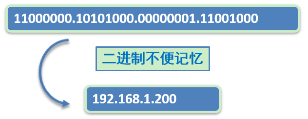
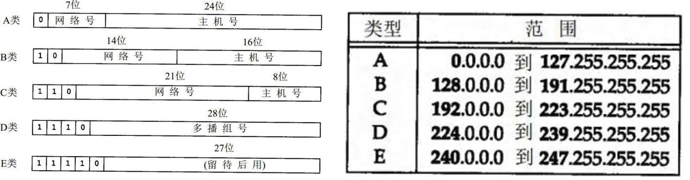
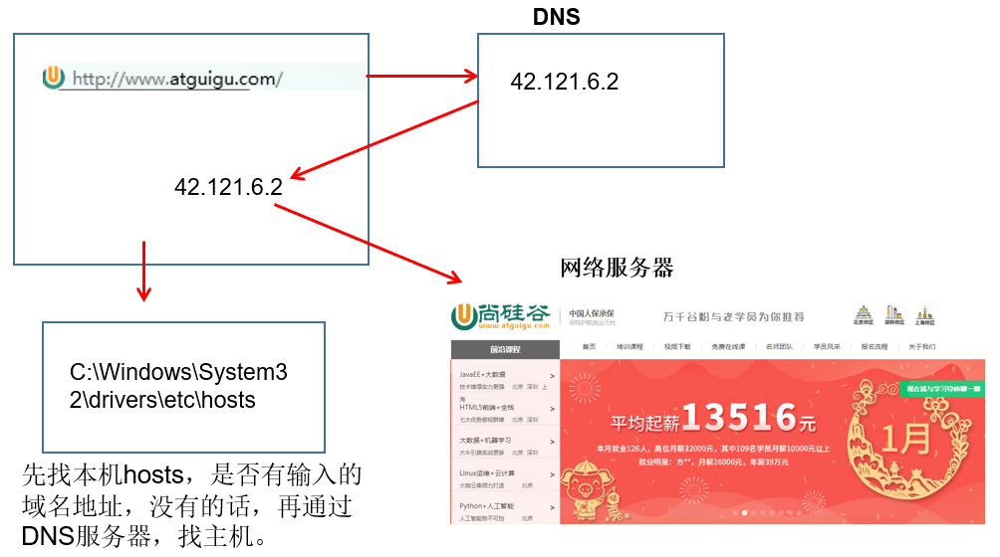
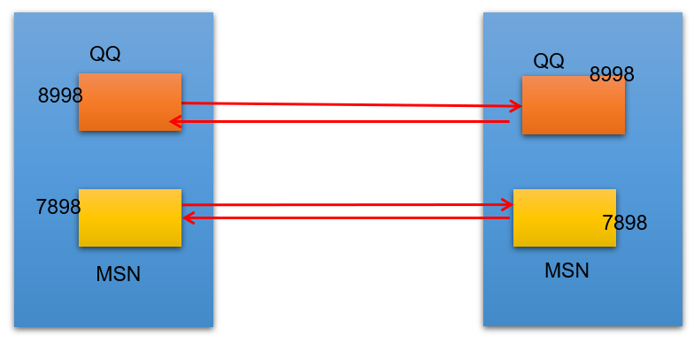
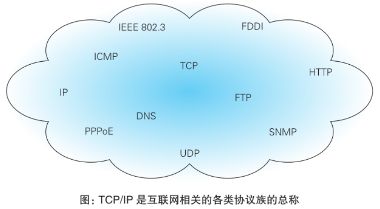
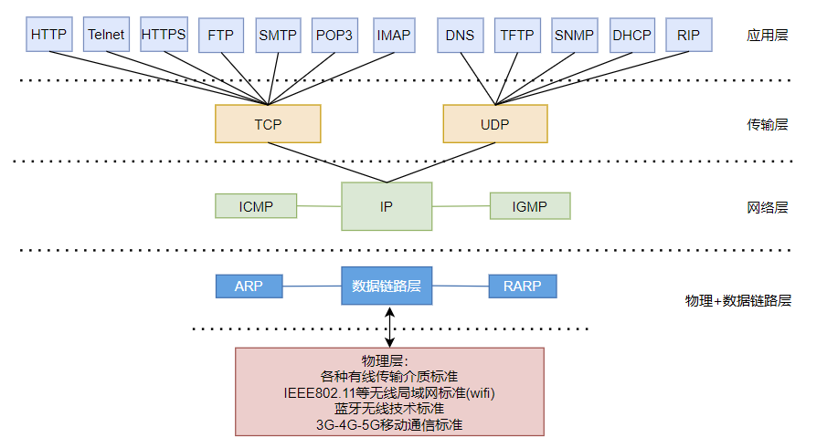

# 网络编程概述

Java是Internet上的语言，它从语言级上提供了对网络应用程序的支持，程序员能够很容易开发常见的网络应用程序。

Java提供的网络类库，可以实现无痛的网络连接，联网的底层细节被隐藏在Java的本机安装系统里，由JVM进行控制。并且Java实现了一个跨平台的网络库，`程序员面对的是一个同一个的网络编程环境`。

## 1、软件架构

* **C/S架构**：全称为Client/Server结构，是指客户端和服务器结构。常见程序有QQ、美团app、360安全卫士等软件。


* **B/S结构**：全称为Browser/Server结构，是指浏览器和服务器结构。常见浏览器有IE、谷歌、火狐等。


两种结构各有优势，但是无论哪种架构，都离不开网络的支持。**网络编程**，就是在一定的协议下，实现两台计算机的通信的程序。

## 2、网络基础

* **计算机网络**：

  把分布在不同地理区域的计算机与专门的外部设备用通信线路互连成一个规模大、功能强的网络系统，从而使众多的计算机可以方便地互相传递信息、共享硬件、软件、数据信息等资源。

* **网络编程的目的**：直接或间接地通过网络协议与其他计算机实现数据交换，进行通讯。

* **网络编程中有三个主要的问题**：

  * 问题1：如何准确地定位网络上一台或多台主机
  * 问题2：如何定位主机上的特定的应用
  * 问题3：找到主机后，如何可靠、高效地进行数据传输


# 网络通信要素

## 1、如何实现网络中的主机互相通信

* 通信双方地址
  * IP
  * 端口号
* 一定的规则：不同的硬件、操作系统之间的通信，所有的这一切都需要一种规则。而我们就把这种规则称为协议，即网络通信协议。

**生活类比**


## 2、通信要素一：IP地址和域名

### 2.1、IP地址

**IP地址：指互联网协议地址（Internet Protocol Address）**，俗称IP。IP地址用来给忘了中的一台计算机设备做唯一的编号。假如我们把“个人电脑”比作“一台电话”的话，那么“IP地址”就相当于“电话号码”。

IP地址分类方式一：

* **`IPv4`**：是一个32位的二进制数，通常被分为4个字节，表示成`a, b, c, d`的形式，以点分`十进制`表示，例如`192.168.65,100`。其中a、b、c、d都是0~255之间的十进制整数。

  * 

  * 这种方式最多可以表示42亿个。其中，30亿都在北美，亚洲4亿，中国2.9亿。2011年初已经用尽。

  * **`IP地址 = 网络地址 + 主机地址`**

    * 网络地址：标识计算机或网络设备所在的网段

    * 主机地址：标识特定主机或网络设备

      

      其中，E类用于科研。

* **`IPv6`**：由于互联网的蓬勃发展，IP地址的需求量越来越大，但是网络地址资源有限，使得IP的分配越来越紧张。

  为了扩大地址空间，拟通过IPv6重新定义地址空间，采用128位地址长度，共16个字节，写成8个无符号整数，每个整数用四个十六进制位表示，数之间用冒号（:）分开。比如：

  `ABCD:EF01:2345:6789:ABCD:EF01:2345:6789`，按保守方法估算IPv6实际可分配的地址，整个地球的每平方面积上仍可分配1000多个地址，这样就解决了网络地址资源数量不够的问题。

**IP地址分类方式之二：**

公网地址（万维网使用）和私有地址（局域网使用）。192.168.开头的就是私有地址，范围即为192.168.0.0 - 192.168.255.255，专门为组织机构内部使用。

**常用命令**：

* 查看本机IP地址，在控制台输入：

```java
ipconfig
```

* 检查网络是否连通，在控制台输入：

```
ping 空格 IP地址
ping 220.181.57.216
```

**特殊的IP地址**：

* 本地回环地址（hostAddress）：`127.0.0.1`
* 本机名（hostName)：`localhost`


### 2.2、域名

Internet上的主机有两种方式表示地址：

* 域名（hostName）：www.atguigu.com
* IP地址（hostAddress)：202.108.35.210

**域名解析**：因为IP地址数字不方便记忆，因此出现了域名。域名容易记忆，当在连接网络时输入一个主机的域名后，域名服务器（DNS，Domain Name System，域名系统）负责将域名转化为IP地址，这样才能和主机建立连接。

简单理解：




## 3、通信要素二：端口号

网络的通信，本质上是两个进程（应用程序）的通信。每台计算机都有很多的进程，那么在网络通信中，如何区分这些进程呢？

如果说**IP地址**可以唯一标识网络中的设备，那么**端口号**就可以唯一标识设备中的进程（应用程序）。

不同的进程，设置不同的端口号。

* **端口号：用两个字节表示的整数，它的取值范围是0~65535。**
  * 公认端口：0~1023。被预先定义的服务通信占用，如：HTTP(80)，FTP（21），TeInet（23）
  * 注册端口：1024~49151。分配给用户进程或应用程序。如Tomcat（8080)，MySQL（3306），Oracle（1521）。
  * 动态/私有端口：49152~65535。

如果端口号被另外一个服务或应用被占用，会导致当前程序启动失败。

也就是说，需要进行通信，就需要知道和对方的哪一个进程进行通信，端口号就是进程的标识符。




## 4、通信要素三：网络通信协议

通过计算机网络可以使多台计算机实现连接，位于同一个网络中的计算机在连接和通信时需要遵守一定的规则，这就好比在道路中行驶的汽车一定要遵守交通规则一样。

* `网络通信协议`：在计算机网络中，这些连接和通信的规则被称为网络通信协议，它对数据的传输格式、传输速率、传输步骤、出错控制等做了统一规定，通信双方必须同时遵守才能完成数据交换。

**新的问题：网络协议涉及内容太多、太复杂。如何解决？**

计算机网络通信涉及内容很多，比如指定源地址和目标地址，加密解密，压缩解压缩，差错控制，流量控制，路由控制，如何实现如此复杂的网络协议呢？`通信协议分层思想`。

在制定协议时，把复杂成分分解成一些简单的成分，再将它们复合起来。最常用的复合方式是层次方式，即**`同层间可以通信、上一层可以调用下一层，而与再下一层不发生关系`**。各层互不影响，利于系统的开发和扩展。

这里有两套参考模型

* OSI参考模型：模型过于理想化，未能在因特网上进行广泛推广
* **TCP/IP参考模型（或TCP/IP协议）**：事实上的国际标准


上图中，OSI参考模型过于理想化，未能广泛推广；TCP/IP协议是事实上的`国际标准`。

* **TCP/IP协议**：传输控制协议/因特网互连协议，TCP/IP以其中两个主要协议：传输控制协议（TCP）和网络互联协议（IP）而得名，实际上是一组协议，包括多个具有不同功能且互为关联的协议。是Internet最基本、最广泛的协议。



**TCP/IP协议中的四层介绍：**

* **`应用层`**：应用层决定了向用户提供应用服务时通信的活动。主要协议有：HTTP协议、FTP协议、SNMP（简单网络管理协议）、SMTP（简单邮件传输协议）和POP3（Post Office Protocol3，邮局协议的第三个版本）等。
* **`传输层`**：主要使网络程序进行通信，在进行网络通信时，可以采用TCP协议，也可以采用UDP协议。TCP（Transmission Control Protocol）协议，即传输控制协议，是一种面向连接的、可靠的、基于字节流的传输层通信协议。UDP（User Datagram Protocol，用户数据报协议）：是一种无连接的传输层协议、提供面向事务的简单不可靠的数据传送服务。
* **`网络层`**：网络层是整个TCP/IP协议的核心，支持网间互连的数据通信。它主要用于将传输的数据进行分组，将分组数据发送到目标计算机或者网络。而IP协议是一种非常重要的协议。IP（internet protocal）又称为互联网协议。IP的责任就是把数据从源传送到目的地。它在源地址和目的地址之间传送一种称之为数据包的东西，它还提供对数据大小的重新组装功能，以适应不同网络对包大小的要求。

* **`物理+数据链路层`**：链路层是用于定义物理传输通道，通常是对某些网络连接设备的驱动协议，例如针对光纤、网线提供的驱动。




## 5、 谈传输层协议：TCP与UDP协议

通信的协议还是比较复杂的，`java.net` 包中包含的类和接口，它们提供低层次的通信细节。我们可以直接使用这些类和接口，来专注于网络程序开发，而不用考虑通信的细节。

`java.net` 包中提供了两种常见的网络协议的支持：

- **UDP**：用户数据报协议(User Datagram Protocol)。
- **TCP**：传输控制协议 (Transmission Control Protocol)。

### 5.1 TCP协议与UDP协议

**TCP协议：**

- TCP协议进行通信的两个应用进程：客户端、服务端。
- 使用TCP协议前，须先`建立TCP连接`，形成基于字节流的传输数据通道
- 传输前，采用“三次握手”方式，点对点通信，是`可靠的`
  - TCP协议使用`重发机制`，当一个通信实体发送一个消息给另一个通信实体后，需要收到另一个通信实体确认信息，如果没有收到另一个通信实体确认信息，则会再次重复刚才发送的消息。
- 在连接中可进行`大数据量的传输`
- 传输完毕，需`释放已建立的连接，效率低`

**UDP协议：**

- UDP协议进行通信的两个应用进程：发送端、接收端。
- 将数据、源、目的封装成数据包（传输的基本单位），`不需要建立连接`
- 发送不管对方是否准备好，接收方收到也不确认，不能保证数据的完整性，故是`不可靠的`
- 每个数据报的大小限制在`64K`内
- 发送数据结束时`无需释放资源，开销小，通信效率高`
- 适用场景：音频、视频和普通数据的传输。例如视频会议

> TCP生活案例：打电话
>
> UDP生活案例：发送短信、发电报

### 5.2 三次握手

TCP协议中，在发送数据的准备阶段，客户端与服务器之间的三次交互，以保证连接的可靠。

- 第一次握手，客户端向服务器端发起TCP连接的请求
- 第二次握手，服务器端发送针对客户端TCP连接请求的确认
- 第三次握手，客户端发送确认的确认


> 1、客户端会随机一个初始序列号seq=x，设置SYN=1 ，表示这是SYN握手报文。然后就可以把这个 SYN 报文发送给服务端了，表示向服务端发起连接，之后客户端处于`同步已发送`状态。
>
> 2、服务端收到客户端的 SYN 报文后，也随机一个初始序列号(seq=y)，设置ack=x+1，表示收到了客户端的x之前的数据，希望客户端下次发送的数据从x+1开始。
> 设置 SYN=1 和 ACK=1。表示这是一个SYN握手和ACK确认应答报文。最后把该报文发给客户端，该报文也不包含应用层数据，之后服务端处于`同步已接收`状态。
>
> 3、客户端收到服务端报文后，还要向服务端回应最后一个应答报文，将ACK置为 1 ，表示这是一个应答报文
> ack=y+1 ，表示收到了服务器的y之前的数据，希望服务器下次发送的数据从y+1开始。
> 最后把报文发送给服务端，这次报文可以携带数据，之后客户端处于 连接已建立 状态。服务器收到客户端的应答报文后，也进入`连接已建立`状态。

完成三次握手，连接建立后，客户端和服务器就可以开始进行数据传输了。由于这种面向连接的特性，TCP协议可以保证传输数据的安全，所以应用十分广泛，例如下载文件、浏览网页等。

### 5.3 四次挥手

TCP协议中，在发送数据结束后，释放连接时需要经过四次挥手。

* 第一次挥手：客户端向服务器端提出结束连接，`让服务器做最后的准备工作`。此时，客户端处于半关闭状态，即表示不再向服务器发送数据了，但是还可以接受数据。
* 第二次挥手：服务器接收到客户端释放连接的请求后，`会将最后的数据发给客户端`。并告知上层的应用进程不再接收数据。
* 第三次挥手：服务器发送完数据后，会给客户端`发送一个释放连接的报文`。那么客户端接收后就知道可以正式释放连接了。
* 第四次挥手：客户端接收到服务器最后的释放连接报文后，要`回复一个彻底断开的报文`。这样服务器收到后才会彻底释放连接。这里客户端，发送完最后的报文后，会等待2MSL，因为有可能服务器没有收到最后的报文，那么服务器迟迟没收到，就会再次给客户端发送释放连接的报文，此时客户端在等待时间范围内接收到，会重新发送最后的报文，并重新计时。如果等待2MSL后，没有收到，那么彻底断开。


> 1、客户端打算断开连接，向服务器发送FIN报文(FIN标记位被设置为1，1表示为FIN，0表示不是)，FIN报文中会指定一个序列号，之后客户端进入FIN_WAIT_1状态。也就是客户端发出连接释放报文段(FIN报文)，指定序列号seq = u，主动关闭TCP连接，等待服务器的确认。
>
> 2、服务器收到连接释放报文段(FIN报文)后，就向客户端发送ACK应答报文，以客户端的FIN报文的序列号 seq+1 作为ACK应答报文段的确认序列号ack = seq+1 = u + 1。接着服务器进入CLOSE_WAIT(等待关闭)状态，此时的TCP处于半关闭状态(下面会说什么是半关闭状态)，客户端到服务器的连接释放。客户端收到来自服务器的ACK应答报文段后，进入FIN_WAIT_2状态。
>
> 3、服务器也打算断开连接，向客户端发送连接释放(FIN)报文段，之后服务器进入LASK_ACK(最后确认)状态，等待客户端的确认。服务器的连接释放(FIN)报文段的FIN=1，ACK=1，序列号seq=m，确认序列号ack=u+1。
>
> 4、客户端收到来自服务器的连接释放(FIN)报文段后，会向服务器发送一个ACK应答报文段，以连接释放(FIN)报文段的确认序号 ack 作为ACK应答报文段的序列号 seq，以连接释放(FIN)报文段的序列号 seq+1作为确认序号ack。
>
> 之后客户端进入TIME_WAIT(时间等待)状态，服务器收到ACK应答报文段后，服务器就进入CLOSE(关闭)状态，到此服务器的连接已经完成关闭。客户端处于TIME_WAIT状态时，此时的TCP还未释放掉，需要等待2MSL后，客户端才进入CLOSE状态。


# 网络编程API

## 1、InetAddress类

**作用：**

`InetAddress类的一个实例，就代表一个具体的ip地址。`

它有两个子类：`Inet4Address`、`Inet6Address`。

**创建对象方式**：

InetAddress类没有提供公共的构造器，而是提供了如下几个静态方法来获取InetAddress实例：

* **`public static InetAddress getLocalHost()`**：获取本机的ip地址对应的InetAddress对象。
* **`public static InetAddress getByName(String host)`**：根据String类型的ip地址或对应的域名来获取InetAddress对象。

案例：

```java
@Test
public void test() throws UnknownHostException {
    InetAddress localHost = InetAddress.getLocalHost();
    System.out.println(localHost);
    //根据指定的ip地址或者域名获取对应的InetAddress对象
    InetAddress inet = InetAddress.getByName("www.baidu.com");
    System.out.println(inet);
}
```

打印结果：


**常用方法**：

* **`public String getHostAddress()`**：返回InetAddress对象所表示的IP地址字符串
* **`public String getHostName()`**：获取此IP地址的主机名，有域名则返回域名，没有则返回ip地址
* **`public boolean isReachable(int timeout)`**：测试是否可以达到该地址，timeout设置的是超时时长

案例：

```java
@Test
public void test2() throws IOException {
    InetAddress baiDu = InetAddress.getByName("www.baidu.com");
    InetAddress localHost = InetAddress.getLocalHost();

    System.out.println(baiDu.getHostAddress());
    System.out.println(baiDu.getHostName());
    System.out.println(baiDu.isReachable(300));

    System.out.println("********************************");

    System.out.println(localHost.getHostAddress());
    System.out.println(localHost.getHostName());
    System.out.println(localHost.isReachable(300));
}
```

打印结果：


