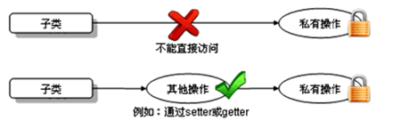
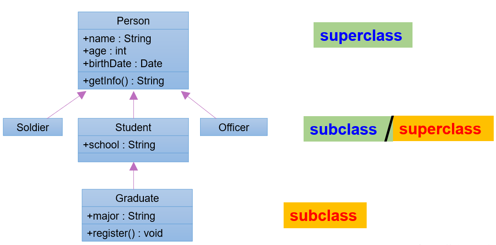

## this关键字

### this是什么？

* 它在方法（准确的说是实例方法或非static的方法）内部使用，表示调用该方法的对象
* 它在构造器内部使用，表示该构造器正在初始化的对象。
* this可以调用的结构：成员变量、方法和构造器。

### 什么时候使用this？

#### 实例方法或构造器中使用表示当前的对象

在实例方法或构造器中，如果使用当前类的成员变量或成员方法，可以在其前面添加this，增强程序的可读性。不过，可以省略this。

但是，当形参与成员变量同名时，如果在方法内或构造器内需要使用成员变量，必须添加this来表明该变量是类的成员变量。即：我们可以用this来区分成员变量或局部变量。例如：


另外，使用this访问属性和方法时，如果在本类中未找到，会从父类中查找。这个在继承中会讲到。

#### 同一个类中构造器相互调用

this可以作为一个类中构造器相互调用的特殊格式。

* this()：调用本类的无参构造器。
* this(实参列表)：调用本类的有参构造器。

```java
public class Student {
    private String name;
    private int age;

    // 无参构造
    public Student() {
//        this("",18);//调用本类有参构造器
    }

    // 有参构造1
    public Student(String name) {
        this();//调用本类无参构造器
        this.name = name;
    }
    // 有参构造2
    public Student(String name,int age){
        this(name);//调用本类中有一个String参数的构造器1
        this.age = age;
    }
}
```

注意不能进行递归调用。比如，调用自身构造器，此时会无限循环地进行递归，无法结束。

那么，可以推出一个类中声明了n个构造器，最多有n - 1个构造器中使用了"this(形参列表)"。

**this(形参列表)调用构造器只能声明在构造器首行。**

那么可以推出，一**个构造器中只能有一个this(形参列表)的语句调用其他构造器**，原因是必须放在首行，如果有两个，第二个不会在首行。


### 注意：

* **`this关键字不能用在静态的方法中`**，原因是因为this在方法中表示是调用该方法的对象，而static的方法是在对象创建之前就已经被加载了，此时对象并没有被创建出来，也就不能被静态方法调用。

例如：

```java
public class ThisKeywordTest {
    public static int age = 1;
    int id = 2;
    public static void method(){
        this.age;//报错
        this.id;//报错
    }
}
```

* 同理，也**`不能使用this`**在方法中去**`调用类中的静态属性`**，原因也是因为this表示的是当前对象，而静态属性在对象创建之前就会加载。

* 如果要在方法中去调用静态属性或者静态方法，直接使用类名进行调用即可。
* 为了防止死循环，当前构造器不能使用this(形参列表)去调用自己。
* 因为this(形参列表)必须声明在当前构造器的首行，所以**`每个构造器中只能有一个this(形参列表)的方式去调用其他的构造器`**。例如：

```
ThisKeyword(String name, int age){
}

ThisKeyword(){
}
ThisKeyword(String name, int age, String email){
	this(email, age);
	this();//报错，原因是this()调用必须是构造器的第一条语句
}
```


---

## 面向对象特征二：继承

> **子类继承父类，会将除构造器以外的所有东西全部继承，包括private属性与方法，只是由于private只在本类中可见，所以子类中不可见罢了。**

### 继承的好处

* 继承的出现减少了代码冗余，提高了代码的复用性。
* 继承的出现，更有利于功能的扩展。
* 继承的出现让类与类之间产生了`is-a`的关系，为多态的使用提供了前提。
  * 继承描述事物之间的所属关系，这种关系是`is-a`的关系。可见，父类更通用、更一般，子类更具体。

> 注意：不要仅为了获取其他类中的某个功能去继承，继承之间应当有父与子的关系。

### 继承的语法

#### 继承中的语法格式

通过`extends`关键字，可以声明一个类B继承另一个类A，定义格式如下：

```java
[修饰符] class 类A {
	...
}

[修饰符] class 类B extends 类A {
	...
}
```

#### 继承中的基本概念

类B，称为子类、派生类、SubClass

类A，称为父类、超类、基类、SuperClass

### 继承性的细节说明

#### 1、子类会继承父类所有的实例变量和实例方法

从类的定义来看，

* 当子类对象被创建时，在堆中给对象申请内存时，就要看子类和父类都声明了什么实例变量，这些实例变量都要分配内存。
* 当子类对象调用方法时，编译器会现在子类模板中看该类是否有这个方法，如果没有找到，会看它的父类甚至父类的父类是否声明了这个方法，遵循从下往上找的顺序，找到了就停止，一直到根父类都没有找到，就会报编译错误。

所以继承意味着子类的对象除了看子类的类模板还要看父类的类模板。


#### 2、子类不能直接访问父类中私有的(private)的成员变量和方法

子类虽会继承父类私有(private)的成员变量，但子类不能对继承的私有成员变量直接进行访问，可通过继承的get/set方法进行访问。如图所示：




#### 3、Java支持多层继承（继承体系）



#### 问：子类能够继承父类的private属性或方法吗？

> **答：子类继承父类，子类拥有了父类的所有属性和方法。**

程序验证：父类的私有属性和方法子类是无法直接访问的。当然私有属性可以通过public修饰的getter和setter方法访问达到的，但是私有方法不行。

假设：子类不能够继承父类的私有属性和方法

那么：分析内存后，会发现:

当一个子类被实例化的时候，***默认会先调用父类的构造方法对父类进行初始化***，即在内存中创建一个父类对象，然后再在父类对象的外部放上子类独有的属性，两者合起来成为一个子类的对象。

所以：子类继承了父类的所有属性和方法或子类拥有父类的所有属性和方法是对的，只不过父类的私有属性和方法，子类是无法直接访问到的。即只是拥有，但是无法使用。

子类中无法访问到父类中private类型的属性与方法（如果子类在其他包中，同样无法访问父类中缺省类型的属性与方法），但是可以通过其他可以查询到的方法（例如public类型的）去访问private类型的属性与方法。

同样地，因为无法访问到父类中的private类型的方法，那么子类中也无法对其进行重写。


---

## 方法的重写

父类的所有方法子类都关于继承，但是当某个方法被继承到子类之后，子类觉得父类原来的实现不适合于当前的类，该怎么办呢？子类可以对从父类中继承来的方法进行改造，我们称为方法的重写（override、overwrite）。也称为方法的重置、覆盖。

**在程序执行时，子类的方法将覆盖父类的方法。**

#### 案例：

比如新的手机增加来电显示头像的功能，代码如下：

```java
package com.atguigu.inherited.method;

public class Phone {
    public void sendMessage(){
        System.out.println("发短信");
    }
    public void call(){
        System.out.println("打电话");
    }
    public void showNum(){
        System.out.println("来电显示号码");
    }
}

```

```java
package com.atguigu.inherited.method;

//SmartPhone：智能手机
public class SmartPhone extends Phone{
    //重写父类的来电显示功能的方法
	@Override
    public void showNum(){
        //来电显示姓名和图片功能
        System.out.println("显示来电姓名");
        System.out.println("显示头像");
    }
    //重写父类的通话功能的方法
    @Override
    public void call() {
        System.out.println("语音通话 或 视频通话");
    }
}
```

```java
package com.atguigu.inherited.method;

public class TestOverride {
    public static void main(String[] args) {
        // 创建子类对象
        SmartPhone sp = new SmartPhone();

        // 调用父类继承而来的方法
        sp.call();

        // 调用子类重写的方法
        sp.showNum();
    }
}
```

**@Override使用说明：**

> 写在方法上面，用来检测是不是满足重写方法的要求。这个注解就算不写，只要满足要求，也是正确的方法覆盖重写。建议保留，这样编译器可以帮助我们检测格式，另外也可以让阅读源代码的程序员清晰地知道这是一个重写的方法。


### 方法重写的要求：

1. 子类重写的方法必须和父类被重写的方法具有**`相同的方法名称、参数列表`**。

> ​	如果参数列表不同的话，会被判定与继承来的方法形成重载，而不是重写。所以参数列表一定要相同。

2. 子类重写的方法的返回值类型**`不能大于`**父类被重写的方法的返回值类型。（例如：Student < Person）

   > 注意：如果返回值类型是基本数据类型或void，那么必须是相同的。

3. 子类重写的方法使用的权限**`不能小于`**父类被重写的方法的范围权限。（public > protected > 缺省 > private）

   > 注意：①父类私有方法不能重写 ②跨包的父类缺省的方法也不能重写

4. 子类方法抛出的异常**`不能大于`**父类被重写方法的异常范围。


此外，子类与父类中同名同参数的方法必须同时声明为非static（即为重写），或者同时声明为static的（不是重写）。因为static方法是属于类的，子类无法覆盖父类的方法。


### 重载与重写的区别

重载：方法名相同，参数列表不同。与返回值类型无关，与权限修饰符无关，与抛出的异常均无关。

重写：在父类与子类之间，方法名相同，参数列表相同。

重写要求子类中重写的方法返回值类型范围不得大于父类中的方法（如果是基础数据类型或者void要求相同）。子类中重写的方法权限修饰符范围不得小于父类方法的权限修饰符。子类中重写的方法抛出的异常类型范围不得大于父类方法抛出的异常类型范围。

---

## super关键字

> **子父类同名的方法会造成方法的重写，即方法的覆盖，在子类中就找不到父类中同名同参的方法了。**
>
> **但是对于同名属性来说就不会发生覆盖，子父类中可以同时存在同名的属性，子类在使用时，使用super.调用父类中同名的属性，默认情况下调用的是本类中的属性。**

### super的理解

在Java类中使用super来调用父类中的指定操作：

* super可用于访问父类中定义的属性
* super可用于调用父类中定义的成员方法
* super可用于在子类构造器中调用父类的构造器

注意：

* 尤其当子父类出现同名成员时，可以用super表明调用的是父类中的成员
* super的追溯不仅限于直接父类，当在直接父类中找不到相应的实例时，会一层一层地往上寻找，找到了就结束
* super和this用法很像，this代表本类对象的引用，super代表父类的内存空间标识

### super的使用场景

#### 1、子类中调用父类被重写的方法

* 如果子类中没有重写父类的方法，只要权限修饰符允许，在子类中可以直接调用父类的方法；
* 如果子类重写了父类的方法，在子类中需要通过**`super.`**才能调用父类被重写的方法，否则默认调用的是子类重写的方法。

举例：

```java
package com.atguigu.inherited.method;

public class Phone {
    public void sendMessage(){
        System.out.println("发短信");
    }
    public void call(){
        System.out.println("打电话");
    }
    public void showNum(){
        System.out.println("来电显示号码");
    }
}

//smartphone：智能手机
public class SmartPhone extends Phone{
    //重写父类的来电显示功能的方法
    public void showNum(){
        //来电显示姓名和图片功能
        System.out.println("显示来电姓名");
        System.out.println("显示头像");

        //保留父类来电显示号码的功能
        super.showNum();//此处必须加super.，否则就是无限递归，那么就会栈内存溢出
    }
}
```

总结：

* **方法前面没有super.和this.：**
  * 先从子类找匹配方法，如果没有，再从直接父类找，再没有，继续往上追溯
* **方法前面没有this.：**
  * 先从子类找匹配方法，如果没有，再从直接父类找，继续往上追溯
* **方法前面有super.：**
  * 从当前子类的直接父类找，如果没有，继续往上追溯

#### 2、子类中调用父类中同名的成员变量

* 如果实例变量与局部变量重名，可以在实例变量前面加this.进行区别
* 如果子类实例变量和父类实例变量重名，并且父类的该实例变量在子类仍然可见，在子类要访问父类声明的实例变量需要在父类变量前面加super.，否则默认访问的是子类自己声明的实例变量。
* 如果父子类实例变量没有重名，只要权限修饰符允许，在子类中完全可以直接访问父类中声明的实例变量，也可以用this.实例方法，也可以用super.实例变量访问

案例：

​    

```java
class Father{
	int a = 10;
	int b = 11;
}
class Son extends Father{
	int a = 20;
    
    public void test(){
		//子类与父类的属性同名，子类对象中就有两个a
		System.out.println("子类的a：" + a);//20  先找局部变量找，没有再从本类成员变量找
        System.out.println("子类的a：" + this.a);//20   先从本类成员变量找
        System.out.println("父类的a：" + super.a);//10    直接从父类成员变量找
		
		//子类与父类的属性不同名，是同一个b
		System.out.println("b = " + b);//11  先找局部变量找，没有再从本类成员变量找，没有再从父类找
		System.out.println("b = " + this.b);//11   先从本类成员变量找，没有再从父类找
		System.out.println("b = " + super.b);//11  直接从父类局部变量找
	}
	
	public void method(int a, int b){
		//子类与父类的属性同名，子类对象中就有两个成员变量a，此时方法中还有一个局部变量a		
		System.out.println("局部变量的a：" + a);//30  先找局部变量
        System.out.println("子类的a：" + this.a);//20  先从本类成员变量找
        System.out.println("父类的a：" + super.a);//10  直接从父类成员变量找

        System.out.println("b = " + b);//13  先找局部变量
		System.out.println("b = " + this.b);//11  先从本类成员变量找
		System.out.println("b = " + super.b);//11  直接从父类局部变量找
    }
}
class Test{
    public static void main(String[] args){
        Son son = new Son();
		son.test();
		son.method(30,13);  
    }
}
```

总结：

* **变量前面没有super.和this.：**
  * 在构造器、代码块、方法中如果出现使用某个变量，先查看是否是当前块声明的局部变量。
  * 如果不是局部变量，先从当前执行代码的本类去找成员变量。
  * 如果从当前执行代码的本类中没有找到，会往上找父类声明的成员变量（权限修饰符允许在子类中访问的）
* **变量前面有this.**：
  * 通过this找成员变量时，先从当前执行代码的本类去找成员变量。
  * 如果从当前执行代码的本类中没有找到，会往上找父类声明的成员变量（权限修饰符允许在子类中访问的）
* **变量前面有super.**：
  * 通过super.找成员变量，直接从当前执行代码的直接父类去找成员变量（权限修饰符允许在子类中访问的）
  * 如果直接父类没有，就去父类的父类中找（权限修饰符允许在子类中访问的）

**<font color="red">特别说明：应该避免子类声明和父类重名的成员变量</font>**

在阿里的开发规范等文档中都做出明确说明：


#### 3、子类构造器调用父类构造器

1. 子类继承父类时，会继承除构造器以外的所有东西。只能通过<font color="red">**super(参数列表)**</font>的方式调用父类指定的构造器。

2. 规定：`super(参数列表)`，必须声明在构造器的首行。

3. 之前说过，如果需要在构造器中调用其他重载的构造器的话，this(参数列表)必须放在首行。

   集合2，结论：在构造器的首行，`this(参数列表)`和`super(参数列表)`只能二选一。

4. 如果在子类构造器的首行既没有使用this(参数列表)，也没有显式地调用super(参数列表)，<font color="red" style="background: rgb(255,212,59)">**那么构造器默认会去调用一个super()，即调用父类中空参的构造器**</font>。

5. 由3和4得出结论：子类的任何一个构造器中，要么会调用本类中重载的构造器，要么会调用父类的构造器。

   只能是这两种情况之一。

6. 由5可以得出：一个类中声明有n个构造器，最多有n-1个构造器中使用了”this(参数列表)"，剩下的那个一定使用了super(参数列表)

> 开发中常见的错误：
>
> **如果子类构造器既未显式调用父类或本类的构造器，且父类中没有空参的构造器，则编译出错。**

**案例：**

情景一：

```java
class A{

}
class B extends A{

}

class Test{
    public static void main(String[] args){
        B b = new B();
        //A类和B类都是默认有一个无参构造，B类的默认无参构造中还会默认调用A类的默认无参构造
        //但是因为都是默认的，没有打印语句，看不出来
    }
}
```

情景2：

```java
class A{
	A(){
		System.out.println("A类无参构造器");
	}
}
class B extends A{

}
class Test{
    public static void main(String[] args){
        B b = new B();
        //A类显示声明一个无参构造，
		//B类默认有一个无参构造，
		//B类的默认无参构造中会默认调用A类的无参构造
        //可以看到会输出“A类无参构造器"
    }
}
```

情景3：

```java
class A{
	A(){
		System.out.println("A类无参构造器");
	}
}
class B extends A{
	B(){
		System.out.println("B类无参构造器");
	}
}
class Test{
    public static void main(String[] args){
        B b = new B();
        //A类显示声明一个无参构造，
		//B类显示声明一个无参构造，        
		//B类的无参构造中虽然没有写super()，但是仍然会默认调用A类的无参构造
        //可以看到会输出“A类无参构造器"和"B类无参构造器")
    }
}
```

情景4：

```java
class A{
	A(){
		System.out.println("A类无参构造器");
	}
}
class B extends A{
	B(){
        super();
		System.out.println("B类无参构造器");
	}
}
class Test{
    public static void main(String[] args){
        B b = new B();
        //A类显示声明一个无参构造，
		//B类显示声明一个无参构造，        
		//B类的无参构造中明确写了super()，表示调用A类的无参构造
        //可以看到会输出“A类无参构造器"和"B类无参构造器")
    }
}
```

情景5：

```java
class A{
	A(int a){
		System.out.println("A类有参构造器");
	}
}
class B extends A{
	B(){
		System.out.println("B类无参构造器");
	}
}
class Test05{
    public static void main(String[] args){
        B b = new B();
        //A类显示声明一个有参构造，没有写无参构造，那么A类就没有无参构造了
		//B类显示声明一个无参构造，        
		//B类的无参构造没有写super(...)，表示默认调用A类的无参构造
        //编译报错，因为A类没有无参构造
    }
}
```


情景6：

```java
class A{
	A(int a){
		System.out.println("A类有参构造器");
	}
}
class B extends A{
	B(){
		super();
		System.out.println("B类无参构造器");
	}
}
class Test06{
    public static void main(String[] args){
        B b = new B();
        //A类显示声明一个有参构造，没有写无参构造，那么A类就没有无参构造了
		//B类显示声明一个无参构造，        
		//B类的无参构造明确写super()，表示调用A类的无参构造
        //编译报错，因为A类没有无参构造
    }
}
```


情景7：

```java
class A{
	A(int a){
		System.out.println("A类有参构造器");
	}
}
class B extends A{
	B(int a){
		super(a);
		System.out.println("B类有参构造器");
	}
}
class Test07{
    public static void main(String[] args){
        B b = new B(10);
        //A类显示声明一个有参构造，没有写无参构造，那么A类就没有无参构造了
		//B类显示声明一个有参构造，        
		//B类的有参构造明确写super(a)，表示调用A类的有参构造
        //会打印“A类有参构造器"和"B类有参构造器"
    }
}
```

情景8：

```java
class A{
	A(int a){
		System.out.println("A类有参构造器");
	}
}
class B extends A{
	B(int a){
		super(a);
		System.out.println("B类有参构造器");
	}
}
class Test07{
    public static void main(String[] args){
        B b = new B(10);
        //A类显示声明一个有参构造，没有写无参构造，那么A类就没有无参构造了
		//B类显示声明一个有参构造，        
		//B类的有参构造明确写super(a)，表示调用A类的有参构造
        //会打印“A类有参构造器"和"B类有参构造器"
    }
}
```


### this与super总结

#### 1、this和super的含义

this：当前对象

* 在构造器和非静态代码块中，表示正在new的对象
* 在实例方法中，表示调用当前方法的对象

super：引用父类声明的成员

#### 2、this和super的使用格式

- this
  - this.成员变量：表示当前对象的某个成员变量，而不是局部变量
  - this.成员方法：表示当前对象的某个成员方法，完全可以省略this.
  - this()或this(实参列表)：调用另一个构造器协助当前对象的实例化，只能在构造器首行，只会找本类的构造器，找不到就报错
- super
  - super.成员变量：表示当前对象的某个成员变量，该成员变量在父类中声明的
  - super.成员方法：表示当前对象的某个成员方法，该成员方法在父类中声明的
  - super()或super(实参列表)：调用父类的构造器协助当前对象的实例化，只能在构造器首行，只会找直接父类的对应构造器，找不到就报错


#### **子父类中有同名的属性特殊情况：**

1. 方法的重写意味着**覆盖**，在子类中就不会再有被重写的方法能够被调用，<font color="red">**<u>子类中被调用的同名方法是子类重写后的方法</u>**</font>。

2. 对于同名属性来说则不同：

   属性不会被重写，就算有同名的属性也不会出现覆盖的情况，父类中的同名属性依旧是存在的，<font color="red">**<u>使用父类中的方法访问的同名属性是父类中的属性</u>**</font>。

   如果父类中的方法访问了父类中的属性，并且子类中没有对该方法重写，使用子类对象去调用的时候，访问的依旧是父类中的属性，而不是子类中同名的属性。

**案例1：**

父子类：

```java
class Parent{
    private String name = "Parent";
    public String getName() {
        return name;
    }
}
class Son extends Parent{
	private String name = "Son";
	public void test(){
        System.out.println(this.getName());
        System.out.println(super.getName());
    }
}
```

测试类：

```java
public class SuperTest {
    @Test
    public void test(){
        Son son  = new Son();
        son.test();
    }
}
```

输出结果：


这里的this.或者super.并不会影响结果，原因是子类中并没有去声明getName()方法，那么无论this.还是super.都会去Parent类中寻找getName()方法。

并且由于属性不会被覆盖，在父类中使用的getName()方法中访问的name属性根据就近原则实际上是父类中的name属性。


**案例2：**

父子类：

```java
class Parent{
    public void method(){
        System.out.println("父类中的method方法");
    }

    public void print(){
        method();
    }
}

class Son extends Parent{
    public void method(){
        System.out.println("子类中的method方法");
    }
}
```

测试类：

```java
public class SuperTest {
    @Test
    public void test(){
        Son son  = new Son();
        son.print();
    }
}
```

运行结果：


这里使用子类引用调用了继承于父类的print()方法，但是为什么这里实际上调用的method()方法却是子类中的呢？

原因就在于方法的重写，会覆盖掉原本父类中的被重写方法，子类中就找到了继承来的method()方法，所以使用子类对象调用的print()方法实际上调用的是重写的method()方法。


---

## 子类对象实例化全过程

举例：

```java
class Creature {
    public Creature() {
        System.out.println("Creature无参数的构造器");
	}
}
class Animal extends Creature {
    public Animal(String name) {
        System.out.println("Animal带一个参数的构造器，该动物的name为" + name);
    }
    public Animal(String name, int age) {
        this(name);
        System.out.println("Animal带两个参数的构造器，其age为" + age);
	}
}
public class Dog extends Animal {
    public Dog() {
        super("汪汪队阿奇", 3);
        System.out.println("Dog无参数的构造器");
    }
    public static void main(String[] args) {
        new Dog();
	}
}
```

然后去创建一个Dog类

```java
Dog dog = new Dog("小花","小红");	
```


> **当一个子类被实例化的时候，默认会先调用父类的构造方法对父类进行初始化，即在内存中创建一个父类对象，然后再父类对象的外部放上子类独有的属性，两者合起来成为一个子类的对象。即实际上只会去创建一个对象、**

在本例中，先会去创建Object类对象，然后创建Createure类中的实例，加上Createure类信息，然后再加上Animal类信息，最后加上Dog类的信息。

总结：

1. 从结果的角度来看，体现为类的继承性

   当我们创建子类对象后，子类对象就获取了其父类中声明的所有属性和方法，在权限允许的情况下，可以直接调用。

2. 从过程角度来看：

   当我们通过子类的构造器创建对象时，子类的构造器一定会直接或间接的调用到父类的构造器，而其父类的构造器同样会直接或间接的调用到其父类的父类构造器......直到调用了Object类中的构造器为止。

   正因为我们调用过子类所有的父类的构造器，所以我们就会将父类中声明的属性、方法加载到内存汇总，供子类的对象使用。


问题：在创建子类对象的过程中，一定会调用父类中的构造器吗？

答：是的！


问题：创建子类对象时，内存中有多少个对象？

答：只有一个对象，即为当前new后面构造器对应的类的对象。


## 面向对象特征三：多态

### 多态的形式和体现

#### 1、对象的多态性

多态性，是面向对象中最重要的概念，在Java中的体现：

**对象的多态性：父类的引用指向子类的对象。**

格式：(父类类型：指子类继承的父类类型，或者实现的接口类型)

```java
父类类型 变量名 = 子类对象;
```

举例：

```java
Person p = new Student();

Object o = new Person();//Object类型的变量o，指向Person类型的对象

o = new Student();//Object类型的变量o，指向Student类型对象
```

对象的多态：在Java中，子类的对象可以代替父类的对象使用。所以，一个引用类型变量可能指向多种不同类型的对象。

#### 2、多态的理解

Java引用变量有两个类型：**`编译时类型`**和**`运行时类型`**。编译时类型由`声明该变量时使用的类型`决定，运行时类型由`实际赋给该变量的对象`决定。简称：

**编译时看左边；运行时看右边。**

* 若编译时类型和运行时类型不一致，就体现了对象的多态性（Polymorphism)
* 多态情况下：
  * “看左边”：看的是父类的引用（父类中不具备子类特有的方法）
  * “看右边”：看的是子类的对象（实际运行的是子类重写父类的方法）

多态的使用前提是：①类的继承关系 ②方法的重写


**对于多态的理解：**

父类引用指向了子类的对象。


内存中实际上存储的是子类对象，包含了继承而来的属性和方法，以及自身独有的属性和独有的方法，子父类有同名的方法会被重写覆盖。

由于使用了是父类的引用，所以编译器在编译期间，会去判断父类中是否有该方法或该属性，如果有才能够使用，如果没有，在编译时就会报错。

若该方法已被覆盖，在调用时，因为内存中存储的是重写后的方法，所以调用的也是子类重写后的方法。

对于同名属性来说，因为不存在重写的说法，同名的属性依旧是存在于内存中的，在使用对象进行调用时，由于该引用类型是父类，所以访问的属性依旧是父类的属性。

#### 3、案例：

```java
package com.atguigu.polymorphism.grammar;

public class Pet {
    private String nickname; //昵称

    public String getNickname() {
        return nickname;
    }

    public void setNickname(String nickname) {
        this.nickname = nickname;
    }

    public void eat(){
        System.out.println(nickname + "吃东西");
    }
}
```

```java
package com.atguigu.polymorphism.grammar;

public class Cat extends Pet {
    //子类重写父类的方法
    @Override
    public void eat() {
        System.out.println("猫咪" + getNickname() + "吃鱼仔");
    }

    //子类扩展的方法
    public void catchMouse() {
        System.out.println("抓老鼠");
    }
}
```

```java
package com.atguigu.polymorphism.grammar;

public class Dog extends Pet {
    //子类重写父类的方法
    @Override
    public void eat() {
        System.out.println("狗子" + getNickname() + "啃骨头");
    }

    //子类扩展的方法
    public void watchHouse() {
        System.out.println("看家");
    }
}
```

**1、方法内局部变量的赋值体现多态**

```java
package com.atguigu.polymorphism.grammar;

public class TestPet {
    public static void main(String[] args) {
        //多态引用
        Pet pet = new Dog();
        pet.setNickname("小白");

        //多态的表现形式
        /*
        编译时看父类：只能调用父类声明的方法，不能调用子类扩展的方法；
        运行时，看“子类”，如果子类重写了方法，一定是执行子类重写的方法体；
         */
        pet.eat();//运行时执行子类Dog重写的方法
//      pet.watchHouse();//不能调用Dog子类扩展的方法

        pet = new Cat();
        pet.setNickname("雪球");
        pet.eat();//运行时执行子类Cat重写的方法
    }
}
```

**2、方法的形参声明体现多态**

```java
package com.atguigu.polymorphism.grammar;

public class Person{
    private Pet pet;
    public void adopt(Pet pet) {//形参是父类类型，实参是子类对象
        this.pet = pet;
    }
    public void feed(){
        pet.eat();//pet实际引用的对象类型不同，执行的eat方法也不同
    }
}
```

```java
package com.atguigu.polymorphism.grammar;

public class TestPerson {
    public static void main(String[] args) {
        Person person = new Person();

        person.adopt(new Dog());//实参是dog子类对象，形参是父类Pet类型
        person.feed();

        person.adopt(new Cat());//实参是cat子类对象，形参是父类Pet类型
        person.feed();
    }
}
```

**3、方法返回值类型体现多态**

```java
package com.atguigu.polymorphism.grammar;

public class PetShop {
    //返回值类型是父类类型，实际返回的是子类对象
    public Pet sale(String type){
        switch (type){
            case "Dog":
                return new Dog();
            case "Cat":
                return new Cat();
        }
        return null;
    }
}
```

```java
package com.atguigu.polymorphism.grammar;

public class TestPetShop {
    public static void main(String[] args) {
        PetShop shop = new PetShop();

        Pet dog = shop.sale("Dog");
        dog.setNickname("小白");
        dog.eat();

        Pet cat = shop.sale("Cat");
        cat.setNickname("雪球");
        cat.eat();
    }
}
```

### 为什么需要多态性？

开发中，有时我们在设计一个数组、或一个成员变量、或一个方法的形参、返回值类型时，无法确定它具体的类型，只能确定它是某个系列的类型。

案例：

（1）声明一个Dog类，包含public void eat()方法，输出“狗啃骨头”

（2）声明一个Cat类，包含public void eat()方法，输出“猫吃鱼仔”

（3）声明一个Person类，功能如下：

- 包含宠物属性
- 包含领养宠物方法 public void adopt(宠物类型Pet)
- 包含喂宠物吃东西的方法 public void feed()，实现为调用宠物对象.eat()方法

```java
public class Dog {
    public void eat(){
        System.out.println("狗啃骨头");
    }
}
```

```java
public class Cat {
    public void eat(){
        System.out.println("猫吃鱼仔");
    }
}
```

```java
public class Person {
    private Dog dog;

    //adopt：领养
    public void adopt(Dog dog){
        this.dog = dog;
    }

    //feed：喂食
    public void feed(){
        if(dog != null){
            dog.eat();
        }
    }
    /*
    问题：
    1、从养狗切换到养猫怎么办？   
    	修改代码把Dog修改为养猫？
    2、或者有的人养狗，有的人养猫怎么办？  
    3、要是还有更多其他宠物类型怎么办？
    如果Java不支持多态，那么上面的问题将会非常麻烦，代码维护起来很难，扩展性很差。
    */
}
```

### 多态的好处和弊端

**好处**：变量引用的子类对象不同，执行的方法就不同，实现动态绑定，代码编写更灵活、功能更强大，可维护性和扩展性更好了。

**弊端**：一个引用类型变量如果声明为父类的类型，但实际引用的是子类对象，那么该变量就不能再访问子类中添加的属性和方法。

```java
Student m = new Student();
m.school = "pku";	//合法，Student类有school成员变量
Person e = new Student();
e.school = "pku";	//非法，Person类没有school成员变量

//属性是在编译时确定的，编译时e为Person类型，没有school成员变量，因而编译错误
```

> 在实际开发中：
>
> **使用父类做方法的形参，是多态使用最多的场合。**
>
> 即便增加了新的子类，方法也无需改变，提高了扩展性，符合开闭原则。
>
> 【开闭原则OCP】
>
> * 对扩展开放，对修改关闭
> * 通俗解释：软件系统中的各种组件，如模块（Modules）、类（Classes）以及功能（Functions）等，应该在不修改现有代码的基础上，引入新功能。

### 虚方法调用（Virtual Method Invocation）

在Java中虚方法是指在编译阶段不能确定方法的调用入口地址，在运行阶段才能确定的方法，即可能被重写的方法。

```
Person e = new Student();
e.getInfo();	//调用Student类的getInfo()方法
```

子类中定义了与父类同名同参数的方法，在多态情况下，将此时父类的方法称为虚方法，父类根据赋给它的不同子类对象，动态调用属于子类的该方法。这样的方法调用在编译期是无法确定的。

举例：


前提：Person类中定义了welcome()方法，各个子类重写了welcome()。


执行：多态的情况下，调用对象的welcome()方法，实际执行的是子类重写的方法。

> 拓展：
>
> `静态链接（或早起绑定）`：当一个字节码文件被装载进JVM内部时，如果被调用的目标方法在编译期可知，且运行期保持不变时。这种情况下将调用方法的符号引用转换为直接引用的过程称之为静态链接。那么调用这样的方法，就称为非虚方法调用。比如调用静态方法、私有方法、final方法、父类构造器、本类重载构造器等。
>
> `动态链接（或晚期绑定）`：如果被调用的方法在编译期无法被确定下来，也就是说，只能够在程序运行期将调用方法的符号引用转换为直接引用，由于这种引用转换过程具备动态性，因此也就被称之为动态链接。调用这样的方法，就称为虚方法调用。比如调用重写的方法（针对父类）、实现的方法（针对接口）。

### 成员变量没有多态性

* 若子类重写了父类方法，就意味着子类里定义的方法彻底覆盖了父类里的同名方法，系统将不可能把父类里的方法转移到子类中。
* 对于实例变量则不存在这样的现象，即便子类里定义了与父类完全相同的实例变量，这个实例变量依然不可能覆盖父类中定义的实例变量。

```java
* 若子类重写了父类方法，就意味着子类里定义的方法彻底覆盖了父类里的同名方法，系统将不可能把父类里的方法转移到子类中。
* 对于实例变量则不存在这样的现象，即便子类里定义了与父类完全相同的实例变量，这个实例变量依然不可能覆盖父类中定义的实例变量。

package com.atguigu.polymorphism.grammar;

public class TestVariable {
    public static void main(String[] args) {
        Base b = new Sub();
        System.out.println(b.a);
        System.out.println(((Sub)b).a);

        Sub s = new Sub();
        System.out.println(s.a);
        System.out.println(((Base)s).a);
    }

}
class Base{
    int a = 1;
}
class Sub extends Base{
    int a = 2;
}
```


### 向上转型和向下转型

首先，一个对象在new的时候创建是哪个类型的对象，它从头至尾都不会变。即这个对象的运行时类型，本质的类型不会变。但是，把这个对象赋值给不同类型的变量时，这些变量的编译时类型却不同。

#### 为什么要类型转换？

因为多态，就一定会有子类对象赋值给父类变量的时候，这个时候，在编译期间，就会出现类型转换的现象。

但是，使用父类变量接收了子类对象之后，我们就不能调用子类拥有，而父类没有的方法了。这也是多态给我们带来的一点“小麻烦”。所以，想要调用子类特有的方法，必须做类型转换，使得编译通过。


* **向上转型**：当左边的变量的类型 > 右边对象的类型，我们就称之为向上转型（即多态性的体现）
  * 此时，编译时按照左边变量的类型处理，就只能调用服父类中有的变量和方法，不能调用子类特有的变量和方法了。
  * 但是，**运行时，仍然是对象本身的类型**，所以执行的方法是子类重写的方法体。
  * 此时，一定是安全的，而且也是自动完成的。
* **向下转型**：当左边的变量类型（子类） < 右边对象编译时的类型（父类），我们就称之为向下转型（类似于基础数据类型中的强转，将大范围的类（父类）转换成小范围的类（子类））
  * 此时，编译时按照左边变量的类型处理，就可以调用子类特有的变量和方法了。
  * 但是，**运行时，仍然是对象本身的类型**
  * 不是所有通过编译的向下转型都是正确的，可能会发生ClassCastException（类转换异常），为了安全，可以通过instanceof关键字进行判断。

#### 如何向上或向下转型？

向上转型：自动完成

向下转型：（子类类型）父类变量

```java
package com.atguigu.polymorphism.grammar;

public class ClassCastTest {
    public static void main(String[] args) {
        //没有类型转换
        Dog dog = new Dog();//dog的编译时类型和运行时类型都是Dog

        //向上转型
        Pet pet = new Dog();//pet的编译时类型是Pet，运行时类型是Dog
        pet.setNickname("小白");
        pet.eat();//可以调用父类Pet有声明的方法eat，但执行的是子类重写的eat方法体
//        pet.watchHouse();//不能调用父类没有的方法watchHouse

        Dog d = (Dog) pet;
        System.out.println("d.nickname = " + d.getNickname());
        d.eat();//可以调用eat方法
        d.watchHouse();//可以调用子类扩展的方法watchHouse

        Cat c = (Cat) pet;//编译通过，因为从语法检查来说，pet的编译时类型是Pet，Cat是Pet的子类，所以向下转型语法正确
        //这句代码运行报错ClassCastException，因为pet变量的运行时类型是Dog，Dog和Cat之间是没有继承关系的
    }
}
```


### instanceof关键字

为了避免在向下转型的过程中（强转），出现ClassCastException，即，将对象转换成对象所属的类与转换类之间没有父子关系的类中去而报的异常，Java提供了`instanceof`关键字给引用遍历走类型的校验。

<font color="red">**instanceof用于判断当前的对象所属的类是否是该类或该类的子类**。</font>

**格式：**

```java
a instanceof A
```

判断对象a是否是类A的实例。

`当a所属的类与类A是同一个类，或是类A的子类，则返回true`。

此时就可以使用向下转型，将该对象转换成类A，可以调用类A中的方法。

由于继承性和多态性，就算对象a所属的类是类A的子类，假设为类B，类B会继承类A中的属性与方法，所以使用类A去调用，也不会报错，调用的是类B中重写的方法以及类A中的属性（属性不能重写）。

案例：

```java
public class Animal {
    public void method(){
        System.out.println("Animal类中的method方法");
    }
}

public class Person extends Animal{
	@Override
    public void method(){
        System.out.println("Person类中的method方法");
    }
    
    public void exercise(){
        System.out.println("人运动");
    }
}

public class Student extends Person{
    @Override
    public void method(){
        System.out.println("Student类中的method()方法");
    }

    public void study(){
        System.out.println("学生要进行学习");
    }

    public void exercise(){
        System.out.println("学生也要运动");
    }
}
```

测试类：

```java
public class PolymorphismTest {
    @Test
    public void test6(){
        Animal animal = new Student();
        animal.method();	//多态，调用的是子类中重写的方法

        //判断当前的对象是否属于某类（也可以是该类的子类）
        System.out.println(animal instanceof Student); //true
        System.out.println(animal instanceof Person); //true

        Person person = (Person) animal;
        person.method();	//调用的是student类中重写的方法
        person.exercise();	//调用的是重写的方法

        Student student = (Student) person;
        student.study();
    }
}
```

执行结果：


---

## Object类的使用

* 类`java.lang.Object`是类层次结构的根类，即所有其他类的父类。

* 任何一个Java类（除Object类）都直接或间接的继承于Object类。
* Object类称为java类的根父类。
* Object类中声明的结构（属性、方法等）具有通用性
  * Object类中没有声明属性
  * Object类提供一个空参的构造器
  * 重点关注Object类中声明的方法

### Object类的方法

根据JDK源代码及Object类的API文档，Object类当中包含的方法有11个，这里我们主要关注其中的四个：

#### 1、clone()

