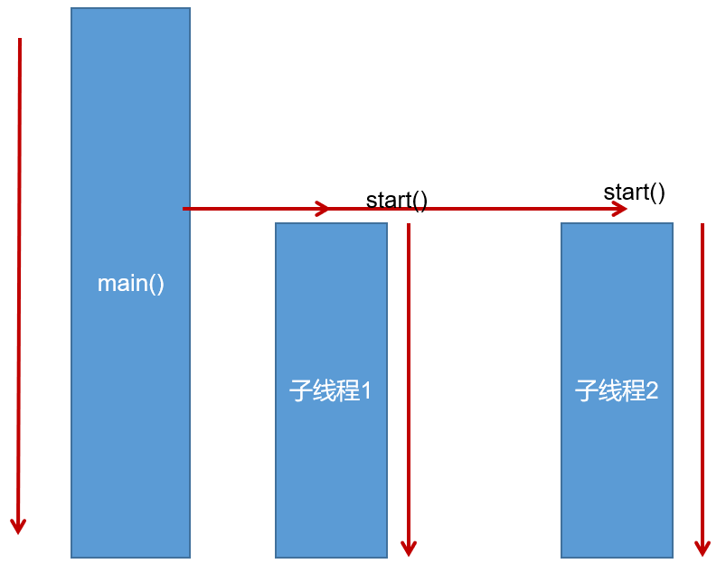

# 一、相关概念

## 1、多线程是什么？

现代操作系统（Windows，macOs，Linux）都可以执行多任务。

多任务就是同时运行多个任务，例如：edge、QQ、微信等，CPU执行代码都是一条一条顺序执行的，但是，即使是单核CPU，也可以同时运行多个任务。因为**操作系统执行多任务实际上就是让CPU对多个任务轮流交替执行**。

例如，让浏览器执行0.001每秒，让QQ执行0.001秒，再让音乐播放器执行0.001秒，在别人宏观看来，CPU就是在同时执行多个任务，但是微观上来说，单核CPU一次只执行一个任务。

即便是多核CPU，因为通常任务的数量远远多余CPU的核数，所以任务也是交替执行的。


## 2、程序、进程与线程

* **程序（program）**：为完成特定任务，用某种语言编写的`一组指令的集合`。即指`一段静态的代码`，静态对象。

* **进程（process）**：程序的一次执行过程，或是正在内存中运行的应用程序。如：运行中的QQ，运行中的网易音乐播放器。

  * 每个进程都有一个独立的内存空间，系统运行一个程序即是一个进程从创建、运行到消亡的过程。（生命周期）
  * 程序是静态的，进程是动态的
  * 进程作为`操作系统调度和分配资源的最小单位`（亦是系统运行程序的基本单位），系统在运行时会为每个进程分配不同的内存区域。
  * 现代的操作系统，大都是支持多进程的，支持同时运行多个程序。比如：现在我们上课一边使用编辑器，一边使用录屏软件，同时还开着画图板，dos窗口等软件。

* **线程（thread）**：进程可进一步细化为线程，是程序内部的`一条执行路径`。一个进程中至少有一个线程。例如，我们在使用word时，word可以让我们一边打字，一边进行拼写检查，同时还可以在后台进行打印，我们把子任务称为线程。

  - 一个进程同一时间若`并行`执行多个线程，就是支持多线程的。

    

  - 线程作为`CPU调度和执行的最小单位`。

  - 一个进程中的多个线程共享相同的内存单元，它们从同一个堆中分配对象，可以访问相同的变量和对象。这就使得线程间通信更简便、高效。但多个线程操作共享的系统资源可能就会带来`安全的隐患`。


> **`进程是操作系统调度和分配资源的最小单位。`**
>
> **`线程是CPU调度和执行的最小单位。`**

进程和线程的关系就是：一个进程可以包含一个或多个线程，但至少会有一个线程。


常见的Windows、Linux等操作系统都采用**`抢占式多任务`**，即如何调度线程完全由操作系统决定，程序自己不能决定什么时候执行，以及执行多长时间，但是我们可以给线程增加优先级，让系统调度时多考虑考虑调度该线程，但实际调度与否我们无法控制。

**什么是抢占式调度？**

让`优先级高`的线程以`较大的概率`优先使用CPU。如果线程的优先级相同，那么会随机选择一个（线程随机性），Java使用的为抢占式调度。操作系统使用的也是抢占式调度。


因为一个应用程序，既可以有多个进程，也可以有多个线程，因此，实现多任务的方法，有以下几种：

多进程模式（每个进程只有一个线程）：


多线程模式（一个进程有多个线程）：


多进程+多线程模式（复杂度最高）：


**进程 vs 线程**

进程和线程是包含关系，但是多任务既可以由多进程实现，也可以由单进程内的多线程实现，还可以混合多进程+多线程。具体采用哪种方式，要考虑进程和线程的特点。

|        | 优点                                                         | 缺点                                                         |
| ------ | ------------------------------------------------------------ | ------------------------------------------------------------ |
| 多进程 | 稳定性高（一个进程崩溃不会影响其他进程，而在多线程的情况下，任何一个线程崩溃会直接导致整个进程崩溃） | 开销大（创建进程比创建线程开销大）通信慢（进程间通信比线程间通信要慢，因为线程间通信就是读写同一个变量，速度很快。） |
| 多线程 | 开销小、通信快                                               | 稳定性差、复杂度高（多线程经常需要读写共享数据，并且需要同步。例如，播放电影时，就必须由一个线程播放视频，另一个线程播放音频，两个线程需要协调运行，否则画面和声音就不同步。因此，多线程编程的复杂度高，调试更困难） |

Java语言内置了多线程支持：一个Java程序实际上是一个JVM进程，JVM进程用一个主线程来执行main()方法，在main()方法内部，我们又可以启动多个线程。此外，JVM还有负责垃圾回收的其他工作线程等。因此，对于大多数Java程序来说，我们说多任务，实际上是说如何使用多线程实现多任务。


## 3、多线程程序的优点

**背景**：以单核CPU为例，只使用单个线程先后完成多个任务（调用多个方法），肯定比用多个线程来完成用的时间更短，为何仍需多线程呢？

**多线程程序的优点：**

1. 提高应用程序的相应。对图形化界面更有意义，可增强用户体验。
2. 提高计算机系统CPU的利用率。
3. 改善程序结构。将既长又复杂的进程分为多个线程，独立运行，利于理解和修改。


## 4、单核CPU和多核CPU

单核CPU，在一个时间单元内，只能执行一个线程的任务。例如，可以把CPU看成是医院的医生诊室，在一定时间内只能给一个病人诊断治疗。所以单核CPU就是，代码经过前面一系列的前导操作（类似于医院挂号，比如有10个窗口挂号），然后到cpu处执行时发现，就只有一个CPU（对应一个医生），大家排队执行。

这时候想要提升系统性能，只有两个办法，要么提升CPU性能（让医生看病快点），要么多加几个CPU（多整几个医生），即为多核CPU。

`问题：多核的效率是单核的倍数吗？`譬如4核A53的cpu，性能是单核A53的4倍吗？理论上是，但实际不可能，至少有两方面的损耗。

* `一个是多个核心的其他共用资源限制。`譬如，4核CPU对应的内存，cache、寄存器并没有同步扩充4倍。这就好像医院一样，1个医生换4个医生，但是做B超检查的还是一台机器，性能瓶颈就从医生转到B超检查了。
* `另一个是多核CPU之间的协调管理损耗。`譬如多个核心同时运行两个相关的任务，需要考虑任务同步，这也需要消耗额外性能。好比公司工作，一个人的时候至少不用开会浪费时间，自己跟自己商量就行了。两个人就要开会同步工作，协调分配，所以工作效率绝对不可能达到2倍。


## 5、并行和并发

* **并行（parallel）**：指两个或多个事件在`同一时刻`发生（同时发生）。指在同一时刻，有`多条指令`在`多个CPU`上`同时`执行。比如：多个人同时做不同的事。

事。


* **并发（concurrency）**：指两个或多个事件在`同一时间段内`发生。即在一段时间内，有`多条指令`在`单个CPU`上`快速轮换、交替`执行，使得在宏观上具有多个进程同时执行的效果。


在操作系统中，启动了多个程序，`并发`指的是在一段时间内宏观上有多个程序同时运行，这在单核CPU系统中，每一时刻只能有一个程序执行，即微观上这些程序是分时的交替运行，只不过给人的感觉是同时运行，那是因为分时交替运行的时间是非常短的。

而在多核CPU系统中，则这些可以`并发`执行的程序便可以分配到多个CPU上，实现多任务`并行`执行，即利用每个处理器来处理一个可以并发执行的程序，这样多个程序便可以同时执行。目前电脑市场上说的多核CPU，便是多核处理器，核越多，并行处理的程序越多，能大大的提高电脑运行的效率。


# 二、创建和启动线程的方式

## 1、概述

* Java语言的JVM允许程序运行多个线程，使用`java.lang.Thread`类代表**线程**，所有的线程对象都必须是Thread类或其子类的实例。
* Thread类的特性
  * 每个线程都是通过某个特定Thread对象的run()方法来完成操作的，因此把run()方法体称为`线程执行体`。
  * 通过该Thread对象的**`start()`**方法来启动这个线程，而非直接调用run()方法。
  * 要想实现多线程，必须在主线程中创建新的线程对象。

**无论使用哪一种方式去创建多线程，都必须创建Thread对象，通过Thread对象中的start()方法启动：**

**`start()`方法的作用是：**

1. 启动线程
2. 调用Thread类中的run()方法


## 2、方式1：继承Thread类

Java通过继承Thread类来**创建**并**启动多线程**的步骤如下：

> 1. 创建一个继承于`Thread`类的子类
> 2. 重写`Thread`类的`run()`方法，将此线程要执行的操作，声明在`run()`方法体中
> 3. 创建当前`Thread`类的子类的对象
> 4. 通过对象调用`start()`

代码案例：

```java
public class EvenNumberTest {
    public static void main(String[] args) {
        PrintNumber t1 = new PrintNumber();
        t1.start();
        for (int i = 0; i < 100; i++) {
            System.out.println(Thread.currentThread().getName() + "中的main()方法");
        }
    }
}

class PrintNumber extends Thread{
    @Override
    public void run() {
        for (int i = 0; i < 100; i++) {
            System.out.println(Thread.currentThread().getName() + "中的run()方法");
        }
    }
}
```

打印结果：


可以发现，创建了一个线程，该线程名为Thread-0，main方法的线程名为main。


**`Thread.currentThread()`**：用于获取当前的线程

其中的`getName()`方法用于获取当前线程名。


在创建线程对象的时候，就会给线程取名，取名的方式是：`Thread-nextThreadNum()`，其中nextThreadNum()的返回值根据threadInitNumber的值，初始值是0，每次创建一个线程都会+1。


对于只使用一次的线程，我们一般使用**匿名子类的对象**方式去创建：

例如，创建两个线程，一个线程打印100以内所有的奇数，一个线程打印100以内所有的偶数：

```java
public class EvenNumberTest {
    public static void main(String[] args) {
        Thread t1 = new Thread(){
            @Override
            public void run() {
                for (int i = 1; i < 100; i += 2) {
                    System.out.println(i);
                }
            }
        };
        Thread t2 = new Thread(){
            @Override
            public void run() {
                for (int i = 2; i <= 100; i += 2) {
                    System.out.println(i);
                }
            }
        };
        t1.start();
        t2.start();
    }
}
```



> **注意：**
>
> 1. 如果要想启动多线程，必须调用**`start()`**方法，而不能调用run()方法。单纯调用run()方法不会启动线程，不会分配新的分支线。
>
>    start()方法的作用是：启动一个分支线程，在JVM中开辟一个新的栈空间，这段代码任务完成之后，瞬间就结束了，线程就启动成功了。
>
> 2. run()方法由JVM调用，什么时候调用、执行的过程控制都有操作系统的CPU。run()方法在分支栈的底部，main方法在主栈的栈底部，run和main是平级的。
>
> 3. 一个线程对象只能调用一次start()方法启动多线程，如果多调用了，则将抛出异常：**`IllegalThreadStateException`**。


## 3、方式2：实现Runnable接口

Java有单继承的限制，当我们无法继承Thread类时，那么该如何做呢？在核心类库中提供了Runnable接口，我们可以实现Runnable接口，重写run()方法，然后再通过Thread类的对象代理启动和执行我们的线程体run()方法。

**步骤如下：**

> 1. 定义`Runnable`接口的实现类，并重写该接口的``run()`方法，该`run()`方法的方法体同样是该线程的线程执行体。
> 2. 创建`Runnable`实现类的实例，并以此实例作为`Thread`的`target`参数来创建`Thread`对象，该`Thread`对象才是真正的线程对象。
> 3. 调用线程对象的`start()`方法，启动线程。此时，就会去调用Runnable接口实现类中的run()方法。

Runnable接口只提供一个run()方法，我们无论是使用继承Thread类的方式创建多线程，还是使用实现Runnable接口的方式实现，实际上都是重写了该run()方法，然后通过Thread类去创建多线程。


在使用实现Runnable接口创建多线程这种方式时，可以使用采取一种参数的构造器，也可以使用两种参数的构造器：


其中，两种参数的构造器第二个参数用于指定新建的线程名称。

**使用案例：**

```java
class EvenNumberPrint implements Runnable{
    @Override
    public void run() {
        for (int i = 1; i <= 100; i++) {
         System.out.println(Thread.currentThread().getName() + ":" + i);
        }
    }
}

public class EvenNumberTest {
    public static void main(String[] args) {
        EvenNumberPrint p = new EvenNumberPrint();
        Thread t1 = new Thread(p);
        //第二个参数可用于指定线程名
        Thread t2 = new Thread(p, "第二条线程");
        t1.start();
        t2.start();
        //main()方法对应的主线程执行的操作
        for (int i = 1; i <= 100; i++) {
		 System.out.println(Thread.currentThread().getName() + ":" + i);
        }
    }
}
```

打印结果：


同样地，对于使用实现Runnable接口的方式创建多线程，也可以使用匿名实现类的方式。当该线程只使用一次，或者只在当前类中使用的情况下，就可以使用匿名实现类的方式去创建Runnable接口的实现类，从而创建多线程。

案例：

```java
new Thread(new Runnable() {
            @Override
            public void run() {
                for (int i = 0; i < 100; i++) {
          			System.out.println(Thread.currentThread().getName() + ":" + i);
                }
            }
        }).start();
```

这里就是给Thread构造器中的target参数进行了匿名实现类的创建。

通过实现Runnable接口，使得该类有了多线程类的特征。所有的分线程要执行的代码都在run()方法里面。

在启动多线程的时候，需要先通过Thread类的构造方法Thread(Runnable target)构造出对象，然后调用Thread对象的start()方法来运行多线程代码。

实际上，所有的多线程代码都是通过运行Thread的start()方法来运行的。因此，不管是继承Thread类还是实现Runnable接口来实现多线程，最终还是通过Thread的对象的API来控制线程的，熟悉Thread类的API是进行多线程编程的基础。

说明：Runnable对象仅仅作为Thread对象的target，Runnable实现类里面包含的run()方法仅作为线程执行体。而实际的线程对象依然是Thread实例，只是该Thread线程负责执行其target的run()方法。


> 对于以上两种创建线程的方式，更加推荐第二种，即使用实现Runnable接口的方式去创建多线程。


## 4、对比两种方式

**联系**：

实际上，Thread类也是实现了Runnable接口的类。即：

```java
public class Thread extends Object implements Runnable
```

即Thread类中的run()方法也是通过实现Runnable接口获得的，我们使用继承Thread类的方式去创建多线程中，重写的run()方法追根到底是重写的Runnable接口中的run()方法。

这里其实是一种设计模式：代理模式

原本我们是需要去实现Runnable接口，重写其中的run()方法，从而创建多线程；

但是如果我们通过继承Thread类的方式去创建多线程，实际上Thread也是通过实现Runnable接口的方式去创建多线程，所以Thread是一个代理类，我们通过这个代理类间接地实现Runnable接口，从而创建多线程。


Thread类中的run()方法实际上调用的就是Runnable接口中的run()方法。

**区别**：

- 继承Thread：线程代码存放Thread子类run方法中。

- 实现Runnable：线程代码存在接口的子类的run方法。

**实现Runnable接口比继承Thread类所具有的优势**

- 避免了单继承的局限性
- 多个线程可以共享同一个接口实现类的对象，非常适合多个相同线程来处理同一份资源。
- 增加程序的健壮性，实现解耦操作，代码可以被多个线程共享，代码和线程独立。

**使用匿名内部类对象来实现线程的创建和启动**

```java
new Thread("新的线程！"){
	@Override
	public void run() {
		for (int i = 0; i < 10; i++) {
			System.out.println(getName()+"：正在执行！"+i);
		}
	}
}.start();
```

```java
new Thread(new Runnable(){
	@Override
	public void run() {
		for (int i = 0; i < 10; i++) {
			System.out.println(Thread.currentThread().getName()+"：" + i);
		}
	}
}).start();
```


## 5、方式3：(JDK5.0新增)

## 6、方式4：（JDK5.0新增）


# 三、Thread类的常用结构

## 1、构造器

* **`public Thread()`**：分配一个新的线程对象。
* **`public Thread(String name)`**：分配一个指定名字的新的线程对象。
* **`public Thread(Runnable target)`**：指定创建线程的目标对象，它实现了Runnable接口中的run()方法。
* **`public Thread(Runnable target, String name)`**：分配一个带有指定目标新的线程对象并指定名字。

对于第一种、第二种构造器，一般用于使用继承Thread的方式去创建多线程；

第三种、第四种构造器，一般用于使用实现Runnable接口的方式创建多线程。

对于未使用指定线程名的方式，创建的线程会使用默认的线程名称：

`Thread-创建的线程数量`（从0开始）


对于第二种构造器：public Thread(String name)，对应于继承于Thread类的方式创建多线程，由于需要创建一个Thread子类类，该子类中只有默认的空参构造器，所以若需要使用此构造器，则需要在类中创建一个带String参数的构造器，例如：

```java
class ThreadConstructor extends Thread{
    @Override
    public void run() {
        for (int i = 0; i < 100; i++) {
            System.out.println(Thread.currentThread().getName() + i);
        }
    }
    
    //若想要使用带String参数的构造器创建Thread类
    //则需要在子类中也创建一个带参的构造器
    public ThreadConstructor(String name) {
        super(name);
    }
}

public class ThreadConstructorTest {
    public static void main(String[] args) {
        ThreadConstructor t1 = new ThreadConstructor("第一条线程");
        t1.start();
        for (int i = 0; i < 100; i++) {
            System.out.println(Thread.currentThread().getName() + i);
        }
    }
}
```


## 2、常用方法及使用案例

### **常用方法**

1. **`public void start()`**：①启动线程；②调用线程的run()方法。

   

2. **`public void run()`**：将线程要执行的操作，声明在run()方法中。

   

3. **`public static Thread currentThread()`**：获取当前正在执行的线程。若使用的是Thread子类的方式创建多线程，则在该类中可直接使用this表示当前线程。该方法一般用于主线程或使用Runnable接口的方式创建多线程中。

   

4. **`public String getName()`**：获取当前线程名称。

   

5. **`public void setName(String name)`**：设置该线程名称。

   

6. **`public static native void sleep(long millis) throws InterruptedException;`**：使当前正在执行的线程以指定的毫秒数暂停（暂时停止执行）。该方法会报编译时异常：`InterruptedException`，即中断异常。

   

7. **`public static void yield()`**：一旦执行到此方法，就释放当前线程的CPU执行权。执行该方法，是希望当前线程释放CPU执行权，让优先级更高或者相等的线程获得执行权，但是只是希望，没有一定。释放CPU执行权后，有可能优先级更低的线程获得执行权，也可能该线程重新又获取执行权。即该方法的作用在于让线程从“`运行状态`”回到“`就绪状态`”。注意：在回到就绪之后，当前线程有可能还会再次抢到CPU的执行权。

   

8. **`public final void join() throws InterruptedException`**：暂停线程的执行，等待该调用该方法的线程停止运行后，当前线程再执行。

   该方法也会抛出编译时异常，需要进行try-catch处理。

   `void join(long millis)`：等待调用该方法的线程停止运行的时长最长为millis毫秒。如果millis时间已到，将不再等待。

   `void join(long millis, int nanos)`：等待线程停止的时间最长为millis毫秒 + nanos纳秒。

   join()方法是非static的，因为是需要指定当前线程等待哪一个线程停止执行完毕，故需要使用对象进行调用。

   若在当前线程中，使用当前线程对象去调用join方法，含义是当前线程等待当前线程停止执行后再去执行，听起来感觉很绕，实际的效果就是当前线程停止执行

   在实际的开发中，比如我们一个线程，要去联网获取结果，此时我们就可以另开一个线程，让另一个线程用于获取网络中的结果，当前线程使用join()方法等待另一个线程执行完毕，得到想要的结果后再去执行。

   

9. **`public final native boolean isAlive()`**：判断当前线程是否存活。

   

10. **`public final void stop()`**：**已过时**，不建议使用。强行结束一个线程的执行，直接进入死亡状态。run()即刻停止，可能会导致一些请理性的工作得不到完成，如文件，数据库等的关闭。同时，会立即释放该线程所持有的所有锁，导致数据得不到同步的处理，出现数据不一致的问题。

    

11. **`void suspend()/void resume()`**：**已过时**，不建议使用。这两个操作就好比播放器的暂停和恢复。二者必须成对出现，否则非常容易发生死锁。suspend()调用会导致线程暂停，但不会释放任何锁资源，导致其他线程都无法访问被它占用的锁，直到调用resume()。


### 与优先级有关的方法

每个线程都有一定的优先级，同优先级线程组成先进先出（先到先服务），使用分时调度策略。优先级高的线程采用抢占式策略，获得较多的执行机会。每个线程默认的优先级都与创建它的父线程具有相同的优先级。

* **Thread类的三个优先级常量：**
  * **`MAX_PRIORITY(10)`**：最高优先级
  * **`MIN_PRIORITY(1)`**：最低优先级
  * **`NORM_PRIORITY(5)`**：普通优先级，默认情况下main线程具有普通优先级。
* **`public final int getPriority()`**：返回线程的优先级
* **`public final void setPriority(int newPriority)`**：改变线程的优先级，范围在[1, 10]之间。

其实，优先级并不代表着一定、肯定的含义，而是表示**`概率`**。**优先级高的线程代表被CPU执行的概率更高，机会更大**，但不是一定，有可能优先级低的线程，CPU给与的资源更多，有可能优先级低的线程执行完毕了优先级高的线程还未执行，只不过优先级高的线程更有可能被执行罢了。


### 与线程间通信有关的方法

1. sleep()
2. wait()
3. notify()
4. notifyAll()

### 方法使用案例

* **sleep(long millis)方法案例：**

```java
public class ThreadConstructorTest {
    public static void main(String[] args) {
        ThreadConstructor t1 = new ThreadConstructor();
        t1.start();
        for (int i = 0; i < 100; i++) {
            System.out.println(Thread.currentThread().getName()+ ":" + i);
        }

    }
}

class ThreadConstructor extends Thread{
    @Override
    public void run() {
        try {
            sleep(100);
        } catch (InterruptedException e) {
            throw new RuntimeException(e);
        }
        for (int i = 0; i < 100; i++) {
            System.out.println(Thread.currentThread().getName() + ":" + i);
        }
    }
}
```

由于支线程开始睡眠了100毫秒，所以CPU一开始只能调用主线程进行执行。


注意：

**在run()方法中调用sleep()方法，只能使用try-catch方法处理异常**，不能使用throws向上抛，原因在于所有的run()方法都是重写Runnable接口中的run()方法，在Runnable接口中的run()方法没有抛异常：


对于重写的方法，其抛出的异常范围不能大于被重写的方法，run()方法未抛出异常，则其重写的方法也不能抛出异常，故其中的sleep()方法只能使用try-catch的方式处理。


* **yield()方法与优先级方法的使用案例：**

```java
//使用实现Runnable接口的方式创建线程
class PriorityTest implements Runnable{

    @Override
    public void run() {
        for (int i = 0; i < 100; i++) {
            System.out.println(Thread.currentThread().getName() + ":" + i);
        }
    }
}

public class ThreadPriorityTest {
    public static void main(String[] args) {
        //创建两个线程
        Thread t1 = new Thread(new PriorityTest(), "优先级为1的线程");
        Thread t2 = new Thread(new PriorityTest(),"优先级为10的线程");
        //设置两个线程的优先级，分别设置为1和10
        t1.setPriority(1);
        t2.setPriority(10);
        
        //其实默认情况下main线程的优先级就是5
        Thread.currentThread().setPriority(5);
        
        //启动线程
        t1.start();
        t2.start();
        for (int i = 0; i < 100; i++) {
            //释放CPU，目的是希望让优先级更高或者相等的线程执行，也可能出现优先级低的线程执行或者当前线程又继续执行的情况
            Thread.yield();
            System.out.println(Thread.currentThread().getName() + ":" + i);
        }
    }
}

```

部分打印结果：


从打印结果我们可以得知，释放main线程的执行权后，既有可能当前线程继续获得CPU执行权，继续执行；也有可能是优先级高的线程获得CPU的执行权；还有可能优先级低的线程获得。

其实，优先级并不代表着一定、肯定的含义，而是表示概率。优先级高的线程更高概率地获得CPU的执行权，优先级低的线程更低概率地获得CPU执行权，但不是一定，CPU有可能先去执行优先级低的线程，只不过优先级高代表着执行概率更高罢了。


* **join()方法使用案例：**

```java
public class ThreadConstructorTest {
    public static void main(String[] args) {
        ThreadConstructor t1 = new ThreadConstructor();
        t1.start();
        for (int i = 0; i < 100; i++) {
            System.out.println(Thread.currentThread().getName()+ ":" + i);
            if (i == 20){
                try {
                    //等待t1线程执行完毕后，当前线程再执行
                    t1.join();
                } catch (InterruptedException e) {
                    throw new RuntimeException(e);
                }
            }
        }

    }
}

class ThreadConstructor extends Thread{
    @Override
    public void run() {
        for (int i = 0; i < 100; i++) {
            try {
                sleep(100);
            } catch (InterruptedException e) {
                throw new RuntimeException(e);
            }
            System.out.println(this.getName() + ":" + i);
            if (i % 20 == 0){
                Thread.yield();
            }
        }
    }
}
```

上例中，mian线程中，当i==20时，调用Thread-0线程的join()方法，意思是等待Thread-0线程执行完毕之后再去执行。打印结果：


同理，如果join()方法会抛出编译时异常，也只能使用try-catch进行处理。


# 四、多线程的生命周期(JDK1.5之后)

## 线程的六种状态

在java.lang.Thread.State的枚举类中这样定义线程的状态：

```java
public enum State {
	NEW,
	RUNNABLE,
	BLOCKED,
	WAITING,
	TIMED_WAITING,
	TERMINATED;
}
```

首先我们展示一下整个线程状态转换流程图，下面我们将进行详细的介绍讲解，如下图所示，我们可以直观的看到六种状态的转换。


* **`NEW`**-初始状态，一个新创建的线程，还没开始执行。
* **`RUNNABLE`**-可执行的状态，要么是在执行，要么是一切就绪等待执行，例如等待分配CPU时间。
* **`BLOCKED`**-被阻塞状态，等待锁，以便进入同步块中。
* **`WAITING`**-等待状态，等待其他线程去执行特定的动作，没有时间限制。
* **`TIMED_WAITING`**-限时等待状态，等待其他的线程去执行特定的动作，这个是在一定的时间范围内的。
* **`TERMINATED`**-终止状态，线程执行结束。

在我们程序编码中如果想要确定线程当前的状态，可以通过`getState()`方法来获取，同时我们需要注意任何线程在任何时刻都只能是处于一种状态。

### 1、`NEW`

**创建新线程的状态，处于`NEW`的线程被创建出来后还未被执行的**。

NEW表示线程被创建但尚未启动的状态：当我们用new Thread()新建一个线程时，如果线程没有开始运行start()方法，那么线程也就没有开始执行run()方法里面的代码，那么此时它的状态就是NEW。而一旦线程调用了start()，它的状态就会从NEW 变为RUNNABLE。

下面的代码显示了一个NEW状态的线程：

```java
Thread t = new MyThread();
```

### 2、`RUNNABLE` 

**我们创建一个线程，然后调用了`start()`方法，那么这个线程就从`NEW`变为了`RUNNABLE`状态。**

Java中的RUNNABLE状态对应操作系统线程状态中的两种状态，分别是RUNNING和READY，也就是说，**Java中处于RUNNABLE状态的线程有可能正在执行，也有可能没有正在执行，正在等待被分配CPU资源**。

由于JVM无法控制CPU何时进行调度，所以JVM无法控制当前的线程是准备状态还是运行状态，故将原本属于两个状态的READY和RUNNING，将其归于一种线程状态RUNNABLE，这样方便JVM表示。

所以，如果一个正在运行的线程是RUNNABLE状态，当它运行到任务的一半时，执行该线程的CPU被调度去做其他事情，导致该线程暂时不运行，它的状态依然不变，还是RUNNABLE，因为它有可能随时被调度回来继续执行任务。

JVM中的`Thread-Scheduler`(线程调度器)会为每个线程分配一个固定的执行时间，所以一个线程一次就只执行一段时间，时间到了以后，就会让其他的RUNNABLE状态的线程执行。

下面的代码中，线程处于`RUNNABLE`状态：

```java
Thread t = new MyThread();
t.start();
```

### 3、`BLOCKED` 

```java
//TODO
```


### 4、`WAITING` 


### 5、`TIMED_WAITING` 


## 线程状态间转换


## 总结

最终线程的生命周期图如下所示：


**参考资料：**

[线程的生命周期及其六种状态的转换 - 知乎 (zhihu.com)](https://zhuanlan.zhihu.com/p/267331681)

[图解 Java 线程生命周期-腾讯云开发者社区-腾讯云 (tencent.com)](https://cloud.tencent.com/developer/article/1683376)


# 五、线程的安全问题及解决方式

当我们使用多个线程访问**同一资源**（可以是同一个变量、同一个文件、同一条记录等）的时候，若多个线程`只有读操作`，那么不会发生线程安全问题。但是如果多个线程对资源有`读和写`的操作，就容易出现线程安全问题。

举例：


账户里面有3000块钱，你去取2000块钱，当还没取出来的时候，这个时候，若你妻子也去取2000块钱，因为你还没取出来2000块钱，判断还剩下3000块钱，她也能取出2000块钱。这个时候，两个人都取2000块钱，都可以取出来，余额结果变为-1000了。

这就是因为余额这个变量，没有锁起来，两个都同时进行写操作，会造成线程安全问题。


这里就出现了线程安全的问题，原本应该在


# 六、同步


# 七、线程间的通信

