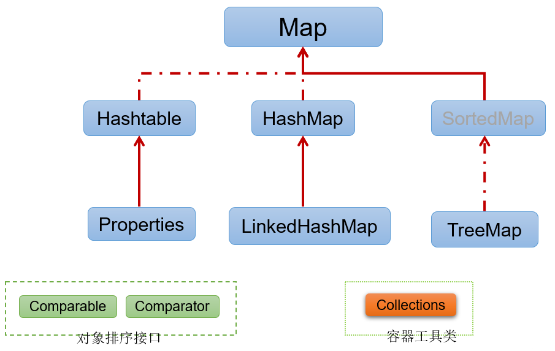

# 集合框架概述

## 数组的特点与弊端

* 一方面，面向对象语言对事物的体现都是以对象的形式，为了方便对多个对象的操作，就要对对象进行存储。
* 另一方面，使用数组存储对象方面具有`一些弊端`，而Java集合就像一种容器，可以`动态地`把多个对象的引用放入容器中。
* 数组在内存存储方面的`特点`：
  * 数组初始化以后，长度就确定了。
  * 数组中的添加的元素是依次紧密排序的，有序的，可以重复的。
  * 数组声明的类型，就决定了进行元素初始化时的类型。不是此类型的变量，就不能添加。
  * 可以存储基本数据类型值，也可以存储引用数据类型的变量。
* 数组在存储方面的`弊端`：
  * 数组初始化以后，长度就不可变了，不便于扩展。
  * 数组中提供的属性和方法少，不便于进行添加、删除、插入、获取元素个数等操作，且效率不高。
  * 数组存储数据的特点单一，只能存储有序的、可以重复的数据，无法存储要求是无序的、不可重复的数据。
* Java集合框架中的类可以用于存储多个`对象`，还可以用于保存具有`映射关系`的关联数组。

## Java集合框架体系

Java集合可分为**`Collection`**和**`Map`**两大体系：

* **`Collection`**接口：用于存储一个一个的数据，也称为`单列数据集合`。
  * **`List`子接口**：用来存储**有序的、可以重复的**数据（主要用来替换数组，“动态”数组）
    * 实现类：ArrayList（主要实现类）、LinkedList、Vector
  * **`Set`子接口**：用来存储**无序的、不可重复的**数据（类似于高中讲的“集合”）
    * 实现类：HashSet（主要实现类）、LinkedHashSet、TreeSet
* **`Map`**接口：用于存储具有映射关系“key-value对”的集合，即一对一对的数据，也称`双列数据集合`。（类似于高中的函数、映射。(x1, y1), (x2, y2) -> y = f(x)）
  * HashMap（主要实现类）、LinkedHashMap、TreeMap、Hashtable、Properties
* JDK提供的集合API位于java.util包内

* **Collection接口继承数**：

* **Map接口继承树**

# 总结

