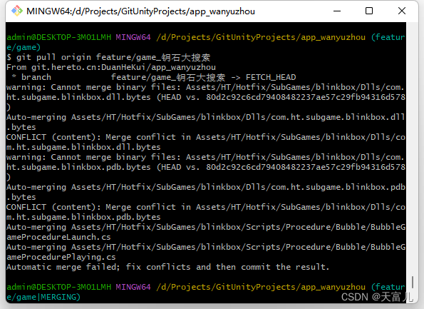

# Git合并出现MERGING有效解决方法

## 1、错误描述

在操作git合并的时候，若出现冲突，则会出现MERGING，如图所示：

百度上说的方法，在命令行输入：`get reset --hard HEAD`就可以了，其实这种方法是错的，这时撤销合并，不能随便撤销，得根据实际情况，要是直接照敲进去，可能自己辛辛苦苦写的代码就没了。

> * `--hard`删除工作空间改动代码，撤销`commit`，撤销`git add .`；
> * `git reset --hard HEAD`表示回退到当前版本，`HEAD`指向当前版本。如果你修改了一些代码，想去除，就可以用`git reset --hard HEAD`一次性去除；
> * `git reset --hard HEAD^`表示回退到上一个版本。
> * `git reset --hard 版本号`回退到指定版本，`reset`是指将`HEAD`指针指到指定提交，历史记录中不会出现放弃的提交记录。

## 解决办法

出现**MERGING**：就先把冲突文件修改好后，用`git status`查看下暂存区修改后的文件状态。

然后根据上面的文件状态修改文件/脚本，修改后直接push。

这个时候发现**MERGING**已经没有了。