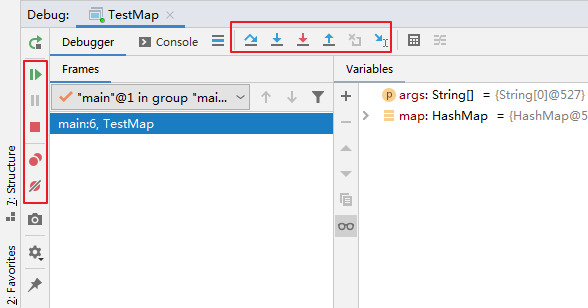

#  单步调试工具介绍


或



：Step Over（F8）：进入下一步，如果当前行断点是调用一个方法，则不进入当前方法体内

：Step Into（F7）：进入下一步，如果当前行断点是调用一个自定义方法，则进入该方法体内

：Force Step Into（Alt +Shift  + F7）：进入下一步，如果当前行断点是调用一个核心类库方法，则进入该方法体内

：Step Out（Shift  + F8）：跳出当前方法体

：Run to Cursor（Alt + F9）：直接跳到光标处继续调试

：Resume Program（F9）：恢复程序运行，但如果该断点下面代码还有断点则停在下一个断点上

：Stop（Ctrl + F2）：结束调试

：View Breakpoints（Ctrl + Shift  + F8）：查看所有断点

：Mute Breakpoints：使得当前代码后面所有的断点失效， 一下执行到底 

> 说明：在Debug过程中，可以动态的下断点。


# 各种断点的使用

## 行断点

行断点，在日常开发中最常用的方式。添加一个行断点很简单，在需要添加断点的gutter上鼠标左键点击，或者光标定位到需要设置断点的代码行，按Ctrl + F8即可。


执行到此行时，会停下来。断点添加成功后，gutter上会显示一个红色的圆点。接下来，使用debug方式运行程序，就可以对代码进行调试了。

## 方法断点

添加方法断点和添加行断点的步骤一样，两者只是外观上有些不同，方法断点用红色的菱形表示。


方法断点设置在方法的签名上。

右击方法断点，对方法断点进行设置：

* 默认方法进入时，断点被唤醒。
* 也可以设置在方法退出时，断点被唤醒。


那么方法断点有什么作用呢？举个例子：


假设有如上类实现关系，代码实现如下所示：

```java
public class ServiceImplA implements Service{
    @Override
    public String method() {
        return "hello A";
    }
}

public class ServiceImplB implements Service{
    @Override
    public String method() {
        return "hello B";
    }
}
```

有如下调用：

```java
public String hello(){
	//假设通过看代码很难确定是哪个实现类的实例
	Service service = createService();
	return service.method();
}
```

这个时候，我们不能一眼看出service是ServiceImplA的实例，还是ServiceImplB的实例（这个例子代码比较简单，像Spring这类开源框架要复杂很多）。

这个时候就可以使用到方法断点了，在接口Service的method()上打一个断点：


运行程序，查看效果：


可以看到，hello()方法中的service.method()真正调用的是ServiceImplA的method()方法。


## 字段断点

字段断点也是一个看源码的神器。当一个成员变量被多方引用时，它可以精准的找到谁读取、修改了它的值。

字段断点设置在成员变量上：


字段断点使用一个红色的眼睛来表示，可谓是非常形象了。就像给成员变量安排了专门盯梢的人，有任何风吹草动就第一时间告诉你。

例如，运行程序，看下效果：


可以看到，精准地定位到hello被赋值的位置。

同时，可以对字段断点进行配置：


可以选择：

* 默认是字段被修改时，断点被唤醒。
* 可以设置当字段被访问时，断点被唤醒。


## 条件断点

对于任何一个断点来说，都可以进行条件设置：


若设置了条件，只有当条件也满足时，断点才会被唤醒。

例如：

```java
public class Debug04 {
    public static void main(String[] args) {
        int[] arr = new int[]{1,2,3,4,5,6,7,8,9,10,11,12};

        for (int i = 0; i < arr.length; i++) {
            int target = arr[i];
            System.out.println(target);
        }
    }
}
```

针对上述代码，在满足arr[i] % 3 == 0 的条件下，执行断点：


## 异常断点

异常断点在我们修复bug的时候很有用，可以精确的定位到发生指定类型异常的代码行。


异常断点用一个红色的闪电表示（断点响应之后才会显示）。

使用快捷键Ctrl + Shift + F8打开断点管理对话框，按如下步骤进行添加：


设置断点响应的异常类型：


运行程序，查看效果：


可以看到，当发生指定异常后，程序停在了发生异常的代码行，并在前面放一个红色的闪电，提醒你就是这行代码要搞事情。

异常断点同样支持配置：


