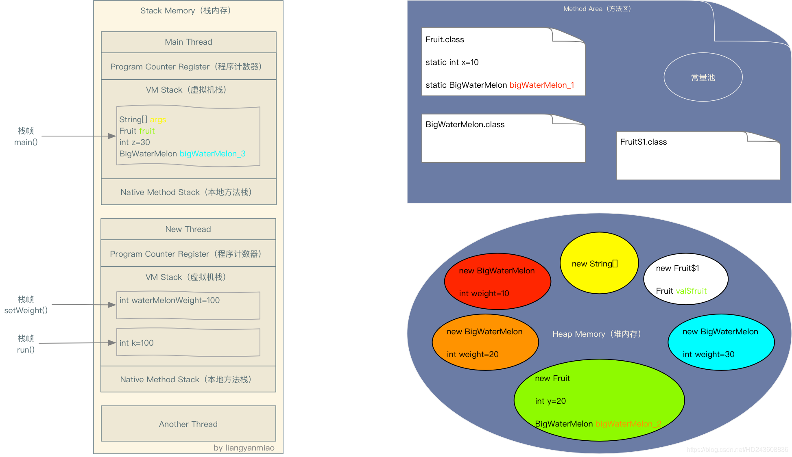

## JVM存储位置分配

### 总结

1. 凡是通过**`new出来`**的东西，都放在**`堆`**中。

   全局变量因为放在类里面，在使用的时候需要先将类对象new出来，才能使用其中的全局变量，所以**`全局变量也是放在堆中的`**。

2. **`栈`**里面放的是**`局部变量`**，包括创建出来的类对象，以及各种基本数据类型的变量。

3. **`方法区里的常量池`**存储的是**`常量`**以及**`静态变量`**

示例代码：

```java
class Fruit {
    static int x = 10;
    static BigWaterMelon bigWaterMelon_1 = new BigWaterMelon(x);

    int y = 20;
    BigWaterMelon bigWaterMelon_2 = new BigWaterMelon(y);
     
    public static void main(String[] args) {
        final Fruit fruit = new Fruit();
     
        int z = 30;
        BigWaterMelon bigWaterMelon_3 = new BigWaterMelon(z);
     
        new Thread() {
            @Override
            public void run() {
                int k = 100;
                setWeight(k);
            }
     
            void setWeight(int waterMelonWeight) {
                fruit.bigWaterMelon_2.weight = waterMelonWeight;
            }
        }.start();
    }

}

class BigWaterMelon {
    public BigWaterMelon(int weight) {
        this.weight = weight;
    }

    public int weight;

}
```

内存分配图：



同一种颜色代表变量和对象的引用关系。

由于方法区和堆内存的数据都是线程间共享的，所以线程Main Thread，New Thread和Another Thread都可以访问方法区中的静态变量以及访问这个变量所引用的对象的实例变量。

**ps：方法区存储的都是只加载一次的。**

**栈内存中每个线程都有自己的虚拟机栈、程序计数器和本地方法栈，每调用一个方法，都会在虚拟机栈中创建一个栈帧，栈帧之间的数据互不相通（局部变量）**，每一个栈帧之间的数据就是线程独有的了。

**虚拟机栈：以栈帧为基本单位，有入栈和出栈操作；每个栈帧入栈操作对应一个方法的执行；方法内的局部变量会存储在栈帧中。**

比如线程New Thread中setWeight方法是不能访问线程Main Thread中的局部变量bigWaterMelon_3，setWeight()方法也不能访问run()方法中定义的变量k。

但是我们发现setWeight却访问了同为Main Thread局部变量的“fruit”，这时为什么呢？因为"fruit"被声明为final了。

当"fruit"被声明为final后，"fruit"会作为New Thread的构造函数的一个参数传入New Thread，也就是堆内存中Fruit$1对象中的实例变量val$fruit会引用"fruit"引用的对象，从而New Thread可以访问到Main Thread的局部变量"fruit"。

> **当方法执行完毕之后，栈中的数据会被自动释放；**
>
> **堆中的数据不会自动释放，而是在某一时刻，Java虚拟机的回收机制来回收，才会被释放。**

