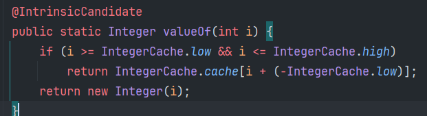
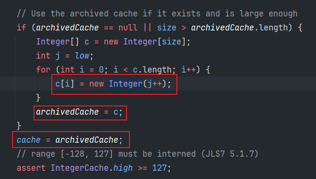

## 包装类的面试题

### 自动装箱或valueOf()方法创建包装类的特点

使用自动装箱的方式去创建包装类，实际上在底层还是会去调用valueOf()方法创建。



当满足i >= IntegerCache.low && i <= IntegerCache.high时，获得的Integer对象从现有的cache数组中获取的。其中Integer包装类中low的值是-128，high的值是127。

让我们来看看cache数组：



以上这段代码的含义就是，cache数组实际上就是一个Integer数组，保存的是-128 ~127区间以内的Integer对象，在Integer类加载的时候就会被创建出来。

> **当我们使用自动装箱（或者valueOf()方法)的方式去创建Integer对象时，如果数值满足在-128~127区间以内，是直接从cache数组中获取已创建的Integer对象。**
>
> **当值不在上述区间内时，自动装箱（valueOf()方法）获取到的包装类对象，则是通过new一个新的包装类对象的方式。**

这么做的好处是有利于节省内存空间。

以上也是一种设计模式：享元设计模式。

那么，根据以上的情况，有可能出现以下这些面试题：

```java
Integer a = 1;
Integer b = 1;
System.out.println(a == b);

Integer i = 128;
Integer j = 128;
System.out.println(i == j);

Integer m = new Integer(1);
Integer n = 1;
System.out.println(m == n);

Integer x = new Integer(1);
Integer y = new Integer(1);
System.out.println(x == y);
```

按照一般的想法来说，以上每一个Integer对象都属于新的对象，按理应该都是false才对。

但是，由于享元的设计，实际上输出的结果为：

```
true
false
false
false
```

原因就在于使用自动装箱或者valueOf()的方式创建Integer包装类对象时，若数值范围在-128~127内，则会从数组中获取Integer对象，而不是去新建一个。那么第一个a对象和b对象都是从数组中获取到的同一个对象，所以二者相等。

而i和j均超过了127，那么底层实际是去new一个对象的，所以二者不同。

对于m来说，它是new出来的，肯定和n不是同一个对象。

x和y更不用说了。

包装类缓存数值的范围都是多少呢？

#### **包装类缓存对象**

| 包装类    | 缓存对象    |
| --------- | ----------- |
| Byte      | -128~127    |
| Short     | -128~127    |
| Integer   | -128~127    |
| Long      | -128~127    |
| Float     | 没有        |
| Double    | 没有        |
| Character | 0~127       |
| Boolean   | true和false |

注意，对于Float和Double来说，没有缓存对象，每一个使用自动装箱方式创建的包装类都是新new的。

```java
Double d1 = 1.0;
Double d2 = 1.0;
System.out.println(d1==d2);//false
```


### 包装类与包装类之间，以及与基本数据类型运算的特点

我们先来说结论：

包装类与基本数据类型进行运算时，**`默认会对包装类进行拆箱`**，之后再进行运算。 

同理，如果是包装类与包装类之间进行运算，**`也会对两个包装类先进行拆箱转换成基本数据类型进行`**。

这是一种设定，在进行运算设定为会对包装类进行拆箱，而不是对基本数据类型进行装箱，我觉得是拆箱的成本比较低，包箱还需要去创建一个包装类对象。

案例：

```java
Integer x = 1000;
int y = 1000;
System.out.println(x == y);//true

Integer m = 1000;
double n = 1000;
System.out.println(m == n);//true

Integer a = 10;
Double b = 20.0;
System.out.println(a + b);//30.0
```

以上结果原因就在于，包装类与基本数据类型进行运算时，会对包装类进行拆箱，拆箱之后再使用其对应的基本数据类型进行运算。

同理，如果是包装类与包装类之间进行运算时，也会对包装类先进行拆箱，然后再进行运算。（当然，如果是==运算，比较的是类对象的地址值，而不会进行拆箱）


---


## 三元运算符的兼容性——类型必须一致

### 分析

当使用三元运算符，两边的操作数类型不一致时，这时候就会涉及到三元运算符的转换规则：

> 1. 若两个操作数不可转换，则不做转换，返回值为Object类型
> 2. 若两个操作数是明确类型的表达式（比如变量），则按照正常的二进制数字来转换。int转换为long类型，long类型转换成float类型。
> 3. 若两个操作数中有一个是数字S，另一个是表达式，且其类型为T，那么若数字S在T范围内，则转换为T类型；如S超过了T的范围，则T转换为S类型。
> 4. 若两个操作数都是直接数字，则返回值类型为数值类型范围较大者。

### 场景

```
System.out.println(true ? 90 : 100.0);

System.out.println(true ? new Integer(90) : new Double(100.0));
```

输出结果：


分析：

两个三元运算符条件都为真，那么返回的都是第一个值，所得的返回结果都是90.0，原因就在于90和100.0这两个数上面。

看第四个结论：`若两个操作数都是直接数字，则返回值类型为数值类型范围较大者。`

90属于int数据类型，100.0属于double数据类型，double数据类型范围较大，所以若第一个操作数是90，第二个操作数是100.0的话，第一个操作数就会被自动类型提升成double类型，故返回结果为90.0。

同理，对于Integer类型和Double类型来说，在进行运算时会先进行拆箱处理，然后进行三元运算符运算，此时二者的类型不同，则返回值类型为数值类型范围较大者，即double类型。


### 建议

保证三元运算符中的两个操作数类型一致，减少错误的发生。